<div style="margin-top:300px;">
    <h1>
		Dive into data mining 
    </h1>
</div>

<div style="page-break-after: always;"></div>
<div style="margin-top:300px;">
    <center>
    	<p>
            <i>
                Dal materiale didattico del corso Social Media Management tenuto
                dal professor A. Furnari ed alcuni concetti estratti dal corso 
                di Introduzione al data mining tenuto dai professori 
                M. Ferro e G. Micale, appunti a cura dello studente Lemuel Puglisi. 
                Dipartimento di matematica e informatica - UniCT, 2020
            </i>
        </p>
    </center>
</div>

Referenze: 

* Bishop, Christopher M. *Pattern recognition and machine learning*;
* Z. Aston Zhang, Zachary Lipton, Mu Li, Alexander Smola, *Dive into Deep Learning*;

<div style="page-break-after: always;"></div> 
[TOC] 
<div style="page-break-after: always;"></div> 
# Data mining

## 1. Introduzione

Il data mining consiste nell'estrazione di regolarità da grandi quantità di dati attraverso analisi, talvolta complesse, ed algoritmi efficienti e scalabili. Le informazioni cercate possono essere di vario genere: 

* Dipendenze tra dati
* Individuazione di classi (cluster)
* Descrizione delle classi (cluster)
* Individuazione di outliers / eccezioni 

Le aree applicative di tali studi sono generalmente l'analisi ed il supporto alle decisioni. Tuttavia, il target include anche text mining, analisi del web, intelligent query answering etc. 


## 2. Market Basket Analysis

Per introdurre il concetto di *regole associative*, presentiamo una applicazione paradigmatica di esse: il **Market Basket Analysis** (**MBA**).  Supponiamo di avere un insieme di oggetti (**items**) ed un insieme di carrelli (**baskets**) che correlano gli oggetti tra loro. L' MBA trova la correlazione tra gli oggetti studiando la relazione molti-a-molti con i carrelli. Tale tecnologia si concentra su eventi comuni anziché rari (outliers). 

Ipotizziamo di voler trovare l'insieme di oggetti che appare frequentemente all'interno dei carrelli. Sia *I* l'insieme di oggetti (***Itemset***), definiamo il ***supporto*** (Support) per *I* come il numero di carrelli contenenti tutti gli oggetti di *I*. A volte il supporto è espresso in percentuale (relativamente al numero di carrelli totali). Sia *s* la ***soglia*** o ***support threshold***, definiamo ***insiemi frequenti*** gli insiemi che appaino in almeno *s* carrelli. 


### 2.1 Applicazione 1 - Supermercato

Ipotizziamo che i prodotti di un supermercato siano gli oggetti e gli scontrini siano i carrelli, poiché mettono in relazione gli oggetti tra di loro. Una delle possibili applicazioni consiste nel trovare quali sono i prodotti acquistati insieme più frequentemente dai clienti. Una ricerca effettuata in America ha prodotto come risultato la correlazione tra pannolini e birra. Una volta estratta la correlazione, è possibile scontare il prezzo dei pannolini ed aumentare quello della birra (facendo attenzione al verso di acquisto, che in questo caso è pannolini > birra).  


### 2.2 Applicazione 2 - Plagiarism detection

Ipotizziamo che dei documenti testuali siano gli oggetti e che delle frasi siano i carrelli. Più documenti possono contenere la stessa frase, per cui connettono gli oggetti tra loro. È possibile notare come i carrelli **non debbano** necessariamente **contenere** gli oggetti, bensì correlarli in qualche modo tra loro. L'obiettivo della computazione potrebbe essere quello di scoprire dei plagi attravero documenti che compaiono spesso insieme, ovvero che formino un insieme frequente. 


 ### 2.3 Applicazione 3 - Web analysis

Ipotizziamo che delle parole siano gli oggetti e che le pagine web siano i carrelli, poichè esse contengono le parole e le mettono in relazione. Parole che appaiono frequentemente insieme nelle pagine web potrebbero indicare una interessante relazione.  


### 2.4 Words on the web 

Molte applicazioni del data mining sul web coinvolgono le parole, ad esempio per clusterizzare siti web per il contenuto, distinguere i blog utili dai blog inutili, determinare il sentimento di articoli o di commenti, partizionare pagine restituite da una query ambigua. 

Parole molto comuni vengono chiamate **stop words**. Esse raramente introducono una effettiva informazione e non aiutano a determinare il contenuto di un documento, vanno generalmente ignorate. Una metrica che ci aiuta a capire l'importanza di una parola è la **TF/IDF** (***Term Frequency over Inverse Document Frequency***). **TF** (*Term frequency*) è il numero di volte in cui la parola appare nei documenti, mentre **IDF** (*Inverse document frequency*) è il numero di documenti all'interno del cui appare. 

* Le coniugazioni appaiono in molti documenti e molto spesso, non introducono informazione utile. 
* Le parole informative (es. "Trading") appaiono in pochi documenti. Più volte appaiono in pochi documenti e più aiutano a determinare la natura di tali. 

<div style="page-break-after: always;"></div>

## 3. Regole associative

Le regole associative sono regole del tipo *se-allora* (if-then) sul contenuto dei basket e sono della forma: 
$$
\{i_1, i_2, ..., i_k\} \rightarrow j
$$
ovvero: "Se il basket contiene gli oggetti $i_1, ..., i_k$ allora molto probabilmente conterrà anche $j$". Definiamo la **confidenza** (confidence) di una regola di associazione come la probabilità di $j$ dati $i_1, ..., i_k$.  


### 3.1 Trovare le regole di associazione

Supponiamo di voler trovare tutte le regole di associazione tali che abbiano un **supporto** maggiore di *s* ed una **confidenza** maggiore di *c*. Si noti che per supporto si intende il supporto dell'itemset alla sinistra della regola. La parte computazionalmente difficile ed onerosa sta nel trovare gli ***insiemi frequenti***. 

***Osservazione***: 
$$
\{i_1, ..., i_k\} \rightarrow \text {j has high support and high confidence} \Longrightarrow \{i_1, ..., i_k\}
\text{ and }
\{i_1, ..., i_k, j\} 
\text{ will be frequent}
$$


### 3.2 Problemi pratici

Tipicamente i file contenenti i dati sono memorizzati nel disco (es. flat files, database). Data la massiva cardinalità dei dati, il costo principale degli algoritmi è dato dal numero di letture da disco. 


## 4. Algoritmi di ricerca di coppie frequenti 

Analizzando un algoritmo di ricerca degli insiemi frequenti, scoviamo subito che il costo principale è quello di cercare tra tutte le **coppie**: con 10<sup>k</sup> elementi, le coppie sono circa 10<sup>k*2</sup> elementi. Meno oneroso è il compito di cercare triple, quadruple etc. 

In generale: *la probabilità di essere insiemi frequenti diminuisce esponenzialmente all'aumentare della dimensione della tupla*. Il perché è dimostrabile in termini probabilistici. 
Vediamo adesso alcuni algoritmi che si occupano della ricerca di coppie frequenti. 


### 4.1 Naive algorithm 

Legge una sola volta l'intero file. Per ogni basket contenente n elementi, genera n(n-1)/2 paia e per ogni paio incrementa le sue occorrenze in una struttura apposita (es. matrice triangolare).  
Tale algoritmo fallisce se (#items)<sup>2</sup> provoca un overflow in memoria primaria (gli item potrebbero essere dell'ordine dei miliardi). Supponiamo vi siano 10<sup>5</sup> elementi in memoria e quindi: 
$$
\frac{10^5 * (10^5-1)}{2} \simeq 5*10^9 \space pairs
$$
Saranno necessari circa 20 GB di memoria primaria. 
Vi sono 2 approcci tipici al conteggio delle occorrenze delle coppie: la matrice triangolare e la tabella di triple. 


#### 4.1.1 Matrice triangolare 

Tale approccio consiste nel contare tutte le coppie attraverso una matrice triangolare. Supponendo che la matrice sia composta da interi, essa richiede 4 byte per paio. Supponiamo che le coppie vengano così considerate: 
$$
(1,2), (1,3),..., (1,n) \space // n-1 \space pairs\\
(2,3), (2,4),..., (2,n) \space // n-2 \space pairs\\
(i-1, i), (i-1, i+1), ..., (i-1, n) \space //n -(i-1) \space pairs
$$
Dati gli indici i,j è possibile effettuare una linearizzazione delle posizioni, sfruttando un array monodimensionale di dimensione n(n-1)/2 anziché una matrice. Nello specifico: 
$$
(i,j) = k = (i-1)(n-\frac{i}{2}) + j -i
$$

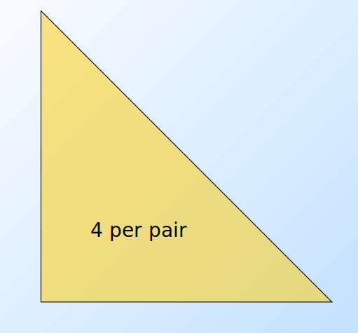


 #### 4.1.2 Tabella di triple

Un altro approccio consiste nel contare solo le coppie effettivamente presenti nei basket, quindi tenere una tripla di valori (i, j, c) tale che la coppia {i,j} abbia *c* occorrenze, con c > 0. Ogni tripla richiede 12 bytes, ma non tutte le coppie sono presenti in memoria. Tale approccio risulta conveniente rispetto alla matrice solo se occorrono al più 1/3 delle coppie totali, a causa del triplo della memoria utilizzata per ogni coppia (12 byte rispetto ai 4 della matrice). Potrebbe ulteriore spazio per strutture che facilitano l'accesso alla tabella, come delle hash table. 


### 4.2 A-Priori Algorithm 

L'algoritmo a-priori è diviso in due passaggi principali e limita la necessità di memoria primaria. L'idea principale è quella della ***monotonicità*** (*monotonicity*): se un insieme S di item appare almeno k volte, allora anche tutti i sottoinsiemi di S appaiono almeno k volte. 

>  **Contropositivo per le coppie**: Se un item *i* non appare in almeno s basket, allora nessuna coppia contenente i potrà apparire in almeno s basket. 

**Passo 1**: Leggere tutti i basket e contare in memoria principale le occorrenze di ogni item. Questo passaggio richiede che la memoria sia almeno proporzionale al numero di item. Consideriamo ***item frequenti*** (*frequent items*) gli item che compaiono almeno *s* volte.

**Passo 2**: Leggere nuovamente i basket, ma contare in memoria principale solo le coppie formate dagli elementi frequenti trovati al passo 1. Tale passo richiede una memoria proporzionale al quadrato del numero di elementi frequenti, più una lista degli elementi frequenti. 

È possibile utilizzare una matrice triangolare che referenzia solo gli item frequenti (o utilizzare il metodo delle triple). La mappatura degli item frequenti nella matrice sarà diversa da quella originale, per questo è consigliato tenere una tabella che ricolleghi gli indici della matrice con quelli originali. 

Supponiamo di voler trovare tuple di item di ordine k maggiore al secondo. Per ogni k consideriamo **due insiemi**: 

* **C<sub>k</sub>** = itemset di cardinalità k candidati ad essere frequenti, ovvero con un supporto > s, basandosi sulle informazioni degli itemset di cardinalità k-1. 
* **L<sub>k</sub>** = itemset di cardinalità k effettivamente frequenti. 

A partire dall'insieme C<sub>1</sub> di tutti gli item viene svolto il primo passo dell'algoritmo e prodotto l'insieme L<sub>1</sub> degli item frequenti. Da quest'ultimo, viene costruito l'insieme delle coppie C~2~ ed un secondo filtraggio produce gli insiemi frequenti di cardinalità 2 L~2~. Lo stesso procedimento viene eseguito per k=3, 4, ... e si può dimostrare che all'aumentare di k, l'algoritmo tende ad andare a convergenza più velocemente (in maniera esponenziale).  

> Per dati tipici nel MBA e un supporto richiesto dell'1%, k=2 richiede la maggior parte della memoria. 


Osservazioni: 

* C~1~ rappresenta tutti gli elementi
* L~k~ è composto da membri di C~k~ il cui supporto è > s 
* C~k+1~ è composto da insiemi in cui esiste un sottoinsieme residente in L~k~

<div style="page-break-after: always;"></div> 
# Clustering

## 1. Introduzione 

Il **clustering** è un processo che consiste nel raggruppare un insieme di oggetti in gruppi detti **cluster**, sulla base di una nozione di *distanza* tra gli oggetti. L'obiettivo del clustering è quello di raggruppare nello stesso cluster oggetti "simili" tra loro (o con bassa distanza reciproca) e in cluster diversi oggetti "dissimili" tra loro (o ad elevata distanza). 


### 1.1 Unsupervised learning 

Il clustering è un processo di unsupervised learning (apprendimento non supervisionato): si vuole suddividere un insieme di dati in *n* classi (o cluster) senza alcuna conoscenza a-priori di quante e quali siano le classi e le loro etichette. 

Esistono invece dei task, come la classificazione o la predizione, che necessitano di un apprendimento supervisionato (supervised learning). Partendo da un training set essi allenano un modello in grado di classificare nuovi dati o predire valori. 


## 2. Spazi metrici e funzione distanza 

Gli oggetti da raggruppare rappresentano punti appartenenti ad uno **spazio metrico**, cioè uno spazio in cui è definita una **funzione distanza D**. La definizione di una funzione distanza è cruciale per effettuare il clustering. Una funzione D definita su una coppia di punti di uno spazio metrico S è una misura di distanza se soddisfa le seguenti proprietà: 

$\text {1) } D(X,Y) \ge 0 \space \forall X,Y \in S \space e \space D(X,Y) = 0 \Longleftrightarrow X=Y$
$\text{2) simmetria: } D(X,Y) = D(Y,X) \space \forall X,Y \in S$
$\text{3) prop. triangolare: }  D(X,Y) + D(Y,Z) \ge D(X,Z) \space \forall X,Y,Z \in S$

<div style="page-break-after: always;"></div>

### 2.1 Spazio euclideo 

L'esempio più comune di spazio metrico è lo **spazio euclideo** ad *n* dimensioni $\R^n$, in cui i punti dello spazio sono vettori di numeri reali. La quantità *n* rappresenta il numero di dimensioni dello spazio. Le componenti dei vettori sono comunemente chiamate **coordinate** dei corrispondenti punti. Nelle applicazioni reali, le coordinate rappresentano gli attributi (o "**features**") degli oggetti dello spazio metrico. Una proprietà caratteristica degli spazi euclidei è che la media di un insieme di punti nello spazio è sempre definita ed è un punto nello spazio, chiamato **centroide** o **centro geometrico**. Di seguito è riportato un esempio di oggetti (cani) classificati in uno spazio euclideo a 2 dimensioni, secondo 2 attributi: altezza e peso.

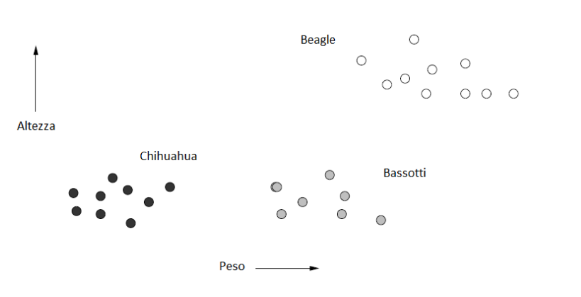


#### 2.1.1 Distanze nello spazio Euclideo

Nello spazio euclideo è possibile definire diverse misure di distanza valide (che rispettino le 3 proprietà). La funzione distanza più utilizzata è la **distanza euclidea**: Siano $x=(x_1,...,x_n)$ e $y=(y_1,...,y_n)$ due punti nello spazio $\R^n$, la *distanza euclidea* è così definita: 
$$
D(x,y)=\sqrt{\sum_{i=1}^{n}(x_i-y_i)^2}
$$


Esistono altri tipi di distanze, come la **distanza di Manhattan**
$$
D(x,y) = \sum_{i=1}^n |x_i -y_i|
$$
La **norma** $Lr$ è una generalizzazione della distanza euclidea dove sia la radice che l'esponente assumono un valore *r*, anziché 2: 
$$
D(x,y)=\sqrt[r]{\sum_{i=1}^{n}(x_i-y_i)^r}
$$
La **norma** $L_{\infty}$ prende la distanza massima tra le componenti delle n dimensioni: 
$$
D(x,y) = \max_{1\le i \le n}|x_i - y_i|
$$
La **distanza del coseno** misura la distanza dal punto di vista angolare: 
$$
D(x,y)=\arccos \frac{\sum_{i=1}^n x_i *y_i}{\sqrt{\sum_{i=1}^n x_i^2}\sqrt{\sum_{i=1}^n y_i^2}}
$$


### 2.2 Spazi non euclidei

In uno spazio non euclideo il concetto di centroide non è definito. In uno spazio metrico non euclideo si può definire il concetto di **1-mediana** come un punto che minimizza la distanza media (o equivalentemente la somma) delle distanza degli altri punti dell'insieme. Esempi di spazi non euclidei sono spazi in cui gli oggetti sono insiemi o stringhe. 

Per alcuni spazi non euclidei (come le versioni discrete degli spazi euclidei, o spazi formati da vettori di interi) è possibile utilizzare le distanze euclidee già viste. Nel caso più generale occorre definire metriche alternative. 

Es. con insiemi, **distanza di Jaccard**: Dati due insiemi T ed S, la distanza è definita come il rapporto tra la cardinalità dell'intersezione e la cardinalità dell'unione. 
$$
D(S,T)= 1 - \frac{|S \cap T|}{|S \cup T|}
$$


#### 2.2.1 Dim. Distanza di Jaccard e proprietà triangolare

Dimostriamo che la distanza di Jaccard rispetta la proprietà triangolare: 
$$
D(S_1,S_2) + D(S_2,S_3) = 
(1 - \frac{|S_1 \cap S_2|}{|S_1 \cup S_2|}) + (1 - \frac{|S_2 \cap S_3|}{|S_2 \cup S_3|})
$$
Dato che $S_1 \cup S_2$ ha cardinalità minore di $U = S_1 \cup S_2 \cup S_3$, possiamo maggiorare l'espressione come segue: 
$$
\frac{|T_1| + |T_2|}{|S_1 \cup S_2|} + \frac{|T_2| + |T_3|}{|S_2 \cup S_3|} \ge 
\frac{|T_1| + |T_2|}{|U|} + \frac{|T_2| + |T_3|}{|U|} = \\
\frac{|T_1| + 2|T_2| + |T_3|}{|U|} \ge
\frac{|T_1| + |T_2| + |T_3|}{|U|} =
1 - \frac{|V|}{|U|} \ge D(S_1,S_3)
$$
Per cui la proprietà risulta dimostrata. 


#### 2.2.2 Distanza di Edit e distanza di Hamming 

**Distanza di edit**: date due stringhe x e y, la distanza di edit è il minimo numero di operazioni di cancellazione e inserzione da effettuare partendo da x per ottenere y. 


```

    x = "abcde"
    y = "acfdeg"
    #1 cancella b => acde 
    #2 inserisci f dopo c => acfde
    #3 inserisci g dopo e => acfdeg
    D(x,y) = 3

```

 

**Distanza di Hamming** è il numero di componenti in corrispondenza delle quali x e y differiscono. Vediamo un esempio: 
$$
x = [1,0,0] \\
y = [1, 0, 1] \\
D(x,y) = 1
$$
Poiché differisce solo la terza componente. 


## 3. Tassonomie degli algoritmi di clustering

Una classificazione degli algoritmi di clustering si basa sull'approccio utilizzato. 

**1) Metodi gerarchici o agglomerativi**
Ciascun punto viene inizialmente posto in un cluster diverso e successivamente i cluster vengono combinati tra loro secondo una nozione di **vicinanza** definita opportunamente. Il processo di aggregazione di cluster termina sulla base di un opportuno criterio di terminazione (es. raggiungimento di un numero di cluster desiderati). 

**2) Metodi di partizionamento**
L'insieme di punti viene partizionato in *k* cluster, in modo che ciascun punto appartenga ad uno e un solo cluster. Dopo aver stimato dei cluster iniziali, i punti vengono presi in considerazione seguendo un certo ordine e assegnati al cluster più adatto. Alcune varianti permettono di non assegnare un punto a nessun cluster se questo è un **outlier** (cioè è isolato e lontano dai vari cluster). Rappresentanti di questa categoria sono gli algoritmi **k-means**.

**3) Metodi basati sulla densità**
I cluster prodotti inizialmente vengono estesi fino a quando la densità (ovvero il numero di punti) in un intorno più o meno grande supera una certa soglia. Tali metodi sono in grado di rilevare outlier e cluster di qualunque forma (non sono sferica come nel partizionamento). Esempi di questa classe sono DBSCAN e OPTICS. 

**4) Metodi basati sulla griglia**
Lo spazio viene quantizzato in un numero finito di celle che formano una struttura a griglia. Tutte le operazioni di clustering vengono quindi effettuate sullo spazio quantizzato, garantendo un tempo di elaborazione veloce, dipendente principalmente dal numero di celle di ogni dimensione dello spazio quantizzato. Un esempio è l'algoritmo STING.

**5) Metodi basati sul modello**
Si ipotizza un modello per ogni cluster e si trova la migliore dispozione dei dati rispetto al determinato modello. Esempi di questa categoria sono gli algoritmi EM, COBWEB e SOM.  

Altri criteri non meno importanti per distinguere gli algoritmi di clustering sono i **tipi di spazio metrico** e l'**utilizzo della memoria secondaria**.

<div style="page-break-after: always;"></div>

## 4. Problema della dimensionalità

Spesso si ha a che fare con spazi ad elevata dimensione ed oggetti da clusterizzare con molti attributi. In *spazi euclidei* ad elevata dimensionalità si osservano delle proprietà interessanti e poco intuitive, riassunte con i termine <\<**curse of dimensionality**>> (o **problema della dimensionalità**). Queste proprietà rendono molto più complicato il clustering. 

Es. Se in un insieme di oggetti avessimo tanti attributi booleani rispetto ad un grande insieme di colori, e pochi attributi realmente rilevanti, la distanza di Hamming tra due oggetti tenderebbe alla dimensione di questi. Ogni oggetto sarebbe pressappoco equidistante dagli altri e formerebbe un cluster assestante. È importante quindi selezionare poche features discriminanti. 

> Al crescere del numero di features, il numero di dati necessari a rendere il clustering effettivamente utile aumenta in maniera esponenziale. 

*In generale*, quasi tutte le coppie di punti in un insieme finito, definito in uno spazio con moltissime dimensioni, saranno equidistanti tra loro. Se consideriamo *n* valori scelti a caso tra 0 e 1, ci aspettiamo che alcune coppie di punti siano vicine e altre lontane tra loro. È possibile dimostrare che la distanza media tra due punti è $\frac{1}{3}$. 

Consideriamo due punti $x=(x_1, ..., x_d)$ e  $y=(y_1, ..., y_d)$ in uno spazio d-dimensionale. La **distanza euclidea** tra x e y è data da: 
$$
D(x,y) = \sqrt{\sum_{i=1}^d (x_i - y_i)^2}
$$
 Dato che per ipotesi il valore *d* è molto grande, è molto probabile che esista almeno una componente i-esima tale che $|x_i - y_i|$ sia molto vicino al valore 1. Da ciò segue che: 

- D(x, y) ha un limite inferiore di 1 
- D(x, y) ha un limite superiore di $\sqrt{d}$ nel caso in cui $\forall i \space |x_i - y_i| = 1$. 

Il punto di convergenza tra i due limiti è la media, per cui quasi tutti i punti hanno una distanza *tra loro* vicina alla media $\frac{\sqrt{d}}{3}$. 


### 4.1 Fattori chiave per gli algoritmi di clustering 

In generale, non esiste un algoritmo di clustering migliore degli altri. La bontà di un algoritmo è legata a diversi fattori, non tutti necessariamente indispensabili per l'applicazione in esame: 

* Scalabilità
* Capacità di trattare diversi tipi di attributi
* Capacità di cercare cluster di forma diversa
* Facilità nell'uso e nella comprensione dei parametri in input
* Capacità di gestire dati con outlier e rumore 
* Insensibilità all'ordine dei record o all'esaminazione 
* Capacità di gestire dati ad alta dimensionalità 
* Interpretabilità e usabilità dei risultati ottenuti

<div style="page-break-after: always;"></div>

## 5. Algoritmo di clustering gerarchico 

Il clustering gerarchico è un metodo di analisi dei cluster che costruisce una *gerarchia di cluster*. 
Le caratteristiche salienti del clustering gerarchico sono riassumibili nei seguenti punti: 

* Assegnare a ciascun punto un cluster separato. 
* Unire i cluster più vicini in un unico cluster. 
* Ripetere il secondo passo sino a quando non si è soddisfatto un *criterio di terminazione*. 

Le domande chiave da porsi sono: 

* Come rappresentare ciascun cluster? 
* Come scegliere quali cluster unire e come definire la vicinanza tra cluster?
* Quale criterio di terminazione scegliere?


### 5.1 Rappresentazione dei cluster 

Iniziamo considerando il caso degli spazi Euclidei: il cluster potrebbe essere rappresentato dal **centroide** (media o baricentro di tutti i punti del cluster). Il centroide è un punto nello spazio ma, in generale, **non corrisponde** ad un punto del cluster. Se viene scelto il *centroide* come rappresentante del cluster, un buon criterio per misurare la distanza tra i cluster consiste nel misurare la distanza dai relativi centroidi. L'algoritmo sceglierà ad ogni passo i due cluster la cui distanza tra i rispettivi centroidi è *minima*. Ogni qual volta vengono fusi due cluster, viene ricalcolato il centroide del cluster risultante.  

#### 5.1.1 Dendogramma

Al clustering gerarchico viene spesso associato un **dendogramma**, che descrive in che modo i cluster sono stati via via combinati. Tagliando il dendogramma ad un certo livello, i sottoalberi ottenuti rappresentano i cluster prodotti dall'algoritmo in un certo istante di computazione. 

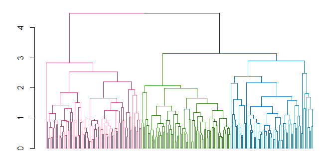


### 5.2 Criteri di terminazione

Elenchiamo alcuni criteri di terminazione comuni: 

* Supponendo di conoscere a priori il numero di cluster da ottenere, si termina l'algoritmo quando si ottiene il numero desiderato. 
* Si procede sino a concludere il dendogramma per intero. Ciò è utile in contesti in cui il concetto di distanza riflette il concetto di evoluzione ed il dendogramma descrive rapporti evolutivi (es. nel confronto di genomi di specie diverse). 
* Si termina l'algoritmo nel momento in cui la fusione di due cluster produce un cluster inadeguato (es. la distanza media dei punti dei cluster dai rispettivi centroidi **cresce troppo**, allora i cluster erano lontani tra loro, pur avendo la distanza minima tra tutti ).


### 5.3 Misure alternative di distanza tra cluster

Altre misure di distanza tra cluster che non includano i centrodi sono le seguenti: 

**Single link** 
La distanza tra due cluster X e Y è data dalla distanza più piccola di un elemento di X e uno di Y. 

**Complete link** 
La distanza tra due cluster X e Y è data dalla distanza più piccola di un elemento di X e uno di Y.

**Average Link**
La distanza tra due cluster X e Y è data dalla distanza media tra tutte le distanze di punti di X e Y. 


#### 5.3.1 Medoid distance

Un elemento interessante per calcolare la distanza tra cluster potrebbe essere il **medoide** (o **1-mediana**), ovvero il punto del cluster tale che la somma delle distanze degli altri punti del cluster ad esso è **minima**. A differenza del centroide, il medoide è *sempre un punto del cluster*. A questo punto, la **medoid distance** è la distanza tra due cluster X e Y data dalla distanza tra i medoidi di X e Y.  


<div style="page-break-after: always;"></div>

### 5.4 Complessità del clustering gerarchico 

Prendiamo come esempio il seguente pseudo-codice: 

```python
clusters = getClusterFromPoints(initialData)
while (terminationCriteria() == True): 
    
    # starting point 
    minimumDistance = calculateDistance(clusters[0], clusters[1])
    minCluster_a = clusters[0]
    minCluster_b = clusters[1]

    # calculate minimimum distance 
    for currentCluster in clusters: 
        for iterationCluster in clusters: 
            tempDistance = calculateDistance(currentCluster, iterationCluster)
            if (tempDistance < minimumDistance):
                minCluster_a = currentCluster
                minCluster_b = iterationCluster
                minimumDistance = tempDistance

    # add the new cluster 
    clusters.remove(minCluster_a)
    clusters.remove(minCluster_b)
    newCluster = createCluster(minCluster_a, minCluster_b)
    clusters.append(newCluster)
    
```

Ad ogni passo l'algoritmo deve calcolare la distanza tra ogni coppia di cluster e scegliere la coppia migliore da unire. 
Il passo iniziale ha complessità $O(n^2)$, i successivi passi dovranno analizzare di volta in volta un cluster in meno, per cui avranno un tempo proporzionale a $O((n-1)^2)$,  $O((n-2)^2)$ ... etc. 

Se l'algoritmo procede sino alla fine, dovrà ripetere *n* passi (iterazioni) prima che si raggiunga un unico grande cluster. Di conseguenza la complessità finale dell'algoritmo è $O(n^3)$. L'algoritmo risulta quindi poco adatto a clusterizzare grandi quantità di dati.   

È possibile ridurre leggermente la complessità dell'algoritmo da $O(n^3)$ a $O(n^2logn)$ usando le code di priorità. La coda di priorità è una struttura dati che permette di ottenere il minimo in un insieme di valori in tempo costante e consente inserimenti e cancellazioni in tempo $O(logn)$.  

In tal caso, ad ogni iterazione l'algoritmo: 

* Troverà la distanza minima tra cluster in tempo costante e i due cluster relativi
* Eliminerà le distanze relative ai due cluster selezionati dalla coda (max. 2n cancellazioni)
* Creerà un nuovo cluster fondendo i precedenti
* Calcolerà le distanze tra i cluster esistenti ed il nuovo cluster, aggiungendole alla coda (al più n inserimenti)

Sia il passo 2 che il passo 4 hanno complessità $O(nlogn)$. Nonostante le ottimizzazioni, il clustering gerarchico resta inefficiente per grandi quantità di dati. 

<div style="page-break-after: always;"></div>

### 5.5 Criteri alternativi di combinazione dei cluster

Anziché scegliere i cluster da combinare attraverso la loro distanza minima (indipendentemente da come essa sia misurata), l'algoritmo potrebbe considerare la coppia di cluster tale che il cluster risultante dalla loro unione abbia raggio o diametro minimo. Definiamo raggio e diametro in un cluster: 

* **Raggio del cluster**: distanza massima tra il centroide e un punto del cluster. 
* **Diametro del cluster**: distanza massima tra due punti qualsiasi del cluster. 

Raggio e diametro possono essere utilizzati come parametro di controllo per la **terminazione dell'algoritmo**, attraverso valori di soglia. 


### 5.6 Clustering agglomerativo e divisivo

Gli algoritmi di clustering gerarchici si dividono in due sottogruppi, a seconda dell'approccio utilizzato per effettuare il clustering: 

**Clustering agglomerativo**
È la metodologia precedentemente descritta. Ogni punto forma inizialmente un cluster e ad ogni passo l'algoritmo fonde i due cluster più vicini. È chiamato approccio **bottom-up**. 

**Clustering divisivo**
Tutti i punti appartengono inizialmente ad un cluster. Ad ogni passo un cluster viene suddiviso in due cluster più piccoli a seconda di criteri di **ottimalità della separazione**. È chiamato anche approccio **top-down**. Valgono le metriche e i criteri visti precedentemente. 


### 5.7 Clustering gerarchico in spazi non euclidei

Negli spazi non euclidei, il concetto di *centroide* non è definito. In tal caso, si elegge un punto del cluster rappresentate lo stesso, chiamato **clusteroide**. Quest'ultimo dovrebbe essere scelto come punto <\<centrale>> del cluster (es. potrebbe essere il **medoide**). Le misure di distanza tra i cluster viste nel caso euclideo, così come i criteri di terminazione, restano validi: basta sostituire nelle definizioni, dove presente, il centroide con il clusteroide. 

<div style="page-break-after: always;"></div>

## 6. Algoritmo K-means

Con il termine K-means si indica una classe di algoritmi di clustering partizionali basati su assegnamenti di punti. Essi permettono di suddividere un insieme di oggetti in *k* gruppi sulla base dei loro attributi. Lavorano su *spazi euclidei* e assumono la conoscenza a-*priori* del numero di cluster *k*, che costituisce un iperparametro per l'algoritmo. Sono tuttavia presenti alcune tecniche per dedurre il miglior valore di *k* attraverso una serie di esperimenti. 


### 6.1 Definizione formale

Fissato *k*, l'algoritmo prende in input un training set di dati $TR$: 
$$
TR = \left\{x^{j}\right\}_j^n \space \space x_i \in \R^n
$$
L'obiettivo del k-means è quello di partizionare l'insieme TR in $k$ cluster, il cui contenuto risulta più compatto (o denso) possibile. L'output è quindi una partizione $S$ esprimibile come segue: 
$$
S = \{S_1, ...,S_k\}
$$
Tale che: 
$$
\forall x^i \space \exist! S_j \in S: x^i \in S_j
$$
Definiremo una funzione $c$ di assegnamento ai cluster: 
$$
c:\{1, ..., n\} \to \{1, ..., k\}
$$
tale che: 
$$
c(i) = j \Longleftrightarrow x^i \in S_j
$$
Definiremo $\mu_j$ il centroide del cluster $S_j$ l'elemento medio: 
$$
\mu_j = \frac{1}{|S_j|} \times \sum_{x \in S_J} x
$$
Il vincolo secondo il quale i cluster debbano essere compatti è misurato attraverso una funzione costo $J(S)$ che, preso in input un determinato partizionamento $S$, calcola la somma della varianza non normalizzata per ogni cluster $S_i \in S$: 
$$
J(S) = \sum_{j=1}^k \sum_{x \in S_j} ||x - \mu_j||^2 
$$
Il problema dell'algoritmo k-means sta nel trovare la partizione ottimale $\hat{S}$ che minimizzi la funzione $J(S)$. 


### 6.2 Descrizione dell'algoritmo

L'algoritmo è composto da un primo step di inizializzazione ed un altro step di iterazione. Lo step di iterazione si compone di due sotto step, l'assegnamento e l'aggiornamento. 

#### 6.2.1 Inizializzazione  

* Si scelgono $k$ punti randomici con alta probabilità di finire in cluster differenti
* Si costruiscono $k$ cluster i cui centroidi sono i $k$ punti selezionati.

#### 6.2.2 Iterazione 

* Assegnamento: assegna ogni punto al cluster il cui centroide è più vicino

$$
c(i) = arg_j\min ||x^i - \mu_j||^2
$$

* Aggiornamento: calcola la posizione del centroide in ognuno dei cluster
  $$
  \mu_j = \frac{1}{|S_j|} \times \sum_{x \in S_J} x
  $$

* Vengono ripetuti i primi due passi sino a che non si soddisfa un criterio di terminazione. 


#### 6.2.3 Criterio di terminazione

Uno tra i criteri di terminazione più utilizzati consiste nel terminare l'algoritmo quando la differenza tra i valori della funzione costo, tra due iterazioni consecutive, scende al di sotto di una soglia stabilita, ovvero l'algoritmo tende a stabilizzarsi. 

<div style="page-break-after: always;"></div>

### 6.3 Scelta dei k centroidi iniziali

Per la scelta iniziale dei *k* punti si potrebbe effettuare il clustering su un piccolo campione di dati (es. utilizzando il clustering gerarchico), fermarsi non appena si ottengono *k* cluster e utilizzare i punti più vicini ai rispettivi centroidi come i *k* punti iniziali. Tale approccio è discretamente buono, ma oneroso computazionalmente. 

Un approccio alternativo consiste nel selezionare un punto randomicamente dall'insieme e inserirlo in un insieme $S$. Dopodichè aggiungere ad S il punto $P$ che massimizzi la distanza minima di $P$ dai punti in $S$: 
$$
P = arg \space \max_{P \notin S} \min_{x \in S} D(P, x)
$$

Ed iterare il processo sinché $|S| < k$. 


### 6.4 Scelta del valore di k  

In molti casi non conosciamo a priori il numero *k* di cluster attesi. Tuttavia, *k* è un parametro richiesto dall'algoritmo di cui non possiamo fare a meno (**iperparametro**, non determinato dall'algoritmo stesso). Occorre quindi eseguire l'algoritmo per diversi valori di *k* e prendere quello per cui il clustering ottenuto è migliore. 

Per misurare la *qualità dei cluster*, si può far riferimento alla distanza media dei punti dai rispettivi centroidi. Il clustering ottenuto è buono se la distanza media è bassa. Tuttavia: 

* All'aumentare di *k* la distanza media dei punti dai centroidi diminuisce. Essa potrebbe diminuire a tal punto da partizionare un cluster già omogeneo. 
* Al diminuire di k la distanza media dei punti dai centroidi aumenta. Di conseguenza potrebbero non essere rilevati alcuni cluster. 


<div style="page-break-after: always;"></div>

Come determinare il valore ideale di *k*? Osservando il grafico sottostante notiamo che all'aumentare di *k*, la distanza media dal centroide diminuisce. Il valore ideale di *k* risiede nel flesso della curva, dove la variazione rallenta. 


Nella pratica, l'approccio migliore è dato dalla ricerca binaria nello spazio dei valori di *k*. Supponiamo che tra due valori x e y assunti dal parametro k ci sia una differenza non trascurabile nella distanza media dai centroidi: 

* Prendiamo il valore medio $z = \frac{x+y}{2}$ ed effettuiamo il clustering per $k=z$.
* Se il valore della distanza media dai centroidi è vicino a quello per $k=x$ allora poniamo $y=z$, o viceversa.
* Ripetiamo i passi 1 e 2 sino a quando l'intervallo di ricerca non è sufficientemente piccolo. 


### 6.5 Complessità del k-means

La complessità dell'algoritmo dipende dal numero di iterazioni *t* e dal numero di cluster *k*. Generalmente, *k* e *t* sono molto più piccoli di *n*. La complessità risulta essere $O(tkn)$. 

Risulta essere più efficiente del clustering gerarchico, ma: 

* Spesso converge ad una soluzione localmente ottimale. 
* Non è in grado di trovare cluster con forma non convessa o di dimensioni molto diverse. 
* È molto sensibile a rumore e outliers: anche in basse quantità, possono influenzare la posizione del centroide.
* Occorre specificare k (eventualmente ricavandolo attraverso ricerche). 

> \<Da wikipedia>
> In termini di qualità delle soluzioni l'algoritmo non garantisce il raggiungimento dell'ottimo globale: la qualità della soluzione finale dipende largamente dall'insieme di gruppi iniziale e può, in pratica, ottenere una soluzione ben peggiore dell'ottimo globale. Dato che l'algoritmo è di solito estremamente veloce, è possibile applicarlo più volte e scegliere la soluzione più soddisfacente fra quelle prodotte. Un altro svantaggio dell'algoritmo è che esso richiede di scegliere il numero di gruppi k da identificare; se i dati non sono naturalmente partizionati si ottengono risultati strani. Inoltre, l'algoritmo funziona bene solo quando sono individuabili gruppi sferici nei dati.

<div style="page-break-after: always;"></div>

### 6.6 K-means su big data

Per clusterizzare grosse quantità di dati in spazi con elevato numero di dimensioni (che non possono risiedere in memoria principale), si utilizzano opportune varianti del K-means, come gli algoritmi BFR  e CURE. 

L'algoritmo **BFR** utilizza una rappresentazione compatta dei *cluster*, riassunti da un insieme di statistiche e valori, e degli *insiemi di punti* non ancora assegnati ai cluster, per poter effettuare le operazioni di assegnamento direttamente sulla RAM. 

 L'algoritmo **CURE** è un estensione del K-means di base per cluster di qualsiasi forma, in cui ogni cluster è descritto da un insieme di punti rappresentativi, che vengono successivamente utilizzati per raffinare gli assegnamenti. 

<div style="page-break-after: always;"></div>

## 7. Algoritmo density based (DBSCAN)

Il DBscan (*Density-Based Spatial Clustering of Applications with Noise*) è un algoritmo di clustering basato su **densità**. Ogni cluster è visto come una regione di punti connessi con densità sufficientemente alta. Per **regione densa** si intende una regione contenente un numero di punti *sufficientemente* elevato in un intorno dello spazio *sufficientemente* limitato.

Il DBscan richiede due iperparametri: 

* il raggio $\epsilon$ legato alla grandezza dei cluster.
* $MinPts$, che rappresenta il numero minimo di punti che un cluster deve avere. 


### 7.1 Definizione formale 

Diamo un paio di definizioni preliminari: 

* Definiamo $\epsilon$**-intorno** di un punto Q l'insieme $N_{\epsilon}(Q)$ dei punti a distanza al più $\epsilon$ da Q. 
* Definiamo P **punto direttamente raggiungibile per densità** da Q, rispetto a $\epsilon$ e $MinPts$ se: 
  *  P appartiene a $N_{\epsilon}(Q)$
  *  Q è un **core-point**, ovvero $|N_{\epsilon}(Q)| \ge MinPts$

* Definiamo P **punto raggiungibile per densità** da Q, rispetto a $\epsilon$ e $MinPts$, *se e solo se* esiste una catena di punti $A_1, ..., A_n$ con $A_1=Q$ e $A_n = P$ tali che $A_{i+1}$ sia *direttamente raggiungibile per densità* da $A_i$.  
* Definiamo P **punto connesso per densità** a un punto Q, rispetto a $\epsilon$ e $MinPts$, se esiste un punto O tale che sia P che Q siano *raggiungibili per densità* da O, rispetto a $\epsilon$ e $MinPts$, 

Un **cluster** in DBscan è definito come un insieme *massimale* di *punti connessi per densità*. Formalmente, se D è l'insieme di tutti i punti da clusterizzare, un cluster C, rispetto a $\epsilon$ e $MinPts$, è un sottoinsieme non vuoto di punti di D tale che: 

* $\forall P,Q \in D$ se $P \in C$ e $Q$ è raggiungibile per densità da P rispetto a $\epsilon$ e $MinPts$, allora $Q \in C$ (**Massimalità**). 
* $\forall P,Q \in D$, P è connesso per densità a Q (**Connettività**). 


### 7.2 Procedura generale 

La procedura generale seguita dal DBSCAN è la seguente: 

* Si sceglie un punto random P non ancora visitato. 
* Si calcola l'intorno $N_{\epsilon}(P)$: se è un **core point**, allora crea un cluster C e va al passo successivo, altrimenti marca P come **outlier** o **rumore** e torna al passo 1. 
* Aggiunge P e tutti i punti appartenenti a $N_{\epsilon}(P)$ al nuovo cluster C. 
* Per ogni punto $X \in N_{\epsilon}(P)$, aggiunge ricorsivamente tutti i punti appartenenti a $N_{\epsilon}(X)$, ovvero quei punti raggiungibili per densità da P finché possibile. 
* Si ripete il passo 1 sino a che tutti i punti non sono stati visitati. 

Al termine della procedura, si formeranno diversi cluster e possibili outlier. I punti inizialmente marcati come outlier potrebbero successivamente entrare a far parte di cluster. 


### 7.3 Scelta dei parametri

La scelta dei parametri è basata su euristiche, generalmente si pone $MinPts \ge D+1$, dove D è la dimensione dello spazio. Per ottenere cluster più significativi, conviene assegnare valori tanto più alti del valore minimo D+1 per $MinPts$ quanto: 

*  Più alto è il dataset di punti
*  Maggiore è il rumore presente

Una volta stimato $MinPts = k$, si passa a stimare il valore del raggio $\epsilon$: per stimare $\epsilon$ si possono ordinare i punti del dataset sulla base della distanza dal k-esimo elemento più vicino, dalla distanza più alta a quella più bassa e plottare tali distanze ordinate. La curva che si ottiene e simile a quella vista per il clustering gerarchico. Il valore ottimale di $\epsilon$ è l'ordinata del punto del grafico in cui la curva <\<piega>> maggiormente. Scegliendo valori troppo bassi di $\epsilon$, molti punti non verrebbro clusterizzati, mentre valori troppo alti porterebbero a cluster troppo grandi.  


### 7.4 Complessità di DBscan 

La funzione chiave che determina la complessità di DBscan è quella che calcola l'$\epsilon$-intorno di un punto. Con l'utilizzo di strutture indicizzate (es. mappe hash) è possibile ottenere l'$\epsilon$-intorno di un punto in tempo $O(logn)$. Dal momento che l'$\epsilon$-intorno è calcolato una sola volta per ogni punto, la complessità dell'algoritmo è $O(nlogn)$.


### 7.5 Vantaggi e svantaggi 

I vantaggi dell'algoritmo sono i seguenti: 

* Non richiede la conoscenza del numero di cluster
* Può trovare cluster di forma arbitraria 
* Contempla la nozione di outlier
* L'assegnamento ai cluster è poco influenzato dall'ordine di esaminazione (meno che per i punti di bordo). 

Mentre i principali svantaggi sono: 

* La determinazione di due iperparametri strettamente dipendenti dal tipo di dato. 
* Non è in grado di individuare cluster con notevoli differenze di densità. 

<div style="page-break-after: always;"></div>

## 8. Coefficiente di Silhouette

Il coefficiente di Silhouette è una metrica utile per la validazione del clustering effettuato, e quindi per verificare la qualità di un determinato metodo di clustering.

### 8.1 Calcolo del coefficiente

Per ogni osservazione viene calcolata la distanza media tra tutti i punti appartenenti allo stesso cluster. Dopodiché si calcola la distanza media tra il punto e tutti gli altri cluster e si seleziona il cluster con la distanza media più piccola, chiamata . Il coefficiente di Silhouette è dato dalla seguente formula:
$$
S_i = \frac {C_i - D_i} {\max(C_i, D_i)}
$$
Analizziamo i casi:

* $S_i > 0$ indica che l'osservazione è ben clusterizzata. Di fatto il cluster $X$ è più lontanor ispetto al cluster di appartenenza. Più il valore è vicino ad 1, meglio i dati sono clusterizzati. Si considerano discretamente ottimali valori al di sopra di 0.5.
* $S_i < 0$ indica che l'osservazione è stata posizionata in un cluster sbagliato, di fatto il
  cluster $X$ è mediamente più vicino rispetto al cluster di appartenenza.
* $S_i = 0$ indica che l'osservazione sta a metà tra $X$ ed il cluster di appartenenza, per cui
  comporta un caso dubbio.


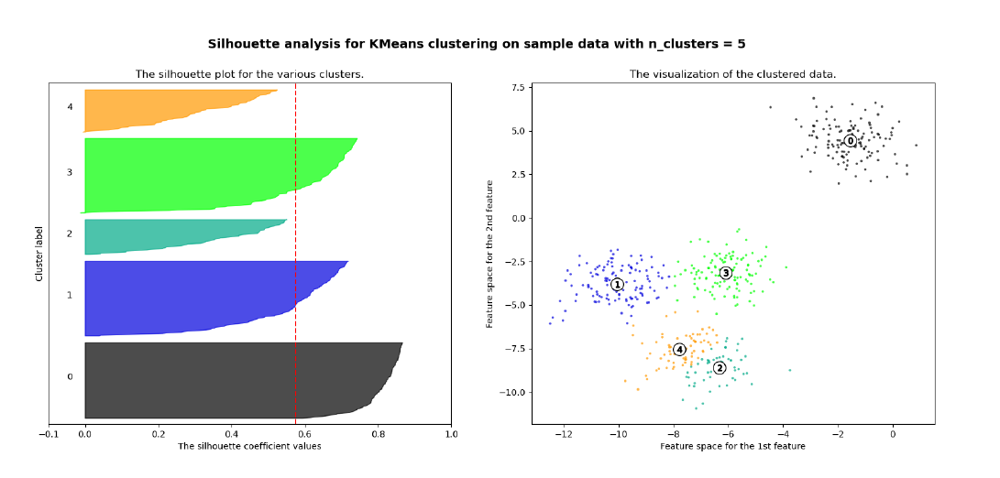<div style="page-break-after: always;"></div> 
# Classificazione

## 1. Introduzione

Nell'asserzione *statistica*, la classificazione è definita come un problema di identificazione della classe di appartenza di una osservazione, rispetto ad un insieme di classi, sulle basi di un training set contenente osservazioni la cui classi di appartenenza sono note. Nel machine learning, la classificazione è considerata un metodo di apprendimento supervisionato (*supervised learning*). Essa è un esempio di *pattern recognition*. Il prodotto di un algoritmo di classificazione è detto *modello*. Data in input una nuova osservazione, il modello è in grado di assegnare una classe a tale osservazione con un certo grado di accuratezza. Spesso il modello è basato su parametri interni affinati attraverso il training set, e (talvolta) parametri esterni configurati manualmente, chiamati iperparametri.

 

### 1.1 Definizione formale

Sia $e \in E$ un esempio in input, dove $E$ è l'insieme di tutti i possibili esempi utilizzabili dall'algoritmo. Definiamo $C = \{0, \dots, M - 1\}$ l'insieme delle possibili classi ed ipotizziamo che $e$ appartenga ad una di esse, nello specifico ad $y \in C$. Definiamo un algoritmo di classificazione come una funzione: 
$$
c : E \to C
$$
Il classificatore $c$ effettuerà una predizione $\hat{y} = c(e)$ sulla classe di appartenenza di $e$. Il *cappello* nella $\hat{y}$ indica che la classe è stata predetta, al contrario di $y$ che rappresenta la classe corretta di $e$. Vogliamo che il nostro classificatore predica correttamente la classe, quindi che $\hat{y} = y$. 


### 1.2 Classificazione e predizione

Ambo classificazione e predizione sono due metodi di tipo *supervised learning*. Entrambe utilizzano le feature delle osservazioni per classificare / predire un risultato. È possibile creare confusione tra le due tecniche, per cui evidenziamo la differenza principale: nella classificazione predice l'etichetta della classe categoriale di appartenenza (discreta o nominale), mentre la predizione modella funzioni continue e consente la predizione di dati sconosciuti o mancanti.

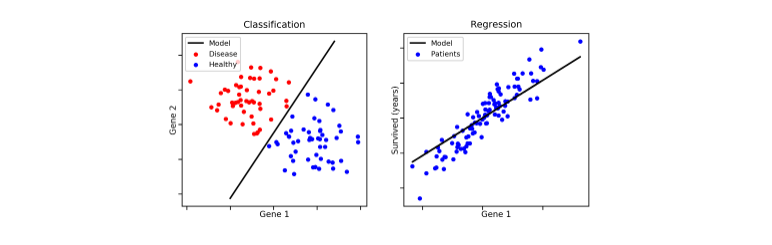

<div style="page-break-after: always;"></div>

### 1.3 Procedimento generale di un classificatore

Lo schema generale per la classificazione si suddivide nella creazione del modello e nell'utilizzo di quest'ultimo. Nella prima fase si utilizza un insieme di tuple, chiamato training set, dove ogni tupla (o osservazione) è caratterizzata da vari attributi (o features) e da una classe di appartenenza. Il modello viene costruito attraverso varie tecniche (alberi decisionali, principi probabilistici o geometrici, etc.) a partire dai dati di training. 

* Costruzione del training set
* Scelta del metodo di apprendimento
* Allenamento del modello

Una volta finita la fase di creazione, si applica il modello a dei nuovi dati appartenenti ad un test set e si controlla che le etichette predette corrispondano alle etichette originali: viene quindi misurata la performance del classificatore. Il test set è *fortemente indipendente* dal training set, al fine di produrre un modello più generico possibile. Se la misura di performance è discretamente alta, allora si utilizza il modello per classificare nuovi dati. 

* Si applica il modello al test set
* Si misurano le performance 
* Si accetta o rigetta il modello in base ai risultati


### 1.4 Requisiti dei classificatori o predittori

I requisiti principali di un classificatore o di un predittore sono i seguenti: 

* Accuratezza: predire correttamente le etichette delle classi / corretto valore di un attributo
* Velocità, intesa come: 
  * Tempo impiegato nella costruzione del modello (training time). 
  * Rapidità con cui il modello performa una classificazione / predizione (classification / prediction time).
* Robustezza: la capacità di manipolare dati con rumore o con feature mancanti. 
* Scalabilità: mantenere l'efficienza all'aumentare dei dati, quindi manipolare anche dati in memoria secondaria.  
* Interpretabilità dei risultati. 

<div style="page-break-after: always;"></div>

## 2. Alberi decisionali

Gli alberi decisionali sono uno strumento noto nei campi del machine learning, data mining e della statistica. Ogni nodo interno dell'albero contiene un **test** su uno o più attributi, tale test stabilisce quale dei sottoalberi deve essere visitato. Un test tipicamente valuta **una** feature, in tal caso si parla di alberi **univariati**, o una **combinazione** di feature,  nel caso di **alberi multivariati**. Ogni **foglia** contiene una **etichetta di classe**. 

Alcune importanti osservazioni: 

* La classe di una osservazione (o tupla) si ottiene seguendo il percorso che va dalla radice dell'albero ad una foglia che determina la classe, sulla base dei test residenti nei nodi interni. 
* Ad ogni nodo interno $X$ è possibile associare l'insieme $S_X$ delle tuple che soddisfano le condizioni testate partendo dalla radice sino ad arrivare al nodo X. 
* La conoscenza rappresentata nell'albero decisionale può essere estratta e rappresentata in forma di regole di produzione **if-then**. Le regole estratte sono poi utilizzate per la classificazione di nuovi oggetti.


### 2.1 Esempio esplicativo

Ipotizziamo di avere il seguente training set, dove ogni osservazione è formata da 4 feature: 
$$
\{Outlook, Temperature, Humidity, Windy\}
$$
e da tali attributi si decide di giocare una partita di pallone o meno (P = Play, N = Not play). In tal caso il task del classificatore è quello di creare un modello in grado di analizzare le condizioni giornaliere in input e determinare se è il caso di giocare una partita o meno. 

| OUTLOOK  | Temperature | Humidity | windy | class |
| -------- | ----------- | -------- | ----- | ----- |
| Sunny    | hot         | high     | false | N     |
| Sunny    | hot         | high     | true  | N     |
| Overcast | hot         | high     | false | P     |
| Rain     | mild        | high     | false | P     |
| Rain     | cool        | normal   | false | P     |
| Rain     | cool        | normal   | true  | N     |
| Overcast | cool        | normal   | true  | P     |
| Sunny    | mild        | high     | false | N     |
| Sunny    | cool        | normal   | false | P     |
| Rain     | mild        | normal   | false | P     |
| Sunny    | mild        | normal   | true  | P     |
| Overcast | mild        | high     | true  | P     |
| Overcast | hot         | normal   | false | P     |
| Rain     | mild        | high     | true  | N     |

Attraverso un algoritmo di classificazione viene creato un albero decisionale come quello raffigurato nell'immagine sottostante. Più l'albero è bilanciato, più si ridurrà il tempo di classificazione / predizione di una osservazione. Tuttavia, è bene considerare anche il numero di rami uscenti da un nodo interno, poiché molti rami uscenti indicano test computazionalmente costosi. Una production rule tirata fuori da tale albero potrebbe essere la seguente: 

```python
if outlook == 'Sunny' and humidity == 'Normal':
    return 'PLAY'
```


### 2.2 Costruzione di un albero decisionale

Un albero decisionale può essere costruito in maniera top-down. Partendo dalla radice, è possibile applicare una serie di passi ricorsivamente. 

* Supponiamo di essere al nodo *t*. 
* Vi sono due possibilità: 
  * Tutte le tuple associate all'insieme $S_t$ assumono la stessa classe *y* (quindi *t* si dice nodo **puro**)$\rightarrow$ *t* diventa una foglia di classe *y*
  * Altrimenti il nodo *t* si definisce **impuro** e: 
    * Se è presente un attributo A tra gli attributi ancora non utilizzati: 
      *  Si partiziona $S_t$ sulla base dei valori di *A* (**splitting**)
      *  Si creano tanti figli del noto *t* quante sono le partizioni create
      *  Per ciascun figlio si reitera il processo.  
    * Altrimenti si crea una foglia di classe *y*, dove la classe *y* è di maggioranza nell'insieme delle tuple associate al nodo (*).  

(*) Nel caso di un nodo impuro ed in assenza di ulteriori attributi da utilizzare, è possibile stabilire una *distribuzione di probabilità* P tale che: per ogni classe C nell'insieme S del nodo, si assegna una probabilità P(C) data dal rapporto di osservazioni di classe C in S su osservazioni totali in S.  


### 2.3 Splitting 

Il processo di splitting incontrato nella costruzione dell'albero decisionale va attenzionato in base al tipo di attributo scelto. Consiste nel partizionare l'insieme di tuple *S* rispetto ad un nodo *t* in base ai valori che l'attributo può assumere. 

Ipotizziamo di trovarci al nodo impuro X con un insieme di osservazioni $S_X$ e di aver scelto un attributo A: 

* (**a**) Se A è un attributo **categoriale**, allora le osservazioni assumono uno tra i *k* valori finiti di A. Si formano *k* nodi figli di X e si partiziona l'insieme $S_X$ in *k* sottoinsiemi $S_1 ,...,S_k$ sulla base dei valori di A e si assegnano ai rispettivi nodi figli. 
* (**b**) Se l'attributo è **continuo** allora si definisce un valore di soglia $\sigma$ e si partiziona l'insieme $S_X$ a seconda se $A \ge \sigma$ o $A < \sigma$. La soglia è scelta in modo che ogni partizione abbia un numero minimo di elementi. Si aggiungono due figli ad X a cui sono associate rispettivamente le partizioni create.
* (**c**) Se l'attributo è **booleano** allora si partiziona $S_X$ in due insiemi $S_1$ e $S_2$ a seconda che $A=true$ oppure $A=false$. Si aggiungono due figli ad X a cui sono associate rispettivamente le partizioni create.


#### 2.3.1 Scelta degli attributi

La costruzione dell'albero decisionale è fortemente influenzata dall'ordine in cui si considerano gli attributi per lo splitting. Al variare dell'ordine, l'albero in output differisce; l'obiettivo consiste nello scegliere l'albero più semplice e compatto possibile. Nell'immagine che segue troviamo due alberi costruiti a partire dallo stesso training set, con un criterio di scelta degli attributi differente: 


Ovviamente l'albero a destra è più compatto, comprensibile ed efficiente di quello a sinistra. Trovare l'albero minimale (con altezza minore) è un problema NP-Hard, per cui occorre utilizzare degli algoritmi approssimati che cerchino un ottimo locale sfruttando una strategia **greedy**. Un' euristica ricorrente è la seguente: 

> Si sceglie ad ogni passo l'attributo che divide le osservazioni in insiemi che sono relativamente **puri**. 

L'obiettivo è quindi quello di effettuare scelte che portino più rapidamente ai nodi foglia. Esistono varie nozioni di purezza che esamineremo in seguito, e prendono il nome di **misure di goodness**. 


#### 2.3.2 Algoritmo greedy ricorsivo

Descriviamo l'algoritmo greedy ricorsivo come segue: 

* **Passo base**: 

  * Se tutte le osservazioni in S associato al nodo *t* assumono la stessa classe, quindi *t* è un nodo puro, allora si crea una foglia contenente tutti i dati. 
  * Altrimenti, se non vi sono ulteriori attributi da selezionare per lo splitting, si crea un nodo foglia con l'etichetta di maggioranza. 

* **Passo ricorsivo**: 

  * Si seleziona l'attributo A che massimizza una **misura di goodness**; 
  * Si effettua lo splitting di S rispetto al nodo t sulla base di A. 
  * Si applica ricorsivamente l'algoritmo sui figli del nodo t. 

  

```
build_decision_tree (S, attributes):
	if observations in S have the same class: 
		make a new leaf with this class
	else: 
		if the node is impure but there are no attributes: 
			make a new leaf with the most frequent class in S
		else: 
			A = attribute that maximize the goodness measurement 
			partitions = split(S, A)
			for partition in partitions: 
				build an internal node, son of the current node 
				build_decision_tree(partition, attributes - {A})

```


#### 2.3.3 Splitting su attributi continui

Nel caso di attributi continui occorre scegliere un valore di soglia, per cui lo splitting effettuato in questo caso dipende anche da questo parametro. Se l'attributo è continuo è necessario quindi calcolare più valori di goodness per lo stesso attributoe prendere come riferimento quello con la goodness più alta. Questo aggiunge un layer di complessità alla scelta degli attributi. 

<div style="page-break-after: always;"></div>


### 2.4 Misure di goodness 

Una misura di goodness quantifica la purezza dei nodi prodotti dallo splitting, scegliendo uno tra gli attributi. Conosciamo tre misure più ricorrenti: 

* Information gain (utilizzata nell'algoritmo ID3)
* Gain ratio (utilizzata nell'algoritmo C4.5)
* Gini index (utilizzata nell'algoritmo CART)


#### 2.4.1 Information gain (algoritmo ID3)

La scelta di un attributo mira alla riduzione progressiva dell'**entropia**. La nozione di purezza è descritta come "quanto un insieme di istanze è prossimo alla situazione ideale", ovvero contenente osservazioni di una sola classe. 

* L'**entropia massima** si ha quando le classi delle osservazioni associate ad un nodo hanno la stessa frequenza. 
* L'**entropia minima** si ha quando tutte le osservazioni associate ad un nodo hanno la stessa classe (nodo puro).

Sia $S_X$ l'insieme delle osservazioni associate ad un nodo X dell'albero, se X è la radice allora $S_X$ è l'intero set di osservazioni. Se X è un nodo interno allora $S_X$ è l'insieme di osservazioni che soddisfano i test imposti dagli archi dell'albero nel percorso effettuato per arrivare dalla radice ad X. 

La quantità di informazione è definita nella teoria della informazione come segue: 
$$
I(x) = - log (P(x))
$$
L'entropia, descritta come il grado di incertezza in una distribuzione di probabilità *P* è definita come segue: 
$$
H(X) = E_X[I(x)] = - \sum_x P(x) * log(P(x))
$$
Assumiamo di avere solo due classi, P ed N. Ipotizziamo che $S_X$ contenga *p* osservazioni di classe P ed *n* osservazioni di classe N. Definiamo la probabilità di una classe in modo frequentista, data quindi dal rapporto di casi favorevoli (osservazioni della data classe in $S_X$) su casi possibili (osservazioni in $S_X$). 

Nel nostro esempio, le classi P ed N hanno rispettivamente probabilità: 
$$
P(P) = \frac{p}{p+n} \space e \space P(N) = \frac{n}{p+n}
$$
Per cui l'entropia dell'insieme $S_X$ è così definita: 
$$
H(S_X) = - \frac{p}{p+n} * log (\frac{p}{p+n}) - \frac{n}{p+n} * log (\frac{n}{p+n})
$$
Supponiamo di scegliere l'attributo A come attributo per lo splitting. L'insieme $S_X$ verrà partizionato in $S_1, S_2, ..., S_k$ insiemi. Supponiamo che l'i-esimo insieme $S_i$ contenga $p_i$ osservazioni di classe P e $n_i$ osservazioni di classe N. Allora l'entropia dell'insieme $S_i$ è data come: 
$$
H(S_i) = - \frac{p_i}{p_i+n_i} * log (\frac{p_i}{p_i+n_i}) - \frac{n_i}{p_i+n_i} * log (\frac{n_i}{p_i+n_i})
$$
Definiamo l'**entropia media di $S_X$ rispetto ad A** la seguente media pesata delle entropie dei singoli sottoinsiemi $S_i$: 
$$
\bar{H}_A(S_X) = \sum_{i=1}^k \frac{p_i+n_i}{p+n} H(S_i)
$$
Generalizziamo il concetto e ipotizziamo che in $S_X$ le osservazioni assumano *n* classi differenti $C_1, ..., Cn$. Allora l'entropia di $S_X$ è data da: 
$$
H(S_X) = - \sum_{i=1}^n P(C_i) * log(P(C_i))
$$
Sia A un attributo avente i seguenti valori $\{a_1, ..., a_n\}$. Effettuando lo splitting di $S_X$ nei vari $S_i$ a seguito del test su A, l'entropia media di $S_X$ rispetto ad A sarà la media ponderata delle entropie dei singoli sottoinsiemi, ovvero: 
$$
INFO(A) = \bar{H}_A(S_X) = \sum_{i=1}^k \frac{|S_i|}{|S_X|} H(S_i)
$$
L'**information gain** è definito come la riduzione di entropia ottenuta dal partizionamento di $S_X$ scegliendo scegliendo l'attributo A, ovvero: 
$$
gain(A) = H(S_X) - \bar{H}_A(S_X)
$$
Ad ogni passo di splitting, l'algoritmo sceglierà l'attributo A che massimizza l'information gain. Ciò equivale a selezionare l'attributo A tale che $\bar{H}_A(S_X)$ sia minimo, in quanto $H(S_X)$ è lo stesso (dato il nodo) qualunque sia l'attributo selezionato. Questo approccio minimizza il numero atteso di test necessario per classificare una data tupla. Garantisce inoltre la costruzione di un albero semplice (non necessariamente il più semplice, essendo un approccio greedy). 


#### 2.4.2 Svantaggi dell'information gain

L'information gain risulta fortemente sbilanciato in favore dei test che hanno molti esiti. In determinati casi si verifica che un test, che può essere molto discriminante ai fini della divisione dell'albero e quindi con un forte potere predittivo, non venga effettuato perché si basa su un attributo con pochi valori possibili, in favore di un altro test con molti esiti possibilmente poco significativi in termini di predizione. 

Ad esempio, se uno degli attributi è un ID, allora ogni partizione sulla base di questo attrbuto avrà una sola tupla. Di conseguenza ogni nodo creato dalla partizione sarà puro e l'entropia media delle partizioni sarà zero, ovvero l'information gain sarà massimo. 


#### 2.4.3 Gain ratio (algoritmo C4.5)

Rispetto ad ID3, l'algoritmo C4.5 utilizza una misura di goodness diversa chiamata **Gain ratio**, che riduce il bias introdotto dall'information gain. Il Gain ratio prende in considerazione il numero e la dimensione delle partizioni ottenute scegliendo un attributo, senza considerare informazioni specifiche sulle singole classi. 

<div style="page-break-after: always;"></div>


Le potenziali informazioni sullo split generato da un attributo A sono rappresentate dallo $splitInfo$: 
$$
splitInfo(A) = - \sum_{i=1}^k \frac{|S_i|}{|S_X|} log_2 (\frac{|S_i|}{|S_X|})
$$
Il Gain ratio è dato da: 
$$
GainRatio(A) = \frac{Gain(A)}{SplitInfo(A)}
$$
Attributi che determinano molte partizioni con pochi elementi avranno un valore di $SplitInfo$ maggiore, quindi un minore $GainRatio$. 


### Gini index (algoritmo CART)

Il **Gini index**, anche chiamato **Gini impurity**, misura l'impurità di un insieme di osservazioni $S_X$ associato ad un nodo dell'albero decisionale. Consideriamo una classe $C_i$ ed una tupla *x* di classe $C_i$ scelta a caso dal dataset *T*. Supponiamo di assegnare casualmente ad *x* una classe $C_j$ sulla base della distribuzione delle frequenze delle classi nel dataset. Il Gini index misura, per ogni classe, la probabilità che $i \ne j$. Chiamiamo $p_i$ la probabilità di scegliere una osservazione del dataset di classe $C_i$, la probabilità di scegliere una classe $C_j$ diversa da $C_i$ a partire dalla distribuzione delle frequenze delle classi è: 

$$
P(C_j \ne C_i) = \sum_{j=1, j \ne i}^n p_j = 1-p_i 
$$
Supponiamo di avere *n* classi, il gini index calcola l'impurità di un nodo sommando, per ogni classe $C_i$ con $i = 1,...,n$, la probabilità che si scelga una classe errata (ovvero $1 - p_i$).  Tale valore viene bilanciato attraverso la probabilità $p_i$:
$$
gini(S_X) = \sum_{i=1}^n p_i (1 - p_i) = \sum_{i=1}^n p_i - p_i^2 = 1 -\sum_{i=1}^n p_i^2
$$
 Dunque, dato un insieme di osservazioni $S_x$ con *n* classi, il Gini index è definito come segue: 
$$
gini(S_X) = 1 -\sum_{i=1}^n p_i^2
$$
Dove $p_i$ è la frequenza relativa della classe $C_i$ in $S_X$. 

Supponiamo che, scegliendo un attributo A per lo split, l'insieme $S_X$ venga partizionato in *k* sottoinsiemi $S_1, ..., S_k$. Il Gini index dello split è definito come segue: 
$$
gini_{split}(S_X) = \sum_{i=1}^k \frac{|S_i|}{|S_X|} *gini(S_i)
$$
 L'attributo A che **minimizza** $gini_{split}(S_X)$ è selezionato come attributo di splitting. 

<div style="page-break-after: always;"></div>

### 2.5 Pruning

L'elevato numero di attributi in un training set o la particolare distribuzione dei valori degli attributi può far crescere notevolmente la dimensione di un albero. Ciò può portare alla costruzione di un modello più complesso, fatto "su misura" sul training set, ma non in grado di classificare correttamente nuovi dati. Questo fenomeno è chiamato **overfitting**. Rende più difficile la classificazione (dovuto ad outliers) ed è associato ad un aumento non giustificato di errori. Per evitare questo, gli algoritmi di classificazione effettuano un **pruning** (potatura).

Il pruning consiste nel rimuovere i rami che non contribuiscono ad una corretta classificazione, producendo qualcosa di meno complesso e più comprensibile. Il pruning deve essere fatto senza aumentare eccessivamente il tasso di errore di classificazione del modello. 


#### 2.5.1 Pre-pruning e post-pruning

Vi sono varie tipologie di pruning: 

* **Pre-pruning**: è attivato in fase di costruzione dell'albero, nel momento in cui si decide se dividere ulteriormente o meno un determinato sottoinsieme. Fissato un valore di soglia (threshold) *t*, i rami per cui si ottiene un **gain** inferiore a *t* vengono troncati. In alternativa, possono essere utilizzati metodi statistici per effettuare il troncamento. 
* **Post-pruning**: questa tipologia di pruning è utilizzata dagli algoritmi CART e C4.5. Si rimuovono rami e nodi a costruzione dell'albero già avvenuta, sostituendo un intero sotto-albero con una foglia. 

Il **post pruning**, sebbene più dispendioso, consente una analisi più approfondita delle partizioni producendo un albero più realistico. Il C4.5 utilizza un algoritmo di post-pruning chiamato **pessimistic pruning** o **reduced error pruning**. Il CART utilizza un algoritmo di post-pruning chiamato **cost-complexity pruning**. 


#### 2.5.2 Pessimistic pruning 

Dato un sottoalbero T di radice X, definiamo l'***error rate*** (tasso di errore) atteso di T $E(T)$ il numero di osservazioni di $S_X$ che sono classificate in maniera errata. Una strategia semplice di pruning consiste nel potare un sottoalbero in funzione della variazione di *error rate* predetto che porterebbe all'intero albero. Se tale variazione è positiva, ovvero il tasso di errore aumenta in presenza del sottoalbero, allora il sottoalbero stesso può essere potato e sostituito con una foglia. 

Il **pruning pessimistico** si basa sul calcolo di questa variazione di errore ed è chiamato pessimistico poiché sovrastima leggermente (di una quantità $\epsilon$) il tasso di errore atteso in ogni sottoalbero. 

Vediamo la procedura generale: 

* Calcoliamo una stima pessimistica $E_p(T)$ dell'error rate atteso sul training set prima di fare lo splitting di un nodo X su un attributo A, considerando il nodo X come una foglia con l'etichetta di maggioranza nel sottoalbero. 

<div style="page-break-after: always;"></div>


Avendo considerato la classe di maggioranza *c* sostitutiva al sottoalbero, l'error rate sarà calcolato come segue: 
$$
E(T) = \frac{\# tuple \space di \space classe \space c' \ne c \space in \space S_X}{\# tuple \space in \space T}
$$
La stima pessimistica è calcolata aggiungendo un fattore $\epsilon$: 
$$
E_p(T) = \frac{(\# tuple \space di \space classe \space c' \ne c \space in \space S_X) + \epsilon}{\# tuple \space in \space T}
$$


* Calcoliamo una stima pessimistica $E_p'(T)$ dell'error rate atteso dopo aver eseguito lo splitting di X su A, utilizzando quindi il sottoalbero. 

Essendovi uno splitting del nodo X, vi saranno *k* sottoinsiemi di $S_X$: $S_1, ..., S_k$. Calcoliamo l'error rate, considerato il sottoalbero, come segue:
$$
E'(T) = \frac{ \sum_{i=1}^k \# tuple \space di \space classe \space c' \ne c \space in \space S_i}{\# tuple \space in \space T}
$$
La stima pessimistica è calcolata aggiungendo un fattore $\epsilon$: 
$$
E_p'(T) = \frac{ \sum_{i=1}^k (\# tuple \space di \space classe \space c' \ne c \space in \space S_i + \epsilon)}{\# tuple \space in \space T} = \frac{ (\sum_{i=1}^k \# tuple \space di \space classe \space c' \ne c \space in \space S_i) + k*\epsilon}{\# tuple \space in \space T}
$$

* Se $E_p'(T) > E_p(T)$ allora: 
  * Viene sostituito il sottoalbero radicato in X con un nodo foglia. 
  * Viene assegnata ad X l'etichetta di maggioranza tra le foglie del vecchio sottoalbero.  

Vediamo un esempio di pruning pessimistico: 


<div style="page-break-after: always;"></div>


#### 2.5.3 Cost complexity pruning

L'algoritmo CART utilizza un algoritmo di post pruning chiamato Cost Complexity pruning. Tale algoritmo costruisce iterativamente *m* alberi decisionali $T_0, T_1, ..., T_m$ , dove $T_0$ l'albero decisionale completo e $T_m$ è l'albero formato dalla sola radice. 

Alla i-esima iterazione, l'albero $T_i$ è ottenuto a partire dall'albero $T_{i-1}$ rimuovendo un sottoalbero *t* di  $T_{i-1}$ e sostituendolo con un nodo foglia con associata etichetta di maggioranza ( o distribuzione delle classi). Se  $E(T_i)$ è l'error rate atteso per il sottoalbero $T_i$, il sottoalbero da rimuovere in questa iterazione è quello tale da minimizzare la seguente funzione: 
$$
argmin_j
\frac
{E(prune(T_i, t_j)) - E(T_i)}
{|leaves(T_i)| - |leaves(prune(T_i, t_j))|}
$$
Dove $prune(T_i, t_j)$ è l'albero ottenuto rimuovendo da $T_i$ il sottoalbero $t_j$, mentre con $|leaves(T)|$ intendiamo genericamente il numero di foglie in un albero. Uno dei vantaggi di tale algoritmo è che non è necessario stimare un parametro $\epsilon$. 


### 2.6 Estrazione di regole da un albero decisionale

A partire dall'albero decisionale è possibile estrarre delle production rules del tipo IF (condizione) THEN (etichetta). Esiste una regola per ogni cammino che porta dalla radice ad una foglia. Le coppie (attributo, valore) lungo un percorso entrano a far parte della condizione della regola, legate attraverso congiunzione (AND). Il valore contenuto nella foglia determina la predizione finale della classe. Le regole sono mutuamente **esclusive** ed **esaustive**. 

Vediamo un esempio: 


#### 2.6.1 Qualità di una regola 

Per stabilire la qualità di una regola per una classe C si utilizzano due misure: 

* **Copertura** (coverage): numero relativo di osservazioni coperte dalla regola, ovvero che soddisfano le condizioni della regola. 
* **Accuratezza** (accuracy): numero relativo di osservazioni di classe C coperte dalla regola. 

Una buona regola dovrebbe avere alta coverage per una specifica classe C (ovvero coprire quante più tuple di classe C) ed elevata accuratezza (ovvero classificare bene la maggior parte delle osservazioni di classe C coperte).

Definiamo gli **esempi positivi** come le osservazioni di classe C coperte dalla regola, mentre gli **esempi negativi** come le tuple di classe diversa da C coperte dalla regola.  


#### 2.6.2 Risoluzione dei conflitti

Idealmente, ogni regola sulla classe C dovrebbe coprire insiemi di osservazioni differenti. Tuttavia, è possibile avere ridondanze o conflitti con due o più regole che coprono più o meno lo stesso insieme di osservazioni. Occorre risolvere un problema di **minimal set covering**, ovvero trovare il più piccolo insieme di regole sulla classe C che coprono gli esempi positivi. Ciò deve essere fatto producendo regole che abbiano un livello sufficientemente alto di accuratezza. 

Alcuni algoritmi noti per la ricerca del **minimal set covering** sono FOIL, AQ, CN2, RIPPER. Le regole vengono costruite in maniera sequenziale. L'obiettivo è individuare una regola per una classe C che copra *molte* tuple di classe C (**esempi positivi**) e nessuna (o poche) tuple delle altre classi (**esempi negativi**). Lo schema generale è il seguente: 

* Sia S il set formato da tutte le osservazioni del training set 
* Le regole vengono apprese una per volta seguendo un criterio greedy basato sulla qualità della soluzione. 
* Ogni volta che una nuova regola viene appresa, gli esempi positivi vengono rimossi da S. 
* Il processo viene ripetuto sino a quando S non diventa vuoto. 


#### 2.6.3 Algoritmi FOIL e RIPPER

Gli algoritmi **FOIL** e **RIPPER** utilizzano una strategia greedy e depth-first per generare la regola da aggiungere ad ogni passo.

Sia C la classe; partiamo dalla radice dell'albero decisionale e consideriamo la regola più generale per ottenere la classe C, ovvero quella senza condizioni:
$$
IF \space True \space THEN \space C
$$
Da tale regola otterremo il massimo punteggio di copertura (coverage) poiché tutte le osservazioni rispettano tale condizione, ma anche una pessima accuratezza (accuracy), ovvero saranno incluse anche tutte le osservazioni di classe diversa da C, quindi molti *esempi negativi*. 

Dopodiché si scenderà lungo l'albero scegliendo la condizione che mantenga una ampia copertura e ottimizzi la accuratezza per la classe C. 
$$
IF A=a \space THEN \space C \\
IF A=a \space AND \space B=b \space THEN \space C \\
...
$$
Inevitabilmente, durante l'aggregazione di nuove condizioni scenderanno sia gli esempi positivi che gli esempi negativi della classe C, la scelta va ponderata in base al miglior rapporto (che enfatizza la diminuzione degli esempi negativi, mentre scoraggia quella dei positivi). 

Vi è la necessità di introdurre una metrica che diriga l'algoritmo nell'effettuare la scelta migliore. Nel caso dell'algoritmo FOIL si introduce il **FOIL gain**: le condizioni vengono aggiunte sino a quando la regola ottenuta mantiene un livello di qualità superiore ad una certa soglia, sulla base del FOIL gain. 


#### 2.6.4 FOIL gain

Siano $pos$ e $neg$ rispettivamente il numero di esempi positivi e negativi ottenuti prima della costruzione della regola. 
Siano $pos'$ e $neg'$ rispettivamente il numero di esempi positivi e negativi ottenuti dopo della costruzione della regola.
$$
FOILGain(R) = pos' * [log_2 \frac{pos'}{pos'+neg'} - log_2 \frac{pos}{pos+neg}]
$$
Il FOIL gain cerca quindi di favorire regole che hanno alta accuratezza e coprono molti esempi positivi. 

<div style="page-break-after: always;"></div>

## 3. Classificatori generativi

I *classificatori generativi* (o classificatori *Bayesiani*) producono un modello probabilistico traendo informazioni dai dati e predicono la classe di appartenenza più probabile per un nuovo dato a partire dal modello sviluppato.  Esempi di classificatori generativi sono le *Bayesian networks* ed i *Gaussian Mixture Models*, entrambi basati sul *teorema di Bayes*.


### 3.1 Teorema di Bayes 

Consideriamo un insieme di alternative $A_1, \dots, A_n$ che partizionano lo spazio degli eventi $\Omega$. Si trova la seguente espressione per la probabilità condizionata: 
$$
P(A_i \mid E) = \frac {P(E \mid A_i) P(A_i)} {P(E)} =
\frac {P(E \mid A_i) P(A_i)} {\sum_{j=1}^{n} P(E \mid A_j) P(A_j)}
$$
Dove: 

* $P(A)$ è la *probabilità a priori* o *probabilità marginale* (nessuna informazione su $E$). 
* $P(A \mid E)$ è la *probabilità a posteriori*, dato che deriva dal valore di $E$. 
* $P(E \mid A)$ è la *verosimiglianza* (likelihood). 
* $P(E)$ è l'*evidenza*, che funge da costante di normalizzazione. 


### 3.2 Maximum a Posteriori (MAP)

Consideriamo l'evento stocastico "$x$ è di classe $c$" dove $x$ è una osservazione d'esempio e $c \in \{0, \dots, M-1\}$ è una delle $M$ possibili classi nel problema di classificazione. Consideriamo la probabilità $P(c\mid x)$ che risponda alla domanda "qual è la probabilità che si osservi la classe $c$, data l'osservazione $x$?". Se quantifichiamo tale probabilità per ogni classe $c$ tra le $M$ esistenti, abbiamo una distribuzione di probabilità condizionata sulle classi, dato l'input $x$. Risulta naturale attribuire all'input $x$ la classe $\bar{c}$ che massimizzi la distribuzione di probabilità condizionata: 
$$
\bar{c} = \text{arg}\max_c P (c \mid x)
$$
Ricollegandoci al teorema di Bayes, la probabilità da massimizzare è chiamata probabilità a posteriori, da cui il nome del metodo di classificazione: *Maximum A Posteriori* (MAP). Sostituiamo con la formula precedente: 
$$
\bar{c} = \text{arg}\max_c \frac {P(x \mid c) P(c)} {P(x)}
$$
Dal momento in cui l'evidenza costituisce una costante di normalizzazione, massimizzare tale espressione equivale a massimizzare la seguente: 
$$
\bar{c} = \text{arg}\max_c P(x \mid c) P(c)
$$


#### 3.2.1 Calcolo delle probabilità 

La semplificazione del metodo Maximum a Posteriori attraverso l'utilizzo del teorema di Bayes ci permette di passare da una stima altamente complessa di $P(C \mid X)$ a due stime relativamente semplici, quali la probabilità a priori e la likelihood. 


##### Calcolo della probabilità a priori 

Data una classe $C$, il calcolo della probabilità a priori $P(C)$ è relativamente semplice. È sufficiente calcolare in maniera frequentista il rapporto di osservazioni nel dataset facenti parte della classe $C$ rispetto alle osservcazioni totali: 
$$
P(C) = \frac
{\text{#obs. of class C}}
{\text{#obs.}}
$$


##### Calcolo della likelihood

La likelihood $P(X \mid C)$ è più semplice da stimare rispetto alla probabilità a posteriori $P(C \mid X)$ poiché il termine condizionante è discreto e finito. Per ogni classe $C$ consideriamo la variabile aleatoria $X_c$ composta da sole le osservazioni di classe $C$, quindi $X_c$ è un sottoinsieme di $X$. La probabilità $P(X_c) = P(X | C)$. 

Per semplicità consideriamo $X_c$ univariata e distinguiamo due casi: 

* $X_c$ è discreta e finita, allora è possibile calcolare la probabilità $P(X_c)$ in maniera frequentista. 
* $X_c$ è continua o discreta ma non finita, allora utilizziamo una distribuzione di probabilità nota. 


#### 3.2.2 Esempio discreto 

Consideriamo una versione semplificata della classificazione degli Iris di Fisher dove troviamo due sole variabili: *SepalWidth* e *SepalLength*. Le variabili sono discrete e finite e possono assumere 3 soli valori: small, medium e large, rispetto alla dimensione del sepalo. Sia $X = [SepalWidth, SepalLength]$ una variabile aleatoria bidimensionale. L'esempio può appartenere a una tra le classi *Setosa*, *Virginica* e *Versicolor*. Definiamo 3 diverse verosimiglianze $P(X_{set})$, $P(X_{vir})$ e $P(X_{ver})$ a partire dalle seguenti tabelle: 


Le righe nelle tabelle rappresentano la larghezza del sepalo (*SepalWidth*) mentre le colonne la lunghezza (*SepalLength*). Ogni tabella contiene la frequenza assoluta delle occorrenze per ognuna delle possibili combinazioni delle due variabili. Possiamo trasformare queste tabelle in una distribuzione di probabilità dividendo ogni elemento per il totale delle osservazioni del sottoinsieme considerato. 


Supponiamo di assegnare una probabilità a priori equa di $\frac 1 3$ ad ognuna delle tre classi e stimiamo la classe di un esempio $X = [medium, medium]$. Per il metodo Maximum a Priori, è necessario prendere in considerazione la classe $c$ che massimizzi $P(X \mid C) \times P(C)$. 
$$
f([medium, medium]) = \text{arg}\max_c \left( P(X \mid C) P(C) \right)
$$
Quindi calcoliamo per ognuna delle 3 classi tale espressione: 

* $P(X \mid Setosa) P(Setosa) = 0 \times \frac 1 3 = 0$
* $P(X \mid Versicolor) P(Versicolor) = 0.4 \times \frac 1 3 = 0.13$
* $P(X \mid Virginica) P(Virginica) = 0.34 \times \frac 1 3 = 0.11$

Classificheremo l'esempio $X = [medium, medium]$ come *Versicolor*, dato che tale classe massimizza la probabilità a posteriori. 


#### 3.2.3 Esempio continuo

Supponiamo di voler classificare il genere di una persona (uomo, donna) in base alla sua altezza $h$ ed al suo peso $w$. Supponiamo che $C = 1$ se il soggetto è una donna, mentre $C = 0$ se il soggetto è un uomo. Introduciamo la variabile aleatoria $X = (h, w)$. 

Ipotizziamo che il dataset di esempi sia bilanciato e che quindi le probabilità a priori siano $\frac 1 2$ per ognuna delle due classi. Adesso è necessario calcolare la likelihood per entrambe le classi, ma le variabili sono continue, per cui non è possibile costruire una tabella. 

Consideriamo il seguente grafico che mostra la distribuzione degli input di sesso femminile ($X = 1$) in base ad altezza e peso: 

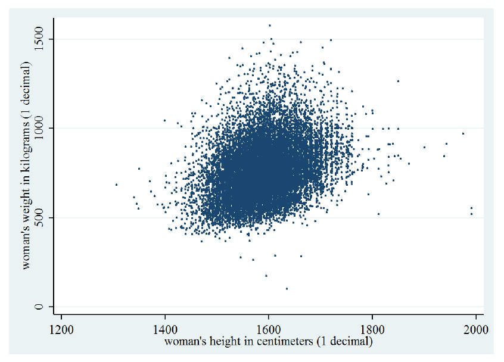

La distribuzione è molto simile ad una gaussiana bidimensionale. Possiamo modellare $P(X \mid C = 1)$ considerando tutti e soli gli esempi di sesso femminile e calcolando i parametri della gaussiana bidimensionale: 
$$
N(x; \mu, \Sigma) = \sqrt{\frac{1}{(2\pi)^2 \det(\Sigma)}} 
\exp(- \frac 1 2 (x - \mu)^T \Sigma^{-1} (x - \mu))
$$
Siano $x_F$ gli input di sesso femminile, calcoliamo i parametri della gaussiana bidimensionale: 
$$
\mu_F = \frac 1 n \sum_j x_{F}^{(j)}
$$

$$
\Sigma_F = Cov(x_f)
$$

Facciamo lo stesso considerando solo gli input di sesso maschile $x_M$ e calcoliamo le rispettive likelihood come segue: 

* $P(X \mid C = 0) = N(x; \mu_M, \Sigma_M)$; 
* $P(X \mid C = 1) = N(x; \mu_F, \Sigma_F)$;  

Classificheremo l'esempio $x$ come *femmina* se $P(x \mid 1) p(1) > P(x \mid 0) p(0)$, *maschio* altrimenti. 


### 3.3 Classificatore Naïve Bayes 

Il calcolo della likelihood potrebbe essere oneroso nel caso la variabile $X$ abbia molte dimensioni. Il classificatore Naïve Bayes assume in maniera naïve che gli attributi di $X$ siano *condizionalmente indipendenti* tra loro, ovvero indipendenti fissata la classe $C$ di appartenenza:
$$
X_i \bot X_j \mid C, \forall i \ne j
$$
Tale assunzione è spesso non vera, ma semplifica notevolmente il calcolo e procura generalmente buoni risultati. Per le proprietà di indipendenza condizionata possiamo riscrivere la likelihood come segue: 
$$
P(X \mid C_i) = \prod_{k=1}^n P(x_k \mid C_i) = 
P(x_1 \mid C_i) \times \dots \times P(x_n \mid C_i)
$$
E la regola di classificazione MAP: 
$$
f(x) = \text{arg}\max_c \left[
P(x_1 \mid C) \times \dots \times P(x_n \mid C) \times P(C)
\right]
$$
I singoli termini $P(x_i \mid C)$ sono semplici da stimare dato che $x_i$ è monodimensionale. Nella pratica viene scelta una distribuzione tra la Gaussiana e la Multinomiale per modellare approssimare la distribuzione reale dei dati. Se viene utilizzata la distribuzione gaussiana, allora il classificatore prende il nome di "Gaussian Naïve Bayes", mentre nel caso della multinomiale "Multinomial Naïve Bayes".  


#### 3.3.1 Gaussian Naïve Bayes 

Consideriamo nuovamente la classificazione dei sessi basata su altezza e peso (esempio 3.2.3). Se i dati assumono approssimatamente una distribuzione gaussiana e considerando la assunzione naïve, le probabilità $P(H \mid C)$ ed $P(W \mid C)$ possono essere modellate singolarmente attraverso una gaussiana monodimensionale. Eseguiamo il calcolo per ognuna delle classi, ottenendo 4 espressioni più semplici da calcolare: 

* $P(H = h \mid C = 0) = N(x; \mu_1, \sigma_1)$
* $P(H = h \mid C = 1) = N(x; \mu_2, \sigma_2)$
* $P(W = w \mid C = 0) = N(x; \mu_3, \sigma_3)$
* $P(W = w \mid C = 1) = N(x; \mu_4, \sigma_4)$ 

Dopodiché classificheremo l'esempio $x = (h, w)$ come *femmina* (1) se: 
$$
P(h \mid 1 ) P(w \mid 1) P(1) > P(h \mid 0 ) P(w \mid 0) P(0)
$$
*maschio* altrimenti. 


#### 3.3.2 Multinomial Naïve Bayes 

Nell'esempio precedente si è fatto uso di variabili aleatorie continue, per cui è necessario considerare una  PDF (*Probability Density Function*) come una distribuzione gaussiana. Quando gli attributi dei dati sono discreti, ha senso utilizzare una PMF (*Probability Mass Function*). 

> La *distribuzione multinomiale* di parametri $((p_1, \dots, p_s), n)$ con $p_1 + \dots + p_s = 1$, descrive la probabilità per ogni $s$-upla $(n_1, \dots, n_s)$ con $n_1 + \dots + n_s = n$ di assumere i risultati $x_1, \dots, x_s$ in $n$ prove indipendenti, ognuna delle quali ha probabilità $p_i$ di fornire $x_i$. 

Consideriamo l'esempio della *text classification*. Ipotizziamo di rappresentare un documento d'esempio con la rappresentazione Bag of Words (conteggio delle occorrenze di parole in un vocabolario). Dato un vocabolario $V$ di lunghezza $s$, ogni input $x$ avrà $s$ attributi $(x_1, \dots, x_s)$, con $x_i \in \N$ che rappresenta il numero di occorrenze nel documento della $i$-esima parola nel vocabolario. 

La likelihood di un esempio $x$ sarà $P(x_1, \dots x_s \mid C)$. Utilizzando l'assunzione naïve diciamo che il numero di occorrenze della $i$-esima parola nel documento di classe $C$ è indipendente dal numero di occorrenze della parola $j$-esima. Possiamo utilizzare la distribuzione multinomiale per calcolare la probabilità $P(x_1, \dots, x_s \mid C)$, ma è necessario fissare alcuni parametri: 

* Il numero di esperimenti $n$ sarà il numero totale di parole nel documento $\sum_{i=1}^n x_i$
* $(n_1, \dots, n_s)$ rappresenta le occorrenze delle $s$ parole nel vocabolario $V$ in un documento
* La probabilità $p_{ci}$ sarà la probabilità di trovare la parola $i$-esima del vocabolario $V$ fissata una classe $C$

È possibile calcolare la probabilità $p_{ci}$ in maniera frequentista: 
$$
p_{ci} = \frac
{\sum_{j}^n [y^{(j)} = c] x_i^{(j)} } 
{\sum_{j}^n \sum_k^s [y^{(j)} = c] x_k^{(j)}}
$$
Dove $[·]$ denota le parentesi di Iverson, che valgono 1 se la condizione all'interno è soddisfatta, 0 altrimenti. La probabilità corrisponde al numero di occorrenze della parola $i$-esima in tutti i documenti di classe $c$ rispetto al numero totale di parole nei documenti di classe $c$.  

È possibile risolvere il problema di classificazione con il metodo MAP: 
$$
f(x_1, \dots, x_s) = \text{arg}\max_c P(x_1, \dots, x_s \mid c)P(c)
$$
Sostituendo la likelihood con la formula analitica della distribuzione multinomiale: 
$$
f(x_1, \dots, x_s) = \text{arg}\max_c P(c) \left[  
\frac{(\sum_{i} x_i)!}{x_1!\times \dots \times x_n!}
p_{c1}^{x_1} \times \dots \times p_{cs}^{x_s}
\right]
$$
Il rapporto $\frac{(\sum_{i} x_i)!}{x_1!\times \dots \times x_n!}$ è analogo qualunque sia la sequenza in input, per cui massimizzare tale espressione equivale a massimizzare: 
$$
f(x_1, \dots, x_s) = \text{arg}\max_c P(c) \left[  

p_{c1}^{x_1} \times \dots \times p_{cs}^{x_s}
\right]
$$


#### 3.3.3 Zero probability e underflow 

Il metodo Naive Bayes richiede che le probabilità condizionali siano diverse da 0, altrimenti la likelihood risulterà nulla. Inoltre, se le probabilità condizionali sono molto piccole, un prodotto di tante quantità prossime allo 0 può portare problemi di precisione e di underflow. 

Per ovviare al primo problema, si può utilizzare la **correzione Laplaciana**, ovvero aggiungere 1 ad ogni probabilità condizionale. 

Per ovviare a entrambi i problemi, si può considerare il **log-likelihood**, ovvero il logaritmo di $P(X|C_i)$, che si traduce in una somma anziché un prodotto dei termini: 
$$
\log P(X|C_i) = \log \prod_{k=1}^n P(x_k|C_i) = \\ 
= \log P(x_1|C_i) + ...+\log P(x_n|C_i) = \\
= \sum_{k=1}^n \log P(X_k|C_i)
$$


#### 3.3.4 Conclusioni

Il classificatore Naive Bayes è facile da implementare, discretamente veloce nella classificazione e produce buoni risultati. Tuttavia, l'assunzione naive non è sempre vera e può provocare una perdita di accuratezza. Le dipendenze tra più attributi, sempre a causa dell'assunzione, non possono essere modellate. 

<div style="page-break-after: always;"></div>

## 4. Classificatori discriminativi

### 4.1 Introduzione

I classificatori discriminativi cercano di predire la classe direttamente a partire dai dati osservati, facendo poche assunzioni sulla loro distribuzione. Esempi di classificatori discriminativi sono il Perceptron ed SVM. 


#### 4.1.1 Differenze tra generativo e discriminativo

Il classificatore *generativo* sviluppa un modello probabilistico sui dati a partire da un insieme di assunzioni e predice la classe più probabile per un nuovo dati. Il classificatore *discriminativo* costruisce una funzione di decisione $F$ a partire dai dati osservati stimando pesi calcolati per ogni attributo e dipendenti dai valori dell'attributo stesso. Se $X$ è un nuovo dato, si calcola $F(X)$ ed il valore ottenuto è la classe di $X$. 


#### 4.1.2 Vantaggi e svantaggi

Vantaggi dei classificatori discriminativi: 

* Maggiore accuratezza in generale
* Robusti in presenza di errori nel training set
* Facile calcolo del valore della funzione di decisione $F$ su un nuovo dato

Svantaggi: 

* Tempo di addestramento lungo
* Difficile interpretare i pesi della funzione di decisione calcolata
* Non è semplice incorporare conoscenza a priori (nei metodi Bayesiani risulta molto semplice)

Si rimedia alla difficile interpretazione dei pesi attraverso la [explainable artificial intelligence](https://en.wikipedia.org/wiki/Explainable_artificial_intelligence), ovvero tutta una serie di metodi per rendere il risultato di una soluzione comprendibile dagli umani. 


### 4.2 Classificazione lineare vs non lineare

Nella **classificazione lineare** la classificazione di una osservazione $X$ è basata sul valore di una funzione lineare $f$, ovvero una combinazione lineare degli attributi di $X$: 
$$
y = f(X)=\sum_{i=1}^k w_i*x_i
$$
Dove $w_1, ..., w_n$ sono i pesi della combinazione lineare. 

Nella **classificazione non lineare** la classificazione di $X$ è effettuata utilizzando una funzione non lineare degli attributi di X, ovvero dove gli attributi possono assumere potenze diverse dalla prima. 


#### 4.2.1 Esempio: lineare binaria vs non lineare binaria

Nella classificazione binaria le osservazioni possono essere separate in due classi differenti. Utilizzare la classificazione lineare binaria si traduce nel trovare un **iperpiano separatore** che possa suddividere le osservazioni nelle due classi. Si utilizza una classificazione non binaria quando non esiste una funzione lineare in grado di separare tali dati. 


### 4.3 Perceptron 

Perceptron è un algoritmo di classificazione lineare binaria. La classificazione viene effettuata sulla base di una funzione predittiva lineare che si ottiene combinando un insieme di pesi con il vettore degli attributi dell'oggetto. In generale, l'algoritmo perceptron è utilizzabile solo quando il dataset risulta *separabile linearmente*. 

Supponiamo di avere due classi $\{0, 1\}$, data l'osservazione $X$, la funzione predittiva è: 
$$
f(X) = \begin{cases}
1 \space if \space wX + b > 0 \\
0 \space otherwise
\end{cases}
$$
con *w* vettore di pesi con cardinalità pari a quella degli attributi + 1. 
Perceptron effettua un ***apprendimento online***: gli elementi del training set vengono processati uno per volta e i pesi aggiornati ogni volta che un nuovo elemento è preso in esame. Il modello prodotto, chiamato anche single-layer Perceptron, è una **rete neurale** single-layer. Esistono anche multi-layer Perceptron, che combinano più funzioni di aggregazione. 

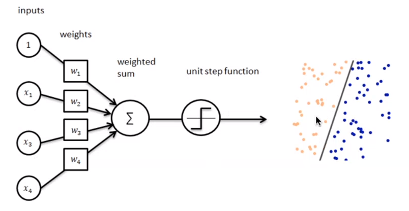


#### 4.3.1 Definizioni preliminari

Introduciamo alcune notazioni: 

* Sia $D=\{(x_1, d_1), ..., (x_n, d_n)\}$ il training set, con $x_j$ una tupla e $d_j$ la rispettiva classe (0 o 1).
* Sia $r$ il **learning rate**, un valore tra 0 e 1 che determina la grandezza della variazione dei pesi ad ogni passo, $r$ è un iperparametro.
* Sia $y_j=f(x_j)$ la classe di output predetta dal perceptron (0 o 1) per la j-esima tupla del training set D. 
* $x_{j,i}$ rappresenta l' i-esimo attributo della j-esima tupla $x_j$ del training set D. 
* Si pone convenzionalmente $x_{j,0} = 1$ (l'attributo di indice 0).
* Sia $w_i(t)$ il peso della i-esima feature al passo *t*. 

Dal momento che $x_{j,0} = 1$, allora $w_0(t)$ equivale alla **costante** *b* nell'espressione $f(X)$. 


#### 4.3.2 Procedura 

Supponiamo che ogni tupla del dataset abbia *k* attributi, l'algoritmo Perceptron esegue i seguenti passaggi

* (1) Inizializza i pesi $w_i(t = 0)$ al valore 0 o ad un valore random piccolo. 

* (2) Per ogni coppia $(x_i, d_i) \in D$ : 

  * (2.1) Calcola l'output attuale: 

  $$
  y_j(t) = f[w(t) * x_i] = f[w_0(t) x_{j,0} + w_1(t) x_{j,1} + ... + w_k(t) x_{j,k}]
  $$

  * (2.2) Aggiorna ognuno dei pesi $w_j$: 

  $$
  w_j(t+1) = w_j(t) + r*(d_i - y_i(t)) * x_{i,j}
  $$

* (3) Nel caso di learning offline, ripeti il passo n.2 sino a quando l'errore medio di classificazione è inferiore ad una soglia $\gamma$, oppure un numero predefinito di iterazioni è stato completato. 

N.B. L'errore medio di classificazione è ottenuto attraverso la seguente formula: 
$$
E = \frac{1}{n} \sum_{i=1}^n |d_i - y_j(t)|
$$
Nella pratica, il passo 2 viene iterato affinché la retta (o in generale, l'iperpiano) trovi i coefficienti adatti a separare l'intero dataset in due classi distinte. Ipotizziamo vi che al tempo *t* vi sia un errore, l'aggiornamento dei pesi ridefinirà ognuno dei pesi (da utilizzare al prossimo passo $t + 1$) come segue: 
$$
w_j(t+1) = w_j(t) + r*(d_i - y_i(t)) * x_{i,j}
$$
Dove: 

* $w_j(t)$ è la componente j-esima del vettore dei pesi al tempo t
* $d_i - y_i(t)$ sarà nullo nel caso in cui la classificazione sia corretta, -1 nel caso in cui il punto sta al di sotto della retta (o dell'iperpiano), 1 nel caso in cui sia al di sopra. 
* $x_{i,j}$ è la j-esima componente del punto $x_i$, classificato al tempo *t*.
* *r* è il learning rate, che a seconda della grandezza definisce con quale velocità la retta (o l'iperpiano) converge alla posizione ideale. Tuttavia, un learning rate alto potrebbe causare più errori durante il procedimento.  

<div style="page-break-after: always;"></div>

## 5. Support Vectors machines

### 5.1 Idea generale

Il metodo Support Vectors Machines è un metodo di classificazione *binaria*, ovvero le osservazioni sono classificate in due sole classi. Se i dati del training set sono **linearmente separabili**, allora l'SVM trova l'iperpiano separatore ottimale, ovvero quell'iperpiano che li separi al meglio. Se i dati non sono linearmente separabili, allora essi vengono prima trasferiti in uno spazio con un **numero di dimensioni maggiore**, attraverso una operazione di *mapping*. Con l'aumentare delle dimensioni aumenta anche il volume dello spazio e, di conseguenza, i dati tendono a separarsi maggiormente, per cui è molto più probabile che diventino linearmente separabili. Si può dimostrare che per ogni insieme di dati esiste uno spazio con un numero di dimensioni sufficientemente grande tale che i dati siano linearmente separabili. Una volta eseguito il mapping, SVM procede trovando l'iperpiano separatore ottimale.  


### 5.2 Iperpiano ottimale e vettori di supporto

Definiamo i **vettori di supporto** (support vectors) come le osservazioni più vicine all'iperpiano separatore. Tali osservazioni sono le più complesse da classificare; in generale più un punto è lontano dall'iperpiano separatore, più è certa la appartenenza alla classe. 

I vettori di supporto servono a stabilire quale tra gli iperpiani che separano linearmente i punti è quello ottimale. Introduciamo i **margini** come le distanze tra questi vettori di supporto e l'iperpiano. L'iperpiano separatore ottimale è quello che massimizza i margini. 


<div style="page-break-after: always;"></div>

### 5.3 Condizioni sui punti

Possiamo rappresentare un iperpiano a $k$ dimensioni con la seguente equazione: 
$$
\bar{w} * \bar{x} + b = 0 \\
w_1*x_1 + ... + w_k*x_k + b = 0
$$
Dove con $\bar{w} * \bar{x}$ si intende il prodotto scalare tra un vettore dei pesi $\bar{w}$ e delle incognite $\bar{x}$, e $b$ è uno scalare detto *bias*. Essendovi due classi, possiamo stabilire la classe di una osservazione a seconda che stia sopra o sotto l'iperpiano. Sia $\bar{x}$ una osservazione, allora: 
$$
\bar{w} * \bar{x} + b > 0 \Rightarrow class(\bar{x}) = +1 \\
\bar{w} * \bar{x} + b < 0 \Rightarrow class(\bar{x}) = -1
$$
Tuttavia, utilizzando solo questa condizione andrebbe bene qualsiasi iperpiano che separi le due classi. Imponiamo invece che ogni punto al di sopra dell'iperpiano rispetti la seguente condizione: 
$$
(1) \space class(\bar{x}) = +1 \Longleftrightarrow \bar{w} * \bar{x} + b \ge +1
$$
 Simmetricamente, per i punti al di sotto dell'iperpiano: 
$$
(2) \space class(\bar{x}) = -1 \Longleftrightarrow \bar{w} * \bar{x} + b \le -1
$$
Se un punto rappresenta un vettore di supporto, ovvero risiede nella frontiera della separazione, allora: 
$$
(1.1) \space class(\bar{x}) = +1 \space  and \space \bar{x} \space is \space support \space vector\Longleftrightarrow \bar{w} * \bar{x} + b = +1 \\
(2.1) \space class(\bar{x}) = -1 \space  and \space \bar{x} \space is \space support \space vector\Longleftrightarrow \bar{w} * \bar{x} + b = -1 \\
$$
Risulta scomodo dover considerare due condizioni (1, 2) da applicare ai punti. È possibile ridurre entrambe le espressioni ad una sola espressione, introducendo la variabile $y_i$ come segue:  
$$
y_i = \begin{cases}
+1 \space if \space class(x_i) = +1 \\
-1 \space if \space class(x_i) = -1 \\
\end{cases}
$$
Le condizione vengono ridotte alla seguente espressione: 
$$
(3.1) \space y_i(\bar{w} * \bar{x} + b) \ge 1
$$
O anche: 
$$
(3.2) \space y_i(\bar{w} * \bar{x} + b) - 1\ge 0
$$
Esempio: consideriamo un punto al di sotto dell'iperpiano separatore, per cui $y_i = -1$. Se il punto rispetta il vincolo (2), producendo un certo scalare $a < -1$, allora il prodotto rispetta il vincolo (3): 
$$
y_i(\bar{w} * \bar{x} + b) \ge 1 = (-1)(a) \ge 1
$$
Analogamente per i punti al di sopra dell'iperpiano. 

<div style="page-break-after: always;"></div>

### 5.4 Larghezza del margine

L'obiettivo principale è quello di massimizzare il margine, ovvero la distanza tra i vettori di supporto delle due diverse classi. Ma come otteniamo la larghezza del margine? Consideriamo un vettore di supporto $v$ di classe $+1$ ed un vettore di supporto $u$ di classe $-1$. Ipotizziamo di avere il versore w normale all'iperpiano:  

  

Per ottenere la larghezza del margine, basterebbe proiettare i due vettori di supporto sul versore normale e calcolarne la differenza: 


<div style="page-break-after: always;"></div>

Il vettore dei pesi $\bar{w}$ è ortogonale rispetto all'iperpiano risultante. Per ottenere un versore normale all'iperpiano basta dividere il vettore $\bar{w}$ per la sua norma $||\bar{w}||$:  
$$
\hat{w} = \frac{\bar{w}}{||\bar{w}||}
$$
Per cui, definendo con $m$ la larghezza del margine, abbiamo che: 
$$
(4) \space m = (\bar{v} - \bar{u})*\hat{w} = (\bar{v} - \bar{u})*\frac{\bar{w}}{||\bar{w}||}=
\frac{\bar{v}*\bar{w} - \bar{u}*\bar{w}}{||\bar{w}||}
$$
Ricordiamo che valgono le condizioni sui vettori di supporto. Iniziamo con $\bar{v}$ che è vettore di supporto per la classe $+1$, per cui dalla condizione (1.1) abbiamo che: 
$$
(4.1) \space \bar{w} * \bar{v} + b = +1 \Rightarrow \bar{w} * \bar{v} = 1 - b
$$
Simmetricamente, per il vettore di supporto $\bar{u}$ di classe $-1$ abbiamo che: 
$$
(4.2) \space \bar{w} * \bar{u} + b = -1 \Rightarrow \bar{w} * \bar{v} = -1 - b
$$
Sostituendo le espressioni 4.1 e 4.2 alla 4, otteniamo che: 
$$
m =\frac{\bar{v}*\bar{w} - \bar{u}*\bar{w}}{||\bar{w}||} 
= \frac{1-b-(-1-b)}{||\bar{w}||} 
=\frac{1 - b + 1 + b}{||\bar{w}||}
= \frac{2}{||\bar{w}||}
$$


### 5.5 Massimizzare il margine

Trovare l'iperpiano ottimale significa trovare quell'iperpiano che massimizzi la larghezza del margine:
$$
\max \frac{2}{||\bar{w}||}
$$
Tuttavia, gli studi dimostrano che è matematicamente più conveniente considerare l'analogo problema: 
$$
\max \frac{2}{||\bar{w}||} = \min ||\bar{w}|| = \min \frac12 ||\bar{w}||^2
$$
Rispetto alla condizione: 
$$
y_i(\bar{w}*\bar{x}_i - b) \ge 1
$$

<div style="page-break-after: always;"></div>

### 5.6 Hard margin e soft margin

Sino ad ora abbiamo considerato il vincolo (3.1) molto restrittivo, per cui all'interno dei margini non vi può risiedere alcun punto. Questo metodo prende il nome di **hard margin**. Si tratta di una scelta molto rigida, che porta ad un modello estremamente sensibile al rumore. In presenza di rumore, è molto probabile che il modello hard margin produca un iperpiano con una zona di margine molto ristretta, o in generale è frequente ottenere errori da overfitting su dati reali. 

Un modello meno sensibile al rumore è il **soft margin**, il che consiste nell'ammettere che alcuni punti possano trovarsi nella zona di margine, violando i vincoli. Tuttavia, un soft margin troppo permissivo rischia di compromettere l'accuratezza del classificatore. Occorre dunque un trade-off tra la larghezza del margine ed il numero di violazioni del margine consentite al classificatore.


### 5.7 Classificazione soft margin 

Nella classificazione soft margin vengono introdotte *n* variabili di **slack** $\epsilon_1, ..., \epsilon_n$, dove l'i-esima variabile è definita come segue: 
$$
\max \left( 0, 1 - y_i(\bar{w}_i * \bar{x}_i - b) \right)
$$
Ricordiamo che per ogni punto al di fuori dei margini vale il vincolo: 
$$
y_i(\bar{w} * \bar{x}_i - b) \ge 1
$$
Per cui se l'i-esimo punto rispetta il vincolo, allora: 
$$
1 - y_i(\bar{w} * \bar{x}_i - b) \le 0 \Longrightarrow \epsilon_i = \max\left(0, 1 - y_i(\bar{w} * \bar{x}_i - b)\right) = 0
$$
Altrimenti, se l'i-esimo punto non è classificato correttamente, ovvero si trova tra  $H_1$ e $H_2$, $\epsilon_i$ è proporzionale alla distanza del punto dal margine della classe corrispondente; ovvero più è distante dal margine della classe corretta, più il valore $\epsilon_i$ è alto. $\epsilon_i$ è il più piccolo numero non negativo che soddisfa la seguente disuguaglianza: 
$$
y_i(\bar{w} * \bar{x}_i - b) \le 1 - \epsilon_i
$$

<div style="page-break-after: always;"></div>

Vogliamo che in media gli $\epsilon_i$ siano piccoli.  Introduciamo un parametro $\lambda$ che costituisce il trade-off tra larghezza del margine e numero di violazioni tollerate. Il problema di ottimizzazione diventa: 
$$
\min \left( \frac{1}{n} \sum_{i=1}^n \epsilon_i + \lambda||\bar{w}||^2 \right) 
$$
Soggetto alle condizioni: 
$$
y_i(\bar{w} * \bar{x}_i - b) \le 1 - \epsilon_i \space\space\space\space\space 1 < i< n \\
\epsilon_i \ge 0 \space\space\space\space \space 1 < i< n
$$
Più piccolo è il valore $\lambda$, più trascurabile è $\lambda*||\bar{w}||^2$, ovvero meno importante è la dimensione del margine. Variando $\lambda$ possiamo controllare il peso della dimensione del margine nel calcolo dell'iperpiano separatore. 

Utilizzando la **formulazione di Lagrange**, il problema precedente è traducibile nel seguente problema duale: 
$$
\max \left( \sum_{i=1}^n c_i - \frac12 \sum_{i,j=1}^n c_i c_j y_i y_j(\bar{x}_i*\bar{x}_j) \right)
$$
Soggetto alle condizioni: 
$$
(1) \space \sum_{i=1}^n c_i y_i = 0 \space \space \space i=1,...,n \\
(2) \space 0 \le c_i \le \frac{1}{2n\lambda} \space \space \space i=1,...,n \\
$$
Dove $c_i$ sono i moltiplicatori di Lagrange. Dal momento che la funzione duale è quadratica in $c_i$, è possibile ricavare tali moltiplicatori utilizzando algoritmi di programmazione quadratica. Una volta ricavati, è possibile calcolare il vettore dei pesi come segue: 
$$
\bar{w} = \sum_{i=1}^n c_i y_i \bar{x}_i
$$
Mentre la costante di *bias* $b$ può essere calcolata prendendo uno tra i vettori di supporto $\bar{x}_i$ e risolvendo la seguente equazione rispetto a $b$: 
$$
y_i(\bar{w}_i*\bar{x}_i - b) = 1  \Rightarrow b = \bar{w}_i*\bar{x} - y_i^{-1}
$$

<div style="page-break-after: always;"></div>

### 5.8 Mapping di dati non linearmente separabili

Nel caso in cui i dati non siano linearmente separabili, lo spazio di input viene mappato in un nuovo spazio con più dimensioni attraverso una **funzione di mapping** $\phi$. Nel nuovo spazio i punti risultano linearmente separabili, quindi è possibile risolvere lo stesso problema di ottimizzazione visto prima, in cui al posto di $\bar{x}_i$ abbiamo $\phi(\bar{x}_i)$. 

**Esempio**: poniamoci in uno spazio a 3 dimensioni, in cui le osservazioni sono vettori $\bar{x} = (x_1, x_2, x_3)$. Supponiamo che in tale spazio, i dati non siano linearmente separabili. Utilizziamo la seguente funzione di mapping: 
$$
\phi: \R^3 \rightarrow \R^6  \\
\phi(\bar{x}) = (x_1, x_2, x_3, x_1^2, x_1x_2, x_1x_3)
$$
La funzione ricava le ulteriori 3 dimensioni moltiplicando ad ognuna delle componenti la componente $x_1$. L'equazione dell'iperpiano separatore nello spazio $\R^6$ sarà: 
$$
H = \bar{w}_i * \phi(\bar{x}) - b = 0
$$
In generale, il problema di ottimizzazione posto precedentemente è riproponibile utilizzando la funzione $\phi$ che mappa i dati in input: 
$$
\max \left( \sum_{i=1}^n c_i - \frac12 \sum_{i,j=1}^n c_i c_j y_i y_j(\phi(\bar{x}_i)*\phi(\bar{x}_j)) \right)
$$
Soggetto alle condizioni: 
$$
(1) \space \sum_{i=1}^n c_i y_i = 0 \space \space \space i=1,...,n \\
(2) \space 0 \le c_i \le \frac{1}{2n\lambda} \space \space \space i=1,...,n \\
$$

<div style="page-break-after: always;"></div>

### 5.9 Funzioni kernel

Il prodotto $\phi(\bar{x}_i)*\phi(\bar{x}_j)$ può essere più dispendioso da calcolare, dal momento in cui ci troviamo in uno spazio a più elevata dimensionalità. Per ovviare al problema, si utilizzano le funzioni di kernel. Una **funzione di kernel K** è una funzione che soddisfa la condizione: 
$$
K(\bar{x}_i,\bar{x}_j) =\phi(\bar{x}_i)*\phi(\bar{x}_j)
$$
Essa definisce implicitamente il mapping nel nuovo spazio. Permette di sostituire al prodotto scalare il valore stesso della funzione kernel e di effettuare tutti i calcoli direttamente nello spazio originario che ha meno dimensioni. Vediamo di seguito alcune funzioni kernel tipiche. 

**Kernel polinomiale di grado H**
$$
K(\bar{x}_i,\bar{x}_j) = \left( \bar{x}_i * \bar{x}_j + 1 \right)^h
$$
**Kernel gaussiano**
$$
K(\bar{x}_i,\bar{x}_j) = \exp(-\frac{||\bar{x}_i - \bar{x}_j||^2}{2\sigma^2})
$$
**Kernel sigmoide**
$$
K(\bar{x}_i,\bar{x}_j) = \tanh \left( k\bar{x}_i * \bar{x}_j - \delta \right)
$$

Durante la costruzione del modello discriminativo è bene provare più funzioni kernel e selezionare quella più adatta, in base ad un indice di performance.  
Infine possiamo quindi rappresentare il problema di ottimizzazione mediante funzione di kernel come segue: 
$$
\max \left( \sum_{i=1}^n c_i - \frac12 \sum_{i,j=1}^n c_i c_j y_i y_jK(\bar{x}_i,\bar{x}_j)) \right)
$$
Soggetto alle condizioni: 
$$
(1) \space \sum_{i=1}^n c_i y_i = 0 \space \space \space i=1,...,n \\
(2) \space 0 \le c_i \le \frac{1}{2n\lambda} \space \space \space i=1,...,n \\
$$


### 5.10 Conclusioni

Alcune implementazioni di SVM permettono di classificare i dati su più di due classi. L'SVM si presta bene a classificare dati ad elevata dimensionalità ed è meno soggetto ad overfitting rispetto ad altri metodi. 

<div style="page-break-after: always;"></div>


## 6. Lazy Learning

### 6.1 Apprendimento eager contro lazy 

I modelli classificativi o predittivi possono portare a compimento i propri task con un certo livello di accuratezza imparando dai dati di training. Vi sono due tipi di apprendimento: il primo viene chiamato apprendimento **eager** (impaziente), il secondo prende il nome di apprendimento **lazy** (pigro). 

* **Apprendimento eager** (eager learning): dato un training set, si costruisce un modello prima di ricevere nuovi dati da classificare. 
* **Apprendimento lazy** (lazy learning): semplicemente memorizza il training set di dati e calcola la funzione di classificazione nel momento in cui c'è da classificare un nuovo dato. 

Tutti i metodi visto fin qui effettuano un apprendimento eager. 

I metodi di apprendimento lazy hanno un tempo di predizione più alto, mentre il training è molto veloce, poiché richiede solo la memorizzazione dei dati. La funzione di predizione è approssimata localmente. I metodi lazy sono utili nel caso di grandi dataset con pochi attributi e che si aggiornano continuamente (es. detaset di contenuti multimediali).  Per quest'ultimo motivo sono molto utilizzati nei *sistemi di raccomandazione* (predizione della preferenza che potrebbe esprimere un utente su un item, come un film o un prodotto commerciale). Un esempio di algoritmo che sfrutta l'apprendimento lazy è il kNN. 


### 6.2 kNN - K-Nearest Neighbors


#### 6.2.1 Nearest neighbor algorithm 

Supponiamo di avere in input un nuovo dato $x$ da classificare. Una buona idea sarebbe quella di assegnare a tale dato la classe dell'osservazione $\bar{x}$ più vicina. È necessario quindi utilizzare una funzione distanza $d(x,\bar x)$ da minimizzare, e molto spesso tale funzione corrisponde alla distanza euclidea: 
$$
d(x,\bar x) = ||x - \bar x||_2 = \frac 1 n \sqrt{\sum_{i=1}^n (x - \bar x)^2}
$$
Dove $n$ è il numero di feature delle osservazioni. In tal caso la funzione $f$ di classificazione non dovrà fare altro che trovare quel dato del training set $\bar x$ che minimizzi la funzione distanza $d$: 
$$
f(x) = arg \min_\bar x d(x,\bar x)
$$


#### 6.2.2 K-Nearest neighbor algorithm

L'algoritmo precedente non tiene conto dei possibili outliers presenti nel training set, di conseguenza un'idea più accurata è quella di trovare, anziché uno, i primi $k$ dati più vicini al dato in input. 


#### 6.2.3 Definizione formale dell'algoritmo

Una volta individuata la funzione distanza $d$ più appropriata, definiamo: 
$$
N(x'; TR, K) = \left\{ (x,y) \in TR : d(x',x) \le \epsilon_k(x';TR,K) \right\}
$$
L'intorno di centro $x'$ e di raggio $\epsilon_k$ contenente le $k$ osservazioni più vicine ad $x'$. $TR$ indica il training set e $K$ è l'iperparametro scelto dall'utente. Determiniamo il raggio $\epsilon_k$ tramite tale definizione: 
$$
\epsilon_k(x'; TR, K) = \epsilon : |\{ (x,y) \in TR : d(x,x') \le \epsilon \}| = K
$$
Ovvero quel raggio dell'intorno centrato in $x'$ che comprenda esattamente i $K$ più vicini ad $x'$. Definiamo infine la funzione $f$ di classificazione come segue: 
$$
f(x') = moda \{ y : (x,y) \in N(x',TR,K) \}
$$
Dove per moda si intende la funzione statistica che individua l'elemento più frequente. In questo caso controlla qual è l'etichetta $y$ più frequente nei $K$ elementi più vicini all'elemento in input. 

<div style="page-break-after: always;"></div>


#### 6.2.4 Scelta di K 

Consideriamo le seguenti mappe le quali individuano, al variare di $K$, la classe predominante in una porzione di area. Se $K$ è particolarmente piccolo (primo quadrante), allora il piano verrà segmentato in piccole porzioni di area con classi diverse e ciò può provocare overfitting. Tuttavia, un $K$ troppo grande andrebbe ad approssimare eccessivamente la scelta, per cui l'algoritmo risulterebbe meno accurato e si avrebbe underfitting. L'iperparametro va calibrato attraverso delle prove su un set di validazione. 


#### 6.2.5 Varianti implementative

Una variante più sofisticata del kNN potrebbe pesare gli oggetti sulla base della distanza: 

* Assegna un peso ad ogni oggetto sulla base della distanza dal punto da classificare. 
* I punti più vicini hanno un peso maggiore nella classificazione.
* Il peso potrebbe essere calcolato come l'inverso del quadrato della distanza.


#### 6.2.6 Importanza del kNN

Come detto in precedenza, molto spesso è difficile interpretare i risultati degli algoritmi di classificazione (come quelli forniti dalle reti neurali). Nel caso del kNN è possibile utilizzare un *k* sufficientemente grande e, una volta selezionati i k oggetti più vicini, creare un albero decisionale su tali oggetti che riesca a fornire delle spiegazioni più o meno chiare rispetto all'associazione. Perché allora non costruire un albero decisionale direttamente sui dati di training del kNN? Questo poiché molto spesso si ha a che fare con mole di dati molto ampia, per cui gli alberi decisionali diventano dispendiosi e sconvenienti; al contrario, con kNN si riesce ad estrarre un sottoinsieme di dati localmente connesso al dato da esaminare. 

<div style="page-break-after: always;"></div>


## 7. Apprendimento ensemble


### 7.1 Idea principale

L'idea dell'apprendimento ensemble è quella di combinare due o più modelli di apprendimento al fine di ottenere migliori performance di predizione rispetto ai modelli presi singolarmente. In altre parole, vanno combinate ipotesi multiple al fine di ottenere una migliore ipotesi predittiva. Generalmente, con il termine ensemble learning si intende una combinazione di modelli dello stesso tipo (es. alberi decisionali, SVM, etc.). L'ensemble learning richiede molta più computazione, quindi ha senso solo se è usato per combinare algoritmi di apprendimento veloci (come gli alberi decisionali) che non hanno elevata accuratezza se presi singolarmente. Il problema principale è come addestrare i classificatori e come combinarne i risultati. 


### 7.2 Bootstrap o bagging 

Una tecnica comune di ensemble learning è il *bootstrap* o *bagging*. Siano $M_1, ..., M_k$ i $k$ modelli da combinare. Dividiamo il training set in $k$ sottinsiemi $T_1, ..., T_k$ ottenuti mediante campionamento random delle tuple *con ripetizioni* (*bootstrap sampling*).  Il modelo $M_i$ viene addestrato con il training set $T_i$. Nel caso della predizione, viene restituita la media dei valori predetti, mentre nel caso della classificazione si restituisce l'etichetta di maggioranza, ovvero quella predetta dal maggior numeri di classificatori. 


### 7.3 Random forest

Il *Random Forest* è un esempio di modello (classificatore o predittore) ensemble che combina i risultati di diversi alberi decisionali mediante la tecnica bootstrap. In più il Random Forest addestra ciascun albero con un sottoinsieme random di $m$ attributi (*bagging sugli attributi*). Tipicamente se $p$ è il numero totale di attributi, $m = \sqrt{p}$ per la classificazione, $m= \frac p 3$ per la predizione. Attributi che risultano essere predittori molto forti vengono prontamente selezionati dagli alberi decisionali. Il bagging sugli attributi diminuisce la correlazione tra i risultati degli alberi.

<div style="page-break-after: always;"></div>


## 8. Validazione di un classificatore


### 8.1 Matrice di confusione 

La matrice di confusione è una struttura utile a rappresentare l'accuratezza di un classificatore. Da tale matrice derivano varie metriche che analizzeremo in dettaglio. Sulle righe sono disposti i valori reali, mentre sulle colonne i valori predetti. Vediamo un esempio in figura: 


L'elemento $c_{i,j}$ contiene il numero di casi in cui il classificatore ha classificato l'osservazione nella classe $j$, quando la classe di appartenenza è $i$. Nel caso in cui $j = i$ allora la classe predetta è corretta: un buon classificatore ha valori alti nella diagonale principale e valori nulli (o molto bassi) nelle altre posizioni. 


### 8.2 Accuratezza & Error rate

Dato un classificatore $M$ e la sua matrice di confusione $C$, l'indice di *accuratezza* misura la percentuale di tuple classificate correttamente da $M$. Nella pratica è molto semplice da calcolare: vengono sommati tutti i valori della diagonale principale e viene rapportata la somma al numero totale di osservazioni classificate. Nell'esempio precedente avremo: 
$$
acc(M) = \frac {19} {27} = 70.37 \space \%
$$
Al contrario, possiamo misurare la percentuale di errore, o *error-rate*, del classificatore sommando tutti gli elementi che non risiedono nella diagonale principale e rapportandoli al numero totale di osservazioni classificate. Tuttavia, l'error-rate è complementare all'accuratezza, per cui è possibile calcolare solo la prima e derivare l'errore come segue: 
$$
\text{ErrorRate}(M) = 1 - acc(M)
$$

<div style="page-break-after: always;"></div>


### 8.3 Accuratezza per classificatori binari 

Supponiamo di avere un dataset con due sole classi, una indicata come $P$ (positiva) ed una indicata come $N$ (negativa). Indichiamo con $Pos$ e $Neg$ l'insieme delle osservazioni di classe $P$ ed $N$ rispettivamente. Sulla base dell'esito della classificazione possiamo distinguere 4 sottoinsiemi di tuple: 

| Nome           | Descrizione                           | Simbolo   |
| -------------- | ------------------------------------- | --------- |
| True positive  | tuple di classe P classificate come P | $T_{pos}$ |
| True negative  | tuple di classe N classificate come N | $T_{neg}$ |
| False positive | tuple di classe N classificate come P | $F_{pos}$ |
| False negative | tuple di classe P classificate come N | $F_{neg}$ |

Vedremo adesso una lista di metriche possibili solo nel caso di un classificatore binario, che evidenziamo particolari aspetti del classificatore. 


#### 8.3.1 Metriche per classificatori binari

La *recall*, anche chiamata *sensitività* o più tecnicamente *true positive rate*, è la percentuale di osservazioni positive classificate correttamente: 
$$
\text{recall}(M) = \text{TPR}(M) = \frac {|T_{pos}|} {pos}
$$
La *specificità*, o più tecnicamente *True Negative Rate*, è la percentuale di osservazioni negative classificate correttamente: 
$$
\text{TNR}(M) = \frac {|T_{neg}|} {neg}
$$
La *false positive rate* è la percentuale di osservazioni negative classificate come positive. Ipotizziamo che il modello classifichi pazienti tra positivi ad un tipo di tumore o negativi: si vuole una FPR tendenzialmente bassa per evitare che al paziente siano provvisti risultati sgradevoli. 
$$
\text{FPR}(M) = \frac {F_{pos}} {neg}
$$
Il *false discovery rate* è una metrica che indica la percentuale di falsi positivi rispetto a tutte le osservazioni classificate come positive (corrette o meno che siano): 
$$
\text{FDR}(M) = \frac {F_{pos}} {F_{pos} +  T_{pos}}
$$
La *precision* è la percentuale di osservazioni classificate correttamente come positive rispetto alle osservazioni classificate positive (corrette o meno che siano): 
$$
\text{precision}(M) = \frac {T_{pos}} {F_{pos} +  T_{pos}}
$$

<div style="page-break-after: always;"></div>

Qual è la differenza tra precision e recall? Ipotizziamo di avere un dataset di 50 osservazioni, 25 di classe P e 25 di classe N. Ipotizziamo che il classificatore classifichi solo 5 osservazioni come positive, e che tali classificazioni siano corrette. Il modello non è stato in grado di rilevare la maggior parte delle osservazioni positive, di fatto avremo una recall del 20% ($\frac 5 {25}$). Tuttavia, le osservazioni classificate come positive sono tutte corrette, per cui la precision è del 100% ($\frac 5 5$).

Sia la precision che la recall sono importanti quando si giudica un classificatore, è però possibile valutare entrambi attraverso una sola metrica, chiamata *score F1*. Lo score F1 è compreso tra 0 ed 1 e consiste in una media armonica tra le due metriche: 
$$
F_1 =2 \times \frac {precision · recall} {precision + recall}
$$
Se sia la precision che la recall hanno un valore alto, allo lo score F1 sarà anch'esso alto. Questa è una proprietà della media armonica, per cui si preferisce rispetto alla media canonica. Vediamo la differenza tra le due: 


#### 8.3.2 Soglia discriminativa nei classificatori binari

Se il classificatore in analisi utilizza un valore soglia $\sigma$ per effettuare la classificazione, allora le misure di performance vanno rivalutate al variare della dosglia discriminativa. 


### 8.4 Receiver Operating Characteristic Curva (ROC)

La *curva ROC* rappresenta il True Positive Rate (TPR), detto anche *numero di hits*, in funzione del False Positive Rate (FPR), detto anche numero di falsi allarmi, al variare della soglia $\sigma$. Vediamo due casi limite: 

a) Nel caso limite in cui la soglia $\sigma$ sia così alta che tutte le tuple sono classificate come negative, allora significa che nessuna tupla sarà classificata come positiva. Per cui entrambe le metriche TPR e FPR saranno nulle. 

b) Nel caso limite in cui la soglia $\sigma$ sia cosi bassa che tutte le tuple sono classificate come positive, allora significa che tutte le tuple negative sono classificate come positive, per cui il False Positive rate è massimo (FPR = 1), ed anche tutte le tuple positive sono classificate come positive (TPR = 1). 

Al dminuire della soglia, aumenta il numero di tuple classificate come positive e contestualmente entrambi gli indici aumentano (in misura diversa). La situazione ideale è quella in cui TPR aumenta fino a raggiungere il valore 1 ed FPR si mantiene pari a 0, per cui si ha il miglior classificatore. La curva roc diventa banalmente una funzione scala.  Un classificatore random avrà sempre uguali valori di TPR ed FPR al variare di $\sigma$. 

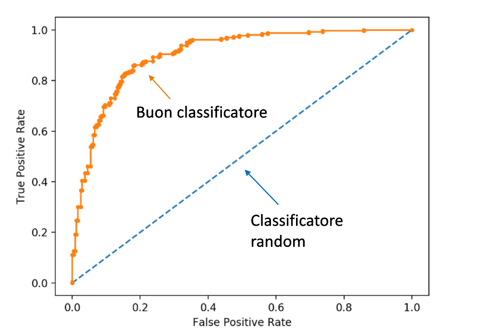


### 8.5 Precision-Recall curve (PR)

La curva ROC è ottima nel caso di dataset *bilanciati*, mentre in presenza di dataset *sbilanciati* è più conveniente analizzare la curva PR, che rappresenta la *precision* in funzione della *recall* al variare della soglia discriminativa $\sigma$. 

a) Nel caso limite in cui la soglia $\sigma$ sia così alta che tutte le tuple sono classificate come negative, allora significa che nessuna tupla sarà classificata come positiva. La recall sarà nulla poiché nessuna osservazione positiva sarà rilevata, mentre la precision sarà massima poiché tutte le osservazioni positive rilevate (0) sono correttamente classificate. 

b) Nel caso limite in cui la soglia $\sigma$ sia cosi bassa che tutte le tuple sono classificate come positive, allora significa che tutte le tuple positive verranno rilevate, per cui la recall = 1. Tutta via la precision sarà bassa poiché il numero di osservazioni positive classificate correttamente è diviso alla cardinalità del dataset.  


### 8.6 Area under the curve (AUC)

Come indicatore di accuratezza del classificatore si fa riferimento all'area sottesa alla curva, chiamata AUC (area under the curve). Tale metrica vale sia per le curve ROC che per le PR. Essa assume valori tra 0 ed 1, dove 1 denota un classificatore perfetto. 


### 8.7 Validazione di un classificatore

Per validare un classificatore viene partizionato il dataset in training set, test set ed eventualmente un validation set su cui testare gli iperparametri. Vi sono vari metodi per effettuare il partizionamento, tra cui il metodo holdout ed il k-fold cross-validation. 


#### 8.7.1 Metodo holdout

Fissata una percentuale $X$, il dataset viene partizionato in due set indipendenti, il training set con l'$X$% del dataset e il test set con il $(100-X)$% del dataset. Si addestra il modello sul training set, si classifica il test set e si misurano le performance sui risultati ottenuti. Esiste una variante chiamata *random sampling*, in cui l'holdout viene ripetuto $k$ volte (con le stesse proporzioni), e si calcola la media delle accuratezze ottenute ad ogni esecuzione. 


### 8.7.2 K-fold cross-validation

Fissato $k \in \N$, si partiziona il dataset in $k$ partizioni $D_1, ..., D_k$ approssimativamente della stessa dimensione. Alla 
i-esima iterazione ($1 < i <  k$) si considera la partizione $D_i$ come test set ed il resto come training set. Una estremizzazione del metodo è il *leave one out*, dove $k$ è il numero di tuple ed il test set è di volta in volta una sola tupla. 

<div style="page-break-after: always;"></div> 
# Predizione

## 1. Introduzione

La predizione è simile alla classificazione poiché costruisce un modello e usa il modello per predire valori per un dato input. La predizione è diversa rispetto alla classificazione poiché la classificazione predice valori categoriali (etichette), mentre la predizione modella funzioni a valori continui. 

Diversi classificatori possono essere utilizzati come predittori (alberi decisionali, SVM), e viceversa (regressione logistica). La tecnica più importante di predizione è la regressione. 


## 2. Regressione

La regressione è una forma di apprendimento supervisionato che consente di apprendere una mappatura tra i dati di input e i corrispondenti output. Esempi di task legati alla regressione sono: 

* Predizione del prezzo di prodotti date delle caratteristiche 
* Predizione del profitto di una certa compagnia
* Contare il numero di automobili presenti in una immagine. 


### 2.2 Definizione formale

Definiremo un regressore come una funzione $f: \R^n \to \R^m$ dove $n$ è la dimensionalità del dominio (features dei dati in input) ed $m$ è la dimensionalità del codominio (features dei dati in output). In generale, ci riferiremo ad un dato in input con $x \in \R^n$, all'output vero legato ad $x$ con $y \in \R^m$ e all'output predetto dal regressore con $\hat y \in \R^m$.  Possiamo predire un valore a partire da $x$: 
$$
\hat y = f(x)
$$
In questo contesto, spesso $x$ è chiamata **variabile indipendente**, mentre $y$ è chiamata **variabile dipendente**. Come visto nella classificazione, possiamo definire una **funzione di rappresentazione** $r:E \to \R^n$ per mappare un input da $e \in E$ ad $\R^n$. Utilizzando la funzione di rappresentazione, possiamo predire il valore per un input $e \in E$: 
$$
\hat y = f(r(e))
$$
Per trovare la **funzione di regressione** $f$ possiamo utilizzare vari metodi a seconda del contesto. Vedremo la regressione lineare, la regressione lineare multipla, la regressione polinomiale e quella logistica. 

<div style="page-break-after: always;"></div>

### 2.3 Misure di performance 

Sia $TE$ il test set su cui validare il regressore. Definiamo: 
$$
Y_{TE} = \{y^i : (x^i,y^i) \in TE\}
$$
l'insieme degli output corretti (o etichette di ground truth), e: 
$$
\hat Y_{TE} = \{\hat y^i: \hat y^i = f(x^i), x^i \in TE \}
$$
l'insieme di output predetti. Idealmente vorremmo che gli output predetti siano quanto più vicini agli output corretti (nel caso migliore $\bar Y_{te} = Y_{te}$). Dal momento in cui gli elementi di entrambi gli insiemi sono vettori di egual dimensione, definiremo le misure di performance come misurazioni di vicinanza o verosimiglianza tra gli output predetti e gli output corretti.  


#### 2.3.1 Mean Squared Error (MSE)

Consideriamo per ogni elemento $x^i$ del test set  $TE$  la corrispondente etichetta di ground truth $y^i$ e l'etichetta predetta dalla funzione di regressione $\hat y^i$. Le etichette hanno dimensione $m$, quindi una buona misura di vicinanza tra le due è spesso la distanza euclidea: 
$$
|| \hat y - y||_2 = \sqrt{ \sum_{i=1}^m (\hat y_i - y_i)^2}
$$
Per risparmiare il tempo computazionale impiegato nel calcolo della radice quadrata, spesso si utilizza la distanza euclidea quadratica: 
$$
error(\hat y, y)=|| \hat y - y||_2^2 = \sum_{i=1}^m (\hat y_i - y_i)^2
$$
A questo punto, l'MSE consiste nel calcolare l'errore medio per tutti gli input del test set: 
$$
MSE(Y_{TE}, \hat Y_{TE}) = \frac 1 {|TE|} \sum_{j=1}^{|TE|} error(\hat y^j, y^j) = 
 \frac 1 {|TE|} \sum_{j=1}^{|TE|} || \hat y^j - y^j||_2^2
$$


#### 2.3.2 Root Mean Squared Error (RMSE)

L'unità di misura dell'MSE è il quadrato dell'unità di misura della variabile dipendente ($y$). Nella pratica, se $y$ è misurata in metri, l'errore MSE sarà misurato in metri quadrati $m^2$. Per ovviare a questo possiamo utilizzare il root mean squared error (RMSE): 
$$
RMSE(Y_{TE}, \hat Y_{TE}) = \sqrt{MSE(Y_{TE}, \hat Y_{TE})}
$$


#### 2.3.3 Mean absolute error (MAE)

Se le etichette sono scalari ($m=1$), allora possiamo misurare l'errore e mantenere la stessa unità di misura attraverso il mean absolute error, ovvero la media delle differenze tra le etichette in valore assoluto: 
$$
MAE(Y_{TE}, \hat Y_{TE}) = \frac 1 {|TE|} \sum_{j=1}^{|TE|} |\hat y^j - y^j|
$$


#### 2.3.4 Differenza tra MSE, RMSE e MAE

Tutte e tre le misure di performance sono **misure di errore**, per cui un buon regressore dovrebbe puntare a minimizzarle. La principale differenza tra gli indici presentati sta nel fatto che MSE e RMSE enfatizzano l'errore al crescere della distanza tra i punti, mentre tralasciano gli errori piccoli. Tuttavia, MAE risulta più intuitivo. 


### 2.4 Casi speciali di regressione

Mentre la regressione può essere definita in maniera generale con una funzione:
$$
f:\R^n \to \R^m
$$
Vi sono alcuni casi molto frequenti in cui vi sono particolari valori di $m$ ed $n$, noi vedremo i seguenti. 

**Regressione semplice**
La regressione semplice prevede che $m = n = 1$, per cui il task consiste nel mappare numeri scalari a numeri scalari con una funzione $f$: 
$$
f:\R \to \R
$$

**Regressione multipla**
La regressione multipla si ha quando $m = 1$ ed $n > 1$, e consiste nel mappare vettori su scalari con una funzione $f$: 
$$
f:\R^n \to \R
$$

**Regressione multivariata**
La regressione multivariata è quella più generale, dove $m > 1$ ed $n$ è arbitrario. Consiste nel mappare vettori o scalari (nel caso $n=1$) su vettori con una funzione $f$: 
$$
f:\R^n \to \R^m
$$

<div style="page-break-after: always;"></div>

## 3. Regressione lineare

Vedremo il metodo della regressione lineare applicata su casi di regressione semplice, multipla e multivariata. 


### 3.1 Regressione lineare semplice

La regressione lineare semplice consiste nel trovare una funzione $f$ di forma $f:\R \to \R$. Per iniziare, consideriamo un esempio in cui il dataset consiste in coppie $(x,y)$ referenti: 

* Il numero medio $x$ di stanze in una casa in un quartiere;
* Il prezzo medio $y$ delle case nel quartiere (misurato in $1000\$s$, es. $30000\$$ = $30$)

Disegniamo un plot del dataset ponendo il numero medio di stanze sull'asse delle $x$ ed il prezzo medio sull'asse delle $y$: 


Vorremmo idealmente trovare una funzione $f$ che riesca ad approssimare il prezzo medio delle case $y$ dato uun numero di stanze medio $x$. Dal plot osserviamo che il prezzo aumenta proporzionalmente al numero di stanze. Calcolando la covarianza otteniamo $Cov(x,y) = 4.49$, il che è un'altra conferma della correlazione tra le due variabili. Esse seguono circa un andamento lineare, quindi sono approssimativamente distribuite lungo una retta: 


<div style="page-break-after: always;"></div>

Possiamo quindi costruire la nostra funzione di regressione $f$ utilizzando la formulazione analitica di una retta: 
$$
f(x) = mx +q
$$
Dove $m$ è il coefficiente angolare e $q$ è l'intercetta. Anziché $q$ e $m$ utilizzeremo rispettivamente $\theta_0$ e $\theta_1$. Tale notazione ci aiuterà a generalizzare la regressione al caso multiplo. 
$$
f(x) = \theta_0 + \theta_1x
$$
Chiamiamo la funzione $f$ **modello lineare** o **regressore lineare**, dove $\theta_0$ e $\theta_1$ sono i parametri del modello. Allenare un modello lineare significa trovare quei valori nei parametri $\theta_0$ e $\theta_1$ tale che $f(x)$ dia una buona predizione di $y$. Vedremo due metodi per fare ciò: il metodo dei minimi quadrati e la discesa del gradiente. 

Consideriamo il precedente esempio e immaginiamo che qualcuno abbia allenato il modello lineare e che i parametri siano $\theta_0 = -34.17$ e $\theta_1 = 9.10$, per cui il nostro regressore lineare sarà così definito: 
$$
\hat y^i = f(x^i) = (9.1)x - 34.15 
$$
Se proviamo a plottare la linea in figura, essa sarà quella retta con maggiore densità lineare e avrà, nel caso migliore, una misura di errore bassa. 


### 3.2 Interpretazione geometrica 

Sappiamo che i valori $\theta$ hanno un ben preciso significato geometrico: 

* $\theta_0$ è l'intercetta: esprime la posizione di $r$ nello spazio, ovvero dove $r$ intercetta la retta $y$ quando $x=0$. 
* $\theta_1$ è il coefficiente angolare: esprime l'orientamento di $r$ rispetto all'asse $x$. 

In generale, i due coefficienti hanno specifici effetti geometrici. Rispetto al coefficiente angolare: 

* Un valore alto di $\theta_1$ da luogo a curve più ripide;
* $\theta_1 = 0$ corrisponde ad una retta orizzontale, quindi parallela all'asse delle $x$;
* $\theta_1 < 0$ rappresentano rette "all'indietro";

Rispetto all'intercetta: 

* Il valore decide dove sta la retta nello spazio;
* Valori alti di $\theta_0$ spingono sopra la retta, per cui si hanno valori alti di $y$ (e viceversa)

<div style="page-break-after: always;"></div>

### 3.3 Interpretazione statistica

Dall'interpretazione geometrica possiamo tirar fuori alcune considerazioni statistiche: 

1) L'intercetta $\theta_0$ è il valore che si ottiene quando l'input è nullo: $f(0) = \theta_0$. 

2) Il coefficiente angolare $\theta_1$ indica la ripidità della retta: rette più ripide indicano che piccole variazioni su $x$ riflettono grandi variazioni su $y$, di fatti possiamo osservare la dipendenza diretta da: 
$$
f(x+1) - f(x) = \theta_0 + \theta_1(x+1) -\theta_0 - \theta_1(x) = \\
= \theta_1(x) + \theta_1 - \theta_1(x) = \theta_1
$$
Ciò implica che quando osserviamo un incremento di 1 unità su $x$, si riflette un incremento di $\theta_1$ unità su y.


### 3.4 Correlazione contro causa

Dovremmo sempre attenzionare l'interpretazione dei coefficienti di un regressore lineare. Un regressore cattura la correlazione tra le variabili indipendenti, ma non ne spiega il perché. Ciò implica che, se l'incremento di una unità su una variabile *indipendente* si riflette in un aumento di un numero di unità nella variabile *dipendente*, non dovremmo stabilire nessun tipo di correlazione formale, poiché stiamo solo osservando l'avvenimento di due fenomeni in contemporanea.


### 3.5 Regressione lineare multipla

Possiamo facilmente estendere la regressione lineare semplice al caso della regressione lineare multipla. Cerchiamo adesso una funzione $f$ definita come $f: \R^n \to \R$. In tal caso dovremmo trovare un parametro $\theta$ per ognuna delle dimensioni della variabile $x$ in input, più un parametro $\theta_0$ per l'intercetta: 
$$
f(\bar x) = \theta_0 + \theta_1x_1 + ... + \theta_n x_n
$$
I parametri sono quindi $\Theta =(\theta_0, \theta_1, ..., \theta_n)$. Allenare il regressore significa trovare un insieme $\Theta$ di parametri appropriato per prevedere i valori $y$ con migliore accuratezza raggiungibile. La funzione $f$ sarà quindi in generale un iperpiano ad $n$ dimensioni. 

Per convenzione e semplicità di espressione, poniamo $x_0 = 1$ e scriviamo il modello lineare $f$ come segue: 
$$
f(\bar x) = \sum_{i=1}^n \theta_i x_i
$$
Cosicché l'intercetta sia moltiplicata ad 1, e quindi non vari. 

Consideriamo un esempio in cui $n=2$, nel quale si vuole predire il prezzo di una casa in un quartiere a partire dal numero medio di stanze e dal tasso di criminalità nel quartiere.  
$$
(x,y) = ((x_1,x_2), y)
$$

<div style="page-break-after: always;"></div>

Essendo la somma delle dimensione uguale a 3, possiamo visualizzare un plot tridimensionale dei nostri punti: 


In tal caso il modello lineare $f$ sarà: 
$$
f(x) = \theta_0 + \theta_1 x_1 + \theta_2 x_2 
$$
Assumiamo che il modello sia già stato allenato e che i parametri siano i seguenti: 
$$
\theta_0 = -29.24; \space \theta_1 = 8.39; \space \theta_2 = -0.26
$$
Tali parametri identificano il piano nello spazio che meglio approssima la relazione tra i valori in input ed il prezzo da predire: 

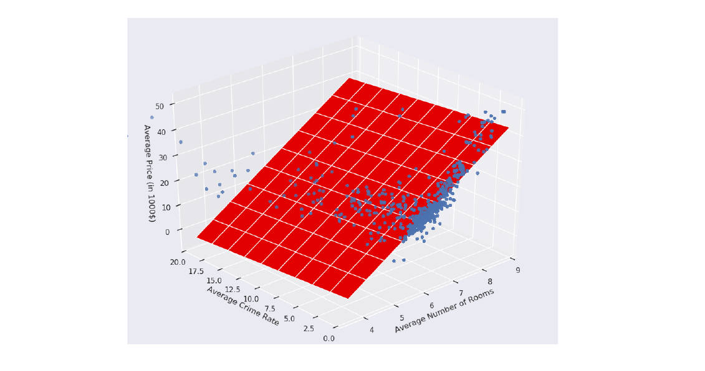

Allo stesso modo possiamo tirar fuori dei significati geometrici e statistici dai coefficienti: 

* $\theta_0$ è il valore di $y$ quando tutte le $x_i = 0$ (per $i$ non nulla);
* Osserviamo un incremento di $\theta_i$ unità quando l'i-esima dimensione $x_i$ aumenta di una unità e le altre restano costanti. 

<div style="page-break-after: always;"></div>

### 3.6 Regressione lineare multivariata

Consideriamo l'ultimo caso, ovvero quello della regressione lineare multivariata. Si cerca una funzione $f$ definita come $f:\R^n \to \R^m$. Il metodo della regressione lineare multivariata risolve il problema definendo $m$ regressori multipli indipendenti, uno per ogni dimensione dell'etichetta $y$ in output, che processano gli stessi input $x$ con pesi differenti: 
$$
\hat y = 
\begin{bmatrix}
\hat y_1 \\
... \\
\hat y_m \\
\end{bmatrix}
= 
\begin{bmatrix}
f_1(x) \\
... \\
f_m(x) \\
\end{bmatrix}
$$
Ognuno dei regressori $f_i$ ha il proprio insieme di parametri $\Theta_i$, calcolati ed ottimizzati in maniera indipendente dagli altri regressori. 


## 4. Il problema dell'apprendimento

Per capire come tirar fuori i parametri $\Theta$ dal regressore ci concentreremo sul caso della regressione multipla, più generico rispetto alla regressione lineare e che pone le fondamenta per quella multivariata. Avremo quindi un regressore $f_{\Theta}$: 
$$
f_{\Theta}(\bar x) = \sum_{i=1}^n \theta_i x_i = \Theta^T \bar x
$$
Dove $f_{\Theta}$ indica il fatto che il regressore $f$ dipenda dai parametri $\Theta$. Allenare il regressore significa lasciare che il regressore apprenda quali siano i parametri $\Theta$ che minimizzino l'errore di predizione nel training set $TR$. Possiamo quantificare l'errore attraverso una funzione costo: 
$$
J(\Theta) = \frac 1 2 \sum_{i=1}^{|TR|} \left[f_{\Theta}(x^i) - y^i\right]^2
$$
Osserviamo che l'espressione sopra è l'indice MSE calcolato sul training set per una certa configurazione di parametri $\Theta$, a meno di una differenza nel prima fattore, che risulta essere $\frac 1 2$ anziché $\frac 1 {|TR|}$. Questa scelta risulterà conveniente in futuro nel metodo della discesa del gradiente. Vorremmo idealmente che la funzione costo $J$ sia prossima zero. Di conseguenza, una buona scelta di $\Theta$ è quella che minimizza la funzione $J$: 
$$
\Theta^* = arg \min_{\Theta} J(\Theta)
$$


### 4.1 Metodo dei minimi quadrati

Prima di passare al metodo della discesa del gradiente, vediamo un metodo leggermente più statistico e diretto, il metodo dei minimi quadrati (*least squares method*). Supponiamo di trovarci nel caso della regressione semplice, per cui: 
$$
\hat y = f(x) = \theta_0 + \theta_1x
$$

<div style="page-break-after: always;"></div>

Il metodo fornisce delle formule dirette per trovare i coefficienti della retta che meglio approssima l'andamento dei punti: 
$$
\theta_1 = \frac 
{\sum_{i=1}^{|TR|} (x_i - \bar x)(y_i - \bar y)}
{\sum_{i=1}^{|TR|} (x_i - \bar x)^2}
$$

$$
\theta_0 = \bar y - \theta_1 \bar x
$$

Dove $\bar y$ e $\bar x$ sono i valori medi. È possibile estendere il metodo dei quadrati minimi per la regressione polinomiale, ma non affronteremo questa tematica. 


### 4.2 Algoritmo di discesa del gradiente 

Abbiamo letto nel problema dell'apprendimento che l'insieme $\Theta$ di parametri assunti dal modello $f$ deve minimizzare la funzione costo $J$. Un approccio naïve potrebbe suggerire di provare tutte le possibili combinazioni di $\Theta$, ma essendo un numero massivo risulta subito un cattivo approccio.

Per risolvere tale problema si possono utilizzare molte strategia di ottimizzazione: quella che utilizzeremo prende il nome di algoritmo di discesa del gradiente, il quale permette di minimizzare qualsiasi funzione **differenziabile** rispetto ai propri parametri.

 

#### 4.2.1 Esempio ad una variabile 

Supponiamo di avere una funzione $f$ *convessa* come in figura, ovvero una funzione con un solo minimo locale. 


Supponiamo di partire da un punto $x_0$ qualsiasi, per trovare il minimo bisogna seguire l'andamento decrescente della funzione. Tuttavia non abbiamo abbastanza informazioni per sapere come muoverci, quindi è necessario utilizzare uno strumento matematico che dia informazioni sull'andamento della funzione: la derivata. 

<div style="page-break-after: always;"></div>

La derivata fornisce la pendenza (coefficiente angolare) della retta tangente al punto in cui viene calcolata. Di fatto, la retta tangente ci comunica in che direzione la funzione aumenta o diminuisce nell'intorno del punto. 

Se il coefficiente angolare è positivo, allora la retta è crescente nel verso dell'asse delle $x$, e quindi lo è anche la funzione, per cui allo scopo di trovare il minimo è necessario muoversi verso sinistra. Viceversa nel caso in cui si ottienga un coefficiente angolare negativo. 

Nella funzione d'esempio la derivata $f'(x_0)$ ha coefficiente angolare negativo, per cui la funzione è decrescente nel punto $x_0$ e conviene prendere il prossimo punto verso destra, di fatto $x_1 > x_0$ ma $f(x_1) < f(x_0)$.  

> La direzione corretta per trovare il minimo è la direzione inversa alla tangente ottenuta attraverso la derivata. 

L'algoritmo di discesa del gradiente è un algoritmo iterativo che si sposta nella direzione decrescente della funzione sino a trovare il minimo, ovvero quando la derivata risulta nulla. Ma di quanto ci muoviamo lungo l'asse delle $x$ ad ogni step?

Ad ogni step ci muoveremo sull'asse delle $x$ proporzionalmente al valore della derivata. Tale euristica è basata sull'osservazione che valori maggiori, in valore assoluto, della derivata indicano pendenze più ripide, quindi si è probabilmente più lontani dal minimo. Scegliendo una costante $\gamma$ chiamata **learning rate**, ci muoveremo ad ogni step nel seguente modo: 
$$
x_1 = x_0 - \gamma f'(x_0)
$$
Osserviamo che, come sperato, se la derivata $f'(x_0)$ è negativa, ci muoveremo verso destra di un fattore $|\gamma f'(x_0)|$, viceversa per la derivata positiva. Vediamo come procede l'algoritmo nel nostro esempio di prova: 

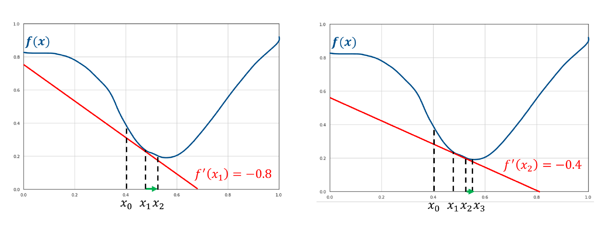

Nel punto $x_3$ la derivata è così vicina allo 0 che $x_3$ approssima quasi perfettamente il minimo. Per cui soddisfa l'espressione: 
$$
x_3 = arg \min_x f(x)
$$
Nella pratica, l'algoritmo finisce la sua iterazione in due casi: 

* Un numero massimo di iterazioni è stato raggiunto;
* Il valore $\gamma f'(x)$ è al di sotto di una data soglia. 

<div style="page-break-after: always;"></div>

Nel caso di una variabile, possiamo riassumere l'algoritmo attraverso il seguente pseudocodice: 

```

    def gradient_descend():
        g = get_learning_rate()
        max_loops = get_max_loops()
        t_threshold = get_termination_threshold()
        x = random()
        loops = 0
        while (x > t_threshold && loops < max_loops):
            m = f'(x)
            x = x - (g * m)
        return x
	
```


#### 4.2.2 Caso multivariato

L'algoritmo di discesa del gradiente è generalizzato nel caso in cui la funzione $f$ da ottimizzare sia a più variabili $f(x_1, ..., x_n)$. Per funzioni a più variabili, anziché la derivata è necessario considerare il gradiente, da cui il nome dell'algoritmo. 

> Il gradiente è una generalizzazione della derivata per funzioni a più variabili. 

Il gradiente di una funzione ad $n$ variabili in un punto $x$ è un vettore la cui $i$-esima componente è data dalla derivata parziale della funzione rispetto alla $i$-esima variabile calcolata nel punto $x$: 
$$
\nabla f(x) = \begin{pmatrix}
f_{x_1}(x)\\
f_{x_2}(x)\\
... \\
f_{x_n}(x)\\
\end{pmatrix}
$$
Nel caso in cui la funzione sia a due variabili, si potrebbe costruire un plot tridimensionale come segue. In tal caso, il gradiente sarà un vettore a due dimensioni e varierà punto per punto. 

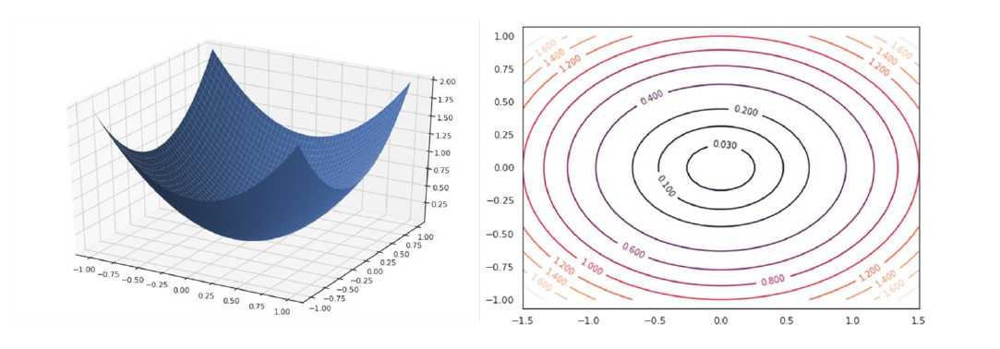

<div style="page-break-after: always;"></div>

La figura che segue mostrerà graficamente l'andamento che deve seguire la procedura nel caso multivariato: 


Il ragionamento è analogo, ma l'aggiornamento dei pesi va fatto per ogni variabile. Di conseguenza i passi che seguirà l'algoritmo sono i seguenti: 

* Inizializzare $x = (x_1, ..., x_n)$ in maniera randomica

* Per ogni variabile $x_i$: 
  * Calcolare la derivata parziale nel punto $x$: $f_{x_i}(x)$
  * Aggiornare $x$ utilizzando la formula precedente: $x_i = x_i - \gamma f_{x_i}(x)$
* Ripetere i primi due passi sino a soddisfarre un criterio di terminazione. 


### 4.3 Discesa del gradiente e regressione lineare

Utilizzeremo l'algoritmo di discesa del gradiente per risolvere il problema di ottimizzazione della regressione lineare, quindi per trovare i coefficienti ottimali $\Theta^*$: 
$$
\Theta^* = arg \min_{\Theta} J(\Theta)
$$
Il primo passo è quindi inizializzare randomicamente $\Theta$ e applicare iterativamente la regola di aggiornamento per ogni variabile: 
$$
\theta_j = \theta_j - \gamma \frac {\partial} {\partial \theta_j} J(\Theta)
$$
È necessario quindi calcolare la derivata parziale rispetto a ciascuno dei parametri in input. Scriviamo prima la funzione costo $J$ nei termini dei parametri $\Theta$: 
$$
J(\Theta) = \frac 1 2 \sum_{i=1}^{|TR|} \left[f_{\Theta}(x^i) - y^i\right]^2
$$
Esplicitandolo: 
$$
J(\Theta) = \frac 1 2 \sum_{i=1}^{|TR|} \left( \theta_0 x^i_0 + \theta_1 x^i_1 
+ ... +\theta_n x^i_n - y^i\right)^2
$$
Dove ricordiamo che $x^i_0 = 1$ per convenzione. 

<div style="page-break-after: always;"></div>

Possiamo calcolare facilmente la derivata parziale di questa funzione rispetto alla $j$-esima componente $\theta_j$: 
$$
\frac {\partial} {\partial \theta_j} J(\Theta) = 
\frac 1 2
\sum_{i=1}^{|TR|} 
2(f_{\Theta}(x^i) - y^i) \times
\frac {\partial} {\partial \theta_j}
\left( \theta_0 x^i_0 + \theta_1 x^i_1 + ... +\theta_n x^i_n - y^i\right)
$$
Ma notiamo che: 
$$
\frac {\partial} {\partial \theta_j}
\left( \theta_0 x^i_0 + \theta_1 x^i_1 + ... +\theta_n x^i_n - y^i\right) = x^i_j
$$
Quindi sostituendo e semplificando otteniamo che: 
$$
\frac {\partial} {\partial \theta_j} J(\Theta) = 
\sum_{i=1}^{|TR|} (f_{\Theta}(x^i) - y^i) * x^i_j
$$
La regola di aggiornamento può essere scritta come segue: 
$$
\theta_j = \theta_j - \gamma \times (\sum_{i=1}^{|TR|} (f_{\Theta}(x^i) - y^i) * x^i_j)
$$
Con la regola di aggiornamento abbiamo tutto ciò che ci serve per implementare l'algoritmo computazionalmente, utilizzando criteri di terminazione basati sul numero di terazioni o sulla soglia di aggiornamento. 


### 4.4 Considerazioni sul learning rate

Il learning rate $\gamma$ è un iperparametro da determinare. Possiamo utilizzare un validation set per effettuare delle prove e selezionare il valore con risultati migliori. Alcune considerazioni sul learning rate sono: 

* Un learning rate basso converge più lentamente ma con buona precisione. 
* Un learning rate alto converge più velocemente ma con una precisione peggiore. Può inoltre capitare una situazione di stallo in cui si salta continuamente da un punto a tangente crescente ad un punto a tangente decrescente, generando un effetto ping pong. 

<div style="page-break-after: always;"></div>

## 5. Regressione non lineare

La regressione lineare risulta limitante nei casi in cui la relazione tra le variabili indipendenti e la variabile indipendente è chiaramente non lineare. Consideriamo ad esempio il seguente plot: 

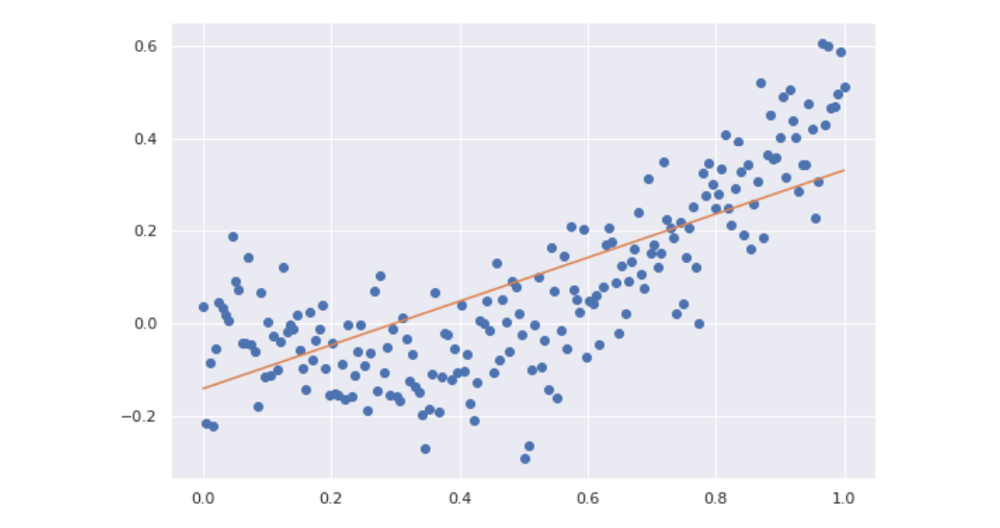

La relazione tra le variabili segue chiaramente una curva anziché una retta. Utilizzare la regressione lineare produrrebbe sicuramente fenomeni di *underfitting*. 


### 5.1 Regressione polinomiale 

Anziché utilizzare una funzione lineare $f(x) = \theta_0 + \theta_1 x$, potremmo introdurre $d-1$ parametri addizionali e utilizzare una funzione polinomiale come segue: 
$$
f(x) = \theta_0 + \theta_1 x + \theta_2 x^2  + ... + \theta_d x^d
$$
Dove $x^i$ rappresenta la potenza $i$-esima di $x$ e non l'indice rispetto al training set. Modelli polinomiali di grado più alto consentono di rappresentare funzioni non lineari: 


Più alto è il grado del polinomio, più si possono ottenere curve complesse. Possiamo facilmente osservare che anche se la funzione non è lineare rispetto ad $x$, essa è lineare rispetto alle variabili $x, x^2, ..., x^d$. Determinate le variabili $x^i$, trovare i coefficienti $\Theta = \{\theta_0, \theta_1, ..., \theta_d\}$ è comunque un problema di regressione lineare, risolvibile attraverso l'algoritmo di discesa del gradiente. 

Osserviamo che possiamo trasformare un problema di regressione lineare in uno polinomiale replicando $d$ volte lo scalare e prendendo progressivamente le potenze sino al grado $d$. Se $d=3$ allora: 
$$
x \Longrightarrow [x, x^2,x^3] \\
f(x) = \theta_0 + \theta_1 x \Longrightarrow f(x) = 
\theta_0 + \theta_1 x + \theta_2 x^2 + \theta_3 x^3
$$
Se applichiamo questo metodo all'esempio precedente con un grado $d=2$ avremo un risultato di gran lunga più adatto rispetto ad una retta; 

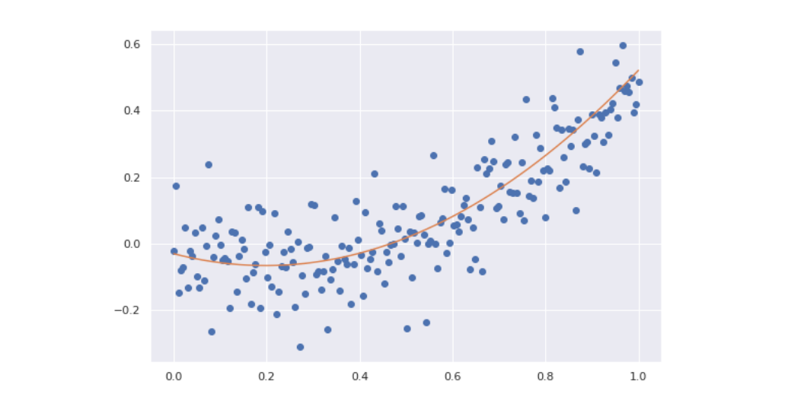


#### 5.1.1 Regressione polinomiale a più variabili

Se la regressione prevede più attributi in input, ripetiamo il processo per ognuno degli attributi ed aggiungiamo anche i *termini di interazione*. Ad esempio, se la dimensione dell'input è 2 e si decide di polinomizzare la funzione aggiungendo $d=2$ gradi, allora i coefficienti totali saranno $n' = 1 + 2 * 2 + 1 = 6$: 
$$
f(x) = \theta_0 + \theta_1 x_1 + \theta_2 x_2 \Longrightarrow 
f(x) = \theta_0 + \theta_1 x_1 + \theta_2 x_1^2 + \theta_3 x_2 + \theta_4 x_2^2 + \theta_5 x_1x_2
$$
A causa della presenza dei termini di interazione, all'aumentare delle feature in input il numero di coefficienti da calcolare aumenta in maniera massiva e la computazione diventa onerosa.  Se si effettua la regressione polinomiale con un grado $d$ molto alto è possibile incappare nel problema dell'**overfitting**.

Dal punto di vista procedurale, il modo più semplice per implementare la regressione polinomiale consiste nel dare in pasto ad un regressore lineare il numero finale di feature. Anziché costruire un regressore polinomiale per degli input $(x_1, x_2)$ che esegua la polinomizzazione al grado $d$, potremmo (supposto $d=2$) utilizzare un regressore lineare mappando gli input originali $(x_1, x_2, x_1^2, x_1x_2, x_2^2)$ ed ottenere lo stesso risultato. 


#### 5.1.2 Regolarizzazione

Limitando il grado della regressione polinomiale è possibile ridurre il rischio di overfitting. Tuttavia, a volte non si vuole rinunciare alla flessibilità di un polinomio di alto grado. Supponiamo che il problema di predizione sia risolto da un polinomio di grado 3, il cui secondo termine è mancante 
$$
f(x) = \theta_0 + \theta_1x + \theta_3x^3
$$
Il modello privato del secondo termine ha ridotto la propria capacità (meno coefficienti da calcolare) rispetto al modello che prende in considerazione i termini di ogni grado: 
$$
f(x) = \theta_0 + \theta_1x + \theta_2x^2 + \theta_3x^3
$$
 Tale problema non può essere approssimato con un polinomio di secondo grado: 
$$
f(x) = \theta_0 + \theta_1x + \theta_2x^2
$$
Quindi utilizzeremo la prima soluzione, ponendo $\theta_2 = 0$ fissato. Computazionalmente è difficile determinare quale parametro deve essere posto a 0 per approssimare al meglio la soluzione del problema. 

In generale esiste un rapporto tra la norma dei coefficienti di una funzione polinomiale e la sua flessibilità (e quindi capacità). Nel grafico sottostante vediamo tre polinomi i cui coefficienti sono proporzionali tra loro a meno dell'intercetta, scelta ad hoc per posizionare le funzioni vicine tra loro lungo l'asse $y$. Il polinomio verde risulta visivamente meno flessibile, e concorde alla osservazione, i coefficienti sono più piccoli rispetto a quelli degli altri due polinomi. 


<div style="page-break-after: always;"></div>

#### 5.1.3 Termine di regolarizzazione

Se preferiamo trovare soluzioni meno flessibili per limitare la possibilità di overfitting, potremmo aggiungere alla funzione costo da minimizzare un certo termine, chiamato termine di regolarizzazione, che fornisce una misura di grandezza per i coefficienti del polinomio. 

Il termine di regolarizzazione deve crescere proporzionalmente ai coefficienti, per cui possiamo utilizzare una semplice somma di quadrati: 
$$
\sum_{i=1}^n \theta_i^2
$$
Il processo per cui la funzione costo $J$ viene modificata aggiungendo il termine di regolarizzazione per bilanciare la grandezza dei coefficienti è chiamato **regolarizzazione**. La funzione costo $J$ è ri-definita come segue: 
$$
J(\Theta) = \frac 1 2 \sum_{i=1}^{|TR|} \left[f_{\Theta}(x^i) - y^i\right]^2 
+ \lambda \sum_{i=1}^n \theta_i^2
$$
Dove il valore $\lambda$ serve a bilanciare quanto la grandezza dei coefficienti influenzi la scelta dei coefficienti stessi. È un iperparametro da determinare attraverso un validation set. Questo tipo di regolarizzazione prende il nome di **regolarizzazione L2** poiché il termine di regolarizzazione non è altro che la **norma L2**. Il tipo di regressione considerata prende il nome di **Ridge regression**. 


#### 5.1.4 Decadimento del peso

La nuova funzione costo $J$ è ancora differenziabile rispetto ai parametri $\theta_j$, il che è fondamentale per l'implementazione di un algoritmo di discesa del gradiente. Lo step di aggiornamento sarà adesso: 
$$
\theta_j = \theta_j - \gamma \times (\sum_{i=1}^{|TR|} (f_{\Theta}(x^i) - y^i) * x^i_j) 
- \frac{\partial}{\partial \theta_j}\left[ \lambda \sum_{i=1}^n \theta_i^2 \right]
$$
Notiamo che: 
$$
\frac{\partial}{\partial \theta_j}\left[ \lambda \sum_{i=1}^n \theta_i^2 \right] =
2\lambda\theta_j
$$
Per cui scriviamo lo step di aggiornamento come segue: 
$$
\theta_j = \theta_j - \gamma \times (\sum_{i=1}^{|TR|} (f_{\Theta}(x^i) - y^i) * x^i_j) 
- 2\lambda\theta_j
$$
L'aggiornamento è analogo al precedente a meno di un fattore penalizzante $2\lambda\theta_j$, Questa regolarizzazione è anche chiamata **decadimento del peso** (*weight decay*) per indicare che i coefficienti (pesi) debbano decadere con il tempo per limitare la crescita. 

<div style="page-break-after: always;"></div>

## 6. Regressione logistica

Un regressore lineare multiplo permette di associare un numero reale $\hat y \in \R$ ad un vettore in input $x \in \R^n$ attraverso una funzione parametrica $f_{\Theta}$. L'obiettivo di un classificatore è simile: predire una classe $\hat y \in \{0, ..., M-1\}$ a partire da un vettore in input $x \in \R^n$.  Vedremo come è possibile costruire una funzione parametrica $f_{\Theta}$ che possa performare la classificazione $\hat y = f_{\Theta}(x)$. 


### 6.1 Limiti della regressione lineare per la classificazione

Ci concentreremo sul task della classificazione binaria per iniziare, quindi avremo due sole classi $\{0,1\}$. Potremmo provare ad utilizzare la regressione lineare per predire direttamente la classe binaria: 
$$
\hat y = f(x) = \Theta^Tx 
$$
Tuttavia questo metodo risente di alcuni problemi fondamentali. Consideriamo un esempio ad una dimensione in cui degli input $x \in \R$ sono classificati in due classi $\{0, 1\}$: 


Idealmente vorremmo una funzione che associ tutti i punti "positivi" ad 1 e tutti i punti "negativi" a 0.  Tale funzione sarebbe definita come $f: \R \to \{0,1\}$, quindi il codominio sarà discreto. Se proviamo ad utilizzare la regressione lineare, otterremo con molta probabilità una linea del genere: 


<div style="page-break-after: always;"></div>


Possiamo vedere immediatamente che tale funzione non risultà essere particolarmente accurata nella classificazione: cosa fare quando i punti stanno nel mezzo? O quando stanno sopra 1 / sotto 0? Potremmo migliorare la funzione mappando gli input $x$ alla probabilità che essi assumano il valore 1: $P(y=1|x)$. La funzione sarebbe definita come segue: $f: \R \to \left[0,1\right]$, che risolve i problemi sull'assegnazione dei valori tra 0 ed 1, ma risulta ancora imprecisa per input fuori dal range.  Anziché una retta, vorremmo utilizzare una curva ad $s$ che copra gli elementi come segue: 

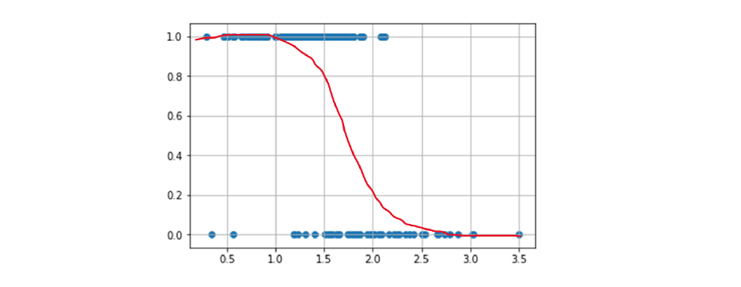 

Questa funzione ideale mappa gli input nel range $\{0,1\}$ e satura a $0$ ed $1$, il che è naturale poiché all'avvicinarsi ad uno dei due estremi densi aumenta anche la certezza di appartenenza ad una classe. Questa analisi suggerisce che non è possibile risolvere il problema della classificazione attraverso una funzione lineare. 


### 6.2 Funzione dispari e Logit

Vorremmo trovare una trasformazione della probabilità che mappi i valori da $[0,1]$ a $(-\infty, +\infty)$ e che renda possibile l'approssimazione delle probabilità attraverso una funzione lineare. 

Sia $p = P(y = 1\mid x)$ la probabilità che che un esempio sia positivo. Considereremo la funzione **dispari** (*odd function*) di $p$ la misura della proporzione tra probabilità che l'esempio sia positivo e quella che l'esempio sia negativo: 
$$
odd(p) = \frac p {1-p}
$$
Questa prima trasformazione risolve parte del problema, di fatto mappa la probabilità dall'intervallo $[0,1)$ all'intervallo $[0, +\infty$). Vediamo l'effetto della mappatura nel grafico sottostante: 


Vogliamo che l'intervallo finale sia $(-\infty, +\infty)$, per cui definiamo la funzione **logit** come il logaritmo naturale della funzione dispari: 
$$
logit(p) = \log \frac p {1-p}
$$
Osserviamo che: 
$$
logit: (0,1) \to (- \infty, +\infty)
$$
altresì confermato dal grafico della funzione: 

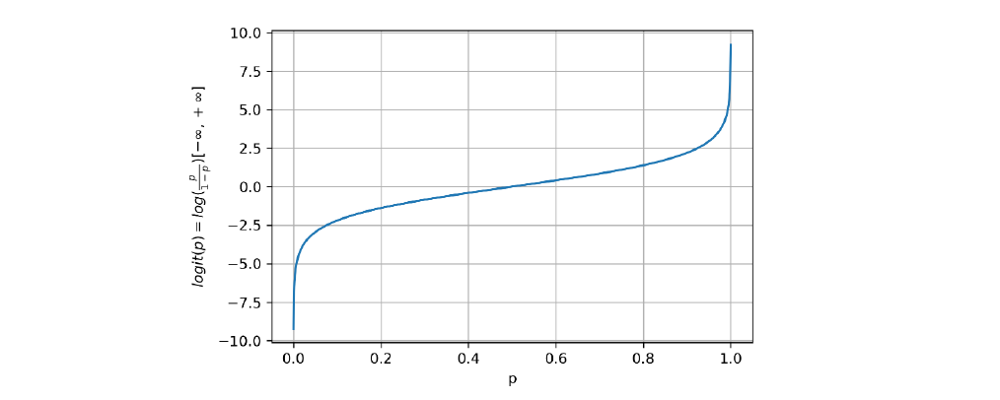

Ci si aspetta che le probabilità siano pressoché non lineari (a forma di $s$), la funzione di **logit** permette di linearizzare i dati rispetto all'asse $x$, come mostrato in figura: 


<div style="page-break-after: always;"></div>

### 6.3 La funzione logistica 

Adesso che la funzione logit mappa le probabilità in uno spazio in cui si dispongono linearmente, possiamo utilizzare un regressore lineare per trovare una retta che approssimi la funzione: 
$$
logit(p) \approx \theta_0x_0 + \theta_1x_1 + ... + \theta_nx_n = \Theta^Tx
$$
Una volta trovati i coefficienti $\Theta$ per il regressore lineare, dobbiamo trovare il metodo per estrapolare la probabilità dai risultato della funzione logit, quindi effettuare una mappatura inversa a quella iniziale: $(- \infty, +\infty) \to (0,1)$. 

Possiamo farlo invertendo la funzione logit come segue: 

1) partiamo dalla espressione iniziale: $logit(p) = log \frac 1 {1-p}$
2) utilizziamo l'esponenziale: $e^{logit(p)} = \frac 1 {1-p}$
3) moltiplichiamo entrambi i termini: $(1-p) e^{logit(p)} = p$
4) semplifichiamo: $e^{logit(p)} - pe^{logit(p)} = p$
5) raccogliamo per la probabilità: $ p(1 + e^{logit(p)}) = e^{logit(p)}$
6) estraiamo la probabilità: $p = \frac {e^{logit(p)}} {(1 + e^{logit(p)})}$
Possiamo effettuare ulteriori semplificazioni una volta estratta la probabilità:
$$
p = \frac {e^{logit(p)}} {(1 + e^{logit(p)})} = 
\frac {1} {( \frac 1 {e^{logit(p)}} + \frac {e^{logit(p)}} {e^{logit(p)}} )} = 
\frac {1} {(1 + e^{-logit(p)})} 
$$
La funzione derivata prende il nome di **funzione logistica** o **funzione sigmoide** ed è definita in generale come segue: 
$$
logistic(x) = \frac 1 {1 + e^{-x}}
$$
La curva disegnata dalla funzione logistica è a forma di $s$ (da cui il nome sigmoide) come mostrato in figura: 


<div style="page-break-after: always;"></div>

### 6.4 Il modello di regressione logistica

Possiamo finalmente definire il regressore logistico con la seguente funzione: 
$$
P(y=1\mid x) = f_{\Theta}(x) = \frac 1 {1 + e^{- \Theta^T x}}
$$
Allenare il regressore logistico significa trovare i parametri $\Theta$ che riescano ad approssimare al meglio la probabilita $P(y=1\mid x)$. La funzione approssimata non è più una retta, bensì un sigmoide: 


Una volta che il modello è allenato, possiamo classificare le osservazioni attraverso la seguente regola: 
$$
\hat y = 
\begin{cases}
1 \text{ if } x \ge 0.5 \\
0 \text{ otherwise }
\end{cases}
$$


#### 6.4.1 Funzione costo

Per allenare il modello definiremo una funzione costo, similmente a come fatto per la regressione lineare. Problema: il dataset fornisce degli input $x$ e degli output $y$, questi ultimi sono interpretabili in termini probabilistici e non come risultati della funzione logistica, quindi non è possibile utilizzare direttamente la funzione costo del regressore lineare e stimare una retta.

Dalla definizione: 
$$
P(y=1\mid x) = f_{\Theta}(x) = \frac 1 {1 + e^{- \Theta^T x}}
$$
Scriviamo: 
$$
P(y=1\mid x; \Theta) = f_{\Theta}(x) \\
P(y=0\mid x; \Theta) = 1 - f_{\Theta}(x)
$$
Per denotare l'utilizzo di un insieme di parametri $\Theta$. O nella versione compatta: 
$$
P(y\mid x; \Theta) = (f_{\Theta}(x))^{y}(1 - f_{\Theta}(x))^{1-y}
$$
Osservando che verrà preso in considerazione solo uno dei fattori a seconda se $y=1$ o $y=0$. Possiamo stimare i parametri massimizzando la *likelihood*: 
$$
L(\Theta) = P(Y\mid X; \Theta)
$$
Se assumiamo che tutte le osservazioni del training set sono indipendenti, allora la likelihood potrà essere espressa come segue: 
$$
L(\Theta) = \prod_{i=1}^{|TR|} P(y^{(i)} \mid x^{(i)}; \Theta) = 
(f_{\Theta}(x^{(i)}))^{y^{(i)}}(1 - f_{\Theta}(x^{(i)}))^{1-y^{(i)}}
$$
Massimizzare tale espressione è analogo a massimizzare il logaritmo negativo della likelihood (*negative log likelihood*, nll): 
$$
nll(\Theta) = - \log L(\Theta) = - \sum_{i=1}^{|TR|} \left[ 
	y^{(i)}f_{\Theta}(x^{(i)}) + (1-y^{(i)})(1 - f_{\Theta}(x^{(i)}))
\right]
$$
Definiremo la funzione costo $J$: 
$$
J(\Theta) = nll(\Theta) = - \log L(\Theta) = - \sum_{i=1}^{|TR|} \left[ 
	y^{(i)}f_{\Theta}(x^{(i)}) + (1-y^{(i)})(1 - f_{\Theta}(x^{(i)}))
\right]
$$


#### 6.4.2 Applicare la discesa del gradiente

Possiamo ottimizzare la funzione costo del regressore logistico attraverso l'algoritmo di discesa del gradiente. Per farlo, è necessario applicare una funzione di aggiornamento del genere: 
$$
\theta_j = \theta_j - \gamma \frac {\partial} {\partial \theta_j} J(\Theta)
$$
È necessario quindi calcolare la derivata parziale della funzione costo $J$. Si lascia allo studente volenteroso la derivazione, che risulta essere: 
$$
\frac {\partial} {\partial \theta_j} J(\Theta) = 
\sum_{i=1}^{|TR|} x_j^{(i)} (y^{(i)} - \sigma(\Theta^T x^{(i)}))
$$
Dove $\sigma$ indica la funzione sigmoide (o logistica): 
$$
\sigma(x) = \frac 1 {1 + e^{-x}}
$$
Per cui il passo d'aggiornamento sarà esplicitato come segue: 
$$
\theta_j = \theta_j - \gamma 
\left[ \sum_{i=1}^{|TR|} x_j^{(i)} (y^{(i)} - \sigma(\Theta^T x^{(i)})) \right]
$$
Osserviamo che il passo di aggiornamento è analogo a quello della regressione lineare a meno della funzione $f_{\Theta}(x^{(i)})$ rimpiazzata con la funzione sigmoide $\sigma(\Theta^T x^{(i)})$.

<div style="page-break-after: always;"></div>

#### 6.4.3 Interpretazione geometrica

A differenza della regressione lineare multipla, che trova l'iperpiano che *approssima* al meglio i dati, la regressione logistica trova l'iperpiano che *separa* al meglio i dati. Come vediamo nell'esempio bidimensionale. 

Ipotizziamo di allenare un regressore logistico con i seguenti dati: 
$$
f(x) = \frac {1} {1 + \exp(-\theta_0 - \theta_1x_1 - \theta_2x_2)}
$$
Supponiamo che l'insieme $\Theta$ di coefficienti risultante sia il seguente: 
$$
\Theta = \{\theta_0 = -3.47, \theta_1 = 1.17, \theta_2 = 1.43 \}
$$
Per capire come i dati sono classificati analizziamo il caso di massima incertezza, ovvero quando la probabilità risultate è del 50% per ambo le classi: 
$$
f(x) = 0.5 \Longleftrightarrow 
\exp(-\theta_0 - \theta_1x_1 - \theta_2x_2) = 1 \Longleftrightarrow 
-\theta_0 - \theta_1x_1 - \theta_2x_2 = 0
$$
Se esplicitiamo l'ultima equazione otteniamo: 
$$
x_2 = - \frac {\theta_1} {\theta_2} x_1 - \frac {\theta_0} {\theta_2}
$$
Per cui il coefficiente angolare è $m = - \frac {\theta_1} {\theta_2}$ e l'intercetta è $q = - \frac {\theta_0} {\theta_2}$. Se grafichiamo questa linea, otteniamo il confine decisionale tra gli elementi delle due classi. 


\* *L'iperpiano rappresentato è dato dai coefficienti $\Theta$ e non rappresenta la funzione logistica, che non è una retta, bensì una curva.* 

<div style="page-break-after: always;"></div>

#### 6.4.4 Estensione al caso multiclasse: metodo one-vs-all

È possibile estendere il metodo della regressione logistica attraverso varie tecniche, tra cui la *one vs all*, la *one vs one* e la *softmax regression*. Vedremo in particolare come funziona la *one vs all*. 

L'approccio **one-vs-all** permette di trasformare il problema della classificazione multiclasse (con più di 2 classi) in un insieme di problemi di classificazione binaria. Ogni sottoproblema può essere risolto attraverso un classificatore binario (es. il regressore logistico). Oltre al classificatore binario, è necessario anche l'output contenga anche un valore di confidenza (**confidence value**), come un probabilità. Questo è necessario per confrontare i risultati di tutti i classificatori e capire quale potrebbe essere quello corretto. 


Dato un problema di classificazione $T$ con $n$ classi, l'approccio *one-vs-all* consiste nei seguenti passi: 

* Dividere $T$ in $n$ task di classificazione binaria $T_i$, dove si considera la classe $i$ contro tutte le altre. 
* Allenare i classificatori separatamente.
* Per classificare un input $x$ utilizziamo ognuno dei classificatori $f_i$, poi assegniamo la classe del classificatore con il confidence value maggiore. 

$$
\hat y = arg \max_i \left[ f_i(x) \right]
$$

<div style="page-break-after: always;"></div> 
# Reti e modelli random

## 1. Reti

Le reti (o grafi) sono il modello matematico che permette di codificare le interazioni tra le componenti di un sistema complesso. La scienza che studia le reti prende il nome di network science. Formalmente, un grafo è una coppia $G=(V,E)$ dove $V$ è l'insieme di vertici ed $E$ è l'insieme degli archi, dove un arco è una coppia di vertici $(u, v)$. I vertici rappresentano le componenti del sistema, mentre gli archi rappresentano le interazioni tra le componenti. Se $(a,b) \in E$ allora diremo che $b$ è *adiacente* ad $a$. 


#### 1.1.1 Grafi diretti e indiretti

Un grafo è detto *indiretto* (o non orientato) se: 
$$
\forall \space (a,b) \in E \Longleftrightarrow (b,a) \in E
$$
Altrimenti si parla di grafo *diretto* (o orientato). In altre parole, in un grafo indiretto ogni interazione tra due nodi è reciproca, mentre nelle reti dirette non è detto che lo sia. 


#### 1.1.2 Grafi pesati ed etichettati

Ai nodi e agli archi di una rete possono essere associate delle informazioni aggiuntive legate alla semantica della rete stessa. Se le informazioni associate ai nodi / archi sono valori numerici (interi o reali) si parla di rete *pesata*. Se sono etichette o stringhe si parla di grafo etichettato.  


#### 1.1.3 Grafi bipartiti 

Un grafo bipartito è un grafo in cui i nodi costituiscono due insiemi disgiunti $U$ e $V$ e ciascun arco del grafo collega un nodo di $U$ ad un nodo di $V$. Non esistono archi che collegano tra loro nodi dello stesso insieme. 


<div style="page-break-after: always;"></div>

A partire da una rete bipartita è possibile generare due reti chiamate *proiezioni del grafo*, una rispetto all'insieme $U$ e l'altra rispetto all'insieme $V$. La proiezione rispetto ad $U$ è un grafo i cui nodi sono i nodi di $U$ ed un arco collega due nodi $u_1, u_2 \in U$ se e solo se $u_1, u_2$ hanno almeno un adiacente in comune nel grafo bipartito. Definizione analoga per la proiezione rispetto a $V$. 

 


#### 1.1.4 Grafi multipartiti

La definizione di grafo bipartito si può estendere facilmente al casi di tre (grafi tripartiti) o più (grafi multipartiti) insiemi disgiunti di nodi. 


#### 1.1.5 Grafo completo o Clique 

Un grafo completo, o Clique, è un grafo in cui tutte le coppie distinte tra loro sono collegate da un arco. 


#### 1.1.6 Grado di un nodo

Il grado (*degree*) di un nodo $u$ è il numero di nodi adiacenti ad $u$ nel grafo. Un nodo con grafo 0 è detto *isolato*. In un grafo diretto si fa distinzione tra: 

* Grado *uscente* del nodo $u$: numero di nodi adiacenti ad $n$ nel grafo
* Grado *entrante* del nodo $u$: numero di nodi a cui $u$ è adiacente. 
* Grado *totale* del nodo $u$: somma del grado uscente e del grado entrante. 

Un grafo è detto *regolare* se ogni nodo ha lo stesso grado. 


#### 1.1.7 Distribuzione dei gradi

La distribuzione dei gradi $P$ è una distribuzione di probabilità, dove $P_k$ rappresenta la probabilità che un generico nodo della rete abbia grado $k$. La distribuzione dei gradi è la proprietà più importante della rete, poiché fenomeni come la robustezza della rete o la diffusione dei virus si possono spiegare attraverso tale proprietà. Data una rete reale, $P_k$ si ottiene dividendo il numero $N_k$ di nodi con grado $k$ per il numero di nodi $N$ della rete. 


### 1.2 Cammini tra nodi

Un cammino tra due nodi $u$ e $v$ è definito come una sequenza ordinata di $n$ archi: 
$$
(u = i_0, i_1), (i_1, i_2), ..., (i_{n-1}, i_n = v)
$$


#### 1.2.1 Lunghezza, distanza e diametro

La quantità $n$ di archi è detta *lunghezza* del cammino. 
In generale possono esistere più cammini tra due nodi. 
Il cammino *minimo* è il cammino di lunghezza minima. 
Possono esistere più cammini minimi tra due nodi. 
La *distanza* $D$ tra due nodi è la lunghezza di un cammino minimo tra i due. 
Il *diametro* di un grafo è la massima distanza tra due nodi del grafo. 


#### 1.2.2 Cicli nel grafo

Un ciclo è un cammino in cui nodo di partenza e nodo finale coincidono: 
$$
(u = i_0, i_1), (i_1, i_2), ..., (i_{n-1}, i_n = u)
$$
Un ciclo di lunghezza 1 è detto *cappio* o *self-loop*. Un grafo che non contiene cicli è detto *aciclico*, o anche *albero*. 


#### 1.2.3 Connettività di un grafo

Due nodi $i$ e $j$ si dicono *connessi* se esiste un cammino tra essi, altrimenti si diranno *disconnessi*. Un grafo si dice *connesso* se tutte le coppie di nodi sono connesse, *disconnesso* altrmenti. Un grafo disconnesso $G$ risulta formato dall'unione di due o più sottografi connessi, chiamati *componenti*. Un sottografo è formato da un sottoinsieme di nodi di $G$ e dagli archi che li collegano.    


Per i grafi diretti o orientati si parla di connettività *forte* o *debole*. Un grafo orientato $G$ è detto *fortemente connesso* se, per ogni coppia di nodi $u,v \in V$ esiste un cammino tra $u$ e $v$ in $G$. È invece detto *debolmente connesso* se, per ogni coppia di nodi $u,v \in V$, esiste un cammino tra $u$ e $v$ in $G$, oppure esiste un cammino nel grafo $G'$ ottenuto da $G$ sostituendo gli archi direzionati con archi non direzionati. Da queste definizioni derivano, in maniera analoga a prima, i concetti di *componente fortemente connessa* e *componente debolmente connessa*. 


<div style="page-break-after: always;"></div>

### 1.4 Coefficiente di clustering 

#### 1.4.1 Coefficiente di clustering locale 

Il coefficiente di clustering $C_u$ di un nodo $u$ è una misura di quanto gli adiacenti di $u$ siano connessi tra loro. Formalmente: 
$$
C_u = \frac {2L_u} {k_n \times (k_n-1)} \in [0,1]
$$
dove $k_u$ è il grado del nodo $u$ ed $L_u$ è il numero di archi esistenti tra i $k_u$ adiacenti ad $u$.  In altre parole, il coefficiente di clustering misura la densità locale della rete in un nodo $u$: più densamente interconnesso è il vicinato di $u$, più alto è il coefficiente di clustering. 


Definiamo coefficiente di clustering *medio* $\langle C \rangle$ la media dei coefficienti di clustering di tutti i nodi della rete: 
$$
\langle C \rangle = \frac 1 {|V|} \sum_{i \in V} C_i
$$


#### 1.4.2 Coefficiente di clustering globale 

Il concetto di coefficiente di clustering *globale* è basato su triple di nodi. Una tripla consiste di tre nodi connessi da due (tripla aperta) o tre (tripla chiusa) collegamenti. Ogni tripla è incentrata su un nodo. Un triangolo consiste di tre triple chiuse incentrate sui tre stessi nodi che lo compongono (clique con 3 nodi).  

Definiamo coefficiente di clustering globale $C_{\Delta}$ il rapporto tra il numero di triangoli della rete (clique con 3 nodi) ed il numero totale di triple di nodi. 

<div style="page-break-after: always;"></div>

### 1.5 Centralità di un nodo

La centralità è una misura dell'importanza di un nodo nella rete. Esistono diverse misure di centralità, a seconda del criterio utilizzato per misurare l'importanze di un nodo. 


#### 1.5.1 Degree centrality

La centralità basata sul grado è la misura più semplice di centralità. La degree centrality è semplicemente il grado del nodo. Più alto è il grado del nodo e più è importante. 


#### 1.5.2 Betweenness centrality 

La betweenneess centrality è basata sul concetto di betweenness di un nodo: dato un nodo $v$ e due nodi qualsiasi del grafo $i$ e $j$, si calcola $\sigma_{ij}$, ovvero la frazione di cammini minimi tra $i$ e $j$ che passano per $v$. 

La betweenness di $v$ è ottenuta sommando $\sigma_{i.j}$ per tutte le coppie $i,j \in V$. In base a questa definizione, un nodo è centrale se si trova nel mezzo di molti cammini di comunicazione tra nodi del grafo. 


#### 1.5.3 Closeness centrality 

La closeness centrality si basa sulla vicinanza media di un nodo rispetto a tutti gli altri nodi del grafo. Dato un nodo $v$, si calcola la lunghezza media $L_v$ dei cammini minimi da $v$ agli altri nodi del grafo. La closeness centrality di $v$ è definita come il reciproco di $L_v$. 

La closeness centrality di un nodo $v$ è una misura della velocità media con cui una informazione, partendo da $v$, può raggiungere tutti gli altri nodi del grafo. 


#### 1.5.4 PageRank centrality

La PageRank centrality si basa sull'osservazione che le connessioni di un nodo con gli altri nodi non hanno tutte lo stesso valore (come assunto invece dalla degree centrality). Connessioni a nodi con elevato grado hanno un peso maggiore rispetto a connessioni a nodi di grado minore. 

È possibile definire la metrica ricorsivamente: un nodo è tanto più importante quanto più è connesso ad altri nodi importanti della rete. Formalmente, il Page Rank di un nodo $u$, $PR(u)$, è dato da: 
$$
PR(u) = \sum_{v \in B_u} \frac {PR(v)}{k_v}
$$
Dove $B_u$ è l'insieme dei nodi che hanno $u$ come adiacente e $k_v$ è il grado uscente di $v$. 

<div style="page-break-after: always;"></div>zx

#### 1.5.5 Calcolo del PageRank 

Consideriamo un semplice esempio di rete diretta costituita da 4 nodi $V=\{A, B, C, D\}$. Immaginiamo che ogni nodo abbia a disposizione un tesoro iniziale, uguale per tutti. Se il tesoro iniziale complessivo è pari ad 1, ogni nodo avrà un tesoro iniziale pari a 0.25. 

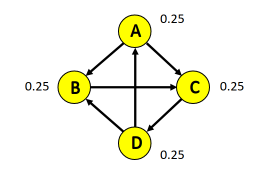

Ogni nodo deve cedere il proprio tesoro in parti uguali tra i suoi adiacenti. Calcoliamo ad esempio il tesoretto di $B$: 

* $A$ cede metà del suo tesoro a B e a C. Dunque B riceve 0.125 da A, ovvero $PR(A)/2$ o $PR(A)/k_A$. 
* $C$ non cede nulla a B. 
* $D$ cede metà del suo tesoro a B e ad A. Dunque B riceve 0.125 da D, ovvero $PR(D)/2$ o $PR(D)/k_D$.

Quindi: 
$$
PR(B) = \frac {PR(A)} {k_A} + \frac {PR(D)} {k_D} = 0.125 + 0.125 = 0.25 
$$
Con lo stesso principio possiamo calcolare il nuovo page rank degli altri 3 nodi. Alla fine del primo round $C$ è l'unico nodo che si ritrova con un tesoro maggiore. 


Iterando questo scambio di tesori si otterrà una situazione di equilibrio in cui il tesoro di ogni nodo non varierà più in maniera significativa. A tempo di convergenza si conosce il valore di centralità per ogni nodo. 

<div style="page-break-after: always;"></div>

## 2. Modelli random

Uno degli obiettivi della Network science è quello di costruire modelli in grado di riprodurre proprietà specifiche della rete reale, legate ad esempio al grado dei nodi, al diametro della rete etc. Le reti reali, a parte qualche rara eccezione (es. reticoli), non hanno una struttura regolare, ma presentano una certa randomicità. 

Sin dagli anni '50 sono stati teorizzati e sviluppati modelli probabilistici, detti modelli random, per cercare di spiegare queste proprietà intrinseche delle reti reali. Tali modelli sono generativi, cioè permettono di generare reti con certe caratteristiche. '


### 2.1 Modello di Erdos-Renyi 

Il primo modello random fu proposto da due matematici ungheresi, Erdos e Renyi, negli anni '60 e prende il loro nome. Fissata una probabilità $p$ ed il numero di nodi $N$ della rete da generare, il modello Erdos-Renyi crea un insieme iniziale di $N$ nodi isolati e per ciascuna coppia di nodi distinti, aggiunge un arco con probabilità $p$. La rete ottenuta con il modello Erdos-Renyi è detta grafo random o rete di Erdos-Renyi. 


#### 2.1.1 Variante G(N,L) del modello

Il modello appena descritto è detto modello $G(N,p)$, perché genera un grafo random partendo dal numero di nodi $N$ e dalla probabilità $p$ che esista un arco tra due nodi. Una variante è rappresentata dal modelo $G(N, L)$, in cui si genera un grafo random con $N$ nodi ed $L$ archi random. 

In questa variante si parte da una rete con $N$ nodi isolati. Ad ogni passo si sceglie una coppia di nodi scelti a caso e non ancora connessi tra loro e si aggiunge un arco tra essi. Si prosegue sino a che la rete non contiene $L$ archi. I due modelli sono equivalenti tra loro. 


#### 2.1.2 Proprietà del grafo random

Per ricavare l'espressione della *distribuzione dei gradi* di una rete random con $N$ nodi, occorre calcolare la probabilità $p_k$ che un generico nodo abbia grado $k$. Ipotizziamo di essere al turno di assegnazione degli archi di generico nodo $u \in V$, la probabilità che $u$ abbia grado $k$ è la probabilità che su $N-1$ nodi rimanenti, $k$ nodi si colleghino ad $u$. Tale distribuzione prende il nome di distribuzione binomiale ed è definita per i generici $n$ e $k$ come segue: 
$$
P (X = k) = \binom{n}{k} p^k(1-p)^{n-k}
$$
Nel nostro caso $n = N-1$ e $k=k$, per cui: 
$$
P_k = \binom{N-1}{k} p^k(1-p)^{N-1-k}
$$
Dove $(1-p)^{N-1-k}$ è la probabilità che $N-1-k$ nodi restanti non creino un collegamento con $u$, mentre $p^k$ è la probabilità che $k$ nodi si colleghino ad $u$. Il coefficiente binomiale iniziale prende in considerazione tutti i modi in cui è possibile selezionare $k$ nodi da collegare ad $u$ tra gli $N-1$ rimanenti. 

Si può dimostrare che il grado medio della rete random è: 
$$
\langle k \rangle = p (N-1)
$$
Per $N \gg \langle k \rangle$ la distribuzione binomiale è ben approssimata da una distribuzione di Poisson: 
$$
p_k = \exp(-\langle k \rangle \frac{\langle k \rangle^k}{k! } )
$$


Dal momento che la distribuzione dei gradi è binomiale, in una rete random i nodi hanno perlopiù lo stesso grado. In reti random grandi, in cui la distribuzione è approssimativamente di Poisson, la maggior parte dei nodi ha un grado più o meno pari al grado medio $\langle k \rangle$. Pochi nodi hanno un grado diverso dalla media. 


#### 2.1.3 Fenomeno Small-World

La distanza media tra i nodi della rete è: 
$$
\langle d \rangle \approx \frac {\ln N}{\ln \langle k \rangle}
$$
Dal momento che $\ln(N) \ll N$, nella rete random le distanze tra i nodi della rete sono mediamente piccole, tale fenomeno prende il nome di *small world*. Il termine: $1 / \ln\langle k \rangle$ implica che più è densa la rete, più piccola è la distanza tra i nodi. 


#### 2.1.4 Coefficiente di clustering nel grafo random 

Per calcolare il coefficiente di clustering di un generico nodo $n$, occorre prima stimare il numero atteso (media) di archi tra gli adiacenti di $n$. Se $k_n$ è il grado di $n$, il numero atteso di archi è: 
$$
\langle L_n \rangle = p \times \frac {k_n(k_n-1)}{2}
$$
Dunque, il coefficiente di clustering di $n$ è dato da: 
$$
C_n = \frac {2\langle L_n \rangle}{k_n(k_n-1)} = p
$$
Dato che $\langle k \rangle = p(N-1)$ allora: 
$$
C_n = p = \frac {\langle k \rangle} {N-1} 
$$
Quindi il coefficiente di clustering è inversamente proporzionale al numero di nodi $N$ nella rete e direttamente proporzionale al grado medio. Si noti che il coefficiente di clustering del nodo è indipendente dal grado del singolo nodo. Considerazioni analoghe possono essere fatte per il coefficiente di clustering globale. 


#### 2.1.5 Confronto tra reti reali e reti random

La distribuzione dei gradi nelle reti reali in figura è molto diversa rispetto a quella della rete random. Nelle reti reali si osservano molti nodi con grado basso e pochi nodi con grado alto. 


Sia per il coefficiente di clustering locale che per quello globale vi è una significativa differenza: nella rete reale, il coefficiente di clustering è più alto rispetto a quello di una rete random. 

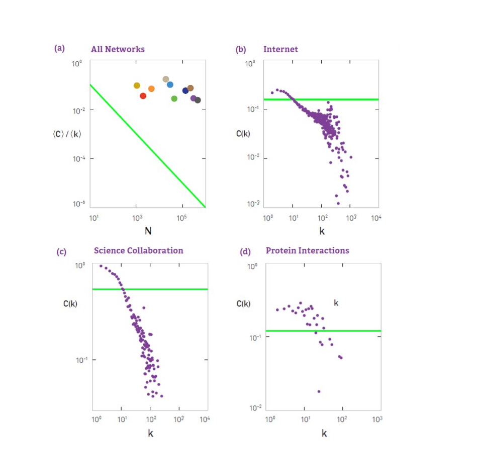

<div style="page-break-after: always;"></div>

#### 2.1.6 Proprietà riprodotta: small-world

L'unica proprietà delle reti reali che la rete random riesce a cogliere abbastanza bene è quella denominata "small world", legata alla distanza media tra i nodi (anche se spesso nelle reti reali si osserva una distanza ancora più bassa). Il fenomeno small world afferma che anche due individui che vivono in zone molto lontane sulla Terra possono essere connessi tra loro attraverso una catena molto piccola di conoscenze. Tale fenomeno è conosciuto anche con il termine "*sei gradi di separazione*" (*six degrees of separation*). La teoria dei sei gradi di separazione fu formulata per la prima volta nel '29 dallo scrittore ungherese Frigyes Karinthi, ma il termine "sei gradi di separazione" fu coniato in seguito ad un famoso esperimento condotto nel '67 da uno psicologo americano, Stanley Milgram. 


##### L'esperimento di Milgram 

Milgram selezionò in maniera casuale un gruppo di studenti americani del Midwest e chiese loro di spedire un pacchetto ad un estraneo del Massachusetts, a migliaia di chilometri di distanza. Ad ognuno di questi studenti Milgram consegnò una lettera con indicazioni riguardo il nome del destinatario, il suo impiego e la zona di residenza, senza però specificare l’indirizzo esatto. Ad ogni partecipante all’esperimento fu quindi chiesto di spedire il proprio pacchetto ad una persona da loro conosciuta che, a loro giudizio, potesse avere maggiori probabilità di conoscere il destinatario finale. Quella persona avrebbe fatto a sua volta lo stesso, fino a quando il pacchetto non fosse arrivato a destinazione. Al termine dell’esperimento, Milgram scoprì con sorpresa che il numero medio di intermediari era 5.2, quindi un numero piccolo e molto vicino a quello teorizzato da Kharinty nel 1929. Ad oggi l'esperimento è stato riproposto e riconfermato attraverso le reti sociali ed altri tipi di reti digitalizzate. 

##### Definizione di small-world 

Formalmente, una rete soddisfa le proprietà small-world se la distanza media tra i nodi è: 
$$
\langle d \rangle \approx \frac {\ln N}{\ln \langle k \rangle}
$$
Ovvero, una rete è small-world se la distanza media tra i nodi ha una dipendenza logaritmica rispetto alla dimensione della rete (numero di nodi). 

<div style="page-break-after: always;"></div>

### 2.2 Modello Watts-Strogatz 

Il modello Erdos-Renyi approssima bene la proprietà small-world, ma non il coefficiente di clustering, locale e globale, della rete reale. Nel '98 Duncan Watts e Steven Strogatz proposero un'estensione al modello Erdos-Renyi, chiamato modello Watts-Strogatz o modello small-world. 

Il modello consente di creare delle reti random che rappresentano una interpolazione tra il grado regolare, che ha un alto coefficiente di clustering ma non esibisce la proprietà small-world, ed il grafo random, che ha basso coefficiente di clustering ma gode della proprietà small-world. 

Anche in questo caso, la distribuzione dei gradi che si ottiene è simile ad una distribuzione di Poisson. Il tipo di grafo prodotto dipende da un parametro $p$, detto anche parametro di *rewiring*. La rete che si ottiene ha caratteristiche intermedie tra la rete regolare e quella random: più basso è $p$, più la rete è simile alla rete regolare, più è alto $p$, più è simile alla rete random. 


Sia $\langle C(p) \rangle$ il coefficiente di clustering al variare di $p$ e $\langle C(0) \rangle$ il coefficiente di clustering della rete regolare ($p=0$). Allo stesso modo sia $\langle d(p) \rangle$ la distanza media tra i nodi al variare di $p$ e $\langle d(0) \rangle$ la distanza media tra i nodi della rete regolare ($p=0$). Se grafichiamo i rapporti dei valori rispettivamente, otterremo il plot nella figura sottostante. All'aumentare di $p$ la distanza media diminuisce (si acquisisce la prop. small-word), ma diminuisce anche il coefficiente di clustering. 


<div style="page-break-after: always;"></div>

### 2.2.1 Distribuzione power-law

Nel modello Watts-Strogatz la distribuzione dei gradi dei nodi risulta essere una distribuzione simile alla Poisson, come nel modello di Erdos-Renyi. Come abbiamo visto, nelle reti reali la distribuzione dei gradi non è affatto simile alla distribuzione di Poisson. Piuttosto, è ben approssimata da una distribuzione chiamata *power-law*. 

Una distribuzione $p$ è una power-law se: 
$$
p_k \sim k^{-\gamma}
$$
Dove il parametro $\gamma$ è detto *esponente di grado*. Nelle reti reali si osserva generalmente $2 < \gamma < 3$. Vediamo a confronto la distribuzione normale e quella di Poisson: 


### 2.2.2 Rete scale-free

Le reti la cui distribuzione dei gradi segue una distribuzione power-law sono dette reti *scale-free*, o *invarianti per scala*. Ciò implica che nelle reti scale-free vi è una piccola porzione di nodi che hanno un grado elevato ed una elevata porzione di nodi, che copre quasi tutta la rete, con basso grado. I nodi di elevato grado vengono chiamati anche *hub*. 

Una rete scale-free è quindi caratterizzata dalla presenza di un certo numero di *hub*, che invece sono praticamente assenti nelle reti random o small-world. Il comportamento scale-free delle reti reali riflette perfettamente ciò che accade in tantissimi ambiti della società attuale (economia, rapporti sociali, etc.) ed è ben riassunto dalla regola di Pareto, o regola 80/20. 

Il termine "scale-free" si riferisce all'assenza di una scala, ovvero un valore di riferimento per stabilire il grado di un nodo qualsiasi della rete. In una rete random in cui la distribuzione dei gradi è di Poisson, la media corrisponde al picco della curva e i gradi dei rimanenti nodi si discostano poco dalla media (varianza finita e bassa): in tal caso la media rappresenta il valore di scala. 

In una rete scale-free, in cui la distribuzione dei gradi è power-law, la varianza della distribuzione diverge per $N$ molto grande. Ciò implica che se scegliamo in maniera casuale un nodo, non possiamo dire nulla sul suo grado: può essere estremamente piccolo o estremamente grande. Non possiamo quindi indicare un ordine di grandezza o una scala al grado di un nodo. 

<div style="page-break-after: always;"></div>

La presenza di hub in una rete scale-free ha una conseguenza importante: rende in generale la rete più robusta ad attacchi o situazioni per cui uno o più collegamenti nella rete vengono meno. Se una rete random un nodo qualsiasi viene giù o un collegamento si interrompe, l'intera rete potrebbe essere compromessa. I punti sensibili di una rete scale-free sono gli hub, che collegano la maggior parte dei nodi. 


#### Proprietà ultra small-world

La presenza degli hub in una rete scale-free ha un'altra importante conseguenza: riduce la distanza media tra i nodi. Per valori dell'esponente di grado $2 < \gamma < 3$ si parla di ultra small-world. In questo scenario la distanza media tra i nodi è più piccola della distanza media osservata nella rete random. Per $gamma > 3$ la rete è small-world ed ha proprietà che la rendono molto simile ad una rete random. Il caso $\gamma < 2$, in quanto per $N$ che tende ad infinito, sia la media che la varianza divergono. Ciò implica che non possono esistere reti grandi con $\gamma < 2$. Per le reti ultra small-world si ha: 
$$
\langle d \rangle = \ln(\ln(N))
$$

<div style="page-break-after: always;"></div>

### 2.2.3 Perché le reti reali sono scale-free?

Come abbiamo visto, molte reti reali sono scale-free, indipendentemente dalla loro natura e dalla loro dimensione. Perché sistemi così diversi convergono verso architetture simili tra loro? Quali sono i meccanismi che fanno emergere la proprietà scale-free? Dunque bisogna investigare sul modo in cui le reti reali si evolvono nel tempo.  Vediamo due caratteristiche principali delle reti reali. 

##### Crescita della rete

Nelle reti reali il numero di nodi cresce continuamente grazie all'aggiunta di nuovi nodi anziché essere  fissato a priori come nei modelli random visti in precedenza. 

##### Preferential attachment

Nelle reti reali un nuovo nodo che entra nella rete tende a legarsi ai nodi più connessi, cioè a quelli più importanti, mentre nella rete random i partner di un nodo sono scelti in modo random. Basti pensare ai followers di Twitter o alle citazioni negli articoli. 


### 2.3 Modello di Barabasi-Albert

La crescita ed il preferential attachment sono proprio le due proprietà cardine del modello di Barabasi-Albert o modello scale-free, proposto nel '99 da Albert-Laszlo Barabasi e Reka Albert. La procedura di generazione del grafo è la seguente: 

* Crea una rete random iniziale con $m_0$ nodi, in cui ogni nodo abbia grado almeno pari a 1. 
* Aggiungi un nuovo nodo alla rete e collegalo a $m < m_0$ nodi esistenti nella rete.
  * La probabilità $P$ che un nuovo nodo si colleghi ad un nodo esistente $i$ di grado $k_i$ è: 

$$
P(k_i) = \frac {k_i} {\sum_{j \in V} k_j}
$$

* Ripeti il passo 2 sino a quando non si ottiene il numero desiderato $M$ di archi.

Il passo 2 realizza il *preferential attachment* in quanto $P$ è direttamente proporzionale al grado $k_i$. Il preferential attachment favorisce la formazione degli hub. Un nodo con alto grado ha più probabilità di un nodo con basso grado di stabilire nuove connessioni e diventare sempre più importante e centrale nella rete. Questo fenomeno è sintetizzato dall'espressione "*rich gets richer*". Attraverso il modello Barabasi-Albert si possono quindi creare reti scale-free.  

<div style="page-break-after: always;"></div> 
# Graph matching

## 1. Introduzione

### 1.1 Isomorfismo tra grafi

L'*isomorfismo tra grafi* (o *graph matching*) consiste nel verificare se due grafi sono "uguali" tra loro, ovvero hanno una corrispondenza (o matching). Formalmente, due grafi $G_1 = (V_1, E_1)$ e $G_2 = (V_2, E_2)$ si dicono isomorfi se: 
$$
\exist f: V_1 \to V_2 \mid \forall\space (u, v) \in E_1 \Longleftrightarrow (f(u), f(v)) \in E_2
$$
Ovvero se ad ogni arco tra due nodi $u$ e $v$ appartenenti a $G_1$, esiste un arco tra i nodi $f(u)$ ed $f(v)$ appartenenti al grafo $G_2$. Tale funzione $f$ è *biiettiva* e prende il nome di *mapping*. In altri termini, è possibile ri-etichettare i nodi di $G_1$ come nodi di $G_2$, mantenendo la relazione tra gli archi di $G_1$ e quelli corrispondenti di $G_2$. 

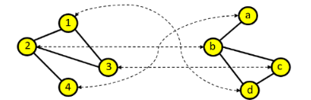


### 1.2 Isomorfismo tra sottografi

L'*isomorfismo tra sottografi* (o *subgraph matching*) consiste nel verificare se un grafo (detto grafo *query*) è contenuto in (quindi è sottografo di) un altro grafo più grande (detto grafo *target*). Formalmente, un grafo $G_1 = (V_1, E_1)$ è un sottografo isomorfo di un grafo $G_2 = (V_2, E_2)$ se 
$$
\exist f: V_1 \to V_2 \mid \forall\space (u, v) \in E_1 \Longrightarrow (f(u), f(v)) \in E_2
$$
La funzione $f$ prende ancora il nome di *mapping* e, dal momento in cui $f$ è solamente *iniettiva*, non è necessario che tutti i nodi di $G_2$ siano mappati. Al contrario, tutti i nodi del sottografo query $G_1$ lo saranno. 


<div style="page-break-after: always;"></div>

### 1.3 Matching multipli ed automorfismi

La soluzione del graph matching (o subgraph matching) non è univoca, in generale possono esistere varie funzioni di mapping $f$. 


L'isomorfismo tra un grafo $G$ e se stesso è detto automorfismo di $G$. Un grafo può avere più automorfismi: 

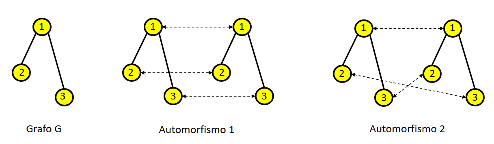


### 1.4 Complessità del matching

Il graph matching è un problema NP-hard, ma non si sa se sia NP-completo. Invece, il problema del subgraph matching è NP-completo, per cui se si trovasse una soluzione il cui tempo è polinomiale, allora si potrebbe usarla per risolvere ogni problema NP (si rimanda ai [casi di complessità P e NP](https://it.wikipedia.org/wiki/Classi_di_complessit%C3%A0_P_e_NP)). 


### 1.5 Algoritmi sviluppati

Per quanto concerne il graph matching, alcuni dei più famosi algoritmi sviluppati sono: Bliss, Saucy, Conauto, Nauty (ora Traces). Questi tool si basano sulla trasformazione dei grafi in una rappresentazione standard, chiamata *forma canonica*, in modo tale che due grafi isomorfi abbiano la stessa forma canonica. L'efficienza di tali algoritmi è legata all'efficienza della trasformazione dei grafi in forma canonica. In generale, non esiste un algoritmo migliore. A seconda del tipo di rete un algoritmo può essere migliore di altri. Su grafi reali, Nauty è sinora l'algoritmo migliore. Alcuni di questi algoritmi contengono una serie di utilità interessanti sui grafi, ad esempio la possibilità di generare tutti i possibili grafi connessi con $k$ nodi. Per quanto riguarda il subgraph matching possiamo riferirci a: Algoritmo di Ullmann ('76), algoritmo di Von Scholley ('84), VFlib, LAD, Focus-Search, RI.

<div style="page-break-after: always;"></div>

## 2. Algoritmi di subgraph matching

Tutti gli algoritmi di subgraph matching hanno una procedura simile: esplorano un particolare albero di ricerca. Ipotizziamo che $G_a$ sia il nodo query e $G_b$ sia il nodo target: 


La root dell'albero di ricerca indica che nessun mapping è stato effettuato. Partiamo da un nodo qualsiasi di $G_a$, ad esempio 1: possiamo mappare il nodo 1 con uno qualsiasi dei quattro nodi di $G_b$. Per cui la root avrà 4 rami uscenti, ognuno di essi considera un diverso mapping del primo nodo. Per ognuno di questi nodi viene scelto un secondo nodo che non sia ancora mappato e vengono fatte le stesse considerazioni. L'albero si estende sino a che per ogni ramo tutti i nodi di $G_a$ siano stati mappati. Ogni cammino che porta dalla radice ad una foglia indica una diversa mappatura, non necessariamente valida (nell'esempio solo le soluzioni evidenziate con un rettangolo sono valide). 


### 2.1 Algoritmo brute-force 

La soluzione bruteforce è una soluzione naive che consiste nel provare tutti i possibili cammini, per cui viene generato ed esplorato l'intero albero di ricerca, alla ricerca di mappature valide. L'algoritmo termina quando tutti i nodi del grafo query sono stati mappati con successo o tutte le alternative per fare matching con un nodo target sono state esplorate. Se un grafo ha $n$ nodi, vi saranno $n!$ possibili match, per cui tale soluzione è particolarmente inefficiente.


### 2.2 Strategie di ricerca

Occorrono delle strategie che aiutino a velocizzare la computazione. Vedremo in particolare due strategie: la *look-ahead* ed il *backtracking*.


#### 2.2.1 Strategia del look-ahead

La strategia del *look-ahead* (*guarda avanti*) consiste nel predire anticipatamente che il matching parziale prodotto da un cammino parziale non porterà ad una soluzione valida finale. 


#### 2.2.2 Strategia del backtracking 

La strategia del *backtracking* consiste nell'abbandonare soluzioni parziali nel momento in cui ci accorgiamo che non portano a soluzioni finali. 


### 2.3 Algoritmo di  Ullmann

L'algoritmo di Ullmann utilizza il grado del nodo per fare look-ahead e backtracking e filtrare lo spazio di ricerca delle possibili soluzioni. L'idea principale, come visto in precedenza, è che se il nodo del grafo query ha un grado maggiore del nodo corrispondente nel grafo target, allora banalmente non è possibile arrivare ad una soluzione, per cui viene effettuato il pruning.  

Supponiamo di dover fare graph matching tra i grafi in figura. Osservando il cammino più a sinistra (leftmost) notiamo che dopo aver mappato il nodo 2 con il nodo $b$, il primo ramo sottostante suggerisce di mappare il nodo 3 con il nodo $c$. Tuttavia, basta osservare che il nodo 3 ha un grado maggiore (3) del nodo c (2), quindi il cammino non potrà portare ad una soluzione. 


<div style="page-break-after: always;"></div>

### 2.4 algoritmo VF 

L'algoritmo VF (Vento-Foggia) si basa sul concetto di *State Space Representation* (SSR).

Il processo di matching è visto come una successione di stati. Ad ogni stato $s$ sono associati vari insiemi: 

* L'insieme $M(s)$, detto mapping parziale, rappresenta l'insieme di coppie di nodi già mappate 
* L'insieme $P(s)$ rappresenta l'insieme di coppie candidate ad essere aggiunte ad $M(s)$. 

L'aggiunta di una coppia di nodi mappati in $M(s)$ provoca la transizione ad un nuovo stato. La coppia può essere aggiunta se e solo se soddisfa delle *regole di fattibilità*. 


```
 
	PROCEDURE match (s)
		IF M(s) contiene tutti i nodi del grafo query
			THEN OUTPUT M(s)
		ELSE 
			calcola l'insieme P(s)
			FOREACH p in P(s)
				IF p soddisfa tutte le regole di fattibilità THEN
					aggiungi p a M(s)
					calcola lo stato s' dopo l'aggiunta
					OUTPUT CALL(s')
				END IF
			END FOREACH
		END IF 
	END PROCEDURE 
	
```


#### 2.4.1 Definizione degli insiemi 

L'algoritmo VF definisce 6 insiemi di nodi: 

* $M_1(s)$ insieme di nodi del grafo query mappati, quindi in M(s)
* $M_2(s)$ insieme di nodi del grafo target mappati, quindi in M(s)
* $T_1(s)$ insieme di nodi del grafo query adiacenti ai nodi in $M_1(s)$
* $T_2(s)$ insieme di nodi del grafo target adiacenti ai nodi in $M_2(s)$
* $V'_1(s)$ insieme dei nodi del grafo query rimanenti 
* $V'_2(s)$ insieme dei nodi del grafo target rimanenti 

L'insieme $P(s)$ è così definito: 
$$
P(s) = \{ (u,v) \mid u \in T_1(s) \and v \in T_2(s) \}
$$
Le regole di fattibilità sono differenti a seconda si tratti di grafi diretti o grafi indiretti. 


#### 2.4.2 Regole di fattibilità - grafi indiretti 

Una coppia $(n,m) \in P(s)$ viene aggiunta ad $M(s)$ se e solo se soddisfa le seguenti tre regole. 

**Consistenza del nuovo stato**

Per ogni nodo $n' \in M_1(s)$ connesso ad $n$, il corrispondente nodo $m' \in M_2(s)$ è connesso ad $m$. 

**Regola del look-ahead ad un livello**

Il numero di nodi in $T_1(s)$ connessi ad $n$ è minore o uguale al numero di nodi in $T_2(s)$ connessi ad $m$. 

**Regola del look-ahead a due livelli**

Il numero di nodi in $V'_1(s)$ connessi ad $n$ è minore o uguale al numero di nodi in $V'_2(s)$ connessi ad $m$. 

 

#### 2.4.3 Regole di fattibilità - grafi diretti

Una coppia $(n,m) \in P(s)$ viene aggiunta ad $M(s)$ se e solo se soddisfa le seguenti cinque regole. 

**Consistenza del nuovo stato**

Per ogni nodo $n' \in M_1(s)$ predecessore di $n$, il corrispondente nodo $m' \in M_2(s)$ è predecessore di $m$. 

Per ogni nodo $n' \in M_1(s)$ successore di $n$, il corrispondente nodo $m' \in M_2(s)$ è successore di $m$. 

**Regola del look-ahead ad un livello**

Il numero di nodi in $T_1(s)$ adiacenti ad $n$ è minore o uguale al numero di nodi in $T_2(s)$ adiacenti ad $m$. 

Il numero di nodi in $T_1(s)$ a cui $n$ è adiacente è minore o uguale al numero di nodi in $T_2(s)$ a cui $m$ è adiacente. 

**Regola del look-ahead a due livelli**

Il numero di nodi in $V'_1(s)$ connessi a $n$ è minore o uguale di nodi in $V'_2(s)$ connessi ad $m$. 


> Osservazione: se si vuole cercare l'isomorfismo tra grafi anziché sottografi è possibile sostituire il minore o uguale con l'uguale. 


<div style="page-break-after: always;"></div>

#### 2.4.4 Complessità dell'algoritmo

Supponiamo che ognuno dei due grafi abbia $n$ nodi. In media, nel caso pessimo ogni grafo ha $\Theta(n)$ adiacenti, quindi il costo dell'esplorazione di un singolo stato è $\Theta(N)$. Nel caso migliore, ad ogni passo il primo nodo selezionato soddisfa sempre le regole di fattibilità, per cui si ha una complessità $\Theta(n^2)$. Nel caso pessimo bisogna esplorare l'intero albero di ricerca, per cui si ha una complessità temporale $\Theta(n!n)$. 

Se consideriamo le informazioni relative allo stato, l'algoritmo memorizza per ogni nodo una quantità costante di informazioni, ovvero il mapping e l'appartenenza ai vari insiemi. Al più $N$ stati (e le informazioni associate) risiederanno simultaneamente in memoria in un certo momento della computazione. 


#### 2.4.5 Algoritmo VF2

Una versione successiva dell'algoritmo, chiamata VF2, ottimizza lo spazio utilizzato sino ad ottenere una complessità spaziale pari a $\Theta(n)$. L'idea è quella di usare strutture dati globali, condivise tra i vari stati, ed evitare la memorizzazione di diverse copie di vettori delle informazioni sui nodi per ciascuno stato.

Vengono introdotte le strutture $core_1$ e $core_2$ dove $core_1(n)=m$ se e solo se $n$ ed $m$ sono mappati assieme. Dei nuovi insiemi $in_1, out_1, in_2, out_2$ descrivono l'appartenenza dei nodi agli insiemi terminali. Il valore memorizzato corrisponde alla prodondità nell'albero di ricerca dello stato in cui il nodo è entrato nel corrispondente insieme. 

In questo modo si tiene traccia contemporaneamente dell'appartenenza del nodo agli insiemi terminali e dello stato corrispondente della computazione. Quando si fa backtracking, si ripristina il precedente valore di questi vettori. 


### 2.5 Algoritmo RI

Le regole di fattibilità (o di pruning in generale) possono ridurre molto lo spazio di ricerca ma sono costose da implementare. In realtà, l'aspetto più importante è l'ordine in cui i nodi della query vengono processati dall'albero di ricerca. Un ordinamento efficace dei nodi può velocizzare molto il matching, anche in presenza di regole di pruning più leggere. Quest'ordine può essere calcolato indipendentemente dal grafo target, nel caso dello *static ordering*, oppure sulla base del grafo target, nel caso del *dynamic ordering*. L'algoritmo RI si basa su uno static ordering dei nodi della query. 


#### 2.5.1 procedura dell'algoritmo

L'algoritmo prevede un *preprocessing* in cui applica lo static ordering, ovvero ordina i nodi del grafo della query in modo da massimizzare la probabilità che un cammino parziale non valido nell'albero di ricerca venga tagliato prima possibile. 

Dopo il preprocessing si provvede ad esplorare lo spazio di ricerca seguendo l'ordinamento stabilito. Si mappano i nodi del grafo query sui nodi del grafo target rispettando la *regola del grado* dettata dall'algoritmo di Ullmann, quando viene trovato un match completo, si memorizza l'occorrenza trovata. Si procede iterando il passo precedente sino a che l'intero spazio di ricerca non è stato esplorato. 


#### 2.5.2 Ordinamento statico

Dato un grafo query con $n$ nodi, l'obiettivo dell'ordinamento statico è quello di costruire una sequenza ordinata di nodi $U = \{u_1, ..., u_n\}$, sequenza che verrà rispettata durante l'esplorazione dell'albero di ricerca. 

Per costruire tale sequenza si procede ad iterazioni: 

* Al tempo 0 l'insieme $U_0$ è vuoto. 
* Al tempo 1 viene inserito in $U_1$ il nodo con il grado massimo. 
* Al generico tempo $i$ viene inserito il nodo $u_i$ con il più alto numero di vicini in $U_{i-1}$.  

Quindi nodi con alto grado e che hanno un elevato numero di connessioni con nodi *già presenti* nell'ordinamento vengono inseriti prima nella sequenza ordinata. In generale, ad ogni iterazioni si calcola un punteggio $S$ per ogni nodo. 

Sia $O^{m-1} = (u_1, ..., u_{m-1})$ la sequenza ordinata parziale. Il punteggio di un nodo candidato $v$ è definito sulla base di 3 insiemi: 

* L'insieme $V_{m,vis}$ di nodi in $O^{m-1}$ adiacenti a $v$. 
* L'insieme $V_{m, neigh}$ di nodi in $O^{m-1}$ adiacenti ad almeno un nodo che non appartiene ad $O^{m-1}$ e che è connesso a $v$. 
* L'insieme $V_{m, unv}$ di nodi connessi a $v$ che non stanno in $O^{m-1}$ e non sono nemmeno connessi a nodi di $O^{m-1}$. 

Il successivo nodo da inserire nell'ordinamento è quello che ha: 

* 1) Massimo valore di $|V_{m, vis}|$
* 2) In caso di parità in 1, massimo valore di $|V_{m, neigh}|$
* 3) In caso di parità in 2, massimo valore di $|V_{m, unv}|$
* 4) In caso di parità in 3, il nodo è scelto arbitrariamente. 


#### 2.5.3 Regole di pruning

Una coppia $(u_i, M(u_i))$ è accettata se e solo se: 

* Né $u_i$ né $M(u_i)$ sono già stati mappati nella soluzione parziale
* I due nodi hanno la stessa etichetta (in un grafo etichettato)
* Il grado di $M(u_i)$ sia maggiore o uguale al grado di $u_i$ (Algoritmo di Ullman).

<div style="page-break-after: always;"></div>

## 3. Graph matching in un database

Dato un database $D$ di $k$ grafi ed un grafo query $Q$, il problema del graph matching in un database consiste nel trovare tutti i grafi $D$ che contengono $Q$ come sottografo (o come grafo). 


### 3.1 Indexing

La soluzione banale consiste nell'applicare un algoritmo di graph matching (come il RI) su ciascun grafo del database, ma ciò richiederebbe troppo tempo. Per ottenere tempi di risposta ragionevoli, occorre indicizzare (*indexing*) in qualche modo i grafi del database ed il grafo query. L'indicizzazione può essere effettuata offline una volta sola per i grafi del database. Vedremo due tipi di indicizzazione, a seconda se ci si basa o meno sulle feature. 


#### 3.1.1 Indicizzazione basata su feature

Si rappresenta il grafo mediante un insieme di attributi (o feature) $F$ e prima di applicare qualsiasi algoritmo di matching si filtrano tutti i grafi del database che non contengono tutte le feature del grafo query. Esempi di algoritmi sono gIndex, TreePi, GraphFind. Le feature estraibili dai grafi sono: piccoli sottografi, alberi, cammini. Gli ultimi due sono più semplici da estrarre rispetto ad i sottografi. 

Ipotizziamo di indicizzare i grafi per cammini di lunghezza 2 e di dover confrontare i due grafi sottostanti. Il grafo query ha molti più cammini di lunghezza 2 rispetto al grafo proveniente dalla base di dati. Inoltre, essendo etichettati, è possibile effettuare un confronto preciso dei protagonisti del cammino. Il grafo del database verrà scartato. 


#### 3.1.2 Indicizzazione non basata su feature

I grafi del database vengono memorizzati solitamente in un albero (B-tree, R-tree). Tali sistemi sono più adatti per frequenti aggiornamenti del database. Alcuni algoritmi sono Ctree o GCoding. 


### 3.2 Schema base 

Lo schema base di graph matching in un database di grafi consiste in 3 passi: preprocessing, filtering e matching. 

* Nella fase di preprocessing vengono estratte le feature da ogni grafo del database (cammini, alberi, sottografi). Le feature vengono memorizzate utilizzando l'indicizzazione inversa. 
* Nella fase di filtering si estraggono le features dalla query e vengono filtrati dal database solo i grafi che contengono tutte le feature del nodo query.
* Nella fase di matching viene applicato un algoritmo di graph matching ad ogni grafo del database filtrato per verificare se contiene o meno il grafo query. 


#### 3.2.1 Indicizzazione inversa

L'indicizzazione inversa consiste nell'indicizzare le feature estratte anziché i dati. Ipotizziamo di avere un insieme di feature $(f_1, ..., f_k)$, ad ognuna di esse verranno associati tutti i grafi che la contengono e quante volte la contengono. 


### 3.3 Algoritmo SING

L'algoritmo SING, acronimo per *subgraph search in non-homogeneous graphs*, si bassa sull'idea che, per migliorare l'efficacia dell'indice, è possibile associare ad ogni feature non solo il numero di volte in cui esso è presente nel grafo, ma anche il nodo da cui parte. Consideriamo il seguente esempio: 


I cammini $AC$ ed $AB$ sono presenti in ambo i grafi $g_1$ e $g_2$, tuttavia, solo $g_1$ contiene la query. Ciò è legato al fatto che entrambi i cammini partono dallo stesso nodo in $g_1$, ma da nodi diversi in $g_2$. 

<div style="page-break-after: always;"></div>

#### 3.3.1 Indicizzazione in SING

L'algoritmo SING prevede due tipi di indici: uno globale per tutti i grafi ed uno locale per ciascuno dei grafi. Nell'*indice inverso globale* ad ogni feature costituita da cammini di lunghezza al più $p$ viene associata la lista dei grafi del database che la contengono ed il relativo conteggio. 

Ad ogni grafo $g$ del database viene associato un *indice inverso locale* che contiene, per ogni feature $f$ presente in $g$,  un vettore binario dove l'$i$-esimo elemento è 1 se esiste un occorrenza di $f$ che parte dal nodo $i$, 0 altrimenti. 


#### 3.3.2 Preprocessing della query

**Filtering 1**: Per ogni feature $f$ del grafo query, viene selezionato l'insieme dei grafi in cui occorre $f$ un numero di volte maggiore o uguale al numero di occorrenze nel grafo query. Viene quindi calcolata l'intersezione $R$ di tutti questi insiemi. 

**Filtering 2**: Per ogni grafo $G \in R$, viene utilizzato l'indice locale di $G$ per calcolare gli insiemi di nodi compatibili (cioé mappabili) con i nodi della query. Vengono scartati i grafi per cui almeno un nodo della query non ha nodi compatibili corrispondenti.

*Quando due nodi sono detti compatibili?*
Supponiamo di dover controllare la compatibilità tra un nodo $u$ del grafo query ed un nodo $v$ del grafo $g$ del database. Possiamo dire che $u$ è compatibile con $v$ se tutte le feature che partono da $u$ nel grafo query partono da $v$ nel grafo $g$. Se $S$ è l'insieme di queste feature che partono da $v$, allora è sufficiente calcolare nell'indice locale del grafo $g$ un AND logico tra i vettori binari associati alle feature di $S$.  

**Matching**: Per ogni grafo candidato che ha superato le due fasi di filtering, viene applicato un algoritmo di matching per verificare se contiene o meno il grafo query. 

 


<div style="page-break-after: always;"></div> 
# Graph Mining

## 1. Introduzione

Similmente al modello transazionale ritrovato nel Market Basket Analysis, dove lo scopo era quello di trovare gli itemset frequenti in un database di transazioni, il problema del *frequent subgraph mining* (FSM) consiste nell'identificare tutti i sottografi che occorrono frequentemente in un database di grafi. 


### 1.1 Supporto, soglia e frequenza

Tipicamente si conta il numero di grafi del database che contengono il sottografo, tale numero prende il nome di *supporto*. Se il supporto del sottografo è maggiore o uguale ad una soglia minima $\sigma$, allora il sottografo è detto *frequente*. L'output di un algoritmo di FSM è l'insieme di tutti i sottografi frequenti, con il loro supporto. 

Vediamo un esempio con soglia $\sigma = 3$:

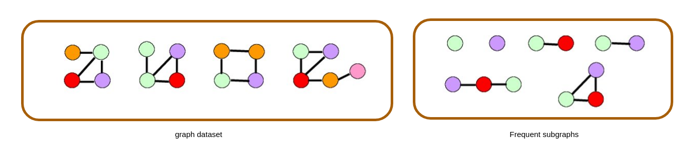

Piuttosto che fare riferimento al *supporto*, che è un conteggio relativo, spesso si utilizza la *frequenza*, che è invece un conteggio relativo. La frequenza di un sottografo $S$ in un database $D$ è il rapporto tra il supporto ed il numero di grafi nel database. La soglia minima $\sigma$ in questo caso sarà espressa come una percentuale. Un sottografo è frequente se è presente in almeno $\sigma$% grafi del database. 


### 1.3 Regola Apriori

Come nel caso del Market Basket Analysis, anche nel Frequent Subgraph Mining è possibile sfruttare la regola *apriori* per filtrare i candidati e ottimizzare la ricerca dei sottografi frequenti. La regola apriori è la seguente: 

> Il supporto di un sottografo $S$ in un database $D$ di grafi non può essere maggiore del supporto dei sottografi che $S$ contiene. 

In altre parole, se un sottografo $S$ non è frequente, allora nessun sottografo che contiene $S$ è frequente. Ciò pone la base per lo schema generale di un algoritmo di Frequent Subgraph Mining. 

<div style="page-break-after: always;"></div>


### 1.4 Schema generale 

Osserviamo adesso lo schema generale di un algoritmo di Frequent Subgraph Mining. Sia $O$ l'insieme finale di sottografi frequenti e sia $\sigma$ la soglia imposta, il primo step è il seguente: 

* Cercare singolarmente tutti i *nodi* frequenti nel database ed insierirli in $O$. 

Nell'insieme $O$ abbiamo adesso grafi formati da *un solo nodo* e frequenti. 

* Per ogni elemento in $O$ generiamo tutti i possibili grafi con 2 nodi, candidati ad essere frequenti. 
* Tra i sottografi generati, eliminiamo i duplicati e verifichiamo la regola apriori.
  * Scartiamo tutti i grafi in cui è presente un sottoinsieme non frequente. 
* Calcoliamo il supporto di ogni grafo candidato e, se risulta essere frequente, aggiungiamolo ad $O$. 

Lo step è generalizzabile per $k \ge 3$, ed ogni sotto-passo ha un nome specifico:  

* *Candidate generation*: a partire dall'insieme dei sottografi frequenti con $k-1$ nodi, costruire l'insieme $C$ dei sottografi candidati con $k$ nodi. 
* *Pruning*: eliminare i sottografi ridondanti e verificare la regola Apriori, ovvero si scartano tutti i candidati che contengono almeno un sottografo con $k-1$ nodi non frequente. 
* *Counting*: calcola il supporto di ogni grafo candidato e l'insieme dei sottografi frequenti con $k$ nodi. Aggiungi questi ultimi all'insieme finale $O$. 

Quando al generico passo $k$ si verifica che l'insieme di sottografi frequenti con $k$ nodi è vuoto, la computazione termina, ovvero non ci sono ulteriori sottografi frequenti. Quindi viene restituito l'insieme $O$ in output. 


<div style="page-break-after: always;"></div>

### 1.5 Approcci BFS e DFS 

L'approccio descritto in precedenza è basato su una strategia in ampiezza, ovvero BFS (Breadth-first Search): prima di generare i sottografi candidati con $k+1$ nodi, si calcolano tutti i sottografi frequenti con $k$ nodi.  

Esiste anche un approccio alternativo che utilizza la strategia DFS (Depth-first search): si calcola il supporto di un sottografo candidato con $k-nodi$ e, se è frequente, si estende. Quindi si controlla il supporto del sottografo esteso e così via. L'approccio DFS richiede meno memoria, ma risulta meno efficace nel pruning. 


### 1.6 Generazione dei candidati

#### 1.6.1 Generazione Join-based 

Un sottografo candidato con $k+1$ nodi è ottenuto dall'unione di due sottografi con $k$ nodi frequenti. L'unione è possibile se e solo se i due sottografi hanno almeno un sottografo con $k-1$ nodi in comune, chiamato *core graph*. Nell'esempio osserviamo due possibili risultati: in uno dei due viene inserito un arco tra i due nodi esterni al core, mentre nell'altro no. 

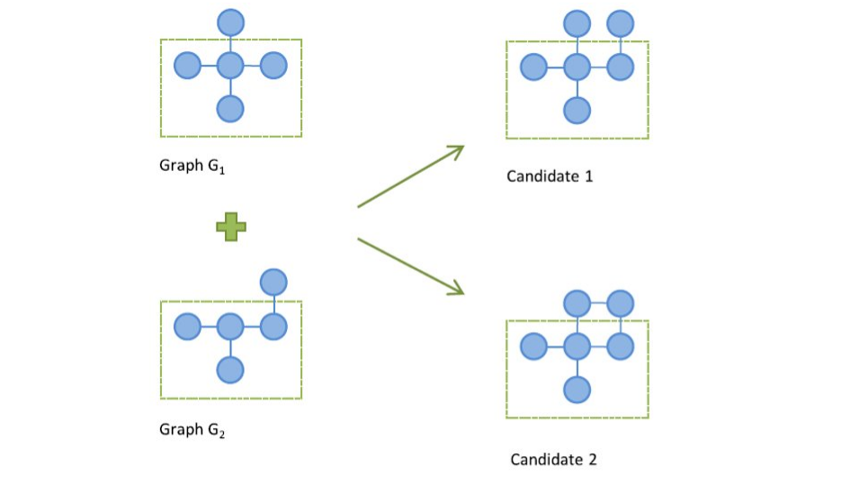

<div style="page-break-after: always;"></div>


La generazione può essere fatta basandosi sugli archi. In tal caso, si aggiunge al grafo frequente un arco di un altro grafo frequente con lo stesso core. Eventualmente è possibile aggiungere, oltre l'arco, anche un nodo. Vediamo nell'esempio in figura che mentre il candidato 2 inserisce solo l'arco, il candidato 1 include anche il nodo. 

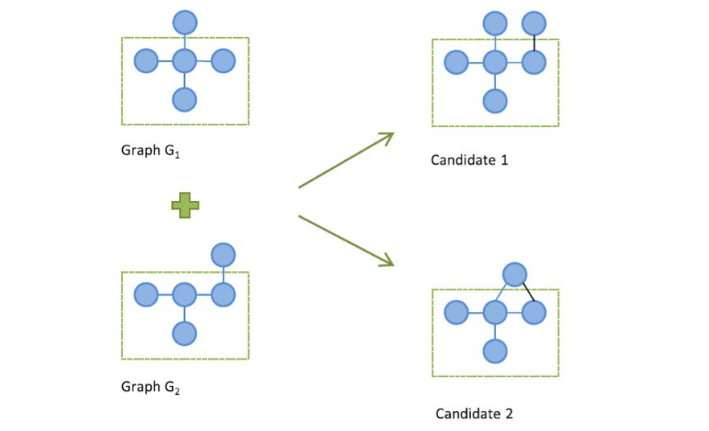

Una join tra due grafi può produrre più candidati per i seguenti motivi: 

* I due sottografi hanno più di un *core-graph* in comune; 
* Un *core-graph* può avere più di un automorfismo; 

Inoltre lo stesso candidato può essere generato a partire da *join* diverse, per cui è necessario un successivo passo di pruning che elimini i candidati duplicati. 


<div style="page-break-after: always;"></div>


#### 1.6.2 Generazione Extend-based

Un sottografo candidato con $k+1$ nodi è generato estendendo un sottografo frequente con $k$ nodi mediante l'aggiunta di un solo nodo. 

L'aggiunta può essere effettuata in vari modi. Una tecnica per evitare la generazione di sottografi candidati ridondanti consiste  nell'effettuare l'estensione seguendo il cammino right-most di una visita DFS effettuata sul grafo: il nodo viene aggiunto *solo* a partire da nodi che risiedono nel cammino più a destra nell'albero di visita DFS del grafo da estendere. Anche tale estensione può essere fatta aggiungendo un arco anziché un nodo. Vediamo un esempio: 


L'albero in figura è prodotto da una visita DFS del grafo frequente. Il cammino evidenziato in nero è il cammino right-most. Nelle due immagini successive si mostra come sia possibile estendere il grafo tramite l'aggiunta di un arco, mentre nelle ultime tre viene aggiunto, in diverse parti del cammino destrorso, un nodo. 


### 1.7 Pruning sulle ridondanze

La generazione dei candidati può portare ad avere sottografi ridondanti, ovvero *isomorfi*. Occorre una rappresentazione dei grafi che consenta di risolvere abilmente gli isomorfismi. Nella pratica, due rappresentazioni comun sono la *matrice di adiacenza* e le *liste di adiacenza*. Tuttavia, tali rappresentazioni non sono adatte ad identificare gli isomorfismi. Osserviamo un esempio di grafi isomorfi la cui matrice di adiacenza è differente: 


#### 1.7.1 Stringa di adiacenza

Il primo passo verso una rappresentazione ideale è quello di considerare la *stringa di adiacenza*, ovvero una stringa ottenuta concatenando tutte le righe della matrice di adiacenza o, nel caso di un grafo indiretto, solo le righe appartenenti alla triangolare superiore (a causa della specularità che rende ridondante l'informazione). 

Per un grafo $G$ con $n$ nodi esistono $n!$ possibili stringhe di adiacenza, ottenute considerando tutte le possibili permutazioni dei nodi. Diverse permutazioni possono produrre la stessa stringa di adiacenza. Non è ancora sufficiente per rappresentare univocamente il grafo. 


#### 1.7.2 Forma canonica

La forma canonica di un grafo è la stringa di adiacenza lessicograficamente più piccola (o più grande), tra tutte quelle che si possono ottenere permutando i nodi in tutti e $n!$ modi possibili. Essa risulta essere una rappresentazione *univoca* del grafo: due grafi isomorfi hanno la stessa forma canonica.

Per individuare sottografi candidati ridondanti nello step di *pruning*, occorre calcolare le loro forme canoniche e confrontarle. Se hanno la stessa forma canonica, quindi nel caso di isomorfismo, uno dei due sottografi va escluso.  


### 1.8 Significatività statistica

I sottografi più frequenti non sono necessariamente quelli più rilevanti. Un sottografo frequente potrebbe essere un *pattern banale*, come un nodo o un arco frequente. Calcolare la significatività statistica di un pattern può essere uno step di post-processamento dei risultati di un algoritmo di FSM, allo scopo di eliminare i pattern banali. 

Vediamo come calcolare la significatività del sottografo frequente nel post-processing: 

* A partire dal database $D$ di $N$ grafi, costruire un database $D^1$ formato da $N$ grafi random ottenuti a partire da ciascuno dei grafi in $D$. 
* Ripetere il primo passo $k$ volte, dove $k$ è un numero molto grande, ottenendo $D^1, ..., D^k$ diversi database di *background*. 
* Per ogni sottografo frequente $S$, calcolare il supporto $X$ in ciasuno dei $k$ database di background. Al termine di tale passo si otterrà una distribuzione di probabilità dei valori di $X$. 
* Calcolare la probabilità $P(X \ge X_0)$ di osservare un supporto $X$ maggiore o uguale al supporto $X_0$ osservato nel database originale $D$. Chiamiamo tale probabilità *p-value*. 
* Se il *p-value* è minore di una soglia $\alpha$ (tipicamente $\alpha = 0.05$), allora $S$ è significativo come sottografo frequente. 


<div style="page-break-after: always;"></div>


#### 1.8.1 Generazione dei database: Algoritmo edge-swapping

Uno dei metodi più popolari per generare un grafo random a partire da un grafo $G$ è l'algoritmo di *edge-swapping*, che permette di generare un grafo random $R$ con la stessa distribuzione di gradi di $G$. L'algoritmo è molto semplice e consiste nei seguenti passi: 

* Selezionare casualmente due archi della rete $(a, b)$ e $(c, d)$ in modo tale che: 
  * Gli archi siano disgiunti tra loro, ovvero non abbiano nodi in comune; 
  * Non esistano in $G$ gli archi $(a, c)$ e $(b, d)$; 
* Scambiare le destinazioni dei due archi: $(a, b) \to (a,d)\text{ e } (c,d) \to (c, b)$
* Iterate i passi un numero sufficiente di volte (convenzionalmente 100 volte il n. totale di archi). 

La scelta degli archi al primo passo assicura che al termine di ogni scambio la distribuzione dei gradi rimanga la stessa. 

<div style="page-break-after: always;"></div>


## 2. Algoritmo FSG 

L'algoritmo FSG ha le seguenti caratteristiche principali: 

* Strategia Breadth-First Search per trovare i sottografi frequenti
* Metodo join-based per la generazione dei candidati
* Rappresentazione dei sottografi in forma canonica

Osserviamo e commentiamo la procedura dell'algoritmo. Sia $D$ il database di grafi, indichiamo con $F^{k}$ l'insieme di sottografi formati da $k$ nodi frequenti in $D$. La prima parte dell'algoritmo calcola semplicemente nodi ed archi frequenti in $D$. 

```

	F[1] = tutti i 1-sottografi (nodi) frequenti in D
	F[2] = tutti i 2-sottografi (archi) frequenti in D

```

Dopodiché poniamo $k = 3$ e definiamo il passo iterativo. L'iterazione termina quando al passo $k-1$ non viene scovato alcun sottografo frequente. 

```
	
	k = 3 
	while (F[k-1] non è vuoto) do: 
		
		# genera l'insieme dei candidati con k nodi 
		C[k] = fsg-gen(F[k-1])
		
		# effettuiamo il pruning utilizzando la forma canonica
		C[k] = prune(C[k])
		
		# per ogni candidato calcoliamo il supporto (attributo count)
		for each candidato G[k] in C[k] do:
			G[k].count = 0
			for each grafo G in D do: 
				if (G[k] è sottografo di G) then: 
					G[k].count = G[k].count + 1
			
			# controlliamo se il supporto è maggiore o uguale alla soglia
			if (G[k].count >= sigma) then:
            	# in tal caso lo aggiungiamo all'insieme dei sottografi 
            	# frequenti con k nodi
            	F[k].add(G[k])
            	   	
         # incrementiamo il valore di k e passiamo alla 
         # iterazione successiva 
		k = k + 1
	
	# ritorniamo tutti gli insiemi frequenti
	return {F[1], ..., F[k-2]}
	
```

<div style="page-break-after: always;"></div>

### 2.1 Generazione dei candidati in FSG

È necessario esplicitare anche alcune procedure arcane utilizzate nella procedura principale, come ad esempio la funzione *fsg-gen* che genera i sottografi candidati.  Essa sarà illustrata e commentata dettagliatamente nel riquadro sottostante. 


```

	procedure fsg-gen (F[k])
	
	# inizializziamo l'insieme dei sottografi con k+1 nodi 
	# candidati 
	C[K+1] = 0
	
	# per ogni coppia di sottografi i,j nell'insieme F[k]
	for each G[i], G[j] in F[k], (i <= j), do:
		
		# inseriamo nell'insieme H tutti i core condivisi
		# dai sottografi i e j. 
		H = get_cores(G[i], G[j])
		
		for each core in H: 
			# generiamo i possibili candidati con il 
			# metodo join-based e li inseriamo in B
			B = fsg-join(G[i], G[j], core)
			
			# i grafi su cui iteriamo adesso hanno k+1 nodi poiché appena 
			# generati dalla giunzione di i e j. Verifichiamo per ogni candidato 
			# la regola Apriori (o chiusura downward). 
			
			for each subgraph in B do: 
				apriori = true 
				
				# togliamo un arco alla volta (quindi anche un nodo)
				# e verifichiamo se il sottografo formato da k nodi
				# risiede nell'insieme F[k]. In caso contrario il grafo
				# non è frequente per la regola Apriori. 
				for each arco e in subgraph do: 
					
					# subgraph ha k+1 nodi, k_subgraph ne ha k
					# ma conosciamo già l'insieme F[k] dall'input. 
					k_subgraph = subgraph.removeEdge(e)
					if (k_subgraph not in F[k]) then: 
						apriori = false 
						break
                        
				if apriori == true then:
					C[k+1].add(subgraph)
	return C[k+1]

```

<div style="page-break-after: always;"></div>

### 2.2 Join tra sottografi

Non resta altro che osservare come viene effettuata la join tra due sottografi $g_i, g_j$ che condividono lo stesso core $h$. Ricordiamo che $g_i, g_j$ hanno $k$ nodi, mentre il core in comune ne ha per definizione $k-1$. 

```

	procedure fsg-join(g[i], g[j], h):
		
		e1 = insieme degli archi presenti in g[i] e non in h
		e2 = insieme degli archi presenti in g[j] e non in h 
		M = insieme di tutti gli automorfismi di h 
		
		# inizializziamo l'insieme dei candidati generati
		B = 0
        
		# iteriamo su ognuno degli automorfismi del core h 
		for each automorfismo phi in M do:
        
			# combinando e1, e2, e l'automorfismo phi otteniamo
			# vari sottografi di dimensione k+1, conserviamo 
			# tali sottografi nell'insieme K 
			K = combine(e1, e2, phi) 
			B = union(B, K)

		return B 

```


### 2.3 Calcolo della forma canonica

L'algoritmo FSG calcola la forma canonica di ogni sottografo a partire dalla matrice di adiacenza. Osserviamo un esempio per semplicità: 


Il primo step consiste nel partizionare ed ordinare i nodi del grafo in base al grado. I nodi $a, c, d$ hanno grado 1, mentre il nodo $b$ ha grado 3. Dividiamo quindi la matrice in due partizioni: 


I nodi con grado più alto hanno potenzialmente molti archi asseriti nella matrice. Se disponiamo gli elementi per grado in ordine crescente, allora la stringa di adiacenza risultante avrà la maggior parte degli elementi asseriti verso la fine. Ciò va fatto poiché l'obiettivo è quello di ottenere la forma canonica del sottografo, ovvero la stringa lessicograficamente più piccola. 

Se il grafo è etichettato come quello in figura, allora a parità di grado è possibile partizionare ulteriormente l'insieme in base alla *etichetta* del nodo, disponendo prima le etichette più piccole. Nell'esempio, i nodi $a,c,d$ hanno rispettivamente etichette $v_0, v_1, v_0$. Disponiamo nella prima partizione i nodi $a, d$ di etichette $v_0$, e in una seconda partizione il nodo $c$ di etichetta $v_1$: 

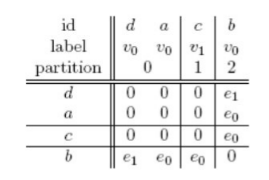

Se in una partizione vi sono più di due nodi, vanno considerate le possibili stringhe di adiacenza date dalla variazione di posizione. Il partizionamento serve soprattutto a diminuire il numero di stringhe di adiacenza da generare. Nel grafo in esempio solo la prima partizione contiene più di un nodo, per cui consideriamo due sole stringhe di adiacenza:  


Essendo un grafo non orientato, formiamo le stringhe di adiacenza utilizzando solo le porzioni di righe appartenenti alla triangolare superiore. Nel primo caso avremo $00e_10e_0e_0$, mentre nel secondo caso $00e_00e_1e_0$. Considerando $e_0 < e_1$ abbiamo che la forma canonica del grafo è quella presentata nel secondo caso.  

<div style="page-break-after: always;"></div>

### 2.4 Ottimizzazioni

Gli step più pesanti dell'algoritmo dal punto di vista computazionale sono: 

* La generazione dei core
* L'operazione di join tra sottografi
* La cancellazione di sottografi candidati poco frequenti

Alcune ottimizzazioni possibili sono rispettivamente: 

* Per ogni k-sottografo, memorizzare le forme canoniche dei suoi (k-1)-sottografi frequenti
* Utilizzare schemi di indicizzazione inversa (inverted index)
* Mettere in cache gli automorfismi di core precedenti


#### 2.4.1 Inverted list

Per contare le frequenze degli $m_k$ $k$-sottografi candidati al paso $k$, dovremmo risolvere $n \times m_k$ problemi di subgraph matching, dove $n$ è  il numero di grafi nel database $D$. La tecnica delle liste invertite può essere utilizzata per ridurre il costo computazionale: 

* Ad ogni sottografo frequente $S$ è assegnata una TID list (*Transaction IDentifier* list), ovvero la lista delle transazioni che contengono $S$.
* Per calcolare la frequenza di un $(k+1)$-sottografo  candidato, viene calcolata l'intersezione delle liste TID dei $k$-sottografi da cui è stato generato. 
* Se la dimensione della lista è minore rispetto al supporto minimo, allora il sottografo candidato viene scartato poiché non potrà mai essere frequente, altrimenti si calcola la frequenza *solo* nelle transazioni della lista prodotta dall'intersezione. 

<div style="page-break-after: always;"></div>

## 3. Algoritmo gSPAN 

L'algoritmo gSPAN ha le seguenti caratteristiche:  

* Strategia Depth-First Search per trovare i sottografi frequenti
* Metodo extend-based per la generazione dei candidati
* Rappresentazione dei sottografi con DFS code


### 3.1 Spazio di ricerca

Lo spazio di ricerca dell'algoritmo gSPAN è un albero gerarchico. Ogni vertice al livello $i$-esimo dell'albero rappresenta un grafo con $i$ nodi e possiede un codice definito come DFS code, il cui calcolo approfondiremo in seguito.  L'algoritmo utilizza un ordinamento lessicografico per i vertici dell'albero che consente di scoprire sottografi frequenti in maniera efficiente. Vertici con DFS code più piccolo vengono scoperti prima nella ricerca e, nel caso in cui un nodo appena scoperto abbia DFS code analogo ad un altro nodo analizzato precedentemente, si effettua il pruning sul nuovo nodo. 

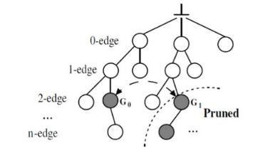

### 3.2 DFS code

La depth-first search può produrre diversi alberi DFS, come vediamo in esempio: 
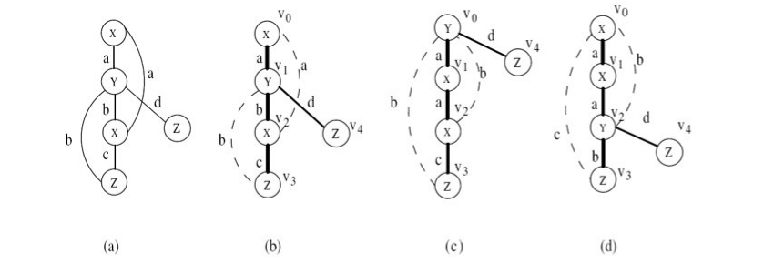

Ognuno dei nodi dell'albero è scoperto ad un tempo differente. Definiamo arco *forward* un arco che porta da un nodo ad un altro visitato ad un tempo successivo, mentre arco *backward* un arco che porta da un nodo ad un altro visitato ad un tempo precedente. 

<div style="page-break-after: always;"></div>

Una volta calcolati gli alberi di ricerca DFS è possibile considerare alcuni elementi: 

* Vertice right-most, che coincide con l'ultimo nodo visitato; 
* Cammino right-most, che va dalla radice al vertice right-most;
* Insieme degli archi forward $E_{f,T} = \{e \mid  \forall i, j, i<j, e=(v_i, v_j) \in E\}$
* Insieme degli archi backward $E_{b,T} = \{e \mid  \forall i, j, i>j, e=(v_i, v_j) \in E\}$

Definiamo *sequenza* DFS la sequenza di nodi $<v1, ..., v_n>$ ovvero i nodi visitati rispettivamente nei tempi $t_1, ..., t_n$. Essendovi sequenze differenti per ogni albero prodotto, è necessario calcolare una rappresentazione che sia univoca. 

A partire dalla sequenza di un albero, definiamo il codice DFS come una sequenza ordinata di archi. Tale sequenza è costruita secondo i seguenti principi: 

* Dato un vertice $v$, tutti i suoi archi uscenti *backward* devono apparire prima degli archi *forward*
* $(i, v_j) < (i, v_i) \Longleftrightarrow j < i$, ovvero tra gli archi *forward* viene data precedenza agli archi che portano a nodi visitati prima, ovvero 
* $(v_i, a) < (v_j, b) \Longleftrightarrow i < j$, ovvero in generale tra gli archi *backward* viene data precedenza agli archi che partono da nodi visitati prima
* $(v, u_i) < (v, u_j) \Longleftrightarrow i < j$, ovvero se l'arco backward parte dallo stesso nodo, viene data la precedenza all'arco che termina nel nodo visitato prima. 

Una volta generati i codici DFS di tutti gli alberi DFS, attraverso un ordine lessicografico viene determinato il codice DFS minimo ed utilizzato per rappresentare il grafo. 

Vediamo un esempio: 


La tabella rappresenta 3 codici DFS prodotti a partire da alberi differenti. Ogni codice è formato da una sequenza di archi rappresentati come quintuple: tempo di scoperta del nodo sorgente, tempo di scoperta del nodo destinazione, etichetta del nodo sorgente, etichetta dell'arco, etichetta del nodo destinazione. Osserviamo come ogni colonna rispetti le regole di ordinamento dettate precedentemente. 

A questo punto dobbiamo definire l'ordine lessicografico tra codici differenti, per cui:

* Partendo dal primo arco, si considera il tempo di scoperta dei due nodi e si seleziona il codice con minimo tempo di scoperta. 
* A parità di tempi di scoperta, si considera l'ordine lessicografico basato sui restanti 3 campi (etichette). 
* A parità di questi, si passa al secondo arco e così via sino a che non si determina il codice minimo.


### 3.3 Estensione dei sottografi 

L'estensione di un sottografo mediante aggiunta di un singolo arco non può essere fatta in maniera arbitraria. Dato un grafo $G$ e l'albero DFS $T$ con DFS code minimo, due estensioni sono possibili: 

* *Estensione backward*: aggiunta di un arco tra il vertice right-most di T ed uno tra i vertici del cammino right-most.
* *Estensione forward*: aggiunta di un nuovo nodo $v$ e di un arco tra $v$ ed un nodo qualsiasi del cammino right-most. 

In tal modo il codice DFS del nuovo sottografo figlio nell'albero di ricerca sarà una estensione del codice DFS del sottografo padre. Nello specifico, per ottenere il codice DFS del grafo figlio è sufficiente accodare il nuovo arco al codice DFS del grafo padre. In questo modo, l'algoritmo gSPAN genera meno candidati rispetto ad FSG. 


<div style="page-break-after: always;"></div>


## 4. Mining in un singolo grafo

Dato un grafo $G$, il problema del mining in un singolo grafo consiste nel trovare tutti i sottografi frequenti in $G$. In questo caso, la frequenza minima è definita in termini di numero di occorrenze di un sottografo in $G$. Un sottografo frequente in un grafo $G$ è detto anche *motivo*. 


### 4.1 Overlap di occorrenze

Nel mining di un singolo grafo ci sono due modi di contare le occorrenze di un sottografo: 

* Senza sovrapposizioni (no overlaps)
* Con sovrapposizioni di nodi o archi (with overlaps)

Nel primo caso continua a valere la regola Apriori, mentre nel secondo caso potrebbe *non valere*. 

Osservando l'esempio sottostante ci accorgiamo che il sottografo $g_1$ ha un supporto pari ad 1 nel grafo $G$. Si noti che $g_1$ *è contenuto* nel sottografo $g_2$: se vale la regola Apriori, $g_2$ dovrà avere un supporto minore o uguale a quello di $g_1$. Considerando il mining con overlap, il grafo $g_2$ avrà supporto 2 in $G$, per cui non vale la regola apriori. 


### 4.2 Significatività statistica

Nel problema del mining in un singolo grafo (o ricerca di motivi) raramente si considera solo il numero di occorrenze per valutare se un sottografo è un motivo. 

>  Si definisce motivo un sottografo ricorrente che è significativamente sovra-rappresentato in una rete. 

La significatività la si può calcolare usando la stessa procedura descritta in precedenza, creando un insieme di varianti random del grafo $G$ e contando la frequenza del sottografo $S$ in ognuna delle varianti random. Il $p$-value ottenuto a partire dalla distribuzione delle frequenze di $S$ determina la significatività statistica del motivo. 

Sono stati recentemente sviluppati dei modelli per calcolare analiticamente il $p$-value senza generare le varianti random, velocizzando il calcolo della significatività. 


### 4.3 Strategie di ricerca

Attraverso un generico grafo è possibile estrarre un numero molto grande di sottografi considerando tutte le varie combinazioni. È necessario definire delle strategie intelligenti per effettuare la ricerca dei motivi in maniera efficiente. 


#### 4.3.1 Strategia network-centric 

Vengono ricercati ed enumerati tutti i possibili sottografi con $k$ nodi che occorrono nella rete iniziale. Si raggruppano attraverso un match dell'isomorfismo le occorrenze di sottografi differenti che hanno la stessa struttura.

Il vantaggio principale della strategia è che sottografi che non occorrono in $G$ non verranno mai considerati. Così facendo risulta più efficiente l'analisi di grafi di grosse dimensioni. Tuttavia, il censimento dei sottografi è un processo molto costoso.

 

#### 4.3.2 Strategia motif-centric 

Vengono enumerati tutti i possibili sottografi con $k$ nodi e vengono ricercati in $G$ separatamente. In tal modo la verifica di un sottografo come motivo è diretta, ma l'enumerazione di tutti i sottografi con $k$ nodi diventa esponenzialmente proibitiva all'aumentare di $k$. Tale approccio è ottimo per grafi di piccola dimensione.


#### 4.3.3 Strategia set-centric

La strategia set-centric è un ibrido tra le due precedenti. Consiste nel ricercare un insieme di sottografi e, con una unica passata sul grafo $G$, trovare tutti i match dei sottografi e raggruppare i match isomorfi. 


### 4.4 Ricerca esatta vs Sampling 

Effettuare una ricerca esatta significa enumerare esaustivamente tutti i sottografi con $k$ nodi. Una strategia alternativa è quella del *sampling*, che consiste nel campionare randomicamente un adeguato numero di sottografi con $k$ nodi. Dopodiché vengono conteggiate le frequenze dei campioni. 

La procedura per effettuare il sampling è la seguente:

* Si sceglie un seed iniziale, ovvero un nodo o un arco casuali in $G$.
* Si estende il seed iterativamente (con archi o nodi) sino a raggiungere un sottografo di $k$ nodi. 

Il sottografo campionato è definito dall'insieme dei $k$ nodi e da tutti gli archi che li collegano. Una variante di sampling consiste nel campionare opportunamente una sottorete $S$ di $G$ ed effettuare una ricerca *esatta* in $S$, stimando i $p$-values per i motivi di $G$ su $S$. 

Il sampling, con poche migliaia di campioni, può ottenere risultati veloci ed accurati. Inoltre non risulta sensibile alla dimensione della rete. Potrebbero tuttavia riscontrarsi bias ed alcuni motivi significativi potrebbero sfuggire. <div style="page-break-after: always;"></div> 
# Catene di Markov e Hidden Markov Models


## 1. Catene di Markov

Una catena di Markov è una tripla $(Q, I, A)$ dove: 

* $Q = \{1, ..., k\}$ è un insieme finito di stati (o eventi). 
* $\pi_i$ denota lo stato osservato all'i-esimo istante di tempo. 
* $I = \{p(\pi_1 = s)\}$ rappresenta l'insieme delle probabilità iniziali per ogni stato. 
* $A$ è l'insieme delle probabilità di transizione denotate da $a_{uv}$ per ogni $u,v \in Q$. 

Nello specifico, $a_{uv}$ denota la probabilità che all'istante di tempo $t$ si verifichi lo stato $v$ dato per assunto che all'istante di tempo $t-1$ si sia presentato lo stato $u$. Di fatto si parla di una transizione di stati e si rappresenta attraverso il concetto di probabilità condizionata:
$$
a_{uv} = P(\pi_t=v|\pi_{t-1}=u)
$$

> Sia *n* la cardinalità dell'insieme degli stati $Q$, l'insieme $A$ è esprimibile attraverso una matrice, chiamata **matrice di transizione** di dimensione $n \times n$, dove l'elemento $a_{i,j}$ rappresenta la probabilità di passare dallo stato $i$ allo stato $j$. 


### 1.1 Proprietà memoryless 

Generalemente si parla di catene di Markov **del primo ordine** quando lo stato successivo dipende esclusivamente dallo stato corrente. Tale proprietà prende il nome di proprietà **memoryless**. Formalmente, se $s_1, ..., s_t$ è la sequenza di stati osservati, si ha: 
$$
P(\pi_t = s_t|\pi_1=s_1, ..., \pi_{t-1}=s_{t-1}) = P(\pi_t = s_t|\pi_{t-1}=s_{t-1}) = a_{s_{t-1}, s_t}
$$
Quindi la probabilità che all'istante di tempo $t$ si abbia $\pi_t = s_t$ dipende solo dal fatto che allo stato $\pi_ {t-1}=s_{t-1}$. Tale probabilità è esprimibile attraverso la transizione tra lo stato $s_{t-1}$ e lo stato $s_t$, ovvero $a_{s_{t-1}, s_t}$. 

<div style="page-break-after: always;"></div>

### 1.2 Probabilità di una sequenza di eventi

Consideriamo la seguente catena di Markov (immagine sottostante) dove i nodi rappresentano i possibili stati e gli archi le transizioni possibili con le rispettive probabilità. Supponiamo di osservare una sequenza di stati del genere: $\{3, 3, 2, 1, 2\}$ con probabilità iniziali $P(\pi_1=1) =0.4, \space P(\pi_1=2) =0.4, \space P(\pi_1=3) =0.2$. Come calcoliamo la probabilità che si verifichi tale sequenza?


Vogliamo quindi calcolare la probabilità $P(3, 3, 2, 1, 2)$, che risulta essere una probabilità congiunta. In generale, per le proprietà sul prodotto logico tra eventi si ha: 
$$
P(s_1, ..., s_n) = P(s_1) \times P(s_2|s_1) \times P(s_3|s_1, s_2) 
\times ...\times P(s_n|s_{n-1}, ..., s_1)
$$
 Ma ricordiamo che vale la proprietà memoryless, per cui: 
$$
P(s_1, ..., s_n) = P(s_1) \times P(s_2|s_1) \times P(s_3|s_2) 
\times ...\times P(s_n|s_{n-1}) = \\
= P(s_1) \times a_{s_1, s_2} \times a_{s_2, s_3} \times ... \times a_{s_{n-1}, s_n} 
$$
Applichiamo tali concetti alla sequenza d'esempio e otteniamo: 
$$
P(3, 3, 2, 1, 2) = P(3) \times P(3|3) \times P(2|3) \times P(1|2) \times P(2|1) \\
= 0.2 \times 0.4 \times 0.3 \times 0.2 \times 0.1 = 0.00048. 
$$


### 1.3 Matrice stocastica 

Nella **matrice di transizione** $A$ di una catena di Markov la somma degli elementi di ciascuna riga è uguale ad 1, ovvero da ciascuno stato $s$ è sempre possibile raggiungere uno qualsiasi degli stati della catena (anche $s$ stesso), e la somma delle probabilità di transizione è 1. In virtù di tale proprietà la matrice di transizione è detta **stocastica**.  Vediamo la matrice di transizione della catena in esempio: 

|         | Stato 1 | Stato 2 | Stato 3 |
| ------- | ------- | ------- | ------- |
| Stato 1 | 0.6     | 0.1     | 0.3     |
| Stato 2 | 0.2     | 0.7     | 0.1     |
| Stato 3 | 0.3     | 0.3     | 0.4     |


### 1.4 Classificazione delle catene di Markov

Una catena di Markov si dice **irriducibile** se da ogni stato $i$ è possibile raggiungere un qualsiasi altro stato della catena mediante una o più transizioni. 


Definiamo **periodo** di uno stato $s$ come il minimo numero di passi necessari per tornare ad $s$ con probabilità non nulla. Se il periodo è maggiore di 1, lo stato $s$ è detto periodico. Una catena di Markov **aperiodica** è una catena in cui *nessuno* stato è periodico. 

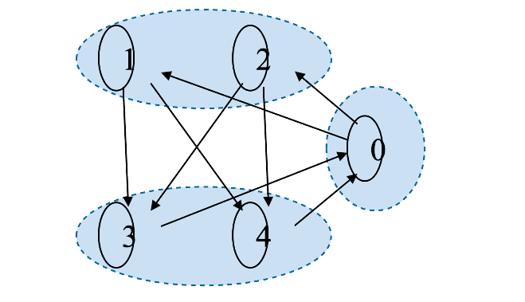

<div style="page-break-after: always;"></div>

### 1.5 Probabilità di eventi successivi

Prendiamo in considerazione la seguente catena di Markov: 


Essa indica che una persona che compra Coca-Cola nel 90% dei casi la prossima volta comprerà Coca-Cola. Se una persona compra Pepsi allora nell'80% dei casi la prossima volta comprerà Pepsi. Visualizziamo la matrice di transizione: 

|               | Coca Cola (C) | Pepsi (P) |
| ------------- | ------------- | --------- |
| Coca Cola (C) | 0.9           | 0.1       |
| Pepsi (P)     | 0.2           | 0.8       |

**Domanda:** per una persona che attualmente compra Pepsi, qual è la probabilità che tra due volte acquisterà Coca Cola? 

La probabilità richiesta è esprimibile come: 
$$
P(\pi_{t+2} = C|\pi_t=P)
$$
Tuttavia lo stato a tempo $t+2$ dipende solo dallo stato $t+1$, che può essere sia Coca-cola che Pepsi. Essendo due casi favorevoli, vanno considerati entrambi e vanno sommate le probabilità. Per cui adesso necessitiamo di: 
$$
1) \space P(\pi_{t+2} = C, \pi_{t+1} = C |\pi_t=P) = 
P(\pi_{t+2} = C | \pi_{t+1} = C) \times P(\pi_{t+1} = C |\pi_t=P) \\
2) \space P(\pi_{t+2} = C, \pi_{t+1} = P |\pi_t=P) = 
P(\pi_{t+2} = C | \pi_{t+1} = P) \times P(\pi_{t+1} = P |\pi_t=P) \\
$$
Calcoliamo entrambe le probabilità attraverso la matrice di transizione: 
$$
1) \space P(\pi_{t+2} = C, \pi_{t+1} = C |\pi_t=P) = 
P(\pi_{t+2} = C | \pi_{t+1} = C) \times P(\pi_{t+1} = C |\pi_t=P) = 0.2 \times 0.9 = 0.18 \\
2) \space P(\pi_{t+2} = C, \pi_{t+1} = P |\pi_t=P) = 
P(\pi_{t+2} = C | \pi_{t+1} = P) \times P(\pi_{t+1} = P |\pi_t=P) = 0.8 \times 0.2 = 0.16
$$
Calcoliamo la somma delle due probabilità: 
$$
P(\pi_{t+2} = C|\pi_t=P) = 0.18 + 0.16 = 0.34
$$
**Osservazione** $-$ Se effettuiamo il prodotto riga colonna tra la matrice A e se stessa otterremo un'ulteriore matrice della stessa dimensione, dove ogni elemento indica la probabilità di due transizioni, la cui transizione di mezzo può essere uno qualsiasi tra gli stati. 
$$
A^2 = A \times A = \begin{bmatrix}
0.9 & 0.1 \\
0.2 & 0.8 \\
\end{bmatrix}
\times 
\begin{bmatrix}
0.9 & 0.1 \\
0.2 & 0.8 \\
\end{bmatrix}
=
\begin{bmatrix}
0.83 & 0.17 \\
0.34 & 0.66 \\
\end{bmatrix}
$$
Di fatto l'elemento di indici $(2, 1)$ indica la probabilità che, partendo dallo stato $pepsi$ si possa arrivare allo stato $CocaCola$ in due transizioni con probabilità del 34%. 

A questo punto è possibile generalizzare il concetto: per una persona che compra Coca Cola, qual è la probabilità che tra *n* volte comprerà Pepsi? Allora basterà effettuare il prodotto riga colonna della matrice A con se stessa per *n* volte. 

Sia $A$ la **distribuzione di probabilità** iniziale. Ogni qual volta effettuiamo un prodotto riga-colonna otteniamo una distribuzione differente. Si può dimostrare che ad un certo punto si arriverà ad una **distribuzione stazionaria** in cui le probabilità non varieranno. 


#### 1.5.1 Distribuzione stazionaria

Sia $M = (Q,I,A)$ una catena di Markov del primo ordine, irriducibile e aperiodica con *k* stati. Si dimostra che: 
$$
\lim_{x\to\infty} P(\pi_n = j | \pi_i = i) = \lim_{x\to\infty} A_{i,j}^n = \sigma
$$
Tale proprietà vale per tutti gli $j$, dunque si ottiene un vettore di valori $\bar{\sigma} = (\sigma_1, ...,\sigma_k)$. Se $\bar{\sigma}$ contiene valori non nulli, allora $\bar{\sigma}$ è detta **distribuzione stazionaria**. Se tutti i valori di $\bar{\sigma}$ sono non nulli allora $\bar{\sigma}$ è l'unica distribuzione stazionaria. 


## 2. Hidden Markov Models (HMM)

Un modello di Markov nascosto (in inglese Hidden Markov Model o HMM) è un modello più ricco rispetto alla catena di Markov. A differenza di una catena di Markov, in un HMM gli stati sono **nascosti**. Ogni stato emette un **simbolo** con una certa probabilità. L'osservatore vede soltanto una sequenza di simboli emessi in base alla quale può dedurre la probabilità di osservare la corrispondente sequenza di stati associati. 


<div style="page-break-after: always;"></div>


### 2.1 Definizione

Una Hidden Markov Model è una quintupla $(Q,I,A,\Sigma,E)$ dove: 

* $Q = \{1, ..., k\}$ è un insieme finito di stati (o eventi). 
* $\pi_i$ denota lo stato osservato all'i-esimo istante di tempo. 
* $I = \{p(\pi_1 = s)\}$ rappresenta l'insieme delle probabilità iniziali per ogni stato. 
* $A$ è la matrice delle probabilità di transizione denotate da $a_{uv}$ per ogni $u,v \in Q$. 
* $\Sigma = \{s_1, ..., s_m\}$ è un alfabeto composto da *m* simboli. 
* $x_i$ denota il simbolo emesso all'i-esimo istante di tempo. 
* $E$ è la matrice di emissione di dimensione $k \times n$ contenente per ogni stato $s \in S$ e ogni simbolo $b \in \Sigma$ la probabilità che $s$ emetta $b$. Si scrive: 

$$
e_{s,b} = P(x_t = b | \pi_t = s)
$$

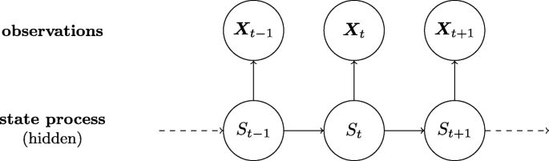


### 2.2 Problemi principali su HMM

I problemi principali legati alle Hidden Markov Models sono i seguenti: 

* **Evaluation**: Sia $M$ un HMM ed X una sequenza di simboli, calcolare la probabilità della sequenza. 
* **Decoding**: Sia $M$ un HMM ed X una sequenza di simboli, trovare la sequenza $\pi$ di stati che massimizza $P(\pi|X)$. 
* **Learning**: Sia M un HMM con probabilità di transizione $A$ e di emissione $E$ note, ed una sequenza $X$, trovare i parametri $Z = (e_{i,j}, a_{i,j})$ del modello che massimizzano $P(X|Z)$. 

**Esempio**: Ipotizziamo che in un casinò vi sia un croupier disonesto con due dadi, uno regolare ed uno truccato. Il dado regolare ha equiprobabilità nell'emettere un qualsiasi numero tra 1 e 6; il dado truccato ha una probabilità maggiore di emettere 6 rispetto agli altri numeri. Data una sequenza di lanci $\{1, 1, 2, 3, 6, 6, 6, 2, 1\}$ risolvere i seguenti problemi: 

* **Evaluation**: Nota la HMM, qual è la probabilità di ottenere questa sequenza di risultati?
* **Decoding**: Quando il croupier ha utilizzato il dato regolare e quando quello truccato?
* **Learning**: Quali sono le matrici di transizione ed emissione che massimizzano la probabilità di ottenere questi risultati?

<div style="page-break-after: always;"></div>


### 2.3 Evaluation

Dato un *HMM* $M$ ed una sequenza di simboli $X = x_1, ..., x_n$ qual è la probabilità di ottenere tale sequenza?

Supponiamo di fissare la sequenza di stati $\Pi= \pi_i, ..., \pi_n$ (incognita). La probabilità di osservare gli *n* simboli della sequenza $X$ emessi dagli *n* stati di $\Pi$ è data da: 
$$
P(x_1, ..., x_n, \pi_1, ..., \pi_n)
$$
Ci avvaliamo delle proprietà sul prodotto logico, per cui: 
$$
P(x_1, ..., x_n, \pi_1, ..., \pi_n) = P(\pi_1, ..., \pi_n) \times P(x_1, ..., x_n | \pi_1, ..., \pi_n)
$$
Supponendo che la catena di Markov sia del primo ordine, allora esprimiamo il primo fattore del prodotto come: 
$$
P(\pi_1, ..., \pi_n) \times P(x_1, ..., x_n | \pi_1, ..., \pi_n) = P(\pi_1) \times 
\prod_{i=1}^{n-1} P(\pi_{i+1}|\pi_i) \times P(x_1, ..., x_n | \pi_1, ..., \pi_n)
$$
Osserviamo il secondo fattore: ci accorgiamo che la probabilità di emettere il simbolo $x_i$ dipende solo dallo stato $\pi_i$, per cui è possibile scomporre tutto in un semplice prodotto di probabilità condizionate: 
$$
P(\pi_1) \times 
\prod_{i=1}^{n-1} P(\pi_{i+1}|\pi_i) \times P(x_1, ..., x_n | \pi_1, ..., \pi_n) = P(\pi_1) \times 
\prod_{i=1}^{n-1} P(\pi_{i+1}|\pi_i) \times \prod_{i=1}^n P(x_i|\pi_i)
$$
Ma $P(\pi_{i+1}|\pi_i)$ corrisponde alla elemento $a_{\pi_i, \pi_{i+1}}$ della matrice di transizione e $P(x_i,\pi_i)$ corrisponde all'elemento $e_{\pi_i, x_i}$ della matrice di emissione, per cui riscriviamo l'espressione finale come segue: 
$$
P(x_1, ..., x_n, \pi_1, ..., \pi_n) = P(\pi_1) \times \prod_{i=1}^{n-1} a_{\pi_i, \pi_{i+1}} \times \prod_{i=1}^n e_{\pi_i, x_i}
$$

#### 2.3.1 Probabilità forward

Nel ragionamento precedente abbiamo assunto una sequenza di stati $\Pi=\pi_1, ..., \pi_n$. Tuttavia per ottenere la probabilità della sequenza data $P(X)$ è necessario sommare le probabilità date da tutte le sequenze $\Pi$ possibili di stati  che possono emettere la data sequenza: 
$$
P(X) = \sum_\Pi P(X,\Pi)
$$
Per evitare la somma, che coinvolge un numero esponenziale di sequenze di stati $\Pi$, definiamo: 
$$
f_t(i) = P(x_1, ..., x_t, \pi_1, ..., \pi_{t-1}, \pi_t=i)
$$
La funzione $f_t$ è chiamata **probabilità forward**, ovvero la probabilità di osservare una sequenza di simboli $X$ emessi da una sequenza di stati $\Pi$ tale che il t-esimo stato (stato al tempo *t*) sia $i$. 

È possibile calcolare la probabilità forward in maniera induttiva, dove il caso base corrisponde a: 
$$
f_1(i) = P(x_1, \pi_1 = i) = P(\pi_1= i) \times P(x_1|\pi_1=i) = P(\pi_1= i) \times e_{i, x_i}
$$
Mentre il passo induttivo è il seguente: 
$$
f_t(i) = P(x_1, ..., x_t, \pi_1, ..., \pi_{t-1}, \pi_t=i) = \\
= \left[\sum_{j=1}^k P(x_1, ...,x_{t-1}, \pi_1, ..., \pi_{t-1} = j) 
\times a_{j,i} \right]\times e_{i,x_i} = \\
= \left[\sum_{j=1}^k f_{t-1}(j) 
\times a_{j,i} \right]\times e_{i,x_i}
$$
Il passo induttivo deriva dal fatto che allo stato $i$ al tempo $t$ ci si possa arrivare da uno qualunque degli stati precedenti $j$ visitato al tempo $t-1$, dopo avere emesso i simboli $x_1, ..., x_{t-1}$. Per arrivare allo stato $i$ da $j$ effettuo una transizione $a_{i,j}$, ed infine si emette il simbolo corrispondente $x_t$. 

A partire dalla probabilità forward, possiamo ottenere la probabilità finale $P(X)$ come: 
$$
P(X) = \sum_\Pi P(\Pi,X) = \sum_{i=1}^k f_n(i)
$$
Ricordando che *k* è il numero di stati ed *n* è la lunghezza della sequenza $X$. 

Applicare l'algoritmo forward equivale a percorre tutti i possibili cammini di un particolare tipo di grafo, chiamato lattice, dove i *k* stati sono disposti in colonna e ripetuti *n* volte:

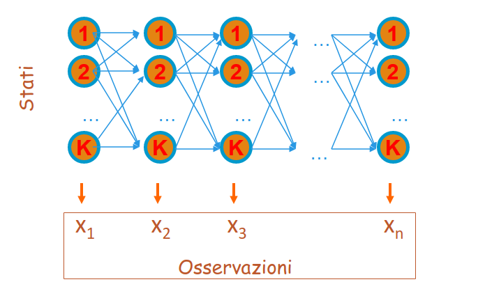


<div style="page-break-after: always;"></div>

#### 2.3.2 Algoritmo forward

Dalle precedenti relazioni segue il seguente algoritmo di programmazione dinamica con complessità $\Theta(k^2n)$, dove *k* è il numero di stati ed *n* è la lunghezza della sequenza $X$. 


```python
X # array contenente la sequenza di simboli emessi
k # numero di stati 
f # matrice delle probabilità forward, 
# dove nelle righe risiedono i tempi e nelle colonne gli stati
E # matrice delle emissioni
A # matrice delle transizioni

# passo base
for i = 1 to k: 
    f[1,i] = P(pi_1 = i) * E[pi_1, i]

# passo induttivo
for t = 1 in len(X):
    # per ogni stato j
    for j = 1 to k:
        sum = 0
        # calcolo la probabilità di passare
        # dallo uno qualsiasi tra gli stati 
        # precedenti i a j 
        for i = 1 in k:
            sum = sum + f[t,i] * A[i,j]
        # dopodiché moltiplico per la probabilità
        # di emettere il simbolo x_{t+1}
        simbol_to_emit = X[t+1]
        f[t+1, j] = sum * E[j, simbol_to_emit]
        
# calcolo la probabilità finale sommando 
# l'ultima riga della matrice, che conterrà
# le probabilità forward al tempo n per tutti
# gli stati. 
p = 0
n = len(X) - 1
for i = 1 in k: 
    p = p + f[n, i]
    
return p
```

<div style="page-break-after: always;"></div>


### 2.4 Decoding

Il secondo problema da affrontare è il **decoding**. Data una HMM $M$ ed una sequenza di simboli $X = x_1, ..., x_n$ trovare la sequenza di stati $\Pi = \pi_1^*, ..., \pi_n^*$ che massimizza la probabilità congiunta di osservare gli $n$ simboli emessi dagli *n* stati di $\Pi$: 
$$
P(x_1, ..., x_n, \pi_1^*, ..., \pi_n^*) = \max_{\pi_1, ..., \pi_n} P(x_1, ..., x_n, \pi_1, ..., \pi_n)
$$
Dove dai calcoli precedenti sappiamo che: 
$$
P(x_1, ..., x_n, \pi_1, ..., \pi_n) = P(\pi_1) \times \prod_{i=1}^{n-1} a_{\pi_i, \pi_{i+1}} \times \prod_{i=1}^n e_{\pi_i, x_i}
$$


#### 2.4.1 Algoritmo di Viterbi 

L'algoritmo di Viterbi ha una struttura simile a quella dell'algoritmo forward. Tuttavia, anziché sommare il contributi provenienti da ogni singolo stato visitato al passo precedente, seleziona di volta in volta il contributo migliore, ovvero quello con il valore massimo. Ciò equivale nel lattice a tracciare un cammino di stati di lunghezza *n* che massimizzi la probabilità di ottenere la sequenza $X$: 


Definiamo una funzione $V_t$: 
$$
V_t(i) = \max_{\pi_1, ..., \pi_t-1} P(x_1, ..., x_t, \pi_1, ..., \pi_{t-1}, \pi_t=i)
$$
Come nel caso della probabilità forward, anche la funzione $V_t$ è definita per induzione, per cui definiamo prima il caso base: 
$$
V_1(i) = P(x_1, \pi_1 = i) = P(\pi_1 = i) \times e_{i, x_1}
$$
Mentre il passo induttivo è il seguente: 
$$
V_t(i) = \max_{\pi_1, ..., \pi_t-1} P(x_1, ..., x_t, \pi_1, ..., \pi_{t-1}, \pi_t=i) = \\
= \left[ \max_{j = 1, ..., k} \space \max_{\pi_1, ..., \pi_t-2} 
 P(x_1, ..., x_{t-1}, \pi_1, ..., \pi_{t-1} = j) \times a_{ji} \right ] \times e_{i, x_t} = \\
= \left[ \max_{j = 1, ..., k} \space V_{t-1}(j) \times a_{ji} \right ] \times e_{i, x_t}
$$
Il passo induttivo deriva dal fatto che allo stato $i$ al tempo $t$ ci si possa arrivare da uno qualunque degli stati precedenti $j$ visitato al tempo $t-1$, ma si seleziona solo lo stato con la probabilità maggiore dopo avere emesso i simboli $x_1, ..., x_{t-1}$. Per arrivare allo stato $i$ da $j$ effettuo una transizione $a_{i,j}$, ed infine si emette il simbolo corrispondente $x_t$. 

A partire dalla funzione $V_t$ possiamo calcolare la probabilità finale $P(x_1, ..., x_n, \pi_1^*, ..., \pi_n^*)$ come segue: 
$$
P(x_1, ..., x_n, \pi_1^*, ..., \pi_n^*) = \max_{i = 1, ..., k} V_n(i)
$$

<div style="page-break-after: always;"></div>


#### 2.4.2 Pseudocodice dell'algoritmo

```python
X # array contenente la sequenza di simboli emessi
k # numero di stati 
V # matrice Viterbi, dove nelle righe risiedono i tempi e nelle colonne gli stati
E # matrice delle emissioni
A # matrice delle transizioni
phi # matrice per tener traccia del cammino
# dove nelle righe risiedono i tempi e nelle colonne gli stati 

# passo base
for i = 1 in k: 
    V[1,i] = P(pi_1 = i) * E[pi_1, i]
    phi[0, i] = 0

# passo induttivo
for t = 1 in len(X):
    # per ogni stato j
    for j = 1 in k:
        _max = 0
        phi[t, j] = 0
        # cerco tra tutti i percorsi calcolati
        # precedentemente quello con la probabilità
        # maggiore di passare allo stato j-esimo
        for i = 1 in k:
            if (V[t, i] * A[i,j] > _max):
                _max = V[t, i] * A[i,j]
                phi[t,j] = i
        # dopodiché moltiplico per la probabilità
        # di emettere il simbolo x_{t+1}
        simbol_to_emit = X[t+1]
        V[t+1, j] = _max * E[j, simbol_to_emit]

# cerco quale tra i cammini di lunghezza n calcolati
# abbia probabilità maggiore di emettere gli n simboli 
pmax = 0
n = len(X) - 1
for i = 1 in k: 
    if (V[n,i] > pmax):
        pmax = V[n,i]
        phi[n,i] = i
        
# ricostruisco il cammino attraverso i valori di phi
decoded_sequence = retrieve_path(phi)
        
```

<div style="page-break-after: always;"></div>

#### 2.4.3 Recuperare la sequenza di stati

Mediante la struttura dati $phi$ si tiene traccia, ad ogni istante di tempo $t$, degli stati migliori da cui si può provenire raggiungendo ogni stato $i$ del modello. In particolare, $phi[t,i]$ indica lo stato migliore da cui si può partire al tempo $t-1$ per raggiungere lo stato $i$ al tempo $t$.  Partendo dallo stato $i$ che massimizza $V_n(i)$, andando a ritroso, è possibile recuperare la sequenza completa degli stati che massimizza la probabilità finale di osservazione della sequenza di simboli. 


### 2.5 Posterior Decoding 

Il **posterior decoding** è un particolare problema di decoding. Avendo osservato una intera sequenza di simboli $X$, si vuole calcolare (a posteriori) lo stato $s$ più probabile all'istante $t$, ovvero lo stato $s$ tale che; 
$$
P(\pi_t = s|X) = arg \max_{i =1,...,k} P(\pi_t = i | X)
$$
Ma osserviamo che: 
$$
P(\pi_t = i| X) = \frac{P(\pi_t = i, X)}{P(X)}
$$
Il problema di massimizzazione è analogo se anziché il rapporto consideriamo solo la probabilità congiunta al numeratore, che tral'altro possiamo esplicitare:  
$$
P(\pi_t = i, X) = P(x_1, ..., x_n, \pi_1, ..., \pi_t=i, ..., \pi_n)
$$
Dalle proprietà sul prodotto logico tra probabilità abbiamo: 
$$
P(\pi_t = i, X) = P(x_1, ..., x_n, \pi_1, ..., \pi_t=i, ..., \pi_n) = \\
= P(x_1, ...,x_t, \pi_1, ..., \pi_t=i) \times 
P(x_{t+1}, ..., x_n, \pi_{t+1}, ..., \pi_n|x_1, ...,x_t, \pi_1, ..., \pi_t=i) = \\
= P(x_1, ...,x_t, \pi_1, ..., \pi_t=i) \times 
P(x_{t+1}, ..., x_n, \pi_{t+1}, ..., \pi_n|\pi_t=i)
$$
Dove l'ultima semplificazione è possibile grazie alla proprietà memoryless delle catene di Markov del primo ordine. Il primo fattore del prodotto finale altro non è che la **forward probability** per $\pi_t = i$, mentre il secondo fattore prende il nome di **backward probability**.

 

#### 2.5.1 Probabilità backward

La probabilità di backward $b_t$ è la probabilità che si abbia una sequenza $x_{t+1}, ..., x_{n}$ di simboli emessa da una sequenza $\pi_{t+1}, ..., \pi_{n}$ di stati, dato per assodato che $\pi_t = i$. Il ragionamento è analogo a quello dedotto dalla probabilità forward, per cui è possibile procedere per induzione: 

Il **passo base** si ha quando $t = n$, ovvero si effettua la supposizione $\pi_n = i$. Ma osserviamo che non vi è nessuna sequenza da calcolare dato che n è la lunghezza massima della sequenza in input, per cui la probabilità sarà massima, $b_t(i) = 1$.

**Passo induttivo**: 
$$
b_{t}(i) = P(x_{t+1}, ..., x_n, \pi_{t+1}, ..., \pi_n|\pi_t=i)
$$
Possiamo scomporre l'espressione: 
$$
\sum_{j=1}^k P(x_{t+1}, ..., x_n, \pi_{t+1} = j, ..., \pi_n|\pi_t=i)
$$
Essendo che ad ogni iterazione della sommatoria lo stato $\pi_{t+1}$ è fissato a $j$, possiamo rimuovere dalla probabilità l'emissione dell'elemento $x_{t+1}$ (che sarà banalmente emessa dallo stato $j$) e la transizione dallo stato $i$ allo stato $j$ e moltiplicarli singolarmente: 
$$
\sum_{j=1}^k P(\pi_{t+2}, ..., \pi_n, x_{t+2}, ..., x_n|\pi_t=i) \times a_{i,j} \times e_{j,x_{t+1}}
$$
Ci accorgiamo che la probabilità corrisponde alla probabilità backward calcolata per $b_{t+1}(j)$, per cui sostituendo: 
$$
b_t(i) = \sum_{j=1}^k b_{t+1}(j) \times a_{i,j} \times e_{j, x_{t+1}}
$$

<div style="page-break-after: always;"></div>


#### 2.5.2 Algoritmo backward

Analogo all'algoritmo forward, l'algoritmo backward ha complessità $\Theta(k^2n)$, dove *k* è il numero di stati ed *n* è la lunghezza della sequenza $X$. 

```python

# Sia X un array di lunghezza n contenente la sequenza di simboli emessa
# Sia B (Backward) una matrice le quali righe indicano i tempi, mentre le colonne gli stati
# Sia Q l'insieme di stati di cardinalità k 
# Sia E la matrice d'emissione e A la matrice delle transizioni 

def backward_probability(X, Q, Sigma): 
    n = len(X) - 1 # partiamo da 0
    k = len(Q) - 1 # partiamo da 0
    # passo base 
    for i in range(0, k):
        B[n, i] = 1
    # passo induttivo 
    # per ogni simbolo in sequenza, partendo dal penultimo
    # poiché l'ultimo è coperto dal passo base 
    for t in range(0, n-1, -1): # da n-1 a 0
        # eseguiamo il calcolo per ogni stato
        for i in range(0, k):
            probability = 0
            # allo stato i ci si può arrivare attraverso 
            # uno stato qualsiasi tra i k stati disponibili
            for j in range(0, k): 
                # prendo la probabilità del tempo t+1
                # poiché l'algoritmo va a ritroso
                symbol_emitted = X[t+1]
                probabilty_to_add = B[t+1] * A[i,j] * E[j, symbol_emitted]
                probability = probability + probability_to_add
		# aggiorniamo il valore della backword probability
         # per lo stato i-esimo esaminato al tempo t
		B[t,i] = probability

	# calcoliamo la probabilità finale sommando tutti 
	# gli stati più vicini allo stato t, ovvero quelle
    # a tempo t = 1 (in codice = 0)
    backward_probability = 0
    for i in range(0, k):
        backward_probability = backward_probability + B[0,i]
	return backward_probability
    
```


### 2.6 Learning

Il terzo problema è quello del **learning** e si divide in due scenari a seconda se la risposta esatta è nota o meno, ovvero se si conosce la sequenza di stati relativa alla sequenza di simboli in input. 


#### 2.6.1 Primo scenario: risposta esatta nota

Sia $X = x_1, ..., x_n$ la sequenza di simboli per i quali la corrispondente sequenza nascosta di stati è nota $\Pi = \pi_1, ..., \pi_n$. Siano $m$ i simboli distinti nell'alfabeto $\Sigma$ e $k$ gli stati finiti in $Q$, nella HMM $M$. Definiamo: 

* $A_{s,t}$ = numero di volte che la transizione dallo stato $s$ allo stato $t$ si presenta in $\Pi$. 
* $E_{s,b}$ = numero di volte che lo stato s in $\Pi$ emette il simbolo $b$ nella sequenza $X$.

Si dimostra che i parametri che danno il massimo $likelihood$ sono le matrici di transizione $A$ ed emissione $E$ le cui entry sono date da: 
$$
a_{s,t} = \frac{A_{s,t}}{\sum_{i=1}^k A_{s,i}}
$$

$$
e_{s,b} = \frac{E_{s,b}}{\sum_{j=1}^m A_{s,j}}
$$

Tuttavia, pochi dati in input possono essere insufficienti per una stima corretta. Quindi è possibile ricadere nel problema dell'**overfitting**. 


#### 2.6.2 Secondo scenario: risposta esatta non nota

Dato che non si è a conoscenza della sequenza di stati, l'idea è quella di partire assegnando valori randomici alle matrici $A$ ed $E$ ed aggiornare i parametri del modello in base alla conoscenza che si ha in un certo momento. Viene ripetuto il processo sinché non si soddisfa un criterio di terminazione. Tale principio prende il nome di **Expectation-Maximization** (EM). 


#### Expectation Maximization

Il principio si basa sui seguenti passi: 

* Stimare $A_{s,t}$ e $E_{s,b}$ dai dati osservati utilizzando i valori correnti $a_{s,t}$ ed $e_{s,b}$ delle matrici di transizione ed emissione;
* Aggiornare i parametri delle matrici $A$ ed $E$ in base ad $A_{s,t}$ e $E_{s,b}$;
* Ripetere i primi due passi sino a che il processo non converge. 


#### 2.6.3 Algoritmo Baum-Welch 

L'algoritmo di Baum-Welch è un algoritmo di tipo Expectation-Maximization. Definiamo: 
$$
s_t(i,j) = P(\pi_t=i, \pi_{t+1}=j|X)
$$
Data la sequenza di simboli $X$, tale espressione esprime la probabilità a posteriori che lo stato $\pi_t=i$ e che lo stato successivo $\pi_{t+1} = j$. Osserviamo il lattice associato: 


Possiamo calcolare la probabilità che si arrivi allo stato $\pi_t = i$ attraverso un percorso $\pi_1, ..., \pi_{t-1}$ qualsiasi attraverso la **probabilità forward**, mentre calcoliamo la probabilità di arrivare al tempo $t+1$ tale che $\pi_{t+1} = j$ provenendo, al tempo $n$, da uno qualunque dei $k$ stati attraverso la **probabilità backward**. È necessario considerare anche la transizione centra da $i$ a $j$ e l'emissione del simbolo $x_{t+1}$. 
$$
f_t(i) \times a_{i,j} \times e_{j, x_{t+1}} \times b_{t+1}(j)
$$
Essendo una probabilità, bisogna normalizzare il valore ottenuto tra 0 ed 1. È necessario quindi dividere il risultato per la somma di risultati ottenuti considerando la stessa espressione per ogni possibile coppia di stati $(i,j)$.
$$
s_t(i,j) = P(\pi_t=i, \pi_{t+1}=j|X) = 
\frac{f_t(i) \times a_{i,j} \times e_{j, x_{t+1}} \times b_{t+1}(j)}
{\sum_{i,j=1}^k f_t(i) \times a_{i,j} \times e_{j, x_{t+1}} \times b_{t+1}(j)} 
$$
Introduciamo un'ulteriore quantita $g_t(i)$, ovvero la probabilità a posteriori di trovarsi al tempo $t$ nello stato $i$: 
$$
g_t(i) = P(\pi_t = i|X) = \sum_{j=1}^k s_t(i, j)
$$
Possiamo stimare la probabilità di transizione $a_{i,j}$ come il rapporto tra il numero di volte in cui passiamo dallo stato $i$ allo stato $j$ ed il numero di volte in cui passiamo dallo stato $i$ ad un qualsiasi altro stato: 
$$
a_{i,j} = \frac
{\sum_{t=1}^{n-1} s_t(i,j)}
{\sum_{t=1}^{n-1} g_t(i)}
$$
Possiamo stimare la probabilità di emissione $e_{i,b}$ come il rapporto tra il numero di volte in cui dallo stato $i$ emetto il simbolo $b$ e il numero di volte in cui entro nello stato $i$ (emettendo un simbolo qualsiasi): 
$$
e_{i,b} = \frac
{\sum_{t=1:x_t=b}^{n-1} g_t(i)}
{\sum_{t=1}^{n-1} g_t(i)}
$$
I passi dell'algoritmo sono i seguenti: 

* **Inizializzazione**: 
  * inizializza $A$ ed $E$ randomicamente (o in base ad una conoscenza pregressa)
* **Iterazione**
  * Calcola le probabilità *forward*
  * Calcola le probabilità *backward*
  * Aggiorna i parametri $Z$ del modello calcolando le stime $A_{i,j}$ e $E_{i,b}$
  * Calcola la probabilità $P(X|Z)$ di osservare la sequenza di simboli $X$ con i parametri $Z$
  * Itera nuovamente sino a che $P(X|Z)$ varia poco rispetto al valore precedente

La probabilità $P(X|Z)$ è calcolabile banalmente poiché ricade nel problema dell'evalutaion già affrontato.

L'algoritmo non garantisce di trovare i migliori parametri e può convergere a minimi locali in base alle condizioni iniziali. Sia *b* il numero di iterazioni, la complessità è $O(bk^2n)$. 

<div style="page-break-after: always;"></div> 
# Sistemi di raccomandazione

## 1. Introduzione

I sistemi di raccomandazione sono una classe di sistemi che implicano la predizione delle risposte dell'utente a delle opzioni, o in generale, le preferenze di un utente rispetto a specifici oggetti (*items*) sulla base delle preferenze espresse in passato. L'idea principale dietro i sistemi di raccomandazione è la seguente: 

* L'utente interagisce con gli oggetti; 
* In base a tali oggetti, il sistema crea un modello di preferenze per l'utente; 
* Il modello permette di predire la reazione dell'utente a nuovi oggetti; 
* Il sistema cerca quali oggetti sono potenzialmente interessanti per l'utente; 
* Il sistema raccomanda oggetti interessanti all'utente; 


### 1.1 Tassonomia

Esistono due principali gruppi di sistemi di raccomandazione: 

* Sistemi ***content-based***, che effettuano suggerimenti ad un utente sulla base delle proprietà di altri item con cui l'utente ha interagito. 
* Sistemi ***collaborative filtering***, che effettuano suggerimenti ad un utente sulla base degli item piaciuti ad utenti ad esso simili. 


### 1.2 Fenomeno long tail 

Lo spazio limitato dei negozi fisici spinge i negozianti all'esposizione della merce più popolare, che risulta vendibile con maggiore frequenza. Tale scelta emargina prodotti di nicchia, come film di autori novelli o dischi di band underground. Un sistema di raccomandazione prende in considerazione un numero di prodotti maggiore di almeno 2 o 3 ordini di grandezza rispetto a quelli esposti in un negozio fisico. 

Gli articoli sono generalmente caratterizzati da una distribuzione a coda lunga per la quale solo un piccolo insieme di articoli ha maggiore popolarità, mentre un ampio insieme di articoli costituisce una nicchia, che spesso non è nemmeno conosciuta dai clienti. Mentre i negozi fisici tendono a utilizzare tutto lo spazio sugli scaffali per posizionare gli articoli più popolari, i negozi digitali non soffrono di tale problema e possono spingere verso una maggiore variabilità dei contenuti. Di conseguenza, c'è un insieme di prodotti poco popolari che si possono trovare solo online, non convenienti da vendere in un negozio fisico. 

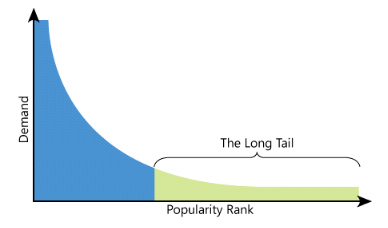

I rivenditori digitali possono facilmente esplorare la distribuzione a coda lunga perché non hanno alcun vincolo fisico (spazio sugli scaffali), ma come fanno a far conoscere agli utenti i prodotti di cui non sono a conoscenza perché non sono abbastanza popolari? Lo strumento più ambito a questo scopo è il sistema di raccomandazione, che può guidare gli utenti da un item popolare ad uno meno popolare con caratteristiche simili.


#### 1.2.1 Alcuni svantaggi 

Un sistema di raccomandazione necessita di molti dati per funzionare correttamente. Più informazioni si conoscono sulle preferenze degli utenti, più è accurata la predizione. In alcuni contesti, ad esempio nell'informazione e nei social media, un sistema di raccomandazione può essere utilizzato ai fini di consenso e propaganda per orientare gli utenti verso un'opinione: può scaturire una mancanza di opinione critica sui fatti. 


### 1.3 Definizione del problema

Sia $X$ l'insieme degli utenti ed $S$ l'insieme degli item. Lo scopo di un sistema di raccomandazione è quello di assegnare un valore ad una coppia $utente$-$item$ $(x,s) \in X \times S$ che quantificherà quanto all'utente $x$ possa piacere l'item $s$. Definiremo quindi una *utility function* (funzione di utilità) come segue: 
$$
u:X \times S \to R
$$
Dove $R$ è l'insieme del rating, ovvero un insieme totalmente ordinato. Esistono molte varianti di rating: 

* rating compreso tra $0-5$ stelle
* rating normalizzato compreso in $[0,1 ]$ 
* rating binario $\{0, 1\}$ (mi piace, non mi piace) 

<div style="page-break-after: always;"></div>

#### 1.3.1 Matrice di utilità

Un sistema di raccomandazione si basa su un insieme di preferenze conosciute espresse da utenti per oggetti o item, che può essere rappresentato da una matrice di utilità $M$ (talvolta chiamata $U$). La matrice $M$ è una matrice $users$-$items$ dove l'i-esima riga rappresenta l'utente $x_i$, l'i-esima colonna rappresenta l'item $s_i$ ed ogni elemento $r_{i,j}$ della matrice rappresenta il rating dell'utente $x_i$ rispetto all'item $s_j$. 

Essa rappresenta la conoscenza esistente del sistema sulla relazione tra utenti ed articoli ed è perlopiù *sparsa* poiché un generico utente *recensisce* / *interagisce con* pochi item. Un sistema di raccomandazione vuole predire i valori di rating inesistenti della matrice. 

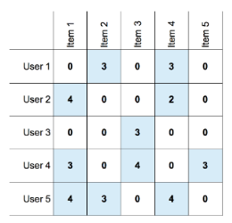

### 1.4 Problematiche chiave

Quando progettiamo un sistema di raccomandazione, incontreremo due problemi principali: la popolazione della matrice di utilità e la predizione di rating non ancora conosciuti. 


#### 1.4.1 Popolare la matrice di utilità

Se la matrice di utilità è vuota, è impossibile effettuare delle raccomandazioni. Ci sono due metodi pincipali per popolare la matrice di utilità: metodo *esplicito* e metodo *implicito*. I due approcci possono essere utilizzati in contemporanea. 

L'approccio ***esplicito*** consiste nel chiedere all'utente di recensire gli item (i.e. Netflix ai nuovi utenti). Tuttavia, questo approccio stanca ed infastidisce facilmente gli utenti, che potrebbero cambiare piattaforma o inserire suggerimenti casuali. Inoltre, le valutazioni sono generalmente influenzate dal fatto che sono fornite da persone disposte a fornirle (che di solito è una piccola parte dell'intero gruppo di utenti). 

L'approccio ***implicito*** fa inferenza dal comportamento dell'utente. Ad esempio lo storico delle visite a certi item, lo storico degli acquisti, le interazioni con l'oggetto etc. In generale, lo storico di ricerca è utilizzato per fare inferenza sulle categorie di item di interesse.  

<div style="page-break-after: always;"></div>


## 2. Sistemi Content-Based 

L'idea principale dietro i sistemi Content-Based è quella di raccomandare all'utente $x$ degli item simili ad item recensiti precedentemente con un buon rating. Ad esempio: 

* Raccomandare film con gli stessi attori, dello stesso regista o dello stesso genere. 
* Raccomandare news con contenuto simile (i.e. politica, cucina, sport)

**Step 1**. Dato un utente, il punto di partenza è costituito dagli item da esso recensiti. Ogni item è descritto da vari attributi. Per ogni item recensito viene costruito un profilo, ovvero un vettore di valori dove ogni valore è riferito ad un attributo. Ipotizziamo che gli item siano film, allora gli attributi possono essere i vari generi (thriller, romantico, horror, azione, etc). 

**Step 2**. Viene costruito uno *user profile* (profilo dell'utente) a partire dai profili degli item recensiti, che rappresenti il grado medio di preferenza dell'utente rispetto ai vari attributi. Ad esempio, l'utente potrebbe preferire film di azione e romantici e valutare negativamente gli horror. 

**Step 3**. Dato un item non ancora recensito dall'utente, viene generato il profilo dell'item e confrontato con lo user profile. Da una certa nozione di similarità tra profili si inferisce se all'utente possa piacere o meno l'item.

I problemi più rilevanti sono: la scelta delle proprietà principali, la costruzione del profilo utente, il calcolo della similarità tra due profili. 


### 2. 1 Definizione formale 

Si supponga che tra le $m$ proprietà degli item se ne selezionino $k$ più rilevanti $f_1, ..., f_k$. 

Per ogni item $s_i$ valutato dall'utente $x$ viene costruito un profilo $I_i$, ovvero un vettore $Pr(I) = (i_1, ..., i_k)$ tale che: 
$$
i_j = 
\begin{cases}
1 \text{ se } s_i \text{ possiede la proprietà } f_j \\
0 \text{ altrimenti}
\end{cases}
$$
Si costruisce il profilo $U$ dell'utente $x$, ovvero il vettore di $k$ valori $Pr(U) = (u_1, ..., u_k)$, dove il generico elemento $u_j$ rappresenta il grado medio di preferenza dell'utente $x$ per gli item recensiti che possiedono la proprietà $f_j$. Sia $s^*$ un item non ancora recensito da $x$ e di cui si vuole predire la preferenza. Si genera il profilo $I^*$ dell'item e si calcola la similarità tra i profili $U$ ed $I^*$. Se la similarità è alta, allora si consiglia ad $x$ l'item $s_i^*$. 


### 2.2 Profilo di un item 

Il profilo di un item descrive quali proprietà contiene un item. Le proprietà rappresentano categorie, tag o parole chiave che è possibile associare ad un item. Se gli item fossero dei film, gli attributi potrebbero essere i generi, il regista, l'anno di uscita o e gli attori. Nel caso dei testi è possibile calcolare lo score TF-IDF delle parole e utilizzare le $n$ parole con score più alto come attributi dei documenti. Nelle immagini è possibile utilizzare dei tag che ne descrivano il contenuto, estraibili automaticamente con algoritmi di machine learning. 

Come descritto precedentemente, se la feature è presente nell'item, allora viene contrassegnata con $1$, altrimenti con $0$. Una volta fissati gli attributi è possibile rappresentare un item come un vettore. Per fissare ciò possiamo definire una funzione di rappresentazione $f$ che trasformi gli item in profili (vettori): 
$$
f:S \to \{0,1\}^k
$$
Dove $k$ è il numero di attributi scelti. 


### 2.3 Profilo di un utente

Partendo dalle valutazioni già effettuate dall'utente su altri item, occorre aggregare in qualche modo le valutazioni che riguardano item che condividono la stessa proprietà. La funzione di aggregazione più semplice è la media delle valutazioni.

 

#### 2.3.1 Caso binario

Poniamoci nel caso ***binario*** in cui l'elemento della matrice è asserito con 1 se è stato valutato positivamente. Supponiamo che vi siano $n$ item e che gli attributi discriminanti siano $k$. Possiamo computare il profilo dell'utente $x_i$ attravers la media come segue: 
$$
\text{profile}(x_i) = \frac 1 {\sum_{j=1}^n M_{i,j}} \sum_{j=1}^n M_{i,j} \times I_j
$$
Dove $I_j = f(s_j)$ è il profilo dell'item $s_j$. Così facendo otterremo un vettore di dimensione $k$, ovvero il profilo dell'utente. Vediamo un esempio: 


Il profilo dell'utente $A$ verrà calcolato secondo la formula, per cui: 
$$
\text{profile}(A) = \frac {\text{HP1 + TW + SW1}}{3} = [.67, .34,.34, .67, 1, 0]
$$


#### 2.3.2 Caso reale

Quando la matrice di utilità non è binaria, ha senso normalizzare gli elementi della matrice di utilità per il loro valore medio. In questo modo, delle valutazioni al di sotto della media avranno un punteggio negativo, mentre valutazioni sopra la media avranno un punteggio positivo. Questo metodo si adatta inoltre in base agli utenti: utenti più critici avranno medie più basse e rating bassi ma sopra la media avranno comunque un punteggio positivo (simmetricamente per utenti più gentili).

Definiamo preventivamente la media delle valutazioni dell'utente $x_i$ supponendo che gli item non ancora valutati abbiano valore 0 nella matrice di utilità: 
$$
\bar u_i = \frac {1}{\sum_j[M_{i,j} \ne 0]} \sum_{j=1}^n M_{i.j}
$$


Dopodiché possiamo costruire il profilo dell'utente $x_i$ come segue: 
$$
\text{profile}(x_i) = \frac {1}{\sum_j[M_{i,j} \ne 0]} 
\sum_{j=1}^n M_{i.j} \times I_j
$$


### 2.4 Similarità tra profili

Per calcolare la similarità tra profili è possibile utilizzare qualsiasi misura di similarità tra vettori. La misura più utilizzata è la *similarità del coseno*, che equivale al coseno dell'angolo formato dai due vettori. Dati due vettori di $k$ elementi $\bar u = (u_1, u_2, ..., u_k)$ e $\bar v = (v_1, v_2, ..., v_k)$, la similarità del coseno è definita come: 
$$
\text{cossim}(\bar u, \bar v) = \frac {\bar u ·\bar v} {||\bar u|| \times ||\bar v||} 
= \frac {\sum_{i=1}^k u_i v_i} {\sqrt{\sum_{i=1}^k u_i^2} \sqrt{\sum_{i=1}^k v_i^2}}
$$
A differenza della similarità basata sulla distanza euclidea, la similarità del coseno tiene conto solo della differenza di direzione dei vettori e non degli specifici valori. Il codominio della funzione va da -1 (vettori antiparalleli) ad 1 (vettori paralleli). 


### 2.5 Vantaggi e svantaggi

I sistemi Content-Based non richiedono confronti con altri utenti, sono facili da interpretare e promuovono gli item non popolari. Tuttavia, individuare le proprietà adatte per costruire i profili degli item può essere difficile e risulta impossibile eseguire delle previsioni su nuovi utenti che non hanno ancora valutato alcun item. Allo stesso modo, risulta impossibile eseguire predizioni su item che contengono proprietà non valutate dall'utente. Un altro difetto marcato è la *overspecialization*: si tende a consigliare solo oggetti simili tra loro, senza proporre all'utente nuove scelte. 

<div style="page-break-after: always;"></div>

## 3. Sistemi Collaborative Filtering 


### 3.1 User-User collaborative filtering 

L'idea principale dietro ai Collaborative Filters è la seguente: gli item da suggerire all'utente $x$ sono quelli valutati in maniera positiva da utenti simili ad $x$. Tale sistema è incentrato maggiormente sul comportamento degli utenti piuttosto che sugli item. 


#### 3.1.1 Schema generale 

Ipotizziamo di voler predire la valutazione dell'utente $x$ rispetto ad un item $s$ non ancora valutato. Il primo step effettuato dai Collaborative Filters è quello di individuare gli $N$ utenti più simili ad $x$ che hanno valutato l'item $s$. Dopodiché si calcola la media delle valutazioni degli utenti sull'item $s$, pesata in base allo score di similarità tra ciascuno degli $N$ utenti ed $x$. Il valore ottenuto da tale media pesata è il rating predetto per l'utente $x$ sull'item $s$. 


#### 3.1.2 Similarità tra utenti

Il *profilo dell'utente* in questo caso è rappresentato dalla corrispondente riga nella matrice $M$ di utilità, dove alle entry vuote viene associato il valore 0. Per calcolare la similarità tra utenti è possibile utilizzare nuovamente la similarità del coseno. 

Applicare la similarità del coseno direttamente sulle righe della matrice introdurrebbe un bias, dal momento in cui il valore 0 non corrisponde ad una valutazione negativa, bensì neutra. Occorre quindi ***normalizzare***, ovvero centrare i valori di rating rispetto al valore 0, in modo che rating bassi risultino negativi e rating alti positivi. Ciò può essere ottenuto sottraendo a ciascun valore di rating conosciuto la media dei rating assegnati dall'utente ai vari item.   

Esempio: ipotizziamo di avere la seguente matrice sparsa di utilità. Ipotizziamo di voler stimare la valutazione dell'utente 4 rispetto all'item 4. Consideriamo gli utenti che hanno già valutato l'item 4, che risultano essere gli utenti 2,3 e 5. 

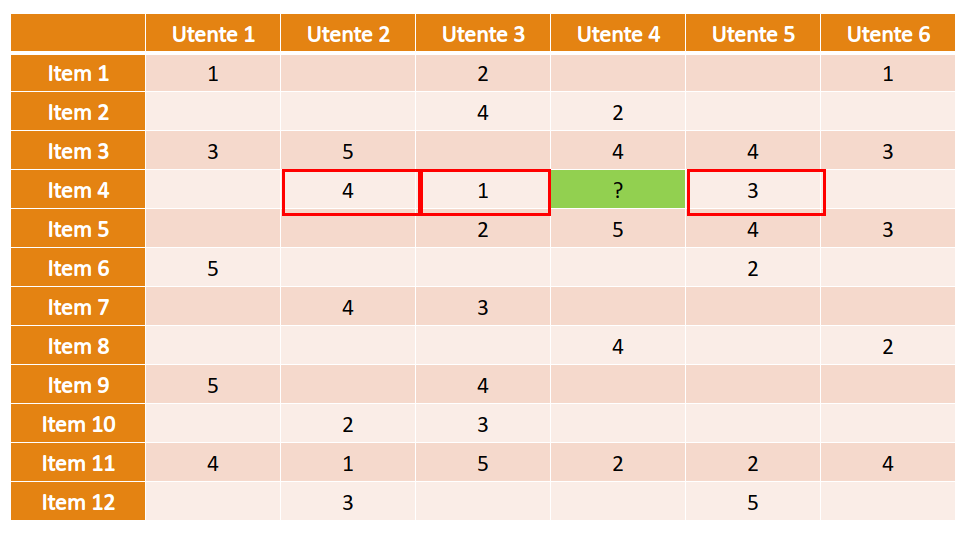

<div style="page-break-after: always;"></div>

Normalzziamo i profili degli utenti 2, 3, 4 e 5 sottraendo la media degli item valutati a tutte le valutazioni e poniamo a 0 (valutazione neutra) tutti gli item non valutati. 


Calcoliamo la similarità del coseno tra l'utente 4 e gli utenti 2,3 e 5 e, supponendo che $N=2$, otteniamo che i due utenti più simili sono 2 (con 0.47) e 5 (con 0.46). Calcoliamo la media pesata dei rating di 2 e 5 sull'item 4, ovvero la predizione della valutazione dell'utente 4 rispetto all'item 4: 
$$
\hat M_{4,4} = \frac {.47 \times 4 + .46 \times 3}{.47 + .46} = 3.51
$$


#### 3.1.3 Similarità nel caso binario

Supponiamo che la matrice $M$ di utilità sia binaria e che ogni elemento indichi se all'utente piace o meno un determinato item. Nel caso binario è possibile rappresentare il profilo dell'utente come un insieme di item piaciuti. Data la notazione insiemistica, è possibile misurare la similarità tra utenti attraverso la distanza di Jaccard: 
$$
J(x_i, x_j) = \frac {|x_i \cap x_j|} {|x_i \cup x_j|}
$$
Tale distanza misura l'intersezione dei due insiemi, ovvero gli item che piacciono ad ambo gli utenti, rispetto all'unione dei due insiemi, ovvero la totalità di item valutati da entrambi gli utenti (fattore di normalizzazione). Tale misura è compresa tra 0 ed 1, dove la massima similarità è 1 ed indica due utenti a cui piacciono esattamente gli stessi item.  


### 3.2 Item-Item collaborative filtering 

Si consideri l'utente $x_i$ ed un item $s_j$ non valutato da $x_i$. Si consideri come profilo $I_j$ dell'item $s_j$ la colonna $j$-esima della matrice di utilità, normalizzata sottraendo la media delle valutazioni degli utenti. Si trovino gli $N$ item più simili ad $s_j$ e valutati dall'utente $x_i$, utilizzando la distanza del coseno. A questo punto si stimi la valutazione dell'utente $x_i$ rispetto all'item $s_j$ attraverso la media dei rating dati dall'utente $x_i$ agli $N$ item più simili ad $s_j$, pesata con lo score di similarità. Il risultato sarà la valutazione predetta. 

Tale schema differisce dai sistemi content-based in quanto il profilo dell'item non è costruito attraverso gli attributi dell'item stesso, bensì attraverso le valutazioni degli utenti nella matrice di utilità. Nella pratica, i sistemi Item-Item funzionano meglio poiché gli utenti tendono ad avere preferenze diverse. 


### 3.3 Confronto tra collaborative filters 

Le due strategie comportano un trade-off tra efficienza ed accuratezza. Lo schema basato sulla similarità degli item è più informativo e permette di ottenere predizioni più affidabili. Questo poiché vi sono generalmente più item che utenti nella matrice di utilità ed è più facile trovare item dello stesso genere che utenti a cui piacciono solo item di un certo genere (il profilo di un utente è quasi univoco). 

Lo schema basato sulla similarità tra utenti è tuttavia più efficiente se vogliamo predire tutti i rating dell'utente $x$. Questo è conseguenza del fatto che una riga della matrice di utilità ha molte entry vuote. Utilizzando lo schema basato sugli utenti è sufficiente individuare l'insieme degli utenti simili ad $x$ per stimare il rating di vari item non valutati da $x$. Nel sistema item-item, per ogni item non valutato è necessario ri-calcolare la similarità.  


### 3.4 Vantaggi e svantaggi

I sistemi Collaborative Filtering lavorano con tutti gli utenti, anche aventi proprietà diverse. Non è necessaria una selezione di proprietà o feature sugli item. Tuttavia, non è possibile eseguire predizioni su nuovi utenti o riguardanti nuovi item. Nella pratica, i sistemi di raccomandazione sono ibridi, ovvero una combinazione tra le due tecniche. 

<div style="page-break-after: always;"></div>

## 4. Singular Value Decomposition (SVD)

### 4.1 Dimensionality reduction

I sistemi di raccomandazione lavorano solitamente su una matrice di utilità di grandi dimensioni, con un elevato numero di utenti ed item. In un contesto in cui subentrano i Big Data, i problemi principali sono: 

* L'efficienza: operazioni svolte su matrici e vettori di grandi dimensioni. 
* Problema della dimensionalità: in uno spazio ad elevate dimensioni, i punti tendono ad essere tutti equidistanti gli uni dagli altri, rendendo complesso il calcolo della similarità. 

Occorre quindi adottare delle tecniche di *dimensionality reduction* (riduzione della dimensionalità), che permettono ai sistemi di raccomandazione di operare con matrici e vettori più piccoli. 


### 4.2 Clustering di item e/o utenti

Una tecnica naive per provare a ridurre la dimensionalità è il *clustering*. Se due o più item hanno caratteristiche simili, allora potrebbero far parte di uno stesso cluster. L'idea è quella di disporre i cluster sulle colonne della matrice di utilità, anziché gli item. 

L'entry $M_{i,j}$ si riferirà alla valutazione dell'utente $x_i$ rispetto al cluster $c_j$, dove la valutazione del cluster è data dalla media delle valutazioni dell'utente sugli elementi del cluster. Si può effettuare analogamente il clustering di utenti e sostituire le righe con cluster di utenti. I due metodi di riduzione possono essere adottati in contemporanea. Tale tecnica è utile ma utilizzabile solo in casi particolari e, inoltre, richiede l'esecuzione di algoritmi di clustering su grosse moli di dati. 


### 4.3 Decomposizione di matrici

Supponiamo che esista un insieme relativamente piccolo di feature di item ed utenti che determinano la valutazione della maggior parte di utenti per la maggior parte di item. Queste feature, riprendendo l'idea del clustering, sosno rappresentative di intere categorie o gruppi di feature. 

L'idea è quella di utilizzare delle tecniche di *decomposizione* o *fattorizzazione di matrici* (che esprimono una matrice come prodotto di due o più matrici). Le tecniche di fattorizzazione permettono di fattorizzare una matrice $m \times n$: 

* Come prodotto di due matrici di dimensione, rispettivamente, $m \times r \text{ ed } r \times n$. 
* Come prodotto di tre matrici di dimensione, rispettivamente, $m \times r \text{, } r \times r, r \times n$

Alcuni scomposizioni d'esempio sono la decomposizione LU, la decomposizione UV, la singular value decomposition (SVD), etc. 


### 4.4 Singular Value Decomposition

La SVD è una tecnica di decomposizione spettrale di una matrice $M$ di dimensione $m \times n$ nel prodotto di tre matrici: 
$$
M = U\Sigma V^T
$$
Dove: 

* $U$ è una matrice unitaria di dimensione $m \times r$
* $\Sigma$ è una matrice diagonale di dimensione $r \times r$, i cui elementi sulla diagonale sono non negativi
* $V$ è una matrice unitaria di dimensione $n \times r$ 

Ricordiamo che una matrice $A$ è unitaria se e solo se $AA^T = I$.  


#### 4.4.1 Proprietà della SVD

* La decomposizione esiste sempre. 
* Gli elementi di $\Sigma$ vengono chiamati ***valori singolari*** di $M$. 
* Il numero di valori singolari non nulli (diagonale di $\Sigma$) corrisponde al rango di $M$. 
* Le colonne della matrice $U$ sono chiamate ***vettori singolari di sinistra***. 
* Le colonne della matrice $V$ sono chiamate ***vettori singolari di destra***. 
* I vettori singolari di sinistra di $M$ sono gli ***autovettori*** della matrice $MM^T$ 
* I vettori singolari di destra di $M$ sono gli ***autovettori*** della matrice $M^TM$ 
* I valori singolari di $M$ non nulli sono le radici quadrate degli autovalori non nulli di $MM^T$ ed $M^TM$ 

Trovare la decomposizione SVD di una matrice consiste nel trovare autovettori ed autovalori delle matrici $MM^T$ ed $M^TM$. 


#### 4.4.2 Interpretazione geometrica 

Sia $M$ una matrice $2 \times 2$. Nel piano $\R^2$ consideriamo un cerchio di raggio unitario con i due vettori unitari canonici (basi standard). La SVD ruota e trasforma il cerchio in un ellisse i cui semiassi hanno lunghezze pari ai valori singolari non nulli di $M$. 


<div style="page-break-after: always;"></div>


#### 4.4.3 SVD nei sistemi di raccomandazione

Nell'ambito dei sistemi di raccomandazione SVD può essere applicata per velocizzare il sistema, trasformando la matrice $M$ di utilità nel prodotto di matrici più sottili, su cui risulti più semplice effettuare la predizione. Sia $M$ la matrice di utilità formata da $m$ utenti ed $n$ item. Allo spazio formato da utenti ed item, la decomposizione SVD affianca un secondo spazio chiamato spazio delle ***categorie***. 

La decomposizione SVD permette di mappare dati dallo spazio degli utenti e degli item allo spazio delle categorie e viceversa. Riprendendo la definizione della scomposizione: 
$$
M = U\Sigma V^T
$$
Dove in questo caso: 

* U è una matrice unitaria formata da $m$ utenti ed $r$ categorie 
* $\Sigma$ è una matrice diagonale di dimensioni $r \times r$, con elementi della diagonale non negativi
* $V$ è una matrice unitaria formata da $n$ item ed $r$ categorie. 


#### 4.4.4 Calcolo delle predizioni con SVD 

Usando SVD possiamo calcolare le predizioni di un utente per tutti gli item mediante un prodotto di matrici. 

* Sia $x$ un utente ed $X$ il vettore di lunghezza $n$ contenente i rating correnti su tutti gli item (se il rating per un item non è conosciuto poniamo 0). 
* Si moltiplica $X$ per $V$, il che equivale a mappare i rating correnti dallo spazio originale a quello delle categorie. Sia $Y = XV$. 
* Si moltiplica $Y$ per $V^T$, il che equivale a ri-mappare i valori dallo spazio delle categorie allo spazio originale. Sia $R = YV^T$ 
* Il vettore $R$ contiene le predizioni dei rating di $x$ su tutti gli item. 

<div style="page-break-after: always;"></div>


#### 4.4.5 Esempio

Consideriamo un nuovo utente $x$: $x$ ha visto solo il film Matrix, valutandolo 4 stelle su 5. Supponiamo di avere la matrice di utilità in figura. Il profilo dell'utente $x$ è $[4, 0, 0, 0, 0]$. Vogliamo predire il rating di $x$ sugli altri film. 


Proseguiamo calcolando il rango della matrice $7 \times 5$ attraverso uno dei metodi di calcolo del rango (i.e. criterio dei minori, teorema di Kronecker o degli orlati, eliminazione gaussiana). Il rango della matrice $\rho(M)$ risulta essere 2. Quindi lo spazio delle categorie è formato da due sole categorie (in questo caso Fantascienza e Amore). Calcoliamo gli autovettori ed autovalori delle matrici $MM^T$ ed $M^TM$ e costruiamo la decomposizione: 


Mappiamo adesso $X = [4, 0, 0, 0 ,0]$ nello spazio delle categorie attraverso il prodotto $Y = XV$: 


E ri-mappiamo $Y$ nello spazio dei film attraverso il prodotto $R = YV^T$: 


Con il seguente risultato: 


## 5. Valutazione dei risultati

Un sistema di raccomandazione può essere visto come un classificatore o un predittore. Se conosciamo i valori reali di rating, possiamo valutare la qualità del sistema confrontando i valori predetti con quelli reali. Nei casi in cui la matrice di utilità è binaria (like / not like), o nel caso in cui non è rilevante predire il valore esatto di rating ma semplicemente se è positivo o negativo, è possibile utilizzare le tecniche standard viste per la classificazione (precision, recall, accuracy, TPR, FPR, etc.). 

Se siamo invece interessati a predire il valore esatto, possiamo utilizzare tecniche standard per valutare la qualità di un predittore. La misura più utilizzata è il Root Mean Square Error (RMSE): 
$$
\text {RMSE} (\hat R, R) = \sqrt{\frac{\sum_{i=1}^{|\hat R|} (\hat R_i - R_i)^2}{|\hat R|}}
$$
Dove $\hat R$ è il vettore dei rating predetti ed $R$ è il vettore dei rating reali. <div style="page-break-after: always;"></div> 
# Reti neurali

## 1. Introduzione

### 1.1 Reti neurali biologiche

I neuroni sono le più importanti cellule del sistema nervoso. Le connessioni sinaptiche (o sinapsi) agiscono come porte di collegamento per il passaggio dell'informazione tra neuroni. I *dendriti* sono fibre minori che si ramificano a partire dal corpo cellulare del neurone (detto *soma*). Attraverso le sinapsi, i dendriti raccolgono input da neuroni afferenti e li propagano verso il soma. L'*assone* è la fibra principale che parte dal soma e si allontana da esso per portare ad altri neuroni (anche distanti) l'output. 


Il passaggio delle informazioni attraverso le sinapsi avviene con processi elettro-chimici: il neurone presinaptico libera delle sostanze, chiamate neurotrasmettitori, che attraversano il breve gap sinaptico e sono captati da appositi recettori, detti *canali ionici*, sulla membrana del neurone postsinaptico. L'ingresso di ioni attraverso i canali ionici determina la formazione di una differenza di potenziale tra il corpo del neurone postsinaptico e l'esterno. Quando questo potenziale supera una certa soglia, detta di *attivazione*, si produce uno *spike* o *impulso*: il neurone propaga un breve segnale elettrico detto *potenziale d'azione* lungo il proprio assone: questo potenziale determina il rilascio di neurotrasmettitori dalle sinapsi dell'assone. 

Il *reweighting* delle sinapsi, ovvero la modifica della loro efficacia di trasmissione, è direttamente collegato ai processi di *apprendimento* e *memoria* in accordo con la regola di Hebb.

> Hebbian Rule:  se due neuroni, tra loro connessi da una o più sinapsi, sono ripetutamente attivati simultaneamente allora le sinapsi che li connettono sono rinforzate.

Il cervello umano contiene circa 100 miliardi di neuroni, ciascuno dei quali connesso con circa altri 1000 neuroni ($\sim 10^{14}$ sinapsi). La corteccia celebrale (sede delle funzioni nobili del cervello umano) è uno strato laminare continuo di 2-4 mm, una sorta di lenzuolo che avvolge il nostro cervello formando numerose circonvoluzioni per acquisire maggiore superficie. Sebbene i neuroni siano disposti in modo ordinato in livelli consecutivi, l'intreccio di dendriti e assoni ricorda una foresta fitta ed impenetrabile. 

<div style="page-break-after: always;"></div>

### 1.2 Reti neurali artificiali

Il primo modello di *neurone artificiale* fu progettato da McCulloch e Pitts: gli input e gli output erano binari ed erano in grado di eseguire delle computazioni logiche. 

Un neurone artificiale moderno prende in ingresso $n$ input $(x_1, ..., x_n)$, pesati rispettivamente con $n$ pesi $(w_1,...,  w_n)$ che rappresentano l'efficacia delle connessioni sinaptiche dei dendriti. Tali valori varieranno durante il processo di apprendimento. Esiste un ulteriore peso, detto *costante di bias*, che si considera collegato ad un input fittizio con valore costante 1, questo peso è utile per tarare il punto di lavoro ottimale del neurone.   


Il neurone somma i prodotti tra gli input ed i corrispettivi pesi (compresa la costante di bias) e produce un valore $z$. Dopodiché, sulla base di una funzione di attivazione $\phi$ a cui viene passato il valore $z$, produce un valore di output.  


#### 1.2.1 Layer 

Le reti neurali sono composte da gruppi di neuroni artificiali organizzati in livelli o *layer*. Tipicamente sono presenti un *layer di input*, un *layer di output*, ed uno o più layer intermedi o nascosti (*hidden*). Ogni layer contiene uno o più neuroni. 

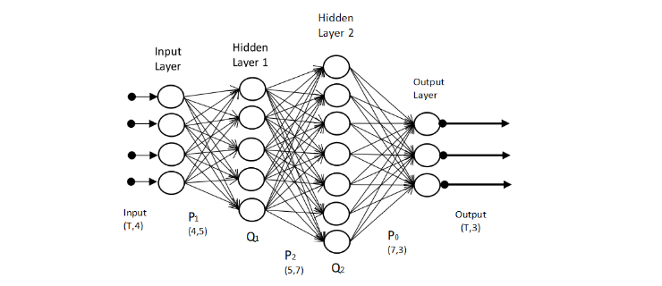

Il layer di input è costituito da un vettore di $n$ valori $\bar x = (x_1, ..., x_n)$. Gli hidden layer sono costituiti da uno o più nodi che prendono in input uno o più valori provenienti dal layer precedente. Ogni nodo dell'hidden layer produrrà un output che verrà passato ad uno o più nodi del layer successivo. Il layer di output è costituito da uno o più nodi che restituiscono in output un valore. Il termine **deep neural network** indica una rete formata da molti layer nascosti.

<div style="page-break-after: always;"></div>


#### 1.2.2 Tensori

Nel contesto delle reti neurali, un tensore è un array $n$-dimensionale, ovvero una generalizzazione di un vettore o di una matrice.  Nel modello più generale di rete neurale sia l'input che l'output di un nodo della rete può essere un tensore. I nodi di un layer possono essere organizzati e disposti a formare una matrice (come nelle convolutional networks) o un tensore. Nel primo caso ritroviamo il tensore al livello dei dati, mentre nel secondo lo ritroviamo come disposizione dei nodi della rete. 


#### 1.2.3 Connessioni tra layer

Una rete neurale in cui ogni nodo di un certo layer riceve tutti gli output del layer precedente è detta ***densa***. In questo caso si parla di ***layer totalmente connessi***. Altre tipologie di connessioni tra layer sono possibili: 

* Connessione *random*: fissato $m$, ogni nodo riceve output solamente da $m$ nodi (generalmente casuali) del precedente layer. 
* Connessione *pooled*: i nodi di un layer sono partizionati in $k$ cluster. Il layer successivo, chiamato pooled layer, sarà formato da $k$ nodi, uno per ogni cluster. Il nodo associato al cluster $C_i$ riceverà tutti e soli gli output dei nodi del layer precedente appartenenti al cluster $C_i$. 
* Connessione *convolutional*: i nodi di ogni layer sono visti come se fossero disposti su una griglia. Il nodo di coordinate $(i,j)$ riceve tutti e soli gli input dei nodi del layer precedente che si trovano in una regione piccola della griglia intorno al punto $(i,j)$ (vediamo una immagine che rappresenti cosa si intende per convoluzione). 

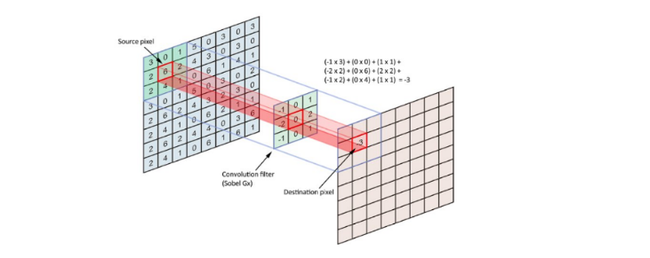

### 1.3 Explanable AI

La rete neurale si presenta come un modello *black-box*: un osservatore esterno vede l'output prodotto dal modello a partire da un input, ma il modello non è in grado di *giustificare* il risultato ottenuto, ovvero non è in grado di spiegare il procedimento logico per cui si arriva a produrre quel risultato. Il termine *Explnable AI* indica una serie di tecniche a supporto di modelli di intelligenza artificiale per far sì che un risultato prodotto da tali modelli possa essere compreso da un essere umano. Tali tecniche sono molto importanti in ambito medico, nella guida autonoma, nella computer vision, etc. 

<div style="page-break-after: always;"></div>


### 1.4 Progettare una rete neurale

La costruzione di una rete neurale è fondamentale per ottenere un modello di machine learning in grado di classificare o predire accuratamente. Per prima cosa bisogna definire la struttura della rete: 

* Quanti hidden layer definire?
* Quanti nodi deve contenere ciascun layer?
* Come connettere i nodi di layer consecutivi?
* Quale funzione di attivazione scegliere per ogni nodo di ogni layer?

Una volta definita la struttura, il modello deve essere addestrato su un training set al fine di trovare i valori ottimali dei pesi degli input ricevuti da ogni nodo della rete neurale in ogni layer. Per fare ciò occorre definire una funzione di costo *globale* $F$, detta ***funzione loss***, e trovare i pesi che la minimizzino. Le due ulteriori domande da porsi sono: 

* Come deve essere organizzato il training set? Da quanti elementi?
* Quale funzione loss scegliere?

La progettazione di una rete neurale è per lo più uno studio empirico, fatto di tentativi. Le linee guida per la progettazione sono le seguenti: 

* Una rete neurale con meno layer richiede tempi di addestramento ed esecuzione minori. 
* Una rete neurale con più layer permette di risolvere problemi decisionali più complessi. 
* Troppi layer producono un modello troppo complesso con un concreto rischio di overfitting.
* Tre layer sono spesso buoni nella pratica. 
* Definire molti nodi in un hidden layer permette di identificare pattern più complessi nei dati. 
* Per prevenire l'overfitting è conveniente partire da un basso numero di nodi ed aumentarlo gradualmente, monitorando le performance del modello. 


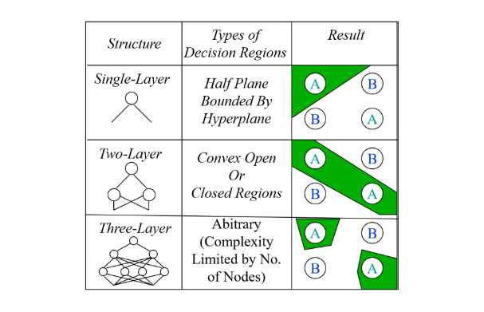


## 2. Funzioni di attivazione

### 2.1 Definizione formale

Sia $\bar x = (x_1, ..., x_n)$ il vettore dei valori ricevuti da un nodo, $\bar w = (w_1, ..., w_n)$ il vettore dei pesi e $b$ la costante di bias. La *funzione di attivazione* di un nodo $i$ è la funzione $F$ che determina la risposta $F(z)$ prodotta a partire da: 
$$
z = \bar w · \bar x + b
$$
Tutti i nodi di un layer hanno la *stessa* funzione di attivazione.  


### 2.2 Proprietà desiderate

La scelta della funzione di attivazione si lega al metodo scelto per ottimizzare i pesi della rete basato sulla minimizzazione della funzione loss. Il metodo di minimizzazione più popolare è quello della ***discesa del gradiente*** (*gradient descent*). Affinché il gradient descend lavori al meglio, la funzione di attivazione deve avere delle proprietà desiderate: 

* La funzione deve essere *continua e differenziabile* in ogni punto (o quasi). 
* La derivata della funzione non deve saturare, ovvero tendere a zero nel proprio dominio: questo potrebbe portare ad uno *stallo* nel processo di ricerca dei pesi ottimali. 
* La derivata della funzione non deve esplodere, ovvero tendere all'infinito nel proprio dominio: questo potrebbe portare *instabilità numerica* nel processo di ricerca dei pesi ottimali. 


### 2.3 Unit step function

La più semplice funzione di attivazione è la funzione step, chiamata anche *heaviside step* o *unit step function*. Il nodo che usa la funzione step restituisce valori binari e viene  per questo chiamato ***percettrone***. La funzione è definita come segue: 
$$
\text{step}(z) = \begin{cases}
1 \text{ if } z > 0 \\
0 \text{ otherwise }
\end{cases}
$$


La derivata della funzione unit step function $H(z)$ è notoriamente la funzione [*Delta di Dirac*](https://it.wikipedia.org/wiki/Delta_di_Dirac) $\delta(z)$. Quest'ultima satura a 0 per $z \ne 0$ ed esplode ad $\infty$ quando $z = 0$, per cui non rispetta $\frac 2 3$ delle proprietà desiderate e non è una buona scelta per una deep neural network. 


Può essere utilizzata per costruire un classificatore discriminativo binario o multi-classe. Il ***Perceptron*** è un esempio di classificatore binario, con un solo nodo nell'output layer che restituisce 1 se un oggetto è di una classe, 0 se è dell'altra. Per ottenere un classificatore discriminativo multi-classe occorre creare nell'output layer un percettrone per ogni classe da riconoscere. La rete neurale produrrà in output un vettore binario $\bar y = (y_1, ..., y_n)$ con un solo valore $y_i$ pari ad 1, che determinerà la classe finale, e tutti gli altri posti a 0. Uno o più hidden layer sono necessari per catturare pattern specifici di ciascuna classe al fine di guidare l'output layer ad identificare la classe corretta. 


### 2.4 Funzione logistica

La funzione logistica, affrontata nel capitolo sulla predizione, appartiene alla classe delle *funzioni sigmoidee*, aventi cioé una curva a forma di $S$. La definizione è la seguente: 
$$
\sigma(x) = \frac {1} {1 +  \exp(-x)} = \frac {\exp(x)} {1 + \exp(x)}
$$
La funzione assume valore $\frac 1 2$ per $x = 0$; quando $x \to + \infty$ la funzione $\sigma(x) \to 1$, mentre quando $x \to - \infty$ la funzione $\sigma(x) \to 0$.


Dal grafico osserviamo la somiglianza con la funzione unit-step. La differenza chiave sta nell'approccio della funzione tendendo allo zero: l'andamento è graduale anziché diretto. Dato un vettore di valori $\bar x = (x_1, ..., x_n)$, la funzione logistica è applicata su ognuna delle componenti: 
$$
\sigma(\bar x) = (\sigma(x_1), ..., \sigma(x_n))
$$
Se indichiamo con $y = \sigma(x)$, allora la derivata della funzione logistica è: 
$$
\frac {dy} {dx} = y ( 1-y)
$$
Allontanandosi dal punto $x = 0$ in ambo le direzioni, la derivata tende a 0 e quindi la funzione tende a saturare (*prop*. 1). A differenza della unit-step function, la funzione logistica restituisce valori *tra* 0 ed 1 (*prop*. 2). Nel contesto della classificazione ciò implica che la funzione logistica può essere utilizzata nel layer di output per restituire la probabilità di appartenenza a ciascuna classe. 


### 2.5 Tangente iperbolica

Anche la tangente iperbolica appartiene alla classe delle funzioni sigmoidee ed è definita come: 
$$
\tanh(x) = \frac {\exp(x) - \exp(-x)} {\exp(x) + \exp(-x)}
$$
La tangente iperbolica risulta legata alla funzione logistica dalla seguente relazione: 
$$
\tanh(x) = 2\sigma(2x) - 1
$$


In altre parole, la tangente iperbolica è una versione scalata e traslata della funzione logistica. Essa ha valori compresi tra -1 ed 1 ed è simmetrica rispetto all'asse $y$. Gode delle stesse proprietà enunciate per la funzione logistica. 


 ### 2.6 Funzione softmax

A differenza delle funzioni sigmoidee, la funzione softmax non opera sulla singola componente del vettore, ma sull'intero vettore. Sia $\bar x = (x_1, ..., x_n)$ un vettore di valori, la funzione softmax è definita come $\mu(\bar x) = (\mu(x_1), ..., \mu(x_n))$ dove il generico $\mu(x_i)$ è calcolato come segue: 
$$
\mu(x_i) = \frac {exp(x_i)} {\sum_{j=1}^n exp(x_j)}
$$
La funzione ha valori in $[0, 1]$ come la funzione logistica. La somma dei valori calcolati su ogni componente del vettore è 1, dunque $\mu(\bar x)$ è una distribuzione di probabilità. Grazie all'esponenziale, le componenti del vettore con valori più alti ricevono valori molto più alti rispetto alle altre. In particolare se c'è una componente con un valore significativamente più alto rispetto a tutti gli altri, a questo componenti corrisponderà un valore vicino ad 1, mentre alle restanti un valore prossimo allo 0. La softmax ha problemi di saturazione, che possono essere aggirati utilizzando come funzione costo l'*entropia incrociata*. 

Il denominatore della funzione softmax coinvolge una somma di esponenziazioni. Quando i valori $x_i$ variano in un range molto ampio, le loro esponenziazioni $exp(x_i)$ finiscono per variare in un range esponenzialmente più ampio, che coinvolge valori molto piccoli e molto grandi. Sommare valori molto piccoli e molto grandi può portare a problemi di accuratezza nel calcolo svolto da una macchina. 

Osserviamo che per una qualsiasi costante $c$: 
$$
\mu(x_i) = \frac {exp(x_i)} {\sum_{j=1}^n exp(x_j)} = 
\frac {exp(x_i - c)} {\sum_{j=1}^n exp(x_j - c)}
$$
Se fissiamo $c = \max_j(x_j)$, allora ogni esponente avrà come potenza un valore $x_i - c \le 0$ e quindi le somme avranno addendi compresi nell'intervallo [0, 1], il che porta ad un calcolo più accurato. 


### 2.7 Rectified Linear Unit (ReLU)

La funzione ReLU prende spunto dai *raddrizzatori a singola semionda* (half-wave rectifiers) usati in elettronica per trasformare un segnale alternato in un segnale unidirezionale (sempre positivo o sempre negativo) facendo passare solo semionde positive.  È formalmente definita come segue: 
$$
\text{ReLU}(x) = \max(0, x) = \begin{cases}
x \text { if } x \ge 0 \\
0 \text { if } x < 0
\end{cases}
$$
Rappresentabile con il seguente grafico: 


La funzione ReLU non satura mai per valori di $x$ positivi. Nella pratica, le reti neurali che utilizzano ReLU offrono uno speed-up significativo nella fase di training rispetto alle funzioni sigmoidee. Sia il calcolo della funzione che della sua derivata sono molto semplici e veloci da effettuare poiché non è richiesta l'esponenziazione. ReLU soffre di problemi di saturazione della sua derivata quando $x$ è negativo. 


### 2.8 Exponential Linear Unit (ELU)

Un miglioramento per ReLU che attenua il problema della saturazione per $x < 0$ consiste nel definire una variante chiamata ELU (Exponential Linear Unit), definita come segue: 
$$
\text{ELU}(x) = \begin{cases}
x \text { if } x \ge 0 \\
\alpha [\exp(x) - 1] \text { if } x < 0
\end{cases}
$$
Dove $\alpha \ge 0$ p un *iper-parametro* tenuto fisso durante il learning dei pesi. Il processo di learning viene ripetuto con diversi valori di $\alpha$ per trovare il valore che permette di ottenere performance migliori. 

<div style="page-break-after: always;"></div>


## 3. Funzioni Loss

La *loss function*, o *funzione costo*, è quella funzione utilizzata nel processo di learning dei pesi del modello. Essa quantifica la differenza tra le predizioni di un modello e i valori corretti di output osservati nel training set, quindi l'errore medio di predizione tra valori predetti e valori reali. I *pesi ottimali* sono quelli che minimizzano la funzione loss. Distinguiamo due tipologie di funzioni loss in base al problema che affronta la rete neurale: 

* ***Regression loss*** nei problemi di regressione, da in output uno scalare o un vettore di valori reali
* ***Classification loss*** nei problemi di classificazione, da in output una distribuzione di probabilità, con valori che indicano la probabilità di appartenenza ad una classe. 


### 3.1 Regression loss

Sia $\bar x = (x_1, ..., x_n)$ l'input, $y$ l'output reale ed $\hat y$ il valore predetto dalla rete neurale. Le prime due regression loss function più comuni sono la ***squared error loss***: 
$$
L(\hat y, y) = (\hat y - y)^2
$$
e la ***Huber loss***: 
$$
L_{\delta}(\hat y, y) = \begin {cases}
(\hat y - y)^2 \text { if } |\hat y_i - y_i| \le \delta \\
2 \delta \times (|\bar y - y| - \frac 1 2 \delta) \text{ otherwise}
\end {cases}
$$
dove $\delta$ è una costante. La Huber loss è in parte definita come la squared error loss (per valori minori di $\delta$). Supponendo $\delta = 1$, osserviamo le due funzioni a confronto in funzione al valore ($\hat y - y$):


La Huber loss penalizza di meno le differenze tra i valori reali e quelli predetti, mentre la squared error loss tende all'infinito anche con errori relativamente piccoli. La variante Huber loss protegge il processo di learning nel caso di outlier, dove la squared error segnalerebbe un errore molto grande. 

<div style="page-break-after: always;"></div>


#### 3.1.1 Mean Squared Error (MSE)

Le funzioni squared error ed Huber loss funzionano per un solo dato. Nel caso volessimo calcolare l'errore su un insieme di dati su cui è stata effettuata una predizione, dovremmo affidarci ad altri metodi. 

Sia $T = \{(x_1, y_1), ..., (x_n, y_n)\}$ il training set e $P = \{(x_1,\hat y_1), ..., (x_n,\hat y_n)\}$ l'insieme di coppie formate dai valori di input e dai rispettivi output predetti dalla rete. Definiamo il ***Mean Squared Error*** come la misura dell'errore quadratico medio: 
$$
\text{MSE}(P, T) = \frac 1 n \sum_{i=1}^n (\hat y_i - y_i)^2
$$
La radice quadrata del MSE è definita ***Root Mean Square Error*** (RMSE). Nella pratica è preferibile il MSE perché il calcolo della derivata (ai fini dell'utilizzo del gradient descent) è più semplice. A causa del termine al quadrato, il MSE è molto sensibile agli outliers. Pochi outlier possono incrementare di molto il valore MSE, compromettendo il learning. Per attenuare questo effetto, conviene calcolare l'errore medio utilizzando la ***Huber Loss***. 


#### 3.1.2 Regresson loss con vettori

Nel caso in cui l'output è un vettore di valori $\bar {\hat y} = (\hat y_1 , ..., \hat y_n)$ anziché uno scalare, si sostituisce nel calcolo della squared loss, della Huber loss e del MSE la norma della differenza tra i vettori reale e predetto al posto della differenza tra i valori scalari. 
$$
|\hat y  - y| \to || \bar { \hat {y}} - \bar y||
$$


### 3.2 Classification loss

Poniamoci in un generale problema di classificazione con $k$ classi $C_1, ..., C_k$. Supponiamo di avere un training set $T = \{(\bar x_1,  \bar p_1), ..., (\bar x_n,  \bar p_n) \}$ dove $\bar x$ è il vettore degli input e $\bar p = (p_1, ..., p_k)$ è una distribuzione di probabilità. La componente $p_i$ del vettore $\bar p$ indica la probabilità che $\bar x$ appartenga alla classe $C_i$. 

Supponiamo che la rete neurale sia progettata, ad esempio attraverso una softmax, per produrre in output una distribuzione di probabilità $\bar q = (q_1, ..., q_n)$, dove $q_i$ indica la probabilità predetta dal modello che $\bar x $ sia di classe $C_i$. Le funzioni di classification loss quantificano la ***distanza*** tra le distribuzioni di probabilità $\bar p$ e $\bar q$.  

<div style="page-break-after: always;"></div>


#### 3.2.1 Entropia

Supponiamo di avere un alfabeto di $n$ simboli. Si vuole trasmettere un messaggio utilizzando questi simboli attraverso un canale di informazione. Sia $\bar p = (p_1, ..., p_n)$ una distribuzione di probabilità. Supponiamo che in ogni punto del messaggio la probabilità di osservare l'$i$-esimo simbolo sia $p_i$. 

Il ***teorema di Shannon*** afferma che, in un sistema di codifica ottimale, il numero medio di bit per simbolo necessari per codificare il messaggio è dato dall'entropia $H(\bar p)$: 
$$
H(\bar p) = - \sum_{i=1}^n p_i \log_2 p_i
$$
Il termine $- \log p_i$ indica il numero di bit necessari a rappresentare l'$i$-esimo simbolo usando lo schema di codifica ottimale. Qualunque altro schema utilizza in media più bit, dunque è sub-ottimale.  


#### 3.2.2 Entropia incrociata

Nella teoria dell'informazione, l'entropia incrociata (o cross-entropy) tra due distribuzioni di probabilità $p$ e $q$, relative allo stesso insieme di eventi, misura il numero *medio* di bit necessari ad identificare un evento estratto dall'insieme nel caso sia utilizzato uno schema alternativo $q$ anziché la vera distribuzione $p$.

Supponiamo di cambiare lo schema di codifica, usando una diversa distribuzione di probabilità $\bar q = (q_1, ..., q_n)$. Con questo nuovo schema occorrono $- \log q_i$ bit per rappresentare l'$i$-esimo simbolo. Quanti bit per simbolo occorrono in media se usiamo questo schema di codifica sub-ottimale? Dalla definizione di entropia incrociata possiamo calcolarlo come segue: 
$$
C(\bar p || \bar q) = - \sum_{i=1}^n p_i \log_2 q_i
$$


#### 3.2.3 Divergenza di Kullback-Leibler

In generale sappiamo che $C(\bar p || \bar q) > H(\bar p)$ poiché $\bar q$ è sub-ottimale, mentre $\bar p$ è ottimale. La differenza tra $C(\bar p || \bar q)$ e $H(\bar p)$, chiamata Divergenza di *Kullback-Leiber* (*KL*), misura il numero medio di bit in più che occorrono per ogni simbolo: 
$$
KL(\bar p || \bar q) = C(\bar p || \bar q) - H(\bar p) 
= \sum_{i=1}^n p_i \log_2 \frac {p_i}{q_i}
$$
Minimizzare la divergenza di $KL$ equivale a minimizzare l'entropia incrociata. Nella pratica si utilizza l'entropia incrociata come funzione loss. Essa è la più comune funzione di classification loss ed è spesso accoppiata (es. in TensorFlow) con la funzione di attivazione *softmax* in un'unica funzione numericamente più stabile, la cui derivata è semplice da calcolare. 

<div style="page-break-after: always;"></div>

<div style="page-break-after: always;"></div>

#### 3.2.4 Binary Cross-Entropy Loss

Come abbiamo già detto, la cross-entropy può essere utilizzata per definire una funzione loss. Poniamoci nel caso binario in cui le sole due classi di appartenenza sono $\{0, 1\}$. Sia $p_i$ la reale probabilità che  la $i$-esima tupla appartenga alla classe 1. Sia $q_i$ la probabilità stimata dall'algoritmo che la $i$-esima tupla appartenga alla classe 1. 

Utilizziamo una funzione di attivazione che dia in output delle probabilità, come la *softmax*. Data una tupla $x$, la softmax ci comunicherà che con probabilità $q_{y = 1} = \hat y$ la tupla apparterrà alla classe 1, mentre con probabilità $q_{y=0} = 1 - \hat y$ la tupla apparterrà alla classe 0.   

Avendo fissato le notazioni $p \in \{y, 1-y\}$ e $q \in \{\hat y, 1 - \hat y\}$ è possibile utilizzare la cross-entropy per misurare la dissimilarità tra $p$ e $q$: 
$$
C(p \mid \mid q) = - \sum_i p_i \times \log_2 (q_i) = -y\times \log\hat{y} - (1-y)\times\log(1-\hat{y})
$$
Utilizziamo la cross-entropy come loss function per una tupla ed ipotizziamo di voler calcolare la cross-entropy media per tutte le $n$ tuple del training set: 
$$
J(w) = \frac 1 n \sum_{i=1}^n \left[  
-y\times \log\hat{y} - (1-y)\times\log(1-\hat{y})
\right] = \\
- \frac 1 n \sum_{i=1}^n \left[  
y\times \log\hat{y} + (1-y)\times\log(1-\hat{y})
\right]
$$
Tale funzione loss è chiamata ***binary cross-entropy loss***. 

<div style="page-break-after: always;"></div>


## 4. Training di una rete neurale 

Il processo di training consiste nel trovare i parametri della rete (pesi) che minimizzano l'average loss (quantificato mediante la funzione di loss scelta) su un training set di dati. L'obiettivo finale è costruire un modello che garantisca un loss medio basso su tutti i possibili input. Dato l'elevato numero di parametri di una rete neurale (specialmente se deep) il rischio di overfitting è alto. Concentriamoci inizialmente sulla minimizzazione della funzione di loss sul training set. 


### 4.1 Derivate parziali e gradiente 

È possibile estendere l'idea della derivata alle funzioni multivariate. Sia $y = f(x_1, x_2, \dots, x_n)$ una funzione ad $n$ variabili. La *derivata parziale* di $y$ rispetto alla componente $i$-esima è: 
$$
\frac{\partial y}{\partial x_i} = \lim_{h \to 0} \frac 
{f(x_1, \dots, x_{i-1}, x_i +h, x_{i+1}, \dots, x_n) - f(x_1, \dots, x_n)}
{h}
$$
Per calcolare la derivata parziale di $y$ rispetto alla componente $i$-esima è sufficiente trattare tutte le variabili meno che la $i$-esima come costanti e calcolare la derivata di $y$. Le seguenti notazioni sono equivalenti: 
$$
\frac{\partial y}{\partial x_i} = \frac{\partial f}{\partial x_i} = f_{x_i} = D_if = D_{x_i}f 
$$
Raggruppando le derivate parziali di una funzione multivariata rispetto ad ognuna delle sue componenti otteniamo il vettore gradiente della funzione. Supponiamo che l'input $\bar x$ della funzione $f: \R^n \to \R$ sia un vettore $n$-dimensionale $x = [x_1, \dots, x_n]^T$ e che l'output sia invece uno scalare. Il gradiente della funzione $f(x)$ rispetto ad $x$ è un vettore di $n$ derivate parziali:  
$$
\nabla_{\bar{x}} f(\bar x) = \left(  
\frac {\partial f(\bar{x})}{ \partial x_1},
\frac {\partial f(\bar{x})}{ \partial x_2},
...,
\frac {\partial f(\bar{x})}{ \partial x_n}
\right)
$$

Sia $x$ un vettore $n$-dimensionale, le seguenti regole sono spesso utilizzate nella differenziazione di funzioni multivariate: 

* $\forall A \in \R^{m \times n}, \nabla_{\bar{x}} A x = A^T$
* $\forall A \in \R^{n \times m}, \nabla_{\bar{x}} x^T A = A$
* $\forall A \in \R^{n \times n}, \nabla_{\bar{x}} x^T A x = (A + A^T) x$
* $\nabla_{\bar x} ||\bar{x}||^2 = \nabla_{\bar{x}} x^T x =  2x $

Similmente, per ogni matrice $X$, abbiamo che $\nabla_{X} ||X||_F^{2} = 2X$. 

<div style="page-break-after: always;"></div>


### 4.2 Matrice jacobiana

Sia $\bar{x} = (x_1, ..., x_n)$ un vettore di $n$ valori reali. Sia $f:\R^n \to \R^m$ ed $\bar y = f(\bar{x})$. La matrice jacobiana di $\bar{y}$ rispetto ad $\bar{x}$ è la matrice formata dalle derivate parziali prima di ciascuna componente di $\bar{y}$ rispetto a ciascuna componente di $\bar{x}$: 
$$
Jf(\bar{x}) = J(\bar{y}) = 
	\begin{bmatrix} 
    	\frac {\partial y_1}{ \partial x_1} & \dots & \frac {\partial y_m}{ \partial x_1} \\
    	\vdots & \ddots & \\
    	\frac {\partial y_1}{ \partial x_n} & \dots & \frac {\partial y_m}{ \partial x_n} \\ 
    \end{bmatrix}
$$


### 4.3 Metodo di discesa del gradiente

Il *metodo di discesa del gradiente* (*gradient descent*) è una tecnica atta ad individuare i punti di minimo (o di massimo) di una funzione di più variabili. Nel contesto delle reti neurali la funzione da minimizzare è la funzione loss calcolata sui parametri correnti del modello. 

Partendo da un valore iniziale assunto dai parametri della funzione, il metodo iterativamente cerca la direzione di massima discesa del valore della funzione e aggiorna i valori dei parametri seguendo tale direzione. La direzione di *massima discesa* è quella opposta al gradiente (o alla matrice jacobiana nel caso in cui il codominio della funzione è multidimensionale). 


#### 4.3.1 Schema del metodo

Sia $f: \R^n \to \R$ la funzione loss da minimizzare. Indichiamo con $W_t$ la matrice di parametri della rete neurale calcolato dall'algoritmo all'iterazione $t$. La procedura generale dell'algoritmo di discesa del gradiente è la seguente: 

*  Per $t = 0$ inizializzare la matrice dei pesi $W_0$ con valori casuali. 
* Calcolare la funzione loss con i parametri $W_t$ ed il gradiente $\nabla_{W_t} f$. 
* Aggiornare la matrice dei pesi $W_{t+1} = W_t - \eta \nabla_{W_t}f$
* Passare alla iterazione successiva $t = t + 1$ e ripartire dal secondo step. 

Il metodo viene iterato sino a quando i valori del vettore non cambiano in maniera significativa. Analogo metodo per la matrice Jacobiana. Essendo basato su una scelta greedy, non garantisce l'individuazione di minimi assoluti, *per cui può convergere ad un minimo locale*. Il vettore $\bar{x}$ ottenuto dopo la convergenza dell'algoritmo contiene i parametri della rete che minimizzano la funzione loss. 


#### 4.3.2 Learning rate

Il parametro $\eta$ (eta) è detto *learning rate* e determina la velocità con cui si desidera che il metodo converga al valore ottimale. Valori troppo bassi implicano che la convergenza richieda molte iterazioni. Dall'altra parte, valori molto alti possono causare grandi oscillazioni nei valori dei parametri della rete, impedendo di arrivare a convergenza. Un metodo per trovare il learning rate ottimale consiste nel partire da un valore alto di $\eta$ e ad ogni passo moltiplicare $\eta$ per un fattore $\beta$ (con $0 < \beta < 1$) fino ad ottenere un valore di $\eta$ che porti a convergenza. 

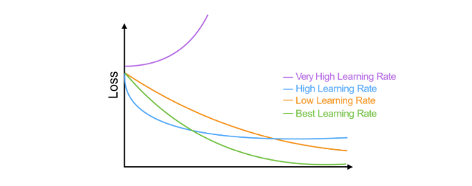


#### 4.3.3 Inizializzazione dei pesi della rete

Per applicare il metodo di discesa del gradiente occorre partire da un valore iniziale della funzione loss, poiché quest'ultima deve essere calcolata su una rete neurale già definita con dei pesi assegnati. Si pone quindi il problema di inizializzare i pesi della rete. Intuitivamente, se vogliamo che i nodi di un layer si comportino in maniera diversa (e riconoscano feature diverse sugli input ricevuti) occorre scegliere dei pesi diversi. Vi sono due approcci: 

* Scegliere casualmente pesi in $[-1, 1]$ seguendo una distribuzione uniforme
* Scegliere casualmente secondo una distribuzione normale


#### 4.3.4 Stochastic gradient descent 

Il metodo *stochastic gradient descent* è una variante della discesa del gradiente in cui, ad ogni iterazione del metodo, si lavora su un piccolo campione di dati del training set selezionato in maniera casuale. Tale variante risulta più veloce del gradient descent originale quando il training set è troppo grande. 


#### 4.3.5 Calcolo del gradiente 

Una volta calcolata la funzione loss su un vettore di input, occorre calcolare il gradiente della funzione loss rispetto ai pesi della rete in quel determinato momento. Un algoritmo efficiente per il calcolo del gradiente è l'algoritmo di ***backpropagation***, che sfrutta il concetto di *grafo computazionale*. 


### 4.4 Backpropagation 

#### 4.4.1 Forward propagation

Il termine forward propagation (o forward pass) si riferisce al calcolo e all'archiviazione ordinata di variabili intermedie della rete neurale, dall'input layer all'output layer. 

Per semplicità assumiamo che l'input d'esempio sia $x \in \R^d$ e che vi sia un solo layer nascosto nella rete, che non includa alcun termine di bias. Sia $z$ una variabile intermedia: 
$$
z = W^{(1)} x
$$
Dove $W^{(1)} \in \R^{h \times d}$ è la matrice dei pesi dell'unico hidden layer. Diamo in input tale variabile $z$ alla funzione di attivazione $\phi$ e otteniamo un vettore di attivazione $h$ di lunghezza $h$: 
$$
h = \phi(z)
$$
Anche la variabile $h$ è una variabile intermedia. Assumendo che l'output layer possegga una matrice di pesi $W^{(2)} \in \R^{q \times h}$, otteniamo il risultato dell'output layer e poniamolo in una variabile temporanea $o$ di lunghezza $q$: 
$$
o = W^{(2)} h
$$
Assumendo che la funzione loss sia $l$ e che la classe dell'esempio $x$ sia $y$, possiamo calcolare la loss per la predizione di $x$ come segue: 
$$
L = l(o, y)
$$
Dalla definizione della regolarizzazione $L_2$, dato un parametro $\lambda$, il termine di regolarizzazione è
$$
s = \frac {\lambda} 2 \left( ||W^{(1)}||_F^2 + ||W^{(2)}||_F^2 \right)
$$
Dove la norma di Frobenius (o norma matriciale) è semplicemente la norma $L_2$ applicata dopo aver concatenato la matrice in un singolo vettore. Otteniamo quindi l'ultimo termine $J$, ovvero la loss regolarizzata: 
$$
J = L + s
$$
Ci riferiremo a $J$ con il nome di *objective function*. o *funzione loss regolarizzata* 

<div style="page-break-after: always;"></div>


### 4.4 Grafo computazionale

Un grafo computazionale è un grafo aciclico diretto (DAG) che permette di visualizzare il flusso di dati di una rete neurale. Ogni nodo può avere due forme: un nodo quadrato indica un valore (tensore di dimensione arbitraria), mentre un nodo circolare indica una operazione. La direzione indica che il nodo mittente è operando del nodo destinatario, o che il nodo destinatario è output del nodo mittente. Visualizziamo il grafo computazionale della rete neurale descritta dalla forward propagation: 


 ### 4.5 Chain rule 

La *regola della catena*, in inglese *chain rule*, è una regola di derivazione che permette di calcolare la derivata di una funzione composta da due funzioni derivabili. 

Supponiamo che le funzioni $y = f(u)$ ed $u = g(x$) siano entrambe differenziabili, la regola della catena enuncia che: 
$$
\frac {dz}{dx} = \frac{dz}{dy} \frac{dy}{dx}
$$
Nel caso più generale di funzioni multivariate, supponiamo che la funzione differenziabile $y$ abbia $u_1, \dots, u_m$ variabili, e che ogni funzione differenziabile $u_i$ abbia $x_1, ..., x_n$ variabili. La regola della catena enuncia che per calcolare la derivata parziale di $y$ rispetto ad $x_i$ è sufficiente calcolare: 
$$
\frac{dy}{dx_i} = \frac{dy}{du_1}\frac{du_1}{dx_1} + \dots + \frac{dy}{du_n}\frac{du_m}{dx_1}
$$
per $i = 1, 2, \dots, n$. 


### 4.6 Algoritmo di backpropagation

L'algoritmo di *backpropagation* è utilizzato nel calcolo del gradiente della funzione loss rispetto ai parametri (pesi) della rete neurale. In breve, il metodo percorre la rete neurale in verso opposto, dall'output layer all'input layer, e calcola il gradiente sfruttando la regola della catena.

L'algoritmo conserva le derivate parziali intermedie ad ogni iterazione e le ri-utilizza per calcolare altre derivate parziali andando indietro nel grafo computazionale. Ipotizziamo due funzioni $Y = f(x)$ e $Z = g(Y)$, in cui $X, Y, Z$ sono tensori di dimensione arbitraria. Utilizzando la regola della catena, possiamo calcolare la derivata di $Z$ rispetto ad $X$ come segue:   
$$
\frac {\partial Z}{\partial X} = \text{prod} \left( 
\frac {\partial Z}{\partial Y} \frac {\partial Y}{\partial X}
\right)
$$
Dove l'operatore *prod* generalizza la chain rule in base alla dimensione dei tensori. Riprendiamo l'esempio visto nella forward propagation di rete neurale ad un solo hidden layer, in cui $W^{(1)}$ è la matrice dei pesi dell'hidden layer, mentre $W^{(2)}$ è la matrice dei pesi dell'output layer. 

Sia $J$ la funzione costo regolarizzata, l'obiettivo della backpropagation è quello di calcolare i gradienti $\nabla_{W^{1}}J$ e $\nabla_{W^{2}}J$. Per ottenere ciò, calcoliamo a turno i gradienti rispetto ad ogni variabile intermedia utilizzando la chain rule. 

Partendo in ordine inverso, il primo step consiste nel calcolare il gradiente della funzione costo regolarizzata rispetto al termine di loss $L$ e rispetto al termine di regolarizzazione $s$. 
$$
J = L + s \Longrightarrow \frac {\partial J}{\partial L} = 1 
\text{  and  } \frac {\partial J}{\partial s} = 1
$$
Calcoliamo il gradiente della funzione loss regolarizzata $J$ rispetto al risultato dell'output layer $o$, seconda la regola della catena: 
$$
\frac {\partial J} {\partial o} = \text{ prod}\left(
\frac {\partial J} {\partial L} \frac {\partial L} {\partial o}
\right) = \frac {\partial L} {\partial o} \in \R^q
$$
Calcoliamo il gradiente del termine di regolarizzazione $s$ rispetto ad entrambe le matrici di parametri $W^{(1)}$ e $W^{(2)}$, ricordando di aver utilizzato la regolarizzazione $L_2$: 
$$
\frac{\partial s}{\partial W^{(1)}} = \lambda W^{(1)}
\text{ and }
\frac{\partial s}{\partial W^{(2)}} = \lambda W^{(2)}
$$
È possibile adesso calcolare il gradiente (in questo caso una matrice Jacobiana) della funzione loss regolarizzata $J$ rispetto ai parametri dell'output layer $W^{(2)}$ utilizzando la regola della catena: 
$$
\frac {\partial J} {\partial W^{(2)}} = 
\text{prod} \left( \frac{\partial J}{\partial o} \frac{\partial o}{\partial W^{(2)}} \right) +
\text{prod} \left( \frac{\partial J}{\partial s} \frac{\partial s}{\partial W^{(2)}} \right) =
\left( \frac{\partial J}{\partial o} h^T + \lambda W ^{(2)} \right) \in \R^{q \times h}
$$
Per ottenere il gradiente di $J$ rispetto ai parametri dell'hidden layer $W^{(1)}$ è necessario continuare la backpropagation dall'output layer all'hidden layer. Il gradiente della funzione loss regolarizzata $J$ rispetto all'output dell'hidden layer $h$ è dato da: 
$$
\frac {\partial J} {\partial h} = \text{prod}\left(
\frac{\partial J}{\partial o} \frac{\partial o}{\partial h}
\right) =  {W^{(2)}}^T \frac {\partial J} {\partial o} \in \R^h
$$
Dato che la funzione di attivazione $\phi$ viene applicata ad ogni elemento di $z$, calcolare il gradiente di $J$ rispetto a $z$ richiede l'utilizzo dell'operatore di moltiplicazione *element wise* denotata dal simbolo $\odot$: 
$$
\frac {\partial J} {\partial z} = \text{prod}\left(
\frac{\partial J}{\partial h} \frac{\partial h}{\partial z} 
\right) = \frac{\partial J}{\partial h} \odot \phi'(z)
$$
In conclusione, è possibile ottenere il gradiente (anche in questo caso una matrice Jacobiana) della funzione $J$ rispetto ai parametri dell'hidden layer $W^{(1)}$ utilizzando la regola della catena: 
$$
\frac {\partial J} {\partial W^{(1)}} = 
\text{prod} \left( \frac{\partial J}{\partial z} \frac{\partial z}{\partial W^{(1)}} \right) + 
\text{prod} \left( \frac{\partial J}{\partial s} \frac{\partial s}{\partial W^{(1)}} \right) = 
\left( \frac{\partial J}{\partial z} x^T + \lambda W^{(1)} \right) \in \R^{h \times d}
$$


### 4.7 Sommario

Ricapitolando, data una rete neurale $R$ ed un training set $T$: 

* Si assegna ad $R$ una matrice $W$ di pesi iniziali scelti casualmente. 
* Si addestra la rete neurale con la matrice attuale di pesi $W$ su $T$. 
* A partire dagli output prodotti dalla rete neurale su $T$ e dagli output noti per $T$, viene calcolata la loss media su $L$ (su tutti gli esempi del training set). 
* Usando l'algoritmo di backpropagation si calcola il gradiente $\nabla_{W}L$ di L rispetto a $W$. 
* Si effettua una iterazione del metodo di discesa del gradiente per aggiornare la matrice dei pesi. 
* Si iterano i passi da 2 a 5 sino a quando la loss media non decresce più significativamente oppure dopo un numero fissato di iterazioni (dette anche epoche). 


### 4.8 Monitoraggio di qualità 

Con i pesi ottenuti ad ogni iterazione del learning sul training set, si testa la rete neurale sul test set e si calcola la loss. L'obiettivo è quello di far diminuire ad ogni epoca il valore della funzione loss sia sul training set che sul test set. 


#### 4.8.1 Overfitting

Lo scopo finale del processo di training è minimizzare la loss media su nuovi input. Un problema abbastanza comune è quello di costruire un modello che funziona molto bene sul training set, ma non generalizzabile e funzionante su nuovi input, ovvero il famoso problema dell'overfitting. Le deep neural network sono particolarmente suscettibili all'overfitting, tuttavia esistono dei metodi di regolarizzazione che aiutano a ridurlo. 


#### 4.8.2 Aggiunta di penalità 

Il metodo di discesa del gradiente potrebbe convergere ad un minimo locale che non corrisponde al minimo assoluto della funzione di loss. Nella pratica si osserva che soluzioni in cui i pesi hanno valori assoluti piccoli producono modelli migliori e più generalizzabili rispetto a soluzioni con pesi grandi. È possibile forzare il metodo del gradiente a favorire soluzioni con peso piccolo aggiungendo un ***termine di penalità*** alla loss function $L_0$ usata dal modello: 
$$
L = L_0 + \alpha ||\bar{w}||^2
$$
Dove $\alpha$ è un iperparametro di tuning che serve a configurare l'importanza della regolarizzazione. Più alti sono i pesi e maggiore è la norma del vettore dei pesi, quindi maggiore è la penalità introdotta. Solitamente si considera la norma 2, ovvero: 
$$
||\bar{w}|| = \sqrt{\sum_{i=1}^n w_i}
$$

<div style="page-break-after: always;"></div>


### 4.9 Dropout

Nei capitoli precedenti si è vista la tecnica di bootstrapping utilizzata nella classificazione. Analogamente, viene utilizzata una tecnica che prende il nome di *dropout* nelle reti neurali. Lo scopo è quello di creare un consenso sui valori ottimali dei pesi, considerando il risultato ottenuto da diverse sottoreti neurali. Ad ogni epoca si seleziona in maniera random una frazione dei nod della rete, chiamata ***dropout rate***, e si rimuovono. Sulla rete neurale ridotta si effettua una iterazione del metodo di discesa del gradiente. Dal momento in cui la rete neurale completa contiene più nodi rispetto a quella utilizzata durante il training, alla fine del processo di allenamento i pesi ottenuti vengono ri-scalati, ovvero moltiplicati per il dropout rate. 


### 4.10 Early stopping

Nella pratica si osservano comportamenti diversi della funzione di loss sul training set e sul test set. Nel training set la funzione loss decresce durante l'addestramento. Nel test set potrebbe succedere che la funzione loss decresca sino a raggiungere un minimo e, dopo un certo numero di iterazioni, cresca (overfitting). Per evitare questo problema, si può fermare prematuramente il training non appena la loss smette di decrescere nel test set. 

Il rischio che si corre con l'early stopping è quello di produrre overfitting sul test set. Per evitare ciò si può costruire un validation set indipendente dai primi due. Si effettua l'early stopping osservando l'andamento dalla funzione loss sul training set e sul validation set. Si ferma il processo quando, mentre la loss sul training  set decresce, sul validation set comincia a crescere.  


### 4.11 Aumento del training set

L'accuratezza delle reti neurali è proporzionale alla quantità di dati nel training set. Training set più grandi producono meno overfitting. È possibile arricchire un training set aggiungendo dati artificiali ottenuti applicando trasformazioni ai dati reali o inserendo del rumore. Ad esempio, se la rete neurale è addestrata per classificare immagini (es. convolutional network), si potrebbe incrementare il training set ruotando le immagini o distorcendole con del rumore. 

<div style="page-break-after: always;"></div>


## 5. Tipologie di reti neurali

<div style="page-break-after: always;"></div> 
# Cenni di analisi testuale

## 1. Introduzione

L'analisi testuale è la più frequente analisi attuabile nel web e nei social media. Il testo può essere *strutturato*, ovvero analizzabile in maniera deterministica da calcolatori (es. XML, JSON, codice), o *non strutturato*, ovvero scritto da esseri umani utilizzano il linguaggio naturale. Nel primo caso abbiamo regole formalizzate per analizzare il testo, ad esempio attraverso le *espressioni regolari*. Nel secondo caso è necessario adottare tecniche di *Natural Language Processing* (NLP), che si occupano dell'interazione tra l'umano e il calcolatore attraverso il linguaggio naturale. Le tecniche di NLP sono utilizzate per vari scopi, come l'estrazione di informazioni utili dal testo, categorizzazione del testo, sentiment analysis. 


## 2. Natural language processing 

Il Natural language processing è un processo molto sofisticato e può comporsi di vari passaggi. In generale, gli step da portare al termine sono i seguenti: 

* Scomporre il testo nei suoi costituenti
* Identificare tali costituenti
* Calcolare statistiche sui tali
* Categorizzare le parole in base alle statistiche


### 2.1 Word tokenization

Per analizzare un testo bisogna dividerlo prima in una sequenza di *token*. Un token è una entità comparabile all'interno di un vocabolario di simboli o parole. Dopo aver eseguito la tokenization, è possibile calcolare alcune statistiche basilari, come contare le occorrenze della parola nel testo. 

Nel processo di Word Tokenization vi sono alcuni costrutti da comprendere: 

* Prefissi: caratteri iniziali (es. \$5.00, "$" è un prefisso) 
* Suffissi: caratteri finali (es. 22km, "km" è un suffisso)
* Infissi: caratteri centrali (es. so-called, "-" è un infisso)
* Eccezioni: particolari regole che permettono di dividere (o non dividere) espressioni in token. 

Un esempio di eccezione potrebbe essere la parola "N.Y." che indica "New York". I punti all'interno della parola devono essere considerati in un modo tale da non dividerla in due token differenti. Essendo questo un caso particolare di tokenizzazione, consiste in una eccezione.  

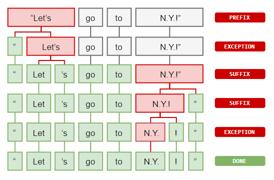


### 2.2 Stemming

La word tokenization permette di dividere il testo in token, ma più token possono essere diverse coniugazioni dello stesso verbo e quindi indicare lo stesso termine (es. Run, Running $\to$ run). Lo *stemming* è un processo naive che permette di raggruppare tali varianti in un solo *stem* (termine originale), rimuovendo la parte finale dalle parole. È necessario notare che l'utilizzo dello stemming riduce la *semantica* del testo.  Un stemmer famoso per la lingua inglese è lo **Stemmer di Porter**, che consiste in 4 step: 

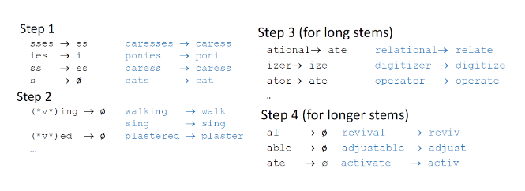

Gli stemmer possono essere inaccurati in alcuni casi, come nelle forme irregolari (ran $\rightarrow$ run). In certi casi, risulta conveniente adottare altri strumenti che vedremo in seguito.


### 2.3 Lemmatization

A differenza dello Stemming, il processo di *Lemmatization* consulta vocabolari dei linguaggi per attuare una analisi morfologica alle parole (es. associare *was* a *be*),  ed analizza il contesto per risolvere ambiguità nell'interpretazione. La raffinatezza dell'algoritmo paga in prestazioni, per cui la scelta dello stemming rimane comunque valida. 


### 2.4 Stop words

Alcuni termini come le congiunzioni, gli articoli, la punteggiatura, non hanno particolare impatto sull'analisi del linguaggio naturale. Tali termini prendono il nome di stop words: il loro contenuto informativo è oggettivamente basso, per cui una parte del processo di NLP prevede spesso la stop words removal, mantenendo solo termini realmente significativi.  


### 2.5 POS - Part of speech tagging 

Il linguaggio naturale è ambiguo: la semantica delle parole varia in base al contesto, contiene forme irregolari etc. Un processo nato allo scopo di interpretare ogni singolo termine all'interno di un testo è il Part-Of-Speech tagging (POS tagging). Ad ogni termine viene attribuito un tag, che segue uno [standard universale](https://universaldependencies.org/u/pos/) e può essere di due tipi: 

* Course-grained tag: un tag grossolano (es. verbo)
* Fine-grained tag: un tag specifico (es. aggettivo possessivo)


### 2.6 Named entity recognition

Il processo di **Named Entity Recognition** (NER) consiste nell’identificazione e nella classificazione di predefiniti tipi di entità all'interno del testo. Esempi classici di entità riconoscibili in un documento sono organizzazioni, persone, luoghi, etc. 


### 2.7 Sentence segmentation

Durante l'analisi di un testo può risultare utile dividere in frasi. Lo scopo potrebbe essere quello di conteggiare le parole per frase, o farne la media. Il processo prende il nome di *sentence segmentation* e non risulta particolarmente complesso. Gli ostacoli principali di quest'ultimo sono dati dalla punteggiatura: non basta dividere il testo attraverso le occorrenze di ".", ma bisogna talvolta contestualizzare (es. in 25.5% il punto non indica l'inizio di una nuova frase).


### 2.8 Pipeline generale nella NLP 

Riassumendo, il processo di NLP segue spesso la seguente pipeline: 

* Word tokenization
* Stop words removal
* Stemming / Lemmatization
* POS tagging (dipende dall'applicazione)
* NER tagging (dipende dall'applicazione)

Chiaramente alcuni step possono essere omessi, altri step potrebbero essere introdotti. 


## 3. Bag of words representation

La *bag of words* è un tipo di rappresentazione utilizzata nella Information Retrieval e nel NLP per rappresentare documenti testuali ignorando l'ordine delle parole. Permette di considerare la frequenza, o analogamente il conteggio, dei termini all'interno del testo. In tale senso, il documento è visualizzato come una *borsa di parole*. Le procedure principali per l'estrazione delle parole dal testo sono la *word tokenization* e molto spesso la *stop words removal*. 

Una volta applicati gli step sul training set composto da documenti da analizzare, i termini risultanti vengono inseriti all'interno di un grande vocabolario *V*, che avrà una certa cardinalità $n$. Sia $d = \{t \mid  t \in V\}$ un documento appartenente all'insieme dei documenti $D$. Definiamo una funzione conteggio: 
$$
c : D \times V \to \N
$$
dove $D$ indica l'insieme dei documenti. La funzione $c$ prende in input un documento $d \in D$ ed un termine $t \in V$ e restituisce il conteggio del termine all'interno del documento. Possiamo associare ad un documento $d$ un vettore $bow(d) = (c_1, \dots, c_n)$ di dimensione $n$ (analoga alla cardinalità del vocabolario), il cui $i$-esimo elemento è ottenuto come 
$$
c_i = c(d, t_i)
$$
Ed indica le occorrenze del termine $t_i$ nel documento $d$. La rappresentazione attraverso il vettore *bow* permette all'algoritmo di lavorare con una struttura di *lunghezza fissata*.


### 3.1 Normalizzazione ed nbow 

Due documenti potrebbero avere frequenze simili, ma una significativa differenza in quantità di parole. Osservando gli istogrammi sottostanti notiamo la similarità tra i documenti $D_1$ e $D_2$.  Tuttavia, i valori nelle ordinate risiedono su grandezze differenti. 


Per mitigare il problema si ricorre alla *normalizzazione*, ovvero si divide ogni elemento del vettore *bow* per la somma di tutti gli elementi del vettore *bow*. Chiameremo *nbow* (*normalized bag of words*) il nuovo vettore: 
$$
nbow(d)_i = \frac{bow(d)_i}{\sum_j bow(d)_j} 
$$
Faremo riferimento alla *frequenza* di un termine $t_i$ (term frequency) rispetto ad un documento $d$ indicando la frequenza normalizzata di tale termine: 
$$
ft(d, t_i) = nbow(d)_i
$$
Dato che il conteggio dei termini è sempre positivo (al più nullo), la normalizzazione effettuata sarà del tutto equivalente alla normalizzazione L1 (deviazione assoluta). Il risultato delle due normalizzazioni rende molto simili (se non identici) i due grafici. 


### 3.2 TF-IDF 

Se consideriamo il caso del rilevamento di posta spam, alcune parole come "Ciao", "Quando", "Buonasera" sono molto frequenti sia nelle mail di spam che nelle mail ordinarie. Parole come "Viagra", "Occasione", "Soldi" sono più comuni nelle email di spam, per cui dovrebbero avere un certo peso nella rilevazione. Tuttavia, con le tecniche adottate sin'ora, se in una mail di 100 parole vi è un'occorrenza della parola "Viagra", essa avrà comunque peso $\frac{1}{100}$. Intuitivamente, vorremmo attribuire a termini rari un peso maggiore rispetto a termini frequenti: entra in gioco la normalizzazione TF-IDF (*term frequency - inverse document frequency*). La TF-IDF tiene in considerazione il contenuto di *tutti i documenti* durante l'analisi del singolo documento. Consideriamo un insieme *D* composto da *n* documenti. Definiamo il numero di termini $m_i$ contenuti all'interno dell'i-esimo documento come segue: 

$$
m_i = \sum_j c(d_i, t_j)
$$
La frequenza di un termine (**term frequency**) all'interno di un documento è definita come segue: 
$$
tf(d_i, t_j) = \frac{c(d_i, t_j)}{m_i}
$$
Indicheremo con *p* una funzione *presenza* che indichi se un termine $t_j$ è contenuto all'interno del documento $d_i$: 
$$
p(d_i, t_j) =
\begin{cases}
  1 \space if \space c(d_i,t_j) > 0 \\
  0 \space otherwise
\end{cases}
$$
Indicheremo con C una funzione che indichi il numero di documenti che contiene il termine $t_i$: 
$$
C(t_i) = \sum_j p(d_j, t_i)
$$
Definiamo la **inverse document frequency** come: 
$$
idf(t_j) = log(\frac{n}{C(t_j)})
$$
 La i-esima componente del vettore **bow** sarà definita come segue: 
$$
bow(d_i)_j = tf(d_i, t_j) * idf(t_j)
$$
Analizziamo adesso il significato della inverse document frequency. Notiamo che: 
$$
idf(t_j) = log(\frac{n}{C(t_j)}) = - log(\frac{C(t_j)}{n})
$$
Il termine all'interno del logaritmo definisce la probabilità di trovare il termine j-esimo all'interno di un documento, calcolata attraverso un approccio frequentista. Possiamo indicare tale termine come $P(T =t_j)$, per cui: 
$$
idf(t_j) = - log(P(T= t_j))
$$
Che corrisponde esattamente al calcolo dell'informazione introdotta dal termine $t_j$. Più alta è l'informazione introdotta, più il peso del termine verrà aumentato. 


### 3.3 Bag of things

Anziché basarsi sui termini, un'altro tipo di rappresentazione può considerare stems o vari tags. Elenchiamo alcune rappresentazioni utili: Bag of stems, Bag of POS, Bag of NER, Bag of lemmas. Bag of n-grams. 


## 4. N-gram

Analizzare le singole parole è consono per alcuni task come la spam detection. Tuttavia, la struttura viene completamente andata persa, per cui è possibile che si creino delle ambiguità. Ad esempio: 

* Jonh aiuta Robert a cambiare la ruota della macchina;
* Robert aiuta Jonh a cambiare la ruota della macchina;

Le due frasi hanno un significato totalmente diverso, eppure hanno un bag of words identico. Per risolvere tali ambiguità. è possibile raggruppare per 2,3, ..., n parole anziché per una sola parola. Raccogliendo per una parola si parla di uni-gram, per due parole di bi-gram ed in generale per n parole di n-gram. Tanto è grande n, quanto si preserva il contesto e si riducono le ambiguità. Tuttavia, per n grandi il processo di machine learning potrebbe fornire scarsi risultati; inoltre servono più risorse computazionali.  
<div style="page-break-after: always;"></div> 
# Rappresentazione di immagini

## 1. Bag of patches 

Una immagine non è altro che una matrice di triple di valori. Gli algoritmi di machine learning necessitano di una funzione $f$ di rappresentazione per lavorare con le immagini
$$
f : I \to \R^n
$$
Dove $I$ è l'insieme di tutte le immagini. Lavorare considerando una immagine come una sequenza di pixel è molto difficile: un pixel preso singolarmente è poco significativo. Una soluzione consiste nel suddividere l'immagine in patch (porzioni di immagine). Una patch può raffigurare un oggetto o una parte di esso, per cui potrebbe assumere una certa semantica. In questo modo, è possibile considerare una immagine come una sacca di patch (bag of image patches). Una patch in una immagine è equivalente ad una parola in un documento nella rappresentazione bag of words. 


### 1.1 Campionamento delle patch

Per il testo si utilizza la tokenizzazione per estrarre le parole da un documento. Un possibile approccio per ottenere le patch da una immagine consiste nel considerarla come una griglia regolare. Questo approccio semplicistico richiede due parametri: la *patch size*, ovvero la grandezza delle patch, ed il *sampling step*, ovvero il numero di pixel di cui dobbiamo spostarci (a destra o in basso) per campionare una nuova patch. In base a tali parametri,  è possibile ottenere patch sovrapposte o non sovrapposte. Se $\frac{\text{patch size}}{2} > \text{sampling step}$ allora si avrà *sovrapposizione* (overlapping) delle patch, altrimenti *non saranno sovrapposte*.  

Una volta campionate ed estratte le patch, ognuna di esse rappresenterà qualcosa (es. un prato, il cielo, una casa, un volto, etc.). Una analisi statistica delle patch può rivelare qualcosa riguardo l'immagine. Ma come assegniamo una certa classe ad una patch? E come creiamo un vocabolario di patch? Il primo passo per rispondere a queste domande è quello di convertire ogni patch in un vettore $x \in \R^n$ utilizzando una funzione di rappresentazione adatta. 


### 1.2 Weighted histogram of edge orientation

Partiremo con una rappresentazione basilare per le patch, chiamata *weighted histogram of edge orientations*. Data un patch in input, il primo step consiste nel convertirla in scala di grigi attraverso una media dei tre canali RGB. Dopodiché si applicano attraverso convoluzione i filtri Sobel X e Sobel Y. Utilizzando i risultati di Sobel X e Sobel Y, che consistono in derivate parziali numeriche,  si calcola la magnitudo e l'orientamento dei contorni (*edges*). Si selezionano gli orientamenti principali
$$
[0°, 45°, 90°, 135°, 180°, 225°, 270°, 315°]
$$
e si calcola l'istogramma degli orientamenti degli edge dell'intera patch. Per ridurre il contributo degli edge deboli, esso viene pesato attraverso la magnitudo ed aggiunto nel bin. In un istogramma regolare, ogni qual volta si trova un edge con un orientamento compreso tra $0°$ e $45°$ si aggiunge 1 al bin corrispondente. In un istogramma pesato, si considera la magnitudo $m$ dell'edge e si somma al bin corrispondente. In qualsiasi caso, l'istogramma può essere normalizzato dividendo ogni bin per la somma di tutti i bin. 

Essendoci 8 orientamenti principali (quindi 8 bin), questa rappresentazione mappa ogni patch dell'immagine in un vettore di dimensione 8. Patch simili avranno istogrammi simili, viceversa per patch differenti. 


### 1.3 Sift descriptor

Il metodo precedente è limitato quando si presentano strutture complesse. Un metodo più elaborato, basato anch'esso sul weighted histogram of edge orientation, è il *SIFT descriptor*. La parola *descriptor* indica che l'algoritmo è utilizzato per descrivere le patch di una immagine. L'idea principale è semplice: 

* Si divide la patch in una griglia $4 \times 4$ 
* Per ogni cella della griglia si calcola l'istogramma pesato
* Tutti gli istogrammi sono concatenati in un vettore da $4 \times 4 \times 8 = 128$ elementi

Il descrittore SIFT permette di mappare una patch in un vettore di dimensione 128, molto più espressivo rispetto ad un singolo istogramma. 

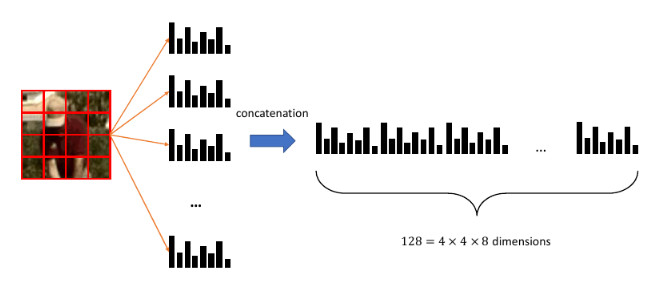


### 1.4 Definizione di un vocabolario

Allo scopo di fornire una rappresentazione di dimensione fissa, è necessario definire un vocabolario. Consideriamo un insieme di immagini e, per ognuna di esse, estraiamo le patch e calcoliamo i SIFT descriptor. Se assumiamo che patch simili hanno SIFT descriptor simili, allora possiamo utilizzare le tecniche di clustering per identificare un numero limitato di patch per comporre il vocabolario. Chiameremo *visual words* i centroidi di ogni cluster. Quando arriva una nuova patch, si utilizza il modello di clustering per assegnarla ad un cluster. 


### 1.5 Bag of visual words 

I paragrafi precedenti descrivono gli elementi principali della rappresentazione *bag of visual words* (analoga alla r. bag of words). Consideriamo un training set $TR$ di immagini, la procedura completa è la seguente: 

* Si estraggono le patch da ogni immagine in $TR$
* Ogni patch sarà descritta con un vettore di dimensione 128 calcolando il SIFT descriptor
* Si applica un algoritmo di clustering sulle patch e si ottengono $k$ cluster
* Ogni cluster ha un centroide, denominato visual word, che viene inserito nel vocabolario
  * Anche la visual word è rappresentata con un descrittore SIFT
  * Il numero di parole nel vocabolario equivale al numero di cluster 

Una volta costruito il vocabolario, è possibile ottenere la rappresentazione bag of visual words di una immagine come segue: 

* Si estraggono le patch dall'immagine
* Per ogni patch si calcola il descrittore SIFT 
* Si assegna ogni descrittore ad una visual word del vocabolario attraverso un classificatore kNN

Ad ogni immagine sono assegnati un certo numero di visual words appartenenti al vocabolario, per cui si può proseguire con tutte le tecniche viste nella rappresentazione bag of word (es. normalizzazione, TF-IDF). Questa tecnica funziona anche per immagini di diversa risoluzione. 


### 1.6 Content-Based Image Retrieval 

La Content-Based Image Retrieval (CBIR) è una interessante applicazione delle tecniche di rappresentazione delle immagini. Consiste nel cercare immagini simili ad una immagine query in un grande dataset di immagini. Disponendo di una buona funzione di rappresentazione, il task è banalmente risolvibile con una ricerca nearest neighbor. 

Per esempio, data una immagine query, si può calcolare la distanza delle rappresentazioni tra la query e le altre immagini nel dataset. Dopodiché si può ordinare il dataset in base alla distanza e prendere i primi $k$ risultati. Questo approccio è del tutto equivalente al kNN. <div style="page-break-after: always;"></div> 
# Sentiment Analysis 

## 1. Semantics in Text Analysis

Sinora le parole all'interno di un documento hanno avuto una funzione prettamente statistica, considerate come un mero simbolo privo di significato.  Questi approcci non tengono conto della semantica delle parole e delle relazioni tra esse, ad esempio: 

> \- All you need is love 
>
> \- I believe that the heart does go on  

La semantica delle due frasi suggerisce che esse sono simili, ma utilizzando una rappresentazione puramente statistica, come la bag of words, le frasi saranno quanto più distanti possibile. Per associare le due frasi abbiamo bisogno di una funzione distanza che misuri il grado di similarità semantica tra parole.  


### 1.1 Contesto di una parola 

Per misurare la distanza tra parole dobbiamo prima mapparle in uno spazio comune attraverso una funzione di rappresentazione $f$. Dopodiché possiamo misurare la loro distanza attraverso una funzione distanza $d$ (es. distanza Euclidea). La proprietà desiderata è che parole con una semantica simile devono trovarsi vicine. 

Consideriamo una parola in un documento, chiameremo *contesto* della parola quell'insieme di parole che appare in una finestra di una data dimensione centrata nella parola. 

> The quick brown fox jumps over the lazy dog 

Ipotizziamo che la parola sia *fox* e che la dimensione della finestra sia $w = 5$, allora il contesto di *fox* sarà:
$$
\{\text{quick, brown, jumps, over}\}
$$
Parole simili sono utilizzate in modi simili in frasi differenti, per cui parole simili avranno contesti simili. Chiameremo questo tipo di rappresentazione *word embeddings*. 


### 1.2 Matrice di co-occorrenza

Dato un corpus di documenti ed un vocabolario $V$, la matrice di *co-occorrenza* $X$ sarà tale che l'elemento $X_{i,j}$ conterà il numero di volte che la parola $j$ occorrà nel contesto della parola $i$. Definiremo 

Dato un corpus di documenti ed un vocabolario $V$, la matrice di co-occorrenza $X$ è tale che: 

* L'elemento $X_{i,j}$ indica il numero di volte in cui la parola $j$ occorre nel contesto della parola $i$. 
* L'elemento $X_i$ indica il numero di volte in cui ogni parola apparen nel contesto della parola $i$.
  * $X_i = \sum_{k} X_{i, k}$ 
* Definiamo $P_{i, j} = \frac{X_{i, j}} {X_i}$ la probabilità che $j$ appaia nel contesto di $i$. 


### 1.3 GloVe

*GloVe*, coniato da *Global Vectors*, è un modello per la rappresentazione distribuita di parole. Affronteremo tale algoritmo in maniera generale, esplorando l'idea principale senza scendere nel dettaglio. 

Sia $i$ una parola, vogliamo ricavarne l'*embedding*, ovvero una rappresentazione $w_i \in \R^d$ di dimensione fissa $d$. La coppia di parole $i, j$ è caratterizzata dalla probabilità $P_{i,j}$. Abbiamo assunto che parole simili hanno contesti simili, per cui due parole $i, j$ simili saranno tali che: 
$$
P_{i, k} \approx P_{j, k}, \forall k
$$
Imponendo che: 
$$
w_i^T w_j  = P_{i,j}
$$
Allora gli embeddings soddisferanno la proprietà desiderata: 
$$
P_{i,k} \approx P_{j,k} 
\Longrightarrow w_i^T w_k \approx w_j^T w_k 
\Longrightarrow w_i \approx w_j
$$
Nella pratica risulta più semplice imporre
$$
w_i^T w_j  = \log P_{i,j}
$$
Poiché
$$
P_{i,j} = \frac {X_{i,j}} {X_i} \Longrightarrow w_i^T w_j = \log \frac {X_{i,j}} {X_i} 
\Longrightarrow w_i^T w_j = \log {X_{i,j}} - \log {X_i}
$$
Dato che il termine $X_i$ non dipende dalla coppia di parole $(i, j)$ possiamo scartarlo ed imporre: 
$$
w_i^T w_j = \log {X_{i,j}}
$$
Il che garantirà comunque che parole simili avranno embedding simili. Per apprendere degli embedding funzionanti, definiamo una funzione costo $J$ da minimizzare: 
$$
J(W) = \sum_{i}^{|V|} \sum_{j}^{|V|} (w_i^T w_j - \log X_{i,j})^2
$$
Dove $W$ rappresenta la matrice la cui $i$-esima riga corrisponde all'embedding $w_i$ della $i$-esima parola. Minimizzare tale funzione $J$ vuol dire trovare degli embeddings in cui risulti pseudo-valida l'espressione $w_i^T w_j  = \log P_{i,j}$. Il logaritmo non può essere calcolato nel caso in cui $X_{i, j} = 0$, per cui si introduce una funzione $f$ definita come segue: 
$$
f(x) = \begin{cases}
(\frac{x}{x_{max}})^\alpha \text{ if }x < x_{max} \\
1 \text{ otherwise}
\end{cases}
$$
Dove generalmente $\alpha = \frac 3 4$ e $x_{max} = 100$. Ridefiniamo la funzione costo $J$
$$
J(W) = \sum_{i}^{|V|} \sum_{j}^{|V|} f(X_{i,j}) (w_i^T w_j - \log X_{i,j})^2
$$
Quando $X_{i,j} = 0$ l'espressione all'interno della sommatoria sarà nulla, altrimenti varrà al più 1. Per minimizzare la funzione $J$ si utilizza l'algoritmo di discesa del gradiente o il metodo dei minimi quadrati: 
$$
W^* = \text{arg}\min_W J(W)
$$


### 1.4 Geometria delle parole

Si è scoperto che le relazioni semantiche tra parole vengono riflesse geometricamente nello spazio di rappresentazione. Ad esempio, la distinzione tra le parole "re" e "regina" o "fratello" e "sorella" è della stessa natura della distinzione più generale tra "uomo" e "donna". Matematicamente, ci aspettiamo che i vettori  differenza tra le parole sopracitate (rappresentate come word embedding) siano pressoché uguali.


Tale proprietà consente di applicare la matematica dei vettori di parole. Se il vettore differenza $w = v(woman) - v(man)$ è uguale al vettore differenza $w' = v(queen) - v(king) = w$ allora, conoscendo solo il vettore $w$ e partendo dal vettore $v(king)$ è possibile calcolare il vettore della parola "queen" come segue: 
$$
v(queen) = v(king) + [v(woman) - v(man)]
$$


## 2. Sentiment analysis

Il sentiment analysis (o opinion mining) è lo studio computazionale dell'opinione, del sentimento e delle emozioni delle persone rispetto a prodotti, servizi, organizzazioni, individui, eventi o topic e i loro attributi (Liu, 2015). Dato un testo contenente delle opinioni, lo scopo di un algoritmo di sentiment analysis è quello di capire se l'emozione dell'autore è positiva o negativa, o in generale studiarne il sentimento. 


### 2.1 Primi approcci

Un primo approccio al sentiment analysis interpreta il problema come un task di classificazione, in cui il testo può essere positivo o negativo. In tal caso, vi sarà un dataset contenente esempi positivi e negativi. Si potrebbe utilizzare la rappresentazione bag of word per allenare un regressore logistico a tale scopo. 


### 2.2 Vader

Se alleniamo il regressore logistico su valutazioni cinematografiche, non è detto che lo stesso modello sia adatto ad analizzare testi provenienti da altri domini (es. i social media). L'algoritmo Vader superà tale difficoltà effettuando una analisi basata sui lessici di parole legate al sentimento (*lexicon of sentiment-related words*). Un lexicon può essere una parola, uno slang o un emoticon. Ogni lexicon è stato valutato da esseri umani con un numero da $-4$ (negativo) a 4 (positivo). Dopo aver raccolto tutte le valutazioni, è stato assegnato ad ogni lexicon uno score ottenuto attraverso una media. 

Lo scopo di Vader è quello di calcolare il punteggio del sentimento di una intera frase. Questo è fatto sommando il sentiment score di ogni lexicon contenuto nella frase:  
$$
z = \sum_{i} s(w_i)
$$
Dove $w_i$ è l'$i$-esima parola ed $s$ è la funzione che ne restituisce il sentiment score. Lo score $z$ è normalizzato utilizzando la seguente formula: 
$$
x = \frac {z}{\sqrt{z^2 + \alpha}}
$$
Dove $\alpha = 15$. Il grafico sottostante visualizza gli effetti della normalizzazione. All'aumentare del valore assoluto di $x$ il sentimento totale converge a -1 o ad 1.


#### 2.2.1 Punteggiatura 

Dopo aver calcolato il sentiment score dell'intera frase, l'algoritmo Vader controlla la punteggiatura. Questo controllo è motivato dall'euristica secondo il cui la punteggiatura aumenta l'espressività della frase e quindi il sentimento ad essa associato. Le regole sono le seguenti ed i valori sono risultati empirici: se il sentimento è positivo, Vader aggiunge $0.292$ per ogni punto esclamativo e $0.18$ per ogni punto interrogativo, se il sentimento è negativo li sottrae. 


#### 2.2.2 Capitalizzazione 

Similmente, scrivere in maiuscolo enfatizza il concetto nella frase, per cui per ogni parola capitalizzata Vader aggiunge $0.733$ se il sentimento è positivo, li sottra se è negativo.


#### 2.2.3 Modificatori di grado 

Modificatori del tipo "very" o "sort of" posso essere utilizzati per amplificare o diminuire il sentimento di una determinata parola. Vader contiene un dizionario di boosters e dampeners (stabilizzatori). Un modificatore posto di fianco ad una parola sottrae (se la parola è negativa) o aggiunge (se è positiva)  $0.293$ al sentiment score totale.  Un secondo modificatore aggiunge o sottrae il $95$% di $0.293$, un terzo aggiunge o sottrae il $90$% e così via. 


 #### 2.2.4 But 

Spesso un "ma" può cambiare la polarità della frase, ad esempio "ti amo, ma non voglio più stare con te" è una frase negativa anche se "ti amo" ha uno score prettamente positivo. Vader contiene un "but" checker che decrementa del 50% lo score della frase antecedente al "but" ed incrementa del 50% lo score della parte seguente. 


#### 2.2.5 Negazioni

Un insieme di espressioni può essere utilizzato per capovolgere il sentimento associato ad una parola, ad esempio "isn't really that great" cambia la polarità della parola "great". Vader controlla questi casi analizzando i trigrammi precedenti ad ogni parola. Quando il trigramma rientra nella lista delle possibili negazioni, il sentimento della parola è decrementato di $0.74$. 


#### 2.2.6 Output di Vader

Per ogni testo analizzato, Vader ritorna una lista di valori: 

* Positive: la percentuale di parole positive 
* Neutral: la percentuale di parole a cui non è associato un sentimento
* Negative: la percentuale di parole negative
* Compound: il sentiment score della frase

<div style="page-break-after: always;"></div> 
