# Reti neurali

## 1. Introduzione

### 1.1 Reti neurali biologiche

I neuroni sono le più importanti cellule del sistema nervoso. Le connessioni sinaptiche (o sinapsi) agiscono come porte di collegamento per il passaggio dell'informazione tra neuroni. I *dendriti* sono fibre minori che si ramificano a partire dal corpo cellulare del neurone (detto *soma*). Attraverso le sinapsi, i dendriti raccolgono input da neuroni afferenti e li propagano verso il soma. L'*assone* è la fibra principale che parte dal soma e si allontana da esso per portare ad altri neuroni (anche distanti) l'output. 

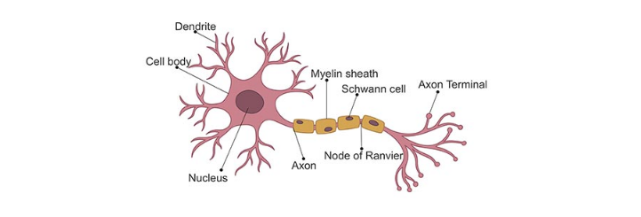

Il passaggio delle informazioni attraverso le sinapsi avviene con processi elettro-chimici: il neurone presinaptico libera delle sostanze, chiamate neurotrasmettitori, che attraversano il breve gap sinaptico e sono captati da appositi recettori, detti *canali ionici*, sulla membrana del neurone postsinaptico. L'ingresso di ioni attraverso i canali ionici determina la formazione di una differenza di potenziale tra il corpo del neurone postsinaptico e l'esterno. Quando questo potenziale supera una certa soglia, detta di *attivazione*, si produce uno *spike* o *impulso*: il neurone propaga un breve segnale elettrico detto *potenziale d'azione* lungo il proprio assone: questo potenziale determina il rilascio di neurotrasmettitori dalle sinapsi dell'assone. 

Il *reweighting* delle sinapsi, ovvero la modifica della loro efficacia di trasmissione, è direttamente collegato ai processi di *apprendimento* e *memoria* in accordo con la regola di Hebb.

> Hebbian Rule:  se due neuroni, tra loro connessi da una o più sinapsi, sono ripetutamente attivati simultaneamente allora le sinapsi che li connettono sono rinforzate.

Il cervello umano contiene circa 100 miliardi di neuroni, ciascuno dei quali connesso con circa altri 1000 neuroni ($\sim 10^{14}$ sinapsi). La corteccia celebrale (sede delle funzioni nobili del cervello umano) è uno strato laminare continuo di 2-4 mm, una sorta di lenzuolo che avvolge il nostro cervello formando numerose circonvoluzioni per acquisire maggiore superficie. Sebbene i neuroni siano disposti in modo ordinato in livelli consecutivi, l'intreccio di dendriti e assoni ricorda una foresta fitta ed impenetrabile. 

### 1.2 Reti neurali artificiali

Il primo modello di *neurone artificiale* fu progettato da McCulloch e Pitts: gli input e gli output erano binari ed erano in grado di eseguire delle computazioni logiche. 

Un neurone artificiale moderno prende in ingresso $n$ input $(x_1, ..., x_n)$, pesati rispettivamente con $n$ pesi $(w_1,...,  w_n)$ che rappresentano l'efficacia delle connessioni sinaptiche dei dendriti. Tali valori varieranno durante il processo di apprendimento. Esiste un ulteriore peso, detto *costante di bias*, che si considera collegato ad un input fittizio con valore costante 1, questo peso è utile per tarare il punto di lavoro ottimale del neurone.   

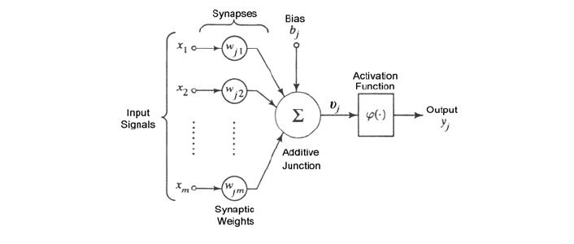

Il neurone somma i prodotti tra gli input ed i corrispettivi pesi (compresa la costante di bias) e produce un valore $z$. Dopodiché, sulla base di una funzione di attivazione $\phi$ a cui viene passato il valore $z$, produce un valore di output.  

#### 1.2.1 Layer 

Le reti neurali sono composte da gruppi di neuroni artificiali organizzati in livelli o *layer*. Tipicamente sono presenti un *layer di input*, un *layer di output*, ed uno o più layer intermedi o nascosti (*hidden*). Ogni layer contiene uno o più neuroni. 

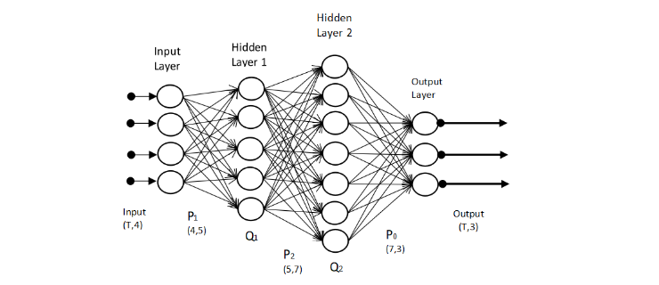

Il layer di input è costituito da un vettore di $n$ valori $\bar x = (x_1, ..., x_n)$. Gli hidden layer sono costituiti da uno o più nodi che prendono in input uno o più valori provenienti dal layer precedente. Ogni nodo dell'hidden layer produrrà un output che verrà passato ad uno o più nodi del layer successivo. Il layer di output è costituito da uno o più nodi che restituiscono in output un valore. Il termine **deep neural network** indica una rete formata da molti layer nascosti.

#### 1.2.2 Tensori

Nel contesto delle reti neurali, un tensore è un array $n$-dimensionale, ovvero una generalizzazione di un vettore o di una matrice.  Nel modello più generale di rete neurale sia l'input che l'output di un nodo della rete può essere un tensore. I nodi di un layer possono essere organizzati e disposti a formare una matrice (come nelle convolutional networks) o un tensore. Nel primo caso ritroviamo il tensore al livello dei dati, mentre nel secondo lo ritroviamo come disposizione dei nodi della rete. 

#### 1.2.3 Connessioni tra layer

Una rete neurale in cui ogni nodo di un certo layer riceve tutti gli output del layer precedente è detta ***densa***. In questo caso si parla di ***layer totalmente connessi***. Altre tipologie di connessioni tra layer sono possibili: 

* Connessione *random*: fissato $m$, ogni nodo riceve output solamente da $m$ nodi (generalmente casuali) del precedente layer. 
* Connessione *pooled*: i nodi di un layer sono partizionati in $k$ cluster. Il layer successivo, chiamato pooled layer, sarà formato da $k$ nodi, uno per ogni cluster. Il nodo associato al cluster $C_i$ riceverà tutti e soli gli output dei nodi del layer precedente appartenenti al cluster $C_i$. 
* Connessione *convolutional*: i nodi di ogni layer sono visti come se fossero disposti su una griglia. Il nodo di coordinate $(i,j)$ riceve tutti e soli gli input dei nodi del layer precedente che si trovano in una regione piccola della griglia intorno al punto $(i,j)$ (vediamo una immagine che rappresenti cosa si intende per convoluzione). 

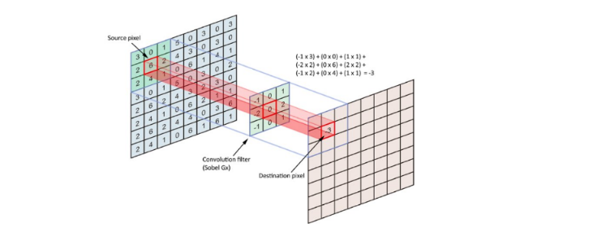

### 1.3 Explanable AI

La rete neurale si presenta come un modello *black-box*: un osservatore esterno vede l'output prodotto dal modello a partire da un input, ma il modello non è in grado di *giustificare* il risultato ottenuto, ovvero non è in grado di spiegare il procedimento logico per cui si arriva a produrre quel risultato. Il termine *Explnable AI* indica una serie di tecniche a supporto di modelli di intelligenza artificiale per far sì che un risultato prodotto da tali modelli possa essere compreso da un essere umano. Tali tecniche sono molto importanti in ambito medico, nella guida autonoma, nella computer vision, etc. 

### 1.4 Progettare una rete neurale

La costruzione di una rete neurale è fondamentale per ottenere un modello di machine learning in grado di classificare o predire accuratamente. Per prima cosa bisogna definire la struttura della rete: 

* Quanti hidden layer definire?
* Quanti nodi deve contenere ciascun layer?
* Come connettere i nodi di layer consecutivi?
* Quale funzione di attivazione scegliere per ogni nodo di ogni layer?

Una volta definita la struttura, il modello deve essere addestrato su un training set al fine di trovare i valori ottimali dei pesi degli input ricevuti da ogni nodo della rete neurale in ogni layer. Per fare ciò occorre definire una funzione di costo *globale* $F$, detta ***funzione loss***, e trovare i pesi che la minimizzino. Le due ulteriori domande da porsi sono: 

* Come deve essere organizzato il training set? Da quanti elementi?
* Quale funzione loss scegliere?

La progettazione di una rete neurale è per lo più uno studio empirico, fatto di tentativi. Le linee guida per la progettazione sono le seguenti: 

* Una rete neurale con meno layer richiede tempi di addestramento ed esecuzione minori. 
* Una rete neurale con più layer permette di risolvere problemi decisionali più complessi. 
* Troppi layer producono un modello troppo complesso con un concreto rischio di overfitting.
* Tre layer sono spesso buoni nella pratica. 
* Definire molti nodi in un hidden layer permette di identificare pattern più complessi nei dati. 
* Per prevenire l'overfitting è conveniente partire da un basso numero di nodi ed aumentarlo gradualmente, monitorando le performance del modello. 

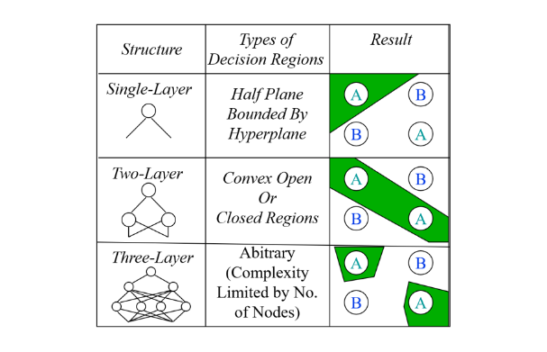

## 2. Funzioni di attivazione

### 2.1 Definizione formale

Sia $\bar x = (x_1, ..., x_n)$ il vettore dei valori ricevuti da un nodo, $\bar w = (w_1, ..., w_n)$ il vettore dei pesi e $b$ la costante di bias. La *funzione di attivazione* di un nodo $i$ è la funzione $F$ che determina la risposta $F(z)$ prodotta a partire da: 
$$
z = \bar w · \bar x + b
$$
Tutti i nodi di un layer hanno la *stessa* funzione di attivazione.  

### 2.2 Proprietà desiderate

La scelta della funzione di attivazione si lega al metodo scelto per ottimizzare i pesi della rete basato sulla minimizzazione della funzione loss. Il metodo di minimizzazione più popolare è quello della ***discesa del gradiente*** (*gradient descent*). Affinché il gradient descend lavori al meglio, la funzione di attivazione deve avere delle proprietà desiderate: 

* La funzione deve essere *continua e differenziabile* in ogni punto (o quasi). 
* La derivata della funzione non deve saturare, ovvero tendere a zero nel proprio dominio: questo potrebbe portare ad uno *stallo* nel processo di ricerca dei pesi ottimali. 
* La derivata della funzione non deve esplodere, ovvero tendere all'infinito nel proprio dominio: questo potrebbe portare *instabilità numerica* nel processo di ricerca dei pesi ottimali. 

### 2.3 Unit step function

La più semplice funzione di attivazione è la funzione step, chiamata anche *heaviside step* o *unit step function*. Il nodo che usa la funzione step restituisce valori binari e viene  per questo chiamato ***percettrone***. La funzione è definita come segue: 
$$
\text{step}(z) = \begin{cases}
1 \text{ if } z > 0 \\
0 \text{ otherwise }
\end{cases}
$$

La derivata della funzione unit step function $H(z)$ è notoriamente la funzione [*Delta di Dirac*](https://it.wikipedia.org/wiki/Delta_di_Dirac) $\delta(z)$. Quest'ultima satura a 0 per $z \ne 0$ ed esplode ad $\infty$ quando $z = 0$, per cui non rispetta $\frac 2 3$ delle proprietà desiderate e non è una buona scelta per una deep neural network. 

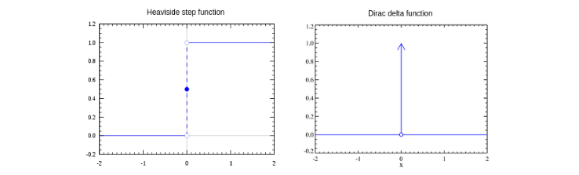

Può essere utilizzata per costruire un classificatore discriminativo binario o multi-classe. Il ***Perceptron*** è un esempio di classificatore binario, con un solo nodo nell'output layer che restituisce 1 se un oggetto è di una classe, 0 se è dell'altra. Per ottenere un classificatore discriminativo multi-classe occorre creare nell'output layer un percettrone per ogni classe da riconoscere. La rete neurale produrrà in output un vettore binario $\bar y = (y_1, ..., y_n)$ con un solo valore $y_i$ pari ad 1, che determinerà la classe finale, e tutti gli altri posti a 0. Uno o più hidden layer sono necessari per catturare pattern specifici di ciascuna classe al fine di guidare l'output layer ad identificare la classe corretta. 

### 2.4 Funzione logistica

La funzione logistica, affrontata nel capitolo sulla predizione, appartiene alla classe delle *funzioni sigmoidee*, aventi cioé una curva a forma di $S$. La definizione è la seguente: 
$$
\sigma(x) = \frac {1} {1 +  \exp(-x)} = \frac {\exp(x)} {1 + \exp(x)}
$$
La funzione assume valore $\frac 1 2$ per $x = 0$; quando $x \to + \infty$ la funzione $\sigma(x) \to 1$, mentre quando $x \to - \infty$ la funzione $\sigma(x) \to 0$.

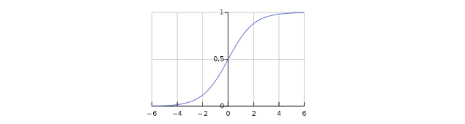

Dal grafico osserviamo la somiglianza con la funzione unit-step. La differenza chiave sta nell'approccio della funzione tendendo allo zero: l'andamento è graduale anziché diretto. Dato un vettore di valori $\bar x = (x_1, ..., x_n)$, la funzione logistica è applicata su ognuna delle componenti: 
$$
\sigma(\bar x) = (\sigma(x_1), ..., \sigma(x_n))
$$
Se indichiamo con $y = \sigma(x)$, allora la derivata della funzione logistica è: 
$$
\frac {dy} {dx} = y ( 1-y)
$$
Allontanandosi dal punto $x = 0$ in ambo le direzioni, la derivata tende a 0 e quindi la funzione tende a saturare (*prop*. 1). A differenza della unit-step function, la funzione logistica restituisce valori *tra* 0 ed 1 (*prop*. 2). Nel contesto della classificazione ciò implica che la funzione logistica può essere utilizzata nel layer di output per restituire la probabilità di appartenenza a ciascuna classe. 

### 2.5 Tangente iperbolica

Anche la tangente iperbolica appartiene alla classe delle funzioni sigmoidee ed è definita come: 
$$
\tanh(x) = \frac {\exp(x) - \exp(-x)} {\exp(x) + \exp(-x)}
$$
La tangente iperbolica risulta legata alla funzione logistica dalla seguente relazione: 
$$
\tanh(x) = 2\sigma(2x) - 1
$$
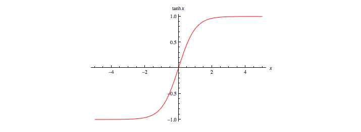

In altre parole, la tangente iperbolica è una versione scalata e traslata della funzione logistica. Essa ha valori compresi tra -1 ed 1 ed è simmetrica rispetto all'asse $y$. Gode delle stesse proprietà enunciate per la funzione logistica. 

 ### 2.6 Funzione softmax

A differenza delle funzioni sigmoidee, la funzione softmax non opera sulla singola componente del vettore, ma sull'intero vettore. Sia $\bar x = (x_1, ..., x_n)$ un vettore di valori, la funzione softmax è definita come $\mu(\bar x) = (\mu(x_1), ..., \mu(x_n))$ dove il generico $\mu(x_i)$ è calcolato come segue: 
$$
\mu(x_i) = \frac {exp(x_i)} {\sum_{j=1}^n exp(x_j)}
$$
La funzione ha valori in $[0, 1]$ come la funzione logistica. La somma dei valori calcolati su ogni componente del vettore è 1, dunque $\mu(\bar x)$ è una distribuzione di probabilità. Grazie all'esponenziale, le componenti del vettore con valori più alti ricevono valori molto più alti rispetto alle altre. In particolare se c'è una componente con un valore significativamente più alto rispetto a tutti gli altri, a questo componenti corrisponderà un valore vicino ad 1, mentre alle restanti un valore prossimo allo 0. La softmax ha problemi di saturazione, che possono essere aggirati utilizzando come funzione costo l'*entropia incrociata*. 

Il denominatore della funzione softmax coinvolge una somma di esponenziazioni. Quando i valori $x_i$ variano in un range molto ampio, le loro esponenziazioni $exp(x_i)$ finiscono per variare in un range esponenzialmente più ampio, che coinvolge valori molto piccoli e molto grandi. Sommare valori molto piccoli e molto grandi può portare a problemi di accuratezza nel calcolo svolto da una macchina. 

Osserviamo che per una qualsiasi costante $c$: 
$$
\mu(x_i) = \frac {exp(x_i)} {\sum_{j=1}^n exp(x_j)} = 
\frac {exp(x_i - c)} {\sum_{j=1}^n exp(x_j - c)}
$$
Se fissiamo $c = \max_j(x_j)$, allora ogni esponente avrà come potenza un valore $x_i - c \le 0$ e quindi le somme avranno addendi compresi nell'intervallo [0, 1], il che porta ad un calcolo più accurato. 

### 2.7 Rectified Linear Unit (ReLU)

La funzione ReLU prende spunto dai *raddrizzatori a singola semionda* (half-wave rectifiers) usati in elettronica per trasformare un segnale alternato in un segnale unidirezionale (sempre positivo o sempre negativo) facendo passare solo semionde positive.  È formalmente definita come segue: 
$$
\text{ReLU}(x) = \max(0, x) = \begin{cases}
x \text { if } x \ge 0 \\
0 \text { if } x < 0
\end{cases}
$$
Rappresentabile con il seguente grafico: 

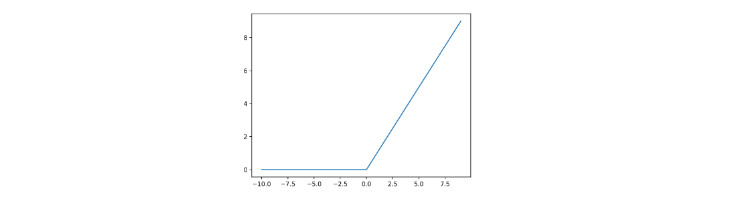

La funzione ReLU non satura mai per valori di $x$ positivi. Nella pratica, le reti neurali che utilizzano ReLU offrono uno speed-up significativo nella fase di training rispetto alle funzioni sigmoidee. Sia il calcolo della funzione che della sua derivata sono molto semplici e veloci da effettuare poiché non è richiesta l'esponenziazione. ReLU soffre di problemi di saturazione della sua derivata quando $x$ è negativo. 

### 2.8 Exponential Linear Unit (ELU)

Un miglioramento per ReLU che attenua il problema della saturazione per $x < 0$ consiste nel definire una variante chiamata ELU (Exponential Linear Unit), definita come segue: 
$$
\text{ELU}(x) = \begin{cases}
x \text { if } x \ge 0 \\
\alpha [\exp(x) - 1] \text { if } x < 0
\end{cases}
$$
Dove $\alpha \ge 0$ p un *iper-parametro* tenuto fisso durante il learning dei pesi. Il processo di learning viene ripetuto con diversi valori di $\alpha$ per trovare il valore che permette di ottenere performance migliori. 

## 3. Funzioni Loss

La *loss function*, o *funzione costo*, è quella funzione utilizzata nel processo di learning dei pesi del modello. Essa quantifica la differenza tra le predizioni di un modello e i valori corretti di output osservati nel training set, quindi l'errore medio di predizione tra valori predetti e valori reali. I *pesi ottimali* sono quelli che minimizzano la funzione loss. Distinguiamo due tipologie di funzioni loss in base al problema che affronta la rete neurale: 

* ***Regression loss*** nei problemi di regressione, da in output uno scalare o un vettore di valori reali
* ***Classification loss*** nei problemi di classificazione, da in output una distribuzione di probabilità, con valori che indicano la probabilità di appartenenza ad una classe. 

### 3.1 Regression loss

Sia $\bar x = (x_1, ..., x_n)$ l'input, $y$ l'output reale ed $\hat y$ il valore predetto dalla rete neurale. Le prime due regression loss function più comuni sono la ***squared error loss***: 
$$
L(\hat y, y) = (\hat y - y)^2
$$
e la ***Huber loss***: 
$$
L_{\delta}(\hat y, y) = \begin {cases}
(\hat y - y)^2 \text { if } |\hat y_i - y_i| \le \delta \\
2 \delta \times (|\bar y - y| - \frac 1 2 \delta) \text{ otherwise}
\end {cases}
$$
dove $\delta$ è una costante. La Huber loss è in parte definita come la squared error loss (per valori minori di $\delta$). Supponendo $\delta = 1$, osserviamo le due funzioni a confronto in funzione al valore ($\hat y - y$):

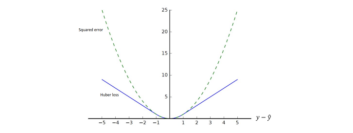

La Huber loss penalizza di meno le differenze tra i valori reali e quelli predetti, mentre la squared error loss tende all'infinito anche con errori relativamente piccoli. La variante Huber loss protegge il processo di learning nel caso di outlier, dove la squared error segnalerebbe un errore molto grande. 

#### 3.1.1 Mean Squared Error (MSE)

Le funzioni squared error ed Huber loss funzionano per un solo dato. Nel caso volessimo calcolare l'errore su un insieme di dati su cui è stata effettuata una predizione, dovremmo affidarci ad altri metodi. 

Sia $T = \{(x_1, y_1), ..., (x_n, y_n)\}$ il training set e $P = \{(x_1,\hat y_1), ..., (x_n,\hat y_n)\}$ l'insieme di coppie formate dai valori di input e dai rispettivi output predetti dalla rete. Definiamo il ***Mean Squared Error*** come la misura dell'errore quadratico medio: 
$$
\text{MSE}(P, T) = \frac 1 n \sum_{i=1}^n (\hat y_i - y_i)^2
$$
La radice quadrata del MSE è definita ***Root Mean Square Error*** (RMSE). Nella pratica è preferibile il MSE perché il calcolo della derivata (ai fini dell'utilizzo del gradient descent) è più semplice. A causa del termine al quadrato, il MSE è molto sensibile agli outliers. Pochi outlier possono incrementare di molto il valore MSE, compromettendo il learning. Per attenuare questo effetto, conviene calcolare l'errore medio utilizzando la ***Huber Loss***. 

#### 3.1.2 Regresson loss con vettori

Nel caso in cui l'output è un vettore di valori $\bar {\hat y} = (\hat y_1 , ..., \hat y_n)$ anziché uno scalare, si sostituisce nel calcolo della squared loss, della Huber loss e del MSE la norma della differenza tra i vettori reale e predetto al posto della differenza tra i valori scalari. 
$$
|\hat y  - y| \to || \bar { \hat {y}} - \bar y||
$$

### 3.2 Classification loss

Poniamoci in un generale problema di classificazione con $k$ classi $C_1, ..., C_k$. Supponiamo di avere un training set $T = \{(\bar x_1,  \bar p_1), ..., (\bar x_n,  \bar p_n) \}$ dove $\bar x$ è il vettore degli input e $\bar p = (p_1, ..., p_k)$ è una distribuzione di probabilità. La componente $p_i$ del vettore $\bar p$ indica la probabilità che $\bar x$ appartenga alla classe $C_i$. 

Supponiamo che la rete neurale sia progettata, ad esempio attraverso una softmax, per produrre in output una distribuzione di probabilità $\bar q = (q_1, ..., q_n)$, dove $q_i$ indica la probabilità predetta dal modello che $\bar x $ sia di classe $C_i$. Le funzioni di classification loss quantificano la ***distanza*** tra le distribuzioni di probabilità $\bar p$ e $\bar q$.  

#### 3.2.1 Entropia

Supponiamo di avere un alfabeto di $n$ simboli. Si vuole trasmettere un messaggio utilizzando questi simboli attraverso un canale di informazione. Sia $\bar p = (p_1, ..., p_n)$ una distribuzione di probabilità. Supponiamo che in ogni punto del messaggio la probabilità di osservare l'$i$-esimo simbolo sia $p_i$. 

Il ***teorema di Shannon*** afferma che, in un sistema di codifica ottimale, il numero medio di bit per simbolo necessari per codificare il messaggio è dato dall'entropia $H(\bar p)$: 
$$
H(\bar p) = - \sum_{i=1}^n p_i \log_2 p_i
$$
Il termine $- \log p_i$ indica il numero di bit necessari a rappresentare l'$i$-esimo simbolo usando lo schema di codifica ottimale. Qualunque altro schema utilizza in media più bit, dunque è sub-ottimale.  

#### 3.2.2 Entropia incrociata

Nella teoria dell'informazione, l'entropia incrociata (o cross-entropy) tra due distribuzioni di probabilità $p$ e $q$, relative allo stesso insieme di eventi, misura il numero *medio* di bit necessari ad identificare un evento estratto dall'insieme nel caso sia utilizzato uno schema alternativo $q$ anziché la vera distribuzione $p$.

Supponiamo di cambiare lo schema di codifica, usando una diversa distribuzione di probabilità $\bar q = (q_1, ..., q_n)$. Con questo nuovo schema occorrono $- \log q_i$ bit per rappresentare l'$i$-esimo simbolo. Quanti bit per simbolo occorrono in media se usiamo questo schema di codifica sub-ottimale? Dalla definizione di entropia incrociata possiamo calcolarlo come segue: 
$$
C(\bar p || \bar q) = - \sum_{i=1}^n p_i \log_2 q_i
$$

#### 3.2.3 Divergenza di Kullback-Leibler

In generale sappiamo che $C(\bar p || \bar q) > H(\bar p)$ poiché $\bar q$ è sub-ottimale, mentre $\bar p$ è ottimale. La differenza tra $C(\bar p || \bar q)$ e $H(\bar p)$, chiamata Divergenza di *Kullback-Leiber* (*KL*), misura il numero medio di bit in più che occorrono per ogni simbolo: 
$$
KL(\bar p || \bar q) = C(\bar p || \bar q) - H(\bar p) 
= \sum_{i=1}^n p_i \log_2 \frac {p_i}{q_i}
$$
Minimizzare la divergenza di $KL$ equivale a minimizzare l'entropia incrociata. Nella pratica si utilizza l'entropia incrociata come funzione loss. Essa è la più comune funzione di classification loss ed è spesso accoppiata (es. in TensorFlow) con la funzione di attivazione *softmax* in un'unica funzione numericamente più stabile, la cui derivata è semplice da calcolare. 

#### 3.2.4 Binary Cross-Entropy Loss

Come abbiamo già detto, la cross-entropy può essere utilizzata per definire una funzione loss. Poniamoci nel caso binario in cui le sole due classi di appartenenza sono $\{0, 1\}$. Sia $p_i$ la reale probabilità che  la $i$-esima tupla appartenga alla classe 1. Sia $q_i$ la probabilità stimata dall'algoritmo che la $i$-esima tupla appartenga alla classe 1. 

Utilizziamo una funzione di attivazione che dia in output delle probabilità, come la *softmax*. Data una tupla $x$, la softmax ci comunicherà che con probabilità $q_{y = 1} = \hat y$ la tupla apparterrà alla classe 1, mentre con probabilità $q_{y=0} = 1 - \hat y$ la tupla apparterrà alla classe 0.   

Avendo fissato le notazioni $p \in \{y, 1-y\}$ e $q \in \{\hat y, 1 - \hat y\}$ è possibile utilizzare la cross-entropy per misurare la dissimilarità tra $p$ e $q$: 
$$
C(p \mid \mid q) = - \sum_i p_i \times \log_2 (q_i) = -y\times \log\hat{y} - (1-y)\times\log(1-\hat{y})
$$
Utilizziamo la cross-entropy come loss function per una tupla ed ipotizziamo di voler calcolare la cross-entropy media per tutte le $n$ tuple del training set: 
$$
J(w) = \frac 1 n \sum_{i=1}^n \left[  
-y\times \log\hat{y} - (1-y)\times\log(1-\hat{y})
\right] = \\
- \frac 1 n \sum_{i=1}^n \left[  
y\times \log\hat{y} + (1-y)\times\log(1-\hat{y})
\right]
$$
Tale funzione loss è chiamata ***binary cross-entropy loss***. 

## 4. Training di una rete neurale 

Il processo di training consiste nel trovare i parametri della rete (pesi) che minimizzano l'average loss (quantificato mediante la funzione di loss scelta) su un training set di dati. L'obiettivo finale è costruire un modello che garantisca un loss medio basso su tutti i possibili input. Dato l'elevato numero di parametri di una rete neurale (specialmente se deep) il rischio di overfitting è alto. Concentriamoci inizialmente sulla minimizzazione della funzione di loss sul training set. 

### 4.1 Derivate parziali e gradiente 

È possibile estendere l'idea della derivata alle funzioni multivariate. Sia $y = f(x_1, x_2, \dots, x_n)$ una funzione ad $n$ variabili. La *derivata parziale* di $y$ rispetto alla componente $i$-esima è: 
$$
\frac{\partial y}{\partial x_i} = \lim_{h \to 0} \frac 
{f(x_1, \dots, x_{i-1}, x_i +h, x_{i+1}, \dots, x_n) - f(x_1, \dots, x_n)}
{h}
$$
Per calcolare la derivata parziale di $y$ rispetto alla componente $i$-esima è sufficiente trattare tutte le variabili meno che la $i$-esima come costanti e calcolare la derivata di $y$. Le seguenti notazioni sono equivalenti: 
$$
\frac{\partial y}{\partial x_i} = \frac{\partial f}{\partial x_i} = f_{x_i} = D_if = D_{x_i}f 
$$
Raggruppando le derivate parziali di una funzione multivariata rispetto ad ognuna delle sue componenti otteniamo il vettore gradiente della funzione. Supponiamo che l'input $\bar x$ della funzione $f: \R^n \to \R$ sia un vettore $n$-dimensionale $x = [x_1, \dots, x_n]^T$ e che l'output sia invece uno scalare. Il gradiente della funzione $f(x)$ rispetto ad $x$ è un vettore di $n$ derivate parziali:  
$$
\nabla_{\bar{x}} f(\bar x) = \left(  
\frac {\partial f(\bar{x})}{ \partial x_1},
\frac {\partial f(\bar{x})}{ \partial x_2},
...,
\frac {\partial f(\bar{x})}{ \partial x_n}
\right)
$$

Sia $x$ un vettore $n$-dimensionale, le seguenti regole sono spesso utilizzate nella differenziazione di funzioni multivariate: 

* $\forall A \in \R^{m \times n}, \nabla_{\bar{x}} A x = A^T$
* $\forall A \in \R^{n \times m}, \nabla_{\bar{x}} x^T A = A$
* $\forall A \in \R^{n \times n}, \nabla_{\bar{x}} x^T A x = (A + A^T) x$
* $\nabla_{\bar x} ||\bar{x}||^2 = \nabla_{\bar{x}} x^T x =  2x $

Similmente, per ogni matrice $X$, abbiamo che $\nabla_{X} ||X||_F^{2} = 2X$. 

### 4.2 Matrice jacobiana

Sia $\bar{x} = (x_1, ..., x_n)$ un vettore di $n$ valori reali. Sia $f:\R^n \to \R^m$ ed $\bar y = f(\bar{x})$. La matrice jacobiana di $\bar{y}$ rispetto ad $\bar{x}$ è la matrice formata dalle derivate parziali prima di ciascuna componente di $\bar{y}$ rispetto a ciascuna componente di $\bar{x}$: 
$$
Jf(\bar{x}) = J(\bar{y}) = 
	\begin{bmatrix} 
    	\frac {\partial y_1}{ \partial x_1} & \dots & \frac {\partial y_m}{ \partial x_1} \\
    	\vdots & \ddots & \\
    	\frac {\partial y_1}{ \partial x_n} & \dots & \frac {\partial y_m}{ \partial x_n} \\ 
    \end{bmatrix}
$$

### 4.3 Metodo di discesa del gradiente

Il *metodo di discesa del gradiente* (*gradient descent*) è una tecnica atta ad individuare i punti di minimo (o di massimo) di una funzione di più variabili. Nel contesto delle reti neurali la funzione da minimizzare è la funzione loss calcolata sui parametri correnti del modello. 

Partendo da un valore iniziale assunto dai parametri della funzione, il metodo iterativamente cerca la direzione di massima discesa del valore della funzione e aggiorna i valori dei parametri seguendo tale direzione. La direzione di *massima discesa* è quella opposta al gradiente (o alla matrice jacobiana nel caso in cui il codominio della funzione è multidimensionale). 

#### 4.3.1 Schema del metodo

Sia $f: \R^n \to \R$ la funzione loss da minimizzare. Indichiamo con $W_t$ la matrice di parametri della rete neurale calcolato dall'algoritmo all'iterazione $t$. La procedura generale dell'algoritmo di discesa del gradiente è la seguente: 

*  Per $t = 0$ inizializzare la matrice dei pesi $W_0$ con valori casuali. 
* Calcolare la funzione loss con i parametri $W_t$ ed il gradiente $\nabla_{W_t} f$. 
* Aggiornare la matrice dei pesi $W_{t+1} = W_t - \eta \nabla_{W_t}f$
* Passare alla iterazione successiva $t = t + 1$ e ripartire dal secondo step. 

Il metodo viene iterato sino a quando i valori del vettore non cambiano in maniera significativa. Analogo metodo per la matrice Jacobiana. Essendo basato su una scelta greedy, non garantisce l'individuazione di minimi assoluti, *per cui può convergere ad un minimo locale*. Il vettore $\bar{x}$ ottenuto dopo la convergenza dell'algoritmo contiene i parametri della rete che minimizzano la funzione loss. 

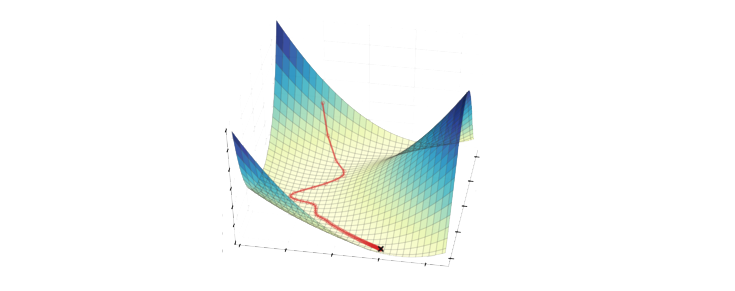

#### 4.3.2 Learning rate

Il parametro $\eta$ (eta) è detto *learning rate* e determina la velocità con cui si desidera che il metodo converga al valore ottimale. Valori troppo bassi implicano che la convergenza richieda molte iterazioni. Dall'altra parte, valori molto alti possono causare grandi oscillazioni nei valori dei parametri della rete, impedendo di arrivare a convergenza. Un metodo per trovare il learning rate ottimale consiste nel partire da un valore alto di $\eta$ e ad ogni passo moltiplicare $\eta$ per un fattore $\beta$ (con $0 < \beta < 1$) fino ad ottenere un valore di $\eta$ che porti a convergenza. 

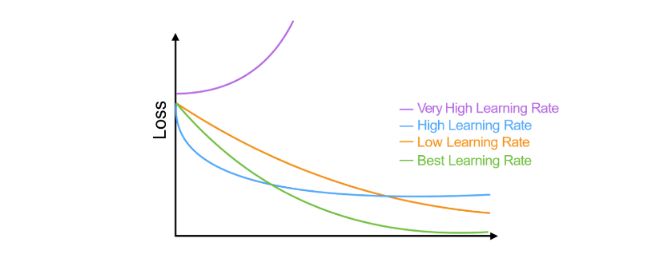

#### 4.3.3 Inizializzazione dei pesi della rete

Per applicare il metodo di discesa del gradiente occorre partire da un valore iniziale della funzione loss, poiché quest'ultima deve essere calcolata su una rete neurale già definita con dei pesi assegnati. Si pone quindi il problema di inizializzare i pesi della rete. Intuitivamente, se vogliamo che i nodi di un layer si comportino in maniera diversa (e riconoscano feature diverse sugli input ricevuti) occorre scegliere dei pesi diversi. Vi sono due approcci: 

* Scegliere casualmente pesi in $[-1, 1]$ seguendo una distribuzione uniforme
* Scegliere casualmente secondo una distribuzione normale

#### 4.3.4 Stochastic gradient descent 

Il metodo *stochastic gradient descent* è una variante della discesa del gradiente in cui, ad ogni iterazione del metodo, si lavora su un piccolo campione di dati del training set selezionato in maniera casuale. Tale variante risulta più veloce del gradient descent originale quando il training set è troppo grande. 

#### 4.3.5 Calcolo del gradiente 

Una volta calcolata la funzione loss su un vettore di input, occorre calcolare il gradiente della funzione loss rispetto ai pesi della rete in quel determinato momento. Un algoritmo efficiente per il calcolo del gradiente è l'algoritmo di ***backpropagation***, che sfrutta il concetto di *grafo computazionale*. 

### 4.4 Backpropagation 

#### 4.4.1 Forward propagation

Il termine forward propagation (o forward pass) si riferisce al calcolo e all'archiviazione ordinata di variabili intermedie della rete neurale, dall'input layer all'output layer. 

Per semplicità assumiamo che l'input d'esempio sia $x \in \R^d$ e che vi sia un solo layer nascosto nella rete, che non includa alcun termine di bias. Sia $z$ una variabile intermedia: 
$$
z = W^{(1)} x
$$
Dove $W^{(1)} \in \R^{h \times d}$ è la matrice dei pesi dell'unico hidden layer. Diamo in input tale variabile $z$ alla funzione di attivazione $\phi$ e otteniamo un vettore di attivazione $h$ di lunghezza $h$: 
$$
h = \phi(z)
$$
Anche la variabile $h$ è una variabile intermedia. Assumendo che l'output layer possegga una matrice di pesi $W^{(2)} \in \R^{q \times h}$, otteniamo il risultato dell'output layer e poniamolo in una variabile temporanea $o$ di lunghezza $q$: 
$$
o = W^{(2)} h
$$
Assumendo che la funzione loss sia $l$ e che la classe dell'esempio $x$ sia $y$, possiamo calcolare la loss per la predizione di $x$ come segue: 
$$
L = l(o, y)
$$
Dalla definizione della regolarizzazione $L_2$, dato un parametro $\lambda$, il termine di regolarizzazione è
$$
s = \frac {\lambda} 2 \left( ||W^{(1)}||_F^2 + ||W^{(2)}||_F^2 \right)
$$
Dove la norma di Frobenius (o norma matriciale) è semplicemente la norma $L_2$ applicata dopo aver concatenato la matrice in un singolo vettore. Otteniamo quindi l'ultimo termine $J$, ovvero la loss regolarizzata: 
$$
J = L + s
$$
Ci riferiremo a $J$ con il nome di *objective function*. o *funzione loss regolarizzata* 

### 4.4 Grafo computazionale

Un grafo computazionale è un grafo aciclico diretto (DAG) che permette di visualizzare il flusso di dati di una rete neurale. Ogni nodo può avere due forme: un nodo quadrato indica un valore (tensore di dimensione arbitraria), mentre un nodo circolare indica una operazione. La direzione indica che il nodo mittente è operando del nodo destinatario, o che il nodo destinatario è output del nodo mittente. Visualizziamo il grafo computazionale della rete neurale descritta dalla forward propagation: 

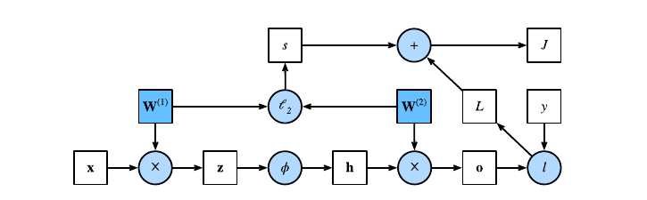

 ### 4.5 Chain rule 

La *regola della catena*, in inglese *chain rule*, è una regola di derivazione che permette di calcolare la derivata di una funzione composta da due funzioni derivabili. 

Supponiamo che le funzioni $y = f(u)$ ed $u = g(x$) siano entrambe differenziabili, la regola della catena enuncia che: 
$$
\frac {dz}{dx} = \frac{dz}{dy} \frac{dy}{dx}
$$
Nel caso più generale di funzioni multivariate, supponiamo che la funzione differenziabile $y$ abbia $u_1, \dots, u_m$ variabili, e che ogni funzione differenziabile $u_i$ abbia $x_1, ..., x_n$ variabili. La regola della catena enuncia che per calcolare la derivata parziale di $y$ rispetto ad $x_i$ è sufficiente calcolare: 
$$
\frac{dy}{dx_i} = \frac{dy}{du_1}\frac{du_1}{dx_1} + \dots + \frac{dy}{du_n}\frac{du_m}{dx_1}
$$
per $i = 1, 2, \dots, n$. 

### 4.6 Algoritmo di backpropagation

L'algoritmo di *backpropagation* è utilizzato nel calcolo del gradiente della funzione loss rispetto ai parametri (pesi) della rete neurale. In breve, il metodo percorre la rete neurale in verso opposto, dall'output layer all'input layer, e calcola il gradiente sfruttando la regola della catena.

L'algoritmo conserva le derivate parziali intermedie ad ogni iterazione e le ri-utilizza per calcolare altre derivate parziali andando indietro nel grafo computazionale. Ipotizziamo due funzioni $Y = f(x)$ e $Z = g(Y)$, in cui $X, Y, Z$ sono tensori di dimensione arbitraria. Utilizzando la regola della catena, possiamo calcolare la derivata di $Z$ rispetto ad $X$ come segue:   
$$
\frac {\partial Z}{\partial X} = \text{prod} \left( 
\frac {\partial Z}{\partial Y} \frac {\partial Y}{\partial X}
\right)
$$
Dove l'operatore *prod* generalizza la chain rule in base alla dimensione dei tensori. Riprendiamo l'esempio visto nella forward propagation di rete neurale ad un solo hidden layer, in cui $W^{(1)}$ è la matrice dei pesi dell'hidden layer, mentre $W^{(2)}$ è la matrice dei pesi dell'output layer. 

Sia $J$ la funzione costo regolarizzata, l'obiettivo della backpropagation è quello di calcolare i gradienti $\nabla_{W^{1}}J$ e $\nabla_{W^{2}}J$. Per ottenere ciò, calcoliamo a turno i gradienti rispetto ad ogni variabile intermedia utilizzando la chain rule. 

Partendo in ordine inverso, il primo step consiste nel calcolare il gradiente della funzione costo regolarizzata rispetto al termine di loss $L$ e rispetto al termine di regolarizzazione $s$. 
$$
J = L + s \Longrightarrow \frac {\partial J}{\partial L} = 1 
\text{  and  } \frac {\partial J}{\partial s} = 1
$$
Calcoliamo il gradiente della funzione loss regolarizzata $J$ rispetto al risultato dell'output layer $o$, seconda la regola della catena: 
$$
\frac {\partial J} {\partial o} = \text{ prod}\left(
\frac {\partial J} {\partial L} \frac {\partial L} {\partial o}
\right) = \frac {\partial L} {\partial o} \in \R^q
$$
Calcoliamo il gradiente del termine di regolarizzazione $s$ rispetto ad entrambe le matrici di parametri $W^{(1)}$ e $W^{(2)}$, ricordando di aver utilizzato la regolarizzazione $L_2$: 
$$
\frac{\partial s}{\partial W^{(1)}} = \lambda W^{(1)}
\text{ and }
\frac{\partial s}{\partial W^{(2)}} = \lambda W^{(2)}
$$
È possibile adesso calcolare il gradiente (in questo caso una matrice Jacobiana) della funzione loss regolarizzata $J$ rispetto ai parametri dell'output layer $W^{(2)}$ utilizzando la regola della catena: 
$$
\frac {\partial J} {\partial W^{(2)}} = 
\text{prod} \left( \frac{\partial J}{\partial o} \frac{\partial o}{\partial W^{(2)}} \right) +
\text{prod} \left( \frac{\partial J}{\partial s} \frac{\partial s}{\partial W^{(2)}} \right) =
\left( \frac{\partial J}{\partial o} h^T + \lambda W ^{(2)} \right) \in \R^{q \times h}
$$
Per ottenere il gradiente di $J$ rispetto ai parametri dell'hidden layer $W^{(1)}$ è necessario continuare la backpropagation dall'output layer all'hidden layer. Il gradiente della funzione loss regolarizzata $J$ rispetto all'output dell'hidden layer $h$ è dato da: 
$$
\frac {\partial J} {\partial h} = \text{prod}\left(
\frac{\partial J}{\partial o} \frac{\partial o}{\partial h}
\right) =  {W^{(2)}}^T \frac {\partial J} {\partial o} \in \R^h
$$
Dato che la funzione di attivazione $\phi$ viene applicata ad ogni elemento di $z$, calcolare il gradiente di $J$ rispetto a $z$ richiede l'utilizzo dell'operatore di moltiplicazione *element wise* denotata dal simbolo $\odot$: 
$$
\frac {\partial J} {\partial z} = \text{prod}\left(
\frac{\partial J}{\partial h} \frac{\partial h}{\partial z} 
\right) = \frac{\partial J}{\partial h} \odot \phi'(z)
$$
In conclusione, è possibile ottenere il gradiente (anche in questo caso una matrice Jacobiana) della funzione $J$ rispetto ai parametri dell'hidden layer $W^{(1)}$ utilizzando la regola della catena: 
$$
\frac {\partial J} {\partial W^{(1)}} = 
\text{prod} \left( \frac{\partial J}{\partial z} \frac{\partial z}{\partial W^{(1)}} \right) + 
\text{prod} \left( \frac{\partial J}{\partial s} \frac{\partial s}{\partial W^{(1)}} \right) = 
\left( \frac{\partial J}{\partial z} x^T + \lambda W^{(1)} \right) \in \R^{h \times d}
$$

### 4.7 Sommario

Ricapitolando, data una rete neurale $R$ ed un training set $T$: 

* Si assegna ad $R$ una matrice $W$ di pesi iniziali scelti casualmente. 
* Si addestra la rete neurale con la matrice attuale di pesi $W$ su $T$. 
* A partire dagli output prodotti dalla rete neurale su $T$ e dagli output noti per $T$, viene calcolata la loss media su $L$ (su tutti gli esempi del training set). 
* Usando l'algoritmo di backpropagation si calcola il gradiente $\nabla_{W}L$ di L rispetto a $W$. 
* Si effettua una iterazione del metodo di discesa del gradiente per aggiornare la matrice dei pesi. 
* Si iterano i passi da 2 a 5 sino a quando la loss media non decresce più significativamente oppure dopo un numero fissato di iterazioni (dette anche epoche). 

### 4.8 Monitoraggio di qualità 

Con i pesi ottenuti ad ogni iterazione del learning sul training set, si testa la rete neurale sul test set e si calcola la loss. L'obiettivo è quello di far diminuire ad ogni epoca il valore della funzione loss sia sul training set che sul test set. 

#### 4.8.1 Overfitting

Lo scopo finale del processo di training è minimizzare la loss media su nuovi input. Un problema abbastanza comune è quello di costruire un modello che funziona molto bene sul training set, ma non generalizzabile e funzionante su nuovi input, ovvero il famoso problema dell'overfitting. Le deep neural network sono particolarmente suscettibili all'overfitting, tuttavia esistono dei metodi di regolarizzazione che aiutano a ridurlo. 

#### 4.8.2 Aggiunta di penalità 

Il metodo di discesa del gradiente potrebbe convergere ad un minimo locale che non corrisponde al minimo assoluto della funzione di loss. Nella pratica si osserva che soluzioni in cui i pesi hanno valori assoluti piccoli producono modelli migliori e più generalizzabili rispetto a soluzioni con pesi grandi. È possibile forzare il metodo del gradiente a favorire soluzioni con peso piccolo aggiungendo un ***termine di penalità*** alla loss function $L_0$ usata dal modello: 
$$
L = L_0 + \alpha ||\bar{w}||^2
$$
Dove $\alpha$ è un iperparametro di tuning che serve a configurare l'importanza della regolarizzazione. Più alti sono i pesi e maggiore è la norma del vettore dei pesi, quindi maggiore è la penalità introdotta. Solitamente si considera la norma 2, ovvero: 
$$
||\bar{w}|| = \sqrt{\sum_{i=1}^n w_i}
$$

### 4.9 Dropout

Nei capitoli precedenti si è vista la tecnica di bootstrapping utilizzata nella classificazione. Analogamente, viene utilizzata una tecnica che prende il nome di *dropout* nelle reti neurali. Lo scopo è quello di creare un consenso sui valori ottimali dei pesi, considerando il risultato ottenuto da diverse sottoreti neurali. Ad ogni epoca si seleziona in maniera random una frazione dei nod della rete, chiamata ***dropout rate***, e si rimuovono. Sulla rete neurale ridotta si effettua una iterazione del metodo di discesa del gradiente. Dal momento in cui la rete neurale completa contiene più nodi rispetto a quella utilizzata durante il training, alla fine del processo di allenamento i pesi ottenuti vengono ri-scalati, ovvero moltiplicati per il dropout rate. 

### 4.10 Early stopping

Nella pratica si osservano comportamenti diversi della funzione di loss sul training set e sul test set. Nel training set la funzione loss decresce durante l'addestramento. Nel test set potrebbe succedere che la funzione loss decresca sino a raggiungere un minimo e, dopo un certo numero di iterazioni, cresca (overfitting). Per evitare questo problema, si può fermare prematuramente il training non appena la loss smette di decrescere nel test set. 

Il rischio che si corre con l'early stopping è quello di produrre overfitting sul test set. Per evitare ciò si può costruire un validation set indipendente dai primi due. Si effettua l'early stopping osservando l'andamento dalla funzione loss sul training set e sul validation set. Si ferma il processo quando, mentre la loss sul training  set decresce, sul validation set comincia a crescere.  

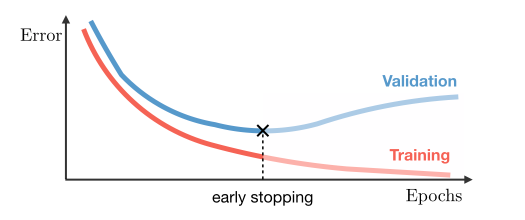

### 4.11 Aumento del training set

L'accuratezza delle reti neurali è proporzionale alla quantità di dati nel training set. Training set più grandi producono meno overfitting. È possibile arricchire un training set aggiungendo dati artificiali ottenuti applicando trasformazioni ai dati reali o inserendo del rumore. Ad esempio, se la rete neurale è addestrata per classificare immagini (es. convolutional network), si potrebbe incrementare il training set ruotando le immagini o distorcendole con del rumore. 

## 5. Tipologie di reti neurali

### 5.1 Feed-Forward Networks (FFNs)

Una **rete neurale feed-forward** ("rete neurale con flusso in avanti") o **rete feed-forward** è una rete neurale artificiale dove le connessioni tra le unità non formano cicli, differenziandosi  dalle reti neurali ricorrenti. Questo tipo di rete neurale fu la prima e più semplice tra quelle messe a punto. In questa rete neurale le  informazioni si muovono solo in una direzione, avanti, rispetto a nodi  d'ingresso, attraverso nodi nascosti (se esistenti) fino ai nodi  d'uscita. Nella rete non ci sono cicli. Le reti feed-forward non hanno  memoria di input avvenuti a tempi precedenti, per cui l'output è  determinato solamente dall'attuale input.

### 5.2 Convolutional Neural Networks (CNN)

Una *rete neurale convoluzionale* (**CNN** o **ConvNet** dall'inglese *convolutional neural network*) è un tipo di rete neurale artificiale feed-forward in cui il pattern di connettività tra i neuroni è ispirato  dall'organizzazione della corteccia visiva animale, i cui neuroni  individuali della retina (fotorecettori) sono disposti in layer. Hanno diverse applicazioni nel riconoscimento di immagini e video, nei sistemi di raccomandazione, nell'elaborazione del linguaggio naturale e, recentemente, in bioinformatica.

Una rete neurale convoluzionale contiene uno o più layer convoluzionali. I nodi all'interno di un layer convoluzionale condividono gli stessi pesi per gli input. Generalmente si alternano i layer convoluzionali a dei layer pooled (o a volte densi) con un numero di nodi progressivamente minore. 

Il primo layer coglie le informazioni che rappresentano i pixel essenziali delle immagini, ovvero i contorni. Lo schema di riconoscimento dei contorni è sempre lo stesso e non dipende dal punto in cui viene osservato un contorno (in analogia col fatto che in una CNN i nodi dello stesso layer condividono i pesi degli input). I successivi layer della retina combinano i risultati dei precedenti layer per riconoscere strutture via via più complesse (es. regioni dello stesso colore e infine volti e oggetti).

#### 5.2.1 Convolutional layer

Un layer convoluzionale è formato da una griglia di nodi. Ogni nodo può essere immaginato come un *filtro* di dimensione $f \times f$ applicato in un punto della griglia di nodi del layer precedente, ed $f$ è detta dimensione del filtro. Nell'ambito dell'image processing, questo equivale ad applicare un filtro $f \times f$ in un pixel di una immagine. Se il nodo della convolutional layer applica il filtro sul nodo $x_{i,j}$ della griglia di nodi del layer precedente, si considera il quadrato di dimensione $f \times f$ il cui vertice in alto a sinistra è $x_{i,j}$ e si calcola il valore di output come segue: 
$$
z_{i,j} = \sum_k^f\sum_l^f w_{k,l} \times x_{i+k, j+l}
$$
Se anziché considerare il vertice in alto a sinistra si considerasse il centro, la formula assumerebbe un'altra forma. Per calcolare l'output di tutti i nodi del layer convoluzionale bisogna scorrere il filtro (uguale per tutti i nodi) in lungo ed in largo sulla griglia del layer precedente ed applicarlo. Il risultato è una convoluzione del filtro sull'immagine prodotta dal layer precedente, da cui il nome. Lo *stride* di un filtro indica di quante posizioni si deve scorrere una volta applicato il filtro. Se $stride = 1$ allora l'immagine in output avrà la stessa dimensione dell'immagine in input, se $stride > 1$ allora sarà più piccola. 

