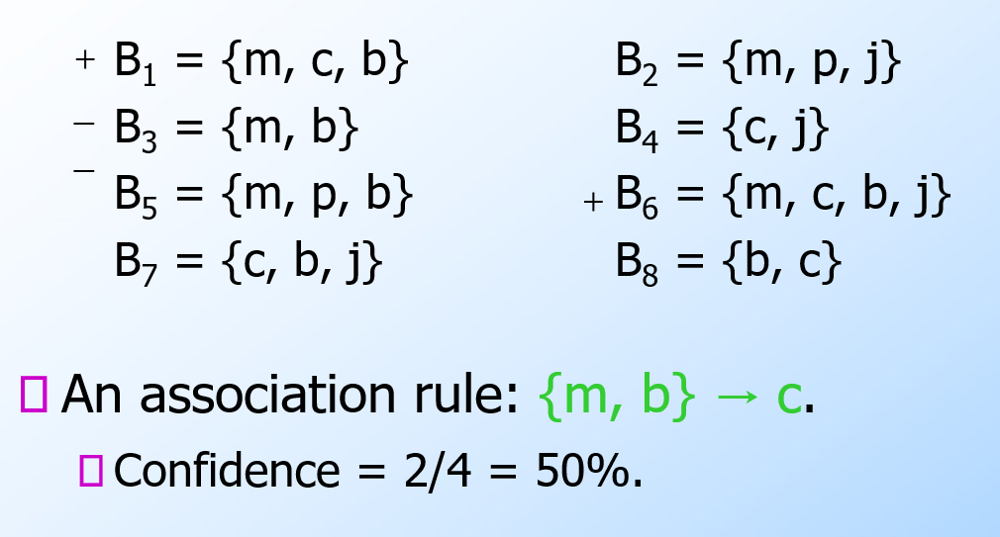
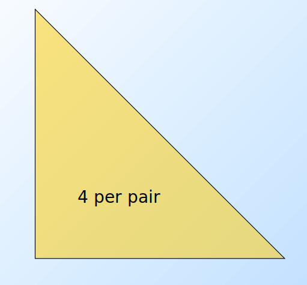
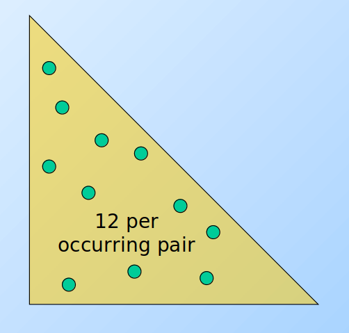
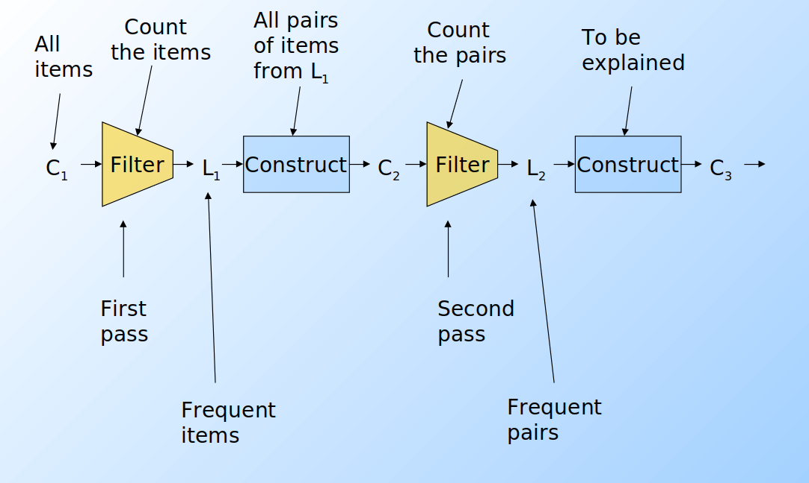

# Data mining

## 1. Introduzione

Il data mining consiste nell'estrazione di regolarità da grandi quantità di dati attraverso analisi, talvolta complesse, ed algoritmi efficienti e scalabili. Le informazioni cercate possono essere di vario genere: 

* Dipendenze tra dati
* Individuazione di classi (cluster)
* Descrizione delle classi (cluster)
* Individuazione di outliers / eccezioni 

Le aree applicative di tali studi sono generalmente l'analisi ed il supporto alle decisioni. Tuttavia, il target include anche text mining, analisi del web, intelligent query answering etc. 

## 2. Market Basket Analysis

Per introdurre il concetto di *regole associative*, presentiamo una applicazione paradigmatica di esse: il **Market Basket Analysis** (**MBA**).  Supponiamo di avere un insieme di oggetti (**items**) ed un insieme di carrelli (**baskets**) che correlano gli oggetti tra loro. L' MBA trova la correlazione tra gli oggetti studiando la relazione molti-a-molti con i carrelli. Tale tecnologia si concentra su eventi comuni anziché rari (outliers). 

Ipotizziamo di voler trovare l'insieme di oggetti che appare frequentemente all'interno dei carrelli. Sia *I* l'insieme di oggetti (***Itemset***), definiamo il ***supporto*** (Support) per *I* come il numero di carrelli contenenti tutti gli oggetti di *I*. A volte il supporto è espresso in percentuale (relativamente al numero di carrelli totali). Sia *s* la ***soglia*** o ***support threshold***, definiamo ***insiemi frequenti*** gli insiemi che appaino in almeno *s* carrelli. 

### 2.1 Applicazione 1 - Supermercato

Ipotizziamo che i prodotti di un supermercato siano gli oggetti e gli scontrini siano i carrelli, poiché mettono in relazione gli oggetti tra di loro. Una delle possibili applicazioni consiste nel trovare quali sono i prodotti acquistati insieme più frequentemente dai clienti. Una ricerca effettuata in America ha prodotto come risultato la correlazione tra pannolini e birra. Una volta estratta la correlazione, è possibile scontare il prezzo dei pannolini ed aumentare quello della birra (facendo attenzione al verso di acquisto, che in questo caso è pannolini > birra).  

### 2.2 Applicazione 2 - Plagiarism detection

Ipotizziamo che dei documenti testuali siano gli oggetti e che delle frasi siano i carrelli. Più documenti possono contenere la stessa frase, per cui connettono gli oggetti tra loro. È possibile notare come i carrelli **non debbano** necessariamente **contenere** gli oggetti, bensì correlarli in qualche modo tra loro. L'obiettivo della computazione potrebbe essere quello di scoprire dei plagi attravero documenti che compaiono spesso insieme, ovvero che formino un insieme frequente. 

 ### 2.3 Applicazione 3 - Web analysis

Ipotizziamo che delle parole siano gli oggetti e che le pagine web siano i carrelli, poichè esse contengono le parole e le mettono in relazione. Parole che appaiono frequentemente insieme nelle pagine web potrebbero indicare una interessante relazione.  

### 2.4 Words on the web 

Molte applicazioni del data mining sul web coinvolgono le parole, ad esempio per clusterizzare siti web per il contenuto, distinguere i blog utili dai blog inutili, determinare il sentimento di articoli o di commenti, partizionare pagine restituite da una query ambigua. 

Parole molto comuni vengono chiamate **stop words**. Esse raramente introducono una effettiva informazione e non aiutano a determinare il contenuto di un documento, vanno generalmente ignorate. Una metrica che ci aiuta a capire l'importanza di una parola è la **TF/IDF** (***Term Frequency over Inverse Document Frequency***). **TF** (*Term frequency*) è il numero di volte in cui la parola appare nei documenti, mentre **IDF** (*Inverse document frequency*) è il numero di documenti all'interno del cui appare. 

* Le coniugazioni appaiono in molti documenti e molto spesso, non introducono informazione utile. 
* Le parole informative (es. "Trading") appaiono in pochi documenti. Più volte appaiono in pochi documenti e più aiutano a determinare la natura di tali. 

## 3. Regole associative

Le regole associative sono regole del tipo *se-allora* (if-then) sul contenuto dei basket e sono della forma: 
$$
\{i_1, i_2, ..., i_k\} \rightarrow j
$$
ovvero: "Se il basket contiene gli oggetti $i_1, ..., i_k$ allora molto probabilmente conterrà anche $j$". Definiamo la **confidenza** (confidence) di una regola di associazione come la probabilità di $j$ dati $i_1, ..., i_k$.  

### 3.1 Trovare le regole di associazione

Supponiamo di voler trovare tutte le regole di associazione tali che abbiano un **supporto** maggiore di *s* ed una **confidenza** maggiore di *c*. Si noti che per supporto si intende il supporto dell'itemset alla sinistra della regola. La parte computazionalmente difficile ed onerosa sta nel trovare gli ***insiemi frequenti***. 

***Osservazione***: 
$$
\{i_1, ..., i_k\} \rightarrow \text {j has high support and high confidence} \Longrightarrow \{i_1, ..., i_k\}
\text{ and }
\{i_1, ..., i_k, j\} 
\text{ will be frequent}
$$

### 3.2 Problemi pratici

Tipicamente i file contenenti i dati sono memorizzati nel disco (es. flat files, database). Data la massiva cardinalità dei dati, il costo principale degli algoritmi è dato dal numero di letture da disco. 

## 4. Algoritmi di ricerca di coppie frequenti 

Analizzando un algoritmo di ricerca degli insiemi frequenti, scoviamo subito che il costo principale è quello di cercare tra tutte le **coppie**: con 10k elementi, le coppie sono circa 10k*2 elementi. Meno oneroso è il compito di cercare triple, quadruple etc. 

In generale: *la probabilità di essere insiemi frequenti diminuisce esponenzialmente all'aumentare della dimensione della tupla*. Il perché è dimostrabile in termini probabilistici. 
Vediamo adesso alcuni algoritmi che si occupano della ricerca di coppie frequenti. 

### 4.1 Naive algorithm 

Legge una sola volta l'intero file. Per ogni basket contenente n elementi, genera n(n-1)/2 paia e per ogni paio incrementa le sue occorrenze in una struttura apposita (es. matrice triangolare).  
Tale algoritmo fallisce se (#items)2 provoca un overflow in memoria primaria (gli item potrebbero essere dell'ordine dei miliardi). Supponiamo vi siano 105 elementi in memoria e quindi: 
$$
\frac{10^5 * (10^5-1)}{2} \simeq 5*10^9 \space pairs
$$
Saranno necessari circa 20 GB di memoria primaria. 
Vi sono 2 approcci tipici al conteggio delle occorrenze delle coppie: la matrice triangolare e la tabella di triple. 

#### 4.1.1 Matrice triangolare 

Tale approccio consiste nel contare tutte le coppie attraverso una matrice triangolare. Supponendo che la matrice sia composta da interi, essa richiede 4 byte per paio. Supponiamo che le coppie vengano così considerate: 
$$
(1,2), (1,3),..., (1,n) \space // n-1 \space pairs\\
(2,3), (2,4),..., (2,n) \space // n-2 \space pairs\\
(i-1, i), (i-1, i+1), ..., (i-1, n) \space //n -(i-1) \space pairs
$$
Dati gli indici i,j è possibile effettuare una linearizzazione delle posizioni, sfruttando un array monodimensionale di dimensione n(n-1)/2 anziché una matrice. Nello specifico: 
$$
(i,j) = k = (i-1)(n-\frac{i}{2}) + j -i
$$

 #### 4.1.2 Tabella di triple

Un altro approccio consiste nel contare solo le coppie effettivamente presenti nei basket, quindi tenere una tripla di valori (i, j, c) tale che la coppia {i,j} abbia *c* occorrenze, con c > 0. Ogni tripla richiede 12 bytes, ma non tutte le coppie sono presenti in memoria. Tale approccio risulta conveniente rispetto alla matrice solo se occorrono al più 1/3 delle coppie totali, a causa del triplo della memoria utilizzata per ogni coppia (12 byte rispetto ai 4 della matrice). Potrebbe ulteriore spazio per strutture che facilitano l'accesso alla tabella, come delle hash table. 

### 4.2 A-Priori Algorithm 

L'algoritmo a-priori è diviso in due passaggi principali e limita la necessità di memoria primaria. L'idea principale è quella della ***monotonicità*** (*monotonicity*): se un insieme S di item appare almeno k volte, allora anche tutti i sottoinsiemi di S appaiono almeno k volte. 

>  **Contropositivo per le coppie**: Se un item *i* non appare in almeno s basket, allora nessuna coppia contenente i potrà apparire in almeno s basket. 

**Passo 1**: Leggere tutti i basket e contare in memoria principale le occorrenze di ogni item. Questo passaggio richiede che la memoria sia almeno proporzionale al numero di item. Consideriamo ***item frequenti*** (*frequent items*) gli item che compaiono almeno *s* volte.

**Passo 2**: Leggere nuovamente i basket, ma contare in memoria principale solo le coppie formate dagli elementi frequenti trovati al passo 1. Tale passo richiede una memoria proporzionale al quadrato del numero di elementi frequenti, più una lista degli elementi frequenti. 

È possibile utilizzare una matrice triangolare che referenzia solo gli item frequenti (o utilizzare il metodo delle triple). La mappatura degli item frequenti nella matrice sarà diversa da quella originale, per questo è consigliato tenere una tabella che ricolleghi gli indici della matrice con quelli originali. 

Supponiamo di voler trovare tuple di item di ordine k maggiore al secondo. Per ogni k consideriamo **due insiemi**: 

* **Ck** = itemset di cardinalità k candidati ad essere frequenti, ovvero con un supporto > s, basandosi sulle informazioni degli itemset di cardinalità k-1. 
* **Lk** = itemset di cardinalità k effettivamente frequenti. 

A partire dall'insieme C1 di tutti gli item viene svolto il primo passo dell'algoritmo e prodotto l'insieme L1 degli item frequenti. Da quest'ultimo, viene costruito l'insieme delle coppie C~2~ ed un secondo filtraggio produce gli insiemi frequenti di cardinalità 2 L~2~. Lo stesso procedimento viene eseguito per k=3, 4, ... e si può dimostrare che all'aumentare di k, l'algoritmo tende ad andare a convergenza più velocemente (in maniera esponenziale).  

> Per dati tipici nel MBA e un supporto richiesto dell'1%, k=2 richiede la maggior parte della memoria. 

Osservazioni: 

* C~1~ rappresenta tutti gli elementi
* L~k~ è composto da membri di C~k~ il cui supporto è > s 
* C~k+1~ è composto da insiemi in cui esiste un sottoinsieme residente in L~k~

