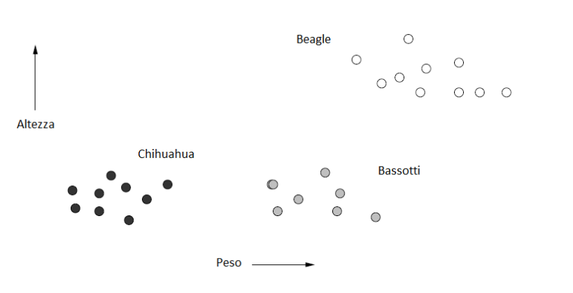
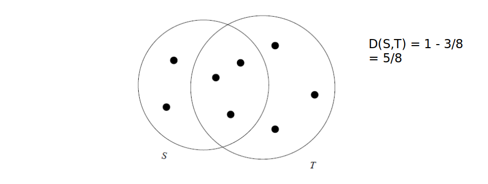
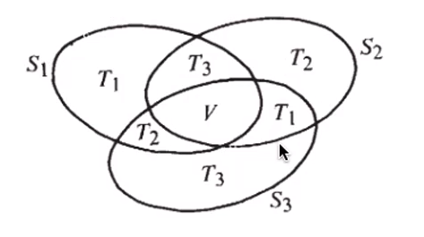
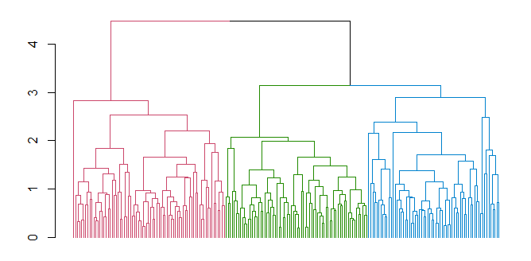
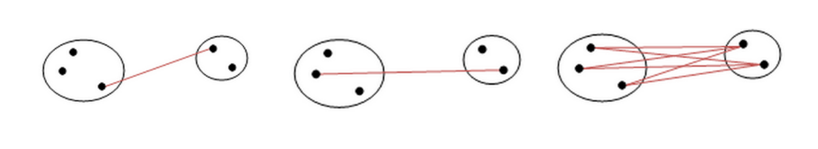
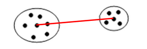
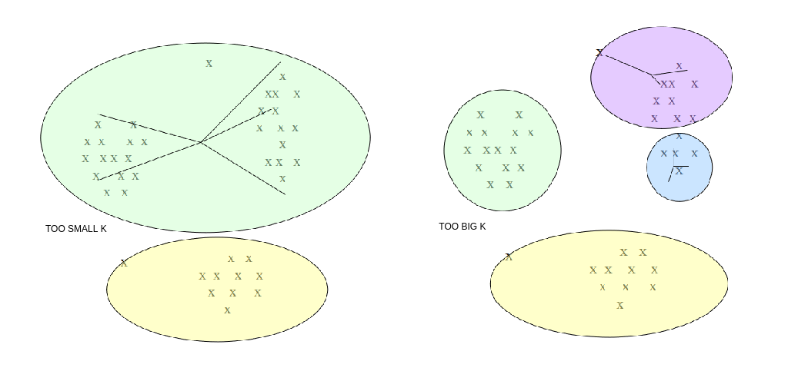
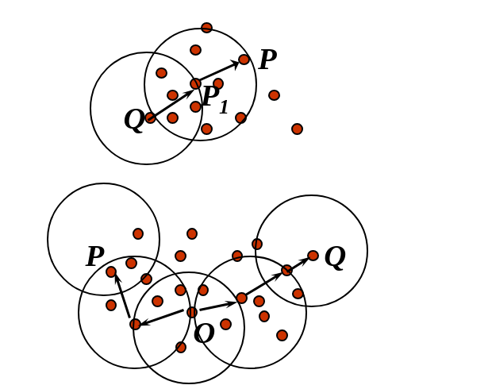
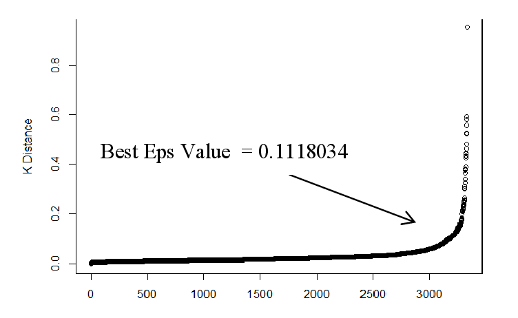
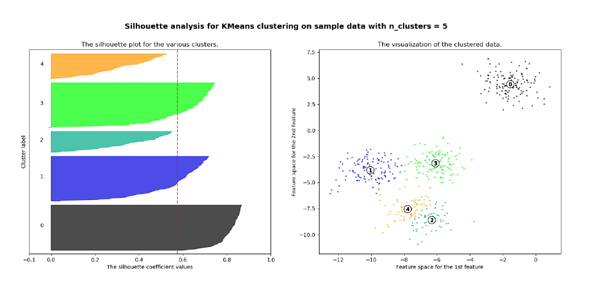

# Clustering

## 1. Introduzione 

Il **clustering** è un processo che consiste nel raggruppare un insieme di oggetti in gruppi detti **cluster**, sulla base di una nozione di *distanza* tra gli oggetti. L'obiettivo del clustering è quello di raggruppare nello stesso cluster oggetti "simili" tra loro (o con bassa distanza reciproca) e in cluster diversi oggetti "dissimili" tra loro (o ad elevata distanza). 


### 1.1 Unsupervised learning 

Il clustering è un processo di unsupervised learning (apprendimento non supervisionato): si vuole suddividere un insieme di dati in *n* classi (o cluster) senza alcuna conoscenza a-priori di quante e quali siano le classi e le loro etichette. 

Esistono invece dei task, come la classificazione o la predizione, che necessitano di un apprendimento supervisionato (supervised learning). Partendo da un training set essi allenano un modello in grado di classificare nuovi dati o predire valori. 


## 2. Spazi metrici e funzione distanza 

Gli oggetti da raggruppare rappresentano punti appartenenti ad uno **spazio metrico**, cioè uno spazio in cui è definita una **funzione distanza D**. La definizione di una funzione distanza è cruciale per effettuare il clustering. Una funzione D definita su una coppia di punti di uno spazio metrico S è una misura di distanza se soddisfa le seguenti proprietà: 

$\text {1) } D(X,Y) \ge 0 \space \forall X,Y \in S \space e \space D(X,Y) = 0 \Longleftrightarrow X=Y$
$\text{2) simmetria: } D(X,Y) = D(Y,X) \space \forall X,Y \in S$
$\text{3) prop. triangolare: }  D(X,Y) + D(Y,Z) \ge D(X,Z) \space \forall X,Y,Z \in S$

<div style="page-break-after: always;"></div>

### 2.1 Spazio euclideo 

L'esempio più comune di spazio metrico è lo **spazio euclideo** ad *n* dimensioni $\R^n$, in cui i punti dello spazio sono vettori di numeri reali. La quantità *n* rappresenta il numero di dimensioni dello spazio. Le componenti dei vettori sono comunemente chiamate **coordinate** dei corrispondenti punti. Nelle applicazioni reali, le coordinate rappresentano gli attributi (o "**features**") degli oggetti dello spazio metrico. Una proprietà caratteristica degli spazi euclidei è che la media di un insieme di punti nello spazio è sempre definita ed è un punto nello spazio, chiamato **centroide** o **centro geometrico**. Di seguito è riportato un esempio di oggetti (cani) classificati in uno spazio euclideo a 2 dimensioni, secondo 2 attributi: altezza e peso.




#### 2.1.1 Distanze nello spazio Euclideo

Nello spazio euclideo è possibile definire diverse misure di distanza valide (che rispettino le 3 proprietà). La funzione distanza più utilizzata è la **distanza euclidea**: Siano $x=(x_1,...,x_n)$ e $y=(y_1,...,y_n)$ due punti nello spazio $\R^n$, la *distanza euclidea* è così definita: 
$$
D(x,y)=\sqrt{\sum_{i=1}^{n}(x_i-y_i)^2}
$$


Esistono altri tipi di distanze, come la **distanza di Manhattan**
$$
D(x,y) = \sum_{i=1}^n |x_i -y_i|
$$
La **norma** $Lr$ è una generalizzazione della distanza euclidea dove sia la radice che l'esponente assumono un valore *r*, anziché 2: 
$$
D(x,y)=\sqrt[r]{\sum_{i=1}^{n}(x_i-y_i)^r}
$$
La **norma** $L_{\infty}$ prende la distanza massima tra le componenti delle n dimensioni: 
$$
D(x,y) = \max_{1\le i \le n}|x_i - y_i|
$$
La **distanza del coseno** misura la distanza dal punto di vista angolare: 
$$
D(x,y)=\arccos \frac{\sum_{i=1}^n x_i *y_i}{\sqrt{\sum_{i=1}^n x_i^2}\sqrt{\sum_{i=1}^n y_i^2}}
$$


### 2.2 Spazi non euclidei

In uno spazio non euclideo il concetto di centroide non è definito. Tuttavia, si può definire il concetto di **1-mediana** come un punto che minimizza la distanza media (o equivalentemente la somma) delle distanza degli altri punti dell'insieme. Esempi di spazi non euclidei sono spazi in cui gli oggetti sono insiemi o stringhe. 

Per alcuni spazi non euclidei (come le versioni discrete degli spazi euclidei, o spazi formati da vettori di interi) è possibile utilizzare le distanze euclidee già viste. Nel caso più generale occorre definire metriche alternative. 

Es. con insiemi, **distanza di Jaccard**: Dati due insiemi T ed S, la distanza è definita come il complementare del rapporto tra la cardinalità dell'intersezione e la cardinalità dell'unione. 
$$
D(S,T)= 1 - \frac{|S \cap T|}{|S \cup T|}
$$




#### 2.2.1 Dim. Distanza di Jaccard e proprietà triangolare

Dimostriamo che la distanza di Jaccard rispetta la proprietà triangolare: 
$$
D(S_1,S_2) + D(S_2,S_3) = 
(1 - \frac{|S_1 \cap S_2|}{|S_1 \cup S_2|}) + (1 - \frac{|S_2 \cap S_3|}{|S_2 \cup S_3|})
$$
Dato che $S_1 \cup S_2$ ha cardinalità minore di $U = S_1 \cup S_2 \cup S_3$, possiamo maggiorare l'espressione come segue: 
$$
\frac{|T_1| + |T_2|}{|S_1 \cup S_2|} + \frac{|T_2| + |T_3|}{|S_2 \cup S_3|} \ge 
\frac{|T_1| + |T_2|}{|U|} + \frac{|T_2| + |T_3|}{|U|} = \\
\frac{|T_1| + 2|T_2| + |T_3|}{|U|} \ge
\frac{|T_1| + |T_2| + |T_3|}{|U|} =
1 - \frac{|V|}{|U|} \ge D(S_1,S_3)
$$
Per cui la proprietà risulta dimostrata. 




#### 2.2.2 Distanza di Edit e distanza di Hamming 

**Distanza di edit**: date due stringhe x e y, la distanza di edit è il minimo numero di operazioni di cancellazione e inserzione da effettuare partendo da x per ottenere y. 


```

    x = "abcde"
    y = "acfdeg"
    #1 cancella b => acde 
    #2 inserisci f dopo c => acfde
    #3 inserisci g dopo e => acfdeg
    D(x,y) = 3

```

 

**Distanza di Hamming** è il numero di componenti in corrispondenza delle quali x e y differiscono. Vediamo un esempio: 
$$
x = [1,0,0] \\
y = [1, 0, 1] \\
D(x,y) = 1
$$
Poiché differisce solo la terza componente. 


## 3. Tassonomie degli algoritmi di clustering

Una classificazione degli algoritmi di clustering si basa sull'approccio utilizzato. 

**1) Metodi gerarchici o agglomerativi**
Ciascun punto viene inizialmente posto in un cluster diverso e successivamente i cluster vengono combinati tra loro secondo una nozione di **vicinanza** definita opportunamente. Il processo di aggregazione di cluster termina sulla base di un opportuno criterio di terminazione (es. raggiungimento di un numero di cluster desiderati). 

**2) Metodi di partizionamento**
L'insieme di punti viene partizionato in *k* cluster, in modo che ciascun punto appartenga ad uno e un solo cluster. Dopo aver stimato dei cluster iniziali, i punti vengono presi in considerazione seguendo un certo ordine e assegnati al cluster più adatto. Alcune varianti permettono di non assegnare un punto a nessun cluster se questo è un **outlier** (cioè è isolato e lontano dai vari cluster). Rappresentanti di questa categoria sono gli algoritmi **k-means**.

**3) Metodi basati sulla densità**
I cluster prodotti inizialmente vengono estesi fino a quando la densità (ovvero il numero di punti) in un intorno più o meno grande supera una certa soglia. Tali metodi sono in grado di rilevare outlier e cluster di qualunque forma (non solo sferica come nel partizionamento). Esempi di questa classe sono DBSCAN e OPTICS. 

**4) Metodi basati sulla griglia**
Lo spazio viene quantizzato in un numero finito di celle che formano una struttura a griglia. Tutte le operazioni di clustering vengono quindi effettuate sullo spazio quantizzato, garantendo un tempo di elaborazione veloce, dipendente principalmente dal numero di celle di ogni dimensione dello spazio quantizzato. Un esempio è l'algoritmo STING.

**5) Metodi basati sul modello**
Si ipotizza un modello per ogni cluster e si trova la migliore dispozione dei dati rispetto al determinato modello. Esempi di questa categoria sono gli algoritmi EM, COBWEB e SOM.  

Altri criteri non meno importanti per distinguere gli algoritmi di clustering sono i **tipi di spazio metrico** e l'**utilizzo della memoria secondaria**.

<div style="page-break-after: always;"></div>

## 4. Problema della dimensionalità

Spesso si ha a che fare con spazi ad elevata dimensione ed oggetti da clusterizzare con molti attributi. In *spazi euclidei* ad elevata dimensionalità si osservano delle proprietà interessanti e poco intuitive, riassunte con i termine <\<**curse of dimensionality**>> (o **problema della dimensionalità**). Queste proprietà rendono molto più complicato il clustering. 

Es. Se in un insieme di oggetti avessimo tanti attributi booleani rispetto ad un grande insieme di colori, e pochi attributi realmente rilevanti, la distanza di Hamming tra due oggetti tenderebbe alla dimensione di questi. Ogni oggetto sarebbe pressappoco equidistante dagli altri e formerebbe un cluster assestante. È importante quindi selezionare poche features discriminanti. 

> Al crescere del numero di features, il numero di dati necessari a rendere il clustering effettivamente utile aumenta in maniera esponenziale. 

*In generale*, quasi tutte le coppie di punti in un insieme finito, definito in uno spazio con moltissime dimensioni, saranno equidistanti tra loro. 

### 4.1 Distribuzione delle distanze in spazi ad alta dimensionalità 

Consideriamo $n$ valori $d$-dimensionali; supponiamo che le componenti varino casualmente nel range $[0,1]$. Supponiamo che $d$ sia molto grande e misuriamo la distanza tra i punti attraverso la distanza euclidea. Siano $x=(x_1, ..., x_d)$ e  $y=(y_1, ..., y_d)$ due punti, la distanza è calcolata come segue
$$
D(x,y) = \sqrt{\sum_{i=1}^d (x_i - y_i)^2}
$$
Essendo $d$ molto grande, con alta probabilità vi saranno due componenti la cui differenza sarà molto vicina ad 1, quindi il limite inferiore della distanza sarà circa 1. Nel caso limite in cui tutte le componenti differiscano di 1, allora il limite superiore della distanza sarà $\sqrt{d}$.  La maggior parte dei punti avrà una distanza vicina alla media tra i due limiti. Se non vi punti vicini risulta complesso il raggruppamento in cluster. 


### 4.2 Fattori chiave per gli algoritmi di clustering 

In generale, non esiste un algoritmo di clustering migliore degli altri. La bontà di un algoritmo è legata a diversi fattori, non tutti necessariamente indispensabili per l'applicazione in esame: 

* Scalabilità
* Capacità di trattare diversi tipi di attributi
* Capacità di cercare cluster di forma diversa
* Facilità nell'uso e nella comprensione dei parametri in input
* Capacità di gestire dati con outlier e rumore 
* Insensibilità all'ordine dei record o all'esaminazione 
* Capacità di gestire dati ad alta dimensionalità 
* Interpretabilità e usabilità dei risultati ottenuti

<div style="page-break-after: always;"></div>

## 5. Algoritmo di clustering gerarchico 

Il clustering gerarchico è un metodo di analisi dei cluster che costruisce una *gerarchia di cluster*. 
Le caratteristiche salienti del clustering gerarchico sono riassumibili nei seguenti punti: 

* Assegnare a ciascun punto un cluster separato. 
* Unire i cluster più vicini in un unico cluster. 
* Ripetere il secondo passo sino a quando non si è soddisfatto un *criterio di terminazione*. 

Le domande chiave da porsi sono: 

* Come rappresentare ciascun cluster? 
* Come scegliere quali cluster unire e come definire la vicinanza tra cluster?
* Quale criterio di terminazione scegliere?


### 5.1 Rappresentazione dei cluster 

Iniziamo considerando il caso degli spazi Euclidei: il cluster potrebbe essere rappresentato dal **centroide** (media o baricentro di tutti i punti del cluster). Il centroide è un punto nello spazio ma, in generale, **non corrisponde** ad un punto del cluster. Se viene scelto il *centroide* come rappresentante del cluster, un buon criterio per misurare la distanza tra i cluster consiste nel misurare la distanza dai relativi centroidi. L'algoritmo sceglierà ad ogni passo i due cluster la cui distanza tra i rispettivi centroidi è *minima*. Ogni qual volta vengono fusi due cluster, viene ricalcolato il centroide del cluster risultante.  

#### 5.1.1 Dendogramma

Al clustering gerarchico viene spesso associato un **dendogramma**, che descrive in che modo i cluster sono stati via via combinati. Tagliando il dendogramma ad un certo livello, i sottoalberi ottenuti rappresentano i cluster prodotti dall'algoritmo in un certo istante di computazione. 




### 5.2 Criteri di terminazione

Elenchiamo alcuni criteri di terminazione comuni: 

* Supponendo di conoscere a priori il numero di cluster da ottenere, si termina l'algoritmo quando si ottiene il numero desiderato. 
* Si procede sino a concludere il dendogramma per intero. Ciò è utile in contesti in cui il concetto di distanza riflette il concetto di evoluzione ed il dendogramma descrive rapporti evolutivi (es. nel confronto di genomi di specie diverse). 
* Si termina l'algoritmo nel momento in cui la fusione di due cluster produce un cluster inadeguato (es. la distanza media dei punti dei cluster dai rispettivi centroidi **cresce troppo**, allora i cluster erano lontani tra loro, pur avendo la distanza minima tra tutti ).


### 5.3 Misure alternative di distanza tra cluster

Altre misure di distanza tra cluster che non includano i centrodi sono le seguenti: 

* *Single link*: la distanza minima tra due punti in due cluster X ed Y. 
* *Complete link*: la distanza massima tra due punti un due cluster X ed Y. 
* *Average link*: la distanza media tra le distanze di tutti i punti di X con tutti i punti di Y. 





#### 5.3.1 Medoid distance

Un elemento interessante per calcolare la distanza tra cluster potrebbe essere il **medoide** (o **1-mediana**), ovvero il punto del cluster tale che la somma delle distanze degli altri punti del cluster ad esso è **minima**. A differenza del centroide, il medoide è *sempre un punto del cluster*. A questo punto, la **medoid distance** è la distanza tra due cluster X e Y data dalla distanza tra i medoidi di X e Y.  



<div style="page-break-after: always;"></div>

### 5.4 Complessità del clustering gerarchico 

Prendiamo come esempio il seguente pseudo-codice: 

```python
clusters = getClusterFromPoints(initialData)
while (terminationCriteria() == True): 
    
    # starting point 
    minimumDistance = calculateDistance(clusters[0], clusters[1])
    minCluster_a = clusters[0]
    minCluster_b = clusters[1]

    # calculate minimimum distance 
    for currentCluster in clusters: 
        for iterationCluster in clusters: 
            tempDistance = calculateDistance(currentCluster, iterationCluster)
            if (tempDistance < minimumDistance):
                minCluster_a = currentCluster
                minCluster_b = iterationCluster
                minimumDistance = tempDistance

    # add the new cluster 
    clusters.remove(minCluster_a)
    clusters.remove(minCluster_b)
    newCluster = createCluster(minCluster_a, minCluster_b)
    clusters.append(newCluster)
    
```

Ad ogni passo l'algoritmo deve calcolare la distanza tra ogni coppia di cluster e scegliere la coppia migliore da unire. 
Il passo iniziale ha complessità $O(n^2)$, i successivi passi dovranno analizzare di volta in volta un cluster in meno, per cui avranno un tempo proporzionale a $O((n-1)^2)$,  $O((n-2)^2)$ ... etc. 

Se l'algoritmo procede sino alla fine, dovrà ripetere *n* passi (iterazioni) prima che si raggiunga un unico grande cluster. Di conseguenza la complessità finale dell'algoritmo è $O(n^3)$. L'algoritmo risulta quindi poco adatto a clusterizzare grandi quantità di dati.   

È possibile ridurre leggermente la complessità dell'algoritmo da $O(n^3)$ a $O(n^2logn)$ usando le code di priorità. La coda di priorità è una struttura dati che permette di ottenere il minimo in un insieme di valori in tempo costante e consente inserimenti e cancellazioni in tempo $O(logn)$.  

In tal caso, ad ogni iterazione l'algoritmo: 

* Troverà la distanza minima tra cluster in tempo costante e i due cluster relativi
* Eliminerà le distanze relative ai due cluster selezionati dalla coda (max. 2n cancellazioni)
* Creerà un nuovo cluster fondendo i precedenti
* Calcolerà le distanze tra i cluster esistenti ed il nuovo cluster, aggiungendole alla coda (al più n inserimenti)

Sia il passo 2 che il passo 4 hanno complessità $O(nlogn)$. Nonostante le ottimizzazioni, il clustering gerarchico resta inefficiente per grandi quantità di dati. 

<div style="page-break-after: always;"></div>

### 5.5 Criteri alternativi di combinazione dei cluster

Anziché scegliere i cluster da combinare attraverso la loro distanza minima (indipendentemente da come essa sia misurata), l'algoritmo potrebbe considerare la coppia di cluster tale che il cluster risultante dalla loro unione abbia raggio o diametro minimo. Definiamo raggio e diametro in un cluster: 

* **Raggio del cluster**: distanza massima tra il centroide e un punto del cluster. 
* **Diametro del cluster**: distanza massima tra due punti qualsiasi del cluster. 

Raggio e diametro possono essere utilizzati come parametro di controllo per la **terminazione dell'algoritmo**, attraverso valori di soglia. 


### 5.6 Clustering agglomerativo e divisivo

Gli algoritmi di clustering gerarchici si dividono in due sottogruppi, a seconda dell'approccio utilizzato per effettuare il clustering: 

**Clustering agglomerativo**
È la metodologia precedentemente descritta. Ogni punto forma inizialmente un cluster e ad ogni passo l'algoritmo fonde i due cluster più vicini. È chiamato approccio **bottom-up**. 

**Clustering divisivo**
Tutti i punti appartengono inizialmente ad un cluster. Ad ogni passo un cluster viene suddiviso in due cluster più piccoli a seconda di criteri di **ottimalità della separazione**. È chiamato anche approccio **top-down**. Valgono le metriche e i criteri visti precedentemente. 


### 5.7 Clustering gerarchico in spazi non euclidei

Negli spazi non euclidei, il concetto di *centroide* non è definito. In tal caso, si elegge un punto del cluster rappresentate lo stesso, chiamato **clusteroide**. Quest'ultimo dovrebbe essere scelto come punto <\<centrale>> del cluster (es. potrebbe essere il **medoide**). Le misure di distanza tra i cluster viste nel caso euclideo, così come i criteri di terminazione, restano validi: basta sostituire nelle definizioni, dove presente, il centroide con il clusteroide. 

<div style="page-break-after: always;"></div>

## 6. Algoritmo K-means

Con il termine K-means si indica una classe di algoritmi di clustering partizionali basati su assegnamenti di punti. Essi permettono di suddividere un insieme di oggetti in *k* gruppi sulla base dei loro attributi. Lavorano su *spazi euclidei* e assumono la conoscenza a-*priori* del numero di cluster *k*, che costituisce un iperparametro per l'algoritmo. Sono tuttavia presenti alcune tecniche per dedurre il miglior valore di *k* attraverso una serie di esperimenti. 


### 6.1 Definizione formale

Fissato *k*, l'algoritmo prende in input un training set di dati $TR$: 
$$
TR = \left\{x^{j}\right\}_j^n \space \space x_i \in \R^n
$$
L'obiettivo del k-means è quello di partizionare l'insieme TR in $k$ cluster, il cui contenuto risulta più compatto (o denso) possibile. L'output è quindi una partizione $S$ esprimibile come segue: 
$$
S = \{S_1, ...,S_k\}
$$
Tale che: 
$$
\forall x^i \space \exist! S_j \in S: x^i \in S_j
$$
Definiremo una funzione $c$ di assegnamento ai cluster: 
$$
c:\{1, ..., n\} \to \{1, ..., k\}
$$
tale che: 
$$
c(i) = j \Longleftrightarrow x^i \in S_j
$$
Definiremo $\mu_j$ il centroide del cluster $S_j$ l'elemento medio: 
$$
\mu_j = \frac{1}{|S_j|} \times \sum_{x \in S_J} x
$$
Il vincolo secondo il quale i cluster debbano essere compatti è misurato attraverso una funzione costo $J(S)$ che, preso in input un determinato partizionamento $S$, calcola la somma della varianza *non normalizzata* per ogni cluster $S_i \in S$: 
$$
J(S) = \sum_{j=1}^k \sum_{x \in S_j} ||x - \mu_j||^2_2
$$
Il problema dell'algoritmo k-means sta nel trovare la partizione ottimale $\hat{S}$ che minimizzi la funzione $J(S)$. 


### 6.2 Descrizione dell'algoritmo

L'algoritmo è composto da un primo step di inizializzazione ed un altro step di iterazione. Lo step di iterazione si compone di due sotto step, l'assegnamento e l'aggiornamento. 

#### 6.2.1 Inizializzazione  

* Si scelgono $k$ punti randomici con alta probabilità di finire in cluster differenti
* Si costruiscono $k$ cluster i cui centroidi sono i $k$ punti selezionati.

#### 6.2.2 Iterazione 

* Assegnamento: assegna ogni punto al cluster il cui centroide è più vicino

$$
c(i) = arg_j\min ||x^i - \mu_j||^2
$$

* Aggiornamento: calcola la posizione del centroide in ognuno dei cluster
  $$
  \mu_j = \frac{1}{|S_j|} \times \sum_{x \in S_J} x
  $$

* Vengono ripetuti i primi due passi sino a che non si soddisfa un criterio di terminazione. 


#### 6.2.3 Criterio di terminazione

Uno tra i criteri di terminazione più utilizzati consiste nel terminare l'algoritmo quando la differenza tra i valori della funzione costo, tra due iterazioni consecutive, scende al di sotto di una soglia stabilita, ovvero l'algoritmo tende a stabilizzarsi. 

<div style="page-break-after: always;"></div>

### 6.3 Scelta dei k centroidi iniziali

Per la scelta iniziale dei *k* punti si potrebbe effettuare il clustering su un piccolo campione di dati (es. utilizzando il clustering gerarchico), fermarsi non appena si ottengono *k* cluster e utilizzare i punti più vicini ai rispettivi centroidi come i *k* punti iniziali. Tale approccio è discretamente buono, ma oneroso computazionalmente. 

Un approccio alternativo consiste nel selezionare un punto randomicamente dall'insieme e inserirlo in un insieme $S$. Dopodichè aggiungere ad S il punto $P$ che massimizzi la distanza minima di $P$ dai punti in $S$: 
$$
P = \text{arg} \max_{P \notin S} \left[ \min_{x \in S} D(P, x) \right]
$$

Ed iterare il processo sinché $|S| < k$. 


### 6.4 Scelta del valore di k  

In molti casi non conosciamo a priori il numero *k* di cluster attesi. Tuttavia, *k* è un parametro richiesto dall'algoritmo di cui non possiamo fare a meno (**iperparametro**, non determinato dall'algoritmo stesso). Occorre quindi eseguire l'algoritmo per diversi valori di *k* e prendere quello per cui il clustering ottenuto è migliore. 

Per misurare la *qualità dei cluster*, si può far riferimento alla distanza media dei punti dai rispettivi centroidi. Il clustering ottenuto è buono se la distanza media è bassa. Tuttavia: 

* All'aumentare di *k* la distanza media dei punti dai centroidi diminuisce. Essa potrebbe diminuire a tal punto da partizionare un cluster già omogeneo. 
* Al diminuire di k la distanza media dei punti dai centroidi aumenta. Di conseguenza potrebbero non essere rilevati alcuni cluster. 




<div style="page-break-after: always;"></div>

Come determinare il valore ideale di *k*? Osservando il grafico sottostante notiamo che all'aumentare di *k*, la distanza media dal centroide diminuisce. Il valore ideale di *k* risiede nel flesso della curva, dove la variazione rallenta. 


Nella pratica, l'approccio migliore è dato dalla ricerca binaria nello spazio dei valori di *k*. Supponiamo che tra due valori x e y assunti dal parametro k ci sia una differenza non trascurabile nella distanza media dai centroidi: 

* Prendiamo il valore medio $z = \frac{x+y}{2}$ ed effettuiamo il clustering per $k=z$.
* Se il valore della distanza media dai centroidi è vicino a quello per $k=x$ allora poniamo $y=z$, o viceversa.
* Ripetiamo i passi 1 e 2 sino a quando l'intervallo di ricerca non è sufficientemente piccolo. 


### 6.5 Complessità del k-means

La complessità dell'algoritmo dipende dal numero di iterazioni *t* e dal numero di cluster *k*. Generalmente, *k* e *t* sono molto più piccoli di *n*. La complessità risulta essere $O(tkn)$. 

Risulta essere più efficiente del clustering gerarchico, ma: 

* Spesso converge ad una soluzione localmente ottimale. 
* Non è in grado di trovare cluster con forma non convessa o di dimensioni molto diverse. 
* È molto sensibile a rumore e outliers: anche in basse quantità, possono influenzare la posizione del centroide.
* Occorre specificare k (eventualmente ricavandolo attraverso ricerche). 

> \<Da wikipedia>
> In termini di qualità delle soluzioni l'algoritmo non garantisce il raggiungimento dell'ottimo globale: la qualità della soluzione finale dipende largamente dall'insieme di gruppi iniziale e può, in pratica, ottenere una soluzione ben peggiore dell'ottimo globale. Dato che l'algoritmo è di solito estremamente veloce, è possibile applicarlo più volte e scegliere la soluzione più soddisfacente fra quelle prodotte. Un altro svantaggio dell'algoritmo è che esso richiede di scegliere il numero di gruppi k da identificare; se i dati non sono naturalmente partizionati si ottengono risultati strani. Inoltre, l'algoritmo funziona bene solo quando sono individuabili gruppi sferici nei dati.

<div style="page-break-after: always;"></div>

### 6.6 K-means su big data

Per clusterizzare grosse quantità di dati in spazi con elevato numero di dimensioni (che non possono risiedere in memoria principale), si utilizzano opportune varianti del K-means, come gli algoritmi BFR  e CURE. 

L'algoritmo **BFR** utilizza una rappresentazione compatta dei *cluster*, riassunti da un insieme di statistiche e valori, e degli *insiemi di punti* non ancora assegnati ai cluster, per poter effettuare le operazioni di assegnamento direttamente sulla RAM. 

 L'algoritmo **CURE** è un estensione del K-means di base per cluster di qualsiasi forma, in cui ogni cluster è descritto da un insieme di punti rappresentativi, che vengono successivamente utilizzati per raffinare gli assegnamenti. 

<div style="page-break-after: always;"></div>

## 7. Algoritmo density based (DBSCAN)

Il DBscan (*Density-Based Spatial Clustering of Applications with Noise*) è un algoritmo di clustering basato su **densità**. Ogni cluster è visto come una regione di punti connessi con densità sufficientemente alta. Per **regione densa** si intende una regione contenente un numero di punti *sufficientemente* elevato in un intorno dello spazio *sufficientemente* limitato.

Il DBscan richiede due iperparametri: 

* il raggio $\epsilon$ legato alla grandezza dei cluster.
* $MinPts$, che rappresenta il numero minimo di punti che un cluster deve avere. 


### 7.1 Definizione formale 

Diamo un paio di definizioni preliminari: 

* Definiamo $\epsilon$**-intorno** di un punto Q l'insieme $N_{\epsilon}(Q)$ dei punti a distanza al più $\epsilon$ da Q. 
* Definiamo P **punto direttamente raggiungibile per densità** da Q, rispetto a $\epsilon$ e $MinPts$ se: 
  *  P appartiene a $N_{\epsilon}(Q)$
  *  Q è un **core-point**, ovvero $|N_{\epsilon}(Q)| \ge MinPts$

* Definiamo P **punto raggiungibile per densità** da Q, rispetto a $\epsilon$ e $MinPts$, *se e solo se* esiste una catena di punti $A_1, ..., A_n$ con $A_1=Q$ e $A_n = P$ tali che $A_{i+1}$ sia *direttamente raggiungibile per densità* da $A_i$.  
* Definiamo P **punto connesso per densità** a un punto Q, rispetto a $\epsilon$ e $MinPts$, se esiste un punto O tale che sia P che Q siano *raggiungibili per densità* da O, rispetto a $\epsilon$ e $MinPts$, 

Un **cluster** in DBscan è definito come un insieme *massimale* di *punti connessi per densità*. Formalmente, se D è l'insieme di tutti i punti da clusterizzare, un cluster C, rispetto a $\epsilon$ e $MinPts$, è un sottoinsieme non vuoto di punti di D tale che: 

* $\forall P,Q \in D$ se $P \in C$ e $Q$ è raggiungibile per densità da P rispetto a $\epsilon$ e $MinPts$, allora $Q \in C$ (**Massimalità**). 
* $\forall P,Q \in C$, P è connesso per densità a Q (**Connettività**). 




### 7.2 Procedura generale 

La procedura generale seguita dal DBSCAN è la seguente: 

* Si sceglie un punto random P non ancora visitato. 
* Si calcola l'intorno $N_{\epsilon}(P)$: se è un **core point**, allora crea un cluster C e va al passo successivo, altrimenti marca P come **outlier** o **rumore** e torna al passo 1. 
* Aggiunge P e tutti i punti appartenenti a $N_{\epsilon}(P)$ al nuovo cluster C. 
* Per ogni punto $X \in N_{\epsilon}(P)$, aggiunge ricorsivamente tutti i punti appartenenti a $N_{\epsilon}(X)$, ovvero quei punti raggiungibili per densità da P finché possibile. 
* Si ripete il passo 1 sino a che tutti i punti non sono stati visitati. 

Al termine della procedura, si formeranno diversi cluster e possibili outlier. I punti inizialmente marcati come outlier potrebbero successivamente entrare a far parte di cluster. 


### 7.3 Scelta dei parametri

La scelta dei parametri è basata su euristiche, generalmente si pone $MinPts \ge D+1$, dove D è la dimensione dello spazio. Per ottenere cluster più significativi, conviene assegnare valori tanto più alti del valore minimo D+1 per $MinPts$ quanto: 

*  Più alto è il dataset di punti
*  Maggiore è il rumore presente

Una volta stimato $MinPts = k$, si passa a stimare il valore del raggio $\epsilon$: per stimare $\epsilon$ si possono ordinare i punti del dataset sulla base della distanza dal k-esimo elemento più vicino, dalla distanza più alta a quella più bassa e plottare tali distanze ordinate. La curva che si ottiene e simile a quella vista per il clustering gerarchico. Il valore ottimale di $\epsilon$ è l'ordinata del punto del grafico in cui la curva <\<piega>> maggiormente. Scegliendo valori troppo bassi di $\epsilon$, molti punti non verrebbro clusterizzati, mentre valori troppo alti porterebbero a cluster troppo grandi.  




### 7.4 Complessità di DBscan 

La funzione chiave che determina la complessità di DBscan è quella che calcola l'$\epsilon$-intorno di un punto. Con l'utilizzo di strutture indicizzate (es. mappe hash) è possibile ottenere l'$\epsilon$-intorno di un punto in tempo $O(logn)$. Dal momento che l'$\epsilon$-intorno è calcolato una sola volta per ogni punto, la complessità dell'algoritmo è $O(nlogn)$.


### 7.5 Vantaggi e svantaggi 

I vantaggi dell'algoritmo sono i seguenti: 

* Non richiede la conoscenza del numero di cluster
* Può trovare cluster di forma arbitraria 
* Contempla la nozione di outlier
* L'assegnamento ai cluster è poco influenzato dall'ordine di esaminazione (meno che per i punti di bordo). 

Mentre i principali svantaggi sono: 

* La determinazione di due iperparametri strettamente dipendenti dal tipo di dato. 
* Non è in grado di individuare cluster con notevoli differenze di densità. 

<div style="page-break-after: always;"></div>

## 8. Coefficiente di Silhouette

Il coefficiente di Silhouette è una metrica utile per la validazione del clustering effettuato, e quindi per verificare la qualità di un determinato metodo di clustering.

### 8.1 Calcolo del coefficiente

Per ogni osservazione $i$ viene calcolata la distanza media $D_i$ tra tutti i punti appartenenti allo stesso cluster. Dopodiché si calcola la distanza media tra il punto $i$ e tutti gli altri cluster e si seleziona il cluster con la distanza media più piccola, chiamata $C_i$. Il coefficiente di Silhouette è dato dalla seguente formula:
$$
S_i = \frac {C_i - D_i} {\max(C_i, D_i)}
$$
Analizziamo i casi:

* $S_i > 0$ indica che l'osservazione è ben clusterizzata. Di fatto il cluster $X$ è più lontano rispetto al cluster di appartenenza. Più il valore è vicino ad 1, meglio i dati sono clusterizzati. Si considerano discretamente ottimali valori al di sopra di 0.5.
* $S_i < 0$ indica che l'osservazione è stata posizionata in un cluster sbagliato, di fatto il
  cluster $X$ è mediamente più vicino rispetto al cluster di appartenenza.
* $S_i = 0$ indica che l'osservazione sta a metà tra $X$ ed il cluster di appartenenza, per cui
  comporta un caso dubbio.


