# Classificazione

## 1. Introduzione

Nell'asserzione *statistica*, la classificazione è definita come un problema di identificazione della classe di appartenza di una osservazione, rispetto ad un insieme di classi, sulle basi di un training set contenente osservazioni la cui classi di appartenenza sono note. Nel machine learning, la classificazione è considerata un metodo di apprendimento supervisionato (*supervised learning*). Essa è un esempio di *pattern recognition*. Il prodotto di un algoritmo di classificazione è detto *modello*. Data in input una nuova osservazione, il modello è in grado di assegnare una classe a tale osservazione con un certo grado di accuratezza. Spesso il modello è basato su parametri interni affinati attraverso il training set, e (talvolta) parametri esterni configurati manualmente, chiamati iperparametri.

 

### 1.1 Definizione formale

Sia $e \in E$ un esempio in input, dove $E$ è l'insieme di tutti i possibili esempi utilizzabili dall'algoritmo. Definiamo $C = \{0, \dots, M - 1\}$ l'insieme delle possibili classi ed ipotizziamo che $e$ appartenga ad una di esse, nello specifico ad $y \in C$. Definiamo un algoritmo di classificazione come una funzione: 
$$
c : E \to C
$$
Il classificatore $c$ effettuerà una predizione $\hat{y} = c(e)$ sulla classe di appartenenza di $e$. Il *cappello* nella $\hat{y}$ indica che la classe è stata predetta, al contrario di $y$ che rappresenta la classe corretta di $e$. Vogliamo che il nostro classificatore predica correttamente la classe, quindi che $\hat{y} = y$. 


### 1.2 Classificazione e predizione

Ambo classificazione e predizione sono due metodi di tipo *supervised learning*. Entrambe utilizzano le feature delle osservazioni per classificare / predire un risultato. È possibile creare confusione tra le due tecniche, per cui evidenziamo la differenza principale: la classificazione predice l'etichetta della classe categoriale di appartenenza (discreta o nominale), mentre la predizione modella funzioni continue e consente la predizione di dati sconosciuti o mancanti.

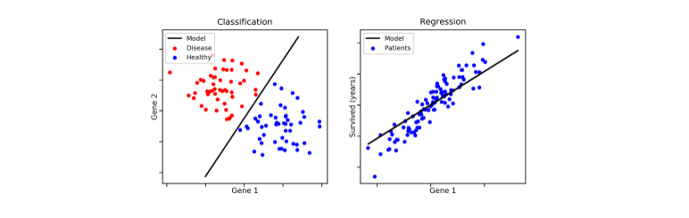

<div style="page-break-after: always;"></div>

### 1.3 Procedimento generale di un classificatore

Lo schema generale per la classificazione si suddivide nella creazione del modello e nell'utilizzo di quest'ultimo. Nella prima fase si utilizza un insieme di tuple, chiamato training set, dove ogni tupla (o osservazione) è caratterizzata da vari attributi (o features) e da una classe di appartenenza. Il modello viene costruito attraverso varie tecniche (alberi decisionali, principi probabilistici o geometrici, etc.) a partire dai dati di training. 

* Costruzione del training set
* Scelta del metodo di apprendimento
* Allenamento del modello

Una volta finita la fase di creazione, si applica il modello a dei nuovi dati appartenenti ad un test set e si controlla che le etichette predette corrispondano alle etichette originali: viene quindi misurata la performance del classificatore. Il test set è *fortemente indipendente* dal training set, al fine di produrre un modello più generico possibile. Se la misura di performance è discretamente alta, allora si utilizza il modello per classificare nuovi dati. 

* Si applica il modello al test set
* Si misurano le performance 
* Si accetta o rigetta il modello in base ai risultati


### 1.4 Requisiti dei classificatori o predittori

I requisiti principali di un classificatore o di un predittore sono i seguenti: 

* Accuratezza: predire correttamente le etichette delle classi / corretto valore di un attributo
* Velocità, intesa come: 
  * Tempo impiegato nella costruzione del modello (training time). 
  * Rapidità con cui il modello performa una classificazione / predizione (classification / prediction time).
* Robustezza: la capacità di manipolare dati con rumore o con feature mancanti. 
* Scalabilità: mantenere l'efficienza all'aumentare dei dati, quindi manipolare anche dati in memoria secondaria.  
* Interpretabilità dei risultati. 

<div style="page-break-after: always;"></div>

## 2. Alberi decisionali

Gli alberi decisionali sono uno strumento noto nei campi del machine learning, data mining e della statistica. Ogni nodo interno dell'albero contiene un **test** su uno o più attributi, tale test stabilisce quale dei sottoalberi deve essere visitato. Un test tipicamente valuta **una** feature, in tal caso si parla di alberi **univariati**, o una **combinazione** di feature,  nel caso di **alberi multivariati**. Ogni **foglia** contiene una **etichetta di classe**. 

Alcune importanti osservazioni: 

* La classe di una osservazione (o tupla) si ottiene seguendo il percorso che va dalla radice dell'albero ad una foglia che determina la classe, sulla base dei test residenti nei nodi interni. 
* Ad ogni nodo interno $X$ è possibile associare l'insieme $S_X$ delle tuple che soddisfano le condizioni testate partendo dalla radice sino ad arrivare al nodo X. 
* La conoscenza rappresentata nell'albero decisionale può essere estratta e rappresentata in forma di regole di produzione **if-then**. Le regole estratte sono poi utilizzate per la classificazione di nuovi oggetti.


### 2.1 Esempio esplicativo

Ipotizziamo di avere il seguente training set, dove ogni osservazione è formata da 4 feature: 
$$
\{Outlook, Temperature, Humidity, Windy\}
$$
e da tali attributi si decide di giocare una partita di pallone o meno (P = Play, N = Not play). In tal caso il task del classificatore è quello di creare un modello in grado di analizzare le condizioni giornaliere in input e determinare se è il caso di giocare una partita o meno. 

| OUTLOOK  | Temperature | Humidity | windy | class |
| -------- | ----------- | -------- | ----- | ----- |
| Sunny    | hot         | high     | false | N     |
| Sunny    | hot         | high     | true  | N     |
| Overcast | hot         | high     | false | P     |
| Rain     | mild        | high     | false | P     |
| Rain     | cool        | normal   | false | P     |
| Rain     | cool        | normal   | true  | N     |
| Overcast | cool        | normal   | true  | P     |
| Sunny    | mild        | high     | false | N     |
| Sunny    | cool        | normal   | false | P     |
| Rain     | mild        | normal   | false | P     |
| Sunny    | mild        | normal   | true  | P     |
| Overcast | mild        | high     | true  | P     |
| Overcast | hot         | normal   | false | P     |
| Rain     | mild        | high     | true  | N     |

Attraverso un algoritmo di classificazione viene creato un albero decisionale come quello raffigurato nell'immagine sottostante. Più l'albero è bilanciato, più si ridurrà il tempo di classificazione / predizione di una osservazione. Tuttavia, è bene considerare anche il numero di rami uscenti da un nodo interno, poiché molti rami uscenti indicano test computazionalmente costosi. Una production rule tirata fuori da tale albero potrebbe essere la seguente: 

```python
if outlook == 'Sunny' and humidity == 'Normal':
    return 'PLAY'
```

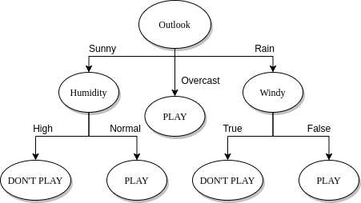


### 2.2 Costruzione di un albero decisionale

Un albero decisionale può essere costruito in maniera top-down. Partendo dalla radice, è possibile applicare una serie di passi ricorsivamente. 

* Supponiamo di essere al nodo *t*. 
* Vi sono due possibilità: 
  * Tutte le tuple associate all'insieme $S_t$ assumono la stessa classe *y* (quindi *t* si dice nodo **puro**)$\rightarrow$ *t* diventa una foglia di classe *y*
  * Altrimenti il nodo *t* si definisce **impuro** e: 
    * Se è presente un attributo A tra gli attributi ancora non utilizzati: 
      *  Si partiziona $S_t$ sulla base dei valori di *A* (**splitting**)
      *  Si creano tanti figli del noto *t* quante sono le partizioni create
      *  Per ciascun figlio si reitera il processo.  
    * Altrimenti si crea una foglia di classe *y*, dove la classe *y* è di maggioranza nell'insieme delle tuple associate al nodo (*).  

(*) Nel caso di un nodo impuro ed in assenza di ulteriori attributi da utilizzare, è possibile stabilire una *distribuzione di probabilità* P tale che: per ogni classe C nell'insieme S del nodo, si assegna una probabilità P(C) data dal rapporto di osservazioni di classe C in S su osservazioni totali in S.  


### 2.3 Splitting 

Il processo di splitting incontrato nella costruzione dell'albero decisionale va attenzionato in base al tipo di attributo scelto. Consiste nel partizionare l'insieme di tuple *S* rispetto ad un nodo *t* in base ai valori che l'attributo può assumere. 

Ipotizziamo di trovarci al nodo impuro X con un insieme di osservazioni $S_X$ e di aver scelto un attributo A: 

* (**a**) Se A è un attributo **categoriale**, allora le osservazioni assumono uno tra i *k* valori finiti di A. Si formano *k* nodi figli di X e si partiziona l'insieme $S_X$ in *k* sottoinsiemi $S_1 ,...,S_k$ sulla base dei valori di A e si assegnano ai rispettivi nodi figli. 
* (**b**) Se l'attributo è **continuo** allora si definisce un valore di soglia $\sigma$ e si partiziona l'insieme $S_X$ a seconda se $A \ge \sigma$ o $A < \sigma$. La soglia è scelta in modo che ogni partizione abbia un numero minimo di elementi. Si aggiungono due figli ad X a cui sono associate rispettivamente le partizioni create.
* (**c**) Se l'attributo è **booleano** allora si partiziona $S_X$ in due insiemi $S_1$ e $S_2$ a seconda che $A=true$ oppure $A=false$. Si aggiungono due figli ad X a cui sono associate rispettivamente le partizioni create.

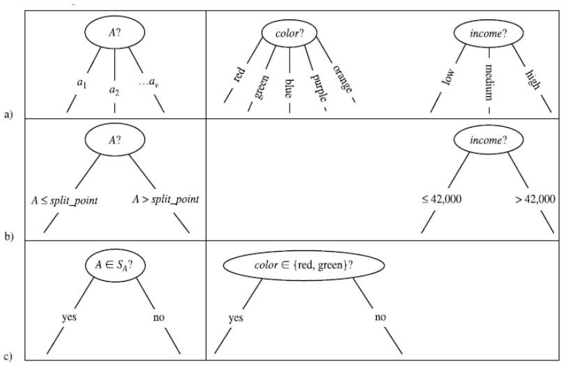


#### 2.3.1 Scelta degli attributi

La costruzione dell'albero decisionale è fortemente influenzata dall'ordine in cui si considerano gli attributi per lo splitting. Al variare dell'ordine, l'albero in output differisce; l'obiettivo consiste nello scegliere l'albero più semplice e compatto possibile. Nell'immagine che segue troviamo due alberi costruiti a partire dallo stesso training set, con un criterio di scelta degli attributi differente: 

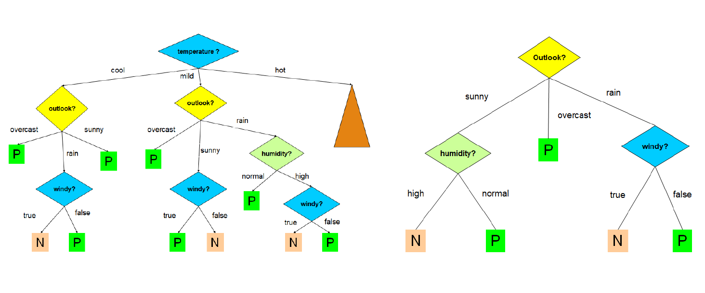

Ovviamente l'albero a destra è più compatto, comprensibile ed efficiente di quello a sinistra. Trovare l'albero minimale (con altezza minore) è un problema NP-Hard, per cui occorre utilizzare degli algoritmi approssimati che cerchino un ottimo locale sfruttando una strategia **greedy**. Un' euristica ricorrente è la seguente: 

> Si sceglie ad ogni passo l'attributo che divide le osservazioni in insiemi che sono relativamente **puri**. 

L'obiettivo è quindi quello di effettuare scelte che portino più rapidamente ai nodi foglia. Esistono varie nozioni di purezza che esamineremo in seguito, e prendono il nome di **misure di goodness**. 


#### 2.3.2 Algoritmo greedy ricorsivo

Descriviamo l'algoritmo greedy ricorsivo come segue: 

* **Passo base**: 

  * Se tutte le osservazioni in S associato al nodo *t* assumono la stessa classe, quindi *t* è un nodo puro, allora si crea una foglia contenente tutti i dati. 
  * Altrimenti, se non vi sono ulteriori attributi da selezionare per lo splitting, si crea un nodo foglia con l'etichetta di maggioranza. 

* **Passo ricorsivo**: 

  * Si seleziona l'attributo A che massimizza una **misura di goodness**; 
  * Si effettua lo splitting di S rispetto al nodo t sulla base di A. 
  * Si applica ricorsivamente l'algoritmo sui figli del nodo t. 

  

```
build_decision_tree (S, attributes):
	if observations in S have the same class: 
		make a new leaf with this class
	else: 
		if the node is impure but there are no attributes: 
			make a new leaf with the most frequent class in S
		else: 
			A = attribute that maximize the goodness measurement 
			partitions = split(S, A)
			for partition in partitions: 
				build an internal node, son of the current node 
				build_decision_tree(partition, attributes - {A})

```


#### 2.3.3 Splitting su attributi continui

Nel caso di attributi continui occorre scegliere un valore di soglia, per cui lo splitting effettuato in questo caso dipende anche da questo parametro. Se l'attributo è continuo è necessario quindi calcolare più valori di goodness per lo stesso attributo e prendere come riferimento quello con la goodness più alta. Questo aggiunge un layer di complessità alla scelta degli attributi. 

<div style="page-break-after: always;"></div>


### 2.4 Misure di goodness 

Una misura di goodness quantifica la purezza dei nodi prodotti dallo splitting, scegliendo uno tra gli attributi. Conosciamo tre misure più ricorrenti: 

* Information gain (utilizzata nell'algoritmo ID3)
* Gain ratio (utilizzata nell'algoritmo C4.5)
* Gini index (utilizzata nell'algoritmo CART)


#### 2.4.1 Information gain (algoritmo ID3)

La scelta di un attributo mira alla riduzione progressiva dell'**entropia**. La nozione di purezza è descritta come "quanto un insieme di istanze è prossimo alla situazione ideale", ovvero contenente osservazioni di una sola classe. 

* L'**entropia massima** si ha quando le classi delle osservazioni associate ad un nodo hanno la stessa frequenza. 
* L'**entropia minima** si ha quando tutte le osservazioni associate ad un nodo hanno la stessa classe (nodo puro).

Sia $S_X$ l'insieme delle osservazioni associate ad un nodo X dell'albero, se X è la radice allora $S_X$ è l'intero set di osservazioni. Se X è un nodo interno allora $S_X$ è l'insieme di osservazioni che soddisfano i test imposti dagli archi dell'albero nel percorso effettuato per arrivare dalla radice ad X. 

La quantità di informazione è definita nella teoria della informazione come segue: 
$$
I(x) = - log (P(x))
$$
L'entropia, descritta come il grado di incertezza in una distribuzione di probabilità *P* è definita come segue: 
$$
H(X) = E_X[I(x)] = - \sum_x P(x) * log(P(x))
$$
Assumiamo di avere solo due classi, P ed N. Ipotizziamo che $S_X$ contenga *p* osservazioni di classe P ed *n* osservazioni di classe N. Definiamo la probabilità di una classe in modo frequentista, data quindi dal rapporto di casi favorevoli (osservazioni della data classe in $S_X$) su casi possibili (osservazioni in $S_X$). 

Nel nostro esempio, le classi P ed N hanno rispettivamente probabilità: 
$$
P(P) = \frac{p}{p+n} \space e \space P(N) = \frac{n}{p+n}
$$
Per cui l'entropia dell'insieme $S_X$ è così definita: 
$$
H(S_X) = - \frac{p}{p+n} * log (\frac{p}{p+n}) - \frac{n}{p+n} * log (\frac{n}{p+n})
$$
Supponiamo di scegliere l'attributo A come attributo per lo splitting. L'insieme $S_X$ verrà partizionato in $S_1, S_2, ..., S_k$ insiemi. Supponiamo che l'i-esimo insieme $S_i$ contenga $p_i$ osservazioni di classe P e $n_i$ osservazioni di classe N. Allora l'entropia dell'insieme $S_i$ è data come: 
$$
H(S_i) = - \frac{p_i}{p_i+n_i} * log (\frac{p_i}{p_i+n_i}) - \frac{n_i}{p_i+n_i} * log (\frac{n_i}{p_i+n_i})
$$
Definiamo l'**entropia media di $S_X$ rispetto ad A** la seguente media pesata delle entropie dei singoli sottoinsiemi $S_i$: 
$$
\bar{H}_A(S_X) = \sum_{i=1}^k \frac{p_i+n_i}{p+n} H(S_i)
$$
Generalizziamo il concetto e ipotizziamo che in $S_X$ le osservazioni assumano *n* classi differenti $C_1, ..., Cn$. Allora l'entropia di $S_X$ è data da: 
$$
H(S_X) = - \sum_{i=1}^n P(C_i) * log(P(C_i))
$$
Sia A un attributo avente i seguenti valori $\{a_1, ..., a_n\}$. Effettuando lo splitting di $S_X$ nei vari $S_i$ a seguito del test su A, l'entropia media di $S_X$ rispetto ad A sarà la media ponderata delle entropie dei singoli sottoinsiemi, ovvero: 
$$
INFO(A) = \bar{H}_A(S_X) = \sum_{i=1}^k \frac{|S_i|}{|S_X|} H(S_i)
$$
L'**information gain** è definito come la riduzione di entropia ottenuta dal partizionamento di $S_X$ scegliendo scegliendo l'attributo A, ovvero: 
$$
gain(A) = H(S_X) - \bar{H}_A(S_X)
$$
Ad ogni passo di splitting, l'algoritmo sceglierà l'attributo A che massimizza l'information gain. Ciò equivale a selezionare l'attributo A tale che $\bar{H}_A(S_X)$ sia minimo, in quanto $H(S_X)$ è lo stesso (dato il nodo) qualunque sia l'attributo selezionato. Questo approccio minimizza il numero atteso di test necessario per classificare una data tupla. Garantisce inoltre la costruzione di un albero semplice (non necessariamente il più semplice, essendo un approccio greedy). 


#### 2.4.2 Svantaggi dell'information gain

L'information gain risulta fortemente sbilanciato in favore dei test che hanno molti esiti. In determinati casi si verifica che un test, che può essere molto discriminante ai fini della divisione dell'albero e quindi con un forte potere predittivo, non venga effettuato perché si basa su un attributo con pochi valori possibili, in favore di un altro test con molti esiti possibilmente poco significativi in termini di predizione. 

Ad esempio, se uno degli attributi è un ID, allora ogni partizione sulla base di questo attrbuto avrà una sola tupla. Di conseguenza ogni nodo creato dalla partizione sarà puro e l'entropia media delle partizioni sarà zero, ovvero l'information gain sarà massimo. 


#### 2.4.3 Gain ratio (algoritmo C4.5)

Rispetto ad ID3, l'algoritmo C4.5 utilizza una misura di goodness diversa chiamata **Gain ratio**, che riduce il bias introdotto dall'information gain. Il Gain ratio prende in considerazione il numero e la dimensione delle partizioni ottenute scegliendo un attributo, senza considerare informazioni specifiche sulle singole classi. 

<div style="page-break-after: always;"></div>


Le potenziali informazioni sullo split generato da un attributo A sono rappresentate dallo $splitInfo$: 
$$
splitInfo(A) = - \sum_{i=1}^k \frac{|S_i|}{|S_X|} log_2 (\frac{|S_i|}{|S_X|})
$$
Il Gain ratio è dato da: 
$$
GainRatio(A) = \frac{Gain(A)}{SplitInfo(A)}
$$
Attributi che determinano molte partizioni con pochi elementi avranno un valore di $SplitInfo$ maggiore, quindi un minore $GainRatio$. 


#### 2.4.4 Gini index (algoritmo CART)

Il **Gini index**, anche chiamato **Gini impurity**, misura l'impurità di un insieme di osservazioni $S_X$ associato ad un nodo dell'albero decisionale. Consideriamo una classe $C_i$ ed una tupla *x* di classe $C_i$ scelta a caso dal dataset *T*. Supponiamo di assegnare casualmente ad *x* una classe $C_j$ sulla base della distribuzione delle frequenze delle classi nel dataset. Il Gini index misura, per ogni classe, la probabilità che $i \ne j$. Chiamiamo $p_i$ la probabilità di scegliere una osservazione del dataset di classe $C_i$, la probabilità di scegliere una classe $C_j$ diversa da $C_i$ a partire dalla distribuzione delle frequenze delle classi è: 

$$
P(C_j \ne C_i) = \sum_{j=1, j \ne i}^n p_j = 1-p_i 
$$
Supponiamo di avere *n* classi, il gini index calcola l'impurità di un nodo sommando, per ogni classe $C_i$ con $i = 1,...,n$, la probabilità che si scelga una classe errata (ovvero $1 - p_i$).  Tale valore viene bilanciato attraverso la probabilità $p_i$:
$$
gini(S_X) = \sum_{i=1}^n p_i (1 - p_i) = \sum_{i=1}^n p_i - p_i^2 = 1 -\sum_{i=1}^n p_i^2
$$
 Dunque, dato un insieme di osservazioni $S_x$ con *n* classi, il Gini index è definito come segue: 
$$
gini(S_X) = 1 -\sum_{i=1}^n p_i^2
$$
Dove $p_i$ è la frequenza relativa della classe $C_i$ in $S_X$. 

Supponiamo che, scegliendo un attributo A per lo split, l'insieme $S_X$ venga partizionato in *k* sottoinsiemi $S_1, ..., S_k$. Il Gini index dello split è definito come segue: 
$$
gini_{split}(S_X) = \sum_{i=1}^k \frac{|S_i|}{|S_X|} *gini(S_i)
$$
 L'attributo A che **minimizza** $gini_{split}(S_X)$ è selezionato come attributo di splitting. 

<div style="page-break-after: always;"></div>

### 2.5 Pruning

L'elevato numero di attributi in un training set o la particolare distribuzione dei valori degli attributi può far crescere notevolmente la dimensione di un albero. Ciò può portare alla costruzione di un modello più complesso, fatto "su misura" sul training set, ma non in grado di classificare correttamente nuovi dati. Questo fenomeno è chiamato **overfitting**. Rende più difficile la classificazione (dovuto ad outliers) ed è associato ad un aumento non giustificato di errori. Per evitare questo, gli algoritmi di classificazione effettuano un **pruning** (potatura).

Il pruning consiste nel rimuovere i rami che non contribuiscono ad una corretta classificazione, producendo qualcosa di meno complesso e più comprensibile. Il pruning deve essere fatto senza aumentare eccessivamente il tasso di errore di classificazione del modello. 


#### 2.5.1 Pre-pruning e post-pruning

Vi sono varie tipologie di pruning: 

* **Pre-pruning**: è attivato in fase di costruzione dell'albero, nel momento in cui si decide se dividere ulteriormente o meno un determinato sottoinsieme. Fissato un valore di soglia (threshold) *t*, i rami per cui si ottiene un **gain** inferiore a *t* vengono troncati. In alternativa, possono essere utilizzati metodi statistici per effettuare il troncamento. 
* **Post-pruning**: questa tipologia di pruning è utilizzata dagli algoritmi CART e C4.5. Si rimuovono rami e nodi a costruzione dell'albero già avvenuta, sostituendo un intero sotto-albero con una foglia. 

Il **post pruning**, sebbene più dispendioso, consente una analisi più approfondita delle partizioni producendo un albero più realistico. Il C4.5 utilizza un algoritmo di post-pruning chiamato **pessimistic pruning** o **reduced error pruning**. Il CART utilizza un algoritmo di post-pruning chiamato **cost-complexity pruning**. 


#### 2.5.2 Pessimistic pruning 

Dato un sottoalbero T di radice X, definiamo l'***error rate*** (tasso di errore) atteso di T $E(T)$ il numero di osservazioni di $S_X$ che sono classificate in maniera errata. Una strategia semplice di pruning consiste nel potare un sottoalbero in funzione della variazione di *error rate* predetto che porterebbe all'intero albero. Se tale variazione è positiva, ovvero il tasso di errore aumenta in presenza del sottoalbero, allora il sottoalbero stesso può essere potato e sostituito con una foglia. 

Il **pruning pessimistico** si basa sul calcolo di questa variazione di errore ed è chiamato pessimistico poiché sovrastima leggermente (di una quantità $\epsilon$) il tasso di errore atteso in ogni sottoalbero. 

Vediamo la procedura generale: 

* Calcoliamo una stima pessimistica $E_p(T)$ dell'error rate atteso sul training set prima di fare lo splitting di un nodo X su un attributo A, considerando il nodo X come una foglia con l'etichetta di maggioranza nel sottoalbero. 

<div style="page-break-after: always;"></div>


Avendo considerato la classe di maggioranza *c* sostitutiva al sottoalbero, l'error rate sarà calcolato come segue: 
$$
E(T) = \frac{\# tuple \space di \space classe \space c' \ne c \space in \space S_X}{\# tuple \space in \space T}
$$
La stima pessimistica è calcolata aggiungendo un fattore $\epsilon$: 
$$
E_p(T) = \frac{(\# tuple \space di \space classe \space c' \ne c \space in \space S_X) + \epsilon}{\# tuple \space in \space T}
$$


* Calcoliamo una stima pessimistica $E_p'(T)$ dell'error rate atteso dopo aver eseguito lo splitting di X su A, utilizzando quindi il sottoalbero. 

Essendovi uno splitting del nodo X, vi saranno *k* sottoinsiemi di $S_X$: $S_1, ..., S_k$. Calcoliamo l'error rate, considerato il sottoalbero, come segue:
$$
E'(T) = \frac{ \sum_{i=1}^k \# tuple \space di \space classe \space c' \ne c \space in \space S_i}{\# tuple \space in \space T}
$$
La stima pessimistica è calcolata aggiungendo un fattore $\epsilon$: 
$$
E_p'(T) = \frac{ \sum_{i=1}^k (\# tuple \space di \space classe \space c' \ne c \space in \space S_i + \epsilon)}{\# tuple \space in \space T} = \frac{ (\sum_{i=1}^k \# tuple \space di \space classe \space c' \ne c \space in \space S_i) + k*\epsilon}{\# tuple \space in \space T}
$$

* Se $E_p'(T) > E_p(T)$ allora: 
  * Viene sostituito il sottoalbero radicato in X con un nodo foglia. 
  * Viene assegnata ad X l'etichetta di maggioranza tra le foglie del vecchio sottoalbero.  

Vediamo un esempio di pruning pessimistico: 

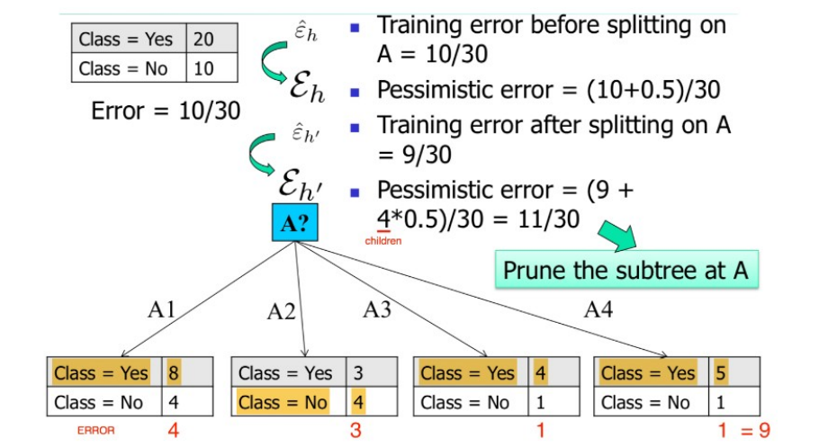

<div style="page-break-after: always;"></div>


#### 2.5.3 Cost complexity pruning

L'algoritmo CART utilizza un algoritmo di post pruning chiamato Cost Complexity pruning. Tale algoritmo costruisce iterativamente *m* alberi decisionali $T_0, T_1, ..., T_m$ , dove $T_0$ l'albero decisionale completo e $T_m$ è l'albero formato dalla sola radice. 

Alla i-esima iterazione, l'albero $T_i$ è ottenuto a partire dall'albero $T_{i-1}$ rimuovendo un sottoalbero *t* di  $T_{i-1}$ e sostituendolo con un nodo foglia con associata etichetta di maggioranza ( o distribuzione delle classi). Se  $E(T_i)$ è l'error rate atteso per il sottoalbero $T_i$, il sottoalbero da rimuovere in questa iterazione è quello tale da minimizzare la seguente funzione: 
$$
argmin_j
\frac
{E(prune(T_i, t_j)) - E(T_i)}
{|leaves(T_i)| - |leaves(prune(T_i, t_j))|}
$$
Dove $prune(T_i, t_j)$ è l'albero ottenuto rimuovendo da $T_i$ il sottoalbero $t_j$, mentre con $|leaves(T)|$ intendiamo genericamente il numero di foglie in un albero. Uno dei vantaggi di tale algoritmo è che non è necessario stimare un parametro $\epsilon$. 


### 2.6 Estrazione di regole da un albero decisionale

A partire dall'albero decisionale è possibile estrarre delle production rules del tipo IF (condizione) THEN (etichetta). Esiste una regola per ogni cammino che porta dalla radice ad una foglia. Le coppie (attributo, valore) lungo un percorso entrano a far parte della condizione della regola, legate attraverso congiunzione (AND). Il valore contenuto nella foglia determina la predizione finale della classe. Le regole sono mutuamente **esclusive** ed **esaustive**. 

Vediamo un esempio: 

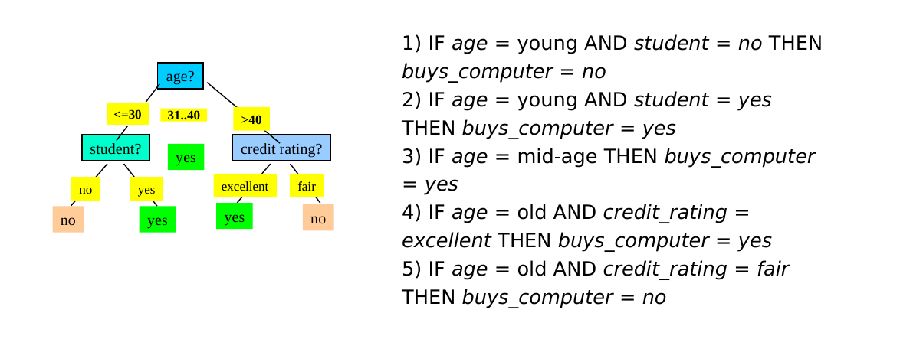

#### 2.6.1 Qualità di una regola 

Per stabilire la qualità di una regola per una classe C si utilizzano due misure: 

* **Copertura** (coverage): numero relativo di osservazioni coperte dalla regola, ovvero che soddisfano le condizioni della regola. 
* **Accuratezza** (accuracy): numero relativo di osservazioni di classe C coperte dalla regola. 

Una buona regola dovrebbe avere alta coverage per una specifica classe C (ovvero coprire quante più tuple di classe C) ed elevata accuratezza (ovvero classificare bene la maggior parte delle osservazioni di classe C coperte).

Definiamo gli **esempi positivi** come le osservazioni di classe C coperte dalla regola, mentre gli **esempi negativi** come le tuple di classe diversa da C coperte dalla regola.  


#### 2.6.2 Risoluzione dei conflitti

Idealmente, ogni regola sulla classe C dovrebbe coprire insiemi di osservazioni differenti. Tuttavia, è possibile avere ridondanze o conflitti con due o più regole che coprono più o meno lo stesso insieme di osservazioni. Occorre risolvere un problema di **minimal set covering**, ovvero trovare il più piccolo insieme di regole sulla classe C che coprono gli esempi positivi. Ciò deve essere fatto producendo regole che abbiano un livello sufficientemente alto di accuratezza. 

Alcuni algoritmi noti per la ricerca del **minimal set covering** sono FOIL, AQ, CN2, RIPPER. Le regole vengono costruite in maniera sequenziale. L'obiettivo è individuare una regola per una classe C che copra *molte* tuple di classe C (**esempi positivi**) e nessuna (o poche) tuple delle altre classi (**esempi negativi**). Lo schema generale è il seguente: 

* Sia S il set formato da tutte le osservazioni del training set 
* Le regole vengono apprese una per volta seguendo un criterio greedy basato sulla qualità della soluzione. 
* Ogni volta che una nuova regola viene appresa, gli esempi positivi vengono rimossi da S. 
* Il processo viene ripetuto sino a quando S non diventa vuoto. 


#### 2.6.3 Algoritmi FOIL e RIPPER

Gli algoritmi **FOIL** e **RIPPER** utilizzano una strategia greedy e depth-first per generare la regola da aggiungere ad ogni passo.

Sia C la classe; partiamo dalla radice dell'albero decisionale e consideriamo la regola più generale per ottenere la classe C, ovvero quella senza condizioni:
$$
IF \space True \space THEN \space C
$$
Da tale regola otterremo il massimo punteggio di copertura (coverage) poiché tutte le osservazioni rispettano tale condizione, ma anche una pessima accuratezza (accuracy), ovvero saranno incluse anche tutte le osservazioni di classe diversa da C, quindi molti *esempi negativi*. 

Dopodiché si scenderà lungo l'albero scegliendo la condizione che mantenga una ampia copertura e ottimizzi la accuratezza per la classe C. 
$$
IF A=a \space THEN \space C \\
IF A=a \space AND \space B=b \space THEN \space C \\
...
$$
Inevitabilmente, durante l'aggregazione di nuove condizioni scenderanno sia gli esempi positivi che gli esempi negativi della classe C, la scelta va ponderata in base al miglior rapporto (che enfatizza la diminuzione degli esempi negativi, mentre scoraggia quella dei positivi). 

Vi è la necessità di introdurre una metrica che diriga l'algoritmo nell'effettuare la scelta migliore. Nel caso dell'algoritmo FOIL si introduce il **FOIL gain**: le condizioni vengono aggiunte sino a quando la regola ottenuta mantiene un livello di qualità superiore ad una certa soglia, sulla base del FOIL gain. 


#### 2.6.4 FOIL gain

Siano $pos$ e $neg$ rispettivamente il numero di esempi positivi e negativi ottenuti prima della costruzione della regola. 
Siano $pos'$ e $neg'$ rispettivamente il numero di esempi positivi e negativi ottenuti dopo della costruzione della regola.
$$
FOILGain(R) = pos' * [log_2 \frac{pos'}{pos'+neg'} - log_2 \frac{pos}{pos+neg}]
$$
Il FOIL gain cerca quindi di favorire regole che hanno alta accuratezza e coprono molti esempi positivi. 

<div style="page-break-after: always;"></div>

## 3. Classificatori generativi

I *classificatori generativi* (o classificatori *Bayesiani*) producono un modello probabilistico traendo informazioni dai dati e predicono la classe di appartenenza più probabile per un nuovo dato a partire dal modello sviluppato.  Esempi di classificatori generativi sono le *Bayesian networks* ed i *Gaussian Mixture Models*, entrambi basati sul *teorema di Bayes*.


### 3.1 Teorema di Bayes 

Consideriamo un insieme di alternative $A_1, \dots, A_n$ che partizionano lo spazio degli eventi $\Omega$. Si trova la seguente espressione per la probabilità condizionata: 
$$
P(A_i \mid E) = \frac {P(E \mid A_i) P(A_i)} {P(E)} =
\frac {P(E \mid A_i) P(A_i)} {\sum_{j=1}^{n} P(E \mid A_j) P(A_j)}
$$
Dove: 

* $P(A)$ è la *probabilità a priori* o *probabilità marginale* (nessuna informazione su $E$). 
* $P(A \mid E)$ è la *probabilità a posteriori*, dato che deriva dal valore di $E$. 
* $P(E \mid A)$ è la *verosimiglianza* (likelihood). 
* $P(E)$ è l'*evidenza*, che funge da costante di normalizzazione. 


### 3.2 Maximum a Posteriori (MAP)

Consideriamo l'evento stocastico "$x$ è di classe $c$" dove $x$ è una osservazione d'esempio e $c \in \{0, \dots, M-1\}$ è una delle $M$ possibili classi nel problema di classificazione. Consideriamo la probabilità $P(c\mid x)$ che risponda alla domanda "qual è la probabilità che si osservi la classe $c$, data l'osservazione $x$?". Se quantifichiamo tale probabilità per ogni classe $c$ tra le $M$ esistenti, abbiamo una distribuzione di probabilità condizionata sulle classi, dato l'input $x$. Risulta naturale attribuire all'input $x$ la classe $\bar{c}$ che massimizzi la distribuzione di probabilità condizionata: 
$$
\bar{c} = \text{arg}\max_c P (c \mid x)
$$
Ricollegandoci al teorema di Bayes, la probabilità da massimizzare è chiamata probabilità a posteriori, da cui il nome del metodo di classificazione: *Maximum A Posteriori* (MAP). Sostituiamo con la formula precedente: 
$$
\bar{c} = \text{arg}\max_c \frac {P(x \mid c) P(c)} {P(x)}
$$
Dal momento in cui l'evidenza costituisce una costante di normalizzazione, massimizzare tale espressione equivale a massimizzare la seguente: 
$$
\bar{c} = \text{arg}\max_c P(x \mid c) P(c)
$$


#### 3.2.1 Calcolo delle probabilità 

La semplificazione del metodo Maximum a Posteriori attraverso l'utilizzo del teorema di Bayes ci permette di passare da una stima altamente complessa di $P(C \mid X)$ a due stime relativamente semplici, quali la probabilità a priori e la likelihood. 


##### Calcolo della probabilità a priori 

Data una classe $C$, il calcolo della probabilità a priori $P(C)$ è relativamente semplice. È sufficiente calcolare in maniera frequentista il rapporto di osservazioni nel dataset facenti parte della classe $C$ rispetto alle osservcazioni totali: 
$$
P(C) = \frac
{\text{#obs. of class C}}
{\text{#obs.}}
$$


##### Calcolo della likelihood

La likelihood $P(X \mid C)$ è più semplice da stimare rispetto alla probabilità a posteriori $P(C \mid X)$ poiché il termine condizionante è discreto e finito. Per ogni classe $C$ consideriamo la variabile aleatoria $X_c$ composta da sole le osservazioni di classe $C$, quindi $X_c$ è un sottoinsieme di $X$. La probabilità $P(X_c) = P(X | C)$. 

Per semplicità consideriamo $X_c$ univariata e distinguiamo due casi: 

* $X_c$ è discreta e finita, allora è possibile calcolare la probabilità $P(X_c)$ in maniera frequentista. 
* $X_c$ è continua o discreta ma non finita, allora utilizziamo una distribuzione di probabilità nota. 


#### 3.2.2 Esempio discreto 

Consideriamo una versione semplificata della classificazione degli Iris di Fisher dove troviamo due sole variabili: *SepalWidth* e *SepalLength*. Le variabili sono discrete e finite e possono assumere 3 soli valori: small, medium e large, rispetto alla dimensione del sepalo. Sia $X = [SepalWidth, SepalLength]$ una variabile aleatoria bidimensionale. L'esempio può appartenere a una tra le classi *Setosa*, *Virginica* e *Versicolor*. Definiamo 3 diverse verosimiglianze $P(X_{set})$, $P(X_{vir})$ e $P(X_{ver})$ a partire dalle seguenti tabelle: 

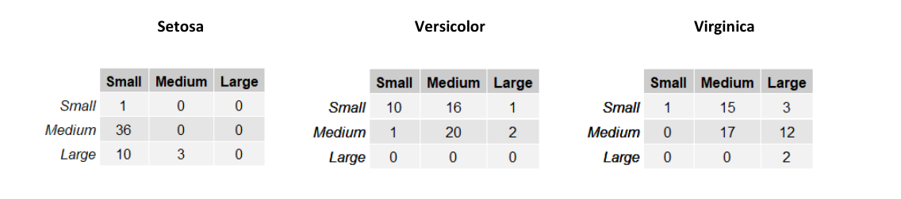

Le righe nelle tabelle rappresentano la larghezza del sepalo (*SepalWidth*) mentre le colonne la lunghezza (*SepalLength*). Ogni tabella contiene la frequenza assoluta delle occorrenze per ognuna delle possibili combinazioni delle due variabili. Possiamo trasformare queste tabelle in una distribuzione di probabilità dividendo ogni elemento per il totale delle osservazioni del sottoinsieme considerato. 

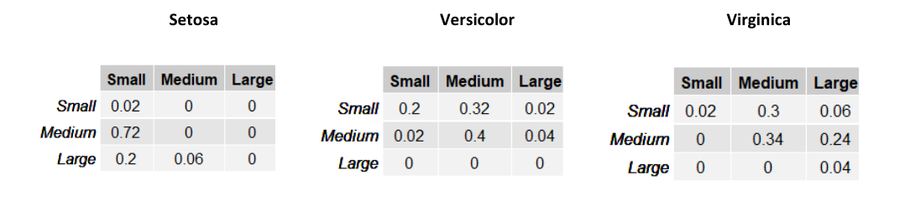

Supponiamo di assegnare una probabilità a priori equa di $\frac 1 3$ ad ognuna delle tre classi e stimiamo la classe di un esempio $X = [medium, medium]$. Per il metodo Maximum a Priori, è necessario prendere in considerazione la classe $c$ che massimizzi $P(X \mid C) \times P(C)$. 
$$
f([medium, medium]) = \text{arg}\max_c \left( P(X \mid C) P(C) \right)
$$
Quindi calcoliamo per ognuna delle 3 classi tale espressione: 

* $P(X \mid Setosa) P(Setosa) = 0 \times \frac 1 3 = 0$
* $P(X \mid Versicolor) P(Versicolor) = 0.4 \times \frac 1 3 = 0.13$
* $P(X \mid Virginica) P(Virginica) = 0.34 \times \frac 1 3 = 0.11$

Classificheremo l'esempio $X = [medium, medium]$ come *Versicolor*, dato che tale classe massimizza la probabilità a posteriori. 


#### 3.2.3 Esempio continuo

Supponiamo di voler classificare il genere di una persona (uomo, donna) in base alla sua altezza $h$ ed al suo peso $w$. Supponiamo che $C = 1$ se il soggetto è una donna, mentre $C = 0$ se il soggetto è un uomo. Introduciamo la variabile aleatoria $X = (h, w)$. 

Ipotizziamo che il dataset di esempi sia bilanciato e che quindi le probabilità a priori siano $\frac 1 2$ per ognuna delle due classi. Adesso è necessario calcolare la likelihood per entrambe le classi, ma le variabili sono continue, per cui non è possibile costruire una tabella. 

Consideriamo il seguente grafico che mostra la distribuzione degli input di sesso femminile ($X = 1$) in base ad altezza e peso: 

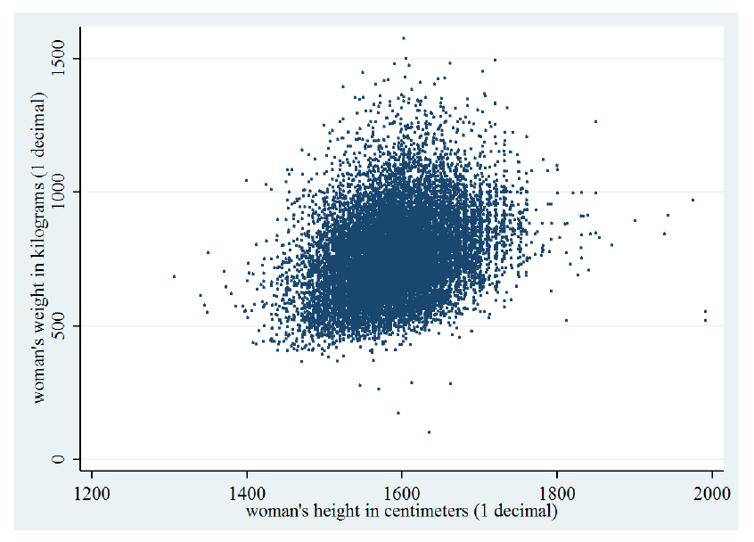

La distribuzione è molto simile ad una gaussiana bidimensionale. Possiamo modellare $P(X \mid C = 1)$ considerando tutti e soli gli esempi di sesso femminile e calcolando i parametri della gaussiana bidimensionale: 
$$
N(x; \mu, \Sigma) = \sqrt{\frac{1}{(2\pi)^2 \det(\Sigma)}} 
\exp(- \frac 1 2 (x - \mu)^T \Sigma^{-1} (x - \mu))
$$
Siano $x_F$ gli input di sesso femminile, calcoliamo i parametri della gaussiana bidimensionale: 
$$
\mu_F = \frac 1 n \sum_j x_{F}^{(j)}
$$

$$
\Sigma_F = Cov(x_f)
$$

Facciamo lo stesso considerando solo gli input di sesso maschile $x_M$ e calcoliamo le rispettive likelihood come segue: 

* $P(X \mid C = 0) = N(x; \mu_M, \Sigma_M)$; 
* $P(X \mid C = 1) = N(x; \mu_F, \Sigma_F)$;  

Classificheremo l'esempio $x$ come *femmina* se $P(x \mid 1) p(1) > P(x \mid 0) p(0)$, *maschio* altrimenti. 


### 3.3 Classificatore Naïve Bayes 

Il calcolo della likelihood potrebbe essere oneroso nel caso la variabile $X$ abbia molte dimensioni. Il classificatore Naïve Bayes assume in maniera naïve che gli attributi di $X$ siano *condizionalmente indipendenti* tra loro, ovvero indipendenti fissata la classe $C$ di appartenenza:
$$
X_i \bot X_j \mid C, \forall i \ne j
$$
Tale assunzione è spesso non vera, ma semplifica notevolmente il calcolo e procura generalmente buoni risultati. Per le proprietà di indipendenza condizionata possiamo riscrivere la likelihood come segue: 
$$
P(X \mid C_i) = \prod_{k=1}^n P(x_k \mid C_i) = 
P(x_1 \mid C_i) \times \dots \times P(x_n \mid C_i)
$$
E la regola di classificazione MAP: 
$$
f(x) = \text{arg}\max_c \left[
P(x_1 \mid C) \times \dots \times P(x_n \mid C) \times P(C)
\right]
$$
I singoli termini $P(x_i \mid C)$ sono semplici da stimare dato che $x_i$ è monodimensionale. Nella pratica viene scelta una distribuzione tra la Gaussiana e la Multinomiale per modellare approssimare la distribuzione reale dei dati. Se viene utilizzata la distribuzione gaussiana, allora il classificatore prende il nome di "Gaussian Naïve Bayes", mentre nel caso della multinomiale "Multinomial Naïve Bayes".  


#### 3.3.1 Gaussian Naïve Bayes 

Consideriamo nuovamente la classificazione dei sessi basata su altezza e peso (esempio 3.2.3). Se i dati assumono approssimatamente una distribuzione gaussiana e considerando la assunzione naïve, le probabilità $P(H \mid C)$ ed $P(W \mid C)$ possono essere modellate singolarmente attraverso una gaussiana monodimensionale. Eseguiamo il calcolo per ognuna delle classi, ottenendo 4 espressioni più semplici da calcolare: 

* $P(H = h \mid C = 0) = N(x; \mu_1, \sigma_1)$
* $P(H = h \mid C = 1) = N(x; \mu_2, \sigma_2)$
* $P(W = w \mid C = 0) = N(x; \mu_3, \sigma_3)$
* $P(W = w \mid C = 1) = N(x; \mu_4, \sigma_4)$ 

Dopodiché classificheremo l'esempio $x = (h, w)$ come *femmina* (1) se: 
$$
P(h \mid 1 ) P(w \mid 1) P(1) > P(h \mid 0 ) P(w \mid 0) P(0)
$$
*maschio* altrimenti. 


#### 3.3.2 Multinomial Naïve Bayes 

Nell'esempio precedente si è fatto uso di variabili aleatorie continue, per cui è necessario considerare una  PDF (*Probability Density Function*) come una distribuzione gaussiana. Quando gli attributi dei dati sono discreti, ha senso utilizzare una PMF (*Probability Mass Function*). 

> La *distribuzione multinomiale* di parametri $((p_1, \dots, p_s), n)$ con $p_1 + \dots + p_s = 1$, descrive la probabilità per ogni $s$-upla $(n_1, \dots, n_s)$ con $n_1 + \dots + n_s = n$ di assumere i risultati $x_1, \dots, x_s$ in $n$ prove indipendenti, ognuna delle quali ha probabilità $p_i$ di fornire $x_i$. 

Consideriamo l'esempio della *text classification*. Ipotizziamo di rappresentare un documento d'esempio con la rappresentazione Bag of Words (conteggio delle occorrenze di parole in un vocabolario). Dato un vocabolario $V$ di lunghezza $s$, ogni input $x$ avrà $s$ attributi $(x_1, \dots, x_s)$, con $x_i \in \N$ che rappresenta il numero di occorrenze nel documento della $i$-esima parola nel vocabolario. 

La likelihood di un esempio $x$ sarà $P(x_1, \dots x_s \mid C)$. Utilizzando l'assunzione naïve diciamo che il numero di occorrenze della $i$-esima parola nel documento di classe $C$ è indipendente dal numero di occorrenze della parola $j$-esima. Possiamo utilizzare la distribuzione multinomiale per calcolare la probabilità $P(x_1, \dots, x_s \mid C)$, ma è necessario fissare alcuni parametri: 

* Il numero di esperimenti $n$ sarà il numero totale di parole nel documento $\sum_{i=1}^n x_i$
* $(n_1, \dots, n_s)$ rappresenta le occorrenze delle $s$ parole nel vocabolario $V$ in un documento
* La probabilità $p_{ci}$ sarà la probabilità di trovare la parola $i$-esima del vocabolario $V$ fissata una classe $C$

È possibile calcolare la probabilità $p_{ci}$ in maniera frequentista: 
$$
p_{ci} = \frac
{\sum_{j}^n [y^{(j)} = c] x_i^{(j)} } 
{\sum_{j}^n \sum_k^s [y^{(j)} = c] x_k^{(j)}}
$$
Dove $[·]$ denota le parentesi di Iverson, che valgono 1 se la condizione all'interno è soddisfatta, 0 altrimenti. La probabilità corrisponde al numero di occorrenze della parola $i$-esima in tutti i documenti di classe $c$ rispetto al numero totale di parole nei documenti di classe $c$.  

È possibile risolvere il problema di classificazione con il metodo MAP: 
$$
f(x_1, \dots, x_s) = \text{arg}\max_c P(x_1, \dots, x_s \mid c)P(c)
$$
Sostituendo la likelihood con la formula analitica della distribuzione multinomiale: 
$$
f(x_1, \dots, x_s) = \text{arg}\max_c P(c) \left[  
\frac{(\sum_{i} x_i)!}{x_1!\times \dots \times x_s!}
p_{c1}^{x_1} \times \dots \times p_{cs}^{x_s}
\right]
$$
Il rapporto $\frac{(\sum_{i} x_i)!}{x_1!\times \dots \times x_n!}$ è analogo qualunque sia la classe $c$ considerata, per cui massimizzare tale espressione equivale a massimizzare: 
$$
f(x_1, \dots, x_s) = \text{arg}\max_c P(c) \left[  

p_{c1}^{x_1} \times \dots \times p_{cs}^{x_s}
\right]
$$


#### 3.3.3 Zero probability e underflow 

Il metodo Naive Bayes richiede che le probabilità condizionali siano diverse da 0, altrimenti la likelihood risulterà nulla. Inoltre, se le probabilità condizionali sono molto piccole, un prodotto di tante quantità prossime allo 0 può portare problemi di precisione e di underflow. 

Per ovviare al primo problema, si può utilizzare la **correzione Laplaciana**, ovvero aggiungere 1 ad ogni probabilità condizionale. 

Per ovviare a entrambi i problemi, si può considerare il **log-likelihood**, ovvero il logaritmo di $P(X|C_i)$, che si traduce in una somma anziché un prodotto dei termini: 
$$
\log P(X|C_i) = \log \prod_{k=1}^n P(x_k|C_i) = \\ 
= \log P(x_1|C_i) + ...+\log P(x_n|C_i) = \\
= \sum_{k=1}^n \log P(X_k|C_i)
$$


#### 3.3.4 Conclusioni

Il classificatore Naive Bayes è facile da implementare, discretamente veloce nella classificazione e produce buoni risultati. Tuttavia, l'assunzione naive non è sempre vera e può provocare una perdita di accuratezza. Le dipendenze tra più attributi, sempre a causa dell'assunzione, non possono essere modellate. 

<div style="page-break-after: always;"></div>

## 4. Classificatori discriminativi

### 4.1 Introduzione

I classificatori discriminativi cercano di predire la classe direttamente a partire dai dati osservati, facendo poche assunzioni sulla loro distribuzione. Esempi di classificatori discriminativi sono il Perceptron ed SVM. 


#### 4.1.1 Differenze tra generativo e discriminativo

Il classificatore *generativo* sviluppa un modello probabilistico sui dati a partire da un insieme di assunzioni e predice la classe più probabile per un nuovo dato. Il classificatore *discriminativo* costruisce una funzione di decisione $F$ a partire dai dati osservati stimando pesi calcolati per ogni attributo e dipendenti dai valori dell'attributo stesso. Se $X$ è un nuovo dato, si calcola $F(X)$ ed il valore ottenuto è la classe di $X$. 


#### 4.1.2 Vantaggi e svantaggi

Vantaggi dei classificatori discriminativi: 

* Maggiore accuratezza in generale
* Robusti in presenza di errori nel training set
* Facile calcolo del valore della funzione di decisione $F$ su un nuovo dato

Svantaggi: 

* Tempo di addestramento lungo
* Difficile interpretare i pesi della funzione di decisione calcolata
* Non è semplice incorporare conoscenza a priori (nei metodi Bayesiani risulta molto semplice)

Si rimedia alla difficile interpretazione dei pesi attraverso la [explainable artificial intelligence](https://en.wikipedia.org/wiki/Explainable_artificial_intelligence), ovvero tutta una serie di metodi per rendere il risultato di una soluzione comprendibile dagli umani. 


### 4.2 Classificazione lineare vs non lineare

Nella **classificazione lineare** la classificazione di una osservazione $X$ è basata sul valore di una funzione lineare $f$, ovvero una combinazione lineare degli attributi di $X$: 
$$
y = f(X)=\sum_{i=1}^k w_i*x_i
$$
Dove $w_1, ..., w_n$ sono i pesi della combinazione lineare. 

Nella **classificazione non lineare** la classificazione di $X$ è effettuata utilizzando una funzione non lineare degli attributi di X, ovvero dove gli attributi possono assumere potenze diverse dalla prima. 


#### 4.2.1 Esempio: lineare binaria vs non lineare binaria

Nella classificazione binaria le osservazioni possono essere separate in due classi differenti. Utilizzare la classificazione lineare binaria si traduce nel trovare un **iperpiano separatore** che possa suddividere le osservazioni nelle due classi. Si utilizza una classificazione non binaria quando non esiste una funzione lineare in grado di separare tali dati. 

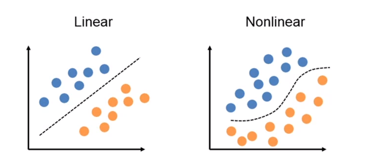


### 4.3 Perceptron 

Perceptron è un algoritmo di classificazione lineare binaria. La classificazione viene effettuata sulla base di una funzione predittiva lineare che si ottiene combinando un insieme di pesi con il vettore degli attributi dell'oggetto. In generale, l'algoritmo perceptron è utilizzabile solo quando il dataset risulta *separabile linearmente*. 

Supponiamo di avere due classi $\{0, 1\}$, data l'osservazione $X$, la funzione predittiva è: 
$$
f(X) = \begin{cases}
1 \space if \space wX + b > 0 \\
0 \space otherwise
\end{cases}
$$
con *w* vettore di pesi con cardinalità pari a quella degli attributi + 1. 
Perceptron effettua un ***apprendimento online***: gli elementi del training set vengono processati uno per volta e i pesi aggiornati ogni volta che un nuovo elemento è preso in esame. Il modello prodotto, chiamato anche single-layer Perceptron, è una **rete neurale** single-layer. Esistono anche multi-layer Perceptron, che combinano più funzioni di aggregazione. 

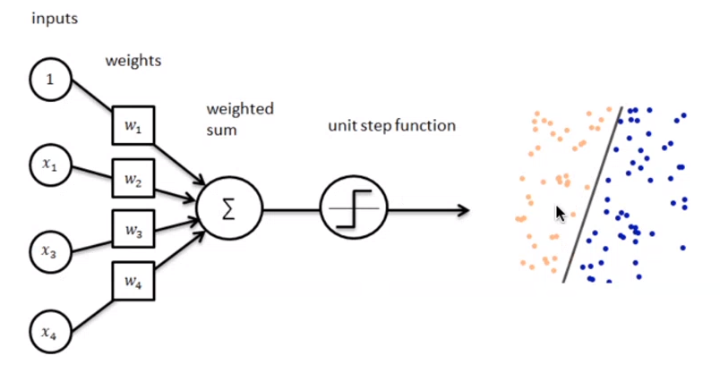


#### 4.3.1 Definizioni preliminari

Introduciamo alcune notazioni: 

* Sia $D=\{(x_1, d_1), ..., (x_n, d_n)\}$ il training set, con $x_j$ una tupla e $d_j$ la rispettiva classe (0 o 1).
* Sia $r$ il **learning rate**, un valore tra 0 e 1 che determina la grandezza della variazione dei pesi ad ogni passo, $r$ è un iperparametro.
* Sia $y_j=f(x_j)$ la classe di output predetta dal perceptron (0 o 1) per la j-esima tupla del training set D. 
* $x_{j,i}$ rappresenta l' i-esimo attributo della j-esima tupla $x_j$ del training set D. 
* Si pone convenzionalmente $x_{j,0} = 1$ (l'attributo di indice 0).
* Sia $w_i(t)$ il peso della i-esima feature al passo *t*. 

Dal momento che $x_{j,0} = 1$, allora $w_0(t)$ equivale alla **costante** *b* nell'espressione $f(X)$. 


#### 4.3.2 Procedura 

Supponiamo che ogni tupla del dataset abbia *k* attributi, l'algoritmo Perceptron esegue i seguenti passaggi

* (1) Inizializza i pesi $w_i(t = 0)$ al valore 0 o ad un valore random piccolo. 

* (2) Per ogni coppia $(x_i, d_i) \in D$ : 

  * (2.1) Calcola l'output attuale: 

  $$
  y_j(t) = f[w(t) * x_i] = f[w_0(t) x_{j,0} + w_1(t) x_{j,1} + ... + w_k(t) x_{j,k}]
  $$

  * (2.2) Aggiorna ognuno dei pesi $w_j$: 

  $$
  w_j(t+1) = w_j(t) + r*(d_i - y_i(t)) * x_{i,j}
  $$

* (3) Nel caso di learning offline, ripeti il passo n.2 sino a quando l'errore medio di classificazione è inferiore ad una soglia $\gamma$, oppure un numero predefinito di iterazioni è stato completato. 

N.B. L'errore medio di classificazione è ottenuto attraverso la seguente formula: 
$$
E = \frac{1}{n} \sum_{i=1}^n |d_i - y_j(t)|
$$
Nella pratica, il passo 2 viene iterato affinché la retta (o in generale, l'iperpiano) trovi i coefficienti adatti a separare l'intero dataset in due classi distinte. Ipotizziamo che al tempo *t* vi sia un errore, l'aggiornamento dei pesi ridefinirà ognuno dei pesi (da utilizzare al prossimo passo $t + 1$) come segue: 
$$
w_j(t+1) = w_j(t) + r*(d_i - y_i(t)) * x_{i,j}
$$
Dove: 

* $w_j(t)$ è la componente j-esima del vettore dei pesi al tempo t
* $d_i - y_i(t)$ sarà nullo nel caso in cui la classificazione sia corretta, -1 nel caso in cui il punto sta al di sotto della retta (o dell'iperpiano), 1 nel caso in cui sia al di sopra. 
* $x_{i,j}$ è la j-esima componente del punto $x_i$, classificato al tempo *t*.
* *r* è il learning rate, che a seconda della grandezza definisce con quale velocità la retta (o l'iperpiano) converge alla posizione ideale. Tuttavia, un learning rate alto potrebbe causare più errori durante il procedimento.  

<div style="page-break-after: always;"></div>

## 5. Support Vectors machines

### 5.1 Idea generale

Il metodo Support Vectors Machines è un metodo di classificazione *binaria*, ovvero le osservazioni sono classificate in due sole classi. Se i dati del training set sono **linearmente separabili**, allora l'SVM trova l'iperpiano separatore ottimale, ovvero quell'iperpiano che li separi al meglio. Se i dati non sono linearmente separabili, allora essi vengono prima trasferiti in uno spazio con un **numero di dimensioni maggiore**, attraverso una operazione di *mapping*. Con l'aumentare delle dimensioni aumenta anche il volume dello spazio e, di conseguenza, i dati tendono a separarsi maggiormente, per cui è molto più probabile che diventino linearmente separabili. Si può dimostrare che per ogni insieme di dati esiste uno spazio con un numero di dimensioni sufficientemente grande tale che i dati siano linearmente separabili. Una volta eseguito il mapping, SVM procede trovando l'iperpiano separatore ottimale.  


### 5.2 Iperpiano ottimale e vettori di supporto

Definiamo i **vettori di supporto** (support vectors) come le osservazioni più vicine all'iperpiano separatore. Tali osservazioni sono le più complesse da classificare; in generale più un punto è lontano dall'iperpiano separatore, più è certa la appartenenza alla classe. 

I vettori di supporto servono a stabilire quale tra gli iperpiani che separano linearmente i punti è quello ottimale. Introduciamo i **margini** come le distanze tra questi vettori di supporto e l'iperpiano. L'iperpiano separatore ottimale è quello che massimizza i margini. 

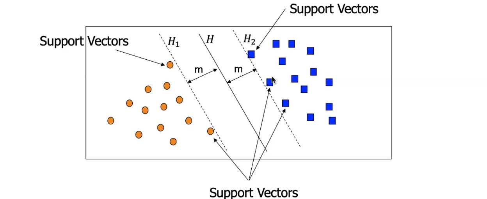


<div style="page-break-after: always;"></div>

### 5.3 Condizioni sui punti

Possiamo rappresentare un iperpiano a $k$ dimensioni con la seguente equazione: 
$$
\bar{w} * \bar{x} + b = 0 \\
w_1*x_1 + ... + w_k*x_k + b = 0
$$
Dove con $\bar{w} * \bar{x}$ si intende il prodotto scalare tra un vettore dei pesi $\bar{w}$ e delle incognite $\bar{x}$, e $b$ è uno scalare detto *bias*. Essendovi due classi, possiamo stabilire la classe di una osservazione a seconda che stia sopra o sotto l'iperpiano. Sia $\bar{x}$ una osservazione, allora: 
$$
\bar{w} * \bar{x} + b > 0 \Rightarrow class(\bar{x}) = +1 \\
\bar{w} * \bar{x} + b < 0 \Rightarrow class(\bar{x}) = -1
$$
Tuttavia, utilizzando solo questa condizione andrebbe bene qualsiasi iperpiano che separi le due classi. Imponiamo invece che ogni punto al di sopra dell'iperpiano rispetti la seguente condizione: 
$$
(1) \space class(\bar{x}) = +1 \Longleftrightarrow \bar{w} * \bar{x} + b \ge +1
$$
 Simmetricamente, per i punti al di sotto dell'iperpiano: 
$$
(2) \space class(\bar{x}) = -1 \Longleftrightarrow \bar{w} * \bar{x} + b \le -1
$$
Se un punto rappresenta un vettore di supporto, ovvero risiede nella frontiera della separazione, allora: 
$$
(1.1) \space class(\bar{x}) = +1 \space  and \space \bar{x} \space is \space support \space vector\Longleftrightarrow \bar{w} * \bar{x} + b = +1 \\
(2.1) \space class(\bar{x}) = -1 \space  and \space \bar{x} \space is \space support \space vector\Longleftrightarrow \bar{w} * \bar{x} + b = -1 \\
$$
Risulta scomodo dover considerare due condizioni (1, 2) da applicare ai punti. È possibile ridurre entrambe le espressioni ad una sola espressione, introducendo la variabile $y_i$ come segue:  
$$
y_i = \begin{cases}
+1 \space if \space class(x_i) = +1 \\
-1 \space if \space class(x_i) = -1 \\
\end{cases}
$$
Le condizioni vengono ridotte alla seguente espressione: 
$$
(3.1) \space y_i(\bar{w} * \bar{x} + b) \ge 1
$$
O anche: 
$$
(3.2) \space y_i(\bar{w} * \bar{x} + b) - 1\ge 0
$$
Esempio: consideriamo un punto al di sotto dell'iperpiano separatore, per cui $y_i = -1$. Se il punto rispetta il vincolo (2), producendo un certo scalare $a < -1$, allora il prodotto rispetta il vincolo (3): 
$$
y_i(\bar{w} * \bar{x} + b) \ge 1 = (-1)(a) \ge 1
$$
Analogamente per i punti al di sopra dell'iperpiano. 

<div style="page-break-after: always;"></div>

### 5.4 Larghezza del margine

L'obiettivo principale è quello di massimizzare il margine, ovvero la distanza tra i vettori di supporto delle due diverse classi. Ma come otteniamo la larghezza del margine? Consideriamo un vettore di supporto $v$ di classe $+1$ ed un vettore di supporto $u$ di classe $-1$. Ipotizziamo di avere il versore w normale all'iperpiano:  

  

Per ottenere la larghezza del margine, basterebbe proiettare i due vettori di supporto sul versore normale e calcolarne la differenza: 

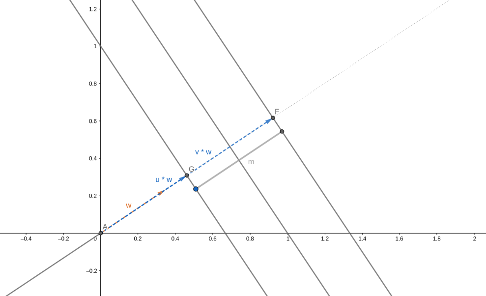

<div style="page-break-after: always;"></div>

Il vettore dei pesi $\bar{w}$ è ortogonale rispetto all'iperpiano risultante. Per ottenere un versore normale all'iperpiano basta dividere il vettore $\bar{w}$ per la sua norma $||\bar{w}||$:  
$$
\hat{w} = \frac{\bar{w}}{||\bar{w}||}
$$
Per cui, definendo con $m$ la larghezza del margine, abbiamo che: 
$$
(4) \space m = (\bar{v} - \bar{u})*\hat{w} = (\bar{v} - \bar{u})*\frac{\bar{w}}{||\bar{w}||}=
\frac{\bar{v}*\bar{w} - \bar{u}*\bar{w}}{||\bar{w}||}
$$
Ricordiamo che valgono le condizioni sui vettori di supporto. Iniziamo con $\bar{v}$ che è vettore di supporto per la classe $+1$, per cui dalla condizione (1.1) abbiamo che: 
$$
(4.1) \space \bar{w} * \bar{v} + b = +1 \Rightarrow \bar{w} * \bar{v} = 1 - b
$$
Simmetricamente, per il vettore di supporto $\bar{u}$ di classe $-1$ abbiamo che: 
$$
(4.2) \space \bar{w} * \bar{u} + b = -1 \Rightarrow \bar{w} * \bar{v} = -1 - b
$$
Sostituendo le espressioni 4.1 e 4.2 alla 4, otteniamo che: 
$$
m =\frac{\bar{v}*\bar{w} - \bar{u}*\bar{w}}{||\bar{w}||} 
= \frac{1-b-(-1-b)}{||\bar{w}||} 
=\frac{1 - b + 1 + b}{||\bar{w}||}
= \frac{2}{||\bar{w}||}
$$


### 5.5 Massimizzare il margine

Trovare l'iperpiano ottimale significa trovare quell'iperpiano che massimizzi la larghezza del margine:
$$
\max \frac{2}{||\bar{w}||}
$$
Tuttavia, gli studi dimostrano che è matematicamente più conveniente considerare l'analogo problema: 
$$
\max \frac{2}{||\bar{w}||} = \min ||\bar{w}|| = \min \frac12 ||\bar{w}||^2
$$
Rispetto alla condizione: 
$$
y_i(\bar{w}*\bar{x}_i - b) \ge 1
$$

<div style="page-break-after: always;"></div>

### 5.6 Hard margin e soft margin

Sino ad ora abbiamo considerato il vincolo (3.1) molto restrittivo, per cui all'interno dei margini non vi può risiedere alcun punto. Questo metodo prende il nome di **hard margin**. Si tratta di una scelta molto rigida, che porta ad un modello estremamente sensibile al rumore. In presenza di rumore, è molto probabile che il modello hard margin produca un iperpiano con una zona di margine molto ristretta, o in generale è frequente ottenere errori da overfitting su dati reali. 

Un modello meno sensibile al rumore è il **soft margin**, il che consiste nell'ammettere che alcuni punti possano trovarsi nella zona di margine, violando i vincoli. Tuttavia, un soft margin troppo permissivo rischia di compromettere l'accuratezza del classificatore. Occorre dunque un trade-off tra la larghezza del margine ed il numero di violazioni del margine consentite al classificatore.


### 5.7 Classificazione soft margin 

Nella classificazione soft margin vengono introdotte *n* variabili di **slack** $\epsilon_1, ..., \epsilon_n$, dove l'i-esima variabile è definita come segue: 
$$
\max \left( 0, 1 - y_i(\bar{w}_i * \bar{x}_i - b) \right)
$$
Ricordiamo che per ogni punto al di fuori dei margini vale il vincolo: 
$$
y_i(\bar{w} * \bar{x}_i - b) \ge 1
$$
Per cui se l'i-esimo punto rispetta il vincolo, allora: 
$$
1 - y_i(\bar{w} * \bar{x}_i - b) \le 0 \Longrightarrow \epsilon_i = \max\left(0, 1 - y_i(\bar{w} * \bar{x}_i - b)\right) = 0
$$
Altrimenti, se l'i-esimo punto non è classificato correttamente, ovvero si trova tra  $H_1$ e $H_2$, $\epsilon_i$ è proporzionale alla distanza del punto dal margine della classe corrispondente; ovvero più è distante dal margine della classe corretta, più il valore $\epsilon_i$ è alto. $\epsilon_i$ è il più piccolo numero non negativo che soddisfa la seguente disuguaglianza: 
$$
y_i(\bar{w} * \bar{x}_i - b) \ge 1 - \epsilon_i
$$

<div style="page-break-after: always;"></div>

Vogliamo che in media gli $\epsilon_i$ siano piccoli.  Introduciamo un parametro $\lambda$ che costituisce il trade-off tra larghezza del margine e numero di violazioni tollerate. Il problema di ottimizzazione diventa: 
$$
\min \left( \frac{1}{n} \sum_{i=1}^n \epsilon_i + \lambda||\bar{w}||^2 \right) 
$$
Soggetto alle condizioni: 
$$
y_i(\bar{w} * \bar{x}_i - b) \ge 1 - \epsilon_i \space\space\space\space\space 1 < i< n \\
\epsilon_i \ge 0 \space\space\space\space \space 1 < i< n
$$
Più piccolo è il valore $\lambda$, più trascurabile è $\lambda*||\bar{w}||^2$, ovvero meno importante è la dimensione del margine. Variando $\lambda$ possiamo controllare il peso della dimensione del margine nel calcolo dell'iperpiano separatore. 

Utilizzando la **formulazione di Lagrange**, il problema precedente è traducibile nel seguente problema duale: 
$$
\max \left( \sum_{i=1}^n c_i - \frac12 \sum_{i,j=1}^n c_i c_j y_i y_j(\bar{x}_i*\bar{x}_j) \right)
$$
Soggetto alle condizioni: 
$$
(1) \space \sum_{i=1}^n c_i y_i = 0 \space \space \space i=1,...,n \\
(2) \space 0 \le c_i \le \frac{1}{2n\lambda} \space \space \space i=1,...,n \\
$$
Dove $c_i$ sono i moltiplicatori di Lagrange. Dal momento che la funzione duale è quadratica in $c_i$, è possibile ricavare tali moltiplicatori utilizzando algoritmi di programmazione quadratica. Una volta ricavati, è possibile calcolare il vettore dei pesi come segue: 
$$
\bar{w} = \sum_{i=1}^n c_i y_i \bar{x}_i
$$
Mentre la costante di *bias* $b$ può essere calcolata prendendo uno tra i vettori di supporto $\bar{x}_i$ e risolvendo la seguente equazione rispetto a $b$: 
$$
y_i(\bar{w}_i*\bar{x}_i - b) = 1  \Rightarrow b = \bar{w}_i*\bar{x} - y_i^{-1}
$$

<div style="page-break-after: always;"></div>

### 5.8 Mapping di dati non linearmente separabili

Nel caso in cui i dati non siano linearmente separabili, lo spazio di input viene mappato in un nuovo spazio con più dimensioni attraverso una **funzione di mapping** $\phi$. Nel nuovo spazio i punti risultano linearmente separabili, quindi è possibile risolvere lo stesso problema di ottimizzazione visto prima, in cui al posto di $\bar{x}_i$ abbiamo $\phi(\bar{x}_i)$. 

**Esempio**: poniamoci in uno spazio a 3 dimensioni, in cui le osservazioni sono vettori $\bar{x} = (x_1, x_2, x_3)$. Supponiamo che in tale spazio, i dati non siano linearmente separabili. Utilizziamo la seguente funzione di mapping: 
$$
\phi: \R^3 \rightarrow \R^6  \\
\phi(\bar{x}) = (x_1, x_2, x_3, x_1^2, x_1x_2, x_1x_3)
$$
La funzione ricava le ulteriori 3 dimensioni moltiplicando ad ognuna delle componenti la componente $x_1$. L'equazione dell'iperpiano separatore nello spazio $\R^6$ sarà: 
$$
H = \bar{w}_i * \phi(\bar{x}) - b = 0
$$
In generale, il problema di ottimizzazione posto precedentemente è riproponibile utilizzando la funzione $\phi$ che mappa i dati in input: 
$$
\max \left( \sum_{i=1}^n c_i - \frac12 \sum_{i,j=1}^n c_i c_j y_i y_j(\phi(\bar{x}_i)*\phi(\bar{x}_j)) \right)
$$
Soggetto alle condizioni: 
$$
(1) \space \sum_{i=1}^n c_i y_i = 0 \space \space \space i=1,...,n \\
(2) \space 0 \le c_i \le \frac{1}{2n\lambda} \space \space \space i=1,...,n \\
$$

<div style="page-break-after: always;"></div>

### 5.9 Funzioni kernel

Il prodotto $\phi(\bar{x}_i)*\phi(\bar{x}_j)$ può essere più dispendioso da calcolare, dal momento in cui ci troviamo in uno spazio a più elevata dimensionalità. Per ovviare al problema, si utilizzano le funzioni di kernel. Una **funzione di kernel K** è una funzione che soddisfa la condizione: 
$$
K(\bar{x}_i,\bar{x}_j) =\phi(\bar{x}_i)*\phi(\bar{x}_j)
$$
Essa definisce implicitamente il mapping nel nuovo spazio. Permette di sostituire al prodotto scalare il valore stesso della funzione kernel e di effettuare tutti i calcoli direttamente nello spazio originario che ha meno dimensioni. Vediamo di seguito alcune funzioni kernel tipiche. 

**Kernel polinomiale di grado H**
$$
K(\bar{x}_i,\bar{x}_j) = \left( \bar{x}_i * \bar{x}_j + 1 \right)^h
$$
**Kernel gaussiano**
$$
K(\bar{x}_i,\bar{x}_j) = \exp(-\frac{||\bar{x}_i - \bar{x}_j||^2}{2\sigma^2})
$$
**Kernel sigmoide**
$$
K(\bar{x}_i,\bar{x}_j) = \tanh \left( k\bar{x}_i * \bar{x}_j - \delta \right)
$$

Durante la costruzione del modello discriminativo è bene provare più funzioni kernel e selezionare quella più adatta, in base ad un indice di performance.  
Infine possiamo quindi rappresentare il problema di ottimizzazione mediante funzione di kernel come segue: 
$$
\max \left( \sum_{i=1}^n c_i - \frac12 \sum_{i,j=1}^n c_i c_j y_i y_jK(\bar{x}_i,\bar{x}_j)) \right)
$$
Soggetto alle condizioni: 
$$
(1) \space \sum_{i=1}^n c_i y_i = 0 \space \space \space i=1,...,n \\
(2) \space 0 \le c_i \le \frac{1}{2n\lambda} \space \space \space i=1,...,n \\
$$


### 5.10 Conclusioni

Alcune implementazioni di SVM permettono di classificare i dati su più di due classi. L'SVM si presta bene a classificare dati ad elevata dimensionalità ed è meno soggetto ad overfitting rispetto ad altri metodi. 

<div style="page-break-after: always;"></div>


## 6. Lazy Learning

### 6.1 Apprendimento eager contro lazy 

I modelli classificativi o predittivi possono portare a compimento i propri task con un certo livello di accuratezza imparando dai dati di training. Vi sono due tipi di apprendimento: il primo viene chiamato apprendimento **eager** (impaziente), il secondo prende il nome di apprendimento **lazy** (pigro). 

* **Apprendimento eager** (eager learning): dato un training set, si costruisce un modello prima di ricevere nuovi dati da classificare. 
* **Apprendimento lazy** (lazy learning): semplicemente memorizza il training set di dati e calcola la funzione di classificazione nel momento in cui c'è da classificare un nuovo dato. 

Tutti i metodi visto fin qui effettuano un apprendimento eager. 

I metodi di apprendimento lazy hanno un tempo di predizione più alto, mentre il training è molto veloce, poiché richiede solo la memorizzazione dei dati. La funzione di predizione è approssimata localmente. I metodi lazy sono utili nel caso di grandi dataset con pochi attributi e che si aggiornano continuamente (es. detaset di contenuti multimediali).  Per quest'ultimo motivo sono molto utilizzati nei *sistemi di raccomandazione* (predizione della preferenza che potrebbe esprimere un utente su un item, come un film o un prodotto commerciale). Un esempio di algoritmo che sfrutta l'apprendimento lazy è il kNN. 


### 6.2 kNN - K-Nearest Neighbors


#### 6.2.1 Nearest neighbor algorithm 

Supponiamo di avere in input un nuovo dato $x$ da classificare. Una buona idea sarebbe quella di assegnare a tale dato la classe dell'osservazione $\bar{x}$ più vicina. È necessario quindi utilizzare una funzione distanza $d(x,\bar x)$ da minimizzare, e molto spesso tale funzione corrisponde alla distanza euclidea: 
$$
d(x,\bar x) = ||x - \bar x||_2 = \frac 1 n \sqrt{\sum_{i=1}^n (x - \bar x)^2}
$$
Dove $n$ è il numero di feature delle osservazioni. In tal caso la funzione $f$ di classificazione non dovrà fare altro che trovare quel dato del training set $\bar x$ che minimizzi la funzione distanza $d$: 
$$
f(x) = arg \min_\bar x d(x,\bar x)
$$


#### 6.2.2 K-Nearest neighbor algorithm

L'algoritmo precedente non tiene conto dei possibili outliers presenti nel training set, di conseguenza un'idea più accurata è quella di trovare, anziché uno, i primi $k$ dati più vicini al dato in input. 


#### 6.2.3 Definizione formale dell'algoritmo

Una volta individuata la funzione distanza $d$ più appropriata, definiamo: 
$$
N(x'; TR, K) = \left\{ (x,y) \in TR : d(x',x) \le \epsilon_k(x';TR,K) \right\}
$$
L'intorno di centro $x'$ e di raggio $\epsilon_k$ contenente le $k$ osservazioni più vicine ad $x'$. $TR$ indica il training set e $K$ è l'iperparametro scelto dall'utente. Determiniamo il raggio $\epsilon_k$ tramite tale definizione: 
$$
\epsilon_k(x'; TR, K) = \epsilon : |\{ (x,y) \in TR : d(x,x') \le \epsilon \}| = K
$$
Ovvero quel raggio dell'intorno centrato in $x'$ che comprenda esattamente i $K$ più vicini ad $x'$. Definiamo infine la funzione $f$ di classificazione come segue: 
$$
f(x') = moda \{ y : (x,y) \in N(x',TR,K) \}
$$
Dove per moda si intende la funzione statistica che individua l'elemento più frequente. In questo caso controlla qual è l'etichetta $y$ più frequente nei $K$ elementi più vicini all'elemento in input. 

<div style="page-break-after: always;"></div>


#### 6.2.4 Scelta di K 

Consideriamo le seguenti mappe le quali individuano, al variare di $K$, la classe predominante in una porzione di area. Se $K$ è particolarmente piccolo (primo quadrante), allora il piano verrà segmentato in piccole porzioni di area con classi diverse e ciò può provocare overfitting. Tuttavia, un $K$ troppo grande andrebbe ad approssimare eccessivamente la scelta, per cui l'algoritmo risulterebbe meno accurato e si avrebbe underfitting. L'iperparametro va calibrato attraverso delle prove su un set di validazione. 

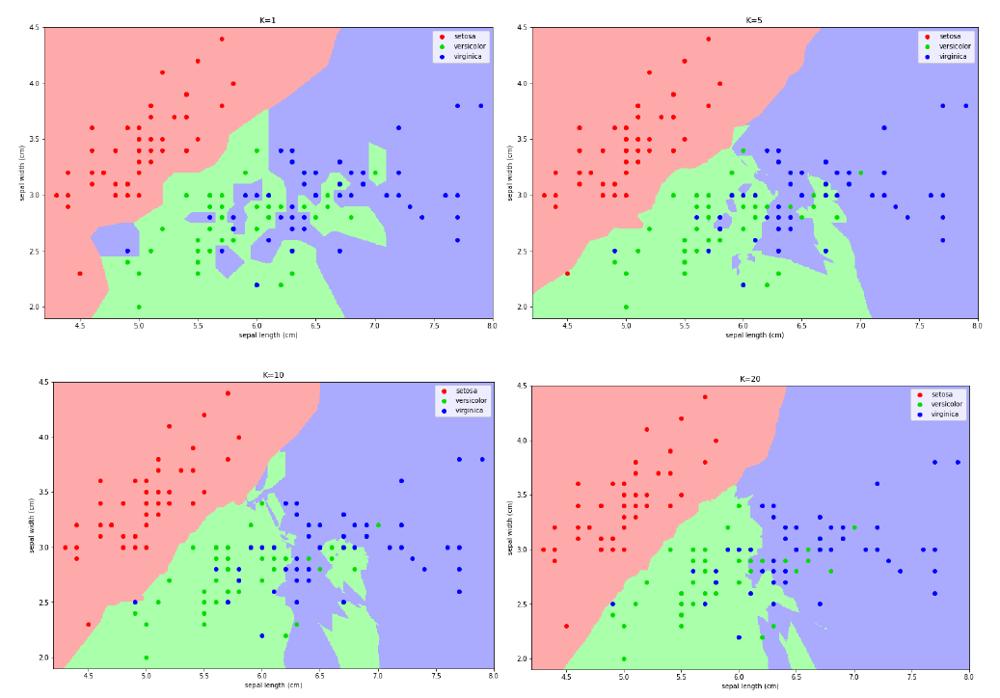


#### 6.2.5 Varianti implementative

Una variante più sofisticata del kNN potrebbe pesare gli oggetti sulla base della distanza: 

* Assegna un peso ad ogni oggetto sulla base della distanza dal punto da classificare. 
* I punti più vicini hanno un peso maggiore nella classificazione.
* Il peso potrebbe essere calcolato come l'inverso del quadrato della distanza.


#### 6.2.6 Importanza del kNN

Come detto in precedenza, molto spesso è difficile interpretare i risultati degli algoritmi di classificazione (come quelli forniti dalle reti neurali). Nel caso del kNN è possibile utilizzare un *k* sufficientemente grande e, una volta selezionati i k oggetti più vicini, creare un albero decisionale su tali oggetti che riesca a fornire delle spiegazioni più o meno chiare rispetto all'associazione. Perché allora non costruire un albero decisionale direttamente sui dati di training del kNN? Questo poiché molto spesso si ha a che fare con mole di dati molto ampia, per cui gli alberi decisionali diventano dispendiosi e sconvenienti; al contrario, con kNN si riesce ad estrarre un sottoinsieme di dati localmente connesso al dato da esaminare. 

<div style="page-break-after: always;"></div>


## 7. Apprendimento ensemble


### 7.1 Idea principale

L'idea dell'apprendimento ensemble è quella di combinare due o più modelli di apprendimento al fine di ottenere migliori performance di predizione rispetto ai modelli presi singolarmente. In altre parole, vanno combinate ipotesi multiple al fine di ottenere una migliore ipotesi predittiva. Generalmente, con il termine ensemble learning si intende una combinazione di modelli dello stesso tipo (es. alberi decisionali, SVM, etc.). L'ensemble learning richiede molta più computazione, quindi ha senso solo se è usato per combinare algoritmi di apprendimento veloci (come gli alberi decisionali) che non hanno elevata accuratezza se presi singolarmente. Il problema principale è come addestrare i classificatori e come combinarne i risultati. 


### 7.2 Bootstrap o bagging 

Una tecnica comune di ensemble learning è il *bootstrap* o *bagging*. Siano $M_1, ..., M_k$ i $k$ modelli da combinare. Dividiamo il training set in $k$ sottinsiemi $T_1, ..., T_k$ ottenuti mediante campionamento random delle tuple *con ripetizioni* (*bootstrap sampling*).  Il modelo $M_i$ viene addestrato con il training set $T_i$. Nel caso della predizione, viene restituita la media dei valori predetti, mentre nel caso della classificazione si restituisce l'etichetta di maggioranza, ovvero quella predetta dal maggior numeri di classificatori. 


### 7.3 Random forest

Il *Random Forest* è un esempio di modello (classificatore o predittore) ensemble che combina i risultati di diversi alberi decisionali mediante la tecnica bootstrap. In più il Random Forest addestra ciascun albero con un sottoinsieme random di $m$ attributi (*bagging sugli attributi*). Tipicamente se $p$ è il numero totale di attributi, $m = \sqrt{p}$ per la classificazione, $m= \frac p 3$ per la predizione. Attributi che risultano essere predittori molto forti vengono prontamente selezionati dagli alberi decisionali. Il bagging sugli attributi diminuisce la correlazione tra i risultati degli alberi.

<div style="page-break-after: always;"></div>


## 8. Validazione di un classificatore


### 8.1 Matrice di confusione 

La matrice di confusione è una struttura utile a rappresentare l'accuratezza di un classificatore. Da tale matrice derivano varie metriche che analizzeremo in dettaglio. Sulle righe sono disposti i valori reali, mentre sulle colonne i valori predetti. Vediamo un esempio in figura: 

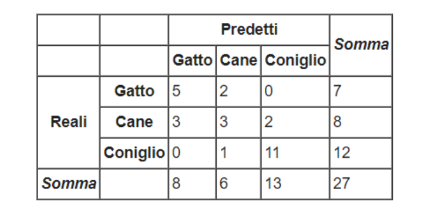

L'elemento $c_{i,j}$ contiene il numero di casi in cui il classificatore ha classificato l'osservazione nella classe $j$, quando la classe di appartenenza è $i$. Nel caso in cui $j = i$ allora la classe predetta è corretta: un buon classificatore ha valori alti nella diagonale principale e valori nulli (o molto bassi) nelle altre posizioni. 


### 8.2 Accuratezza & Error rate

Dato un classificatore $M$ e la sua matrice di confusione $C$, l'indice di *accuratezza* misura la percentuale di tuple classificate correttamente da $M$. Nella pratica è molto semplice da calcolare: vengono sommati tutti i valori della diagonale principale e viene rapportata la somma al numero totale di osservazioni classificate. Nell'esempio precedente avremo: 
$$
acc(M) = \frac {19} {27} = 70.37 \space \%
$$
Al contrario, possiamo misurare la percentuale di errore, o *error-rate*, del classificatore sommando tutti gli elementi che non risiedono nella diagonale principale e rapportandoli al numero totale di osservazioni classificate. Tuttavia, l'error-rate è complementare all'accuratezza, per cui è possibile calcolare solo la prima e derivare l'errore come segue: 
$$
\text{ErrorRate}(M) = 1 - acc(M)
$$

<div style="page-break-after: always;"></div>


### 8.3 Accuratezza per classificatori binari 

Supponiamo di avere un dataset con due sole classi, una indicata come $P$ (positiva) ed una indicata come $N$ (negativa). Indichiamo con $Pos$ e $Neg$ l'insieme delle osservazioni di classe $P$ ed $N$ rispettivamente. Sulla base dell'esito della classificazione possiamo distinguere 4 sottoinsiemi di tuple: 

| Nome           | Descrizione                           | Simbolo   |
| -------------- | ------------------------------------- | --------- |
| True positive  | tuple di classe P classificate come P | $T_{pos}$ |
| True negative  | tuple di classe N classificate come N | $T_{neg}$ |
| False positive | tuple di classe N classificate come P | $F_{pos}$ |
| False negative | tuple di classe P classificate come N | $F_{neg}$ |

Vedremo adesso una lista di metriche possibili solo nel caso di un classificatore binario, che evidenziamo particolari aspetti del classificatore. 


#### 8.3.1 Metriche per classificatori binari

La *recall*, anche chiamata *sensitività* o più tecnicamente *true positive rate*, è la percentuale di osservazioni positive classificate correttamente: 
$$
\text{recall}(M) = \text{TPR}(M) = \frac {|T_{pos}|} {pos}
$$
La *specificità*, o più tecnicamente *True Negative Rate*, è la percentuale di osservazioni negative classificate correttamente: 
$$
\text{TNR}(M) = \frac {|T_{neg}|} {neg}
$$
La *false positive rate* è la percentuale di osservazioni negative classificate come positive. Ipotizziamo che il modello classifichi pazienti tra positivi ad un tipo di tumore o negativi: si vuole una FPR tendenzialmente bassa per evitare che al paziente siano provvisti risultati sgradevoli. 
$$
\text{FPR}(M) = \frac {F_{pos}} {neg}
$$
Il *false discovery rate* è una metrica che indica la percentuale di falsi positivi rispetto a tutte le osservazioni classificate come positive (corrette o meno che siano): 
$$
\text{FDR}(M) = \frac {F_{pos}} {F_{pos} +  T_{pos}}
$$
La *precision* è la percentuale di osservazioni classificate correttamente come positive rispetto alle osservazioni classificate positive (corrette o meno che siano): 
$$
\text{precision}(M) = \frac {T_{pos}} {F_{pos} +  T_{pos}}
$$

<div style="page-break-after: always;"></div>

Qual è la differenza tra precision e recall? Ipotizziamo di avere un dataset di 50 osservazioni, 25 di classe P e 25 di classe N. Ipotizziamo che il classificatore classifichi solo 5 osservazioni come positive, e che tali classificazioni siano corrette. Il modello non è stato in grado di rilevare la maggior parte delle osservazioni positive, di fatto avremo una recall del 20% ($\frac 5 {25}$). Tuttavia, le osservazioni classificate come positive sono tutte corrette, per cui la precision è del 100% ($\frac 5 5$).

Sia la precision che la recall sono importanti quando si giudica un classificatore, è però possibile valutare entrambi attraverso una sola metrica, chiamata *score F1*. Lo score F1 è compreso tra 0 ed 1 e consiste in una media armonica tra le due metriche: 
$$
F_1 =2 \times \frac {precision · recall} {precision + recall}
$$
Se sia la precision che la recall hanno un valore alto, allo lo score F1 sarà anch'esso alto. Questa è una proprietà della media armonica, per cui si preferisce rispetto alla media canonica. Vediamo la differenza tra le due: 

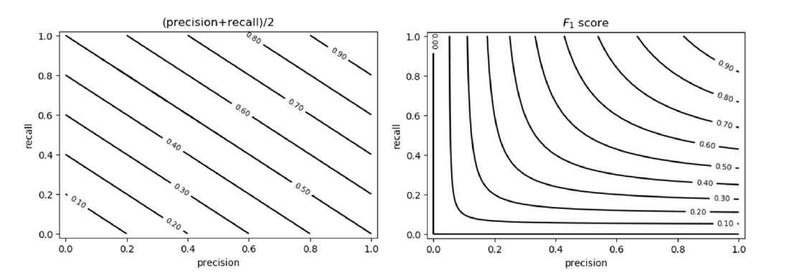


#### 8.3.2 Soglia discriminativa nei classificatori binari

Se il classificatore in analisi utilizza un valore soglia $\sigma$ per effettuare la classificazione, allora le misure di performance vanno rivalutate al variare della dosglia discriminativa. 


### 8.4 Receiver Operating Characteristic Curva (ROC)

La *curva ROC* rappresenta il True Positive Rate (TPR), detto anche *numero di hits*, in funzione del False Positive Rate (FPR), detto anche numero di falsi allarmi, al variare della soglia $\sigma$. Vediamo due casi limite: 

a) Nel caso limite in cui la soglia $\sigma$ sia così alta che tutte le tuple sono classificate come negative, allora significa che nessuna tupla sarà classificata come positiva. Per cui entrambe le metriche TPR e FPR saranno nulle. 

b) Nel caso limite in cui la soglia $\sigma$ sia cosi bassa che tutte le tuple sono classificate come positive, allora significa che tutte le tuple negative sono classificate come positive, per cui il False Positive rate è massimo (FPR = 1), ed anche tutte le tuple positive sono classificate come positive (TPR = 1). 

Al dminuire della soglia, aumenta il numero di tuple classificate come positive e contestualmente entrambi gli indici aumentano (in misura diversa). La situazione ideale è quella in cui TPR aumenta fino a raggiungere il valore 1 ed FPR si mantiene pari a 0, per cui si ha il miglior classificatore. La curva roc diventa banalmente una funzione scala.  Un classificatore random avrà sempre uguali valori di TPR ed FPR al variare di $\sigma$. 


### 8.5 Precision-Recall curve (PR)

La curva ROC è ottima nel caso di dataset *bilanciati*, mentre in presenza di dataset *sbilanciati* è più conveniente analizzare la curva PR, che rappresenta la *precision* in funzione della *recall* al variare della soglia discriminativa $\sigma$. 

a) Nel caso limite in cui la soglia $\sigma$ sia così alta che tutte le tuple sono classificate come negative, allora significa che nessuna tupla sarà classificata come positiva. La recall sarà nulla poiché nessuna osservazione positiva sarà rilevata, mentre la precision sarà massima poiché tutte le osservazioni positive rilevate (0) sono correttamente classificate. 

b) Nel caso limite in cui la soglia $\sigma$ sia cosi bassa che tutte le tuple sono classificate come positive, allora significa che tutte le tuple positive verranno rilevate, per cui la recall = 1. Tutta via la precision sarà bassa poiché il numero di osservazioni positive classificate correttamente è diviso alla cardinalità del dataset.  

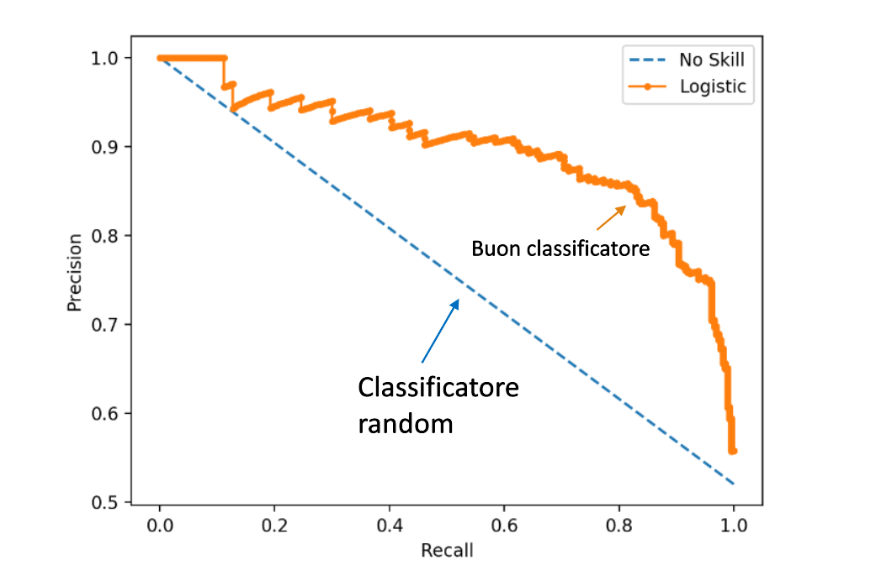


### 8.6 Area under the curve (AUC)

Come indicatore di accuratezza del classificatore si fa riferimento all'area sottesa alla curva, chiamata AUC (area under the curve). Tale metrica vale sia per le curve ROC che per le PR. Essa assume valori tra 0 ed 1, dove 1 denota un classificatore perfetto. 


### 8.7 Validazione di un classificatore

Per validare un classificatore viene partizionato il dataset in training set, test set ed eventualmente un validation set su cui testare gli iperparametri. Vi sono vari metodi per effettuare il partizionamento, tra cui il metodo holdout ed il k-fold cross-validation. 


#### 8.7.1 Metodo holdout

Fissata una percentuale $X$, il dataset viene partizionato in due set indipendenti, il training set con l'$X$% del dataset e il test set con il $(100-X)$% del dataset. Si addestra il modello sul training set, si classifica il test set e si misurano le performance sui risultati ottenuti. Esiste una variante chiamata *random sampling*, in cui l'holdout viene ripetuto $k$ volte (con le stesse proporzioni), e si calcola la media delle accuratezze ottenute ad ogni esecuzione. 


### 8.7.2 K-fold cross-validation

Fissato $k \in \N$, si partiziona il dataset in $k$ partizioni $D_1, ..., D_k$ approssimativamente della stessa dimensione. Alla 
i-esima iterazione ($1 < i <  k$) si considera la partizione $D_i$ come test set ed il resto come training set. Una estremizzazione del metodo è il *leave one out*, dove $k$ è il numero di tuple ed il test set è di volta in volta una sola tupla. 

