# Predizione

## 1. Introduzione

La predizione è simile alla classificazione poiché costruisce un modello e usa il modello per predire valori per un dato input. La predizione è diversa rispetto alla classificazione poiché la classificazione predice valori categoriali (etichette), mentre la predizione modella funzioni a valori continui. 

Diversi classificatori possono essere utilizzati come predittori (alberi decisionali, SVM), e viceversa (regressione logistica). La tecnica più importante di predizione è la regressione. 


## 2. Regressione

La regressione è una forma di apprendimento supervisionato che consente di apprendere una mappatura tra i dati di input e i corrispondenti output. Esempi di task legati alla regressione sono: 

* Predizione del prezzo di prodotti date delle caratteristiche 
* Predizione del profitto di una certa compagnia
* Contare il numero di automobili presenti in una immagine. 


### 2.2 Definizione formale

Definiremo un regressore come una funzione $f: \R^n \to \R^m$ dove $n$ è la dimensionalità del dominio (features dei dati in input) ed $m$ è la dimensionalità del codominio (features dei dati in output). In generale, ci riferiremo ad un dato in input con $x \in \R^n$, all'output vero legato ad $x$ con $y \in \R^m$ e all'output predetto dal regressore con $\hat y \in \R^m$.  Possiamo predire un valore a partire da $x$: 
$$
\hat y = f(x)
$$
In questo contesto, spesso $x$ è chiamata **variabile indipendente**, mentre $y$ è chiamata **variabile dipendente**. Come visto nella classificazione, possiamo definire una **funzione di rappresentazione** $r:E \to \R^n$ per mappare un input da $e \in E$ ad $\R^n$. Utilizzando la funzione di rappresentazione, possiamo predire il valore per un input $e \in E$: 
$$
\hat y = f(r(e))
$$
Per trovare la **funzione di regressione** $f$ possiamo utilizzare vari metodi a seconda del contesto. Vedremo la regressione lineare, la regressione lineare multipla, la regressione polinomiale e quella logistica. 

<div style="page-break-after: always;"></div>

### 2.3 Misure di performance 

Sia $TE$ il test set su cui validare il regressore. Definiamo: 
$$
Y_{TE} = \{y^i : (x^i,y^i) \in TE\}
$$
l'insieme degli output corretti (o etichette di ground truth), e: 
$$
\hat Y_{TE} = \{\hat y^i: \hat y^i = f(x^i), x^i \in TE \}
$$
l'insieme di output predetti. Idealmente vorremmo che gli output predetti siano quanto più vicini agli output corretti (nel caso migliore $\hat Y_{te} = Y_{te}$). Dal momento in cui gli elementi di entrambi gli insiemi sono vettori di egual dimensione, definiremo le misure di performance come misurazioni di vicinanza o verosimiglianza tra gli output predetti e gli output corretti.  


#### 2.3.1 Mean Squared Error (MSE)

Consideriamo per ogni elemento $x^i$ del test set  $TE$  la corrispondente etichetta di ground truth $y^i$ e l'etichetta predetta dalla funzione di regressione $\hat y^i$. Le etichette hanno dimensione $m$, quindi una buona misura di vicinanza tra le due è spesso la distanza euclidea: 
$$
|| \hat y - y||_2 = \sqrt{ \sum_{i=1}^m (\hat y_i - y_i)^2}
$$
Per risparmiare il tempo computazionale impiegato nel calcolo della radice quadrata, spesso si utilizza la distanza euclidea quadratica: 
$$
error(\hat y, y)=|| \hat y - y||_2^2 = \sum_{i=1}^m (\hat y_i - y_i)^2
$$
A questo punto, l'MSE consiste nel calcolare l'errore medio per tutti gli input del test set: 
$$
MSE(Y_{TE}, \hat Y_{TE}) = \frac 1 {|TE|} \sum_{j=1}^{|TE|} error(\hat y^j, y^j) = 
 \frac 1 {|TE|} \sum_{j=1}^{|TE|} || \hat y^j - y^j||_2^2
$$


#### 2.3.2 Root Mean Squared Error (RMSE)

L'unità di misura dell'MSE è il quadrato dell'unità di misura della variabile dipendente ($y$). Nella pratica, se $y$ è misurata in metri, l'errore MSE sarà misurato in metri quadrati $m^2$. Per ovviare a questo possiamo utilizzare il root mean squared error (RMSE): 
$$
RMSE(Y_{TE}, \hat Y_{TE}) = \sqrt{MSE(Y_{TE}, \hat Y_{TE})}
$$


#### 2.3.3 Mean absolute error (MAE)

Se le etichette sono scalari ($m=1$), allora possiamo misurare l'errore e mantenere la stessa unità di misura attraverso il mean absolute error, ovvero la media delle differenze tra le etichette in valore assoluto: 
$$
MAE(Y_{TE}, \hat Y_{TE}) = \frac 1 {|TE|} \sum_{j=1}^{|TE|} |\hat y^j - y^j|
$$


#### 2.3.4 Differenza tra MSE, RMSE e MAE

Tutte e tre le misure di performance sono **misure di errore**, per cui un buon regressore dovrebbe puntare a minimizzarle. La principale differenza tra gli indici presentati sta nel fatto che MSE e RMSE enfatizzano l'errore al crescere della distanza tra i punti, mentre tralasciano gli errori piccoli. Tuttavia, MAE risulta più intuitivo. 


### 2.4 Casi speciali di regressione

Mentre la regressione può essere definita in maniera generale con una funzione:
$$
f:\R^n \to \R^m
$$
Vi sono alcuni casi molto frequenti in cui vi sono particolari valori di $m$ ed $n$, noi vedremo i seguenti. 

**Regressione semplice**
La regressione semplice prevede che $m = n = 1$, per cui il task consiste nel mappare numeri scalari a numeri scalari con una funzione $f$: 
$$
f:\R \to \R
$$

**Regressione multipla**
La regressione multipla si ha quando $m = 1$ ed $n > 1$, e consiste nel mappare vettori su scalari con una funzione $f$: 
$$
f:\R^n \to \R
$$

**Regressione multivariata**
La regressione multivariata è quella più generale, dove $m > 1$ ed $n$ è arbitrario. Consiste nel mappare vettori o scalari (nel caso $n=1$) su vettori con una funzione $f$: 
$$
f:\R^n \to \R^m
$$

<div style="page-break-after: always;"></div>

## 3. Regressione lineare

Vedremo il metodo della regressione lineare applicata su casi di regressione semplice, multipla e multivariata. 


### 3.1 Regressione lineare semplice

La regressione lineare semplice consiste nel trovare una funzione $f$ di forma $f:\R \to \R$. Per iniziare, consideriamo un esempio in cui il dataset consiste in coppie $(x,y)$ referenti: 

* Il numero medio $x$ di stanze in una casa in un quartiere;
* Il prezzo medio $y$ delle case nel quartiere (misurato in $1000\$s$, es. $30000\$$ = $30$)

Disegniamo un plot del dataset ponendo il numero medio di stanze sull'asse delle $x$ ed il prezzo medio sull'asse delle $y$: 

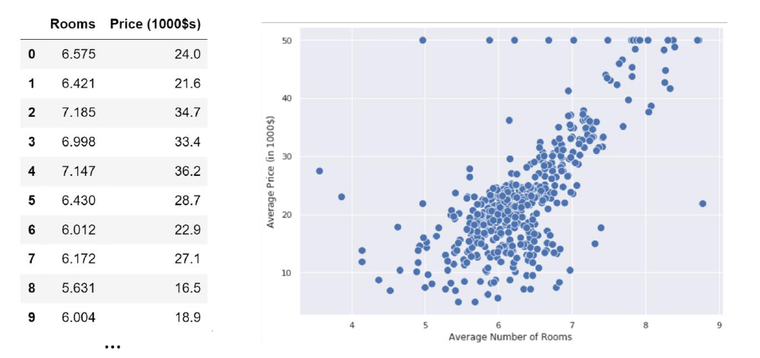

Vorremmo idealmente trovare una funzione $f$ che riesca ad approssimare il prezzo medio delle case $y$ dato un numero di stanze medio $x$. Dal plot osserviamo che il prezzo aumenta proporzionalmente al numero di stanze. Calcolando la covarianza otteniamo $Cov(x,y) = 4.49$, il che è un'altra conferma della correlazione tra le due variabili. Esse seguono circa un andamento lineare, quindi sono approssimativamente distribuite lungo una retta: 


<div style="page-break-after: always;"></div>

Possiamo quindi costruire la nostra funzione di regressione $f$ utilizzando la formulazione analitica di una retta: 
$$
f(x) = mx +q
$$
Dove $m$ è il coefficiente angolare e $q$ è l'intercetta. Anziché $q$ e $m$ utilizzeremo rispettivamente $\theta_0$ e $\theta_1$. Tale notazione ci aiuterà a generalizzare la regressione al caso multiplo. 
$$
f(x) = \theta_0 + \theta_1x
$$
Chiamiamo la funzione $f$ **modello lineare** o **regressore lineare**, dove $\theta_0$ e $\theta_1$ sono i parametri del modello. Allenare un modello lineare significa trovare quei valori nei parametri $\theta_0$ e $\theta_1$ tale che $f(x)$ dia una buona predizione di $y$. Vedremo due metodi per fare ciò: il metodo dei minimi quadrati e la discesa del gradiente. 

Consideriamo il precedente esempio e immaginiamo che qualcuno abbia allenato il modello lineare e che i parametri siano $\theta_0 = -34.67$ e $\theta_1 = 9.10$, per cui il nostro regressore lineare sarà così definito: 
$$
\hat y^i = f(x^i) = (9.1)x - 34.67
$$
Se proviamo a plottare la linea in figura, essa sarà quella retta con maggiore densità lineare e avrà, nel caso migliore, una misura di errore bassa. 

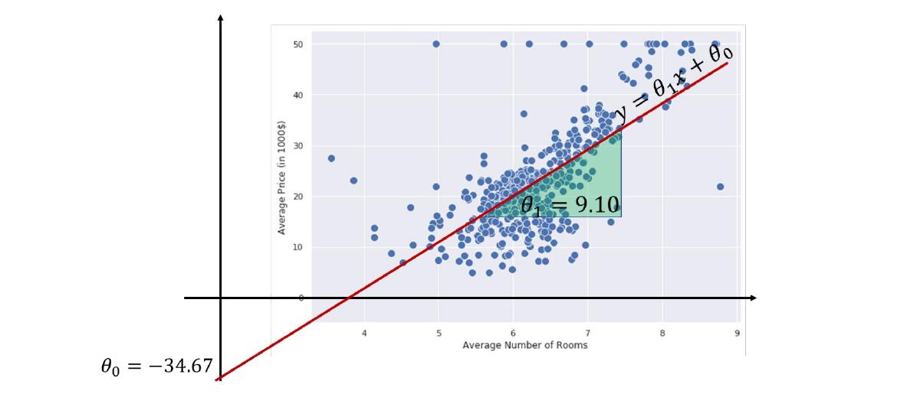


### 3.2 Interpretazione geometrica 

Sappiamo che i valori $\theta$ hanno un ben preciso significato geometrico: 

* $\theta_0$ è l'intercetta: esprime la posizione di $r$ nello spazio, ovvero dove $r$ intercetta la retta $y$ quando $x=0$. 
* $\theta_1$ è il coefficiente angolare: esprime l'orientamento di $r$ rispetto all'asse $x$. 

In generale, i due coefficienti hanno specifici effetti geometrici. Rispetto al coefficiente angolare: 

* Un valore alto di $\theta_1$ da luogo a curve più ripide;
* $\theta_1 = 0$ corrisponde ad una retta orizzontale, quindi parallela all'asse delle $x$;
* $\theta_1 < 0$ rappresentano rette "all'indietro";

Rispetto all'intercetta: 

* Il valore decide dove sta la retta nello spazio;
* Valori alti di $\theta_0$ spingono sopra la retta, per cui si hanno valori alti di $y$ (e viceversa)

<div style="page-break-after: always;"></div>

### 3.3 Interpretazione statistica

Dall'interpretazione geometrica possiamo tirar fuori alcune considerazioni statistiche: 

1) L'intercetta $\theta_0$ è il valore che si ottiene quando l'input è nullo: $f(0) = \theta_0$. 

2) Il coefficiente angolare $\theta_1$ indica la ripidità della retta: rette più ripide indicano che piccole variazioni su $x$ riflettono grandi variazioni su $y$, di fatti possiamo osservare la dipendenza diretta da: 
$$
f(x+1) - f(x) = \theta_0 + \theta_1(x+1) -\theta_0 - \theta_1(x) = \\
= \theta_1(x) + \theta_1 - \theta_1(x) = \theta_1
$$
Ciò implica che quando osserviamo un incremento di 1 unità su $x$, si riflette un incremento di $\theta_1$ unità su y.


### 3.4 Correlazione contro causa

Dovremmo sempre attenzionare l'interpretazione dei coefficienti di un regressore lineare. Un regressore cattura la correlazione tra le variabili indipendenti, ma non ne spiega il perché. Ciò implica che, se l'incremento di una unità su una variabile *indipendente* si riflette in un aumento di un numero di unità nella variabile *dipendente*, non dovremmo stabilire nessun tipo di correlazione formale, poiché stiamo solo osservando l'avvenimento di due fenomeni in contemporanea.


### 3.5 Regressione lineare multipla

Possiamo facilmente estendere la regressione lineare semplice al caso della regressione lineare multipla. Cerchiamo adesso una funzione $f$ definita come $f: \R^n \to \R$. In tal caso dovremmo trovare un parametro $\theta$ per ognuna delle dimensioni della variabile $x$ in input, più un parametro $\theta_0$ per l'intercetta: 
$$
f(\bar x) = \theta_0 + \theta_1x_1 + ... + \theta_n x_n
$$
I parametri sono quindi $\Theta =(\theta_0, \theta_1, ..., \theta_n)$. Allenare il regressore significa trovare un insieme $\Theta$ di parametri appropriato per prevedere i valori $y$ con migliore accuratezza raggiungibile. La funzione $f$ sarà quindi in generale un iperpiano ad $n$ dimensioni. 

Per convenzione e semplicità di espressione, poniamo $x_0 = 1$ e scriviamo il modello lineare $f$ come segue: 
$$
f(\bar x) = \sum_{i=0}^n \theta_i x_i
$$
Cosicché l'intercetta sia moltiplicata ad 1, e quindi non vari. 

Consideriamo un esempio in cui $n=2$, nel quale si vuole predire il prezzo di una casa in un quartiere a partire dal numero medio di stanze e dal tasso di criminalità nel quartiere.  
$$
(x,y) = ((x_1,x_2), y)
$$

<div style="page-break-after: always;"></div>

Essendo la somma delle dimensioni uguale a 3, possiamo visualizzare un plot tridimensionale dei nostri punti: 

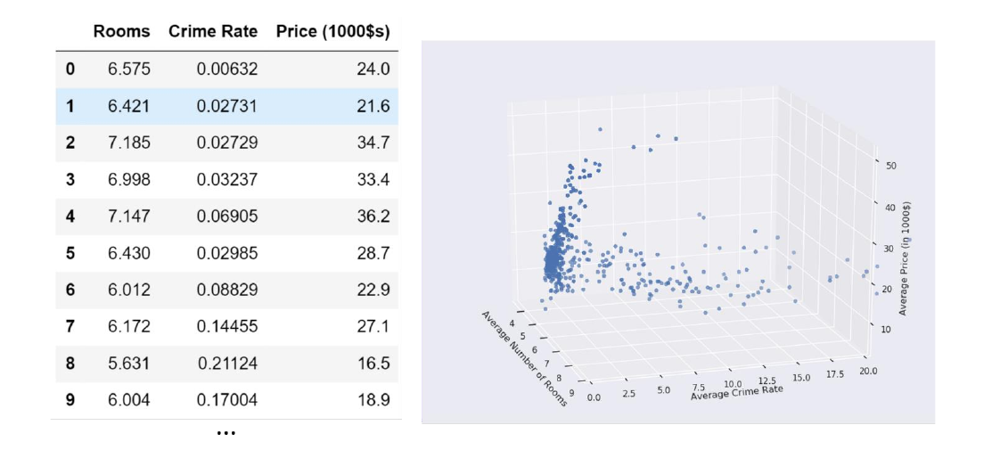

In tal caso il modello lineare $f$ sarà: 
$$
f(x) = \theta_0 + \theta_1 x_1 + \theta_2 x_2 
$$
Assumiamo che il modello sia già stato allenato e che i parametri siano i seguenti: 
$$
\theta_0 = -29.24; \space \theta_1 = 8.39; \space \theta_2 = -0.26
$$
Tali parametri identificano il piano nello spazio che meglio approssima la relazione tra i valori in input ed il prezzo da predire: 

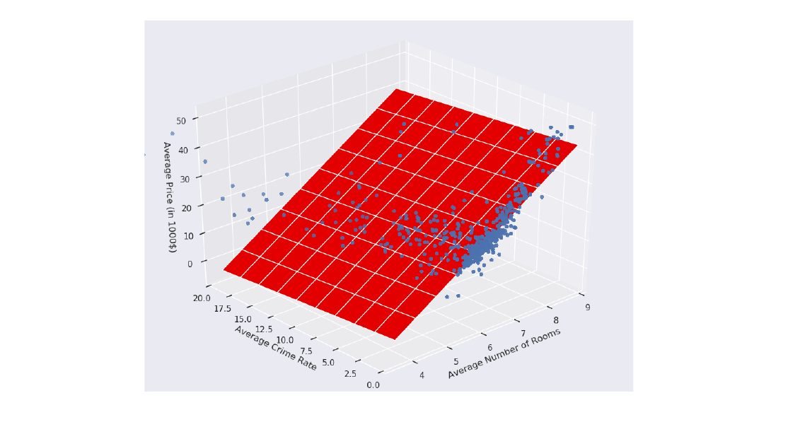

Allo stesso modo possiamo tirar fuori dei significati geometrici e statistici dai coefficienti: 

* $\theta_0$ è il valore di $y$ quando tutte le $x_i = 0$ (per $i$ non nulla);
* Osserviamo un incremento di $\theta_i$ unità quando l'i-esima dimensione $x_i$ aumenta di una unità e le altre restano costanti. 

<div style="page-break-after: always;"></div>

### 3.6 Regressione lineare multivariata

Consideriamo l'ultimo caso, ovvero quello della regressione lineare multivariata. Si cerca una funzione $f$ definita come $f:\R^n \to \R^m$. Il metodo della regressione lineare multivariata risolve il problema definendo $m$ regressori multipli indipendenti, uno per ogni dimensione dell'etichetta $y$ in output, che processano gli stessi input $x$ con pesi differenti: 
$$
\hat y = 
\begin{bmatrix}
\hat y_1 \\
... \\
\hat y_m \\
\end{bmatrix}
= 
\begin{bmatrix}
f_1(x) \\
... \\
f_m(x) \\
\end{bmatrix}
$$
Ognuno dei regressori $f_i$ ha il proprio insieme di parametri $\Theta_i$, calcolati ed ottimizzati in maniera indipendente dagli altri regressori. 


## 4. Il problema dell'apprendimento

Per capire come tirar fuori i parametri $\Theta$ dal regressore ci concentreremo sul caso della regressione multipla, più generico rispetto alla regressione lineare e che pone le fondamenta per quella multivariata. Avremo quindi un regressore $f_{\Theta}$: 
$$
f_{\Theta}(\bar x) = \sum_{i=0}^n \theta_i x_i = \Theta^T \bar x
$$
Dove $f_{\Theta}$ indica il fatto che il regressore $f$ dipenda dai parametri $\Theta$. Allenare il regressore significa lasciare che il regressore apprenda quali siano i parametri $\Theta$ che minimizzino l'errore di predizione nel training set $TR$. Possiamo quantificare l'errore attraverso una funzione costo: 
$$
J(\Theta) = \frac 1 2 \sum_{i=1}^{|TR|} \left[f_{\Theta}(x^i) - y^i\right]^2
$$
Osserviamo che l'espressione sopra è l'indice MSE calcolato sul training set per una certa configurazione di parametri $\Theta$, a meno di una differenza nel prima fattore, che risulta essere $\frac 1 2$ anziché $\frac 1 {|TR|}$. Questa scelta risulterà conveniente in futuro nel metodo della discesa del gradiente. Vorremmo idealmente che la funzione costo $J$ sia prossima zero. Di conseguenza, una buona scelta di $\Theta$ è quella che minimizza la funzione $J$: 
$$
\Theta^* = arg \min_{\Theta} J(\Theta)
$$


### 4.1 Metodo dei minimi quadrati

Prima di passare al metodo della discesa del gradiente, vediamo un metodo leggermente più statistico e diretto, il metodo dei minimi quadrati (*least squares method*). Supponiamo di trovarci nel caso della regressione semplice, per cui: 
$$
\hat y = f(x) = \theta_0 + \theta_1x
$$

<div style="page-break-after: always;"></div>

Il metodo fornisce delle formule dirette per trovare i coefficienti della retta che meglio approssima l'andamento dei punti: 
$$
\theta_1 = \frac 
{\sum_{i=1}^{|TR|} (x_i - \bar x)(y_i - \bar y)}
{\sum_{i=1}^{|TR|} (x_i - \bar x)^2}
$$

$$
\theta_0 = \bar y - \theta_1 \bar x
$$

Dove $\bar y$ e $\bar x$ sono i valori medi. È possibile estendere il metodo dei quadrati minimi per la regressione polinomiale, ma non affronteremo questa tematica. 


### 4.2 Algoritmo di discesa del gradiente 

Abbiamo letto nel problema dell'apprendimento che l'insieme $\Theta$ di parametri assunti dal modello $f$ deve minimizzare la funzione costo $J$. Un approccio naïve potrebbe suggerire di provare tutte le possibili combinazioni di $\Theta$, ma essendo un numero massivo risulta subito un cattivo approccio.

Per risolvere tale problema si possono utilizzare molte strategie di ottimizzazione: quella che utilizzeremo prende il nome di algoritmo di discesa del gradiente, il quale permette di minimizzare qualsiasi funzione **differenziabile** rispetto ai propri parametri.

 

#### 4.2.1 Esempio ad una variabile 

Supponiamo di avere una funzione $f$ *convessa* come in figura, ovvero una funzione con un solo minimo locale. 

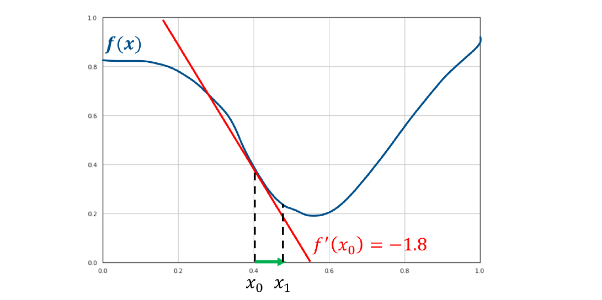

Supponiamo di partire da un punto $x_0$ qualsiasi, per trovare il minimo bisogna seguire l'andamento decrescente della funzione. Tuttavia non abbiamo abbastanza informazioni per sapere come muoverci, quindi è necessario utilizzare uno strumento matematico che dia informazioni sull'andamento della funzione: la derivata. 

<div style="page-break-after: always;"></div>

La derivata fornisce la pendenza (coefficiente angolare) della retta tangente al punto in cui viene calcolata. Di fatto, la retta tangente ci comunica in che direzione la funzione aumenta o diminuisce nell'intorno del punto. 

Se il coefficiente angolare è positivo, allora la retta è crescente nel verso dell'asse delle $x$, e quindi lo è anche la funzione, per cui allo scopo di trovare il minimo è necessario muoversi verso sinistra. Viceversa nel caso in cui si ottienga un coefficiente angolare negativo. 

Nella funzione d'esempio la derivata $f'(x_0)$ ha coefficiente angolare negativo, per cui la funzione è decrescente nel punto $x_0$ e conviene prendere il prossimo punto verso destra, di fatto $x_1 > x_0$ ma $f(x_1) < f(x_0)$.  

> La direzione corretta per trovare il minimo è la direzione inversa alla tangente ottenuta attraverso la derivata. 

L'algoritmo di discesa del gradiente è un algoritmo iterativo che si sposta nella direzione decrescente della funzione sino a trovare il minimo, ovvero quando la derivata risulta nulla. Ma di quanto ci muoviamo lungo l'asse delle $x$ ad ogni step?

Ad ogni step ci muoveremo sull'asse delle $x$ proporzionalmente al valore della derivata. Tale euristica è basata sull'osservazione che valori maggiori, in valore assoluto, della derivata indicano pendenze più ripide, quindi si è probabilmente più lontani dal minimo. Scegliendo una costante $\gamma$ chiamata **learning rate**, ci muoveremo ad ogni step nel seguente modo: 
$$
x_1 = x_0 - \gamma f'(x_0)
$$
Osserviamo che, come sperato, se la derivata $f'(x_0)$ è negativa, ci muoveremo verso destra di un fattore $|\gamma f'(x_0)|$, viceversa per la derivata positiva. Vediamo come procede l'algoritmo nel nostro esempio di prova: 

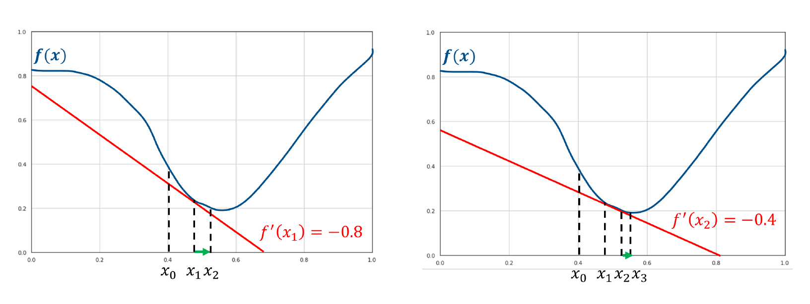

Nel punto $x_3$ la derivata è così vicina allo 0 che $x_3$ approssima quasi perfettamente il minimo. Per cui soddisfa l'espressione: 
$$
x_3 = arg \min_x f(x)
$$
Nella pratica, l'algoritmo finisce la sua iterazione in due casi: 

* Un numero massimo di iterazioni è stato raggiunto;
* Il valore $\gamma f'(x)$ è al di sotto di una data soglia. 

<div style="page-break-after: always;"></div>

Nel caso di una variabile, possiamo riassumere l'algoritmo attraverso il seguente pseudocodice: 

```

    def gradient_descend():
        g = get_learning_rate()
        max_loops = get_max_loops()
        t_threshold = get_termination_threshold()
        x = random()
        loops = 0
        while (x > t_threshold && loops < max_loops):
            m = f'(x)
            x = x - (g * m)
        return x
	
```


#### 4.2.2 Caso multivariato

L'algoritmo di discesa del gradiente è generalizzato nel caso in cui la funzione $f$ da ottimizzare sia a più variabili $f(x_1, ..., x_n)$. Per funzioni a più variabili, anziché la derivata è necessario considerare il gradiente, da cui il nome dell'algoritmo. 

> Il gradiente è una generalizzazione della derivata per funzioni a più variabili. 

Il gradiente di una funzione ad $n$ variabili in un punto $x$ è un vettore la cui $i$-esima componente è data dalla derivata parziale della funzione rispetto alla $i$-esima variabile calcolata nel punto $x$: 
$$
\nabla f(x) = \begin{pmatrix}
f_{x_1}(x)\\
f_{x_2}(x)\\
... \\
f_{x_n}(x)\\
\end{pmatrix}
$$
Nel caso in cui la funzione sia a due variabili, si potrebbe costruire un plot tridimensionale come segue. In tal caso, il gradiente sarà un vettore a due dimensioni e varierà punto per punto. 

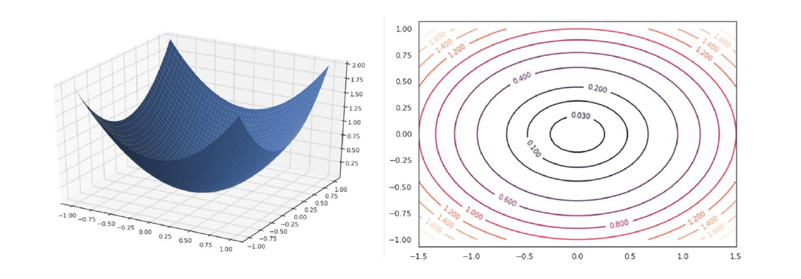

<div style="page-break-after: always;"></div>

La figura che segue mostrerà graficamente l'andamento che deve seguire la procedura nel caso multivariato: 

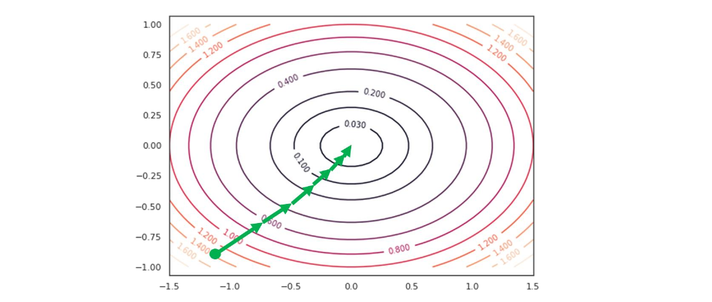

Il ragionamento è analogo, ma l'aggiornamento dei pesi va fatto per ogni variabile. Di conseguenza i passi che seguirà l'algoritmo sono i seguenti: 

* Inizializzare $x = (x_1, ..., x_n)$ in maniera randomica

* Per ogni variabile $x_i$: 
  * Calcolare la derivata parziale nel punto $x$: $f_{x_i}(x)$
  * Aggiornare $x$ utilizzando la formula precedente: $x_i = x_i - \gamma f_{x_i}(x)$
* Ripetere i primi due passi sino a soddisfarre un criterio di terminazione. 


### 4.3 Discesa del gradiente e regressione lineare

Utilizzeremo l'algoritmo di discesa del gradiente per risolvere il problema di ottimizzazione della regressione lineare, quindi per trovare i coefficienti ottimali $\Theta^*$: 
$$
\Theta^* = arg \min_{\Theta} J(\Theta)
$$
Il primo passo è quindi inizializzare randomicamente $\Theta$ e applicare iterativamente la regola di aggiornamento per ogni variabile: 
$$
\theta_j = \theta_j - \gamma \frac {\partial} {\partial \theta_j} J(\Theta)
$$
È necessario quindi calcolare la derivata parziale rispetto a ciascuno dei parametri in input. Scriviamo prima la funzione costo $J$ nei termini dei parametri $\Theta$: 
$$
J(\Theta) = \frac 1 2 \sum_{i=1}^{|TR|} \left[f_{\Theta}(x^i) - y^i\right]^2
$$
Esplicitandolo: 
$$
J(\Theta) = \frac 1 2 \sum_{i=1}^{|TR|} \left( \theta_0 x^i_0 + \theta_1 x^i_1 
+ ... +\theta_n x^i_n - y^i\right)^2
$$
Dove ricordiamo che $x^i_0 = 1$ per convenzione. 

<div style="page-break-after: always;"></div>

Possiamo calcolare facilmente la derivata parziale di questa funzione rispetto alla $j$-esima componente $\theta_j$: 
$$
\frac {\partial} {\partial \theta_j} J(\Theta) = 
\frac 1 2
\sum_{i=1}^{|TR|} 
2(f_{\Theta}(x^i) - y^i) \times
\frac {\partial} {\partial \theta_j}
\left( \theta_0 x^i_0 + \theta_1 x^i_1 + ... +\theta_n x^i_n - y^i\right)
$$
Ma notiamo che: 
$$
\frac {\partial} {\partial \theta_j}
\left( \theta_0 x^i_0 + \theta_1 x^i_1 + ... +\theta_n x^i_n - y^i\right) = x^i_j
$$
Quindi sostituendo e semplificando otteniamo che: 
$$
\frac {\partial} {\partial \theta_j} J(\Theta) = 
\sum_{i=1}^{|TR|} (f_{\Theta}(x^i) - y^i) * x^i_j
$$
La regola di aggiornamento può essere scritta come segue: 
$$
\theta_j = \theta_j - \gamma \times (\sum_{i=1}^{|TR|} (f_{\Theta}(x^i) - y^i) * x^i_j)
$$
Con la regola di aggiornamento abbiamo tutto ciò che ci serve per implementare l'algoritmo computazionalmente, utilizzando criteri di terminazione basati sul numero di iterazioni o sulla soglia di aggiornamento. 


### 4.4 Considerazioni sul learning rate

Il learning rate $\gamma$ è un iperparametro da determinare. Possiamo utilizzare un validation set per effettuare delle prove e selezionare il valore con risultati migliori. Alcune considerazioni sul learning rate sono: 

* Un learning rate basso converge più lentamente ma con buona precisione. 
* Un learning rate alto converge più velocemente ma con una precisione peggiore. Può inoltre capitare una situazione di stallo in cui si salta continuamente da un punto a tangente crescente ad un punto a tangente decrescente, generando un effetto ping pong. 

<div style="page-break-after: always;"></div>

## 5. Regressione non lineare

La regressione lineare risulta limitante nei casi in cui la relazione tra le variabili indipendenti e la variabile dipendente è chiaramente non lineare. Consideriamo ad esempio il seguente plot: 

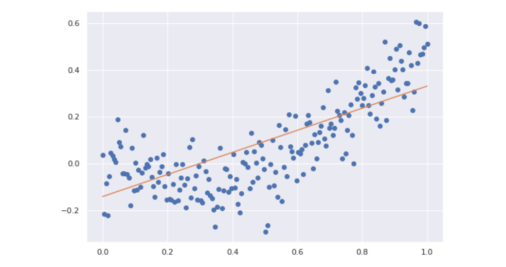

La relazione tra le variabili segue chiaramente una curva anziché una retta. Utilizzare la regressione lineare produrrebbe sicuramente fenomeni di *underfitting*. 


### 5.1 Regressione polinomiale 

Anziché utilizzare una funzione lineare $f(x) = \theta_0 + \theta_1 x$, potremmo introdurre $d-1$ parametri addizionali e utilizzare una funzione polinomiale come segue: 
$$
f(x) = \theta_0 + \theta_1 x + \theta_2 x^2  + ... + \theta_d x^d
$$
Dove $x^i$ rappresenta la potenza $i$-esima di $x$ e non l'indice rispetto al training set. Modelli polinomiali di grado più alto consentono di rappresentare funzioni non lineari: 

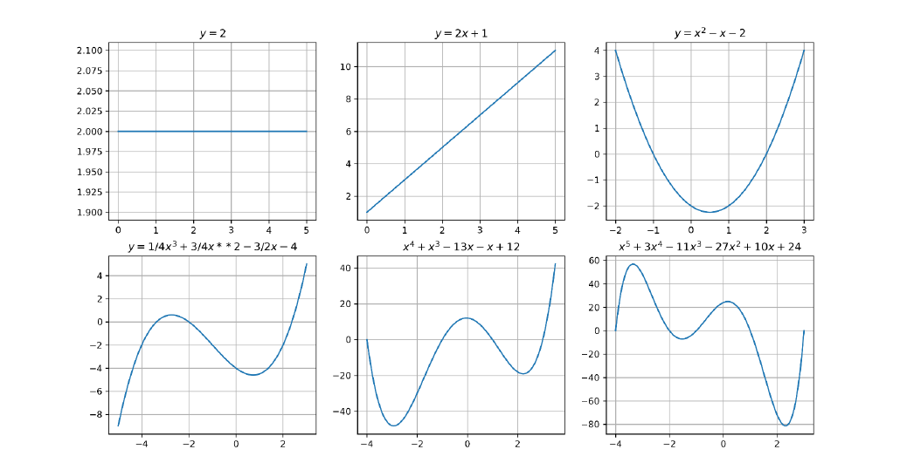

Più alto è il grado del polinomio, più si possono ottenere curve complesse. Possiamo facilmente osservare che anche se la funzione non è lineare rispetto ad $x$, essa è lineare rispetto alle variabili $x, x^2, ..., x^d$. Determinate le variabili $x^i$, trovare i coefficienti $\Theta = \{\theta_0, \theta_1, ..., \theta_d\}$ è comunque un problema di regressione lineare, risolvibile attraverso l'algoritmo di discesa del gradiente. 

Osserviamo che possiamo trasformare un problema di regressione lineare in uno polinomiale replicando $d$ volte lo scalare e prendendo progressivamente le potenze sino al grado $d$. Se $d=3$ allora: 
$$
x \Longrightarrow [x, x^2,x^3] \\
f(x) = \theta_0 + \theta_1 x \Longrightarrow f(x) = 
\theta_0 + \theta_1 x + \theta_2 x^2 + \theta_3 x^3
$$
Se applichiamo questo metodo all'esempio precedente con un grado $d=2$ avremo un risultato di gran lunga più adatto rispetto ad una retta; 

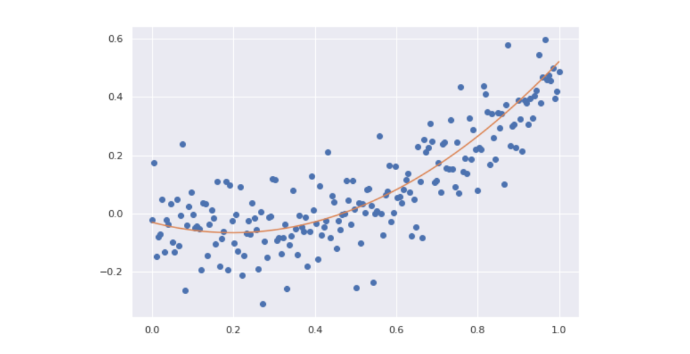


#### 5.1.1 Regressione polinomiale a più variabili

Se la regressione prevede più attributi in input, ripetiamo il processo per ognuno degli attributi ed aggiungiamo anche i *termini di interazione*. Ad esempio, se la dimensione dell'input è 2 e si decide di polinomizzare la funzione aggiungendo $d=2$ gradi, allora i coefficienti totali saranno $n' = 1 + 2 * 2 + 1 = 6$: 
$$
f(x) = \theta_0 + \theta_1 x_1 + \theta_2 x_2 \Longrightarrow 
f(x) = \theta_0 + \theta_1 x_1 + \theta_2 x_1^2 + \theta_3 x_2 + \theta_4 x_2^2 + \theta_5 x_1x_2
$$
È possibile ottenere i termini attraverso il [teorema multinomiale](https://it.wikipedia.org/wiki/Coefficiente_multinomiale). A causa della presenza dei termini di interazione, all'aumentare delle feature in input il numero di coefficienti da calcolare aumenta in maniera massiva e la computazione diventa onerosa.  Se si effettua la regressione polinomiale con un grado $d$ molto alto è possibile incappare nel problema dell'**overfitting**.

Dal punto di vista procedurale, il modo più semplice per implementare la regressione polinomiale consiste nel dare in pasto ad un regressore lineare il numero finale di feature. Anziché costruire un regressore polinomiale per degli input $(x_1, x_2)$ che esegua la polinomizzazione al grado $d$, potremmo (supposto $d=2$) utilizzare un regressore lineare mappando gli input originali $(x_1, x_2, x_1^2, x_1x_2, x_2^2)$ ed ottenere lo stesso risultato. 


#### 5.1.2 Regolarizzazione

Limitando il grado della regressione polinomiale è possibile ridurre il rischio di overfitting. Tuttavia, a volte non si vuole rinunciare alla flessibilità di un polinomio di alto grado. Supponiamo che il problema di predizione sia risolto da un polinomio di grado 3, il cui secondo termine è mancante 
$$
f(x) = \theta_0 + \theta_1x + \theta_3x^3
$$
Il modello privato del secondo termine ha ridotto la propria capacità (meno coefficienti da calcolare) rispetto al modello che prende in considerazione i termini di ogni grado: 
$$
f(x) = \theta_0 + \theta_1x + \theta_2x^2 + \theta_3x^3
$$
 Tale problema non può essere approssimato con un polinomio di secondo grado: 
$$
f(x) = \theta_0 + \theta_1x + \theta_2x^2
$$
Quindi utilizzeremo la prima soluzione, ponendo $\theta_2 = 0$ fissato. Computazionalmente è difficile determinare quale parametro deve essere posto a 0 per approssimare al meglio la soluzione del problema. 

In generale esiste un rapporto tra la norma dei coefficienti di una funzione polinomiale e la sua flessibilità (e quindi capacità). Nel grafico sottostante vediamo tre polinomi i cui coefficienti sono proporzionali tra loro a meno dell'intercetta, scelta ad hoc per posizionare le funzioni vicine tra loro lungo l'asse $y$. Il polinomio verde risulta visivamente meno flessibile, e concorde alla osservazione, i coefficienti sono più piccoli rispetto a quelli degli altri due polinomi. 

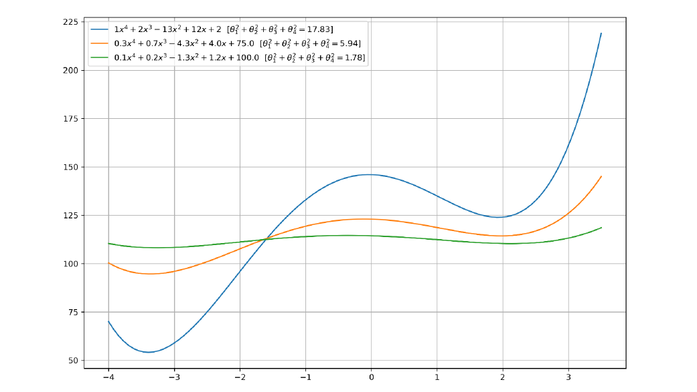

<div style="page-break-after: always;"></div>

#### 5.1.3 Termine di regolarizzazione

Se preferiamo trovare soluzioni meno flessibili per limitare la possibilità di overfitting, potremmo aggiungere alla funzione costo da minimizzare un certo termine, chiamato termine di regolarizzazione, che fornisce una misura di grandezza per i coefficienti del polinomio. 

Il termine di regolarizzazione deve crescere proporzionalmente ai coefficienti, per cui possiamo utilizzare una semplice somma di quadrati: 
$$
\sum_{i=0}^n \theta_i^2
$$
Il processo per cui la funzione costo $J$ viene modificata aggiungendo il termine di regolarizzazione per bilanciare la grandezza dei coefficienti è chiamato **regolarizzazione**. La funzione costo $J$ è ri-definita come segue: 
$$
J(\Theta) = \frac 1 2 \sum_{i=1}^{|TR|} \left[f_{\Theta}(x^i) - y^i\right]^2 
+ \lambda \sum_{i=0}^n \theta_i^2
$$
Dove il valore $\lambda$ serve a bilanciare quanto la grandezza dei coefficienti influenzi la scelta dei coefficienti stessi. È un iperparametro da determinare attraverso un validation set. Questo tipo di regolarizzazione prende il nome di **regolarizzazione L2** poiché il termine di regolarizzazione non è altro che la **norma L2**. Il tipo di regressione considerata prende il nome di **Ridge regression**. 


#### 5.1.4 Decadimento del peso

La nuova funzione costo $J$ è ancora differenziabile rispetto ai parametri $\theta_j$, il che è fondamentale per l'implementazione di un algoritmo di discesa del gradiente. Lo step di aggiornamento sarà adesso: 
$$
\theta_j = \theta_j - \gamma \times \left\{ \sum_{i=1}^{|TR|} (f_{\Theta}(x^i) - y^i) * x^i_j) 
- \frac{\partial}{\partial \theta_j}\left[ \lambda \sum_{i=1}^n \theta_i^2 \right]
\right\}
$$
Notiamo che: 
$$
\frac{\partial}{\partial \theta_j}\left[ \lambda \sum_{i=1}^n \theta_i^2 \right] =
2\lambda\theta_j
$$
Per cui scriviamo lo step di aggiornamento come segue: 
$$
\theta_j = \theta_j - \gamma \times \left\{ (\sum_{i=1}^{|TR|} (f_{\Theta}(x^i) - y^i) * x^i_j) 
- 2\lambda\theta_j
\right\}
$$
L'aggiornamento è analogo al precedente a meno di un fattore penalizzante $2\lambda\theta_j$, Questa regolarizzazione è anche chiamata **decadimento del peso** (*weight decay*) per indicare che i coefficienti (pesi) debbano decadere con il tempo per limitare la crescita. 

<div style="page-break-after: always;"></div>

## 6. Regressione logistica

Un regressore lineare multiplo permette di associare un numero reale $\hat y \in \R$ ad un vettore in input $x \in \R^n$ attraverso una funzione parametrica $f_{\Theta}$. L'obiettivo di un classificatore è simile: predire una classe $\hat y \in \{0, ..., M-1\}$ a partire da un vettore in input $x \in \R^n$.  Vedremo come è possibile costruire una funzione parametrica $f_{\Theta}$ che possa performare la classificazione $\hat y = f_{\Theta}(x)$. 


### 6.1 Limiti della regressione lineare per la classificazione

Ci concentreremo sul task della classificazione binaria per iniziare, quindi avremo due sole classi $\{0,1\}$. Potremmo provare ad utilizzare la regressione lineare per predire direttamente la classe binaria: 
$$
\hat y = f(x) = \Theta^Tx 
$$
Tuttavia questo metodo risente di alcuni problemi fondamentali. Consideriamo un esempio ad una dimensione in cui degli input $x \in \R$ sono classificati in due classi $\{0, 1\}$: 

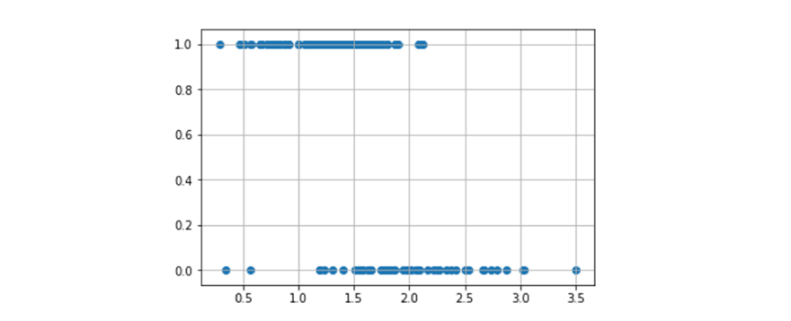

Idealmente vorremmo una funzione che associ tutti i punti "positivi" ad 1 e tutti i punti "negativi" a 0.  Tale funzione sarebbe definita come $f: \R \to \{0,1\}$, quindi il codominio sarà discreto. Se proviamo ad utilizzare la regressione lineare, otterremo con molta probabilità una linea del genere: 

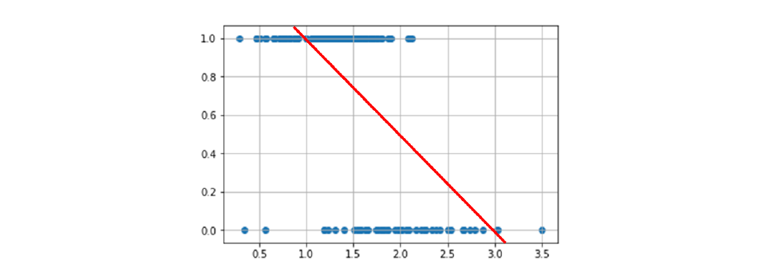

<div style="page-break-after: always;"></div>


Possiamo vedere immediatamente che tale funzione non risultà essere particolarmente accurata nella classificazione: cosa fare quando i punti stanno nel mezzo? O quando stanno sopra 1 / sotto 0? Potremmo migliorare la funzione mappando gli input $x$ alla probabilità che essi assumano il valore 1: $P(y=1|x)$. La funzione sarebbe definita come segue: $f: \R \to \left[0,1\right]$, che risolve i problemi sull'assegnazione dei valori tra 0 ed 1, ma risulta ancora imprecisa per input fuori dal range.  Anziché una retta, vorremmo utilizzare una curva ad $s$ che copra gli elementi come segue: 

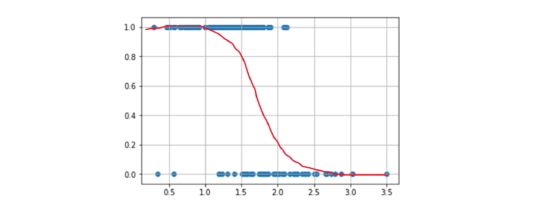 

Questa funzione ideale mappa gli input nel range $\{0,1\}$ e satura a $0$ ed $1$, il che è naturale poiché all'avvicinarsi ad uno dei due estremi densi aumenta anche la certezza di appartenenza ad una classe. Questa analisi suggerisce che non è possibile risolvere il problema della classificazione attraverso una funzione lineare. 


### 6.2 Funzione dispari e Logit

Vorremmo trovare una trasformazione della probabilità che mappi i valori da $[0,1]$ a $(-\infty, +\infty)$ e che renda possibile l'approssimazione delle probabilità attraverso una funzione lineare. 

Sia $p = P(y = 1\mid x)$ la probabilità che che un esempio sia positivo. Considereremo la funzione **dispari** (*odd function*) di $p$ la misura della proporzione tra probabilità che l'esempio sia positivo e quella che l'esempio sia negativo: 
$$
odd(p) = \frac p {1-p}
$$
Questa prima trasformazione risolve parte del problema, di fatto mappa la probabilità dall'intervallo $[0,1)$ all'intervallo $[0, +\infty$). Vediamo l'effetto della mappatura nel grafico sottostante: 

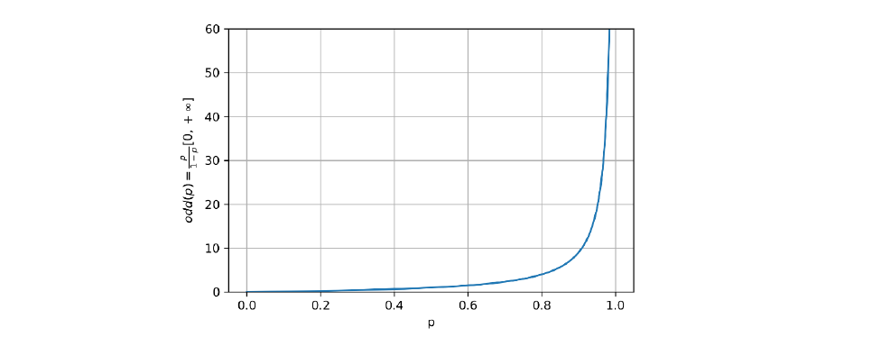

Vogliamo che l'intervallo finale sia $(-\infty, +\infty)$, per cui definiamo la funzione **logit** come il logaritmo naturale della funzione dispari: 
$$
logit(p) = \log \frac p {1-p}
$$
Osserviamo che: 
$$
logit: (0,1) \to (- \infty, +\infty)
$$
altresì confermato dal grafico della funzione: 

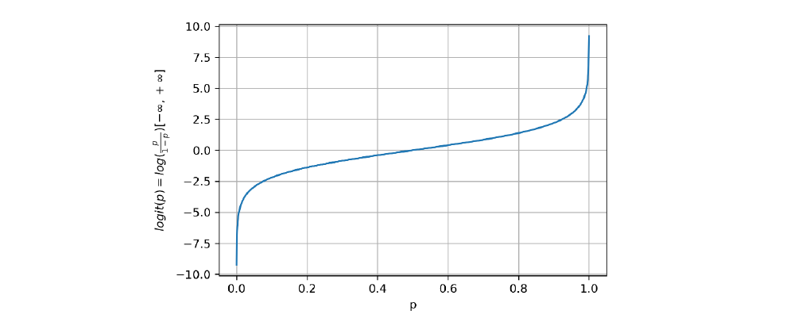

Ci si aspetta che le probabilità siano pressoché non lineari (a forma di $s$), la funzione di **logit** permette di linearizzare i dati rispetto all'asse $x$, come mostrato in figura: 

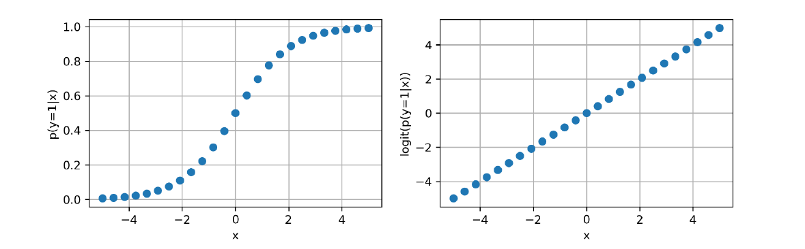

<div style="page-break-after: always;"></div>

### 6.3 La funzione logistica 

Adesso che la funzione logit mappa le probabilità in uno spazio in cui si dispongono linearmente, possiamo utilizzare un regressore lineare per trovare una retta che approssimi la funzione: 
$$
logit(p) \approx \theta_0x_0 + \theta_1x_1 + ... + \theta_nx_n = \Theta^Tx
$$
Una volta trovati i coefficienti $\Theta$ per il regressore lineare, dobbiamo trovare il metodo per estrapolare la probabilità dai risultato della funzione logit, quindi effettuare una mappatura inversa a quella iniziale: $(- \infty, +\infty) \to (0,1)$. 

Possiamo farlo invertendo la funzione logit come segue: 

1) partiamo dalla espressione iniziale: $logit(p) = log \frac p {1-p}$
2) utilizziamo l'esponenziale: $e^{logit(p)} = \frac p {1-p}$
3) moltiplichiamo entrambi i termini: $(1-p) e^{logit(p)} = p$
4) semplifichiamo: $e^{logit(p)} - pe^{logit(p)} = p$
5) raccogliamo per la probabilità: $ p(1 + e^{logit(p)}) = e^{logit(p)}$
6) estraiamo la probabilità: $p = \frac {e^{logit(p)}} {(1 + e^{logit(p)})}$
Possiamo effettuare ulteriori semplificazioni una volta estratta la probabilità:
$$
p = \frac {e^{logit(p)}} {(1 + e^{logit(p)})} = 
\frac {1} {( \frac 1 {e^{logit(p)}} + \frac {e^{logit(p)}} {e^{logit(p)}} )} = 
\frac {1} {(1 + e^{-logit(p)})} 
$$
La funzione derivata prende il nome di **funzione logistica** o **funzione sigmoide** ed è definita in generale come segue: 
$$
logistic(x) = \frac 1 {1 + e^{-x}}
$$
La curva disegnata dalla funzione logistica è a forma di $s$ (da cui il nome sigmoide) come mostrato in figura: 

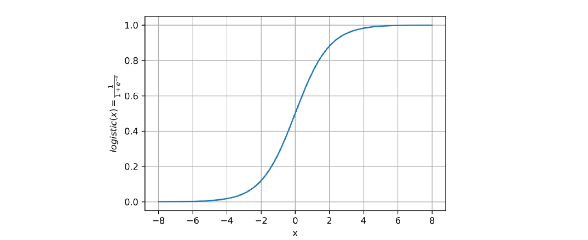

<div style="page-break-after: always;"></div>

### 6.4 Il modello di regressione logistica

Possiamo finalmente definire il regressore logistico con la seguente funzione: 
$$
P(y=1\mid x) = f_{\Theta}(x) = \frac 1 {1 + e^{- \Theta^T x}}
$$
Allenare il regressore logistico significa trovare i parametri $\Theta$ che riescano ad approssimare al meglio la probabilita $P(y=1\mid x)$. La funzione approssimata non è più una retta, bensì un sigmoide: 

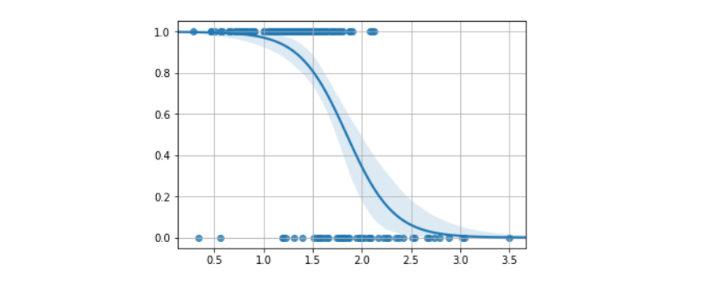

Una volta che il modello è allenato, possiamo classificare le osservazioni attraverso la seguente regola: 
$$
\hat y = 
\begin{cases}
1 \text{ if } x \ge 0.5 \\
0 \text{ otherwise }
\end{cases}
$$


#### 6.4.1 Funzione costo

Per allenare il modello definiremo una funzione costo, similmente a come fatto per la regressione lineare. Problema: il dataset fornisce degli input $x$ e degli output $y$, questi ultimi sono interpretabili in termini probabilistici e non come risultati della funzione logistica, quindi non è possibile utilizzare direttamente la funzione costo del regressore lineare e stimare una retta.

Dalla definizione: 
$$
P(y=1\mid x) = f_{\Theta}(x) = \frac 1 {1 + e^{- \Theta^T x}}
$$
Scriviamo: 
$$
P(y=1\mid x; \Theta) = f_{\Theta}(x) \\
P(y=0\mid x; \Theta) = 1 - f_{\Theta}(x)
$$
Per denotare l'utilizzo di un insieme di parametri $\Theta$. O nella versione compatta: 
$$
P(y\mid x; \Theta) = (f_{\Theta}(x))^{y}(1 - f_{\Theta}(x))^{1-y}
$$
Osservando che verrà preso in considerazione solo uno dei fattori a seconda se $y=1$ o $y=0$. Possiamo stimare i parametri massimizzando la *likelihood*: 
$$
L(\Theta) = P(Y\mid X; \Theta)
$$
Se assumiamo che tutte le osservazioni del training set sono indipendenti, allora la likelihood potrà essere espressa come segue: 
$$
L(\Theta) = \prod_{i=1}^{|TR|} P(y^{(i)} \mid x^{(i)}; \Theta) = 
(f_{\Theta}(x^{(i)}))^{y^{(i)}}(1 - f_{\Theta}(x^{(i)}))^{1-y^{(i)}}
$$
Massimizzare tale espressione è analogo a massimizzare il logaritmo negativo della likelihood (*negative log likelihood*, nll): 
$$
nll(\Theta) = - \log L(\Theta) = - \sum_{i=1}^{|TR|} \left[ 
	y^{(i)}f_{\Theta}(x^{(i)}) + (1-y^{(i)})(1 - f_{\Theta}(x^{(i)}))
\right]
$$
Definiremo la funzione costo $J$: 
$$
J(\Theta) = nll(\Theta) = - \log L(\Theta) = - \sum_{i=1}^{|TR|} \left[ 
	y^{(i)}f_{\Theta}(x^{(i)}) + (1-y^{(i)})(1 - f_{\Theta}(x^{(i)}))
\right]
$$


#### 6.4.2 Applicare la discesa del gradiente

Possiamo ottimizzare la funzione costo del regressore logistico attraverso l'algoritmo di discesa del gradiente. Per farlo, è necessario applicare una funzione di aggiornamento del genere: 
$$
\theta_j = \theta_j - \gamma \frac {\partial} {\partial \theta_j} J(\Theta)
$$
È necessario quindi calcolare la derivata parziale della funzione costo $J$. Si lascia allo studente volenteroso la derivazione, che risulta essere: 
$$
\frac {\partial} {\partial \theta_j} J(\Theta) = 
\sum_{i=1}^{|TR|} x_j^{(i)} (y^{(i)} - \sigma(\Theta^T x^{(i)}))
$$
Dove $\sigma$ indica la funzione sigmoide (o logistica): 
$$
\sigma(x) = \frac 1 {1 + e^{-x}}
$$
Per cui il passo d'aggiornamento sarà esplicitato come segue: 
$$
\theta_j = \theta_j - \gamma 
\left[ \sum_{i=1}^{|TR|} x_j^{(i)} (y^{(i)} - \sigma(\Theta^T x^{(i)})) \right]
$$
Osserviamo che il passo di aggiornamento è analogo a quello della regressione lineare a meno della funzione $f_{\Theta}(x^{(i)})$ rimpiazzata con la funzione sigmoide $\sigma(\Theta^T x^{(i)})$.

<div style="page-break-after: always;"></div>

#### 6.4.3 Interpretazione geometrica

A differenza della regressione lineare multipla, che trova l'iperpiano che *approssima* al meglio i dati, la regressione logistica trova l'iperpiano che *separa* al meglio i dati. Come vediamo nell'esempio bidimensionale. 

Ipotizziamo di allenare un regressore logistico con i seguenti dati: 
$$
f(x) = \frac {1} {1 + \exp(-\theta_0 - \theta_1x_1 - \theta_2x_2)}
$$
Supponiamo che l'insieme $\Theta$ di coefficienti risultante sia il seguente: 
$$
\Theta = \{\theta_0 = -3.47, \theta_1 = 1.17, \theta_2 = 1.43 \}
$$
Per capire come i dati sono classificati analizziamo il caso di massima incertezza, ovvero quando la probabilità risultate è del 50% per ambo le classi: 
$$
f(x) = 0.5 \Longleftrightarrow 
\exp(-\theta_0 - \theta_1x_1 - \theta_2x_2) = 1 \Longleftrightarrow 
-\theta_0 - \theta_1x_1 - \theta_2x_2 = 0
$$
Se esplicitiamo l'ultima equazione otteniamo: 
$$
x_2 = - \frac {\theta_1} {\theta_2} x_1 - \frac {\theta_0} {\theta_2}
$$
Per cui il coefficiente angolare è $m = - \frac {\theta_1} {\theta_2}$ e l'intercetta è $q = - \frac {\theta_0} {\theta_2}$. Se grafichiamo questa linea, otteniamo il confine decisionale tra gli elementi delle due classi. 

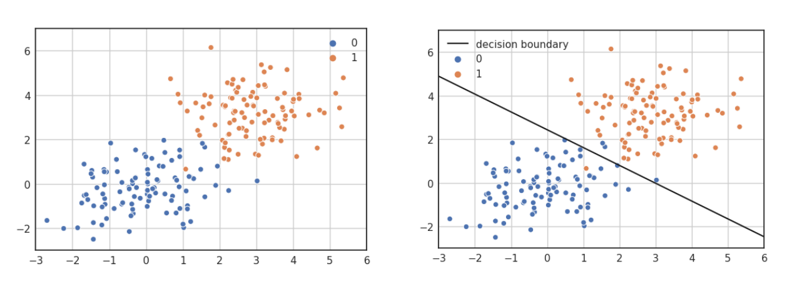

\* *L'iperpiano rappresentato è dato dai coefficienti $\Theta$ e non rappresenta la funzione logistica, che non è una retta, bensì una curva.* 

<div style="page-break-after: always;"></div>

#### 6.4.4 Estensione al caso multiclasse: metodo one-vs-all

È possibile estendere il metodo della regressione logistica attraverso varie tecniche, tra cui la *one vs all*, la *one vs one* e la *softmax regression*. Vedremo in particolare come funziona la *one vs all*. 

L'approccio **one-vs-all** permette di trasformare il problema della classificazione multiclasse (con più di 2 classi) in un insieme di problemi di classificazione binaria. Ogni sottoproblema può essere risolto attraverso un classificatore binario (es. il regressore logistico). Oltre al classificatore binario, è necessario anche l'output contenga anche un valore di confidenza (**confidence value**), come un probabilità. Questo è necessario per confrontare i risultati di tutti i classificatori e capire quale potrebbe essere quello corretto. 

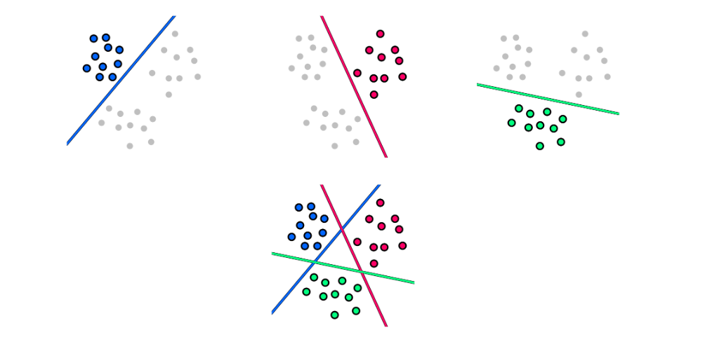

Dato un problema di classificazione $T$ con $n$ classi, l'approccio *one-vs-all* consiste nei seguenti passi: 

* Dividere $T$ in $n$ task di classificazione binaria $T_i$, dove si considera la classe $i$ contro tutte le altre. 
* Allenare i classificatori separatamente.
* Per classificare un input $x$ utilizziamo ognuno dei classificatori $f_i$, poi assegniamo la classe del classificatore con il confidence value maggiore. 

$$
\hat y = arg \max_i \left[ f_i(x) \right]
$$

