# Reti e modelli random

## 1. Reti

Le reti (o grafi) sono il modello matematico che permette di codificare le interazioni tra le componenti di un sistema complesso. La scienza che studia le reti prende il nome di network science. Formalmente, un grafo è una coppia $G=(V,E)$ dove $V$ è l'insieme di vertici ed $E$ è l'insieme degli archi, dove un arco è una coppia di vertici $(u, v)$. I vertici rappresentano le componenti del sistema, mentre gli archi rappresentano le interazioni tra le componenti. Se $(a,b) \in E$ allora diremo che $b$ è *adiacente* ad $a$. 

#### 1.1.1 Grafi diretti e indiretti

Un grafo è detto *indiretto* (o non orientato) se: 
$$
\forall \space (a,b) \in E \Longleftrightarrow (b,a) \in E
$$
Altrimenti si parla di grafo *diretto* (o orientato). In altre parole, in un grafo indiretto ogni interazione tra due nodi è reciproca, mentre nelle reti dirette non è detto che lo sia. 

#### 1.1.2 Grafi pesati ed etichettati

Ai nodi e agli archi di una rete possono essere associate delle informazioni aggiuntive legate alla semantica della rete stessa. Se le informazioni associate ai nodi / archi sono valori numerici (interi o reali) si parla di rete *pesata*. Se sono etichette o stringhe si parla di grafo etichettato.  

#### 1.1.3 Grafi bipartiti 

Un grafo bipartito è un grafo in cui i nodi costituiscono due insiemi disgiunti $U$ e $V$ e ciascun arco del grafo collega un nodo di $U$ ad un nodo di $V$. Non esistono archi che collegano tra loro nodi dello stesso insieme. 

A partire da una rete bipartita è possibile generare due reti chiamate *proiezioni del grafo*, una rispetto all'insieme $U$ e l'altra rispetto all'insieme $V$. La proiezione rispetto ad $U$ è un grafo i cui nodi sono i nodi di $U$ ed un arco collega due nodi $u_1, u_2 \in U$ se e solo se $u_1, u_2$ hanno almeno un adiacente in comune nel grafo bipartito. Definizione analoga per la proiezione rispetto a $V$. 

 

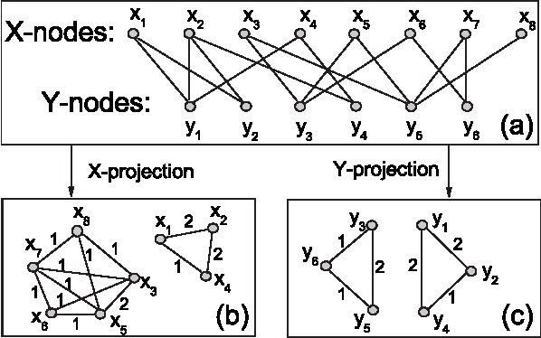

#### 1.1.4 Grafi multipartiti

La definizione di grafo bipartito si può estendere facilmente al casi di tre (grafi tripartiti) o più (grafi multipartiti) insiemi disgiunti di nodi. 

#### 1.1.5 Grafo completo o Clique 

Un grafo completo, o Clique, è un grafo in cui tutte le coppie distinte tra loro sono collegate da un arco. 

#### 1.1.6 Grado di un nodo

Il grado (*degree*) di un nodo $u$ è il numero di nodi adiacenti ad $u$ nel grafo. Un nodo con grado 0 è detto *isolato*. In un grafo diretto si fa distinzione tra: 

* Grado *uscente* del nodo $u$: numero di nodi adiacenti ad $u$ nel grafo
* Grado *entrante* del nodo $u$: numero di nodi a cui $u$ è adiacente. 
* Grado *totale* del nodo $u$: somma del grado uscente e del grado entrante. 

Un grafo è detto *regolare* se ogni nodo ha lo stesso grado. 

#### 1.1.7 Distribuzione dei gradi

La distribuzione dei gradi $P$ è una distribuzione di probabilità, dove $P_k$ rappresenta la probabilità che un generico nodo della rete abbia grado $k$. La distribuzione dei gradi è la proprietà più importante della rete, poiché fenomeni come la robustezza della rete o la diffusione dei virus si possono spiegare attraverso tale proprietà. Data una rete reale, $P_k$ si ottiene dividendo il numero $N_k$ di nodi con grado $k$ per il numero di nodi $N$ della rete. 

### 1.2 Cammini tra nodi

Un cammino tra due nodi $u$ e $v$ è definito come una sequenza ordinata di $n$ archi: 
$$
(u = i_0, i_1), (i_1, i_2), ..., (i_{n-1}, i_n = v)
$$

#### 1.2.1 Lunghezza, distanza e diametro

La quantità $n$ di archi è detta *lunghezza* del cammino. 
In generale possono esistere più cammini tra due nodi. 
Il cammino *minimo* è il cammino di lunghezza minima. 
Possono esistere più cammini minimi tra due nodi. 
La *distanza* $D$ tra due nodi è la lunghezza di un cammino minimo tra i due. 
Il *diametro* di un grafo è la massima distanza tra due nodi del grafo. 

#### 1.2.2 Cicli nel grafo

Un ciclo è un cammino in cui nodo di partenza e nodo finale coincidono: 
$$
(u = i_0, i_1), (i_1, i_2), ..., (i_{n-1}, i_n = u)
$$
Un ciclo di lunghezza 1 è detto *cappio* o *self-loop*. Un grafo che non contiene cicli è detto *aciclico*, o anche *albero*. 

#### 1.2.3 Connettività di un grafo

Due nodi $i$ e $j$ si dicono *connessi* se esiste un cammino tra essi, altrimenti si diranno *disconnessi*. Un grafo si dice *connesso* se tutte le coppie di nodi sono connesse, *disconnesso* altrmenti. Un grafo disconnesso $G$ risulta formato dall'unione di due o più sottografi connessi, chiamati *componenti*. Un sottografo è formato da un sottoinsieme di nodi di $G$ e dagli archi che li collegano.    

Per i grafi diretti o orientati si parla di connettività *forte* o *debole*. Un grafo orientato $G$ è detto *fortemente connesso* se, per ogni coppia di nodi $u,v \in V$ esiste un cammino tra $u$ e $v$ in $G$. È invece detto *debolmente connesso* se, per ogni coppia di nodi $u,v \in V$, esiste un cammino tra $u$ e $v$ in $G$, oppure esiste un cammino nel grafo $G'$ ottenuto da $G$ sostituendo gli archi direzionati con archi non direzionati. Da queste definizioni derivano, in maniera analoga a prima, i concetti di *componente fortemente connessa* e *componente debolmente connessa*. 

### 1.4 Coefficiente di clustering 

#### 1.4.1 Coefficiente di clustering locale 

Il coefficiente di clustering $C_u$ di un nodo $u$ è una misura di quanto gli adiacenti di $u$ siano connessi tra loro. Formalmente: 
$$
C_u = \frac {2L_u} {k_u \times (k_u-1)} \in [0,1]
$$
dove $k_u$ è il grado del nodo $u$ ed $L_u$ è il numero di archi esistenti tra i $k_u$ adiacenti ad $u$.  In altre parole, il coefficiente di clustering misura la densità locale della rete in un nodo $u$: più densamente interconnesso è il vicinato di $u$, più alto è il coefficiente di clustering. 

Definiamo coefficiente di clustering *medio* $\langle C \rangle$ la media dei coefficienti di clustering di tutti i nodi della rete: 
$$
\langle C \rangle = \frac 1 {|V|} \sum_{i \in V} C_i
$$

#### 1.4.2 Coefficiente di clustering globale 

Il concetto di coefficiente di clustering *globale* è basato su triple di nodi. Una tripla consiste di tre nodi connessi da due (tripla aperta) o tre (tripla chiusa) collegamenti. Ogni tripla è incentrata su un nodo. Un triangolo consiste di tre triple chiuse incentrate sui tre stessi nodi che lo compongono (clique con 3 nodi).  

Definiamo coefficiente di clustering globale $C_{\Delta}$ il rapporto tra il numero di triangoli della rete (clique con 3 nodi) ed il numero totale di triple di nodi. 

### 1.5 Centralità di un nodo

La centralità è una misura dell'importanza di un nodo nella rete. Esistono diverse misure di centralità, a seconda del criterio utilizzato per misurare l'importanza di un nodo. 

#### 1.5.1 Degree centrality

La centralità basata sul grado è la misura più semplice di centralità. La degree centrality è semplicemente il grado del nodo. Più alto è il grado del nodo e più è importante. 

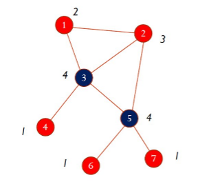

#### 1.5.2 Betweenness centrality 

La betweenneess centrality è basata sul concetto di betweenness di un nodo: dato un nodo $v$ e due nodi qualsiasi del grafo $i$ e $j$, si calcola $\sigma_{ij}$, ovvero la frazione di cammini minimi tra $i$ e $j$ che passano per $v$. 

La betweenness di $v$ è ottenuta sommando $\sigma_{i.j}$ per tutte le coppie $i,j \in V$. In base a questa definizione, un nodo è centrale se si trova nel mezzo di molti cammini di comunicazione tra nodi del grafo. 

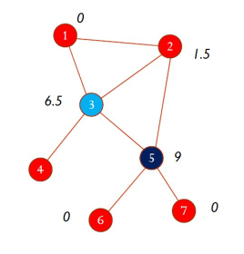

#### 1.5.3 Closeness centrality 

La closeness centrality si basa sulla vicinanza media di un nodo rispetto a tutti gli altri nodi del grafo. Dato un nodo $v$, si calcola la lunghezza media $L_v$ dei cammini minimi da $v$ agli altri nodi del grafo. La closeness centrality di $v$ è definita come il reciproco di $L_v$. 

La closeness centrality di un nodo $v$ è una misura della velocità media con cui una informazione, partendo da $v$, può raggiungere tutti gli altri nodi del grafo. 

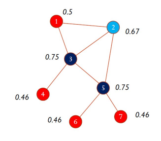

#### 1.5.4 PageRank centrality

La PageRank centrality si basa sull'osservazione che le connessioni di un nodo con gli altri nodi non hanno tutte lo stesso valore (come assunto invece dalla degree centrality). Connessioni a nodi con elevato grado hanno un peso maggiore rispetto a connessioni a nodi di grado minore. 

È possibile definire la metrica ricorsivamente: un nodo è tanto più importante quanto più è connesso ad altri nodi importanti della rete. Formalmente, il Page Rank di un nodo $u$, $PR(u)$, è dato da: 
$$
PR(u) = \sum_{v \in B_u} \frac {PR(v)}{k_v}
$$
Dove $B_u$ è l'insieme dei nodi che hanno $u$ come adiacente e $k_v$ è il grado uscente di $v$. 

#### 1.5.5 Calcolo del PageRank 

Consideriamo un semplice esempio di rete diretta costituita da 4 nodi $V=\{A, B, C, D\}$. Immaginiamo che ogni nodo abbia a disposizione un tesoro iniziale, uguale per tutti. Se il tesoro iniziale complessivo è pari ad 1, ogni nodo avrà un tesoro iniziale pari a 0.25. 

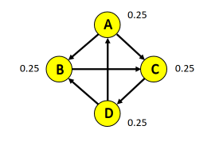

Ogni nodo deve cedere il proprio tesoro in parti uguali tra i suoi adiacenti. Calcoliamo ad esempio il tesoretto di $B$: 

* $A$ cede metà del suo tesoro a B e a C. Dunque B riceve 0.125 da A, ovvero $PR(A)/2$ o $PR(A)/k_A$. 
* $C$ non cede nulla a B. 
* $D$ cede metà del suo tesoro a B e ad A. Dunque B riceve 0.125 da D, ovvero $PR(D)/2$ o $PR(D)/k_D$.

Quindi: 
$$
PR(B) = \frac {PR(A)} {k_A} + \frac {PR(D)} {k_D} = 0.125 + 0.125 = 0.25 
$$
Con lo stesso principio possiamo calcolare il nuovo page rank degli altri 3 nodi. Alla fine del primo round $C$ è l'unico nodo che si ritrova con un tesoro maggiore. 

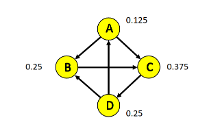

Iterando questo scambio di tesori si otterrà una situazione di equilibrio in cui il tesoro di ogni nodo non varierà più in maniera significativa. A tempo di convergenza si conosce il valore di centralità per ogni nodo. 

## 2. Modelli random

Uno degli obiettivi della Network science è quello di costruire modelli in grado di riprodurre proprietà specifiche della rete reale, legate ad esempio al grado dei nodi, al diametro della rete etc. Le reti reali, a parte qualche rara eccezione (es. reticoli), non hanno una struttura regolare, ma presentano una certa randomicità. 

Sin dagli anni '50 sono stati teorizzati e sviluppati modelli probabilistici, detti modelli random, per cercare di spiegare queste proprietà intrinseche delle reti reali. Tali modelli sono generativi, cioè permettono di generare reti con certe caratteristiche. 

### 2.1 Modello di Erdos-Renyi 

Il primo modello random fu proposto da due matematici ungheresi, Erdos e Renyi, negli anni '60 e prende il loro nome. Fissata una probabilità $p$ ed il numero di nodi $N$ della rete da generare, il modello Erdos-Renyi crea un insieme iniziale di $N$ nodi isolati e per ciascuna coppia di nodi distinti, aggiunge un arco con probabilità $p$. La rete ottenuta con il modello Erdos-Renyi è detta grafo random o rete di Erdos-Renyi. 

#### 2.1.1 Variante G(N,L) del modello

Il modello appena descritto è detto modello $G(N,p)$, perché genera un grafo random partendo dal numero di nodi $N$ e dalla probabilità $p$ che esista un arco tra due nodi. Una variante è rappresentata dal modelo $G(N, L)$, in cui si genera un grafo random con $N$ nodi ed $L$ archi random. 

In questa variante si parte da una rete con $N$ nodi isolati. Ad ogni passo si sceglie una coppia di nodi scelti a caso e non ancora connessi tra loro e si aggiunge un arco tra essi. Si prosegue sino a che la rete non contiene $L$ archi. I due modelli sono equivalenti tra loro. 

#### 2.1.2 Proprietà del grafo random

Per ricavare l'espressione della *distribuzione dei gradi* di una rete random con $N$ nodi, occorre calcolare la probabilità $p_k$ che un generico nodo abbia grado $k$. Ipotizziamo di essere al turno di assegnazione degli archi di generico nodo $u \in V$, la probabilità che $u$ abbia grado $k$ è la probabilità che su $N-1$ nodi rimanenti, $k$ nodi si colleghino ad $u$. Tale distribuzione prende il nome di distribuzione binomiale ed è definita per i generici $n$ e $k$ come segue: 
$$
P (X = k) = \binom{n}{k} p^k(1-p)^{n-k}
$$
Nel nostro caso $n = N-1$ e $k=k$, per cui: 
$$
P_k = \binom{N-1}{k} p^k(1-p)^{N-1-k}
$$
Dove $(1-p)^{N-1-k}$ è la probabilità che $N-1-k$ nodi restanti non creino un collegamento con $u$, mentre $p^k$ è la probabilità che $k$ nodi si colleghino ad $u$. Il coefficiente binomiale iniziale prende in considerazione tutti i modi in cui è possibile selezionare $k$ nodi da collegare ad $u$ tra gli $N-1$ rimanenti. 

Si può dimostrare che il grado medio della rete random è: 
$$
\langle k \rangle = p (N-1)
$$
Per $N \gg \langle k \rangle$ la distribuzione binomiale è ben approssimata da una distribuzione di Poisson: 
$$
p_k = \exp(-\langle k \rangle \frac{\langle k \rangle^k}{k! } )
$$
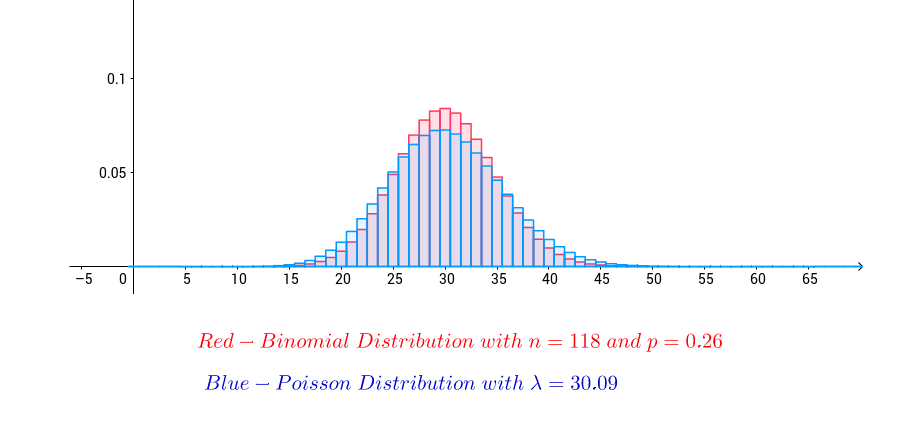

Dal momento che la distribuzione dei gradi è binomiale, in una rete random i nodi hanno perlopiù lo stesso grado. In reti random grandi, in cui la distribuzione è approssimativamente di Poisson, la maggior parte dei nodi ha un grado più o meno pari al grado medio $\langle k \rangle$. Pochi nodi hanno un grado diverso dalla media. 

#### 2.1.3 Fenomeno Small-World

La distanza media tra i nodi della rete è: 
$$
\langle d \rangle \approx \frac {\ln N}{\ln \langle k \rangle}
$$
Dal momento che $\ln(N) \ll N$, nella rete random le distanze tra i nodi della rete sono mediamente piccole, tale fenomeno prende il nome di *small world*. Il termine: $1 / \ln\langle k \rangle$ implica che più è densa la rete, più piccola è la distanza tra i nodi. 

#### 2.1.4 Coefficiente di clustering nel grafo random 

Per calcolare il coefficiente di clustering di un generico nodo $n$, occorre prima stimare il numero atteso (media) di archi tra gli adiacenti di $n$. Se $k_n$ è il grado di $n$, il numero atteso di archi è: 
$$
\langle L_n \rangle = p \times \frac {k_n(k_n-1)}{2}
$$
Dunque, il coefficiente di clustering di $n$ è dato da: 
$$
C_n = \frac {2\langle L_n \rangle}{k_n(k_n-1)} = p
$$
Dato che $\langle k \rangle = p(N-1)$ allora: 
$$
C_n = p = \frac {\langle k \rangle} {N-1} 
$$
Quindi il coefficiente di clustering è inversamente proporzionale al numero di nodi $N$ nella rete e direttamente proporzionale al grado medio. Si noti che il coefficiente di clustering del nodo è indipendente dal grado del singolo nodo. Considerazioni analoghe possono essere fatte per il coefficiente di clustering globale. 

#### 2.1.5 Confronto tra reti reali e reti random

La distribuzione dei gradi nelle reti reali in figura è molto diversa rispetto a quella della rete random. Nelle reti reali si osservano molti nodi con grado basso e pochi nodi con grado alto. 

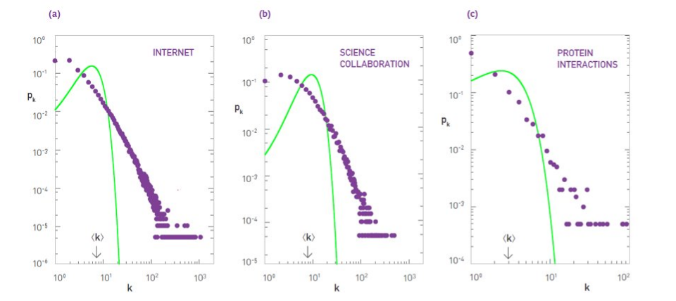

Sia per il coefficiente di clustering locale che per quello globale vi è una significativa differenza: nella rete reale, il coefficiente di clustering è più alto rispetto a quello di una rete random. 

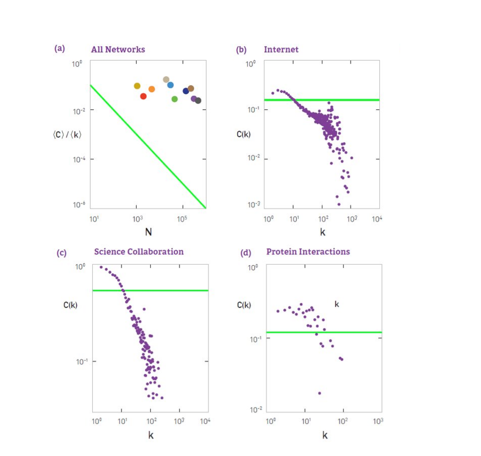

#### 2.1.6 Proprietà riprodotta: small-world

L'unica proprietà delle reti reali che la rete random riesce a cogliere abbastanza bene è quella denominata "small world", legata alla distanza media tra i nodi (anche se spesso nelle reti reali si osserva una distanza ancora più bassa). Il fenomeno small world afferma che anche due individui che vivono in zone molto lontane sulla Terra possono essere connessi tra loro attraverso una catena molto piccola di conoscenze. Tale fenomeno è conosciuto anche con il termine "*sei gradi di separazione*" (*six degrees of separation*). La teoria dei sei gradi di separazione fu formulata per la prima volta nel '29 dallo scrittore ungherese Frigyes Karinthi, ma il termine "sei gradi di separazione" fu coniato in seguito ad un famoso esperimento condotto nel '67 da uno psicologo americano, Stanley Milgram. 

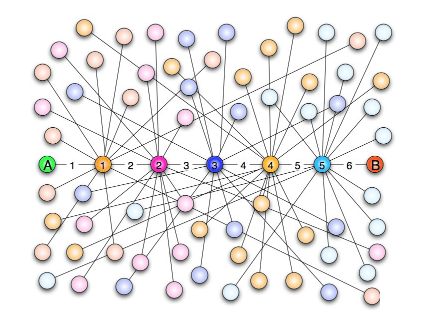

##### L'esperimento di Milgram 

Milgram selezionò in maniera casuale un gruppo di studenti americani del Midwest e chiese loro di spedire un pacchetto ad un estraneo del Massachusetts, a migliaia di chilometri di distanza. Ad ognuno di questi studenti Milgram consegnò una lettera con indicazioni riguardo il nome del destinatario, il suo impiego e la zona di residenza, senza però specificare l’indirizzo esatto. Ad ogni partecipante all’esperimento fu quindi chiesto di spedire il proprio pacchetto ad una persona da loro conosciuta che, a loro giudizio, potesse avere maggiori probabilità di conoscere il destinatario finale. Quella persona avrebbe fatto a sua volta lo stesso, fino a quando il pacchetto non fosse arrivato a destinazione. Al termine dell’esperimento, Milgram scoprì con sorpresa che il numero medio di intermediari era 5.2, quindi un numero piccolo e molto vicino a quello teorizzato da Kharinty nel 1929. Ad oggi l'esperimento è stato riproposto e riconfermato attraverso le reti sociali ed altri tipi di reti digitalizzate. 

##### Definizione di small-world 

Formalmente, una rete soddisfa le proprietà small-world se la distanza media tra i nodi è: 
$$
\langle d \rangle \approx \frac {\ln N}{\ln \langle k \rangle}
$$
Ovvero, una rete è small-world se la distanza media tra i nodi ha una dipendenza logaritmica rispetto alla dimensione della rete (numero di nodi). 

### 2.2 Modello Watts-Strogatz 

Il modello Erdos-Renyi approssima bene la proprietà small-world, ma non il coefficiente di clustering, locale e globale, della rete reale. Nel '98 Duncan Watts e Steven Strogatz proposero un'estensione al modello Erdos-Renyi, chiamato modello Watts-Strogatz o modello small-world. 

Il modello consente di creare delle reti random che rappresentano una interpolazione tra il grafo regolare, che ha un alto coefficiente di clustering ma non esibisce la proprietà small-world, ed il grafo random, che ha basso coefficiente di clustering ma gode della proprietà small-world. 

Anche in questo caso, la distribuzione dei gradi che si ottiene è simile ad una distribuzione di Poisson. Il tipo di grafo prodotto dipende da un parametro $p$, detto anche parametro di *rewiring*. La rete che si ottiene ha caratteristiche intermedie tra la rete regolare e quella random: più basso è $p$, più la rete è simile alla rete regolare, più è alto $p$, più è simile alla rete random. 

Sia $n$ il numero di nodi della rete da generare, $p$ il parametro di rewiring e $d$ un intero $d \ge 1$, siano $1, 2, \dots, n$ gli identificativi dei nodi della rete. Si collega ciascun nodo $i$ ai nodi $i+1, i+2, \dots, i+d$. Al termine di questo passo si ottiene un grafo *regolare*. Per ciascun arco, si scambia il nodo destinazione con un altro nodo random della rete con probabilità $p$. 

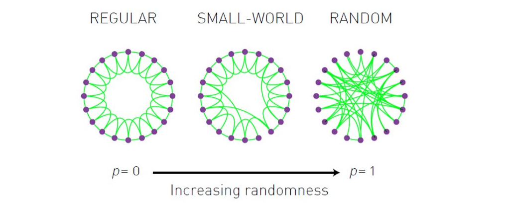

Sia $\langle C(p) \rangle$ il coefficiente di clustering al variare di $p$ e $\langle C(0) \rangle$ il coefficiente di clustering della rete regolare ($p=0$). Allo stesso modo sia $\langle d(p) \rangle$ la distanza media tra i nodi al variare di $p$ e $\langle d(0) \rangle$ la distanza media tra i nodi della rete regolare ($p=0$). Se grafichiamo i rapporti dei valori rispettivamente, otterremo il plot nella figura sottostante. All'aumentare di $p$ la distanza media diminuisce (si acquisisce la prop. small-word), ma diminuisce anche il coefficiente di clustering. 

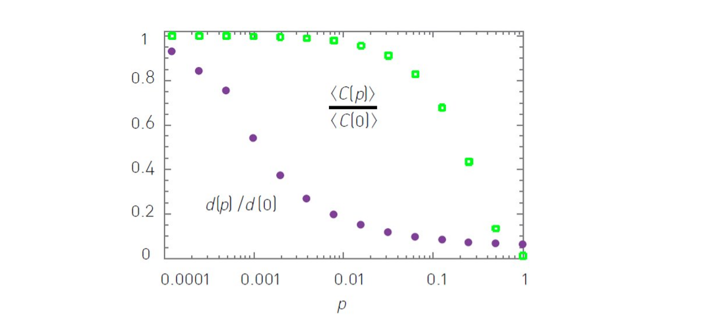

### 2.2.1 Distribuzione power-law

Nel modello Watts-Strogatz la distribuzione dei gradi dei nodi risulta essere una distribuzione simile alla Poisson, come nel modello di Erdos-Renyi. Come abbiamo visto, nelle reti reali la distribuzione dei gradi non è affatto simile alla distribuzione di Poisson. Piuttosto, è ben approssimata da una distribuzione chiamata *power-law*. 

Una distribuzione $p$ è una power-law se: 
$$
p_k \sim k^{-\gamma}
$$
Dove il parametro $\gamma$ è detto *esponente di grado*. Nelle reti reali si osserva generalmente $2 < \gamma < 3$. Vediamo a confronto la distribuzione power-law e quella di Poisson: 

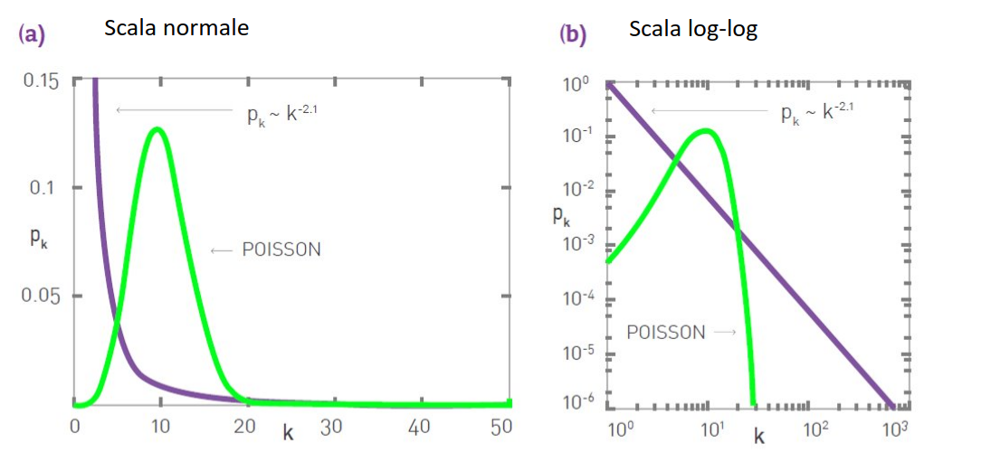

### 2.2.2 Rete scale-free

Le reti la cui distribuzione dei gradi segue una distribuzione power-law sono dette reti *scale-free*, o *invarianti per scala*. Ciò implica che nelle reti scale-free vi è una piccola porzione di nodi che hanno un grado elevato ed una elevata porzione di nodi, che copre quasi tutta la rete, con basso grado. I nodi di elevato grado vengono chiamati anche *hub*. 

Una rete scale-free è quindi caratterizzata dalla presenza di un certo numero di *hub*, che invece sono praticamente assenti nelle reti random o small-world. Il comportamento scale-free delle reti reali riflette perfettamente ciò che accade in tantissimi ambiti della società attuale (economia, rapporti sociali, etc.) ed è ben riassunto dalla regola di Pareto, o regola 80/20. 

Il termine "scale-free" si riferisce all'assenza di una scala, ovvero un valore di riferimento per stabilire il grado di un nodo qualsiasi della rete. In una rete random in cui la distribuzione dei gradi è di Poisson, la media corrisponde al picco della curva e i gradi dei rimanenti nodi si discostano poco dalla media (varianza finita e bassa): in tal caso la media rappresenta il valore di scala. 

In una rete scale-free, in cui la distribuzione dei gradi è power-law, la varianza della distribuzione diverge per $N$ molto grande. Ciò implica che se scegliamo in maniera casuale un nodo, non possiamo dire nulla sul suo grado: può essere estremamente piccolo o estremamente grande. Non possiamo quindi indicare un ordine di grandezza o una scala al grado di un nodo. 

La presenza di hub in una rete scale-free ha una conseguenza importante: rende in generale la rete più robusta ad attacchi o situazioni per cui uno o più collegamenti nella rete vengono meno. Se in una rete random un nodo qualsiasi viene giù o un collegamento si interrompe, l'intera rete potrebbe essere compromessa. I punti sensibili di una rete scale-free sono gli hub, che collegano la maggior parte dei nodi. 

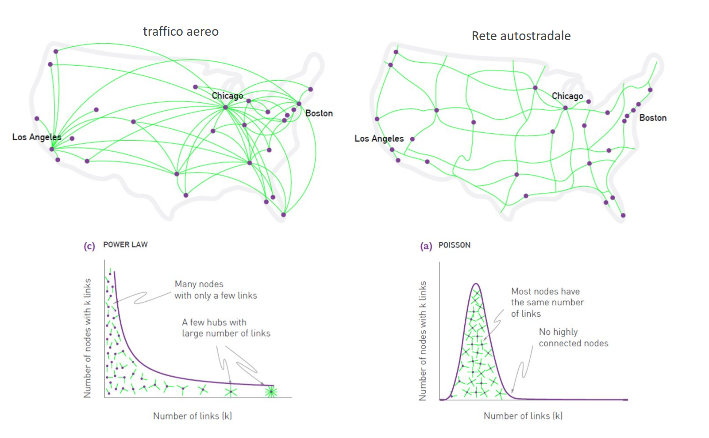

#### Proprietà ultra small-world

La presenza degli hub in una rete scale-free ha un'altra importante conseguenza: riduce la distanza media tra i nodi. Per valori dell'esponente di grado $2 < \gamma < 3$ si parla di ultra small-world. In questo scenario la distanza media tra i nodi è più piccola della distanza media osservata nella rete random. Per $gamma > 3$ la rete è small-world ed ha proprietà che la rendono molto simile ad una rete random. Nel caso $\gamma < 2$  per $N$ che tende ad infinito sia la media che la varianza divergono, ciò implica che non possono esistere reti grandi con $\gamma < 2$. Per le reti ultra small-world si ha: 
$$
\langle d \rangle = \ln(\ln(N))
$$

### 2.2.3 Perché le reti reali sono scale-free?

Come abbiamo visto, molte reti reali sono scale-free, indipendentemente dalla loro natura e dalla loro dimensione. Perché sistemi così diversi convergono verso architetture simili tra loro? Quali sono i meccanismi che fanno emergere la proprietà scale-free? Dunque bisogna investigare sul modo in cui le reti reali si evolvono nel tempo.  Vediamo due caratteristiche principali delle reti reali. 

##### Crescita della rete

Nelle reti reali il numero di nodi cresce continuamente grazie all'aggiunta di nuovi nodi anziché essere  fissato a priori come nei modelli random visti in precedenza. 

##### Preferential attachment

Nelle reti reali un nuovo nodo che entra nella rete tende a legarsi ai nodi più connessi, cioè a quelli più importanti, mentre nella rete random i partner di un nodo sono scelti in modo random. Basti pensare ai followers di Twitter o alle citazioni negli articoli. 

### 2.3 Modello di Barabasi-Albert

La crescita ed il preferential attachment sono proprio le due proprietà cardine del modello di Barabasi-Albert o modello scale-free, proposto nel '99 da Albert-Laszlo Barabasi e Reka Albert. La procedura di generazione del grafo è la seguente: 

* Crea una rete random iniziale con $m_0$ nodi, in cui ogni nodo abbia grado almeno pari a 1. 
* Aggiungi un nuovo nodo alla rete e collegalo a $m < m_0$ nodi esistenti nella rete.
  * La probabilità $P$ che un nuovo nodo si colleghi ad un nodo esistente $i$ di grado $k_i$ è: 

$$
P(k_i) = \frac {k_i} {\sum_{j \in V} k_j}
$$

* Ripeti il passo 2 sino a quando non si ottiene il numero desiderato $M$ di archi.

Il passo 2 realizza il *preferential attachment* in quanto $P$ è direttamente proporzionale al grado $k_i$. Il preferential attachment favorisce la formazione degli hub. Un nodo con alto grado ha più probabilità di un nodo con basso grado di stabilire nuove connessioni e diventare sempre più importante e centrale nella rete. Questo fenomeno è sintetizzato dall'espressione "*rich gets richer*". Attraverso il modello Barabasi-Albert si possono quindi creare reti scale-free.  

