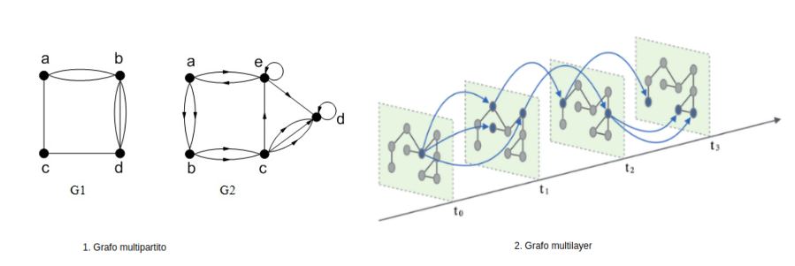
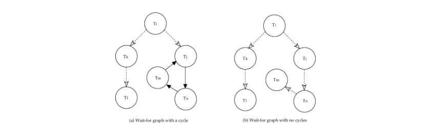
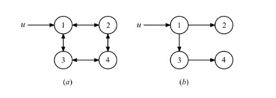
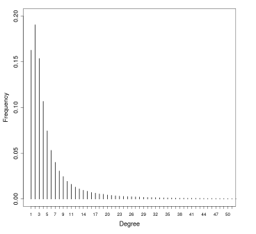
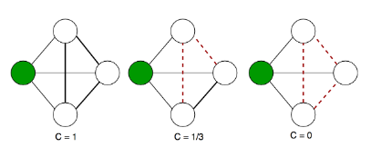
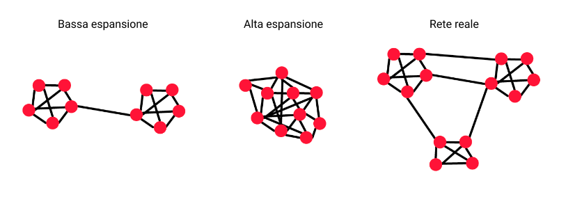
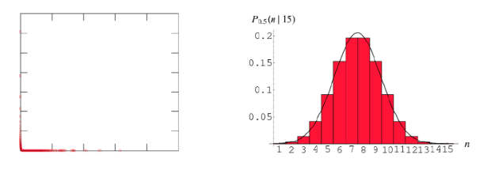
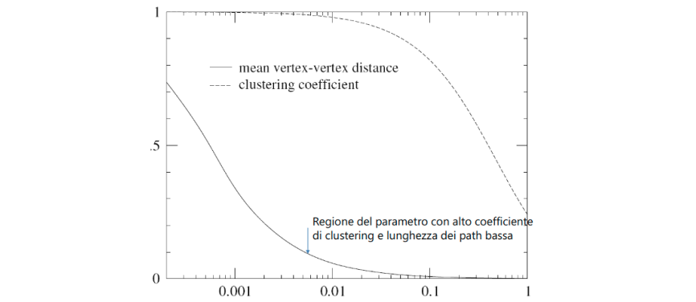
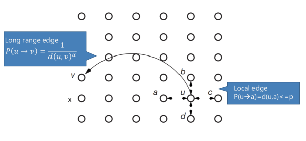
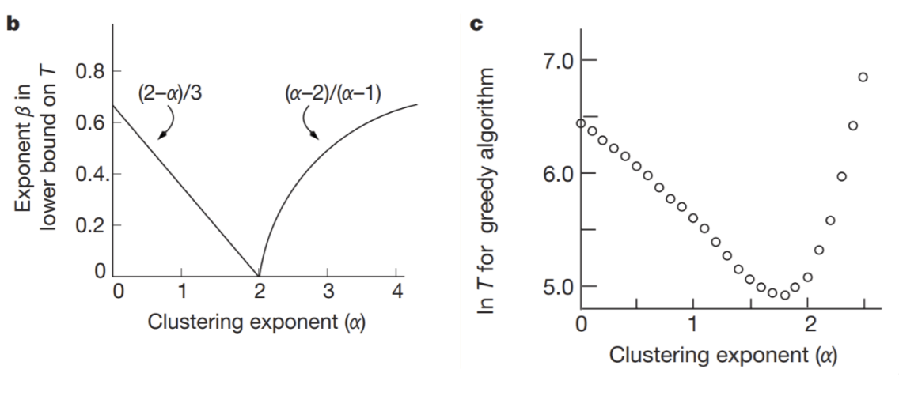

# Reti e modelli random

## 1. Reti

Le reti (o grafi) sono il modello matematico che permette di codificare le interazioni tra le componenti di un sistema complesso. La scienza che studia le reti prende il nome di network science. Formalmente, un grafo è una coppia $G=(V,E)$ dove $V$ è l'insieme di vertici ed $E$ è l'insieme degli archi, dove un arco è una coppia di vertici $(u, v)$. I vertici rappresentano le componenti del sistema, mentre gli archi rappresentano le interazioni tra le componenti. Se $(a,b) \in E$ allora diremo che $b$ è *adiacente* ad $a$. 

> Quando si parla di network (reti) si fa spesso riferimento a sistemi reali, come le social network o il web. In tale contesto si parla di nodi e link tra nodi. Una network viene rappresentata matematicamente da un grafo, dove si usano in maniera formale i termini "vertici" o "archi" .

#### 1.1.1 Grafi diretti e indiretti

Un grafo è detto *indiretto* (o non orientato) se: 
$$
\forall \space (a,b) \in E \Longleftrightarrow (b,a) \in E
$$
Altrimenti si parla di grafo *diretto* (o orientato). In altre parole, in un grafo indiretto ogni interazione tra due nodi è reciproca, mentre nelle reti dirette non è detto che lo sia. 

#### 1.1.2 Grafi pesati ed etichettati

Ai nodi e agli archi di una rete possono essere associate delle informazioni aggiuntive legate alla semantica della rete stessa. Se le informazioni associate ai nodi / archi sono valori numerici (interi o reali) si parla di rete *pesata*. Se sono etichette o stringhe si parla di *grafo etichettato*.  

#### 1.1.3 Grafi bipartiti 

Un grafo bipartito è un grafo in cui i nodi costituiscono due insiemi disgiunti $U$ e $V$ e ciascun arco del grafo collega un nodo di $U$ ad un nodo di $V$. Non esistono archi che collegano tra loro nodi dello stesso insieme. 

A partire da una rete bipartita è possibile generare due reti chiamate *proiezioni del grafo*, una rispetto all'insieme $U$ e l'altra rispetto all'insieme $V$. La proiezione rispetto ad $U$ è un grafo i cui nodi sono i nodi di $U$ ed un arco collega due nodi $u_1, u_2 \in U$ se e solo se $u_1, u_2$ hanno almeno un adiacente in comune nel grafo bipartito. Definizione analoga per la proiezione rispetto a $V$.  

> In una proiezione è possibile specificare, in un arco tra due nodi, quante connessioni hanno in comune i due nodi. Altrimenti è possibile considerare un multigrafo e aggiungere un arco tra $u_i$ e $u_j$ per ogni nodo $v$ in comune nel grafo bipartito. 

#### 1.1.4 Altre tipologie di grafi

* Grafo multipartito: generalizzazione del grafo bipartito, con più insiemi disgiunti di nodi. 
* Grafo con self-edge (o self-loop): grafo che ammette archi che partono e arrivano allo stesso nodo. 
* Multigrafo: grafo che ammette più archi tra $i$ e $j$. 
* Grafo multilayer: un grafo con più layer che permette connessioni sia all'interno che all'esterno del layer. 
* Grafo multiplex: grafo multilayer in cui i nodi non possono connettersi con nodi di altri layer. 

> Le reti multiplex e multilayer sono molto utilizzate nel contesto della [deanonimizzazione](https://en.wikipedia.org/wiki/Data_re-identification).

#### 1.1.5 Grafo completo o Clique 

Un *grafo completo*, o *Clique*, è un grafo in cui tutte le coppie distinte tra loro sono collegate da un arco. Il numero massimo di archi in un grafo non direzionato con $N$ nodi è dato dalle combinazioni a due a due dei nodi: 
$$
|E|_{max} = \binom{N}{2} = \frac{N(N-1)}{2}
$$
Il grado medio di un grafo completo con $N$ nodi è banalmente $N-1$ (ogni nodo è connesso con tutti i nodi, meno che con se stesso). 

#### 1.1.6 Grado di un nodo e grafo regolare

Il grado (*degree*) $k_u$ di un nodo $u$ è il numero di nodi adiacenti ad $u$ nel grafo. Un nodo con grado 0 è detto *isolato*. In un grafo diretto si fa distinzione tra: 

* Grado *uscente* $k_u^{out}$ del nodo $u$: numero di nodi adiacenti ad $u$ nel grafo
* Grado *entrante* $k_u^{in}$ del nodo $u$: numero di nodi a cui $u$ è adiacente. 
* Grado *totale* $k_u$ del nodo $u$: somma del grado uscente e del grado entrante. 

Un grafo è detto *regolare* se ogni nodo ha lo stesso grado. 

#### 1.1.7 Grado medio

Il grado medio della rete in un grafo indiretto è
$$
\bar{k} = \langle k \rangle = \frac{1}{N} \sum_{i=1}^N k_{u_i} = \frac{2|E|}{N}
$$
Poiché ogni arco nell'insieme $E$ sarà *bidirezionale*. Invece in un grafo diretto avremo
$$
\bar{k}^{in} = \langle k^{in} \rangle = \frac{1}{N}\sum_{i=1}^N k_{u_i}^{in}    = \frac{|E|}{N} \\
\bar{k}^{out} = \langle k^{out} \rangle = \frac{1}{N}\sum_{i=1}^N k_{u_i}^{out}    = \frac{|E|}{N}
$$
Quindi vale sempre $\bar{k}^{in} = \bar{k}^{out}$, poiché gli archi uscenti di un nodo saranno archi entranti di un altro nodo.

#### 1.1.9 Rappresentazione di un grafo

È possibile rappresentare un grafo con $N$ nodi attraverso una matrice di adiacenza $A$ di dimensione $N \times N$, dove l'elemento $a_{ij} = 1$ se esiste un arco da $u_i$ a $u_j$, $a_{ij}=0$ altrimenti. Se il grafo è *pesato*, allora la matrice riporterà il peso dell'arco tra $i$ e $j$ nell'elemento $a_{ij}$, 0 altrimenti. 

Questa rappresentazione risulta poco conveniente in termini di spazio, poiché un nodo è spesso collegato a pochi altri nodi della rete. Una rappresentazione più efficiente risulta essere la lista di adiacenza, dove ad ogni nodo è appesa la lista di nodi adiacenti ad esso, o anche la lista di archi.  

### 1.2 Cammini tra nodi

Un cammino tra due nodi $u$ e $v$ è definito come una sequenza ordinata di $n$ archi: 
$$
(u = i_0, i_1), (i_1, i_2), ..., (i_{n-1}, i_n = v)
$$

In generale, possono esserci più cammini tra due nodi generici. Definiamo: 

* *Lunghezza del cammino*: la quantità $n$ di archi
* *Cammino minimo*: cammino di lunghezza minima 
* *Distanza*: lunghezza del cammino minimo
* *Diametro* di $G$: massima distanza tra due nodi in $G$

Definiamo **ciclo** un cammino in cui nodo di partenza e nodo finale coincidono: 
$$
(u = i_0, i_1), (i_1, i_2), ..., (i_{n-1}, i_n = u)
$$
Un ciclo di lunghezza 1 è detto *cappio* o *self-loop*. Un grafo che non contiene cicli è detto *aciclico*, o anche *albero*. 

#### 1.2.1 Connettività di un grafo

Due nodi $i$ e $j$ si dicono *connessi* se esiste un cammino tra essi, altrimenti si diranno *disconnessi*. Un grafo si dice *connesso* se tutte le coppie di nodi sono connesse, *disconnesso* altrmenti. Un grafo disconnesso $G$ risulta formato dall'unione di due o più sottografi connessi, chiamati *componenti*. Un sottografo è formato da un sottoinsieme di nodi di $G$ e dagli archi che li collegano.    

Per i grafi diretti o orientati si parla di connettività *forte* o *debole*. Un grafo orientato $G$ è detto *fortemente connesso* se, per ogni coppia di nodi $u,v \in V$ esiste un cammino tra $u$ e $v$ in $G$. È invece detto *debolmente connesso* se, per ogni coppia di nodi $u,v \in V$, esiste un cammino tra $u$ e $v$ in $G$, oppure esiste un cammino nel grafo $G'$ ottenuto da $G$ sostituendo gli archi direzionati con archi non direzionati. Da queste definizioni derivano, in maniera analoga a prima, i concetti di *componente fortemente connessa* e *componente debolmente connessa*. 

Definiamo *arco ponte* (**bridge**) quell'*arco* che, se cancellato, trasforma un grafo connesso in un grafo disconnesso. Chiamiamo *punto di articolazione* (**hub**) quel *nodo* che, se cancellato, trasforma un grafo connesso in un grafo disconnesso. Chiamiamo *componente connessa gigante* la componente connessa più grande. 

### 1.3 Descrivere una rete

È possibile descrivere una rete attraverso le sue proprietà, come la *distribuzione dei gradi* $P(k)$, la lunghezza media dei cammini $h$, o il coefficiente di clustering $C$. 

#### 1.1.8 Distribuzione dei gradi

La distribuzione dei gradi $P$ è una distribuzione di probabilità, dove $P(k)$ rappresenta la probabilità che un generico nodo della rete abbia grado $k$. La distribuzione dei gradi è la proprietà più importante della rete, poiché fenomeni come la robustezza della rete o la diffusione dei virus si possono spiegare attraverso tale proprietà. Data una rete reale, $P_k$ si ottiene dividendo il numero $N_k$ di nodi con grado $k$ per il numero di nodi $N$ della rete. 

#### 1.3.1 Coefficiente di clustering 

Il coefficiente di clustering $C_u$ di un nodo $u$ è una misura di quanto gli adiacenti di $u$ siano connessi tra loro. Essendo $k_u$ il grado del nodo, allora vi saranno $k_u$ nodi adiacenti ad $u$. Il numero massimo di archi possibili tra $k_u$ nodi è dato dalla formula precedentemente studiata: 
$$
\frac{k_u \times (k_u - 1)}{2}
$$
Definiamo $L_u$ il numero di archi effettivamente esistenti tra i $k_u$ adiacenti ad $u$. Definiamo il coefficiente di clustering come il rapporto tra il numero di archi esistenti ed il numero di archi possibili: 
$$
C_u = \frac {2L_u} {k_u \times (k_u-1)} \in [0,1]
$$
In altre parole, il coefficiente di clustering misura la densità locale della rete in un nodo $u$: più densamente interconnesso è il vicinato di $u$, più alto è il coefficiente di clustering. 

Definiamo **coefficiente di clustering *medio*** $\langle C \rangle$ la media dei coefficienti di clustering di tutti i nodi della rete: 
$$
\langle C \rangle = \frac 1 {|V|} \sum_{i \in V} C_i
$$

Il concetto di **coefficiente di clustering *globale*** è basato su triple di nodi. Una tripla consiste di tre nodi connessi da due (tripla aperta) o tre (tripla chiusa) collegamenti. Ogni tripla è incentrata su un nodo. Un triangolo consiste di tre triple chiuse incentrate sui tre stessi nodi che lo compongono (clique con 3 nodi). Definiamo coefficiente di clustering globale $C_{\Delta}$ il rapporto tra il numero di triangoli della rete (clique con 3 nodi) ed il numero totale di triple di nodi. 

#### 1.3.2 Numero di cammini

Supponiamo di voler calcolare il numero $H_{uv}^h$ di cammini di lunghezza $h$ tra $u$ e $v$. Se cerchiamo cammini di lunghezza $h=1$, allora basta consultare la matrice di adiacenza e vedere se l'elemento $A_{uv}$ sia asserito. Se cerchiamo cammini di lunghezza $h=2$, allora dobbiamo considerare un qualsiasi altro nodo che li connetta, per cui: 
$$
H_{uv}^{(2)} = \sum_{k \in V} A_{uk} A_{kv} = [A^2]_{uv}
$$
In generale, il numero di cammini tra $u$ e $v$ di lunghezza $h$ è
$$
H_{uv}^{(h)} = [A^h]_{uv}
$$
È possibile effettuare questa analisi attraverso una catenia di Markov, in cui la matrice di adiacenza (normalizzata) corrisponde alla matrice di transizione. 

#### 1.3.3 Lunghezza media dei cammini

La lunghezzza media $\bar h$ di un cammino per un grafo connesso $G$ (o una componente) o una componente fortemente connessa di un grafo diretto, corrisponde a
$$
\bar{h} = \frac{1}{2E_{max}} \sum_{u \ne v} h_{uv}
$$
Il valore  $h_{uv}$ indica la distanza tra i nodi $u$ e $v$. Normalizziamo per il numero massimo di archi perché vogliamo indicare tutti i possibili cammini, e dividiamo per due per evitare di considerare due volte lo stesso cammino (nel caso di grafi indiretti). 

### 1.4 Centralità di un nodo

La centralità è una misura dell'importanza di un nodo nella rete. Esistono diverse misure di centralità, a seconda del criterio utilizzato per misurare l'importanza di un nodo. 

#### 1.4.1 Degree centrality

La centralità basata sul grado è la misura più semplice di centralità. La degree centrality è semplicemente il grado del nodo. Più alto è il grado del nodo e più è importante. 

#### 1.4.2 Betweenness centrality 

La betweenneess centrality è basata sul concetto di betweenness di un nodo: dato un nodo $v$ e due nodi qualsiasi del grafo $i$ e $j$, si calcola $\sigma_{ij}$, ovvero la frazione di cammini minimi tra $i$ e $j$ che passano per $v$. La betweenness di $v$ è ottenuta sommando $\sigma_{i.j}$ per tutte le coppie $i,j \in V$

$$
C_{B}(v) = \sum_{i < j} \sigma_{ij} 
=\sum_{i < j} \frac{g_{ij}(v)}{g_{ij}}
$$
Dove $g_{ij}$ è il numero di cammini minimi da $i$ a $j$, mentre $g_{ij}(v)$ indica quanti di questi contengono il nodo $v$. Usualmente, tale metrica si normalizza come: 
$$
C'_B = C_B / [\frac{(n-1)(n-2)}{2}]
$$
Dove al denominatore si ha il coefficiente binomiale $\binom{n-1}{2}$ che specifica il numero di cammini possibili tra gli $n-1$ nodi restanti nella rete. In base a questa definizione, un nodo è centrale se si trova nel mezzo di molti cammini di comunicazione tra nodi del grafo. 

#### 1.4.3 Closeness centrality 

La closeness centrality si basa sulla vicinanza media di un nodo rispetto a tutti gli altri nodi del grafo. Dato un nodo $v$, si calcola la lunghezza media $L_v$ dei cammini minimi da $v$ agli altri nodi del grafo. La closeness centrality di $v$ è definita come il reciproco di $L_v$. 

La closeness centrality di un nodo $v$ è una misura della velocità media con cui una informazione, partendo da $v$, può raggiungere tutti gli altri nodi del grafo. 

#### 1.4.4 PageRank centrality

La PageRank centrality si basa sull'osservazione che le connessioni di un nodo con gli altri nodi non hanno tutte lo stesso valore (come assunto invece dalla degree centrality). Connessioni a nodi con elevato grado hanno un peso maggiore rispetto a connessioni a nodi di grado minore. 

È possibile definire la metrica ricorsivamente: un nodo è tanto più importante quanto più è connesso ad altri nodi importanti della rete. Formalmente, il Page Rank di un nodo $u$, $PR(u)$, è dato da: 
$$
PR(u) = \sum_{v \in B_u} \frac {PR(v)}{k_v}
$$
Dove $B_u$ è l'insieme dei nodi che hanno $u$ come adiacente e $k_v$ è il grado uscente di $v$. 

#### 1.5.5 Calcolo del PageRank 

Consideriamo un semplice esempio di rete diretta costituita da 4 nodi $V=\{A, B, C, D\}$. Immaginiamo che ogni nodo abbia a disposizione un tesoro iniziale, uguale per tutti. Se il tesoro iniziale complessivo è pari ad 1, ogni nodo avrà un tesoro iniziale pari a 0.25. 

Ogni nodo deve cedere il proprio tesoro in parti uguali tra i suoi adiacenti. Calcoliamo ad esempio il tesoretto di $B$: 

* $A$ cede metà del suo tesoro a B e a C. Dunque B riceve 0.125 da A, ovvero $PR(A)/2$ o $PR(A)/k_A$. 
* $C$ non cede nulla a B. 
* $D$ cede metà del suo tesoro a B e ad A. Dunque B riceve 0.125 da D, ovvero $PR(D)/2$ o $PR(D)/k_D$.

Quindi: 
$$
PR(B) = \frac {PR(A)} {k_A} + \frac {PR(D)} {k_D} = 0.125 + 0.125 = 0.25 
$$
Con lo stesso principio possiamo calcolare il nuovo page rank degli altri 3 nodi. Alla fine del primo round $C$ è l'unico nodo che si ritrova con un tesoro maggiore. 

Iterando questo scambio di tesori si otterrà una situazione di equilibrio in cui il tesoro di ogni nodo non varierà più in maniera significativa. A tempo di convergenza si conosce il valore di centralità per ogni nodo. 

## 2. Modelli random

Uno degli obiettivi della Network science è quello di costruire modelli in grado di riprodurre proprietà specifiche della rete reale, legate ad esempio al grado dei nodi, al diametro della rete etc. Le reti reali, a parte qualche rara eccezione (es. reticoli), non hanno una struttura regolare, ma presentano una certa randomicità. Sin dagli anni '50 sono stati teorizzati e sviluppati modelli probabilistici, detti modelli random, per cercare di spiegare queste proprietà intrinseche delle reti reali. Tali modelli sono generativi, cioè permettono di generare reti con certe caratteristiche.  

Supponiamo di avere un modello random che generi una rete con le stesse caratteristiche delle reti reali. Supponiamo anche di stare analizzando una rete reale e di ottenere certi risultati (es. coefficiente di clustering, distribuzione dei gradi etc). Per capire se la rete reale ha proprietà *attese* o *sorprendenti*, essa va confrontata (quindi sottoposta a test di ipotesi) con delle reti generate da un modello random nullo che riesca a catturare le proprietà delle reti reali. 

### 2.1 Modello di Erdos-Renyi 

Il primo modello random fu proposto da due matematici ungheresi, Erdos e Renyi, negli anni '60 e prende il loro nome. Fissata una probabilità $p$ ed il numero di nodi $N$ della rete da generare, il modello Erdos-Renyi crea un insieme iniziale di $N$ nodi isolati e per ciascuna coppia di nodi distinti, aggiunge un arco con probabilità $p$. La rete ottenuta con il modello Erdos-Renyi è detta grafo random o rete di Erdos-Renyi. 

#### 2.1.1 Variante G(N,L) del modello

Il modello appena descritto è detto modello $G(N,p)$, perché genera un grafo random partendo dal numero di nodi $N$ e dalla probabilità $p$ che esista un arco tra due nodi. Una variante è rappresentata dal modelo $G(N, L)$, in cui si genera un grafo random con $N$ nodi ed $L$ archi random. 

In questa variante si parte da una rete con $N$ nodi isolati. Ad ogni passo si sceglie una coppia non connessa e casuale e si aggiunge un arco tra essi. Si prosegue sinché la rete non contiene $L$ archi. I due modelli sono equivalenti tra loro. 

#### 2.1.2 Distribuzione dei gradi (e degli archi)

Per ricavare l'espressione della *distribuzione dei gradi* di una rete random con $N$ nodi, occorre calcolare la probabilità $p_k$ che un generico nodo abbia grado $k$. Ipotizziamo di essere al turno di assegnazione degli archi di generico nodo $u \in V$, la probabilità che $u$ abbia grado $k$ è la probabilità che su $N-1$ nodi rimanenti, $k$ nodi si colleghino ad $u$. Tale distribuzione prende il nome di *distribuzione binomiale* ed è definita per i generici $n$ e $k$ come segue: 
$$
P (X = k) = \binom{n}{k} p^k(1-p)^{n-k}
$$
Nel nostro caso $n = N-1$ e $k=k$, per cui: 
$$
P_k = \binom{N-1}{k} p^k(1-p)^{N-1-k}
$$
Dove $(1-p)^{N-1-k}$ è la probabilità che $N-1-k$ nodi restanti non creino un collegamento con $u$, mentre $p^k$ è la probabilità che $k$ nodi si colleghino ad $u$. Il coefficiente binomiale iniziale prende in considerazione tutti i modi in cui è possibile selezionare $k$ nodi da collegare ad $u$ tra gli $N-1$ rimanenti. Avendo associato la distribuzione dei gradi ad una binomiale, è possibile calcolare il valore atteso
$$
\langle k \rangle = p (N-1)
$$
Banalmente poiché una variabile binomiale è data dalla somma di $n$ variabili Bernoulliane, il cui valore atteso è $p$. Allo stesso modo si può dimostra che la varianza rispetto al grado medio corrisponde a  
$$
\sigma = (N-1)p(1-p)
$$
Allo stesso modo, è possibile dimostrare che la probabilità che una rete random abbia esattamente $E$ archi totali è distribuita secondo una binomiale:
$$
P(E) = \binom{E_{max}}{E} p^E (1-p)^{E_{max} - E}
$$
Con valore atteso $E[X] = pE_{max}$ e varianza $\sigma=E_{max}p(1-p)$.

Per $N \gg \langle k \rangle$ la distribuzione binomiale è ben approssimata da una distribuzione di Poisson: 
$$
p_k = \exp(-\langle k \rangle \frac{\langle k \rangle^k}{k! } )
$$

Dal momento che la distribuzione dei gradi è binomiale, in una rete random i nodi hanno perlopiù lo stesso grado. In reti random grandi, in cui la distribuzione è approssimativamente di Poisson, la maggior parte dei nodi ha un grado più o meno pari al grado medio $\langle k \rangle$. Pochi nodi hanno un grado diverso dalla media. 

#### 2.1.3 Coefficiente di clustering nel grafo random 

Per calcolare il coefficiente di clustering di un generico nodo $n$, occorre prima stimare il numero atteso (media) di archi tra gli adiacenti di $n$. Se $k_n$ è il grado di $n$, il numero atteso di archi è: 
$$
\langle L_n \rangle = p \times \frac {k_n(k_n-1)}{2}
$$
Dunque, il coefficiente di clustering di $n$ è dato da: 
$$
C_n = \frac {2\langle L_n \rangle}{k_n(k_n-1)} = p
$$
Dato che $\langle k \rangle = p(N-1)$ allora: 
$$
C_n = p = \frac {\langle k \rangle} {N-1}
$$
Quindi il coefficiente di clustering è inversamente proporzionale al numero di nodi $N$ nella rete e direttamente proporzionale al grado medio. Si noti che il coefficiente di clustering del nodo è indipendente dal grado del singolo nodo. Considerazioni analoghe possono essere fatte per il coefficiente di clustering globale. 

#### 2.1.4 Definizione di espansione

Un grafo $G(V,E)$ ha una espansione $\alpha$ se $\forall S \subseteq V$ si ha 
$$
\text{#archi uscenti da $S$} \ge \alpha \min(|S|, |V \setminus S|)
$$
o alternativamente 
$$
\alpha = \min_{S \subseteq V} \frac
{\text{#edges leaving $S$}}
{\min(|S|, |V \setminus S|)}
$$
L'espansione misura la robustezza della rete: per disconnettere $l$ nodi è necessario rimuovere un numero maggiore o uguale ad $l \cdot \alpha$ archi. 

##### Teorema n.1 

Sia $G$ un grafo random regolare di grado 3 con $n$ nodi, allora esiste una costante $\alpha > 0$ ed indipendente da $n$ tale che l'espansione del grafo è sempre maggiore o uguale ad $\alpha$. 

##### Teorema n.2 

Sia $G$ un grafo con $n$ nodi e con espansione $\alpha$, allora per tutte le coppie di nodi $u$ e $v$ esiste un cammino con $O(\frac{\log n}{\alpha})$ archi che li connette. 

#### 2.1.4 Lunghezza dei cammini e fenomeno small world 

Dati i teoremi precedenti, possiamo affermare che la distanza (o lunghezza dei cammini minimi) tra due generici nodi $u$ e $v$ è $O(\log n)$. È possibile dimostrare che:
$$
\langle d \rangle \approx \frac {\ln N}{\ln \langle k \rangle}
$$
Dal momento che $\ln(N) \ll N$, nella rete random le distanze tra i nodi della rete sono mediamente piccole, tale fenomeno prende il nome di *small world*. Il termine: $1 / \ln\langle k \rangle$ implica che più è densa la rete, più piccola è la distanza tra i nodi. 

#### 2.1.5 Confronto tra reti reali e reti random

Prendiamo come esempio la rete MSN, ovvero una rete reale che rappresenta i collegamenti tra gli utenti in Microsoft Messenger. Confrontiamo le proprietà di tale rete con una rete generata da un modello di Erdos-Renyi. Iniziamo con la **distribuzione dei gradi**: osserviamo che le due distribuzioni differiscono. Le reti reali assumono una distribuzione dei gradi molto simile ad una esponenziale (non lo è) che studieremo più avanti. 

La **distanza media** tra due nodi nella rete MSN è $6.6$; il modello random riproduce tale proprietà con un valore medio di circa $8.2$ ($O(\log n)$). Il **coefficiente di clustering** differisce nelle due reti, con un valore di 0.11 per la rete MSN ed un valore vicino allo 0 per la rete random. Possiamo affermare che le reti reali sono *diverse* dalle reti random. 

#### 2.1.6 Proprietà riprodotta: small-world

L'unica proprietà delle reti reali che la rete random riesce a cogliere abbastanza bene è quella denominata "small world", legata alla distanza media tra i nodi (anche se spesso nelle reti reali si osserva una distanza ancora più bassa). Il fenomeno small world afferma che anche due individui che vivono in zone molto lontane sulla Terra possono essere connessi tra loro attraverso una catena molto piccola di conoscenze. Tale fenomeno è conosciuto anche con il termine "*sei gradi di separazione*" (*six degrees of separation*). La teoria dei sei gradi di separazione fu formulata per la prima volta nel '29 dallo scrittore ungherese Frigyes Karinthi, ma il termine "sei gradi di separazione" fu coniato in seguito ad un famoso esperimento condotto nel '67 da uno psicologo americano, Stanley Milgram. 

##### L'esperimento di Milgram 

Milgram selezionò in maniera casuale un gruppo di studenti americani del Midwest e chiese loro di spedire un pacchetto ad un estraneo del Massachusetts, a migliaia di chilometri di distanza. Ad ognuno di questi studenti Milgram consegnò una lettera con indicazioni riguardo il nome del destinatario, il suo impiego e la zona di residenza, senza però specificare l’indirizzo esatto. Ad ogni partecipante all’esperimento fu quindi chiesto di spedire il proprio pacchetto ad una persona da loro conosciuta che, a loro giudizio, potesse avere maggiori probabilità di conoscere il destinatario finale. Quella persona avrebbe fatto a sua volta lo stesso, fino a quando il pacchetto non fosse arrivato a destinazione. Al termine dell’esperimento, Milgram scoprì con sorpresa che il numero medio di intermediari era 5.2, quindi un numero piccolo e molto vicino a quello teorizzato da Kharinty nel 1929. Ad oggi l'esperimento è stato riproposto e riconfermato attraverso le reti sociali ed altri tipi di reti digitalizzate. 

##### Definizione di small-world 

Formalmente, una rete soddisfa le proprietà small-world se la distanza media tra i nodi è: 
$$
\langle d \rangle \approx \frac {\ln N}{\ln \langle k \rangle}
$$
Ovvero, una rete è small-world se la distanza media tra i nodi ha una dipendenza logaritmica rispetto alla dimensione della rete (numero di nodi). 

### 2.2 Modello Watts-Strogatz 

Il modello Erdos-Renyi approssima bene la proprietà small-world, ma non il coefficiente di clustering della rete reale. Nel '98 Duncan Watts e Steven Strogatz proposero un'estensione al modello Erdos-Renyi, chiamato modello Watts-Strogatz o modello small-world. 

Il modello consente di creare delle reti random che rappresentano una interpolazione tra il grafo regolare, che ha un alto coefficiente di clustering ma non esibisce la proprietà small-world, ed il grafo random, che ha basso coefficiente di clustering ma gode della proprietà small-world. 

Anche in questo caso, la distribuzione dei gradi che si ottiene è simile ad una distribuzione di Poisson. Il tipo di grafo prodotto dipende da un parametro $p$, detto anche parametro di *rewiring*. La rete che si ottiene ha caratteristiche intermedie tra la rete regolare e quella random: più basso è $p$, più la rete è simile alla rete regolare, più è alto $p$, più è simile alla rete random. 

Sia $n$ il numero di nodi della rete da generare, $p$ il parametro di rewiring e $d$ un intero $d \ge 1$, siano $1, 2, \dots, n$ gli identificativi dei nodi della rete. Si collega ciascun nodo $i$ ai nodi $i+1, i+2, \dots, i+d$. Al termine di questo passo si ottiene un grafo *regolare*. Per ciascun arco, si scambia il nodo destinazione con un altro nodo random della rete con probabilità $p$. 

Plottando l'andamento del coefficiente di clustering e della distanza media tra nodi al variare del parametro $p$, notiamo che il coefficiente di clustering decresce lentamente, mentre la distanza decresce più velocemente. È possibile travare una regione in cui il coefficiente di clustering sia ancora alto, mentre la distanza sia piccola (come indicato in foto). Il modello di Watts-Strogatz riesce a catturare due delle proprietà delle reti reali, tuttavia non riesce a riprodurre la distribuzione dei gradi. 

### 2.2.1 Problema della navigazione e modello di Kleinberg

Consideriamo il problema della consegna di un messaggio da un generico nodo $u$ della rete ad un generico nodo $v$ della rete. Avendo una visione globale della rete, trovare il cammino minimo che collega i due nodi risulta essere molto semplice. Le reti random small world, in questo caso, ci permettono di consegnare in messaggio in tempo $O(\log n)$. Tuttavia, quando non si dispongono di informazioni globali e vengono sfruttati algoritmi decentralizzati, pur avendo una distanza media logaritmica tra nodi, il tempo di navigazione $T$ può essere maggiore. La  caratteristica della rete che descrive la capacità di arrivare da un nodo ad un altro nella rete senza informazioni globali è chiamata *navigabilità*. 

Il modello di Kleinberg è una versione del modello di Watts-Strogatz che garantisce un tempo di navigazione $T = O((\log n)^2)$. Supponiamo di disporre di una griglia di punti (lattice) e di misurare la distanza tra due punti attraverso la distanza di Manhattan. 

Definiamo arco locale (*local edge*) di un generico nodo $u$, tutti gli archi che collegano $u$ a nodi con distanza di Manhattan pari ad 1. Gli archi locali esistono con probabilità $p = 1$. Una volta collegati gli archi locali nel grafo, si esegue il rewiring andando a collegare un generico nodo $u$ ad un generico nodo $v$ non connesso ad $u$ con probabilità 
$$
P(u \to v) = \frac{1}{d(u,v)^{\alpha}}
$$
Dove $\alpha$ è un parametro chiamato *esponente di clustering*. Se $\alpha < 1$, allora il modello stimolerà le connessioni a più alta distanza, chiamate *long range edge*, mentre per $\alpha > 1$ gli archi saranno più frequentemente su nodi vicini. Sia $d$ il numero di dimensioni del lattice, modificando $\alpha$ si ottengono diversi gradi di navigabilità:

* Per $\alpha = 0$ i link sono scelti in maniera uniforme su tutta la rete (mod. Watts-Strogatz);
* Per $\alpha > d$ si tende a scegliere archi con nodi vicini 
  * La ricerca decentralizzata trova rapidamente un target nelle vicinanze, ma lo raggiunge lentamente se è lontano. 
* Per $\alpha < d$ si tende a scegliere molti archi con nodi lontani
  * La ricerca decentralizzata si avvicina rapidamente all'area del target, ma poi rallenta fino a raggiungere il target. 
* Per $a = d$ si ottiene una navigabilità ottimale per la rete. 

Si osservi il plot che mostra nell'ascisse l'esponente di clustering e nelle ordinate il tempo di navigazione. Tale plot rispecchia quanto detto per un lattice bidimensionale. 

#### Teorema 

Sia $d(u,v)$ la distanza tra due nodi $u$ e $v$ di una griglia *bidimensionale* ($d=2$) di $n$ nodi. Se tra due vertici $u$ e $v$ viene aggiunto un arco remoto con probabilità $P(u \to v) = \frac{1}{d(u,v)^{\alpha}}$ con $\alpha = 2$ allora esiste un algoritmo di routing decentralizzato $A$ ed una costante $\alpha_2$ indipendente da $n$ tali che, quando $p=1$ (distanza massima affinché un nodo sia considerato "vicino") e $q=1$ (numero di archi long range per nodo) il numero di passi impiegati da $A$ per trasmettere un messaggio tra una coppia qualsiasi di nodi è al più $\alpha_2 (\log n)^2$. 

> Alcune referenze per il modello di Kleinberg: 
>
> * https://www.nature.com/articles/35022643.pdf
> * https://chih-ling-hsu.github.io/2020/05/15/kleinberg

Confrontiamo infine i modelli visto sino ad ora rispetto alla navigabilità:

|             | Kleinberg              | Watts-Strogatz     | Erdos-Renyi     |
| ----------- | ---------------------- | ------------------ | --------------- |
| Navigabile? | Yes                    | No                 | No              |
| T           | $O((\log n)^{\alpha})$ | $O(n^{\alpha})$    | $O(n^{\alpha})$ |
| Search time | $O((\log n)^2)$        | $O(n^{\frac 2 3})$ | $O(n)$          |

### 2.2.2 Configuration model 

Il configuration model è un modello in grado di generare un rete con una sequenza di gradi fissata $\langle k_1, k_2, \dots, k_n \rangle$. La procedura con cui si crea una rete attraverso il configuration model consiste nel generare, per ogni nodo, il rispettivo grado. I nodi vengono accoppiati casualmente. È utile come modello nullo, per confrontare una rete reale $G$ con una rete $G'$ che la ha stessa frequenza di gradi, quindi la stessa distribuzione dei gradi $P$.

### 2.2.1 Distribuzione power-law

Nel modello Watts-Strogatz la distribuzione dei gradi dei nodi risulta essere una distribuzione simile alla Poisson, analogo nel modello di Erdos-Renyi. Come abbiamo visto, nelle reti reali la distribuzione dei gradi non è affatto simile alla distribuzione di Poisson. Piuttosto, è ben approssimata da una distribuzione chiamata *power-law*. 

Una distribuzione $p$ è una power-law se: 
$$
p_k \propto k^{-\gamma}
$$
Dove il parametro $\gamma$ è detto *esponente di grado*. Si può dimostrare che sopra un certo valore $x$, la distribuzione power law è sempre più alta della distribuzione esponenziale, quindi 
$$
\lim_{x\to\infty} \frac{zx^{-\gamma}}{e^{-x}} = \infty
$$
Nelle reti reali si osserva generalmente $2 < \gamma < 3$. Vediamo a confronto la distribuzione power-law e quella di Poisson. Si osservi che, in scala log-log (b) la distribuzione power-law assume la forma di una retta di pendenza $-\gamma$.

#### Studiare la legge di potenza in una rete reale

Supponiamo di avere a disposizione una rete reale che segue una legge di potenza
$$
P(x) = z x^{-\gamma}
$$
Siamo interessati a conoscere la costante di normalizzazione $z$ e l'esponente di grado $\gamma$. Essendo $P(x)$ una distribuzione di probabilità, l'area sotto la curva varrà 1: 
$$
1 = \int_{x_m}^{+\infty} zx^{-\gamma} dx = 
z \int_{x_m}^{+\infty} x^{-\gamma} dx
$$
Dove $x_m$ è un numero stimabile dai dati reali, dopo il quale la distribuzione segue la legge di potenza. Risolvendo l'equazione rispetto a $z$ otteniamo che 
$$
z = (\gamma -1) x_m^{\gamma - 1}
$$
Quindi sostituendo la $z$ nella distribuzione dei gradi otteniamo
$$
P(x) = \frac{\gamma - 1}{x_m^{1 - \gamma}} x^{-\gamma}
$$
Il valore atteso di tale distribuzione risulta essere:
$$
E[X] = \frac{\gamma - 1}{\gamma -2} x_m
$$
Se $\gamma < 2$ allora il valore atteso assume un valore negativo. Tuttavia non è possibile avere un grado negativo, per cui il valore atteso diverge a $\infty$. Per $\gamma < 3$ anche la varianza $Var[X]$ diverge a $\infty$. 

Per stimare l'esponente di grado $\gamma$ è possibile utilizzare la Maximum Likelihood: 
$$
L(\gamma) = \log \left( \prod_{i}^n p(d_i) \right) =
\sum_i^n \log(p(d_i)) = 
\sum_i^n \left(  
\ln(\gamma - 1) - \ln(x_m) - \gamma \ln(\frac{d_i}{x_m})
\right)
$$
Vogliamo trovare $\gamma$ che massimizza $L(\gamma)$, per cui settiamo $\frac{dL(\gamma)}{d\gamma} = 0$ e risolviamo l'equazione. Ne segue che: 
$$
\hat\gamma = 1 + n\left[ \sum_i^n \ln \left(\frac{d_i}{x_m}\right) \right]^{-1}
$$

### 2.2.2 Rete scale-free

Le reti la cui distribuzione dei gradi segue una distribuzione power-law sono dette reti *scale-free*, o *invarianti per scala*. Ciò implica che nelle reti scale-free vi è una piccola porzione di nodi che hanno un grado elevato ed una elevata porzione di nodi, che copre quasi tutta la rete, con basso grado. I nodi di elevato grado vengono chiamati anche *hub*. 

Una rete scale-free è quindi caratterizzata dalla presenza di un certo numero di *hub*, che risultano essere praticamente assenti nelle reti random o small-world. Il comportamento scale-free delle reti reali riflette perfettamente ciò che accade in tantissimi ambiti della società attuale (economia, rapporti sociali, etc.) ed è ben riassunto dalla regola di Pareto, o regola 80/20. 

Il termine "scale-free" si riferisce all'assenza di una scala, ovvero un valore di riferimento per stabilire il grado di un nodo qualsiasi della rete. In una rete random in cui la distribuzione dei gradi è di Poisson, la media corrisponde al picco della curva e i gradi dei rimanenti nodi si discostano poco dalla media (varianza finita e bassa): in tal caso la media rappresenta il valore di scala. 

In una rete scale-free, in cui la distribuzione dei gradi è power-law, la varianza della distribuzione diverge per $N$ molto grande. Ciò implica che se scegliamo in maniera casuale un nodo, non possiamo dire nulla sul suo grado: può essere estremamente piccolo o estremamente grande. Non possiamo quindi indicare un ordine di grandezza o una scala al grado di un nodo. 

La presenza di hub in una rete scale-free ha una conseguenza importante: rende in generale la rete più robusta ad attacchi o situazioni per cui uno o più collegamenti nella rete vengono meno. Se in una rete random un nodo qualsiasi viene giù o un collegamento si interrompe, l'intera rete potrebbe essere compromessa. I punti sensibili di una rete scale-free sono gli hub, che collegano la maggior parte dei nodi. 

#### Proprietà ultra small-world

La presenza degli hub in una rete scale-free ha un'altra importante conseguenza: riduce la distanza media tra i nodi. Per valori dell'esponente di grado $2 < \gamma < 3$ si parla di ultra small-world. In questo scenario la distanza media tra i nodi è più piccola della distanza media osservata nella rete random. Per $\gamma > 3$ la rete è small-world ed ha proprietà che la rendono molto simile ad una rete random. Nel caso $\gamma < 2$  per $N$ che tende ad infinito sia la media che la varianza divergono, ciò implica che non possono esistere reti grandi con $\gamma < 2$. Per le reti ultra small-world si ha: 
$$
\langle d \rangle = \ln(\ln(N))
$$

### 2.2.3 Perché le reti reali sono scale-free?

Come abbiamo visto, molte reti reali sono scale-free, indipendentemente dalla loro natura e dalla loro dimensione. Perché sistemi così diversi convergono verso architetture simili tra loro? Quali sono i meccanismi che fanno emergere la proprietà scale-free? Dunque bisogna investigare sul modo in cui le reti reali si evolvono nel tempo.  Vediamo due caratteristiche principali delle reti reali. 

##### Crescita della rete

Nelle reti reali il numero di nodi cresce continuamente grazie all'aggiunta di nuovi nodi anziché essere  fissato a priori come nei modelli random visti in precedenza. 

##### Preferential attachment

Nelle reti reali un nuovo nodo che entra nella rete tende a legarsi ai nodi più connessi, cioè a quelli più importanti, mentre nella rete random i partner di un nodo sono scelti in modo random. Basti pensare ai followers di Twitter o alle citazioni negli articoli. 

### 2.3 Modello di Barabasi-Albert

La crescita ed il preferential attachment sono proprio le due proprietà cardine del modello di Barabasi-Albert o modello scale-free, proposto nel '99 da Albert-Laszlo Barabasi e Reka Albert. La procedura di generazione del grafo è la seguente: 

* Crea una rete random iniziale con $m_0$ nodi, in cui ogni nodo abbia grado almeno pari a 1. 
* Aggiungi un nuovo nodo alla rete e collegalo a $m < m_0$ nodi esistenti nella rete.
  * La probabilità $P$ che un nuovo nodo si colleghi ad un nodo esistente $i$ di grado $k_i$ è: 

$$
P(k_i) = \frac {k_i} {\sum_{j \in V} k_j}
$$

* Ripeti il passo 2 sino a quando non si ottiene il numero desiderato $M$ di archi.

Il passo 2 realizza il *preferential attachment* in quanto $P$ è direttamente proporzionale al grado $k_i$. Il preferential attachment favorisce la formazione degli hub. Un nodo con alto grado ha più probabilità di un nodo con basso grado di stabilire nuove connessioni e diventare sempre più importante e centrale nella rete. Questo fenomeno è sintetizzato dall'espressione "*rich gets richer*". Attraverso il modello Barabasi-Albert si possono quindi creare reti scale-free.  

### 2.3.1 Variante del modello

Supponiamo di introdurre una variabile $p$ distribuita uniformemente. Allora possiamo modificare il nostro modello che sfrutta il preferential attachment come segue: 

* Con probabilità $p$ si collega $j$ ad un nodo $i$ random
* Con probabilità $1-p$ si collega $j$ utilizzando il preferential attachment

Se $p=0$, allora il modello ricade nel modello standard di Barabasi-Albert. Da tale costruzione del modello, ne deriva che
$$
P(d_i = k) \propto k^{-\left( 1 + \frac{1}{1-p} \right)}
$$
