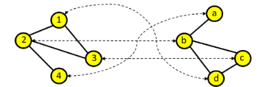
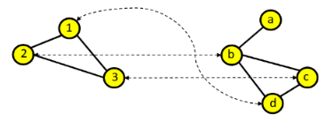
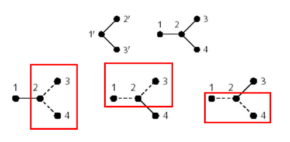
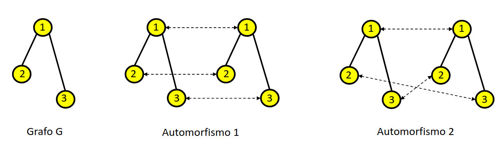
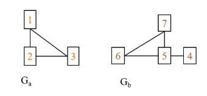
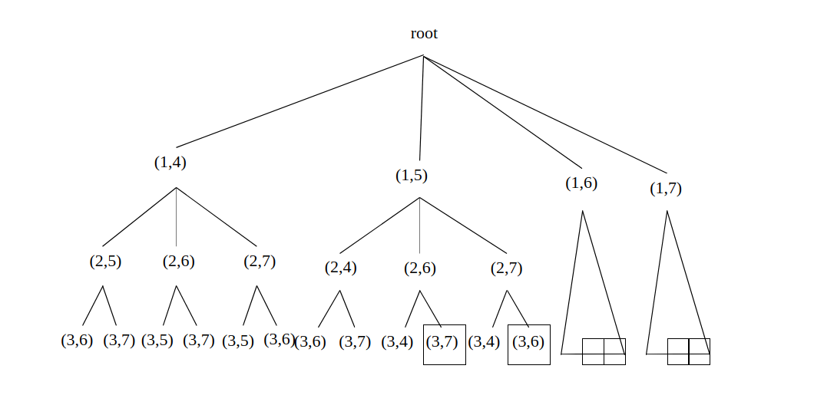
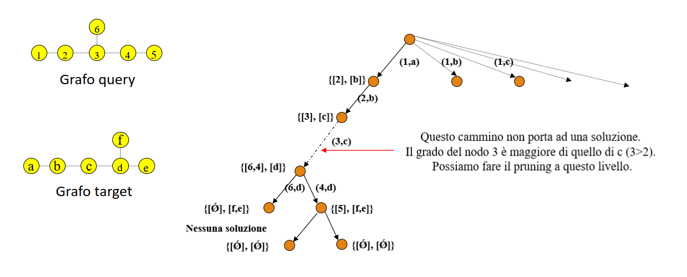
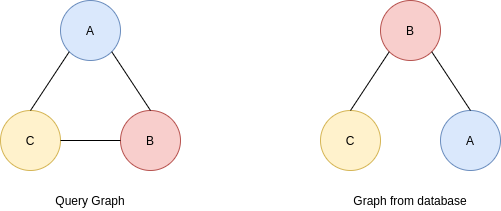
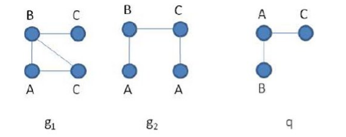

# Graph matching

## 1. Introduzione

### 1.1 Isomorfismo tra grafi

L'*isomorfismo tra grafi* (o *graph matching*) consiste nel verificare se due grafi sono "uguali" tra loro, ovvero hanno una corrispondenza (o matching). Formalmente, due grafi $G_1 = (V_1, E_1)$ e $G_2 = (V_2, E_2)$ si dicono isomorfi se: 
$$
\exist f: V_1 \to V_2 \mid \forall\space (u, v) \in E_1 \Longleftrightarrow (f(u), f(v)) \in E_2
$$
Ovvero se ad ogni arco tra due nodi $u$ e $v$ appartenenti a $G_1$, esiste un arco tra i nodi $f(u)$ ed $f(v)$ appartenenti al grafo $G_2$. Tale funzione $f$ è *biiettiva* e prende il nome di *mapping*. In altri termini, è possibile ri-etichettare i nodi di $G_1$ come nodi di $G_2$, mantenendo la relazione tra gli archi di $G_1$ e quelli corrispondenti di $G_2$. 




### 1.2 Isomorfismo tra sottografi

L'*isomorfismo tra sottografi* (o *subgraph matching*) consiste nel verificare se un grafo (detto grafo *query*) è contenuto in (quindi è sottografo di) un altro grafo più grande (detto grafo *target*). Formalmente, un grafo $G_1 = (V_1, E_1)$ è un sottografo isomorfo di un grafo $G_2 = (V_2, E_2)$ se 
$$
\exist f: V_1 \to V_2 \mid \forall\space (u, v) \in E_1 \Longrightarrow (f(u), f(v)) \in E_2
$$
La funzione $f$ prende ancora il nome di *mapping* e, dal momento in cui $f$ è solamente *iniettiva*, non è necessario che tutti i nodi di $G_2$ siano mappati. Al contrario, tutti i nodi del sottografo query $G_1$ lo saranno. 



<div style="page-break-after: always;"></div>

### 1.3 Matching multipli ed automorfismi

La soluzione del graph matching (o subgraph matching) non è univoca, in generale possono esistere varie funzioni di mapping $f$. 



L'isomorfismo tra un grafo $G$ e se stesso è detto automorfismo di $G$. Un grafo può avere più automorfismi: 




### 1.4 Complessità del matching

Il graph matching è un problema NP-hard, ma non si sa se sia NP-completo. Invece, il problema del subgraph matching è NP-completo, per cui se si trovasse una soluzione il cui tempo è polinomiale, allora si potrebbe usarla per risolvere ogni problema NP (si rimanda ai [casi di complessità P e NP](https://it.wikipedia.org/wiki/Classi_di_complessit%C3%A0_P_e_NP)). 


### 1.5 Algoritmi sviluppati

Per quanto concerne il graph matching, alcuni dei più famosi algoritmi sviluppati sono: Bliss, Saucy, Conauto, Nauty (ora Traces). Questi tool si basano sulla trasformazione dei grafi in una rappresentazione standard, chiamata *forma canonica*, in modo tale che due grafi isomorfi abbiano la stessa forma canonica. L'efficienza di tali algoritmi è legata all'efficienza della trasformazione dei grafi in forma canonica. In generale, non esiste un algoritmo migliore. A seconda del tipo di rete un algoritmo può essere migliore di altri. Su grafi reali, Nauty è sinora l'algoritmo migliore. Alcuni di questi algoritmi contengono una serie di utilità interessanti sui grafi, ad esempio la possibilità di generare tutti i possibili grafi connessi con $k$ nodi. Per quanto riguarda il subgraph matching possiamo riferirci a: Algoritmo di Ullmann ('76), algoritmo di Von Scholley ('84), VFlib, LAD, Focus-Search, RI.

<div style="page-break-after: always;"></div>

## 2. Algoritmi di subgraph matching

Tutti gli algoritmi di subgraph matching hanno una procedura simile: esplorano un particolare albero di ricerca. Ipotizziamo che $G_a$ sia il nodo query e $G_b$ sia il nodo target: 



La root dell'albero di ricerca indica che nessun mapping è stato effettuato. Partiamo da un nodo qualsiasi di $G_a$, ad esempio 1: possiamo mappare il nodo 1 con uno qualsiasi dei quattro nodi di $G_b$. Per cui la root avrà 4 rami uscenti, ognuno di essi considera un diverso mapping del primo nodo. Per ognuno di questi nodi viene scelto un secondo nodo che non sia ancora mappato e vengono fatte le stesse considerazioni. L'albero si estende sino a che per ogni ramo tutti i nodi di $G_a$ siano stati mappati. Ogni cammino che porta dalla radice ad una foglia indica una diversa mappatura, non necessariamente valida (nell'esempio solo le soluzioni evidenziate con un rettangolo sono valide). 




### 2.1 Algoritmo brute-force 

La soluzione bruteforce è una soluzione naive che consiste nel provare tutti i possibili cammini, per cui viene generato ed esplorato l'intero albero di ricerca, alla ricerca di mappature valide. L'algoritmo termina quando tutti i nodi del grafo query sono stati mappati con successo o tutte le alternative per fare matching con un nodo target sono state esplorate. Se un grafo ha $n$ nodi, vi saranno $n!$ possibili match, per cui tale soluzione è particolarmente inefficiente.


### 2.2 Strategie di ricerca

Occorrono delle strategie che aiutino a velocizzare la computazione. Vedremo in particolare due strategie: la *look-ahead* ed il *backtracking*.


#### 2.2.1 Strategia del look-ahead

La strategia del *look-ahead* (*guarda avanti*) consiste nel predire anticipatamente che il matching parziale prodotto da un cammino parziale non porterà ad una soluzione valida finale. 


#### 2.2.2 Strategia del backtracking 

La strategia del *backtracking* consiste nell'abbandonare soluzioni parziali nel momento in cui ci accorgiamo che non portano a soluzioni finali. 


### 2.3 Algoritmo di  Ullmann

L'algoritmo di Ullmann utilizza il grado del nodo per fare look-ahead e backtracking e filtrare lo spazio di ricerca delle possibili soluzioni. L'idea principale, come visto in precedenza, è che se il nodo del grafo query ha un grado maggiore del nodo corrispondente nel grafo target, allora banalmente non è possibile arrivare ad una soluzione, per cui viene effettuato il pruning.  

Supponiamo di dover fare graph matching tra i grafi in figura. Osservando il cammino più a sinistra (leftmost) notiamo che dopo aver mappato il nodo 2 con il nodo $b$, il primo ramo sottostante suggerisce di mappare il nodo 3 con il nodo $c$. Tuttavia, basta osservare che il nodo 3 ha un grado maggiore (3) del nodo c (2), quindi il cammino non potrà portare ad una soluzione. 



<div style="page-break-after: always;"></div>

### 2.4 algoritmo VF 

L'algoritmo VF (Vento-Foggia) si basa sul concetto di *State Space Representation* (SSR).

Il processo di matching è visto come una successione di stati. Ad ogni stato $s$ sono associati vari insiemi: 

* L'insieme $M(s)$, detto mapping parziale, rappresenta l'insieme di coppie di nodi già mappate 
* L'insieme $P(s)$ rappresenta l'insieme di coppie candidate ad essere aggiunte ad $M(s)$. 

L'aggiunta di una coppia di nodi mappati in $M(s)$ provoca la transizione ad un nuovo stato. La coppia può essere aggiunta se e solo se soddisfa delle *regole di fattibilità*. 


```
 
	PROCEDURE match (s)
		IF M(s) contiene tutti i nodi del grafo query
			THEN OUTPUT M(s)
		ELSE 
			calcola l'insieme P(s)
			FOREACH p in P(s)
				IF p soddisfa tutte le regole di fattibilità THEN
					aggiungi p a M(s)
					calcola lo stato s' dopo l'aggiunta
					OUTPUT CALL(s')
				END IF
			END FOREACH
		END IF 
	END PROCEDURE 
	
```


#### 2.4.1 Definizione degli insiemi 

L'algoritmo VF definisce 6 insiemi di nodi: 

* $M_1(s)$ insieme di nodi del grafo query mappati, quindi in M(s)
* $M_2(s)$ insieme di nodi del grafo target mappati, quindi in M(s)
* $T_1(s)$ insieme di nodi del grafo query adiacenti ai nodi in $M_1(s)$
* $T_2(s)$ insieme di nodi del grafo target adiacenti ai nodi in $M_2(s)$
* $V'_1(s)$ insieme dei nodi del grafo query rimanenti 
* $V'_2(s)$ insieme dei nodi del grafo target rimanenti 

L'insieme $P(s)$ è così definito: 
$$
P(s) = \{ (u,v) \mid u \in T_1(s) \and v \in T_2(s) \}
$$
Le regole di fattibilità sono differenti a seconda si tratti di grafi diretti o grafi indiretti. 


#### 2.4.2 Regole di fattibilità - grafi indiretti 

Una coppia $(n,m) \in P(s)$ viene aggiunta ad $M(s)$ se e solo se soddisfa le seguenti tre regole. 

**Consistenza del nuovo stato**

Per ogni nodo $n' \in M_1(s)$ connesso ad $n$, il corrispondente nodo $m' \in M_2(s)$ è connesso ad $m$. 

**Regola del look-ahead ad un livello**

Il numero di nodi in $T_1(s)$ connessi ad $n$ è minore o uguale al numero di nodi in $T_2(s)$ connessi ad $m$. 

**Regola del look-ahead a due livelli**

Il numero di nodi in $V'_1(s)$ connessi ad $n$ è minore o uguale al numero di nodi in $V'_2(s)$ connessi ad $m$. 

 

#### 2.4.3 Regole di fattibilità - grafi diretti

Una coppia $(n,m) \in P(s)$ viene aggiunta ad $M(s)$ se e solo se soddisfa le seguenti cinque regole. 

**Consistenza del nuovo stato**

Per ogni nodo $n' \in M_1(s)$ predecessore di $n$, il corrispondente nodo $m' \in M_2(s)$ è predecessore di $m$. 

Per ogni nodo $n' \in M_1(s)$ successore di $n$, il corrispondente nodo $m' \in M_2(s)$ è successore di $m$. 

**Regola del look-ahead ad un livello**

Il numero di nodi in $T_1(s)$ adiacenti ad $n$ è minore o uguale al numero di nodi in $T_2(s)$ adiacenti ad $m$. 

Il numero di nodi in $T_1(s)$ a cui $n$ è adiacente è minore o uguale al numero di nodi in $T_2(s)$ a cui $m$ è adiacente. 

**Regola del look-ahead a due livelli**

Il numero di nodi in $V'_1(s)$ connessi a $n$ è minore o uguale di nodi in $V'_2(s)$ connessi ad $m$. 


> Osservazione: se si vuole cercare l'isomorfismo tra grafi anziché sottografi è possibile sostituire il minore o uguale con l'uguale. 


<div style="page-break-after: always;"></div>

#### 2.4.4 Complessità dell'algoritmo

Supponiamo che ognuno dei due grafi abbia $n$ nodi. In media, nel caso pessimo ogni grafo ha $\Theta(n)$ adiacenti, quindi il costo dell'esplorazione di un singolo stato è $\Theta(N)$. Nel caso migliore, ad ogni passo il primo nodo selezionato soddisfa sempre le regole di fattibilità, per cui si ha una complessità $\Theta(n^2)$. Nel caso pessimo bisogna esplorare l'intero albero di ricerca, per cui si ha una complessità temporale $\Theta(n!n)$. 

Se consideriamo le informazioni relative allo stato, l'algoritmo memorizza per ogni nodo una quantità costante di informazioni, ovvero il mapping e l'appartenenza ai vari insiemi. Al più $N$ stati (e le informazioni associate) risiederanno simultaneamente in memoria in un certo momento della computazione. 


#### 2.4.5 Algoritmo VF2

Una versione successiva dell'algoritmo, chiamata VF2, ottimizza lo spazio utilizzato sino ad ottenere una complessità spaziale pari a $\Theta(n)$. L'idea è quella di usare strutture dati globali, condivise tra i vari stati, ed evitare la memorizzazione di diverse copie di vettori delle informazioni sui nodi per ciascuno stato.

Vengono introdotte le strutture $core_1$ e $core_2$ dove $core_1(n)=m$ se e solo se $n$ ed $m$ sono mappati assieme. Dei nuovi insiemi $in_1, out_1, in_2, out_2$ descrivono l'appartenenza dei nodi agli insiemi terminali. Il valore memorizzato corrisponde alla prodondità nell'albero di ricerca dello stato in cui il nodo è entrato nel corrispondente insieme. 

In questo modo si tiene traccia contemporaneamente dell'appartenenza del nodo agli insiemi terminali e dello stato corrispondente della computazione. Quando si fa backtracking, si ripristina il precedente valore di questi vettori. 


### 2.5 Algoritmo RI

Le regole di fattibilità (o di pruning in generale) possono ridurre molto lo spazio di ricerca ma sono costose da implementare. In realtà, l'aspetto più importante è l'ordine in cui i nodi della query vengono processati dall'albero di ricerca. Un ordinamento efficace dei nodi può velocizzare molto il matching, anche in presenza di regole di pruning più leggere. Quest'ordine può essere calcolato indipendentemente dal grafo target, nel caso dello *static ordering*, oppure sulla base del grafo target, nel caso del *dynamic ordering*. L'algoritmo RI si basa su uno static ordering dei nodi della query. 


#### 2.5.1 procedura dell'algoritmo

L'algoritmo prevede un *preprocessing* in cui applica lo static ordering, ovvero ordina i nodi del grafo della query in modo da massimizzare la probabilità che un cammino parziale non valido nell'albero di ricerca venga tagliato prima possibile. 

Dopo il preprocessing si provvede ad esplorare lo spazio di ricerca seguendo l'ordinamento stabilito. Si mappano i nodi del grafo query sui nodi del grafo target rispettando la *regola del grado* dettata dall'algoritmo di Ullmann, quando viene trovato un match completo, si memorizza l'occorrenza trovata. Si procede iterando il passo precedente sino a che l'intero spazio di ricerca non è stato esplorato. 


#### 2.5.2 Ordinamento statico

Dato un grafo query con $n$ nodi, l'obiettivo dell'ordinamento statico è quello di costruire una sequenza ordinata di nodi $U = \{u_1, ..., u_n\}$, sequenza che verrà rispettata durante l'esplorazione dell'albero di ricerca. 

Per costruire tale sequenza si procede ad iterazioni: 

* Al tempo 0 l'insieme $U_0$ è vuoto. 
* Al tempo 1 viene inserito in $U_1$ il nodo con il grado massimo. 
* Al generico tempo $i$ viene inserito il nodo $u_i$ con il più alto numero di vicini in $U_{i-1}$.  

Quindi nodi con alto grado e che hanno un elevato numero di connessioni con nodi *già presenti* nell'ordinamento vengono inseriti prima nella sequenza ordinata. In generale, ad ogni iterazioni si calcola un punteggio $S$ per ogni nodo. 

Sia $O^{m-1} = (u_1, ..., u_{m-1})$ la sequenza ordinata parziale. Il punteggio di un nodo candidato $v$ è definito sulla base di 3 insiemi: 

* L'insieme $V_{m,vis}$ di nodi in $O^{m-1}$ adiacenti a $v$. 
* L'insieme $V_{m, neigh}$ di nodi in $O^{m-1}$ adiacenti ad almeno un nodo che non appartiene ad $O^{m-1}$ e che è connesso a $v$. 
* L'insieme $V_{m, unv}$ di nodi connessi a $v$ che non stanno in $O^{m-1}$ e non sono nemmeno connessi a nodi di $O^{m-1}$. 

Il successivo nodo da inserire nell'ordinamento è quello che ha: 

* 1) Massimo valore di $|V_{m, vis}|$
* 2) In caso di parità in 1, massimo valore di $|V_{m, neigh}|$
* 3) In caso di parità in 2, massimo valore di $|V_{m, unv}|$
* 4) In caso di parità in 3, il nodo è scelto arbitrariamente. 


#### 2.5.3 Regole di pruning

Una coppia $(u_i, M(u_i))$ è accettata se e solo se: 

* Né $u_i$ né $M(u_i)$ sono già stati mappati nella soluzione parziale
* I due nodi hanno la stessa etichetta (in un grafo etichettato)
* Il grado di $M(u_i)$ sia maggiore o uguale al grado di $u_i$ (Algoritmo di Ullman).

<div style="page-break-after: always;"></div>

## 3. Graph matching in un database

Dato un database $D$ di $k$ grafi ed un grafo query $Q$, il problema del graph matching in un database consiste nel trovare tutti i grafi $D$ che contengono $Q$ come sottografo (o come grafo). 


### 3.1 Indexing

La soluzione banale consiste nell'applicare un algoritmo di graph matching (come il RI) su ciascun grafo del database, ma ciò richiederebbe troppo tempo. Per ottenere tempi di risposta ragionevoli, occorre indicizzare (*indexing*) in qualche modo i grafi del database ed il grafo query. L'indicizzazione può essere effettuata offline una volta sola per i grafi del database. Vedremo due tipi di indicizzazione, a seconda se ci si basa o meno sulle feature. 


#### 3.1.1 Indicizzazione basata su feature

Si rappresenta il grafo mediante un insieme di attributi (o feature) $F$ e prima di applicare qualsiasi algoritmo di matching si filtrano tutti i grafi del database che non contengono tutte le feature del grafo query. Esempi di algoritmi sono gIndex, TreePi, GraphFind. Le feature estraibili dai grafi sono: piccoli sottografi, alberi, cammini. Gli ultimi due sono più semplici da estrarre rispetto ad i sottografi. 

Ipotizziamo di indicizzare i grafi per cammini di lunghezza 2 e di dover confrontare i due grafi sottostanti. Il grafo query ha molti più cammini di lunghezza 2 rispetto al grafo proveniente dalla base di dati. Inoltre, essendo etichettati, è possibile effettuare un confronto preciso dei protagonisti del cammino. Il grafo del database verrà scartato. 




#### 3.1.2 Indicizzazione non basata su feature

I grafi del database vengono memorizzati solitamente in un albero (B-tree, R-tree). Tali sistemi sono più adatti per frequenti aggiornamenti del database. Alcuni algoritmi sono Ctree o GCoding. 


### 3.2 Schema base 

Lo schema base di graph matching in un database di grafi consiste in 3 passi: preprocessing, filtering e matching. 

* Nella fase di preprocessing vengono estratte le feature da ogni grafo del database (cammini, alberi, sottografi). Le feature vengono memorizzate utilizzando l'indicizzazione inversa. 
* Nella fase di filtering si estraggono le features dalla query e vengono filtrati dal database solo i grafi che contengono tutte le feature del nodo query.
* Nella fase di matching viene applicato un algoritmo di graph matching ad ogni grafo del database filtrato per verificare se contiene o meno il grafo query. 


#### 3.2.1 Indicizzazione inversa

L'indicizzazione inversa consiste nell'indicizzare le feature estratte anziché i dati. Ipotizziamo di avere un insieme di feature $(f_1, ..., f_k)$, ad ognuna di esse verranno associati tutti i grafi che la contengono e quante volte la contengono. 


### 3.3 Algoritmo SING

L'algoritmo SING, acronimo per *subgraph search in non-homogeneous graphs*, si bassa sull'idea che, per migliorare l'efficacia dell'indice, è possibile associare ad ogni feature non solo il numero di volte in cui esso è presente nel grafo, ma anche il nodo da cui parte. Consideriamo il seguente esempio: 




I cammini $AC$ ed $AB$ sono presenti in ambo i grafi $g_1$ e $g_2$, tuttavia, solo $g_1$ contiene la query. Ciò è legato al fatto che entrambi i cammini partono dallo stesso nodo in $g_1$, ma da nodi diversi in $g_2$. 

<div style="page-break-after: always;"></div>

#### 3.3.1 Indicizzazione in SING

L'algoritmo SING prevede due tipi di indici: uno globale per tutti i grafi ed uno locale per ciascuno dei grafi. Nell'*indice inverso globale* ad ogni feature costituita da cammini di lunghezza al più $p$ viene associata la lista dei grafi del database che la contengono ed il relativo conteggio. 

Ad ogni grafo $g$ del database viene associato un *indice inverso locale* che contiene, per ogni feature $f$ presente in $g$,  un vettore binario dove l'$i$-esimo elemento è 1 se esiste un occorrenza di $f$ che parte dal nodo $i$, 0 altrimenti. 


#### 3.3.2 Preprocessing della query

**Filtering 1**: Per ogni feature $f$ del grafo query, viene selezionato l'insieme dei grafi in cui occorre $f$ un numero di volte maggiore o uguale al numero di occorrenze nel grafo query. Viene quindi calcolata l'intersezione $R$ di tutti questi insiemi. 

**Filtering 2**: Per ogni grafo $G \in R$, viene utilizzato l'indice locale di $G$ per calcolare gli insiemi di nodi compatibili (cioé mappabili) con i nodi della query. Vengono scartati i grafi per cui almeno un nodo della query non ha nodi compatibili corrispondenti.

*Quando due nodi sono detti compatibili?*
Supponiamo di dover controllare la compatibilità tra un nodo $u$ del grafo query ed un nodo $v$ del grafo $g$ del database. Possiamo dire che $u$ è compatibile con $v$ se tutte le feature che partono da $u$ nel grafo query partono da $v$ nel grafo $g$. Se $S$ è l'insieme di queste feature che partono da $v$, allora è sufficiente calcolare nell'indice locale del grafo $g$ un AND logico tra i vettori binari associati alle feature di $S$.  

**Matching**: Per ogni grafo candidato che ha superato le due fasi di filtering, viene applicato un algoritmo di matching per verificare se contiene o meno il grafo query. 

 


