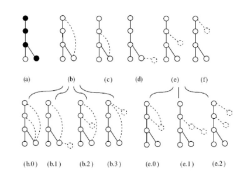

# Graph Mining

## 1. Introduzione

Similmente al modello transazionale ritrovato nel Market Basket Analysis, dove lo scopo era quello di trovare gli itemset frequenti in un database di transazioni, il problema del *frequent subgraph mining* (FSM) consiste nell'identificare tutti i sottografi che occorrono frequentemente in un database di grafi. 


### 1.1 Supporto, soglia e frequenza

Tipicamente si conta il numero di grafi del database che contengono il sottografo, tale numero prende il nome di *supporto*. Se il supporto del sottografo è maggiore o uguale ad una soglia minima $\sigma$, allora il sottografo è detto *frequente*. L'output di un algoritmo di FSM è l'insieme di tutti i sottografi frequenti, con il loro supporto. 

Vediamo un esempio con soglia $\sigma = 3$:


Piuttosto che fare riferimento al *supporto*, che è un conteggio relativo, spesso si utilizza la *frequenza*, che è invece un conteggio relativo. La frequenza di un sottografo $S$ in un database $D$ è il rapporto tra il supporto ed il numero di grafi nel database. La soglia minima $\sigma$ in questo caso sarà espressa come una percentuale. Un sottografo è frequente se è presente in almeno $\sigma$% grafi del database. 


### 1.3 Regola Apriori

Come nel caso del Market Basket Analysis, anche nel Frequent Subgraph Mining è possibile sfruttare la regola *apriori* per filtrare i candidati e ottimizzare la ricerca dei sottografi frequenti. La regola apriori è la seguente: 

> Il supporto di un sottografo $S$ in un database $D$ di grafi non può essere maggiore del supporto dei sottografi che $S$ contiene. 

In altre parole, se un sottografo $S$ non è frequente, allora nessun sottografo che contiene $S$ è frequente. Ciò pone la base per lo schema generale di un algoritmo di Frequent Subgraph Mining. 

<div style="page-break-after: always;"></div>


### 1.4 Schema generale 

Osserviamo adesso lo schema generale di un algoritmo di Frequent Subgraph Mining. Sia $O$ l'insieme finale di sottografi frequenti e sia $\sigma$ la soglia imposta, il primo step è il seguente: 

* Cercare singolarmente tutti i *nodi* frequenti nel database ed insierirli in $O$. 

Nell'insieme $O$ abbiamo adesso grafi formati da *un solo nodo* e frequenti. 

* Per ogni elemento in $O$ generiamo tutti i possibili grafi con 2 nodi, candidati ad essere frequenti. 
* Tra i sottografi generati, eliminiamo i duplicati e verifichiamo la regola apriori.
  * Scartiamo tutti i grafi in cui è presente un sottoinsieme non frequente. 
* Calcoliamo il supporto di ogni grafo candidato e, se risulta essere frequente, aggiungiamolo ad $O$. 

Lo step è generalizzabile per $k \ge 3$, ed ogni sotto-passo ha un nome specifico:  

* *Candidate generation*: a partire dall'insieme dei sottografi frequenti con $k-1$ nodi, costruire l'insieme $C$ dei sottografi candidati con $k$ nodi. 
* *Pruning*: eliminare i sottografi ridondanti e verificare la regola Apriori, ovvero si scartano tutti i candidati che contengono almeno un sottografo con $k-1$ nodi non frequente. 
* *Counting*: calcola il supporto di ogni grafo candidato e l'insieme dei sottografi frequenti con $k$ nodi. Aggiungi questi ultimi all'insieme finale $O$. 

Quando al generico passo $k$ si verifica che l'insieme di sottografi frequenti con $k$ nodi è vuoto, la computazione termina, ovvero non ci sono ulteriori sottografi frequenti. Quindi viene restituito l'insieme $O$ in output. 


<div style="page-break-after: always;"></div>

### 1.5 Approcci BFS e DFS 

L'approccio descritto in precedenza è basato su una strategia in ampiezza, ovvero BFS (Breadth-first Search): prima di generare i sottografi candidati con $k+1$ nodi, si calcolano tutti i sottografi frequenti con $k$ nodi.  

Esiste anche un approccio alternativo che utilizza la strategia DFS (Depth-first search): si calcola il supporto di un sottografo candidato con $k-nodi$ e, se è frequente, si estende. Quindi si controlla il supporto del sottografo esteso e così via. L'approccio DFS richiede meno memoria, ma risulta meno efficace nel pruning. 


### 1.6 Generazione dei candidati

#### 1.6.1 Generazione Join-based 

Un sottografo candidato con $k+1$ nodi è ottenuto dall'unione di due sottografi con $k$ nodi frequenti. L'unione è possibile se e solo se i due sottografi hanno almeno un sottografo con $k-1$ nodi in comune, chiamato *core graph*. Nell'esempio osserviamo due possibili risultati: in uno dei due viene inserito un arco tra i due nodi esterni al core, mentre nell'altro no. 


<div style="page-break-after: always;"></div>


La generazione può essere fatta basandosi sugli archi. In tal caso, si aggiunge al grafo frequente un arco di un altro grafo frequente con lo stesso core. Eventualmente è possibile aggiungere, oltre l'arco, anche un nodo. Vediamo nell'esempio in figura che mentre il candidato 2 inserisce solo l'arco, il candidato 1 include anche il nodo. 


Una join tra due grafi può produrre più candidati per i seguenti motivi: 

* I due sottografi hanno più di un *core-graph* in comune; 
* Un *core-graph* può avere più di un automorfismo; 

Inoltre lo stesso candidato può essere generato a partire da *join* diverse, per cui è necessario un successivo passo di pruning che elimini i candidati duplicati. 


<div style="page-break-after: always;"></div>


#### 1.6.2 Generazione Extend-based

Un sottografo candidato con $k+1$ nodi è generato estendendo un sottografo frequente con $k$ nodi mediante l'aggiunta di un solo nodo. 

L'aggiunta può essere effettuata in vari modi. Una tecnica per evitare la generazione di sottografi candidati ridondanti consiste  nell'effettuare l'estensione seguendo il cammino right-most di una visita DFS effettuata sul grafo: il nodo viene aggiunto *solo* a partire da nodi che risiedono nel cammino più a destra nell'albero di visita DFS del grafo da estendere. Anche tale estensione può essere fatta aggiungendo un arco anziché un nodo. Vediamo un esempio: 


L'albero in figura è prodotto da una visita DFS del grafo frequente. Il cammino evidenziato in nero è il cammino right-most. Nelle due immagini successive si mostra come sia possibile estendere il grafo tramite l'aggiunta di un arco, mentre nelle ultime tre viene aggiunto, in diverse parti del cammino destrorso, un nodo. 


### 1.7 Pruning sulle ridondanze

La generazione dei candidati può portare ad avere sottografi ridondanti, ovvero *isomorfi*. Occorre una rappresentazione dei grafi che consenta di risolvere abilmente gli isomorfismi. Nella pratica, due rappresentazioni comun sono la *matrice di adiacenza* e le *liste di adiacenza*. Tuttavia, tali rappresentazioni non sono adatte ad identificare gli isomorfismi. Osserviamo un esempio di grafi isomorfi la cui matrice di adiacenza è differente: 


#### 1.7.1 Stringa di adiacenza

Il primo passo verso una rappresentazione ideale è quello di considerare la *stringa di adiacenza*, ovvero una stringa ottenuta concatenando tutte le righe della matrice di adiacenza o, nel caso di un grafo indiretto, solo le righe appartenenti alla triangolare superiore (a causa della specularità che rende ridondante l'informazione). 

Per un grafo $G$ con $n$ nodi esistono $n!$ possibili stringhe di adiacenza, ottenute considerando tutte le possibili permutazioni dei nodi. Diverse permutazioni possono produrre la stessa stringa di adiacenza. Non è ancora sufficiente per rappresentare univocamente il grafo. 


#### 1.7.2 Forma canonica

La forma canonica di un grafo è la stringa di adiacenza lessicograficamente più piccola (o più grande), tra tutte quelle che si possono ottenere permutando i nodi in tutti e $n!$ modi possibili. Essa risulta essere una rappresentazione *univoca* del grafo: due grafi isomorfi hanno la stessa forma canonica.

Per individuare sottografi candidati ridondanti nello step di *pruning*, occorre calcolare le loro forme canoniche e confrontarle. Se hanno la stessa forma canonica, quindi nel caso di isomorfismo, uno dei due sottografi va escluso.  


### 1.8 Significatività statistica

I sottografi più frequenti non sono necessariamente quelli più rilevanti. Un sottografo frequente potrebbe essere un *pattern banale*, come un nodo o un arco frequente. Calcolare la significatività statistica di un pattern può essere uno step di post-processamento dei risultati di un algoritmo di FSM, allo scopo di eliminare i pattern banali. 

Vediamo come calcolare la significatività del sottografo frequente nel post-processing: 

* A partire dal database $D$ di $N$ grafi, costruire un database $D^1$ formato da $N$ grafi random ottenuti a partire da ciascuno dei grafi in $D$. 
* Ripetere il primo passo $k$ volte, dove $k$ è un numero molto grande, ottenendo $D^1, ..., D^k$ diversi database di *background*. 
* Per ogni sottografo frequente $S$, calcolare il supporto $X$ in ciasuno dei $k$ database di background. Al termine di tale passo si otterrà una distribuzione di probabilità dei valori di $X$. 
* Calcolare la probabilità $P(X \ge X_0)$ di osservare un supporto $X$ maggiore o uguale al supporto $X_0$ osservato nel database originale $D$. Chiamiamo tale probabilità *p-value*. 
* Se il *p-value* è minore di una soglia $\alpha$ (tipicamente $\alpha = 0.05$), allora $S$ è significativo come sottografo frequente. 


<div style="page-break-after: always;"></div>


#### 1.8.1 Generazione dei database: Algoritmo edge-swapping

Uno dei metodi più popolari per generare un grafo random a partire da un grafo $G$ è l'algoritmo di *edge-swapping*, che permette di generare un grafo random $R$ con la stessa distribuzione di gradi di $G$. L'algoritmo è molto semplice e consiste nei seguenti passi: 

* Selezionare casualmente due archi della rete $(a, b)$ e $(c, d)$ in modo tale che: 
  * Gli archi siano disgiunti tra loro, ovvero non abbiano nodi in comune; 
  * Non esistano in $G$ gli archi $(a, c)$ e $(b, d)$; 
* Scambiare le destinazioni dei due archi: $(a, b) \to (a,d)\text{ e } (c,d) \to (c, b)$
* Iterate i passi un numero sufficiente di volte (convenzionalmente 100 volte il n. totale di archi). 

La scelta degli archi al primo passo assicura che al termine di ogni scambio la distribuzione dei gradi rimanga la stessa. 

<div style="page-break-after: always;"></div>


## 2. Algoritmo FSG 

L'algoritmo FSG ha le seguenti caratteristiche principali: 

* Strategia Breadth-First Search per trovare i sottografi frequenti
* Metodo join-based per la generazione dei candidati
* Rappresentazione dei sottografi in forma canonica

Osserviamo e commentiamo la procedura dell'algoritmo. Sia $D$ il database di grafi, indichiamo con $F^{k}$ l'insieme di sottografi formati da $k$ nodi frequenti in $D$. La prima parte dell'algoritmo calcola semplicemente nodi ed archi frequenti in $D$. 

```

	F[1] = tutti i 1-sottografi (nodi) frequenti in D
	F[2] = tutti i 2-sottografi (archi) frequenti in D

```

Dopodiché poniamo $k = 3$ e definiamo il passo iterativo. L'iterazione termina quando al passo $k-1$ non viene scovato alcun sottografo frequente. 

```
	
	k = 3 
	while (F[k-1] non è vuoto) do: 
		
		# genera l'insieme dei candidati con k nodi 
		C[k] = fsg-gen(F[k-1])
		
		# effettuiamo il pruning utilizzando la forma canonica
		C[k] = prune(C[k])
		
		# per ogni candidato calcoliamo il supporto (attributo count)
		for each candidato G[k] in C[k] do:
			G[k].count = 0
			for each grafo G in D do: 
				if (G[k] è sottografo di G) then: 
					G[k].count = G[k].count + 1
			
			# controlliamo se il supporto è maggiore o uguale alla soglia
			if (G[k].count >= sigma) then:
            	# in tal caso lo aggiungiamo all'insieme dei sottografi 
            	# frequenti con k nodi
            	F[k].add(G[k])
            	   	
         # incrementiamo il valore di k e passiamo alla 
         # iterazione successiva 
		k = k + 1
	
	# ritorniamo tutti gli insiemi frequenti
	return {F[1], ..., F[k-2]}
	
```

<div style="page-break-after: always;"></div>

### 2.1 Generazione dei candidati in FSG

È necessario esplicitare anche alcune procedure arcane utilizzate nella procedura principale, come ad esempio la funzione *fsg-gen* che genera i sottografi candidati.  Essa sarà illustrata e commentata dettagliatamente nel riquadro sottostante. 


```

	procedure fsg-gen (F[k])
	
	# inizializziamo l'insieme dei sottografi con k+1 nodi 
	# candidati 
	C[K+1] = 0
	
	# per ogni coppia di sottografi i,j nell'insieme F[k]
	for each G[i], G[j] in F[k], (i <= j), do:
		
		# inseriamo nell'insieme H tutti i core condivisi
		# dai sottografi i e j. 
		H = get_cores(G[i], G[j])
		
		for each core in H: 
			# generiamo i possibili candidati con il 
			# metodo join-based e li inseriamo in B
			B = fsg-join(G[i], G[j], core)
			
			# i grafi su cui iteriamo adesso hanno k+1 nodi poiché appena 
			# generati dalla giunzione di i e j. Verifichiamo per ogni candidato 
			# la regola Apriori (o chiusura downward). 
			
			for each subgraph in B do: 
				apriori = true 
				
				# togliamo un arco alla volta (quindi anche un nodo)
				# e verifichiamo se il sottografo formato da k nodi
				# risiede nell'insieme F[k]. In caso contrario il grafo
				# non è frequente per la regola Apriori. 
				for each arco e in subgraph do: 
					
					# subgraph ha k+1 nodi, k_subgraph ne ha k
					# ma conosciamo già l'insieme F[k] dall'input. 
					k_subgraph = subgraph.removeEdge(e)
					if (k_subgraph not in F[k]) then: 
						apriori = false 
						break
                        
				if apriori == true then:
					C[k+1].add(subgraph)
	return C[k+1]

```

<div style="page-break-after: always;"></div>

### 2.2 Join tra sottografi

Non resta altro che osservare come viene effettuata la join tra due sottografi $g_i, g_j$ che condividono lo stesso core $h$. Ricordiamo che $g_i, g_j$ hanno $k$ nodi, mentre il core in comune ne ha per definizione $k-1$. 

```

	procedure fsg-join(g[i], g[j], h):
		
		e1 = insieme degli archi presenti in g[i] e non in h
		e2 = insieme degli archi presenti in g[j] e non in h 
		M = insieme di tutti gli automorfismi di h 
		
		# inizializziamo l'insieme dei candidati generati
		B = 0
        
		# iteriamo su ognuno degli automorfismi del core h 
		for each automorfismo phi in M do:
        
			# combinando e1, e2, e l'automorfismo phi otteniamo
			# vari sottografi di dimensione k+1, conserviamo 
			# tali sottografi nell'insieme K 
			K = combine(e1, e2, phi) 
			B = union(B, K)

		return B 

```


### 2.3 Calcolo della forma canonica

L'algoritmo FSG calcola la forma canonica di ogni sottografo a partire dalla matrice di adiacenza. Osserviamo un esempio per semplicità: 


Il primo step consiste nel partizionare ed ordinare i nodi del grafo in base al grado. I nodi $a, c, d$ hanno grado 1, mentre il nodo $b$ ha grado 3. Dividiamo quindi la matrice in due partizioni: 


I nodi con grado più alto hanno potenzialmente molti archi asseriti nella matrice. Se disponiamo gli elementi per grado in ordine crescente, allora la stringa di adiacenza risultante avrà la maggior parte degli elementi asseriti verso la fine. Ciò va fatto poiché l'obiettivo è quello di ottenere la forma canonica del sottografo, ovvero la stringa lessicograficamente più piccola. 

Se il grafo è etichettato come quello in figura, allora a parità di grado è possibile partizionare ulteriormente l'insieme in base alla *etichetta* del nodo, disponendo prima le etichette più piccole. Nell'esempio, i nodi $a,c,d$ hanno rispettivamente etichette $v_0, v_1, v_0$. Disponiamo nella prima partizione i nodi $a, d$ di etichette $v_0$, e in una seconda partizione il nodo $c$ di etichetta $v_1$: 


Se in una partizione vi sono più di due nodi, vanno considerate le possibili stringhe di adiacenza date dalla variazione di posizione. Il partizionamento serve soprattutto a diminuire il numero di stringhe di adiacenza da generare. Nel grafo in esempio solo la prima partizione contiene più di un nodo, per cui consideriamo due sole stringhe di adiacenza:  


Essendo un grafo non orientato, formiamo le stringhe di adiacenza utilizzando solo le porzioni di righe appartenenti alla triangolare superiore. Nel primo caso avremo $00e_10e_0e_0$, mentre nel secondo caso $00e_00e_1e_0$. Considerando $e_0 < e_1$ abbiamo che la forma canonica del grafo è quella presentata nel secondo caso.  

<div style="page-break-after: always;"></div>

### 2.4 Ottimizzazioni

Gli step più pesanti dell'algoritmo dal punto di vista computazionale sono: 

* La generazione dei core
* L'operazione di join tra sottografi
* La cancellazione di sottografi candidati poco frequenti

Alcune ottimizzazioni possibili sono rispettivamente: 

* Per ogni k-sottografo, memorizzare le forme canoniche dei suoi (k-1)-sottografi frequenti
* Utilizzare schemi di indicizzazione inversa (inverted index)
* Mettere in cache gli automorfismi di core precedenti


#### 2.4.1 Inverted list

Per contare le frequenze degli $m_k$ $k$-sottografi candidati al paso $k$, dovremmo risolvere $n \times m_k$ problemi di subgraph matching, dove $n$ è  il numero di grafi nel database $D$. La tecnica delle liste invertite può essere utilizzata per ridurre il costo computazionale: 

* Ad ogni sottografo frequente $S$ è assegnata una TID list (*Transaction IDentifier* list), ovvero la lista delle transazioni che contengono $S$.
* Per calcolare la frequenza di un $(k+1)$-sottografo  candidato, viene calcolata l'intersezione delle liste TID dei $k$-sottografi da cui è stato generato. 
* Se la dimensione della lista è minore rispetto al supporto minimo, allora il sottografo candidato viene scartato poiché non potrà mai essere frequente, altrimenti si calcola la frequenza *solo* nelle transazioni della lista prodotta dall'intersezione. 

<div style="page-break-after: always;"></div>

## 3. Algoritmo gSPAN 

L'algoritmo gSPAN ha le seguenti caratteristiche:  

* Strategia Depth-First Search per trovare i sottografi frequenti
* Metodo extend-based per la generazione dei candidati
* Rappresentazione dei sottografi con DFS code


### 3.1 Spazio di ricerca

Lo spazio di ricerca dell'algoritmo gSPAN è un albero gerarchico. Ogni vertice al livello $i$-esimo dell'albero rappresenta un grafo con $i$ nodi e possiede un codice definito come DFS code, il cui calcolo approfondiremo in seguito.  L'algoritmo utilizza un ordinamento lessicografico per i vertici dell'albero che consente di scoprire sottografi frequenti in maniera efficiente. Vertici con DFS code più piccolo vengono scoperti prima nella ricerca e, nel caso in cui un nodo appena scoperto abbia DFS code analogo ad un altro nodo analizzato precedentemente, si effettua il pruning sul nuovo nodo. 


### 3.2 DFS code

La depth-first search può produrre diversi alberi DFS, come vediamo in esempio: 


Ognuno dei nodi dell'albero è scoperto ad un tempo differente. Definiamo arco *forward* un arco che porta da un nodo ad un altro visitato ad un tempo successivo, mentre arco *backward* un arco che porta da un nodo ad un altro visitato ad un tempo precedente. 

<div style="page-break-after: always;"></div>

Una volta calcolati gli alberi di ricerca DFS è possibile considerare alcuni elementi: 

* Vertice right-most, che coincide con l'ultimo nodo visitato; 
* Cammino right-most, che va dalla radice al vertice right-most;
* Insieme degli archi forward $E_{f,T} = \{e \mid  \forall i, j, i<j, e=(v_i, v_j) \in E\}$
* Insieme degli archi backward $E_{b,T} = \{e \mid  \forall i, j, i>j, e=(v_i, v_j) \in E\}$

Definiamo *sequenza* DFS la sequenza di nodi $<v1, ..., v_n>$ ovvero i nodi visitati rispettivamente nei tempi $t_1, ..., t_n$. Essendovi sequenze differenti per ogni albero prodotto, è necessario calcolare una rappresentazione che sia univoca. 

A partire dalla sequenza di un albero, definiamo il codice DFS come una sequenza ordinata di archi. Tale sequenza è costruita secondo i seguenti principi: 

* Dato un vertice $v$, tutti i suoi archi uscenti *backward* devono apparire prima degli archi *forward*
* $(i, v_j) < (i, v_i) \Longleftrightarrow j < i$, ovvero tra gli archi *forward* viene data precedenza agli archi che portano a nodi visitati prima, ovvero 
* $(v_i, a) < (v_j, b) \Longleftrightarrow i < j$, ovvero in generale tra gli archi *backward* viene data precedenza agli archi che partono da nodi visitati prima
* $(v, u_i) < (v, u_j) \Longleftrightarrow i < j$, ovvero se l'arco backward parte dallo stesso nodo, viene data la precedenza all'arco che termina nel nodo visitato prima. 

Una volta generati i codici DFS di tutti gli alberi DFS, attraverso un ordine lessicografico viene determinato il codice DFS minimo ed utilizzato per rappresentare il grafo. 

Vediamo un esempio: 


La tabella rappresenta 3 codici DFS prodotti a partire da alberi differenti. Ogni codice è formato da una sequenza di archi rappresentati come quintuple: tempo di scoperta del nodo sorgente, tempo di scoperta del nodo destinazione, etichetta del nodo sorgente, etichetta dell'arco, etichetta del nodo destinazione. Osserviamo come ogni colonna rispetti le regole di ordinamento dettate precedentemente. 

A questo punto dobbiamo definire l'ordine lessicografico tra codici differenti, per cui:

* Partendo dal primo arco, si considera il tempo di scoperta dei due nodi e si seleziona il codice con minimo tempo di scoperta. 
* A parità di tempi di scoperta, si considera l'ordine lessicografico basato sui restanti 3 campi (etichette). 
* A parità di questi, si passa al secondo arco e così via sino a che non si determina il codice minimo.


### 3.3 Estensione dei sottografi 

L'estensione di un sottografo mediante aggiunta di un singolo arco non può essere fatta in maniera arbitraria. Dato un grafo $G$ e l'albero DFS $T$ con DFS code minimo, due estensioni sono possibili: 

* *Estensione backward*: aggiunta di un arco tra il vertice right-most di T ed uno tra i vertici del cammino right-most.
* *Estensione forward*: aggiunta di un nuovo nodo $v$ e di un arco tra $v$ ed un nodo qualsiasi del cammino right-most. 

In tal modo il codice DFS del nuovo sottografo figlio nell'albero di ricerca sarà una estensione del codice DFS del sottografo padre. Nello specifico, per ottenere il codice DFS del grafo figlio è sufficiente accodare il nuovo arco al codice DFS del grafo padre. In questo modo, l'algoritmo gSPAN genera meno candidati rispetto ad FSG. 



<div style="page-break-after: always;"></div>


## 4. Mining in un singolo grafo

Dato un grafo $G$, il problema del mining in un singolo grafo consiste nel trovare tutti i sottografi frequenti in $G$. In questo caso, la frequenza minima è definita in termini di numero di occorrenze di un sottografo in $G$. Un sottografo frequente in un grafo $G$ è detto anche *motivo*. 


### 4.1 Overlap di occorrenze

Nel mining di un singolo grafo ci sono due modi di contare le occorrenze di un sottografo: 

* Senza sovrapposizioni (no overlaps)
* Con sovrapposizioni di nodi o archi (with overlaps)

Nel primo caso continua a valere la regola Apriori, mentre nel secondo caso potrebbe *non valere*. 

Osservando l'esempio sottostante ci accorgiamo che il sottografo $g_1$ ha un supporto pari ad 1 nel grafo $G$. Si noti che $g_1$ *è contenuto* nel sottografo $g_2$: se vale la regola Apriori, $g_2$ dovrà avere un supporto minore o uguale a quello di $g_1$. Considerando il mining con overlap, il grafo $g_2$ avrà supporto 2 in $G$, per cui non vale la regola apriori. 


### 4.2 Significatività statistica

Nel problema del mining in un singolo grafo (o ricerca di motivi) raramente si considera solo il numero di occorrenze per valutare se un sottografo è un motivo. 

>  Si definisce motivo un sottografo ricorrente che è significativamente sovra-rappresentato in una rete. 

La significatività la si può calcolare usando la stessa procedura descritta in precedenza, creando un insieme di varianti random del grafo $G$ e contando la frequenza del sottografo $S$ in ognuna delle varianti random. Il $p$-value ottenuto a partire dalla distribuzione delle frequenze di $S$ determina la significatività statistica del motivo. 

Sono stati recentemente sviluppati dei modelli per calcolare analiticamente il $p$-value senza generare le varianti random, velocizzando il calcolo della significatività. 


### 4.3 Strategie di ricerca

Attraverso un generico grafo è possibile estrarre un numero molto grande di sottografi considerando tutte le varie combinazioni. È necessario definire delle strategie intelligenti per effettuare la ricerca dei motivi in maniera efficiente. 


#### 4.3.1 Strategia network-centric 

Vengono ricercati ed enumerati tutti i possibili sottografi con $k$ nodi che occorrono nella rete iniziale. Si raggruppano attraverso un match dell'isomorfismo le occorrenze di sottografi differenti che hanno la stessa struttura.

Il vantaggio principale della strategia è che sottografi che non occorrono in $G$ non verranno mai considerati. Così facendo risulta più efficiente l'analisi di grafi di grosse dimensioni. Tuttavia, il censimento dei sottografi è un processo molto costoso.

 

#### 4.3.2 Strategia motif-centric 

Vengono enumerati tutti i possibili sottografi con $k$ nodi e vengono ricercati in $G$ separatamente. In tal modo la verifica di un sottografo come motivo è diretta, ma l'enumerazione di tutti i sottografi con $k$ nodi diventa esponenzialmente proibitiva all'aumentare di $k$. Tale approccio è ottimo per grafi di piccola dimensione.


#### 4.3.3 Strategia set-centric

La strategia set-centric è un ibrido tra le due precedenti. Consiste nel ricercare un insieme di sottografi e, con una unica passata sul grafo $G$, trovare tutti i match dei sottografi e raggruppare i match isomorfi. 


### 4.4 Ricerca esatta vs Sampling 

Effettuare una ricerca esatta significa enumerare esaustivamente tutti i sottografi con $k$ nodi. Una strategia alternativa è quella del *sampling*, che consiste nel campionare randomicamente un adeguato numero di sottografi con $k$ nodi. Dopodiché vengono conteggiate le frequenze dei campioni. 

La procedura per effettuare il sampling è la seguente:

* Si sceglie un seed iniziale, ovvero un nodo o un arco casuali in $G$.
* Si estende il seed iterativamente (con archi o nodi) sino a raggiungere un sottografo di $k$ nodi. 

Il sottografo campionato è definito dall'insieme dei $k$ nodi e da tutti gli archi che li collegano. Una variante di sampling consiste nel campionare opportunamente una sottorete $S$ di $G$ ed effettuare una ricerca *esatta* in $S$, stimando i $p$-values per i motivi di $G$ su $S$. 

Il sampling, con poche migliaia di campioni, può ottenere risultati veloci ed accurati. Inoltre non risulta sensibile alla dimensione della rete. Potrebbero tuttavia riscontrarsi bias ed alcuni motivi significativi potrebbero sfuggire. 