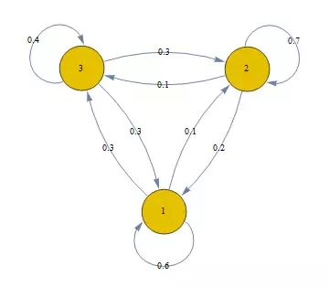
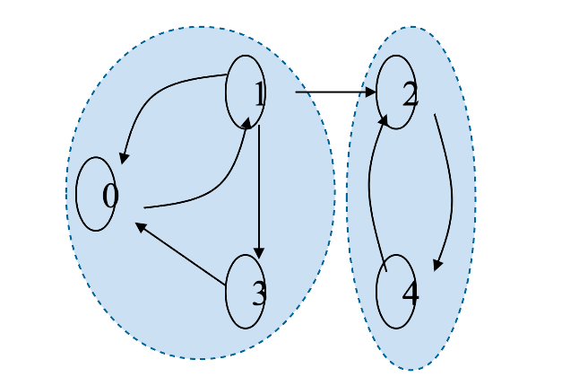
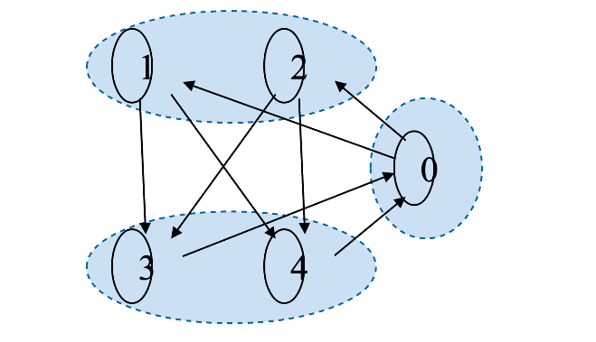
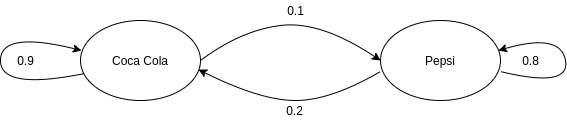
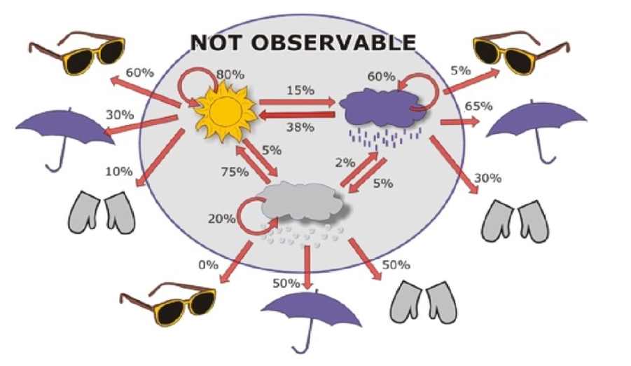
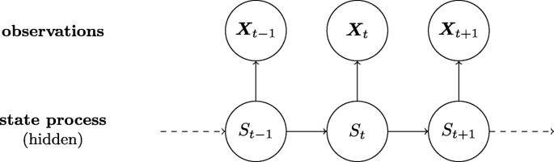
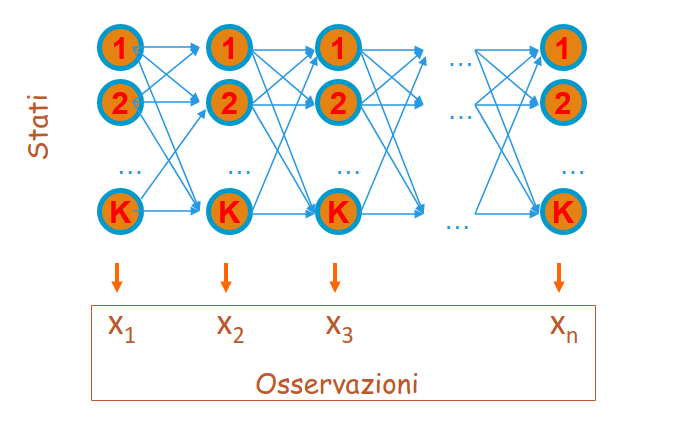
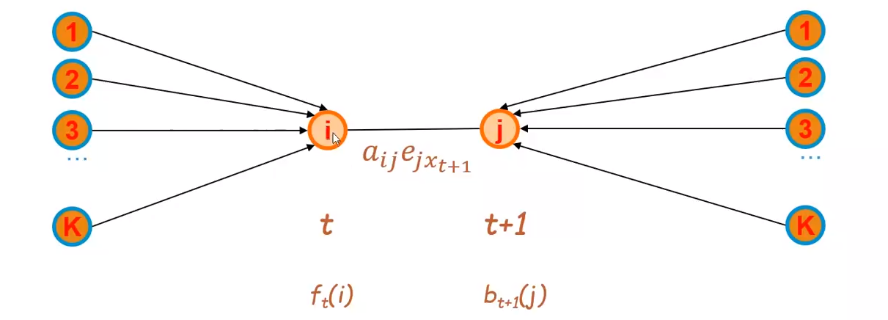

# Catene di Markov e Hidden Markov Models


## 1. Catene di Markov

Una catena di Markov è una tripla $(Q, I, A)$ dove: 

* $Q = \{1, ..., k\}$ è un insieme finito di stati (o eventi). 
* $\pi_i$ denota lo stato osservato all'i-esimo istante di tempo. 
* $I = \{p(\pi_1 = s)\}$ rappresenta l'insieme delle probabilità iniziali per ogni stato. 
* $A$ è l'insieme delle probabilità di transizione denotate da $a_{uv}$ per ogni $u,v \in Q$. 

Nello specifico, $a_{uv}$ denota la probabilità che all'istante di tempo $t$ si verifichi lo stato $v$ dato per assunto che all'istante di tempo $t-1$ si sia presentato lo stato $u$. Di fatto si parla di una transizione di stati e si rappresenta attraverso il concetto di probabilità condizionata:
$$
a_{uv} = P(\pi_t=v|\pi_{t-1}=u)
$$

> Sia *n* la cardinalità dell'insieme degli stati $Q$, l'insieme $A$ è esprimibile attraverso una matrice, chiamata **matrice di transizione** di dimensione $n \times n$, dove l'elemento $a_{i,j}$ rappresenta la probabilità di passare dallo stato $i$ allo stato $j$. 


### 1.1 Proprietà memoryless 

Generalemente si parla di catene di Markov **del primo ordine** quando lo stato successivo dipende esclusivamente dallo stato corrente. Tale proprietà prende il nome di proprietà **memoryless**. Formalmente, se $s_1, ..., s_t$ è la sequenza di stati osservati, si ha: 
$$
P(\pi_t = s_t|\pi_1=s_1, ..., \pi_{t-1}=s_{t-1}) = P(\pi_t = s_t|\pi_{t-1}=s_{t-1}) = a_{s_{t-1}, s_t}
$$
Quindi la probabilità che all'istante di tempo $t$ si abbia $\pi_t = s_t$ dipende solo dal fatto che allo stato $\pi_ {t-1}=s_{t-1}$. Tale probabilità è esprimibile attraverso la transizione tra lo stato $s_{t-1}$ e lo stato $s_t$, ovvero $a_{s_{t-1}, s_t}$. 

<div style="page-break-after: always;"></div>

### 1.2 Probabilità di una sequenza di eventi

Consideriamo la seguente catena di Markov (immagine sottostante) dove i nodi rappresentano i possibili stati e gli archi le transizioni possibili con le rispettive probabilità. Supponiamo di osservare una sequenza di stati del genere: $\{3, 3, 2, 1, 2\}$ con probabilità iniziali $P(\pi_1=1) =0.4, \space P(\pi_1=2) =0.4, \space P(\pi_1=3) =0.2$. Come calcoliamo la probabilità che si verifichi tale sequenza?



Vogliamo quindi calcolare la probabilità $P(3, 3, 2, 1, 2)$, che risulta essere una probabilità congiunta. In generale, per le proprietà sul prodotto logico tra eventi si ha: 
$$
P(s_1, ..., s_n) = P(s_1) \times P(s_2|s_1) \times P(s_3|s_1, s_2) 
\times ...\times P(s_n|s_{n-1}, ..., s_1)
$$
 Ma ricordiamo che vale la proprietà memoryless, per cui: 
$$
P(s_1, ..., s_n) = P(s_1) \times P(s_2|s_1) \times P(s_3|s_2) 
\times ...\times P(s_n|s_{n-1}) = \\
= P(s_1) \times a_{s_1, s_2} \times a_{s_2, s_3} \times ... \times a_{s_{n-1}, s_n} 
$$
Applichiamo tali concetti alla sequenza d'esempio e otteniamo: 
$$
P(3, 3, 2, 1, 2) = P(3) \times P(3|3) \times P(2|3) \times P(1|2) \times P(2|1) \\
= 0.2 \times 0.4 \times 0.3 \times 0.2 \times 0.1 = 0.00048. 
$$


### 1.3 Matrice stocastica 

Nella **matrice di transizione** $A$ di una catena di Markov la somma degli elementi di ciascuna riga è uguale ad 1, ovvero da ciascuno stato $s$ è sempre possibile raggiungere uno qualsiasi degli stati della catena (anche $s$ stesso), e la somma delle probabilità di transizione è 1. In virtù di tale proprietà la matrice di transizione è detta **stocastica**.  Vediamo la matrice di transizione della catena in esempio: 

|         | Stato 1 | Stato 2 | Stato 3 |
| ------- | ------- | ------- | ------- |
| Stato 1 | 0.6     | 0.1     | 0.3     |
| Stato 2 | 0.2     | 0.7     | 0.1     |
| Stato 3 | 0.3     | 0.3     | 0.4     |


### 1.4 Classificazione delle catene di Markov

Una catena di Markov si dice **irriducibile** se da ogni stato $i$ è possibile raggiungere un qualsiasi altro stato della catena mediante una o più transizioni. 



Definiamo **periodo** di uno stato $s$ come il minimo numero di passi necessari per tornare ad $s$ con probabilità non nulla. Se il periodo è maggiore di 1, lo stato $s$ è detto periodico. Una catena di Markov **aperiodica** è una catena in cui *nessuno* stato è periodico. 



<div style="page-break-after: always;"></div>

### 1.5 Probabilità di eventi successivi

Prendiamo in considerazione la seguente catena di Markov: 



Essa indica che una persona che compra Coca-Cola nel 90% dei casi la prossima volta comprerà Coca-Cola. Se una persona compra Pepsi allora nell'80% dei casi la prossima volta comprerà Pepsi. Visualizziamo la matrice di transizione: 

|               | Coca Cola (C) | Pepsi (P) |
| ------------- | ------------- | --------- |
| Coca Cola (C) | 0.9           | 0.1       |
| Pepsi (P)     | 0.2           | 0.8       |

**Domanda:** per una persona che attualmente compra Pepsi, qual è la probabilità che tra due volte acquisterà Coca Cola? 

La probabilità richiesta è esprimibile come: 
$$
P(\pi_{t+2} = C|\pi_t=P)
$$
Tuttavia lo stato a tempo $t+2$ dipende solo dallo stato $t+1$, che può essere sia Coca-cola che Pepsi. Essendo due casi favorevoli, vanno considerati entrambi e vanno sommate le probabilità. Per cui adesso necessitiamo di: 
$$
1) \space P(\pi_{t+2} = C, \pi_{t+1} = C |\pi_t=P) = 
P(\pi_{t+2} = C | \pi_{t+1} = C) \times P(\pi_{t+1} = C |\pi_t=P) \\
2) \space P(\pi_{t+2} = C, \pi_{t+1} = P |\pi_t=P) = 
P(\pi_{t+2} = C | \pi_{t+1} = P) \times P(\pi_{t+1} = P |\pi_t=P) \\
$$
Calcoliamo entrambe le probabilità attraverso la matrice di transizione: 
$$
1) \space P(\pi_{t+2} = C, \pi_{t+1} = C |\pi_t=P) = 
P(\pi_{t+2} = C | \pi_{t+1} = C) \times P(\pi_{t+1} = C |\pi_t=P) = 0.2 \times 0.9 = 0.18 \\
2) \space P(\pi_{t+2} = C, \pi_{t+1} = P |\pi_t=P) = 
P(\pi_{t+2} = C | \pi_{t+1} = P) \times P(\pi_{t+1} = P |\pi_t=P) = 0.8 \times 0.2 = 0.16
$$
Calcoliamo la somma delle due probabilità: 
$$
P(\pi_{t+2} = C|\pi_t=P) = 0.18 + 0.16 = 0.34
$$
**Osservazione** $-$ Se effettuiamo il prodotto riga colonna tra la matrice A e se stessa otterremo un'ulteriore matrice della stessa dimensione, dove ogni elemento indica la probabilità di due transizioni, la cui transizione di mezzo può essere uno qualsiasi tra gli stati. 
$$
A^2 = A \times A = \begin{bmatrix}
0.9 & 0.1 \\
0.2 & 0.8 \\
\end{bmatrix}
\times 
\begin{bmatrix}
0.9 & 0.1 \\
0.2 & 0.8 \\
\end{bmatrix}
=
\begin{bmatrix}
0.83 & 0.17 \\
0.34 & 0.66 \\
\end{bmatrix}
$$
Di fatto l'elemento di indici $(2, 1)$ indica la probabilità che, partendo dallo stato $pepsi$ si possa arrivare allo stato $CocaCola$ in due transizioni con probabilità del 34%. 

A questo punto è possibile generalizzare il concetto: per una persona che compra Coca Cola, qual è la probabilità che tra *n* volte comprerà Pepsi? Allora basterà effettuare il prodotto riga colonna della matrice A con se stessa per *n* volte. 

Sia $A$ la **distribuzione di probabilità** iniziale. Ogni qual volta effettuiamo un prodotto riga-colonna otteniamo una distribuzione differente. Si può dimostrare che ad un certo punto si arriverà ad una **distribuzione stazionaria** in cui le probabilità non varieranno. 


#### 1.5.1 Distribuzione stazionaria

Sia $M = (Q,I,A)$ una catena di Markov del primo ordine, irriducibile e aperiodica con *k* stati. Si dimostra che: 
$$
\lim_{n\to\infty} P(\pi_n = j | \pi_i = i) = \lim_{n\to\infty} A_{i,j}^n = \sigma
$$
Tale proprietà vale per tutti gli $j$, dunque si ottiene un vettore di valori $\bar{\sigma} = (\sigma_1, ...,\sigma_k)$. Se $\bar{\sigma}$ contiene valori non nulli, allora $\bar{\sigma}$ è detta **distribuzione stazionaria**. Se tutti i valori di $\bar{\sigma}$ sono non nulli allora $\bar{\sigma}$ è l'unica distribuzione stazionaria. 


## 2. Hidden Markov Models (HMM)

Un modello di Markov nascosto (in inglese Hidden Markov Model o HMM) è un modello più ricco rispetto alla catena di Markov. A differenza di una catena di Markov, in un HMM gli stati sono **nascosti**. Ogni stato emette un **simbolo** con una certa probabilità. L'osservatore vede soltanto una sequenza di simboli emessi in base alla quale può dedurre la probabilità di osservare la corrispondente sequenza di stati associati. 




<div style="page-break-after: always;"></div>


### 2.1 Definizione

Una Hidden Markov Model è una quintupla $(Q,I,A,\Sigma,E)$ dove: 

* $Q = \{1, ..., k\}$ è un insieme finito di stati (o eventi). 
* $\pi_i$ denota lo stato osservato all'i-esimo istante di tempo. 
* $I = \{p(\pi_1 = s)\}$ rappresenta l'insieme delle probabilità iniziali per ogni stato. 
* $A$ è la matrice delle probabilità di transizione denotate da $a_{uv}$ per ogni $u,v \in Q$. 
* $\Sigma = \{s_1, ..., s_m\}$ è un alfabeto composto da *m* simboli. 
* $x_i$ denota il simbolo emesso all'i-esimo istante di tempo. 
* $E$ è la matrice di emissione di dimensione $k \times n$ contenente per ogni stato $s \in S$ e ogni simbolo $b \in \Sigma$ la probabilità che $s$ emetta $b$. Si scrive: 

$$
e_{s,b} = P(x_t = b | \pi_t = s)
$$




### 2.2 Problemi principali su HMM

I problemi principali legati alle Hidden Markov Models sono i seguenti: 

* **Evaluation**: Sia $M$ un HMM ed X una sequenza di simboli, calcolare la probabilità della sequenza. 
* **Decoding**: Sia $M$ un HMM ed X una sequenza di simboli, trovare la sequenza $\pi$ di stati che massimizza $P(\pi|X)$. 
* **Learning**: Sia M un HMM con probabilità di transizione $A$ e di emissione $E$ note, ed una sequenza $X$, trovare i parametri $Z = (e_{i,j}, a_{i,j})$ del modello che massimizzano $P(X|Z)$. 

**Esempio**: Ipotizziamo che in un casinò vi sia un croupier disonesto con due dadi, uno regolare ed uno truccato. Il dado regolare ha equiprobabilità nell'emettere un qualsiasi numero tra 1 e 6; il dado truccato ha una probabilità maggiore di emettere 6 rispetto agli altri numeri. Data una sequenza di lanci $\{1, 1, 2, 3, 6, 6, 6, 2, 1\}$ risolvere i seguenti problemi: 

* **Evaluation**: Nota la HMM, qual è la probabilità di ottenere questa sequenza di risultati?
* **Decoding**: Quando il croupier ha utilizzato il dato regolare e quando quello truccato?
* **Learning**: Quali sono le matrici di transizione ed emissione che massimizzano la probabilità di ottenere questi risultati?

<div style="page-break-after: always;"></div>


### 2.3 Evaluation

Dato un *HMM* $M$ ed una sequenza di simboli $X = x_1, ..., x_n$ qual è la probabilità di ottenere tale sequenza?

Supponiamo di fissare la sequenza di stati $\Pi= \pi_i, ..., \pi_n$ (incognita). La probabilità di osservare gli *n* simboli della sequenza $X$ emessi dagli *n* stati di $\Pi$ è data da: 
$$
P(x_1, ..., x_n, \pi_1, ..., \pi_n)
$$
Ci avvaliamo delle proprietà sul prodotto logico, per cui: 
$$
P(x_1, ..., x_n, \pi_1, ..., \pi_n) = P(\pi_1, ..., \pi_n) \times P(x_1, ..., x_n | \pi_1, ..., \pi_n)
$$
Supponendo che la catena di Markov sia del primo ordine, allora esprimiamo il primo fattore del prodotto come: 
$$
P(\pi_1, ..., \pi_n) \times P(x_1, ..., x_n | \pi_1, ..., \pi_n) = P(\pi_1) \times 
\prod_{i=1}^{n-1} P(\pi_{i+1}|\pi_i) \times P(x_1, ..., x_n | \pi_1, ..., \pi_n)
$$
Osserviamo il secondo fattore: ci accorgiamo che la probabilità di emettere il simbolo $x_i$ dipende solo dallo stato $\pi_i$, per cui è possibile scomporre tutto in un semplice prodotto di probabilità condizionate: 
$$
P(\pi_1) \times 
\prod_{i=1}^{n-1} P(\pi_{i+1}|\pi_i) \times P(x_1, ..., x_n | \pi_1, ..., \pi_n) = P(\pi_1) \times 
\prod_{i=1}^{n-1} P(\pi_{i+1}|\pi_i) \times \prod_{i=1}^n P(x_i|\pi_i)
$$
Ma $P(\pi_{i+1}|\pi_i)$ corrisponde alla elemento $a_{\pi_i, \pi_{i+1}}$ della matrice di transizione e $P(x_i\mid\pi_i)$ corrisponde all'elemento $e_{\pi_i, x_i}$ della matrice di emissione, per cui riscriviamo l'espressione finale come segue: 
$$
P(x_1, ..., x_n, \pi_1, ..., \pi_n) = P(\pi_1) \times \prod_{i=1}^{n-1} a_{\pi_i, \pi_{i+1}} \times \prod_{i=1}^n e_{\pi_i, x_i}
$$

#### 2.3.1 Probabilità forward

Nel ragionamento precedente abbiamo assunto una sequenza di stati $\Pi=\pi_1, ..., \pi_n$. Tuttavia per ottenere la probabilità della sequenza data $P(X)$ è necessario sommare le probabilità date da tutte le sequenze $\Pi$ possibili di stati  che possono emettere la data sequenza: 
$$
P(X) = \sum_\Pi P(X,\Pi)
$$
Per evitare la somma, che coinvolge un numero esponenziale di sequenze di stati $\Pi$, definiamo: 
$$
f_t(i) = P(x_1, ..., x_t, \pi_1, ..., \pi_{t-1}, \pi_t=i)
$$
La funzione $f_t$ è chiamata **probabilità forward**, ovvero la probabilità di osservare una sequenza di simboli $X$ emessi da una sequenza di stati $\Pi$ tale che il t-esimo stato (stato al tempo *t*) sia $i$. 

È possibile calcolare la probabilità forward in maniera induttiva, dove il caso base corrisponde a: 
$$
f_1(i) = P(x_1, \pi_1 = i) = P(\pi_1= i) \times P(x_1|\pi_1=i) = P(\pi_1= i) \times e_{i, x_i}
$$
Mentre il passo induttivo è il seguente: 
$$
f_t(i) = P(x_1, ..., x_t, \pi_1, ..., \pi_{t-1}, \pi_t=i) = \\
= \left[\sum_{j=1}^k P(x_1, ...,x_{t-1}, \pi_1, ..., \pi_{t-1} = j) 
\times a_{j,i} \right]\times e_{i,x_i} = \\
= \left[\sum_{j=1}^k f_{t-1}(j) 
\times a_{j,i} \right]\times e_{i,x_i}
$$
Il passo induttivo deriva dal fatto che allo stato $i$ al tempo $t$ ci si possa arrivare da uno qualunque degli stati precedenti $j$ visitato al tempo $t-1$, dopo avere emesso i simboli $x_1, ..., x_{t-1}$. Per arrivare allo stato $i$ da $j$ effettuo una transizione $a_{i,j}$, ed infine si emette il simbolo corrispondente $x_t$. 

A partire dalla probabilità forward, possiamo ottenere la probabilità finale $P(X)$ come: 
$$
P(X) = \sum_\Pi P(\Pi,X) = \sum_{i=1}^k f_n(i)
$$
Ricordando che *k* è il numero di stati ed *n* è la lunghezza della sequenza $X$. 

Applicare l'algoritmo forward equivale a percorre tutti i possibili cammini di un particolare tipo di grafo, chiamato lattice, dove i *k* stati sono disposti in colonna e ripetuti *n* volte:




<div style="page-break-after: always;"></div>

#### 2.3.2 Algoritmo forward

Dalle precedenti relazioni segue il seguente algoritmo di programmazione dinamica con complessità $\Theta(k^2n)$, dove *k* è il numero di stati ed *n* è la lunghezza della sequenza $X$. 


```python
X # array contenente la sequenza di simboli emessi
k # numero di stati 
f # matrice delle probabilità forward, 
# dove nelle righe risiedono i tempi e nelle colonne gli stati
E # matrice delle emissioni
A # matrice delle transizioni

# passo base
for i = 1 to k: 
    f[1,i] = P(pi_1 = i) * E[pi_1, i]

# passo induttivo
for t = 1 in len(X):
    # per ogni stato j
    for j = 1 to k:
        sum = 0
        # calcolo la probabilità di passare
        # da uno qualsiasi tra gli stati 
        # precedenti i a j 
        for i = 1 in k:
            sum = sum + f[t,i] * A[i,j]
        # dopodiché moltiplico per la probabilità
        # di emettere il simbolo x_{t+1}
        simbol_to_emit = X[t+1]
        f[t+1, j] = sum * E[j, simbol_to_emit]
        
# calcolo la probabilità finale sommando 
# l'ultima riga della matrice, che conterrà
# le probabilità forward al tempo n per tutti
# gli stati. 
p = 0
n = len(X) - 1
for i = 1 in k: 
    p = p + f[n, i]
    
return p
```

<div style="page-break-after: always;"></div>


### 2.4 Decoding

Il secondo problema da affrontare è il **decoding**. Data una HMM $M$ ed una sequenza di simboli $X = x_1, ..., x_n$ trovare la sequenza di stati $\Pi = \pi_1^*, ..., \pi_n^*$ che massimizza la probabilità congiunta di osservare gli $n$ simboli emessi dagli *n* stati di $\Pi$: 
$$
P(x_1, ..., x_n, \pi_1^*, ..., \pi_n^*) = \max_{\pi_1, ..., \pi_n} P(x_1, ..., x_n, \pi_1, ..., \pi_n)
$$
Dove dai calcoli precedenti sappiamo che: 
$$
P(x_1, ..., x_n, \pi_1, ..., \pi_n) = P(\pi_1) \times \prod_{i=1}^{n-1} a_{\pi_i, \pi_{i+1}} \times \prod_{i=1}^n e_{\pi_i, x_i}
$$


#### 2.4.1 Algoritmo di Viterbi 

L'algoritmo di Viterbi ha una struttura simile a quella dell'algoritmo forward. Tuttavia, anziché sommare i contributi provenienti da ogni singolo stato visitato al passo precedente, seleziona di volta in volta il contributo migliore, ovvero quello con il valore massimo. Ciò equivale nel lattice a tracciare un cammino di stati di lunghezza *n* che massimizzi la probabilità di ottenere la sequenza $X$: 


Definiamo una funzione $V_t$: 
$$
V_t(i) = \max_{\pi_1, ..., \pi_t-1} P(x_1, ..., x_t, \pi_1, ..., \pi_{t-1}, \pi_t=i)
$$
Come nel caso della probabilità forward, anche la funzione $V_t$ è definita per induzione, per cui definiamo prima il caso base: 
$$
V_1(i) = P(x_1, \pi_1 = i) = P(\pi_1 = i) \times e_{i, x_1}
$$
Mentre il passo induttivo è il seguente: 
$$
V_t(i) = \max_{\pi_1, ..., \pi_t-1} P(x_1, ..., x_t, \pi_1, ..., \pi_{t-1}, \pi_t=i) = \\
= \left[ \max_{j = 1, ..., k} \space \max_{\pi_1, ..., \pi_t-2} 
 P(x_1, ..., x_{t-1}, \pi_1, ..., \pi_{t-1} = j) \times a_{ji} \right ] \times e_{i, x_t} = \\
= \left[ \max_{j = 1, ..., k} \space V_{t-1}(j) \times a_{ji} \right ] \times e_{i, x_t}
$$
Il passo induttivo deriva dal fatto che allo stato $i$ al tempo $t$ ci si possa arrivare da uno qualunque degli stati precedenti $j$ visitato al tempo $t-1$, ma si seleziona solo lo stato con la probabilità maggiore dopo avere emesso i simboli $x_1, ..., x_{t-1}$. Per arrivare allo stato $i$ da $j$ effettuo una transizione $a_{i,j}$, ed infine si emette il simbolo corrispondente $x_t$. 

A partire dalla funzione $V_t$ possiamo calcolare la probabilità finale $P(x_1, ..., x_n, \pi_1^*, ..., \pi_n^*)$ come segue: 
$$
P(x_1, ..., x_n, \pi_1^*, ..., \pi_n^*) = \max_{i = 1, ..., k} V_n(i)
$$

<div style="page-break-after: always;"></div>


#### 2.4.2 Pseudocodice dell'algoritmo

```python
X # array contenente la sequenza di simboli emessi
k # numero di stati 
V # matrice Viterbi, dove nelle righe risiedono i tempi e nelle colonne gli stati
E # matrice delle emissioni
A # matrice delle transizioni
phi # matrice per tener traccia del cammino
# dove nelle righe risiedono i tempi e nelle colonne gli stati 

# passo base
for i = 1 in k: 
    V[1,i] = P(pi_1 = i) * E[pi_1, i]
    phi[0, i] = 0

# passo induttivo
for t = 1 in len(X):
    # per ogni stato j
    for j = 1 in k:
        _max = 0
        phi[t, j] = 0
        # cerco tra tutti i percorsi calcolati
        # precedentemente quello con la probabilità
        # maggiore di passare allo stato j-esimo
        for i = 1 in k:
            if (V[t, i] * A[i,j] > _max):
                _max = V[t, i] * A[i,j]
                phi[t,j] = i
        # dopodiché moltiplico per la probabilità
        # di emettere il simbolo x_{t+1}
        simbol_to_emit = X[t+1]
        V[t+1, j] = _max * E[j, simbol_to_emit]

# cerco quale tra i cammini di lunghezza n calcolati
# abbia probabilità maggiore di emettere gli n simboli 
pmax = 0
n = len(X) - 1
for i = 1 in k: 
    if (V[n,i] > pmax):
        pmax = V[n,i]
        phi[n,i] = i
        
# ricostruisco il cammino attraverso i valori di phi
decoded_sequence = retrieve_path(phi)
        
```

<div style="page-break-after: always;"></div>

#### 2.4.3 Recuperare la sequenza di stati

Mediante la struttura dati $phi$ si tiene traccia, ad ogni istante di tempo $t$, degli stati migliori da cui si può provenire raggiungendo ogni stato $i$ del modello. In particolare, $phi[t,i]$ indica lo stato migliore da cui si può partire al tempo $t-1$ per raggiungere lo stato $i$ al tempo $t$.  Partendo dallo stato $i$ che massimizza $V_n(i)$, andando a ritroso, è possibile recuperare la sequenza completa degli stati che massimizza la probabilità finale di osservazione della sequenza di simboli. 


### 2.5 Posterior Decoding 

Il **posterior decoding** è un particolare problema di decoding. Avendo osservato una intera sequenza di simboli $X$, si vuole calcolare (a posteriori) lo stato $s$ più probabile all'istante $t$, ovvero lo stato $s$ tale che
$$
P(\pi_t = s|X) = arg \max_{i =1,...,k} P(\pi_t = i | X)
$$
Ma osserviamo che: 
$$
P(\pi_t = i| X) = \frac{P(\pi_t = i, X)}{P(X)}
$$
Il problema di massimizzazione è analogo se anziché il rapporto consideriamo solo la probabilità congiunta al numeratore, che tra l'altro possiamo esplicitare:  
$$
P(\pi_t = i, X) = P(x_1, ..., x_n, \pi_1, ..., \pi_t=i, ..., \pi_n)
$$
Dalle proprietà sul prodotto logico tra probabilità abbiamo: 
$$
P(\pi_t = i, X) = P(x_1, ..., x_n, \pi_1, ..., \pi_t=i, ..., \pi_n) = \\
= P(x_1, ...,x_t, \pi_1, ..., \pi_t=i) \times 
P(x_{t+1}, ..., x_n, \pi_{t+1}, ..., \pi_n|x_1, ...,x_t, \pi_1, ..., \pi_t=i) = \\
= P(x_1, ...,x_t, \pi_1, ..., \pi_t=i) \times 
P(x_{t+1}, ..., x_n, \pi_{t+1}, ..., \pi_n|\pi_t=i)
$$
Dove l'ultima semplificazione è possibile grazie alla proprietà memoryless delle catene di Markov del primo ordine. Il primo fattore del prodotto finale altro non è che la **forward probability** per $\pi_t = i$, mentre il secondo fattore prende il nome di **backward probability**.

 

#### 2.5.1 Probabilità backward

La probabilità di backward $b_t$ è la probabilità che si abbia una sequenza $x_{t+1}, ..., x_{n}$ di simboli emessa da una sequenza $\pi_{t+1}, ..., \pi_{n}$ di stati, dato per assodato che $\pi_t = i$. Il ragionamento è analogo a quello dedotto dalla probabilità forward, per cui è possibile procedere per induzione: 

Il **passo base** si ha quando $t = n$, ovvero si effettua la supposizione $\pi_n = i$. Ma osserviamo che non vi è nessuna sequenza da calcolare dato che n è la lunghezza massima della sequenza in input, per cui la probabilità sarà massima, $b_t(i) = 1$.

**Passo induttivo**: 
$$
b_{t}(i) = P(x_{t+1}, ..., x_n, \pi_{t+1}, ..., \pi_n|\pi_t=i)
$$
Possiamo scomporre l'espressione: 
$$
\sum_{j=1}^k P(x_{t+1}, ..., x_n, \pi_{t+1} = j, ..., \pi_n|\pi_t=i)
$$
Essendo che ad ogni iterazione della sommatoria lo stato $\pi_{t+1}$ è fissato a $j$, possiamo rimuovere dalla probabilità l'emissione dell'elemento $x_{t+1}$ (che sarà banalmente emesso dallo stato $j$) e la transizione dallo stato $i$ allo stato $j$ e moltiplicarli singolarmente: 
$$
\sum_{j=1}^k P(\pi_{t+2}, ..., \pi_n, x_{t+2}, ..., x_n|\pi_t=i) \times a_{i,j} \times e_{j,x_{t+1}}
$$
Ci accorgiamo che la probabilità corrisponde alla probabilità backward calcolata per $b_{t+1}(j)$, per cui sostituendo: 
$$
b_t(i) = \sum_{j=1}^k b_{t+1}(j) \times a_{i,j} \times e_{j, x_{t+1}}
$$

<div style="page-break-after: always;"></div>


#### 2.5.2 Algoritmo backward

Analogo all'algoritmo forward, l'algoritmo backward ha complessità $\Theta(k^2n)$, dove *k* è il numero di stati ed *n* è la lunghezza della sequenza $X$. 

```python

# Sia X un array di lunghezza n contenente la sequenza di simboli emessa
# Sia B (Backward) una matrice le quali righe indicano i tempi, mentre le colonne gli stati
# Sia Q l'insieme di stati di cardinalità k 
# Sia E la matrice d'emissione e A la matrice delle transizioni 

def backward_probability(X, Q, Sigma): 
    n = len(X) - 1 # partiamo da 0
    k = len(Q) - 1 # partiamo da 0
    # passo base 
    for i in range(0, k):
        B[n, i] = 1
    # passo induttivo 
    # per ogni simbolo in sequenza, partendo dal penultimo
    # poiché l'ultimo è coperto dal passo base 
    for t in range(0, n-1, -1): # da n-1 a 0
        # eseguiamo il calcolo per ogni stato
        for i in range(0, k):
            probability = 0
            # allo stato i ci si può arrivare attraverso 
            # uno stato qualsiasi tra i k stati disponibili
            for j in range(0, k): 
                # prendo la probabilità del tempo t+1
                # poiché l'algoritmo va a ritroso
                symbol_emitted = X[t+1]
                probabilty_to_add = B[t+1] * A[i,j] * E[j, symbol_emitted]
                probability = probability + probability_to_add
		# aggiorniamo il valore della backward probability
         # per lo stato i-esimo esaminato al tempo t
		B[t,i] = probability

	# calcoliamo la probabilità finale sommando tutti 
	# gli stati più vicini allo stato t, ovvero quelle
    # a tempo t = 1 (in codice = 0)
    backward_probability = 0
    for i in range(0, k):
        backward_probability = backward_probability + B[0,i]
	return backward_probability
    
```


### 2.6 Learning

Il terzo problema è quello del **learning** e si divide in due scenari a seconda se la risposta esatta è nota o meno, ovvero se si conosce la sequenza di stati relativa alla sequenza di simboli in input. 


#### 2.6.1 Primo scenario: risposta esatta nota

Sia $X = x_1, ..., x_n$ la sequenza di simboli per i quali la corrispondente sequenza nascosta di stati è nota $\Pi = \pi_1, ..., \pi_n$. Siano $m$ i simboli distinti nell'alfabeto $\Sigma$ e $k$ gli stati finiti in $Q$, nella HMM $M$. Definiamo: 

* $A_{s,t}$ = numero di volte che la transizione dallo stato $s$ allo stato $t$ si presenta in $\Pi$. 
* $E_{s,b}$ = numero di volte che lo stato s in $\Pi$ emette il simbolo $b$ nella sequenza $X$.

Si dimostra che i parametri che danno il massimo $likelihood$ sono le matrici di transizione $A$ ed emissione $E$ le cui entry sono date da: 
$$
a_{s,t} = \frac{A_{s,t}}{\sum_{i=1}^k A_{s,i}}
$$

$$
e_{s,b} = \frac{E_{s,b}}{\sum_{j=1}^m E_{s,j}}
$$

Tuttavia, pochi dati in input possono essere insufficienti per una stima corretta. Quindi è possibile ricadere nel problema dell'**overfitting**. 


#### 2.6.2 Secondo scenario: risposta esatta non nota

Dato che non si è a conoscenza della sequenza di stati, l'idea è quella di partire assegnando valori randomici alle matrici $A$ ed $E$ ed aggiornare i parametri del modello in base alla conoscenza che si ha in un certo momento. Viene ripetuto il processo sinché non si soddisfa un criterio di terminazione. Tale principio prende il nome di **Expectation-Maximization** (EM). 


#### Expectation Maximization

Il principio si basa sui seguenti passi: 

* Stimare $A_{s,t}$ e $E_{s,b}$ dai dati osservati utilizzando i valori correnti $a_{s,t}$ ed $e_{s,b}$ delle matrici di transizione ed emissione;
* Aggiornare i parametri delle matrici $A$ ed $E$ in base ad $A_{s,t}$ e $E_{s,b}$;
* Ripetere i primi due passi sino a che il processo non converge. 


#### 2.6.3 Algoritmo Baum-Welch 

L'algoritmo di Baum-Welch è un algoritmo di tipo Expectation-Maximization. Definiamo: 
$$
s_t(i,j) = P(\pi_t=i, \pi_{t+1}=j|X)
$$
Data la sequenza di simboli $X$, tale espressione esprime la probabilità a posteriori che lo stato $\pi_t=i$ e che lo stato successivo $\pi_{t+1} = j$. Osserviamo il lattice associato: 



Possiamo calcolare la probabilità che si arrivi allo stato $\pi_t = i$ attraverso un percorso $\pi_1, ..., \pi_{t-1}$ qualsiasi attraverso la **probabilità forward**, mentre calcoliamo la probabilità di arrivare al tempo $t+1$ tale che $\pi_{t+1} = j$ provenendo, al tempo $n$, da uno qualunque dei $k$ stati attraverso la **probabilità backward**. È necessario considerare anche la transizione da $i$ a $j$ e l'emissione del simbolo $x_{t+1}$. 
$$
f_t(i) \times a_{i,j} \times e_{j, x_{t+1}} \times b_{t+1}(j)
$$
Essendo una probabilità, bisogna normalizzare il valore ottenuto tra 0 ed 1. È necessario quindi dividere il risultato per la somma di risultati ottenuti considerando la stessa espressione per ogni possibile coppia di stati $(i,j)$.
$$
s_t(i,j) = P(\pi_t=i, \pi_{t+1}=j|X) = 
\frac{f_t(i) \times a_{i,j} \times e_{j, x_{t+1}} \times b_{t+1}(j)}
{\sum_{i,j=1}^k f_t(i) \times a_{i,j} \times e_{j, x_{t+1}} \times b_{t+1}(j)} 
$$
Introduciamo un'ulteriore quantita $g_t(i)$, ovvero la probabilità a posteriori di trovarsi al tempo $t$ nello stato $i$: 
$$
g_t(i) = P(\pi_t = i|X) = \sum_{j=1}^k s_t(i, j)
$$
Possiamo stimare la probabilità di transizione $a_{i,j}$ come il rapporto tra il numero di volte in cui passiamo dallo stato $i$ allo stato $j$ ed il numero di volte in cui passiamo dallo stato $i$ ad un qualsiasi altro stato: 
$$
a_{i,j} = \frac
{\sum_{t=1}^{n-1} s_t(i,j)}
{\sum_{t=1}^{n-1} g_t(i)}
$$
Possiamo stimare la probabilità di emissione $e_{i,b}$ come il rapporto tra il numero di volte in cui dallo stato $i$ emetto il simbolo $b$ e il numero di volte in cui entro nello stato $i$ (emettendo un simbolo qualsiasi): 
$$
e_{i,b} = \frac
{\sum_{t=1:x_t=b}^{n-1} g_t(i)}
{\sum_{t=1}^{n-1} g_t(i)}
$$
I passi dell'algoritmo sono i seguenti: 

* **Inizializzazione**: 
  * inizializza $A$ ed $E$ randomicamente (o in base ad una conoscenza pregressa)
* **Iterazione**
  * Calcola le probabilità *forward*
  * Calcola le probabilità *backward*
  * Aggiorna i parametri $Z$ del modello calcolando le stime $A_{i,j}$ e $E_{i,b}$
  * Calcola la probabilità $P(X|Z)$ di osservare la sequenza di simboli $X$ con i parametri $Z$
  * Itera nuovamente sino a che $P(X|Z)$ varia poco rispetto al valore precedente

La probabilità $P(X|Z)$ è calcolabile banalmente poiché ricade nel problema dell'evalutaion già affrontato.

L'algoritmo non garantisce di trovare i migliori parametri e può convergere a minimi locali in base alle condizioni iniziali. Sia *b* il numero di iterazioni, la complessità è $O(bk^2n)$. 

