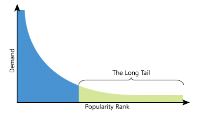
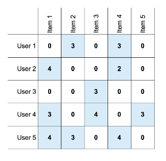
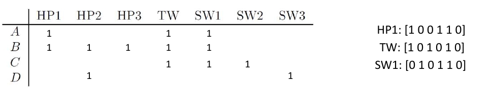
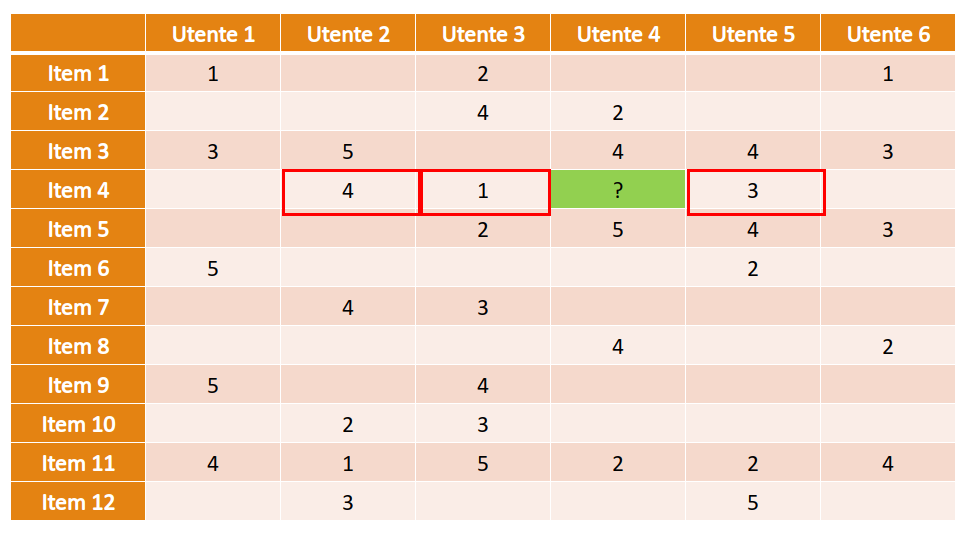
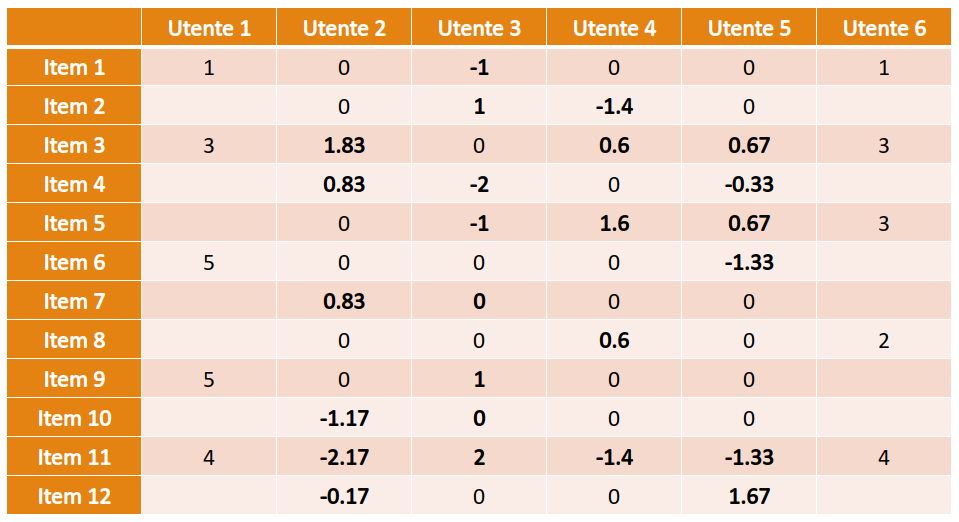
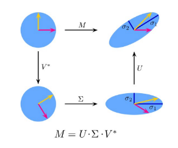
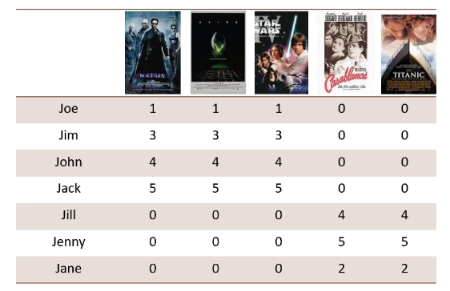
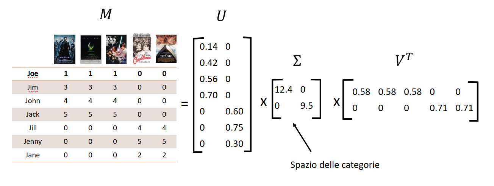
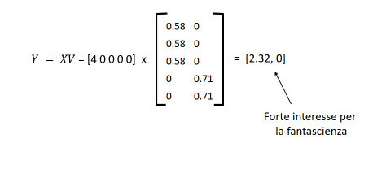
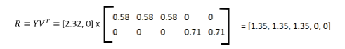

# Sistemi di raccomandazione

## 1. Introduzione

I sistemi di raccomandazione sono una classe di sistemi che implicano la predizione delle risposte dell'utente a delle opzioni, o in generale, le preferenze di un utente rispetto a specifici oggetti (*items*) sulla base delle preferenze espresse in passato. L'idea principale dietro i sistemi di raccomandazione è la seguente: 

* L'utente interagisce con gli oggetti; 
* In base a tali oggetti, il sistema crea un modello di preferenze per l'utente; 
* Il modello permette di predire la reazione dell'utente a nuovi oggetti; 
* Il sistema cerca quali oggetti sono potenzialmente interessanti per l'utente; 
* Il sistema raccomanda oggetti interessanti all'utente; 

### 1.1 Tassonomia

Esistono due principali gruppi di sistemi di raccomandazione: 

* Sistemi ***content-based***, che effettuano suggerimenti ad un utente sulla base delle proprietà di altri item con cui l'utente ha interagito. 
* Sistemi ***collaborative filtering***, che effettuano suggerimenti ad un utente sulla base degli item piaciuti ad utenti ad esso simili. 

### 1.2 Fenomeno long tail 

Lo spazio limitato dei negozi fisici spinge i negozianti all'esposizione della merce più popolare, che risulta vendibile con maggiore frequenza. Tale scelta emargina prodotti di nicchia, come film di autori novelli o dischi di band underground. Un sistema di raccomandazione prende in considerazione un numero di prodotti maggiore di almeno 2 o 3 ordini di grandezza rispetto a quelli esposti in un negozio fisico. 

Gli articoli sono generalmente caratterizzati da una distribuzione a coda lunga per la quale solo un piccolo insieme di articoli ha maggiore popolarità, mentre un ampio insieme di articoli costituisce una nicchia, che spesso non è nemmeno conosciuta dai clienti. Mentre i negozi fisici tendono a utilizzare tutto lo spazio sugli scaffali per posizionare gli articoli più popolari, i negozi digitali non soffrono di tale problema e possono spingere verso una maggiore variabilità dei contenuti. Di conseguenza, c'è un insieme di prodotti poco popolari che si possono trovare solo online, non convenienti da vendere in un negozio fisico. 

I rivenditori digitali possono facilmente esplorare la distribuzione a coda lunga perché non hanno alcun vincolo fisico (spazio sugli scaffali), ma come fanno a far conoscere agli utenti i prodotti di cui non sono a conoscenza perché non sono abbastanza popolari? Lo strumento più ambito a questo scopo è il sistema di raccomandazione, che può guidare gli utenti da un item popolare ad uno meno popolare con caratteristiche simili.

#### 1.2.1 Alcuni svantaggi 

Un sistema di raccomandazione necessita di molti dati per funzionare correttamente. Più informazioni si conoscono sulle preferenze degli utenti, più è accurata la predizione. In alcuni contesti, ad esempio nell'informazione e nei social media, un sistema di raccomandazione può essere utilizzato ai fini di consenso e propaganda per orientare gli utenti verso un'opinione: può scaturire una mancanza di opinione critica sui fatti. 

### 1.3 Definizione del problema

Sia $X$ l'insieme degli utenti ed $S$ l'insieme degli item. Lo scopo di un sistema di raccomandazione è quello di assegnare un valore ad una coppia $utente$-$item$ $(x,s) \in X \times S$ che quantificherà quanto all'utente $x$ possa piacere l'item $s$. Definiremo quindi una *utility function* (funzione di utilità) come segue: 
$$
u:X \times S \to R
$$
Dove $R$ è l'insieme del rating, ovvero un insieme totalmente ordinato. Esistono molte varianti di rating: 

* rating compreso tra $0-5$ stelle
* rating normalizzato compreso in $[0,1 ]$ 
* rating binario $\{0, 1\}$ (mi piace, non mi piace) 

#### 1.3.1 Matrice di utilità

Un sistema di raccomandazione si basa su un insieme di preferenze conosciute espresse da utenti per oggetti o item, che può essere rappresentato da una matrice di utilità $M$ (talvolta chiamata $U$). La matrice $M$ è una matrice $users$-$items$ dove l'i-esima riga rappresenta l'utente $x_i$, l'i-esima colonna rappresenta l'item $s_i$ ed ogni elemento $r_{i,j}$ della matrice rappresenta il rating dell'utente $x_i$ rispetto all'item $s_j$. 

Essa rappresenta la conoscenza esistente del sistema sulla relazione tra utenti ed articoli ed è perlopiù *sparsa* poiché un generico utente *recensisce* / *interagisce con* pochi item. Un sistema di raccomandazione vuole predire i valori di rating inesistenti della matrice. 

### 1.4 Problematiche chiave

Quando progettiamo un sistema di raccomandazione, incontreremo due problemi principali: la popolazione della matrice di utilità e la predizione di rating non ancora conosciuti. 

#### 1.4.1 Popolare la matrice di utilità

Se la matrice di utilità è vuota, è impossibile effettuare delle raccomandazioni. Ci sono due metodi pincipali per popolare la matrice di utilità: metodo *esplicito* e metodo *implicito*. I due approcci possono essere utilizzati in contemporanea. 

L'approccio ***esplicito*** consiste nel chiedere all'utente di recensire gli item (i.e. Netflix ai nuovi utenti). Tuttavia, questo approccio stanca ed infastidisce facilmente gli utenti, che potrebbero cambiare piattaforma o inserire suggerimenti casuali. Inoltre, le valutazioni sono generalmente influenzate dal fatto che sono fornite da persone disposte a fornirle (che di solito è una piccola parte dell'intero gruppo di utenti). 

L'approccio ***implicito*** fa inferenza dal comportamento dell'utente. Ad esempio lo storico delle visite a certi item, lo storico degli acquisti, le interazioni con l'oggetto etc. In generale, lo storico di ricerca è utilizzato per fare inferenza sulle categorie di item di interesse.  

## 2. Sistemi Content-Based 

L'idea principale dietro i sistemi Content-Based è quella di raccomandare all'utente $x$ degli item simili ad item recensiti precedentemente con un buon rating. Ad esempio: 

* Raccomandare film con gli stessi attori, dello stesso regista o dello stesso genere. 
* Raccomandare news con contenuto simile (i.e. politica, cucina, sport)

**Step 1**. Dato un utente, il punto di partenza è costituito dagli item da esso recensiti. Ogni item è descritto da vari attributi. Per ogni item recensito viene costruito un profilo, ovvero un vettore di valori dove ogni valore è riferito ad un attributo. Ipotizziamo che gli item siano film, allora gli attributi possono essere i vari generi (thriller, romantico, horror, azione, etc). 

**Step 2**. Viene costruito uno *user profile* (profilo dell'utente) a partire dai profili degli item recensiti, che rappresenti il grado medio di preferenza dell'utente rispetto ai vari attributi. Ad esempio, l'utente potrebbe preferire film di azione e romantici e valutare negativamente gli horror. 

**Step 3**. Dato un item non ancora recensito dall'utente, viene generato il profilo dell'item e confrontato con lo user profile. Da una certa nozione di similarità tra profili si inferisce se all'utente possa piacere o meno l'item.

I problemi più rilevanti sono: la scelta delle proprietà principali, la costruzione del profilo utente, il calcolo della similarità tra due profili. 

### 2. 1 Definizione formale 

Si supponga che tra le $m$ proprietà degli item se ne selezionino $k$ più rilevanti $f_1, ..., f_k$. 

Per ogni item $s_i$ valutato dall'utente $x$ viene costruito un profilo $I_i$, ovvero un vettore $Pr(I) = (i_1, ..., i_k)$ tale che: 
$$
i_j = 
\begin{cases}
1 \text{ se } s_i \text{ possiede la proprietà } f_j \\
0 \text{ altrimenti}
\end{cases}
$$
Si costruisce il profilo $U$ dell'utente $x$, ovvero il vettore di $k$ valori $Pr(U) = (u_1, ..., u_k)$, dove il generico elemento $u_j$ rappresenta il grado medio di preferenza dell'utente $x$ per gli item recensiti che possiedono la proprietà $f_j$. Sia $s^*$ un item non ancora recensito da $x$ e di cui si vuole predire la preferenza. Si genera il profilo $I^*$ dell'item e si calcola la similarità tra i profili $U$ ed $I^*$. Se la similarità è alta, allora si consiglia ad $x$ l'item $s^*$. 

### 2.2 Profilo di un item 

Il profilo di un item descrive quali proprietà contiene un item. Le proprietà rappresentano categorie, tag o parole chiave che è possibile associare ad un item. Se gli item fossero dei film, gli attributi potrebbero essere i generi, il regista, l'anno di uscita e/o gli attori. Nel caso dei testi è possibile calcolare lo score TF-IDF delle parole e utilizzare le $n$ parole con score più alto come attributi dei documenti. Nelle immagini è possibile utilizzare dei tag che ne descrivano il contenuto, estraibili automaticamente con algoritmi di machine learning. 

Come descritto precedentemente, se la feature è presente nell'item, allora viene contrassegnata con $1$, altrimenti con $0$. Una volta fissati gli attributi è possibile rappresentare un item come un vettore. Per fissare ciò possiamo definire una funzione di rappresentazione $f$ che trasformi gli item in profili (vettori): 
$$
f:S \to \{0,1\}^k
$$
Dove $k$ è il numero di attributi scelti. 

### 2.3 Profilo di un utente

Partendo dalle valutazioni già effettuate dall'utente su altri item, occorre aggregare in qualche modo le valutazioni che riguardano item che condividono la stessa proprietà. La funzione di aggregazione più semplice è la media delle valutazioni.

 

#### 2.3.1 Caso binario

Poniamoci nel caso ***binario*** in cui l'elemento della matrice è asserito con 1 se è stato valutato positivamente. Supponiamo che vi siano $n$ item e che gli attributi discriminanti siano $k$. Possiamo computare il profilo dell'utente $x_i$ attraverso la media come segue: 
$$
\text{profile}(x_i) = \frac 1 {\sum_{j=1}^n M_{i,j}} \sum_{j=1}^n M_{i,j} \times I_j
$$
Dove $I_j = f(s_j)$ è il profilo dell'item $s_j$. Così facendo otterremo un vettore di dimensione $k$, ovvero il profilo dell'utente. Vediamo un esempio: 

Il profilo dell'utente $A$ verrà calcolato secondo la formula, per cui: 
$$
\text{profile}(A) = \frac {\text{HP1 + TW + SW1}}{3} = [.67, .34,.34, .67, 1, 0]
$$

#### 2.3.2 Caso reale

Quando la matrice di utilità non è binaria, ha senso normalizzare gli elementi della matrice di utilità per il loro valore medio. In questo modo, le valutazioni al di sotto della media avranno un punteggio negativo, mentre valutazioni sopra la media avranno un punteggio positivo. Questo metodo si adatta inoltre in base agli utenti: utenti più critici avranno medie più basse e rating bassi ma sopra la media avranno comunque un punteggio positivo (simmetricamente per utenti più gentili).

Definiamo preventivamente la media delle valutazioni dell'utente $x_i$ supponendo che gli item non ancora valutati abbiano valore 0 nella matrice di utilità: 
$$
\bar u_i = \frac {1}{\sum_j[M_{i,j} \ne 0]} \sum_{j=1}^n M_{i.j}
$$

Dopodiché possiamo costruire il profilo dell'utente $x_i$ come segue: 
$$
\text{profile}(x_i) = \frac {1}{\sum_j[M_{i,j} \ne 0]} 
\sum_{j=1}^n M_{i.j} \times I_j
$$

### 2.4 Similarità tra profili

Per calcolare la similarità tra profili è possibile utilizzare qualsiasi misura di similarità tra vettori. La misura più utilizzata è la *similarità del coseno*, che equivale al coseno dell'angolo formato dai due vettori. Dati due vettori di $k$ elementi $\bar u = (u_1, u_2, ..., u_k)$ e $\bar v = (v_1, v_2, ..., v_k)$, la similarità del coseno è definita come: 
$$
\text{cossim}(\bar u, \bar v) = \frac {\bar u ·\bar v} {||\bar u|| \times ||\bar v||} 
= \frac {\sum_{i=1}^k u_i v_i} {\sqrt{\sum_{i=1}^k u_i^2} \sqrt{\sum_{i=1}^k v_i^2}}
$$
A differenza della similarità basata sulla distanza euclidea, la similarità del coseno tiene conto solo della differenza di direzione dei vettori e non degli specifici valori. Il codominio della funzione va da -1 (vettori antiparalleli) ad 1 (vettori paralleli). 

### 2.5 Vantaggi e svantaggi

I sistemi Content-Based non richiedono confronti con altri utenti, sono facili da interpretare e promuovono gli item non popolari. Tuttavia, individuare le proprietà adatte per costruire i profili degli item può essere difficile e risulta impossibile eseguire delle previsioni su nuovi utenti che non hanno ancora valutato alcun item. Allo stesso modo, risulta impossibile eseguire predizioni su item che contengono proprietà non valutate dall'utente. Un altro difetto marcato è la *overspecialization*: si tende a consigliare solo oggetti simili tra loro, senza proporre all'utente nuove scelte. 

## 3. Sistemi Collaborative Filtering 

### 3.1 User-User collaborative filtering 

L'idea principale dietro ai Collaborative Filters è la seguente: gli item da suggerire all'utente $x$ sono quelli valutati in maniera positiva da utenti simili ad $x$. Tale sistema è incentrato maggiormente sul comportamento degli utenti piuttosto che sugli item. 

#### 3.1.1 Schema generale 

Ipotizziamo di voler predire la valutazione dell'utente $x$ rispetto ad un item $s$ non ancora valutato. Il primo step effettuato dai Collaborative Filters è quello di individuare gli $N$ utenti più simili ad $x$ che hanno valutato l'item $s$. Dopodiché si calcola la media delle valutazioni degli utenti sull'item $s$, pesata in base allo score di similarità tra ciascuno degli $N$ utenti ed $x$. Il valore ottenuto da tale media pesata è il rating predetto per l'utente $x$ sull'item $s$. 

#### 3.1.2 Similarità tra utenti

Il *profilo dell'utente* in questo caso è rappresentato dalla corrispondente riga nella matrice $M$ di utilità, dove alle entry vuote viene associato il valore 0. Per calcolare la similarità tra utenti è possibile utilizzare nuovamente la similarità del coseno. 

Applicare la similarità del coseno direttamente sulle righe della matrice introdurrebbe un bias, dal momento in cui il valore 0 non corrisponde ad una valutazione negativa, bensì neutra. Occorre quindi ***normalizzare***, ovvero centrare i valori di rating rispetto al valore 0, in modo che rating bassi risultino negativi e rating alti positivi. Ciò può essere ottenuto sottraendo a ciascun valore di rating conosciuto la media dei rating assegnati dall'utente ai vari item.   

Esempio: ipotizziamo di avere la seguente matrice sparsa di utilità. Ipotizziamo di voler stimare la valutazione dell'utente 4 rispetto all'item 4. Consideriamo gli utenti che hanno già valutato l'item 4, che risultano essere gli utenti 2,3 e 5. 

Normalizziamo i profili degli utenti 2, 3, 4 e 5 sottraendo la media degli item valutati a tutte le valutazioni e poniamo a 0 (valutazione neutra) tutti gli item non valutati. 

Calcoliamo la similarità del coseno tra l'utente 4 e gli utenti 2,3 e 5 e, supponendo che $N=2$, otteniamo che i due utenti più simili sono 2 (con 0.47) e 5 (con 0.46). Calcoliamo la media pesata dei rating di 2 e 5 sull'item 4, ovvero la predizione della valutazione dell'utente 4 rispetto all'item 4: 
$$
\hat M_{4,4} = \frac {.47 \times 4 + .46 \times 3}{.47 + .46} = 3.51
$$

#### 3.1.3 Similarità nel caso binario

Supponiamo che la matrice $M$ di utilità sia binaria e che ogni elemento indichi se all'utente piace o meno un determinato item. Nel caso binario è possibile rappresentare il profilo dell'utente come un insieme di item piaciuti. Data la notazione insiemistica, è possibile misurare la similarità tra utenti attraverso la similarità di Jaccard (complementare della distanza di Jaccard): 
$$
J(x_i, x_j) = \frac {|x_i \cap x_j|} {|x_i \cup x_j|}
$$
Tale metrica misura l'intersezione dei due insiemi, ovvero gli item che piacciono ad ambo gli utenti, rispetto all'unione dei due insiemi, ovvero la totalità di item valutati da entrambi gli utenti (fattore di normalizzazione). È compresa tra 0 ed 1, dove la massima similarità è 1 ed indica due utenti a cui piacciono esattamente gli stessi item.  

### 3.2 Item-Item collaborative filtering 

Si consideri l'utente $x_i$ ed un item $s_j$ non valutato da $x_i$. Si consideri come profilo $I_j$ dell'item $s_j$ la colonna $j$-esima della matrice di utilità, normalizzata sottraendo la media delle valutazioni degli utenti. Si trovino gli $N$ item più simili ad $s_j$ e valutati dall'utente $x_i$, utilizzando la distanza del coseno. A questo punto si stimi la valutazione dell'utente $x_i$ rispetto all'item $s_j$ attraverso la media dei rating dati dall'utente $x_i$ agli $N$ item più simili ad $s_j$, pesata con lo score di similarità. Il risultato sarà la valutazione predetta. 

Tale schema differisce dai sistemi content-based in quanto il profilo dell'item non è costruito attraverso gli attributi dell'item stesso, bensì attraverso le valutazioni degli utenti nella matrice di utilità. Nella pratica, i sistemi Item-Item funzionano meglio poiché gli utenti tendono ad avere preferenze diverse. 

### 3.3 Confronto tra collaborative filters 

Le due strategie comportano un trade-off tra efficienza ed accuratezza. Lo schema basato sulla similarità degli item è più informativo e permette di ottenere predizioni più affidabili. Questo poiché vi sono generalmente più item che utenti nella matrice di utilità ed è più facile trovare item dello stesso genere che utenti a cui piacciono solo item di un certo genere (il profilo di un utente è quasi univoco). 

Lo schema basato sulla similarità tra utenti è tuttavia più efficiente se vogliamo predire tutti i rating dell'utente $x$. Questo è conseguenza del fatto che una riga della matrice di utilità ha molte entry vuote. Utilizzando lo schema basato sugli utenti è sufficiente individuare l'insieme degli utenti simili ad $x$ per stimare il rating di vari item non valutati da $x$. Nel sistema item-item, per ogni item non valutato è necessario ri-calcolare la similarità.  

### 3.4 Vantaggi e svantaggi

I sistemi Collaborative Filtering lavorano con tutti gli utenti, anche aventi proprietà diverse. Non è necessaria una selezione di proprietà o feature sugli item. Tuttavia, non è possibile eseguire predizioni su nuovi utenti o riguardanti nuovi item. Nella pratica, i sistemi di raccomandazione sono ibridi, ovvero una combinazione tra le due tecniche. 

## 4. Singular Value Decomposition (SVD)

### 4.1 Dimensionality reduction

I sistemi di raccomandazione lavorano solitamente su una matrice di utilità di grandi dimensioni, con un elevato numero di utenti ed item. In un contesto in cui subentrano i Big Data, i problemi principali sono: 

* L'efficienza: operazioni svolte su matrici e vettori di grandi dimensioni. 
* Problema della dimensionalità: in uno spazio ad elevate dimensioni, i punti tendono ad essere tutti equidistanti gli uni dagli altri, rendendo complesso il calcolo della similarità. 

Occorre quindi adottare delle tecniche di *dimensionality reduction* (riduzione della dimensionalità), che permettono ai sistemi di raccomandazione di operare con matrici e vettori più piccoli. 

### 4.2 Clustering di item e/o utenti

Una tecnica naive per provare a ridurre la dimensionalità è il *clustering*. Se due o più item hanno caratteristiche simili, allora potrebbero far parte di uno stesso cluster. L'idea è quella di disporre i cluster sulle colonne della matrice di utilità, anziché gli item. 

L'entry $M_{i,j}$ si riferirà alla valutazione dell'utente $x_i$ rispetto al cluster $c_j$, dove la valutazione del cluster è data dalla media delle valutazioni dell'utente sugli elementi del cluster. Si può effettuare analogamente il clustering di utenti e sostituire le righe con cluster di utenti. I due metodi di riduzione possono essere adottati in contemporanea. Tale tecnica è utile ma utilizzabile solo in casi particolari e, inoltre, richiede l'esecuzione di algoritmi di clustering su grosse moli di dati. 

### 4.3 Decomposizione di matrici

Supponiamo che esista un insieme relativamente piccolo di feature di item ed utenti che determinano la valutazione della maggior parte di utenti per la maggior parte di item. Queste feature, riprendendo l'idea del clustering, sosno rappresentative di intere categorie o gruppi di feature. 

L'idea è quella di utilizzare delle tecniche di *decomposizione* o *fattorizzazione di matrici* (che esprimono una matrice come prodotto di due o più matrici). Le tecniche di fattorizzazione permettono di fattorizzare una matrice $m \times n$: 

* Come prodotto di due matrici di dimensione, rispettivamente, $m \times r \text{ ed } r \times n$. 
* Come prodotto di tre matrici di dimensione, rispettivamente, $m \times r \text{, } r \times r, r \times n$

Alcune scomposizioni d'esempio sono la decomposizione LU, la decomposizione UV, la singular value decomposition (SVD), etc. 

### 4.4 Singular Value Decomposition

La SVD è una tecnica di decomposizione spettrale di una matrice $M$ di dimensione $m \times n$ nel prodotto di tre matrici: 
$$
M = U\Sigma V^T
$$
Dove: 

* $U$ è una matrice unitaria di dimensione $m \times r$
* $\Sigma$ è una matrice diagonale di dimensione $r \times r$, i cui elementi sulla diagonale sono non negativi
* $V$ è una matrice unitaria di dimensione $n \times r$ 

Ricordiamo che una matrice $A$ è unitaria se e solo se $AA^T = I$.  

#### 4.4.1 Proprietà della SVD

* La decomposizione esiste sempre. 
* Gli elementi di $\Sigma$ vengono chiamati ***valori singolari*** di $M$. 
* Il numero di valori singolari non nulli (diagonale di $\Sigma$) corrisponde al rango di $M$. 
* Le colonne della matrice $U$ sono chiamate ***vettori singolari di sinistra***. 
* Le colonne della matrice $V$ sono chiamate ***vettori singolari di destra***. 
* I vettori singolari di sinistra di $M$ sono gli ***autovettori*** della matrice $MM^T$ 
* I vettori singolari di destra di $M$ sono gli ***autovettori*** della matrice $M^TM$ 
* I valori singolari di $M$ non nulli sono le radici quadrate degli autovalori non nulli di $MM^T$ ed $M^TM$ 

Trovare la decomposizione SVD di una matrice consiste nel trovare autovettori ed autovalori delle matrici $MM^T$ ed $M^TM$. 

#### 4.4.2 Interpretazione geometrica 

Sia $M$ una matrice $2 \times 2$. Nel piano $\R^2$ consideriamo un cerchio di raggio unitario con i due vettori unitari canonici (basi standard). La SVD ruota e trasforma il cerchio in un ellisse i cui semiassi hanno lunghezze pari ai valori singolari non nulli di $M$. 

#### 4.4.3 SVD nei sistemi di raccomandazione

Nell'ambito dei sistemi di raccomandazione SVD può essere applicata per velocizzare il sistema, trasformando la matrice $M$ di utilità nel prodotto di matrici più sottili, su cui risulti più semplice effettuare la predizione. Sia $M$ la matrice di utilità formata da $m$ utenti ed $n$ item. Allo spazio formato da utenti ed item, la decomposizione SVD affianca un secondo spazio chiamato spazio delle ***categorie***. 

La decomposizione SVD permette di mappare dati dallo spazio degli utenti e degli item allo spazio delle categorie e viceversa. Riprendendo la definizione della scomposizione: 
$$
M = U\Sigma V^T
$$
Dove in questo caso: 

* U è una matrice unitaria formata da $m$ utenti ed $r$ categorie 
* $\Sigma$ è una matrice diagonale di dimensioni $r \times r$, con elementi della diagonale non negativi
* $V$ è una matrice unitaria formata da $n$ item ed $r$ categorie. 

#### 4.4.4 Calcolo delle predizioni con SVD 

Usando SVD possiamo calcolare le predizioni di un utente per tutti gli item mediante un prodotto di matrici. 

* Sia $x$ un utente ed $X$ il vettore di lunghezza $n$ contenente i rating correnti su tutti gli item (se il rating per un item non è conosciuto poniamo 0). 
* Si moltiplica $X$ per $V$, il che equivale a mappare i rating correnti dallo spazio originale a quello delle categorie. Sia $Y = XV$. 
* Si moltiplica $Y$ per $V^T$, il che equivale a ri-mappare i valori dallo spazio delle categorie allo spazio originale. Sia $R = YV^T$ 
* Il vettore $R$ contiene le predizioni dei rating di $x$ su tutti gli item. 

#### 4.4.5 Esempio

Consideriamo un nuovo utente $x$: $x$ ha visto solo il film Matrix, valutandolo 4 stelle su 5. Supponiamo di avere la matrice di utilità in figura. Il profilo dell'utente $x$ è $[4, 0, 0, 0, 0]$. Vogliamo predire il rating di $x$ sugli altri film. 

Proseguiamo calcolando il rango della matrice $7 \times 5$ attraverso uno dei metodi di calcolo del rango (i.e. criterio dei minori, teorema di Kronecker o degli orlati, eliminazione gaussiana). Il rango della matrice $\rho(M)$ risulta essere 2. Quindi lo spazio delle categorie è formato da due sole categorie (in questo caso Fantascienza e Amore). Calcoliamo gli autovettori ed autovalori delle matrici $MM^T$ ed $M^TM$ e costruiamo la decomposizione: 

Mappiamo adesso $X = [4, 0, 0, 0 ,0]$ nello spazio delle categorie attraverso il prodotto $Y = XV$: 

E ri-mappiamo $Y$ nello spazio dei film attraverso il prodotto $R = YV^T$: 

Con il seguente risultato: 

## 5. Valutazione dei risultati

Un sistema di raccomandazione può essere visto come un classificatore o un predittore. Se conosciamo i valori reali di rating, possiamo valutare la qualità del sistema confrontando i valori predetti con quelli reali. Nei casi in cui la matrice di utilità è binaria (like / not like), o nel caso in cui non è rilevante predire il valore esatto di rating ma semplicemente se è positivo o negativo, è possibile utilizzare le tecniche standard viste per la classificazione (precision, recall, accuracy, TPR, FPR, etc.). 

Se siamo invece interessati a predire il valore esatto, possiamo utilizzare tecniche standard per valutare la qualità di un predittore. La misura più utilizzata è il Root Mean Square Error (RMSE): 
$$
\text {RMSE} (\hat R, R) = \sqrt{\frac{\sum_{i=1}^{|\hat R|} (\hat R_i - R_i)^2}{|\hat R|}}
$$
Dove $\hat R$ è il vettore dei rating predetti ed $R$ è il vettore dei rating reali. 