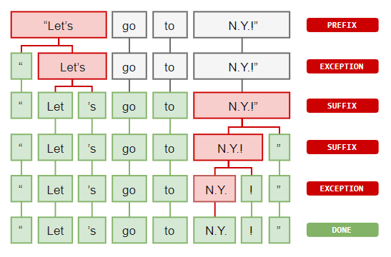
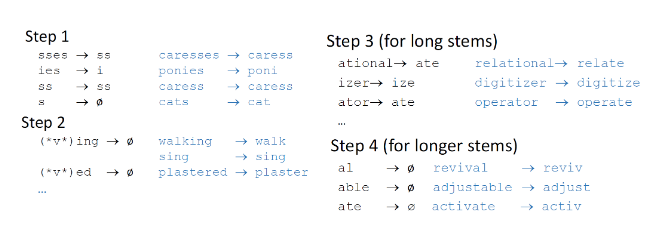
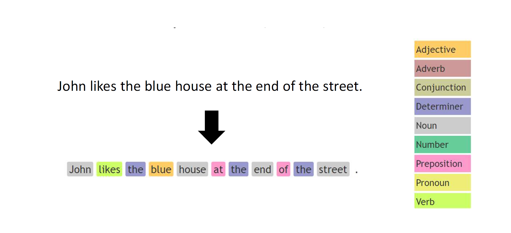
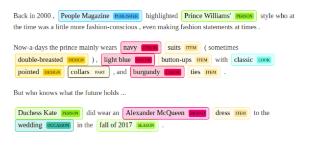
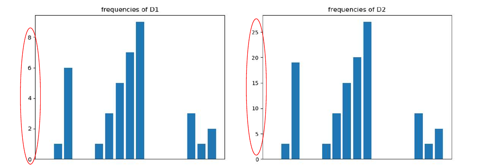

# Cenni di analisi testuale

## 1. Introduzione

L'analisi testuale è la più frequente analisi attuabile nel web e nei social media. Il testo può essere *strutturato*, ovvero analizzabile in maniera deterministica da calcolatori (es. XML, JSON, codice), o *non strutturato*, ovvero scritto da esseri umani utilizzano il linguaggio naturale. Nel primo caso abbiamo regole formalizzate per analizzare il testo, ad esempio attraverso le *espressioni regolari*. Nel secondo caso è necessario adottare tecniche di *Natural Language Processing* (NLP), che si occupano dell'interazione tra l'umano e il calcolatore attraverso il linguaggio naturale. Le tecniche di NLP sono utilizzate per vari scopi, come l'estrazione di informazioni utili dal testo, categorizzazione del testo, sentiment analysis. 

## 2. Natural language processing 

Il Natural language processing è un processo molto sofisticato e può comporsi di vari passaggi. In generale, gli step da portare al termine sono i seguenti: 

* Scomporre il testo nei suoi costituenti
* Identificare tali costituenti
* Calcolare statistiche sui tali
* Categorizzare le parole in base alle statistiche

### 2.1 Word tokenization

Per analizzare un testo bisogna dividerlo prima in una sequenza di *token*. Un token è una entità comparabile all'interno di un vocabolario di simboli o parole. Dopo aver eseguito la tokenization, è possibile calcolare alcune statistiche basilari, come contare le occorrenze della parola nel testo. 

Nel processo di Word Tokenization vi sono alcuni costrutti da comprendere: 

* Prefissi: caratteri iniziali (es. \$5.00, "$" è un prefisso) 
* Suffissi: caratteri finali (es. 22km, "km" è un suffisso)
* Infissi: caratteri centrali (es. so-called, "-" è un infisso)
* Eccezioni: particolari regole che permettono di dividere (o non dividere) espressioni in token. 

Un esempio di eccezione potrebbe essere la parola "N.Y." che indica "New York". I punti all'interno della parola devono essere considerati in un modo tale da non dividerla in due token differenti. Essendo questo un caso particolare di tokenizzazione, consiste in una eccezione.  

### 2.2 Stemming

La word tokenization permette di dividere il testo in token, ma più token possono essere diverse coniugazioni dello stesso verbo e quindi indicare lo stesso termine (es. Run, Running $\to$ run). Lo *stemming* è un processo naive che permette di raggruppare tali varianti in un solo *stem* (termine originale), rimuovendo la parte finale dalle parole. È necessario notare che l'utilizzo dello stemming riduce la *semantica* del testo.  Un stemmer famoso per la lingua inglese è lo **Stemmer di Porter**, che consiste in 4 step: 

Gli stemmer possono essere inaccurati in alcuni casi, come nelle forme irregolari (ran $\rightarrow$ run). In certi casi, risulta conveniente adottare altri strumenti che vedremo in seguito.

### 2.3 Lemmatization

A differenza dello Stemming, il processo di *Lemmatization* consulta vocabolari dei linguaggi per attuare una analisi morfologica alle parole (es. associare *was* a *be*),  ed analizza il contesto per risolvere ambiguità nell'interpretazione. La raffinatezza dell'algoritmo paga in prestazioni, per cui la scelta dello stemming rimane comunque valida. 

### 2.4 Stop words

Alcuni termini come le congiunzioni, gli articoli, la punteggiatura, non hanno particolare impatto sull'analisi del linguaggio naturale. Tali termini prendono il nome di stop words: il loro contenuto informativo è oggettivamente basso, per cui una parte del processo di NLP prevede spesso la stop words removal, mantenendo solo termini realmente significativi.  

### 2.5 POS - Part of speech tagging 

Il linguaggio naturale è ambiguo: la semantica delle parole varia in base al contesto, contiene forme irregolari etc. Un processo nato allo scopo di interpretare ogni singolo termine all'interno di un testo è il Part-Of-Speech tagging (POS tagging). Ad ogni termine viene attribuito un tag, che segue uno [standard universale](https://universaldependencies.org/u/pos/) e può essere di due tipi: 

* Course-grained tag: un tag grossolano (es. verbo)
* Fine-grained tag: un tag specifico (es. aggettivo possessivo)

### 2.6 Named entity recognition

Il processo di **Named Entity Recognition** (NER) consiste nell’identificazione e nella classificazione di predefiniti tipi di entità all'interno del testo. Esempi classici di entità riconoscibili in un documento sono organizzazioni, persone, luoghi, etc. 

### 2.7 Sentence segmentation

Durante l'analisi di un testo può risultare utile dividere in frasi. Lo scopo potrebbe essere quello di conteggiare le parole per frase, o farne la media. Il processo prende il nome di *sentence segmentation* e non risulta particolarmente complesso. Gli ostacoli principali di quest'ultimo sono dati dalla punteggiatura: non basta dividere il testo attraverso le occorrenze di ".", ma bisogna talvolta contestualizzare (es. in 25.5% il punto non indica l'inizio di una nuova frase).

### 2.8 Pipeline generale nella NLP 

Riassumendo, il processo di NLP segue spesso la seguente pipeline: 

* Word tokenization
* Stop words removal
* Stemming / Lemmatization
* POS tagging (dipende dall'applicazione)
* NER tagging (dipende dall'applicazione)

Chiaramente alcuni step possono essere omessi, altri step potrebbero essere introdotti. 

## 3. Bag of words representation

La *bag of words* è un tipo di rappresentazione utilizzata nella Information Retrieval e nel NLP per rappresentare documenti testuali ignorando l'ordine delle parole. Permette di considerare la frequenza, o analogamente il conteggio, dei termini all'interno del testo. In tale senso, il documento è visualizzato come una *borsa di parole*. Le procedure principali per l'estrazione delle parole dal testo sono la *word tokenization* e molto spesso la *stop words removal*. 

Una volta applicati gli step sul training set composto da documenti da analizzare, i termini risultanti vengono inseriti all'interno di un grande vocabolario *V*, che avrà una certa cardinalità $n$. Sia $d = \{t \mid  t \in V\}$ un documento appartenente all'insieme dei documenti $D$. Definiamo una funzione conteggio: 
$$
c : D \times V \to \N
$$
dove $D$ indica l'insieme dei documenti. La funzione $c$ prende in input un documento $d \in D$ ed un termine $t \in V$ e restituisce il conteggio del termine all'interno del documento. Possiamo associare ad un documento $d$ un vettore $bow(d) = (c_1, \dots, c_n)$ di dimensione $n$ (analoga alla cardinalità del vocabolario), il cui $i$-esimo elemento è ottenuto come 
$$
c_i = c(d, t_i)
$$
Ed indica le occorrenze del termine $t_i$ nel documento $d$. La rappresentazione attraverso il vettore *bow* permette all'algoritmo di lavorare con una struttura di *lunghezza fissata*.

### 3.1 Normalizzazione ed nbow 

Due documenti potrebbero avere frequenze simili, ma una significativa differenza in quantità di parole. Osservando gli istogrammi sottostanti notiamo la similarità tra i documenti $D_1$ e $D_2$.  Tuttavia, i valori nelle ordinate risiedono su grandezze differenti. 

Per mitigare il problema si ricorre alla *normalizzazione*, ovvero si divide ogni elemento del vettore *bow* per la somma di tutti gli elementi del vettore *bow*. Chiameremo *nbow* (*normalized bag of words*) il nuovo vettore: 
$$
nbow(d)_i = \frac{bow(d)_i}{\sum_j bow(d)_j} 
$$
Faremo riferimento alla *frequenza* di un termine $t_i$ (term frequency) rispetto ad un documento $d$ indicando la frequenza normalizzata di tale termine: 
$$
tf(d, t_i) = nbow(d)_i
$$
Dato che il conteggio dei termini è sempre positivo (al più nullo), la normalizzazione effettuata sarà del tutto equivalente alla normalizzazione L1 (deviazione assoluta). Il risultato delle due normalizzazioni rende molto simili (se non identici) i due grafici. 

### 3.2 TF-IDF 

Se consideriamo il caso del rilevamento di posta spam, alcune parole come "Ciao", "Quando", "Buonasera" sono molto frequenti sia nelle mail di spam che nelle mail ordinarie. Parole come "Viagra", "Occasione", "Soldi" sono più comuni nelle email di spam, per cui dovrebbero avere un certo peso nella rilevazione. Tuttavia, con le tecniche adottate sin'ora, se in una mail di 100 parole vi è un'occorrenza della parola "Viagra", essa avrà comunque peso $\frac{1}{100}$. Intuitivamente, vorremmo attribuire a termini rari un peso maggiore rispetto a termini frequenti: entra in gioco la normalizzazione TF-IDF (*term frequency - inverse document frequency*). La TF-IDF tiene in considerazione il contenuto di *tutti i documenti* durante l'analisi del singolo documento. Consideriamo un insieme *D* composto da *n* documenti. Definiamo il numero di termini $m_i$ contenuti all'interno dell'i-esimo documento come segue: 

$$
m_i = \sum_j c(d_i, t_j)
$$
La frequenza di un termine (**term frequency**) all'interno di un documento è definita come segue: 
$$
tf(d_i, t_j) = \frac{c(d_i, t_j)}{m_i}
$$
Indicheremo con *p* una funzione *presenza* che indichi se un termine $t_j$ è contenuto all'interno del documento $d_i$: 
$$
p(d_i, t_j) =
\begin{cases}
  1 \space if \space c(d_i,t_j) > 0 \\
  0 \space otherwise
\end{cases}
$$
Indicheremo con C una funzione che indichi il numero di documenti che contiene il termine $t_i$: 
$$
C(t_i) = \sum_j p(d_j, t_i)
$$
Definiamo la **inverse document frequency** come: 
$$
idf(t_j) = log(\frac{n}{C(t_j)})
$$
 La i-esima componente del vettore **bow** sarà definita come segue: 
$$
bow(d_i)_j = tf(d_i, t_j) * idf(t_j)
$$
Analizziamo adesso il significato della inverse document frequency. Notiamo che: 
$$
idf(t_j) = log(\frac{n}{C(t_j)}) = - log(\frac{C(t_j)}{n})
$$
Il termine all'interno del logaritmo definisce la probabilità di trovare il termine j-esimo all'interno di un documento, calcolata attraverso un approccio frequentista. Possiamo indicare tale termine come $P(T =t_j)$, per cui: 
$$
idf(t_j) = - log(P(T= t_j))
$$
Che corrisponde esattamente al calcolo dell'informazione introdotta dal termine $t_j$. Più alta è l'informazione introdotta, più il peso del termine verrà aumentato. 

### 3.3 Bag of things

Anziché basarsi sui termini, un'altro tipo di rappresentazione può considerare stems o vari tags. Elenchiamo alcune rappresentazioni utili: Bag of stems, Bag of POS, Bag of NER, Bag of lemmas. Bag of n-grams. 

## 4. N-gram

Analizzare le singole parole è consono per alcuni task come la spam detection. Tuttavia, la struttura viene completamente andata persa, per cui è possibile che si creino delle ambiguità. Ad esempio: 

* Jonh aiuta Robert a cambiare la ruota della macchina;
* Robert aiuta Jonh a cambiare la ruota della macchina;

Le due frasi hanno un significato totalmente diverso, eppure hanno un bag of words identico. Per risolvere tali ambiguità. è possibile raggruppare per 2,3, ..., n parole anziché per una sola parola. Raccogliendo per una parola si parla di uni-gram, per due parole di bi-gram ed in generale per n parole di n-gram. Tanto è grande n, quanto si preserva il contesto e si riducono le ambiguità. Tuttavia, per n grandi il processo di machine learning potrebbe fornire scarsi risultati; inoltre servono più risorse computazionali.  
