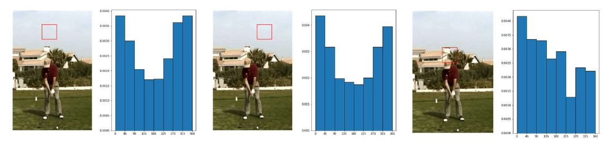
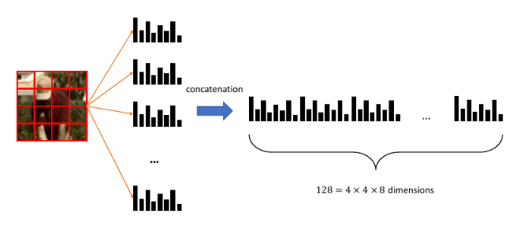

# Rappresentazione di immagini

## 1. Bag of patches 

Una immagine non è altro che una matrice di triple di valori. Gli algoritmi di machine learning necessitano di una funzione $f$ di rappresentazione per lavorare con le immagini
$$
f : I \to \R^n
$$
Dove $I$ è l'insieme di tutte le immagini. Lavorare considerando una immagine come una sequenza di pixel è molto difficile: un pixel preso singolarmente è poco significativo. Una soluzione consiste nel suddividere l'immagine in patch (porzioni di immagine). Una patch può raffigurare un oggetto o una parte di esso, per cui potrebbe assumere una certa semantica. In questo modo, è possibile considerare una immagine come una sacca di patch (bag of image patches). Una patch in una immagine è equivalente ad una parola in un documento nella rappresentazione bag of words. 

### 1.1 Campionamento delle patch

Per il testo si utilizza la tokenizzazione per estrarre le parole da un documento. Un possibile approccio per ottenere le patch da una immagine consiste nel considerarla come una griglia regolare. Questo approccio semplicistico richiede due parametri: la *patch size*, ovvero la grandezza delle patch, ed il *sampling step*, ovvero il numero di pixel di cui dobbiamo spostarci (a destra o in basso) per campionare una nuova patch. In base a tali parametri,  è possibile ottenere patch sovrapposte o non sovrapposte. Se $\frac{\text{patch size}}{2} > \text{sampling step}$ allora si avrà *sovrapposizione* (overlapping) delle patch, altrimenti *non saranno sovrapposte*.  

Una volta campionate ed estratte le patch, ognuna di esse rappresenterà qualcosa (es. un prato, il cielo, una casa, un volto, etc.). Una analisi statistica delle patch può rivelare qualcosa riguardo l'immagine. Ma come assegniamo una certa classe ad una patch? E come creiamo un vocabolario di patch? Il primo passo per rispondere a queste domande è quello di convertire ogni patch in un vettore $x \in \R^n$ utilizzando una funzione di rappresentazione adatta. 

### 1.2 Weighted histogram of edge orientation

Partiremo con una rappresentazione basilare per le patch, chiamata *weighted histogram of edge orientations*. Data un patch in input, il primo step consiste nel convertirla in scala di grigi attraverso una media dei tre canali RGB. Dopodiché si applicano attraverso convoluzione i filtri Sobel X e Sobel Y. Utilizzando i risultati di Sobel X e Sobel Y, che consistono in derivate parziali numeriche,  si calcola la magnitudo e l'orientamento dei contorni (*edges*). Si selezionano gli orientamenti principali
$$
[0°, 45°, 90°, 135°, 180°, 225°, 270°, 315°]
$$
e si calcola l'istogramma degli orientamenti degli edge dell'intera patch. Per ridurre il contributo degli edge deboli, esso viene pesato attraverso la magnitudo ed aggiunto nel bin. In un istogramma regolare, ogni qual volta si trova un edge con un orientamento compreso tra $0°$ e $45°$ si aggiunge 1 al bin corrispondente. In un istogramma pesato, si considera la magnitudo $m$ dell'edge e si somma al bin corrispondente. In qualsiasi caso, l'istogramma può essere normalizzato dividendo ogni bin per la somma di tutti i bin. 

Essendoci 8 orientamenti principali (quindi 8 bin), questa rappresentazione mappa ogni patch dell'immagine in un vettore di dimensione 8. Patch simili avranno istogrammi simili, viceversa per patch differenti. 

### 1.3 Sift descriptor

Il metodo precedente è limitato quando si presentano strutture complesse. Un metodo più elaborato, basato anch'esso sul weighted histogram of edge orientation, è il *SIFT descriptor*. La parola *descriptor* indica che l'algoritmo è utilizzato per descrivere le patch di una immagine. L'idea principale è semplice: 

* Si divide la patch in una griglia $4 \times 4$ 
* Per ogni cella della griglia si calcola l'istogramma pesato
* Tutti gli istogrammi sono concatenati in un vettore da $4 \times 4 \times 8 = 128$ elementi

Il descrittore SIFT permette di mappare una patch in un vettore di dimensione 128, molto più espressivo rispetto ad un singolo istogramma. 

### 1.4 Definizione di un vocabolario

Allo scopo di fornire una rappresentazione di dimensione fissa, è necessario definire un vocabolario. Consideriamo un insieme di immagini e, per ognuna di esse, estraiamo le patch e calcoliamo i SIFT descriptor. Se assumiamo che patch simili hanno SIFT descriptor simili, allora possiamo utilizzare le tecniche di clustering per identificare un numero limitato di patch per comporre il vocabolario. Chiameremo *visual words* i centroidi di ogni cluster. Quando arriva una nuova patch, si utilizza il modello di clustering per assegnarla ad un cluster. 

### 1.5 Bag of visual words 

I paragrafi precedenti descrivono gli elementi principali della rappresentazione *bag of visual words* (analoga alla r. bag of words). Consideriamo un training set $TR$ di immagini, la procedura completa è la seguente: 

* Si estraggono le patch da ogni immagine in $TR$
* Ogni patch sarà descritta con un vettore di dimensione 128 calcolando il SIFT descriptor
* Si applica un algoritmo di clustering sulle patch e si ottengono $k$ cluster
* Ogni cluster ha un centroide, denominato visual word, che viene inserito nel vocabolario
  * Anche la visual word è rappresentata con un descrittore SIFT
  * Il numero di parole nel vocabolario equivale al numero di cluster 

Una volta costruito il vocabolario, è possibile ottenere la rappresentazione bag of visual words di una immagine come segue: 

* Si estraggono le patch dall'immagine
* Per ogni patch si calcola il descrittore SIFT 
* Si assegna ogni descrittore ad una visual word del vocabolario attraverso un classificatore kNN

Ad ogni immagine sono assegnati un certo numero di visual words appartenenti al vocabolario, per cui si può proseguire con tutte le tecniche viste nella rappresentazione bag of word (es. normalizzazione, TF-IDF). Questa tecnica funziona anche per immagini di diversa risoluzione. 

### 1.6 Content-Based Image Retrieval 

La Content-Based Image Retrieval (CBIR) è una interessante applicazione delle tecniche di rappresentazione delle immagini. Consiste nel cercare immagini simili ad una immagine query in un grande dataset di immagini. Disponendo di una buona funzione di rappresentazione, il task è banalmente risolvibile con una ricerca nearest neighbor. 

Per esempio, data una immagine query, si può calcolare la distanza delle rappresentazioni tra la query e le altre immagini nel dataset. Dopodiché si può ordinare il dataset in base alla distanza e prendere i primi $k$ risultati. Questo approccio è del tutto equivalente al kNN. 