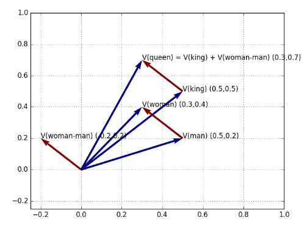
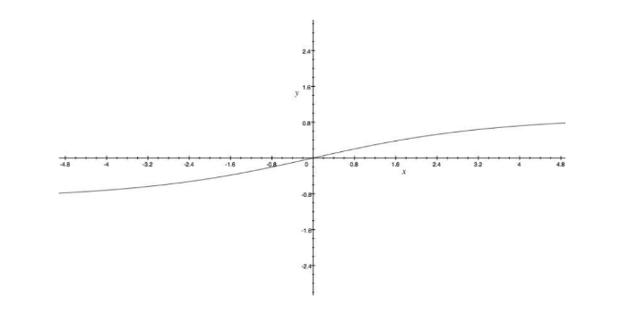

# Sentiment Analysis 

## 1. Semantics in Text Analysis

Sinora le parole all'interno di un documento hanno avuto una funzione prettamente statistica, considerate come un mero simbolo privo di significato.  Questi approcci non tengono conto della semantica delle parole e delle relazioni tra esse, ad esempio: 

> \- All you need is love 
>
> \- I believe that the heart does go on  

La semantica delle due frasi suggerisce che esse sono simili, ma utilizzando una rappresentazione puramente statistica, come la bag of words, le frasi saranno quanto più distanti possibile. Per associare le due frasi abbiamo bisogno di una funzione distanza che misuri il grado di similarità semantica tra parole.  

### 1.1 Contesto di una parola 

Per misurare la distanza tra parole dobbiamo prima mapparle in uno spazio comune attraverso una funzione di rappresentazione $f$. Dopodiché possiamo misurare la loro distanza attraverso una funzione distanza $d$ (es. distanza Euclidea). La proprietà desiderata è che parole con una semantica simile devono trovarsi vicine. 

Consideriamo una parola in un documento, chiameremo *contesto* della parola quell'insieme di parole che appare in una finestra di una data dimensione centrata nella parola. 

> The quick brown fox jumps over the lazy dog 

Ipotizziamo che la parola sia *fox* e che la dimensione della finestra sia $w = 5$, allora il contesto di *fox* sarà:
$$
\{\text{quick, brown, jumps, over}\}
$$
Parole simili sono utilizzate in modi simili in frasi differenti, per cui parole simili avranno contesti simili. Chiameremo questo tipo di rappresentazione *word embeddings*. 

### 1.2 Matrice di co-occorrenza

Dato un corpus di documenti ed un vocabolario $V$, la matrice di *co-occorrenza* $X$ sarà tale che l'elemento $X_{i,j}$ conterà il numero di volte che la parola $j$ occorrà nel contesto della parola $i$. Definiremo 

Dato un corpus di documenti ed un vocabolario $V$, la matrice di co-occorrenza $X$ è tale che: 

* L'elemento $X_{i,j}$ indica il numero di volte in cui la parola $j$ occorre nel contesto della parola $i$. 
* L'elemento $X_i$ indica il numero di volte in cui ogni parola apparen nel contesto della parola $i$.
  * $X_i = \sum_{k} X_{i, k}$ 
* Definiamo $P_{i, j} = \frac{X_{i, j}} {X_i}$ la probabilità che $j$ appaia nel contesto di $i$. 

### 1.3 GloVe

*GloVe*, coniato da *Global Vectors*, è un modello per la rappresentazione distribuita di parole. Affronteremo tale algoritmo in maniera generale, esplorando l'idea principale senza scendere nel dettaglio. 

Sia $i$ una parola, vogliamo ricavarne l'*embedding*, ovvero una rappresentazione $w_i \in \R^d$ di dimensione fissa $d$. La coppia di parole $i, j$ è caratterizzata dalla probabilità $P_{i,j}$. Abbiamo assunto che parole simili hanno contesti simili, per cui due parole $i, j$ simili saranno tali che: 
$$
P_{i, k} \approx P_{j, k}, \forall k
$$
Imponendo che: 
$$
w_i^T w_j  = P_{i,j}
$$
Allora gli embeddings soddisferanno la proprietà desiderata: 
$$
P_{i,k} \approx P_{j,k} 
\Longrightarrow w_i^T w_k \approx w_j^T w_k 
\Longrightarrow w_i \approx w_j
$$
Nella pratica risulta più semplice imporre
$$
w_i^T w_j  = \log P_{i,j}
$$
Poiché
$$
P_{i,j} = \frac {X_{i,j}} {X_i} \Longrightarrow w_i^T w_j = \log \frac {X_{i,j}} {X_i} 
\Longrightarrow w_i^T w_j = \log {X_{i,j}} - \log {X_i}
$$
Dato che il termine $X_i$ non dipende dalla coppia di parole $(i, j)$ possiamo scartarlo ed imporre: 
$$
w_i^T w_j = \log {X_{i,j}}
$$
Il che garantirà comunque che parole simili avranno embedding simili. Per apprendere degli embedding funzionanti, definiamo una funzione costo $J$ da minimizzare: 
$$
J(W) = \sum_{i}^{|V|} \sum_{j}^{|V|} (w_i^T w_j - \log X_{i,j})^2
$$
Dove $W$ rappresenta la matrice la cui $i$-esima riga corrisponde all'embedding $w_i$ della $i$-esima parola. Minimizzare tale funzione $J$ vuol dire trovare degli embeddings in cui risulti pseudo-valida l'espressione $w_i^T w_j  = \log P_{i,j}$. Il logaritmo non può essere calcolato nel caso in cui $X_{i, j} = 0$, per cui si introduce una funzione $f$ definita come segue: 
$$
f(x) = \begin{cases}
(\frac{x}{x_{max}})^\alpha \text{ if }x < x_{max} \\
1 \text{ otherwise}
\end{cases}
$$
Dove generalmente $\alpha = \frac 3 4$ e $x_{max} = 100$. Ridefiniamo la funzione costo $J$
$$
J(W) = \sum_{i}^{|V|} \sum_{j}^{|V|} f(X_{i,j}) (w_i^T w_j - \log X_{i,j})^2
$$
Quando $X_{i,j} = 0$ l'espressione all'interno della sommatoria sarà nulla, altrimenti varrà al più 1. Per minimizzare la funzione $J$ si utilizza l'algoritmo di discesa del gradiente o il metodo dei minimi quadrati: 
$$
W^* = \text{arg}\min_W J(W)
$$

### 1.4 Geometria delle parole

Si è scoperto che le relazioni semantiche tra parole vengono riflesse geometricamente nello spazio di rappresentazione. Ad esempio, la distinzione tra le parole "re" e "regina" o "fratello" e "sorella" è della stessa natura della distinzione più generale tra "uomo" e "donna". Matematicamente, ci aspettiamo che i vettori  differenza tra le parole sopracitate (rappresentate come word embedding) siano pressoché uguali.

Tale proprietà consente di applicare la matematica dei vettori di parole. Se il vettore differenza $w = v(woman) - v(man)$ è uguale al vettore differenza $w' = v(queen) - v(king) = w$ allora, conoscendo solo il vettore $w$ e partendo dal vettore $v(king)$ è possibile calcolare il vettore della parola "queen" come segue: 
$$
v(queen) = v(king) + [v(woman) - v(man)]
$$

## 2. Sentiment analysis

Il sentiment analysis (o opinion mining) è lo studio computazionale dell'opinione, del sentimento e delle emozioni delle persone rispetto a prodotti, servizi, organizzazioni, individui, eventi o topic e i loro attributi (Liu, 2015). Dato un testo contenente delle opinioni, lo scopo di un algoritmo di sentiment analysis è quello di capire se l'emozione dell'autore è positiva o negativa, o in generale studiarne il sentimento. 

### 2.1 Primi approcci

Un primo approccio al sentiment analysis interpreta il problema come un task di classificazione, in cui il testo può essere positivo o negativo. In tal caso, vi sarà un dataset contenente esempi positivi e negativi. Si potrebbe utilizzare la rappresentazione bag of word per allenare un regressore logistico a tale scopo. 

### 2.2 Vader

Se alleniamo il regressore logistico su valutazioni cinematografiche, non è detto che lo stesso modello sia adatto ad analizzare testi provenienti da altri domini (es. i social media). L'algoritmo Vader superà tale difficoltà effettuando una analisi basata sui lessici di parole legate al sentimento (*lexicon of sentiment-related words*). Un lexicon può essere una parola, uno slang o un emoticon. Ogni lexicon è stato valutato da esseri umani con un numero da $-4$ (negativo) a 4 (positivo). Dopo aver raccolto tutte le valutazioni, è stato assegnato ad ogni lexicon uno score ottenuto attraverso una media. 

Lo scopo di Vader è quello di calcolare il punteggio del sentimento di una intera frase. Questo è fatto sommando il sentiment score di ogni lexicon contenuto nella frase:  
$$
z = \sum_{i} s(w_i)
$$
Dove $w_i$ è l'$i$-esima parola ed $s$ è la funzione che ne restituisce il sentiment score. Lo score $z$ è normalizzato utilizzando la seguente formula: 
$$
x = \frac {z}{\sqrt{z^2 + \alpha}}
$$
Dove $\alpha = 15$. Il grafico sottostante visualizza gli effetti della normalizzazione. All'aumentare del valore assoluto di $x$ il sentimento totale converge a -1 o ad 1.

#### 2.2.1 Punteggiatura 

Dopo aver calcolato il sentiment score dell'intera frase, l'algoritmo Vader controlla la punteggiatura. Questo controllo è motivato dall'euristica secondo il cui la punteggiatura aumenta l'espressività della frase e quindi il sentimento ad essa associato. Le regole sono le seguenti ed i valori sono risultati empirici: se il sentimento è positivo, Vader aggiunge $0.292$ per ogni punto esclamativo e $0.18$ per ogni punto interrogativo, se il sentimento è negativo li sottrae. 

#### 2.2.2 Capitalizzazione 

Similmente, scrivere in maiuscolo enfatizza il concetto nella frase, per cui per ogni parola capitalizzata Vader aggiunge $0.733$ se il sentimento è positivo, li sottra se è negativo.

#### 2.2.3 Modificatori di grado 

Modificatori del tipo "very" o "sort of" posso essere utilizzati per amplificare o diminuire il sentimento di una determinata parola. Vader contiene un dizionario di boosters e dampeners (stabilizzatori). Un modificatore posto di fianco ad una parola sottrae (se la parola è negativa) o aggiunge (se è positiva)  $0.293$ al sentiment score totale.  Un secondo modificatore aggiunge o sottrae il $95$% di $0.293$, un terzo aggiunge o sottrae il $90$% e così via. 

 #### 2.2.4 But 

Spesso un "ma" può cambiare la polarità della frase, ad esempio "ti amo, ma non voglio più stare con te" è una frase negativa anche se "ti amo" ha uno score prettamente positivo. Vader contiene un "but" checker che decrementa del 50% lo score della frase antecedente al "but" ed incrementa del 50% lo score della parte seguente. 

#### 2.2.5 Negazioni

Un insieme di espressioni può essere utilizzato per capovolgere il sentimento associato ad una parola, ad esempio "isn't really that great" cambia la polarità della parola "great". Vader controlla questi casi analizzando i trigrammi precedenti ad ogni parola. Quando il trigramma rientra nella lista delle possibili negazioni, il sentimento della parola è decrementato di $0.74$. 

#### 2.2.6 Output di Vader

Per ogni testo analizzato, Vader ritorna una lista di valori: 

* Positive: la percentuale di parole positive 
* Neutral: la percentuale di parole a cui non è associato un sentimento
* Negative: la percentuale di parole negative
* Compound: il sentiment score della frase

